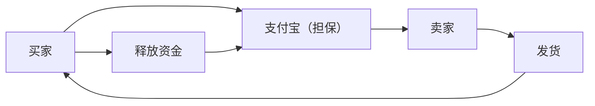

## 1. 阿里巴巴的创立
1999年，马云在公寓的一个房间里与18位伙伴共同创立了公司。最初以B2B匹配网站起步。

## 2. 淘宝网（Taobao）的成功
推出了C2C平台淘宝网，取得了迫使eBay退出中国市场的巨大成功。

## 3. 支付宝创造信用
在中国信用卡尚未普及的情况下，建立了第三方担保支付服务“支付宝”。这成为了中国无现金社会的基础。

## 4. 云计算与双十一
通过阿里云进行基础设施建设，以及“双十一（11月11日）”的大型促销活动等，至今仍在引领中国的数字经济。

## 附加技术验证部分 1

### 1. 阿里巴巴的创立
1999年，马云在公寓的一个房间里与18位伙伴共同创立了公司。最初以B2B匹配网站起步。

### 2. 淘宝网（Taobao）的成功
推出了C2C平台淘宝网，取得了迫使eBay退出中国市场的巨大成功。

### 3. 支付宝创造信用
在中国信用卡尚未普及的情况下，建立了第三方担保支付服务“支付宝”。这成为了中国无现金社会的基础。

### 4. 云计算与双十一
通过阿里云进行基础设施建设，以及“双十一（11月11日）”的大型促销活动等，至今仍在引领中国的数字经济。

## 附加技术验证部分 2

### 1. 阿里巴巴的创立
1999年，马云在公寓的一个房间里与18位伙伴共同创立了公司。最初以B2B匹配网站起步。

### 2. 淘宝网（Taobao）的成功
推出了C2C平台淘宝网，取得了迫使eBay退出中国市场的巨大成功。

### 3. 支付宝创造信用
在中国信用卡尚未普及的情况下，建立了第三方担保支付服务“支付宝”。这成为了中国无现金社会的基础。

### 4. 云计算与双十一
通过阿里云进行基础设施建设，以及“双十一（11月11日）”的大型促销活动等，至今仍在引领中国的数字经济。

## 附加技术验证部分 3

### 1. 阿里巴巴的创立
1999年，马云在公寓的一个房间里与18位伙伴共同创立了公司。最初以B2B匹配网站起步。

### 2. 淘宝网（Taobao）的成功
推出了C2C平台淘宝网，取得了迫使eBay退出中国市场的巨大成功。

### 3. 支付宝创造信用
在中国信用卡尚未普及的情况下，建立了第三方担保支付服务“支付宝”。这成为了中国无现金社会的基础。

### 4. 云计算与双十一
通过阿里云进行基础设施建设，以及“双十一（11月11日）”的大型促销活动等，至今仍在引领中国的数字经济。

## 附加技术验证部分 4

### 1. 阿里巴巴的创立
1999年，马云在公寓的一个房间里与18位伙伴共同创立了公司。最初以B2B匹配网站起步。

### 2. 淘宝网（Taobao）的成功
推出了C2C平台淘宝网，取得了迫使eBay退出中国市场的巨大成功。

### 3. 支付宝创造信用
在中国信用卡尚未普及的情况下，建立了第三方担保支付服务“支付宝”。这成为了中国无现金社会的基础。

### 4. 云计算与双十一
通过阿里云进行基础设施建设，以及“双十一（11月11日）”的大型促销活动等，至今仍在引领中国的数字经济。

## 附加技术验证部分 5

### 1. 阿里巴巴的创立
1999年，马云在公寓的一个房间里与18位伙伴共同创立了公司。最初以B2B匹配网站起步。

### 2. 淘宝网（Taobao）的成功
推出了C2C平台淘宝网，取得了迫使eBay退出中国市场的巨大成功。

### 3. 支付宝创造信用
在中国信用卡尚未普及的情况下，建立了第三方担保支付服务“支付宝”。这成为了中国无现金社会的基础。

### 4. 云计算与双十一
通过阿里云进行基础设施建设，以及“双十一（11月11日）”的大型促销活动等，至今仍在引领中国的数字经济。

## 附加技术验证部分 6

### 1. 阿里巴巴的创立
1999年，马云在公寓的一个房间里与18位伙伴共同创立了公司。最初以B2B匹配网站起步。

### 2. 淘宝网（Taobao）的成功
推出了C2C平台淘宝网，取得了迫使eBay退出中国市场的巨大成功。

### 3. 支付宝创造信用
在中国信用卡尚未普及的情况下，建立了第三方担保支付服务“支付宝”。这成为了中国无现金社会的基础。

### 4. 云计算与双十一
通过阿里云进行基础设施建设，以及“双十一（11月11日）”的大型促销活动等，至今仍在引领中国的数字经济。

## 附加技术验证部分 7

### 1. 阿里巴巴的创立
1999年，马云在公寓的一个房间里与18位伙伴共同创立了公司。最初以B2B匹配网站起步。

### 2. 淘宝网（Taobao）的成功
推出了C2C平台淘宝网，取得了迫使eBay退出中国市场的巨大成功。

### 3. 支付宝创造信用
在中国信用卡尚未普及的情况下，建立了第三方担保支付服务“支付宝”。这成为了中国无现金社会的基础。

### 4. 云计算与双十一
通过阿里云进行基础设施建设，以及“双十一（11月11日）”的大型促销活动等，至今仍在引领中国的数字经济。

## 附加技术验证部分 8

### 1. 阿里巴巴的创立
1999年，马云在公寓的一个房间里与18位伙伴共同创立了公司。最初以B2B匹配网站起步。

### 2. 淘宝网（Taobao）的成功
推出了C2C平台淘宝网，取得了迫使eBay退出中国市场的巨大成功。

### 3. 支付宝创造信用
在中国信用卡尚未普及的情况下，建立了第三方担保支付服务“支付宝”。这成为了中国无现金社会的基础。

### 4. 云计算与双十一
通过阿里云进行基础设施建设，以及“双十一（11月11日）”的大型促销活动等，至今仍在引领中国的数字经济。

## 附加技术验证部分 9

### 1. 阿里巴巴的创立
1999年，马云在公寓的一个房间里与18位伙伴共同创立了公司。最初以B2B匹配网站起步。

### 2. 淘宝网（Taobao）的成功
推出了C2C平台淘宝网，取得了迫使eBay退出中国市场的巨大成功。

### 3. 支付宝创造信用
在中国信用卡尚未普及的情况下，建立了第三方担保支付服务“支付宝”。这成为了中国无现金社会的基础。

### 4. 云计算与双十一
通过阿里云进行基础设施建设，以及“双十一（11月11日）”的大型促销活动等，至今仍在引领中国的数字经济。

## 附加技术验证部分 10

### 1. 阿里巴巴的创立
1999年，马云在公寓的一个房间里与18位伙伴共同创立了公司。最初以B2B匹配网站起步。

### 2. 淘宝网（Taobao）的成功
推出了C2C平台淘宝网，取得了迫使eBay退出中国市场的巨大成功。

### 3. 支付宝创造信用
在中国信用卡尚未普及的情况下，建立了第三方担保支付服务“支付宝”。这成为了中国无现金社会的基础。

### 4. 云计算与双十一
通过阿里云进行基础设施建设，以及“双十一（11月11日）”的大型促销活动等，至今仍在引领中国的数字经济。

## 附加技术验证部分 11

### 1. 阿里巴巴的创立
1999年，马云在公寓的一个房间里与18位伙伴共同创立了公司。最初以B2B匹配网站起步。

### 2. 淘宝网（Taobao）的成功
推出了C2C平台淘宝网，取得了迫使eBay退出中国市场的巨大成功。

### 3. 支付宝创造信用
在中国信用卡尚未普及的情况下，建立了第三方担保支付服务“支付宝”。这成为了中国无现金社会的基础。

### 4. 云计算与双十一
通过阿里云进行基础设施建设，以及“双十一（11月11日）”的大型促销活动等，至今仍在引领中国的数字经济。

## 附加技术验证部分 12

### 1. 阿里巴巴的创立
1999年，马云在公寓的一个房间里与18位伙伴共同创立了公司。最初以B2B匹配网站起步。

### 2. 淘宝网（Taobao）的成功
推出了C2C平台淘宝网，取得了迫使eBay退出中国市场的巨大成功。

### 3. 支付宝创造信用
在中国信用卡尚未普及的情况下，建立了第三方担保支付服务“支付宝”。这成为了中国无现金社会的基础。

### 4. 云计算与双十一
通过阿里云进行基础设施建设，以及“双十一（11月11日）”的大型促销活动等，至今仍在引领中国的数字经济。

## 附加技术验证部分 13

### 1. 阿里巴巴的创立
1999年，马云在公寓的一个房间里与18位伙伴共同创立了公司。最初以B2B匹配网站起步。

### 2. 淘宝网（Taobao）的成功
推出了C2C平台淘宝网，取得了迫使eBay退出中国市场的巨大成功。

### 3. 支付宝创造信用
在中国信用卡尚未普及的情况下，建立了第三方担保支付服务“支付宝”。这成为了中国无现金社会的基础。

### 4. 云计算与双十一
通过阿里云进行基础设施建设，以及“双十一（11月11日）”的大型促销活动等，至今仍在引领中国的数字经济。

## 附加技术验证部分 14

### 1. 阿里巴巴的创立
1999年，马云在公寓的一个房间里与18位伙伴共同创立了公司。最初以B2B匹配网站起步。

### 2. 淘宝网（Taobao）的成功
推出了C2C平台淘宝网，取得了迫使eBay退出中国市场的巨大成功。

### 3. 支付宝创造信用
在中国信用卡尚未普及的情况下，建立了第三方担保支付服务“支付宝”。这成为了中国无现金社会的基础。

### 4. 云计算与双十一
通过阿里云进行基础设施建设，以及“双十一（11月11日）”的大型促销活动等，至今仍在引领中国的数字经济。
