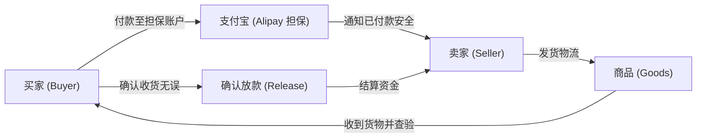

在探讨现代全球数字经济时，任何人都无法忽视中国科技巨擘“阿里巴巴集团（Alibaba Group）”的深远影响。如今，通过智能手机轻点屏幕完成购物并瞬间结算，已成为数亿消费者的生活日常。然而在中国，从零起步构建这套不可或缺的基础设施的正是阿里巴巴。曾任英语教师的马云，究竟如何颠覆了中国传统零售与支付体系，构筑起全球首屈一指的数字化生态帝国？本文将深入复盘阿里巴巴波澜壮阔的发展史及其各个关键转折点的战略抉择。

## 1. 创立原点：杭州湖畔花园的起航（1999年）

阿里巴巴的故事始于 1999 年中国浙江省杭州市湖畔花园的一套普通公寓。在此之前，马云曾创办过早期互联网黄页服务“中国黄页”，但在当时互联网普及率极低的中国，许多先驱性的尝试都遭遇了重重挫折。

然而，马云对互联网“连接世界”的颠覆性潜力深信不疑。1999 年，他将 18 位创业伙伴（著名的“十八罗汉”）召集在公寓中，描绘了一个极其宏大的愿景：“建立一个连接中国中小型制造企业与全球买家的在线平台”。当时的中国正作为“世界工厂”迅猛崛起，但数以百万计的中小企业却严重缺乏直接触达海外采购商的高效渠道。

由此，“Alibaba.com（阿里巴巴国际站）”B2B 电子商务平台应运而生。作为一个帮助海外买家批量采购中国商品的高效渠道，阿里巴巴迎来了爆发式增长。来自高盛以及软银（孙正义）的关键早期注资，为公司的腾飞注入了强大的资金后盾。尤其是软银在 2000 年投入的 2000 万美元，日后成为了风险投资史上最传奇、回报最惊人的经典案例之一。

## 2. 淘宝网诞生与击退 eBay 的史诗战役（2003年）

在 B2B 市场确立了稳固地位之后，阿里巴巴在 2003 年迎来了生死攸关的战略转折点。当时全球最大的在线拍卖平台、美国互联网巨头 eBay 通过收购中国本土的“易趣网（EachNet）”，以雄厚资金全方位杀入中国 C2C（消费者对消费者）电商市场。

马云敏锐地意识到，如果 eBay 彻底垄断了中国的个人零售市场，迟早会蚕食阿里巴巴的 B2B 根基。为此，阿里巴巴迅速在杭州公寓内秘密组建攻坚团队，闭门研发属于自己的 C2C 平台——“淘宝网（Taobao）”（意为“淘尽天下宝物”）。

在对抗 eBay 的殊死较量中，淘宝网打出了一套极其颠覆性的“组合拳”：宣布“所有开店、刊登和交易服务全面免费至少三年”。与向商家收取高昂佣金与刊登费的 eBay 相比，淘宝的零成本策略极大地吸引了广大中小商户。同时，淘宝深刻洞察了中国消费者的消费心理与习惯，打造出界面丰富、烟火气十足的页面，并推出了革命性的即时通讯工具“阿里旺旺”，让买家与卖家可以直接在线砍价、咨询与建立人际信任。

反观 eBay，试图将中国业务生硬接入其全球统一平台，导致严重的本土化水土不服与系统响应缓慢。最终，免费策略与极致本土化让淘宝彻底逆转了战局。到 2006 年，eBay 不得不黯然退出中国 C2C 主流市场，淘宝网一举奠定了在中国消费零售领域的绝对统治地位。

## 3. 支付宝（Alipay）破局：担保交易重塑社会信用（2004年）

随着淘宝网业务的飞速膨胀，阿里巴巴撞上了一堵中国市场独有的巨大高墙——“商业信用缺失”。

在 20 世纪初的中国，信用卡普及率微乎其微，大众对网络交易充满戒备：“先付款怕商家不发货，先发货怕买家不给钱”。传统的货到付款与银行汇款效率极其低下，根本无法支撑海量线上交易的爆发。

为了攻克这一瓶颈，阿里巴巴于 2004 年推出了划时代的“支付宝（Alipay）”。支付宝独创了“第三方担保交易（Escrow）”模式：

```mermaid
flowchart LR
    Buyer["买家 (Buyer)"] -->|付款至担保账户| Alipay["支付宝 (Alipay 担保)"]
    Alipay -->|通知已付款安全| Seller["卖家 (Seller)"]
    Seller -->|发货物流| Goods["商品 (Goods)"]
    Goods -->|收到货物并查验| Buyer
    Buyer -->|确认收货无误| Release["确认放款 (Release)"]
    Release -->|结算资金| Seller
```

正如该流程所示，买家支付的款项首先由支付宝作为受信任的第三方暂时冻结，只有在买家亲自确认收货且无质量争议后，支付宝才会正式将款项转入卖家账户。这一机制彻底消除了交易双方的顾虑，让素不相识的陌生人在网络上安心达成了买卖。

支付宝随后从单一的电商工具，迅速进化为覆盖水电气生活缴费、线下二维码扫码支付、余额宝理财以及芝麻信用评分的超级金融基础设施。这块业务日后独立为“蚂蚁集团（Ant Group）”，成为推动中国跨越式迈入全球最前沿“无现金社会”的核心引擎。

## 4. 天猫（Tmall）崛起与向 B2C 品牌的升级（2008年）

淘宝网虽然赢得了海量用户，但因其开放式 C2C 的天然属性，假冒伪劣和商品质量参差不齐的问题日渐凸显。随着中国居民可支配收入的持续攀升，消费者对正品行货与知名品牌的追求愈发强烈。2008 年，阿里巴巴正式上线了“淘宝商城”，随后更名为“天猫（Tmall）”。

天猫采取了严格的企业准入审核制度，仅允许拥有官方资质的品牌方与正规代理商入驻。这一举措彻底打破了电商假货的阴霾，让消费者能够放心购买全球大牌。如今，苹果、耐克、优衣库等跨国巨头均将天猫旗舰店作为在华零售的核心阵地，天猫也成为了中国高品质消费电商的黄金标准。

## 5. 阿里云（Alibaba Cloud）启航与底层基础设施突破（2009年）

面对每年几何级数暴涨的电商并发洪峰，传统的“IOE架构”（IBM大型机、Oracle数据库、EMC存储）在成本和扩展性上已无法承受。2009 年，阿里巴巴果断成立“阿里云（Aliyun）”，由技术掌舵人王坚博士带领团队，毅然开启了自主云计算系统“飞天（Apsara）”的艰难研发历程。

在当时，云计算在中国业界饱受质疑甚至被讥讽为“空中楼阁”，但马云与阿里管理层坚信：数据与计算能力是未来商业社会不可或缺的核心石油。经历了无数次技术攻关与双十一洪峰的极限淬炼，阿里云不仅成功支撑了阿里自身业务，更走出国门服务于全球数以百万计的政企客户，成长为中国第一、全球领先的云计算巨头。

## 6. “双十一（Double 11）”：定义全球最大购物节（2009年至今）

阿里巴巴卓越的市场运作能力与技术底座的集大成者，当属每年 11 月 11 日的“双十一全球狂欢季”。

原本 11 月 11 日只是中国年轻人在网络上调侃自嘲的“光棍节”。时任淘宝商城负责人的张勇（后出任阿里董事局主席兼 CEO）敏锐地捕捉到商机，将其重塑为“单身人士犒劳自己、尽情购物”的狂欢节点。

2009 年首届双十一仅有 27 家品牌参与，成交额仅为 5200 万元；而随着年代推移，双十一交易额呈指数级爆发，达到数千亿元量级，其交易规模已将美国黑色星期五与网络星期一的总和远远甩在身后。阿里云在此期间展现出的每秒数十万笔订单并发处理零故障能力，向全球展示了中国底层计算架构的硬核力量。

## 7. “新零售”革命与商业生态系统的闭环（2016年至今）

2016 年，马云在云栖大会上正式提出：“纯电商的时代已经结束，未来属于线上、线下、物流与数据深度融合的‘新零售’时代”。

新零售的标杆之作便是阿里巴巴自主孵化的智能生鲜超市“盒马鲜生（Freshippo）”。在盒马，实体门店兼具高端体验超市、餐饮堂食和线上订单前置分拣仓的三重角色。用户既可到店选购，也可通过 App 下单，享受门店周边 3 公里范围内最快 30 分钟送达的极速履约。

支撑这一庞大履约网络的，是阿里巴巴旗下的“菜鸟网络（Cainiao）”。菜鸟并不采用重资产购置大量车辆与仓库的模式，而是依托大数据与智能算法，搭建起链接全社会物流资源的大数据协同网络，实现全链路干线与末端配送的极致提效。

## 8. 全球化出海与面临的全新考验

阿里巴巴的雄心绝不仅限于本土市场。通过控股东南亚头部电商 Lazada、土耳其电商 Trendyol 以及自主运营的全球跨境零售电商速卖通（AliExpress），阿里积极将其“让天下没有难做的生意（Make it easy to do business anywhere）”的使命推向世界舞台。

然而，阿里的商业征程并非坦途。随着马云逐渐淡出管理一线，集团面临着深刻的外部与内部变革。2020 年末，蚂蚁集团史上最大的 IPO 被监管部门暂缓，随后阿里巴巴也遭遇了反垄断审查与巨额处罚。

与此同时，拼多多依托下沉市场社交电商迅猛崛起，字节跳动旗下的抖音通过直播电商凶猛分流，使阿里的电商护城河面临空前挑战。为此，阿里巴巴在 2023 年启动了成立以来最深刻的“1+6+N”组织变革，拆分为六大独立业务集团，旨在重塑敏捷机制、释放创新活力。

## 9. 结语：阿里巴巴的商业遗产与未来启示

从 1999 年杭州公寓里朴实无华的创业团队，到如今横跨商业零售、数字金融、智慧物流、云计算等领域的数字巨擘，阿里巴巴的发展史正是中国数字化经济跃迁的生动缩影。

击溃 eBay、借支付宝建立信任契约、勇攀云计算技术珠峰、开创新零售模式……阿里在过去四分之一个世纪里积累的技术积淀与商业创新基因，必将继续深刻影响全球数字经济的演进路径。
