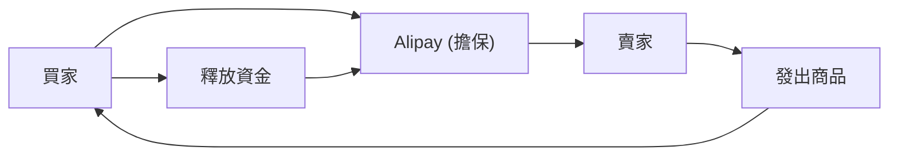

## 1. 阿里巴巴的創立
1999年，馬雲在公寓的一個房間裡與18位夥伴共同創立。最初以B2B媒合網站起步。

## 2. Taobao（淘寶網）的成功
推出C2C平台Taobao，取得了迫使eBay退出中國市場的巨大成功。

## 3. Alipay帶來的信用創造
在信用卡尚未普及的中國，建立了擔保支付服務「Alipay」。這成為了中國無現金社會的基礎。

## 4. 雲端與雙11
透過Alibaba Cloud建構基礎設施，以及「雙11（11月11日）」的龐大促銷活動等，至今仍持續引領著中國的數位經濟。

## 追加技術驗證部分 1

### 1. 阿里巴巴的創立
1999年，馬雲在公寓的一個房間裡與18位夥伴共同創立。最初以B2B媒合網站起步。

### 3. Alipay帶來的信用創造
在信用卡尚未普及的中國，建立了擔保支付服務「Alipay」。這成為了中國無現金社會的基礎。

## 追加技術驗證部分 2

### 1. 阿里巴巴的創立
1999年，馬雲在公寓的一個房間裡與18位夥伴共同創立。最初以B2B媒合網站起步。

### 3. Alipay帶來的信用創造
在信用卡尚未普及的中國，建立了擔保支付服務「Alipay」。這成為了中國無現金社會的基礎。

## 追加技術驗證部分 3

### 1. 阿里巴巴的創立
1999年，馬雲在公寓的一個房間裡與18位夥伴共同創立。最初以B2B媒合網站起步。

### 3. Alipay帶來的信用創造
在信用卡尚未普及的中國，建立了擔保支付服務「Alipay」。這成為了中國無現金社會的基礎。

## 追加技術驗證部分 4

### 1. 阿里巴巴的創立
1999年，馬雲在公寓的一個房間裡與18位夥伴共同創立。最初以B2B媒合網站起步。

### 3. Alipay帶來的信用創造
在信用卡尚未普及的中國，建立了擔保支付服務「Alipay」。這成為了中國無現金社會的基礎。

## 追加技術驗證部分 5

### 1. 阿里巴巴的創立
1999年，馬雲在公寓的一個房間裡與18位夥伴共同創立。最初以B2B媒合網站起步。

### 3. Alipay帶來的信用創造
在信用卡尚未普及的中國，建立了擔保支付服務「Alipay」。這成為了中國無現金社會的基礎。

## 追加技術驗證部分 6

### 1. 阿里巴巴的創立
1999年，馬雲在公寓的一個房間裡與18位夥伴共同創立。最初以B2B媒合網站起步。

### 3. Alipay帶來的信用創造
在信用卡尚未普及的中國，建立了擔保支付服務「Alipay」。這成為了中國無現金社會的基礎。

## 追加技術驗證部分 7

### 1. 阿里巴巴的創立
1999年，馬雲在公寓的一個房間裡與18位夥伴共同創立。最初以B2B媒合網站起步。

### 3. Alipay帶來的信用創造
在信用卡尚未普及的中國，建立了擔保支付服務「Alipay」。這成為了中國無現金社會的基礎。

## 追加技術驗證部分 8

### 1. 阿里巴巴的創立
1999年，馬雲在公寓的一個房間裡與18位夥伴共同創立。最初以B2B媒合網站起步。

### 3. Alipay帶來的信用創造
在信用卡尚未普及的中國，建立了擔保支付服務「Alipay」。這成為了中國無現金社會的基礎。

## 追加技術驗證部分 9

### 1. 阿里巴巴的創立
1999年，馬雲在公寓的一個房間裡與18位夥伴共同創立。最初以B2B媒合網站起步。

### 3. Alipay帶來的信用創造
在信用卡尚未普及的中國，建立了擔保支付服務「Alipay」。這成為了中國無現金社會的基礎。

## 追加技術驗證部分 10

### 1. 阿里巴巴的創立
1999年，馬雲在公寓的一個房間裡與18位夥伴共同創立。最初以B2B媒合網站起步。

### 3. Alipay帶來的信用創造
在信用卡尚未普及的中國，建立了擔保支付服務「Alipay」。這成為了中國無現金社會的基礎。

## 追加技術驗證部分 11

### 1. 阿里巴巴的創立
1999年，馬雲在公寓的一個房間裡與18位夥伴共同創立。最初以B2B媒合網站起步。

### 3. Alipay帶來的信用創造
在信用卡尚未普及的中國，建立了擔保支付服務「Alipay」。這成為了中國無現金社會的基礎。

## 追加技術驗證部分 12

### 1. 阿里巴巴的創立
1999年，馬雲在公寓的一個房間裡與18位夥伴共同創立。最初以B2B媒合網站起步。

### 3. Alipay帶來的信用創造
在信用卡尚未普及的中國，建立了擔保支付服務「Alipay」。這成為了中國無現金社會的基礎。

## 追加技術驗證部分 13

### 1. 阿里巴巴的創立
1999年，馬雲在公寓的一個房間裡與18位夥伴共同創立。最初以B2B媒合網站起步。

### 3. Alipay帶來的信用創造
在信用卡尚未普及的中國，建立了擔保支付服務「Alipay」。這成為了中國無現金社會的基礎。

## 追加技術驗證部分 14

### 1. 阿里巴巴的創立
1999年，馬雲在公寓的一個房間裡與18位夥伴共同創立。最初以B2B媒合網站起步。

### 3. Alipay帶來的信用創造
在信用卡尚未普及的中國，建立了擔保支付服務「Alipay」。這成為了中國無現金社會的基礎。

