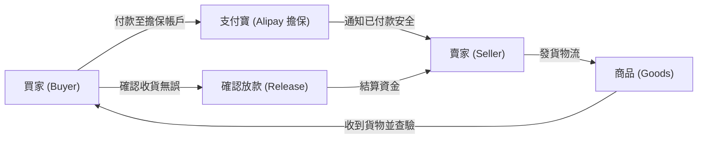

在探討現代全球數位經濟時，任何人都無法忽視中國科技巨擘「阿里巴巴集團（Alibaba Group）」的深遠影響。如今，透過智慧型手機輕觸螢幕完成購物並瞬間結算，已成為數億消費者的生活日常。然而在中國，從零起步構建這套不可或缺之基礎設施的正是阿里巴巴。曾任英語教師的馬雲，究竟如何顛覆了中國傳統零售與支付體系，構築起全球首屈一指的數位化生態帝國？本文將深入復盤阿里巴巴波瀾壯闊的發展史及其各個關鍵轉折點的戰略抉擇。

## 1. 創立原點：杭州湖畔花園的起航（1999年）

阿里巴巴的故事始於 1999 年中國浙江省杭州市湖畔花園的一套普通公寓。在此之前，馬雲曾創辦過早期網際網路黃頁服務「中國黃頁」，但在當時網路普及率極低的中國，許多先驅性的嘗試都遭遇了重重挫折。

然而，馬雲對網路「連結世界」的顛覆性潛力深信不疑。1999 年，他將 18 位創業夥伴（著名的「十八羅漢」）召集在公寓中，描繪了一個極其宏大的願景：「建立一個連結中國中小型製造企業與全球買家的線上平台」。當時的中國正作為「世界工廠」迅速崛起，但數以百萬計的中小企業卻嚴重缺乏直接接觸海外採購商的高效管道。

由此，「Alibaba.com（阿里巴巴國際站）」B2B 電子商務平台應運而生。作為一個協助海外買家批量採購中國商品的高效平台，阿里巴巴迎來了爆發式增長。來自高盛以及軟銀（孫正義）的關鍵早期注資，為公司的騰飛注入了強大的資金後盾。尤其是軟銀在 2000 年投入的 2000 萬美元，日後成為了創投史上最傳奇、回報最驚人的經典案例之一。

## 2. 淘寶網誕生與擊退 eBay 的史詩戰役（2003年）

在 B2B 市場確立了穩固地位之後，阿里巴巴在 2003 年迎來了生死攸關的戰略轉折點。當時全球最大的線上拍賣平台、美國網路巨擘 eBay 透過收購中國本土的「易趣網（EachNet）」，以雄厚資金全方位殺入中國 C2C（消費者對消費者）電商市場。

馬雲敏銳地意識到，如果 eBay 徹底壟斷了中國的個人零售市場，遲早會蠶食阿里巴巴的 B2B 根基。為此，阿里巴巴迅速在杭州公寓內秘密組建攻堅團隊，閉門研發屬於自己的 C2C 平台——「淘寶網（Taobao）」（意為「淘盡天下寶物」）。

在對抗 eBay 的殊死較量中，淘寶網打出了一套極具顛覆性的戰略：宣布「所有開店、刊登和交易服務全面免費至少三年」。與向商家收取高昂佣金與刊登費的 eBay 相比，淘寶的零成本策略極大地吸引了廣大中小商戶。同時，淘寶深刻洞察了中國消費者的消費心理與習慣，打造出介面豐富、煙火氣十足的頁面，並推出了革命性的即時通訊工具「阿里旺旺」，讓買家與賣家可以直接線上議價、諮詢與建立人際信任。

反觀 eBay，試圖將中國業務生硬接入其全球統一平台，導致嚴重的在地化水土不服與系統回應緩慢。最終，免費策略與極致在地化讓淘寶徹底逆轉了戰局。到 2006 年，eBay 不得不黯然退出中國 C2C 主流市場，淘寶網一舉奠定了在中國消費零售領域的絕對統治地位。

## 3. 支付寶（Alipay）破局：擔保交易重塑社會信用（2004年）

隨著淘寶網業務的飛速膨脹，阿里巴巴撞上了一堵中國市場獨有的巨大高牆——「商業信用缺失」。

在 20 世紀初的中國，信用卡普及率微乎其微，大眾對網路交易充滿戒備：「先付款怕商家不發貨，先發貨怕買家不給錢」。傳統的貨到付款與銀行匯款效率極其低下，根本無法支撐海量線上交易的爆發。

為了攻克這一瓶頸，阿里巴巴於 2004 年推出了劃時代的「支付寶（Alipay）」。支付寶獨創了「第三方擔保交易（Escrow）」模式：

```mermaid
flowchart LR
    Buyer["買家 (Buyer)"] -->|付款至擔保帳戶| Alipay["支付寶 (Alipay 擔保)"]
    Alipay -->|通知已付款安全| Seller["賣家 (Seller)"]
    Seller -->|發貨物流| Goods["商品 (Goods)"]
    Goods -->|收到貨物並查驗| Buyer
    Buyer -->|確認收貨無誤| Release["確認放款 (Release)"]
    Release -->|結算資金| Seller
```

正如該流程所示，買家支付的款項首先由支付寶作為受信任的第三方暫時凍結，只有在買家親自確認收貨且無品質爭議後，支付寶才會正式將款項轉入賣家帳戶。這一機制徹底消除了交易雙方的顧慮，讓素不相識的陌生人在網路上安心達成了買賣。

支付寶隨後從單一的電商工具，迅速進化為覆蓋水電氣生活繳費、線下 QR Code 掃碼支付、餘額寶理財以及芝麻信用評分的超級金融基礎設施。這塊業務日後獨立為「螞蟻集團（Ant Group）」，成為推動中國跨越式邁入全球最前沿「無現金社會」的核心引擎。

## 4. 天貓（Tmall）崛起與向 B2C 品牌的升級（2008年）

淘寶網雖然贏得了海量用戶，但因其開放式 C2C 的天然屬性，仿冒品和商品品質參差不齊的問題日漸凸顯。隨著中國居民可支配所得的持續攀升，消費者對正品行貨與知名品牌的追求愈發強烈。2008 年，阿里巴巴正式上線了「淘寶商城」，隨後更名為「天貓（Tmall）」。

天貓採取了嚴格的企業准入審核制度，僅允許擁有官方資質的品牌方與正規代理商進駐。這一舉措徹底打破了電商仿冒品的陰霾，讓消費者能夠放心購買全球大牌。如今，蘋果、Nike、UNIQLO 等跨國巨頭均將天貓旗艦店作為在華零售的核心陣地，天貓也成為了中國高品質消費電商的黃金標準。

## 5. 阿里雲（Alibaba Cloud）啟航與底層基礎設施突破（2009年）

面對每年幾何級數暴漲的電商高並發洪峰，傳統的「IOE 架構」（IBM 大型主機、Oracle 資料庫、EMC 儲存設備）在成本和擴展性上已無法承受。2009 年，阿里巴巴果斷成立「阿里雲（Aliyun）」，由技術掌舵人王堅博士帶領團隊，毅然開啟了自主雲端運算系統「飛天（Apsara）」的艱難研發歷程。

在當時，雲端運算在中國業界飽受質疑甚至被譏諷為「空中樓閣」，但馬雲與阿里管理層堅信：數據與運算能力是未來商業社會不可或缺的核心石油。經歷了無數次技術攻堅與雙十一洪峰的極限淬煉，阿里雲不僅成功支撐了阿里自身業務，更走出國門服務於全球數以百萬計的政企客戶，成長為中國第一、全球領先的雲端運算巨頭。

## 6. 「雙十一（Double 11）」：定義全球最大購物節（2009年至今）

阿里巴巴卓越的行銷運作能力與技術底座的集大成者，當屬每年 11 月 11 日的「雙十一全球狂歡季」。

原本 11 月 11 日只是中國年輕人在網路上調侃自嘲的「光棍節」。時任淘寶商城負責人的張勇（後出任阿里董事局主席兼 CEO）敏銳地捕捉到商機，將其重塑為「單身人士犒勞自己、盡情購物」的狂歡慶典。

2009 年首屆雙十一僅有 27 家品牌參與，成交額僅為 5200 萬元；而隨著年代推移，雙十一交易額呈指數級爆發，達到數千億元規模，其交易規模已將美國黑色星期五與網路星期一的總和遠遠甩在身後。阿里雲在此期間展現出的每秒數十萬筆訂單並發處理零故障能力，向全球展示了中國底層運算架構的強韌實力。

## 7. 「新零售」革命與商業生態系統的閉環（2016年至今）

2016 年，馬雲在雲棲大會上正式提出：「純電商的時代已經結束，未來屬於線上、線下、物流與數據深度融合的『新零售』時代」。

新零售的標竿之作便是阿里巴巴自主孵化的智慧生鮮超市「盒馬鮮生（Freshippo）」。在盒馬，實體門市兼具高端體驗超市、餐飲堂食和線上訂單前置分揀倉的三重角色。用戶既可到店選購，也可透過 App 下單，享受門市周邊 3 公里範圍內最快 30 分鐘送達的極速履約。

支撐這一龐大履約網絡的，是阿里巴巴旗下的「菜鳥網絡（Cainiao）」。菜鳥並不採用重資產購置大量車輛與倉庫的模式，而是依託大數據與智慧演算法，搭建起連結全社會物流資源的大數據協同網絡，實現全鏈路幹線與末端配送的極致提效。

## 8. 全球化出海與面臨的全新考驗

阿里巴巴的雄心絕不僅限於本土市場。透過控股東南亞頭部電商 Lazada、土耳其電商 Trendyol 以及自主營運的全球跨境零售電商速賣通（AliExpress），阿里積極將其「讓天下沒有難做的生意（Make it easy to do business anywhere）」的使命推向世界舞台。

然而，阿里的商業征程並非坦途。隨著馬雲逐漸淡出管理一線，集團面臨著深刻的外部與內部變革。2020 年末，螞蟻集團史上最大的 IPO 被監管部門暫緩，隨後阿里巴巴也遭遇了反壟斷審查與巨額處罰。

與此同時，拼多多依託下沉市場社交電商迅猛崛起，字節跳動旗下的抖音透過直播電商凶猛分流，使阿里的電商護城河面臨空前挑戰。為此，阿里巴巴在 2023 年啟動了成立以來最深刻的「1+6+N」組織變革，拆分為六大獨立業務集團，旨在重塑敏捷機制、釋放創新活力。

## 9. 結語：阿里巴巴的商業遺產與未來啟示

從 1999 年杭州公寓裡樸實無華的創業團隊，到如今橫跨商業零售、數位金融、智慧物流、雲端運算等領域的數位巨擘，阿里巴巴的發展史正是中國數位化經濟躍遷的生動縮影。

擊潰 eBay、借支付寶建立信任契約、勇攀雲端運算技術高峰、開創新零售模式……阿里在過去四分之一個世紀裡累積的技術積澱與商業創新基因，必將繼續深刻影響全球數位經濟的演進路徑。
