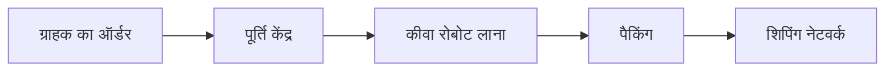

## 1. ऑनलाइन किताबों की दुकान के रूप में शुरुआत
1994 में, जेफ बेजोस ने "एवरीथिंग स्टोर" की परिकल्पना के साथ इसकी शुरुआत की।

## 2. AWS (अमेज़न वेब सर्विसेज) का जन्म
आंतरिक बुनियादी ढांचे को कुशल बनाने से पैदा हुई क्लाउड कंप्यूटिंग सेवा, AWS।
