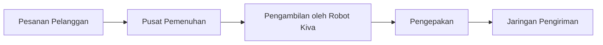

## 1. Awal Mula sebagai Toko Buku Online
Pada tahun 1994, Jeff Bezos memulai dengan visi "Everything Store".

## 2. Lahirnya AWS (Amazon Web Services)
AWS, layanan komputasi awan yang lahir dari efisiensi infrastruktur internal.
