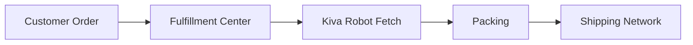

## 1. オンライン書店としての船出
1994年、ジェフ・ベゾスは「Everything Store」の構想を抱きスタートしました。

## 2. AWS（Amazon Web Services）の誕生
社内インフラの効率化から生まれたクラウドコンピューティングサービスAWS。

## 追加技術検証パート 1

### 1. オンライン書店としての船出
1994年、ジェフ・ベゾスは「Everything Store」の構想を抱きスタートしました。

### 2. AWS（Amazon Web Services）の誕生
社内インフラの効率化から生まれたクラウドコンピューティングサービスAWS。

## 追加技術検証パート 2

### 1. オンライン書店としての船出
1994年、ジェフ・ベゾスは「Everything Store」の構想を抱きスタートしました。

### 2. AWS（Amazon Web Services）の誕生
社内インフラの効率化から生まれたクラウドコンピューティングサービスAWS。

## 追加技術検証パート 3

### 1. オンライン書店としての船出
1994年、ジェフ・ベゾスは「Everything Store」の構想を抱きスタートしました。

### 2. AWS（Amazon Web Services）の誕生
社内インフラの効率化から生まれたクラウドコンピューティングサービスAWS。

## 追加技術検証パート 4

### 1. オンライン書店としての船出
1994年、ジェフ・ベゾスは「Everything Store」の構想を抱きスタートしました。

### 2. AWS（Amazon Web Services）の誕生
社内インフラの効率化から生まれたクラウドコンピューティングサービスAWS。

## 追加技術検証パート 5

### 1. オンライン書店としての船出
1994年、ジェフ・ベゾスは「Everything Store」の構想を抱きスタートしました。

### 2. AWS（Amazon Web Services）の誕生
社内インフラの効率化から生まれたクラウドコンピューティングサービスAWS。

## 追加技術検証パート 6

### 1. オンライン書店としての船出
1994年、ジェフ・ベゾスは「Everything Store」の構想を抱きスタートしました。

### 2. AWS（Amazon Web Services）の誕生
社内インフラの効率化から生まれたクラウドコンピューティングサービスAWS。

## 追加技術検証パート 7

### 1. オンライン書店としての船出
1994年、ジェフ・ベゾスは「Everything Store」の構想を抱きスタートしました。

### 2. AWS（Amazon Web Services）の誕生
社内インフラの効率化から生まれたクラウドコンピューティングサービスAWS。

## 追加技術検証パート 8

### 1. オンライン書店としての船出
1994年、ジェフ・ベゾスは「Everything Store」の構想を抱きスタートしました。

### 2. AWS（Amazon Web Services）の誕生
社内インフラの効率化から生まれたクラウドコンピューティングサービスAWS。

## 追加技術検証パート 9

### 1. オンライン書店としての船出
1994年、ジェフ・ベゾスは「Everything Store」の構想を抱きスタートしました。

### 2. AWS（Amazon Web Services）の誕生
社内インフラの効率化から生まれたクラウドコンピューティングサービスAWS。

## 追加技術検証パート 10

### 1. オンライン書店としての船出
1994年、ジェフ・ベゾスは「Everything Store」の構想を抱きスタートしました。

### 2. AWS（Amazon Web Services）の誕生
社内インフラの効率化から生まれたクラウドコンピューティングサービスAWS。

## 追加技術検証パート 11

### 1. オンライン書店としての船出
1994年、ジェフ・ベゾスは「Everything Store」の構想を抱きスタートしました。

### 2. AWS（Amazon Web Services）の誕生
社内インフラの効率化から生まれたクラウドコンピューティングサービスAWS。

## 追加技術検証パート 12

### 1. オンライン書店としての船出
1994年、ジェフ・ベゾスは「Everything Store」の構想を抱きスタートしました。

### 2. AWS（Amazon Web Services）の誕生
社内インフラの効率化から生まれたクラウドコンピューティングサービスAWS。

## 追加技術検証パート 13

### 1. オンライン書店としての船出
1994年、ジェフ・ベゾスは「Everything Store」の構想を抱きスタートしました。

### 2. AWS（Amazon Web Services）の誕生
社内インフラの効率化から生まれたクラウドコンピューティングサービスAWS。

## 追加技術検証パート 14

### 1. オンライン書店としての船出
1994年、ジェフ・ベゾスは「Everything Store」の構想を抱きスタートしました。

### 2. AWS（Amazon Web Services）の誕生
社内インフラの効率化から生まれたクラウドコンピューティングサービスAWS。
