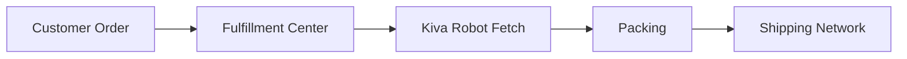

## 1. オンライン書店としての船出
1994年、ジェフ・ベゾスは「Everything Store」の構想を抱きスタートしました。

```mermaid
flowchart LR
    Customer["Customer Order"] --> FC["Fulfillment Center"]
    FC --> Robot["Kiva Robot Fetch"]
    Robot --> Pack["Packing"]
    Pack --> Ship["Shipping Network"]
```

## 2. AWS（Amazon Web Services）の誕生
社内インフラの効率化から生まれたクラウドコンピューティングサービスAWS。
