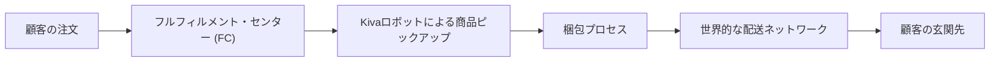

## 1. ガレージからの船出：「エブリシング・ストア」への野望

Amazonの歴史は、1994年7月にジェフ・ベゾス（Jeff Bezos）がワシントン州ベルビューの自宅ガレージで創業したことから始まります。当時、ヘッジファンド「D. E. Shaw」で副社長を務めていたベゾスは、インターネットの使用量が年間2,300%という驚異的なペースで成長していることに気づきました。彼はこの爆発的な成長の波に乗るため、安定した高給職を辞め、インターネット上で商品を販売するという未知の領域へ足を踏み入れたのです。

最初に彼が作成したリストには、オンラインで販売可能な20の製品が含まれていました。そこから、書籍、CD、ビデオ、コンピュータハードウェア、ソフトウェアの5つに絞り込まれ、最終的に「書籍」が最初の商材として選ばれました。書籍は物理的に頑丈で、世界中に数百万のタイトルが存在し、物理的な店舗では到底すべてを在庫することが不可能であるため、インターネットの無限の棚（ロングテール）を活かすのに最も適していたからです。

1995年7月、Amazon.comは正式にオンライン書店としてオープンしました。ウェブサイトは非常にシンプルでしたが、初日から注文が入り、1ヶ月後には全米50州と45カ国に書籍を発送し、週の売上は2万ドルに達していました。

## 2. ドットコムバブルの波と書籍からの脱却

1997年5月15日、Amazonは1株あたり18ドルで新規株式公開（IPO）を果たしました。調達した資金をもとに、ベゾスは「何でも揃う店（エブリシング・ストア）」という究極の目標に向けて動き出します。1998年にはCDやDVDの販売を開始し、1999年には家電、おもちゃ、ゲーム、ソフトウェア、日用品など、急速に商品ラインナップを拡大していきました。

この時期は「ドットコムバブル」の真っ只中であり、多くのインターネット企業が利益を度外視して成長を追求していました。Amazonも例外ではなく、利益を上げるのではなく、売上と顧客基盤の拡大に巨額の投資を行っていました。「Get Big Fast（早く大きくなれ）」というスローガンのもと、インフラやマーケティングに資金を投じた結果、1990年代後半のAmazonは多額の赤字を計上していました。

2000年代初頭にバブルが崩壊し、多くのIT企業が倒産する中、Amazonの株価も大暴落（100ドル超から一桁台へ）しました。しかし、Amazonはビジネスモデルの強靭さを示し、危機を乗り越えます。2001年の第4四半期には、ついに創業以来初となる500万ドルの黒字化を達成し、市場の懐疑論を払拭しました。

## 3. アマゾン・マーケットプレイスと物流網の構築

Amazonの成長を加速させたもう一つの要因は、2000年に立ち上げた「Amazon Marketplace（アマゾン・マーケットプレイス）」です。これにより、サードパーティ（第三者）の販売者がAmazonのプラットフォーム上で自社の商品を販売できるようになりました。Amazonは自社で在庫を抱えることなく商品数を劇的に増やすことができ、同時に販売手数料を得るという高収益なビジネスモデルを手に入れました。現在では、Amazonの全販売数の過半数をこのサードパーティによる販売が占めています。

この膨大な注文を処理するために、Amazonは世界規模での物流網（フルフィルメント・センター：FC）の構築を急ピッチで進めました。単なる倉庫ではなく、バーコード、コンベアベルト、そして後にはロボット（2012年のKiva Systems買収による）を駆使した高度な自動化施設です。

## 4. Amazon Primeの誕生：顧客ロイヤルティの革命

2005年、AmazonはEコマースの常識を覆すプログラム「Amazon Prime（アマゾンプライム）」を発表しました。年会費79ドル（当時）を支払えば、対象商品のお急ぎ便（2日以内配送）が何度でも無料で利用できるという画期的なサービスです。

社内でも「配送料の無料化は利益を圧迫する」という強い反対意見がありましたが、ベゾスは「プライム会員になることで、顧客はAmazonで買い物をする頻度と額が確実に増える」と確信していました。その予想は見事に的中し、プライムは顧客をAmazonのエコシステムに強力に縛り付ける（ロックインする）最強の武器となりました。

のちにプライムビデオ（Prime Video）やプライムミュージック（Prime Music）といったデジタルコンテンツ、Kindle本の無料閲覧特典などが追加され、プライム会員は全世界で2億人を超える巨大なコミュニティへと成長しています。

## 5. AWS（Amazon Web Services）の衝撃：クラウド帝国の誕生

Amazonの歴史において、Eコマースに匹敵する、あるいはそれ以上のインパクトをもたらしたのが2006年にローンチされた「AWS（Amazon Web Services）」です。

元々、Amazonは自社の急成長するEコマース事業を支えるため、複雑化するITインフラの管理に悩まされていました。それを解決するために、インフラをコンポーネント化し、社内の開発チームがAPI経由で簡単にサーバーやストレージを利用できる仕組みを構築しました。この「社内向けの効率化システム」が外部の開発者にとっても価値があることに気づいたAmazonは、これを従量課金制のサービスとして外部に提供し始めました。

代表的なサービスとして「Amazon EC2 (Elastic Compute Cloud)」「Amazon S3 (Simple Storage Service)」がリリースされ、これが現代の「クラウドコンピューティング」の幕開けとなりました。スタートアップ企業は高価なサーバーを購入することなく、必要な時に必要な分だけITリソースを利用できるようになり、AirbnbやNetflixなどの急成長を支えました。

現在、AWSは世界のクラウドインフラ市場で圧倒的なシェア（約30%超）を誇り、Amazon全体の営業利益の大部分（年によっては半分以上）を稼ぎ出す、同社の最も重要な「金のなる木（キャッシュカウ）」となっています。

## 6. KindleからAlexaへ：ハードウェアとAIエコシステムの拡大

Amazonはソフトウェアやサービスにとどまらず、ハードウェアの分野でも破壊的イノベーションを起こしました。

2007年、電子書籍リーダー「Amazon Kindle（キンドル）」を発売。9万冊の電子書籍がワイヤレスで即座にダウンロードできるこのデバイスは、数時間で完売する大ヒットとなりました。Kindleは「書籍のデジタル化」を加速させ、出版業界の構造を根本から変革しました。

さらに2014年には、スマートスピーカー「Amazon Echo（エコー）」と、それを駆動する音声アシスタントAI「Alexa（アレクサ）」を発表しました。Echoは家庭のリビングルームやキッチンに置かれ、声によるショッピング、音楽再生、スマート家電の操作を可能にしました。「音声で操作するコンピューティング（Voice UI）」という新たなパラダイムを切り拓いたのです。

## 7. 実店舗への進出とオムニチャネル戦略

「すべてがオンラインになる」と予測されていた中で、Amazonは逆張りの戦略に出ます。物理的な店舗の展開です。

2015年にシアトルで実店舗の書店「Amazon Books」をオープンさせたのを皮切りに、2017年には高級オーガニックスーパーマーケットチェーン「Whole Foods Market（ホールフーズ・マーケット）」を137億ドルで買収し、世界中を驚かせました。これにより、Amazonは一夜にして北米に数百の物理的な店舗と、生鮮食品の流通網を手に入れました。

さらに2018年には、レジなしコンビニエンスストア「Amazon Go」を一般公開しました。天井に張り巡らされたカメラとAIのセンサー技術（Just Walk Outテクノロジー）により、顧客は商品を手に取ってそのまま店を出るだけで自動的に決済が完了するという、未来のショッピング体験を実現しました。

## 8. ベゾスの退任とアンディ・ジャシー新体制、そして未来へ

2021年7月5日、創業から27年目という節目に、ジェフ・ベゾスはCEO（最高経営責任者）を退任し、会長職に退きました。後任としてCEOに就任したのは、AWSの立ち上げから成長までを牽引し、同部門のトップを務めていたアンディ・ジャシー（Andy Jassy）です。

ジャシーのCEO就任は、現在のAmazonがいかにAWSやクラウド事業に依存し、またそれを重視しているかを象徴する出来事でした。

今日、Amazonは世界で最も価値のある企業の一つであり、数百万人の従業員を抱える巨大帝国です。Eコマース、クラウドコンピューティング（AWS）、デジタルストリーミング（Prime Video、Twitch）、AI（Alexa）、そして人工衛星ブロードバンド（Project Kuiper）やヘルスケア事業（Amazon Pharmacy、One Medicalの買収）に至るまで、その触手はあらゆる産業に伸びています。

一方で、巨大化に伴う批判も絶えません。独占禁止法（反トラスト法）違反の疑い、労働環境や労働組合結成を巡る問題、サステナビリティ（環境負荷）への懸念など、社会的な責任の重さも増しています。

「Day 1（毎日が創業初日である）」というベゾスの哲学を掲げるAmazonは、今後も現状に甘んじることなく破壊的なイノベーションを模索し続けるでしょう。オンライン書店から始まったこの企業が、次の数十年間で私たちの生活をどのように変えていくのか。Amazonの歴史は、まだ新しい章の始まりに過ぎないのかもしれません。
