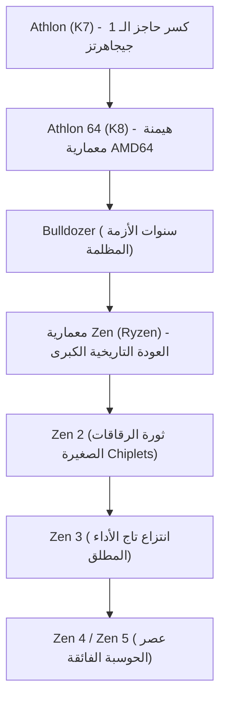

# التاريخ المؤسسي: ملحمة شركة AMD — من المنافس الأبدي إلى الانقلاب التاريخي مع معالجات Ryzen

عند دراسة تاريخ صناعة أشباه الموصلات العالمية، يستحيل تجاوز شركة Advanced Micro Devices المعروفة اختصاراً باسم AMD. فمنذ تأسيسها عام 1969، ظل يُنظر إليها لعقود طويلة على أنها مجرد "المنافس الدائم" والمصنّع البديل في ظل العملاق إنتل (Intel). ومع ذلك، فإن المسار الفعلي لشركة AMD يمثل إحدى أكثر قصص الصعود والتحول إثارة وتشويقاً في تاريخ وادي السيليكون بأكمله.

من عصورها الذهبية وتفوقها الهندسي الذي أذهل العالم، مروراً بسنوات الأزمة الخانقة التي وضعتها على حافة الإفلاس التام، وصولاً إلى العودة الملحمية التي قادتها معمارية "Zen" الثورية (معالجات Ryzen وEPYC)، تشكل رحلة AMD درساً ملهماً في الإصرار الهندسي والقيادة الاستراتيجية. تستعرض هذه المقالة المسيرة الحافلة للشركة من نشأتها وحتى عصر الذكاء الاصطناعي الفائق.

## 1. التأسيس وعصر المصنّع الثاني البديل (1969–عقد 1980)

تأسست AMD في 1 مايو 1969 على يد جيري ساندرز (Jerry Sanders) وسبعة من زملائه السابقين في شركة فيرتشايلد لأشباه الموصلات، وذلك بعد عام واحد فقط من تأسيس روبرت نويس وغوردون مور لشركة إنتل. وبينما كان مؤسسو إنتل علماء وباحثين بارزين، كان ساندرز رجل مبيعات استثنائياً يتمتع بكاريزما طاغية. وانطلاقاً من فلسفته القائلة بأن "الناس أولاً، ثم تأتي المنتجات والأرباح لاحقاً، لكن المبيعات هي المحرك الأساسي"، لم تركز AMD في بداياتها على تصميم معماريات معقدة، بل تخصصت كـ "مصدر ثانٍ" (Second Source) لتصنيع رقائق متوافقة تماماً مع تصميمات الشركات الأخرى.

وجاء التحول التاريخي عام 1981، عندما كانت شركة IBM تطور أول حاسوب شخصي لها "IBM PC". ولتأمين سلاسل الإمداد وتجنب الاعتماد الحصري على مورد واحد لمعالجها المركزي (معالج إنتل 8088)، اشترطت IBM وجود مصنّع بديل معتمد. وبناءً على ذلك، وقعت إنتل وAMD اتفاقية ترخيص تبادلي تاريخية عام 1982، حصلت بموجبها AMD على الحق القانوني في تصنيع وبيع معالجات معمارية x86. أدى هذا الاتفاق إلى قفزة هائلة في مبيعات AMD، لكنه ألصق بها أيضاً صفة "ناسخة منتجات إنتل".

## 2. حروب الاستنساخ والسعي نحو الاستقلالية (عقد 1990)

في أواخر الثمانينيات، ومع النمو الهائل لسوق الحواسيب الشخصية، سعت إنتل لاحتكار الأرباح الهائلة وبدأت في منع AMD من الوصول إلى وثائق وتصميمات معالج 386. دخلت AMD في معارك قضائية طويلة لمكافحة الاحتكار، وفي الوقت نفسه شرع مهندسوها في إجراء هندسة عكسية دقيقة للرقاقة. وفي عام 1991، أطلقت AMD معالج "Am386" المتوافق كلياً مع معالج إنتل 80386، لكن بتردد أعلى (40 ميجاهرتز مقابل 33 ميجاهرتز) وسعر أقل، مما حقق نجاحاً تجارياً ساحقاً. وتكرر هذا الإنجاز مع معالج "Am486".

ومع ذلك، عندما أطلقت إنتل معالجات "بنتيوم (Pentium)" بهندسة معمارية متجددة، ظهرت حدود استراتيجية الاستنساخ. وللتحول إلى مطور مستقل، استحوذت AMD على شركة NexGen، وأطلقت عام 1996 أول معمارية x86 من تصميمها المستقل بالكامل: "K5" (حرف K نسبة إلى كوكب كريبتون، موطن سوبرمان). ورغم التأخيرات التي واجهت K5، جاء المعالج اللاحق "K6" (عام 1997) — الذي صممه فينود دهام، المعروف بـ "أب البنتيوم" — لينافس معالجات إنتل نداً لند ويثبت كفاءة AMD في تصميم معالجات عالية الأداء.

## 3. العصر الذهبي: كسر حاجز الـ 1 جيجاهرتز وهيمنة AMD64 (1999–2005)

جاءت اللحظة الفارقة التي حطمت أسطورة تفوق إنتل المطلق في أغسطس 1999 مع إطلاق معمارية "K7" التي حملت الاسم التجاري الشهير "أثلون (Athlon)". وبقيادة المهندس العبقري ديرك ماير، تفوق معالج أثلون على معالج إنتل الرائد بنتيوم 3 في الألعاب والعمليات الحسابية المعقدة.

وفي مارس 2000، صعقت AMD مجتمع التكنولوجيا العالمي حين أصبحت رسمياً أول شركة في التاريخ تكسر حاجز التردد الأسطوري **1 جيجاهرتز (1000 ميجاهرتز)**، متفوقة على إنتل بفارق أيام قليلة.

وبلغت الهيمنة التكنولوجية ذروتها في عام 2003 مع معمارية "K8" (معالجات Athlon 64 للحواسيب المكتبية وOpteron للخوادم). قدمت معمارية K8 تعليمات "AMD64 (x86-64)" التي نقلت المعالجات إلى بيئة 64-بت مع الحفاظ التام على التوافق مع برمجيات 32-بت، مما أجبر إنتل نفسها على ترخيص هذا المعيار من AMD. وعلاوة على ذلك، دمجت المعمارية وحدة التحكم في الذاكرة داخل شريحة المعالج مباشرة عبر ناقل HyperTransport فائق السرعة، مما قضى على اختناقات زمن الوصول للذاكرة.

في تلك الأثناء، علقت إنتل في مأزق معمارية "NetBurst (Pentium 4)" التي سعت لرفع الترددات على حساب انبعاث حراري هائل واستهلاك كهربائي مفرط. وبفضل كفاءة استهلاك الطاقة ومعدل التعليمات لكل دورة ساعة (IPC) المرتفع، اكتسح معالج K8 أسواق الحواسيب ومراكز البيانات، مسجلاً أزهى فترات AMD على الإطلاق.

## 4. الاستحواذ على ATI، وفصل المصانع، وكارثة "Bulldozer" (2006–2014)

غير أن هذا المجد لم يدم طويلاً. في عام 2006، ردت إنتل بقوة عبر معمارية "Core (Core 2 Duo)"، واستعادت عرش الأداء. وفي التوقيت ذاته، أقدمت AMD على مغامرة مالية هائلة بشرائها لشركة البطاقات الرسومية الكندية ATI Technologies مقابل 5.4 مليار دولار. ورغم أن رؤية دمج المعالج المركزي ومعالج الرسوميات في شريحة واحدة (مبادرة APU Fusion) كانت سابقة لعصرها، إلا أن الديون الضخمة استنزفت سيولة الشركة.

وتزامن ذلك مع الارتفاع الجنوني في تكاليف بناء مصانع الرقائق المتطورة (Fabs)، مما جعل مواكبة استثمارات إنتل أمراً مستحيلاً. وفي عام 2009، اتخذت الشركة القرار المؤلم بفصل قطاع التصنيع ليصبح شركة مستقلة باسم GlobalFoundries، والتحول إلى شركة تصميم فقط (Fabless)، لتنهي بذلك مقولة جيري ساندرز الشهيرة: *"الرجال الحقيقيون يمتلكون مصانعهم"*.

وحلت الكارثة التقنية الكبرى في عام 2011 مع إطلاق معمارية "Bulldozer". فبسبب تصميم الوحدات المشتركة المعيب، انخفض أداء المعالجة للأنوية المفردة (IPC) مقارنة بالجيل السابق، وارتفعت الحرارة واستهلاك الطاقة بصورة كارثية. وأمام معالجات ساندي بريدج (Sandy Bridge) من إنتل، سُحقت معالجات بولدوزر تماماً، وطُردت AMD عملياً من سوق الحواسيب العليا والخوادم. وهوى سعر السهم إلى أقل من دولارين، واعتبرت وول ستريت أن إفلاس AMD مسألة وقت لا أكثر.

## 5. تولي ليزا سو القيادة ومشروع "Zen" السري (2014–2016)

في أكتوبر 2014، والشركة تترنح على حافة الإفلاس، حدث التحول التاريخي بتعيين الدكتورة ليزا سو (Dr. Lisa Su)، خريجة الهندسة الكهربائية من معهد ماساتشوستس للتكنولوجيا (MIT)، رئيسة تنفيذية للشركة. فرضت سو انضباطاً صارماً: ألغت المشاريع الجانبية في الهواتف المحمولة وإنترنت الأشياء، وكرست كافة موارد الشركة نحو جوهر قوتها: **الحوسبة عالية الأداء (المعالجات المركزية ومعالجات الرسوميات)**.

وفي سرية تامة، كان هناك مشروع إنقاذ قيد التنفيذ. عاد جيم كيلر، مهندس الرقائق الأسطوري ومصمم معماريتي K7/K8 ورقاقات آبل الأولى، إلى AMD عام 2012 لتصميم معمارية x86 جديدة بالكامل من الصفر: معمارية "Zen".

ونجحت ليزا سو في الحفاظ على تدفق السيولة النقدية من خلال توريد المعالجات المخصصة لمنصات الألعاب المنزلية (PlayStation 4 من سوني وXbox One من مايكروسوفت)، مانحة فريق كيلر الوقت الثمين اللازم لإتقان تصميم معمارية Zen.

## 6. ولادة "Ryzen" والانقلاب التاريخي المذهل (2017 — حتى الآن)

في مارس 2017، كشفت AMD رسمياً عن معالجات "Ryzen" المكتبية. وحققت هذه المعالجات المبنية على معمارية Zen قفزة مذهلة بلغت **52% في تعليمات دورة الساعة (IPC)** مقارنة بمعمارية بولدوزر، متجاوزة هدف الشركة الداخلي البالغ 40% ومتحدية تباطؤ قانون مور. وعلاوة على ذلك، في وقت كانت فيه إنتل تحتجز المستخدمين في فئة 4 أنوية لقرابة عقد كامل، وفرت معالجات رايزن 8 أنوية و16 مساراً بأسعار اقتصادية، مفجرة ثورة تعدد الأنوية للجميع.

$$
	ext{IPC} = rac{	ext{Instructions}}{	ext{Clock Cycle}}
$$

وكانت الورقة الرابحة الحاسمة لـ AMD هي ابتكار **معمارية الرقاقات المعيارية (Chiplets)**. فبدلاً من تصنيع قالب سيليكون متجانس ضخم معرّض لنسب عيوب تصنيع عالية، قسمت AMD المعالج إلى شرائح حوسبة صغيرة (CCDs) متصلة بشريحة إدخال/إخراج مركزية عبر ناقل Infinity Fabric السريع. مكن هذا الابتكار من رفع كفاءة الإنتاج وخفض التكلفة بشكل جذري، وتوفير 16 نواة للمستخدمين العاديين وأكثر من 64 نواة للخوادم.

وهنا تحول بيع المصانع في الماضي إلى نقطة قوة حاسمة؛ إذ بالاعتماد على شركة TSMC التايوانية، الرائدة عالمياً في الطباعة الحجرية فوق البنفسجية المتطرفة (EUV)، تفوقت AMD تقنياً على إنتل التي تعثرت لسنوات في دقتي 14 و10 نانومتر. ومع إطلاق "Zen 2" (عام 2019) و"Zen 3" (عام 2020)، انتزعت AMD صدارة الأداء في الأنوية الفردية والمتعددة وكفاءة الطاقة معاً.

وفي مراكز البيانات، حطمت معالجات "EPYC" احتكار إنتل شبه الكامل، وأصبحت الخيار الأساسي لأضخم مزودي السحابة العالميين مثل AWS وGoogle Cloud وMicrosoft Azure.

## 7. استشراف المستقبل: ساحة الذكاء الاصطناعي والحوسبة الفائقة

لم تعد AMD اليوم خياراً بديلاً رخيصاً، بل غدت عملاقاً يقود مستقبل الحوسبة. وفي عام 2022، أكملت الاستحواذ التاريخي على شركة Xilinx الرائدة في الرقاقات التكيفية مقابل 49 مليار دولار، متجاوزة القيمة السوقية لشركة إنتل في فترات معينة.

وتخوض الشركة حالياً أشرس معاركها في ميدان الذكاء الاصطناعي الفائق لمنافسة نفيديا عبر سلسلة "Instinct MI300"، التي تدمج المعالجات المركزية ومعالجات الرسوميات وذاكرة HBM3 في حزم ثلاثية الأبعاد متقدمة، مدعومة بمنظومة البرمجيات المفتوحة ROCm.

من حافة الانهيار إلى قيادة قمة صناعة المعالجات، تجسد مسيرة AMD انتصار الإبداع الهندسي والقيادة الجريئة، مؤكدة أن المنافسة القوية هي الضمان الحقيقي لازدهار التكنولوجيا وخدمة البشرية.
