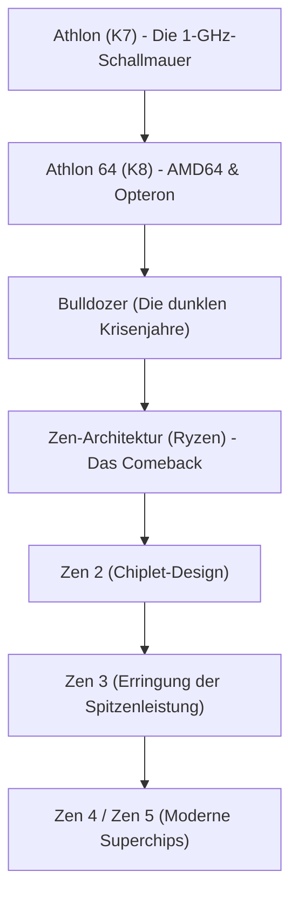

# Unternehmensgeschichte: Die Saga von AMD – Vom ewigen Herausforderer zur Ryzen-Sensation

Wer die Geschichte der globalen Halbleiterindustrie betrachtet, kommt an Advanced Micro Devices (AMD) nicht vorbei. Seit seiner Gründung im Jahr 1969 galt AMD über Jahrzehnte hinweg vor allem als der „ewige Zweite“ und verlässliche Zweitlieferant im Schatten des Branchenprimus Intel. Doch der tatsächliche Weg des Unternehmens gleicht einer der dramatischsten und mitreißendsten Achterbahnfahrten der gesamten Wirtschaftsgeschichte des Silicon Valley.

Von glanzvollen Epochen architektonischer Überlegenheit, die die Fachwelt verblüfften, über existenzbedrohende Krisenjahre am Rande der Zahlungsunfähigkeit bis hin zum historischen Comeback durch die revolutionäre „Zen“-Architektur (Ryzen- und EPYC-Prozessoren): AMDs Entwicklung ist ein Paradebeispiel für unerschütterlichen Ingenieursgeist und strategische Weitsicht. Dieser Artikel beleuchtet die bewegte Geschichte des Konzerns von den Anfängen bis zum Zeitalter der künstlichen Intelligenz.

## 1. Gründung und die Ära als Zweitlieferant (1969–1980er-Jahre)

AMD wurde am 1. Mai 1969 von Jerry Sanders und sieben ehemaligen Weggefährten von Fairchild Semiconductor ins Leben gerufen – ziemlich genau ein Jahr nach der Gründung von Intel durch Robert Noyce und Gordon Moore. Während Intels Gründer angesehene Forscher und Wissenschaftler waren, war Sanders ein begnadeter, charismatischer Verkaufsprofi. Nach seinem Leitsatz („Die Menschen kommen zuerst; Produkte und Gewinne folgen, aber der Vertrieb treibt alles an“) setzte AMD anfangs nicht auf eigene Chiparchitekturen, sondern spezialisierte sich auf den Bau pin-kompatibler Nachbauten anderer Hersteller („Second Source“).

Der große Durchbruch gelang 1981, als IBM an der Entwicklung des legendären „IBM PC“ arbeitete. Um Ausfälle in der Lieferkette für den zentralen Prozessor (den Intel 8088) auszuschließen, forderte IBM zwingend einen zweiten lizenzierten Hersteller. Daraufhin schlossen Intel und AMD 1982 ein weitreichendes Lizenzabkommen. AMD erwarb damit das Recht, x86-Prozessoren legal herzustellen und zu vertreiben. Dies bescherte AMD ein rasantes Umsatzwachstum, brachte dem Unternehmen jedoch auch den Ruf eines bloßen „Intel-Kopierers“ ein.

## 2. Klonkriege und der mühsame Weg zur Eigenständigkeit (1990er-Jahre)

Als der PC-Markt Ende der 1980er-Jahre explosionsartig wuchs, wollte Intel die lukrativen Gewinne für sich behalten und verweigerte AMD den Zugriff auf die Konstruktionspläne des 386er-Prozessors. AMD wehrte sich mit jahrelangen kartellrechtlichen Prozessen und begann gleichzeitig, Prozessoren mittels Clean-Room-Reverse-Engineering selbstständig nachzubauen. 1991 erschien der „Am386“, der vollkommen kompatibel mit Intels 80386 war, aber mit 40 MHz höher taktete als Intels 33-MHz-Modell und zu einem günstigeren Preis reißenden Absatz fand. Der nachfolgende „Am486“ knüpfte nahtlos an diesen Erfolg an.

Mit der Einführung des Pentium-Markennamens und einer grundlegend überarbeiteten Architektur durch Intel stieß das Klonen jedoch an seine Grenzen. AMD übernahm das Entwicklerteam von NexGen und brachte 1996 seine erste vollkommen eigenständig entwickelte x86-Mikroarchitektur heraus: den „K5“ (das „K“ stand für Krypton, die Heimatwelt von Superman). Nach anfänglichen Verzögerungen beim K5 gelang mit dem von Vinod Dham – dem „Vater des Pentium“ – entwickelten „K6“ (1997) der entscheidende Durchbruch: Er zog mit Intels Pentium gleich und etablierte AMD als eigenständigen Entwickler von Hochleistungschips.

## 3. Das goldene Zeitalter: Die 1-GHz-Schallmauer und der Triumph von AMD64 (1999–2005)

Die endgültige Entzauberung von Intels technologischer Unantastbarkeit folgte im August 1999 mit der Präsentation der „K7“-Architektur, besser bekannt als „Athlon“. Unter Chefentwickler Dirk Meyer deklassierte der Athlon Intels Spitzenmodell Pentium III in Gaming-Benchmarks und bei Gleitkomma-Berechnungen deutlich.

Im März 2000 schrieb AMD dann endgültig Computergeschichte: Als weltweit erster Hersteller durchbrach das Unternehmen die magische Taktrate von **1 GHz (1.000 MHz)** und schlug Intel um wenige Tage.

Ihren technologischen Zenit erreichte die Ära 2003 mit der „K8“-Architektur (Athlon 64 für Desktop-PCs und Opteron für Server). K8 führte die zukunftsweisende „AMD64 (x86-64)“-Erweiterung ein, die 64-Bit-Computing bei voller 32-Bit-Kompatibilität ermöglichte – ein Standard, den Intel später von AMD übernehmen musste. Zudem integrierte AMD den Speichercontroller erstmals direkt in den CPU-Die und verband ihn über den rasanten HyperTransport-Bus, was Speicherlatenzen drastisch senkte.

Intel hatte sich zu jener Zeit mit seiner „NetBurst-Architektur (Pentium 4)“ in eine Sackgasse manövriert: Hohe Taktraten wurden mit extremem Stromverbrauch und massiver Hitzeentwicklung erkauft. AMDs K8 bot eine überragende Befehlsverarbeitung pro Takt (IPC), war energieeffizient und dominierte den Markt für PC-Enthusiasten und Serverfarmen nach Belieben.

## 4. ATI-Übernahme, Fab-Ausgliederung und das Desaster um „Bulldozer“ (2006–2014)

Die Dominanz währte jedoch nicht ewig. 2006 meldete sich Intel mit der brillanten „Core-Architektur (Core 2 Duo)“ zurück und eroberte die Leistungskrone im Handumdrehen. Zeitgleich vollzog AMD einen gewaltigen strategischen Kraftakt: die Übernahme des kanadischen Grafikspezialisten ATI Technologies für 5,4 Milliarden Dollar. Obwohl die Fusion von CPU und GPU zu beschleunigten Recheneinheiten („APU Fusion“) visionär war, belastete der enorme Schuldenberg AMD über Jahre hinweg schwer.

Hinzu kam, dass der Bau hochmoderner Halbleiterfabriken (Fabs) immer gigantischere Summen verschlang, die AMD gegenüber Intel nicht mehr aufbringen konnte. 2009 traf das Unternehmen die schmerzhafte Entscheidung, seine Fertigungssparte in GlobalFoundries auszugliedern und zu einem reinen „Fabless“-Entwickler zu werden. Damit verabschiedete sich AMD von Jerry Sanders' berühmtem Credo: *„Wahre Männer haben Fabs“*.

Den absoluten Tiefpunkt markierte 2011 die Veröffentlichung der „Bulldozer“-Architektur. Durch ein verfehltes Modulkonzept brach die Single-Core-Leistung (IPC) gegenüber der Vorgängergeneration ein, während Leistungsaufnahme und Wärmeentwicklung ausuferten. Gegen Intels Core-Prozessoren der Sandy-Bridge-Generation war Bulldozer chancenlos. AMD verlor nahezu sämtliche Marktanteile im High-End- und Serverbereich. Die Aktie stürzte unter 2 Dollar ab und Branchenbeobachter rechneten fest mit dem baldigen Konkurs.

## 5. Lisa Sus Amtsantritt und die geheime Entwicklung von „Zen“ (2014–2016)

Im Oktober 2014, als AMD mit dem Rücken zur Wand stand, übernahm Dr. Lisa Su – eine promovierte MIT-Elektroingenieurin – die Führung als CEO. Sie handelte sofort und rigoros: Unrentable Nebenschauplätze im Mobilfunk- und IoT-Bereich wurden abgestoßen. Sämtliche Ressourcen flossen fortan ausschließlich in das Kerngeschäft: **High-Performance-Computing (CPUs und GPUs)**.

Unterdessen lief im Verborgenen ein Rettungsprojekt. Chip-Legende Jim Keller, der bereits K7, K8 und Apples A-Serie maßgeblich gestaltet hatte, war 2012 zu AMD zurückgekehrt, um eine vollkommen neu konzipierte x86-Mikroarchitektur von Grund auf zu entwickeln: „Zen“.

Lisa Su sicherte das Überleben des Konzerns, indem sie das Geschäft mit Semi-Custom-Chips für die Spielekonsolen Sony PlayStation 4 und Microsoft Xbox One massiv ausbaute, was den Entwicklern die nötige Zeit verschaffte, um Zen zur Marktreife zu führen.

## 6. Die Geburt von „Ryzen“ und die große Trendwende (2017–heute)

Im März 2017 stellte AMD die ersten Desktop-Prozessoren der Marke „Ryzen“ vor. Die Zen-Architektur erbrachte eine atemberaubende **Steigerung der IPC um 52 %** gegenüber Bulldozer – weit mehr als das ohnehin ambitionierte interne Ziel von 40 %. Während Intel Kunden jahrelang mit Vierkern-Prozessoren im Desktop abgespeist hatte, bot Ryzen plötzlich 8 Kerne und 16 Threads zu hochattraktiven Preisen an und leitete das Zeitalter der Mehrkern-Prozessoren für jedermann ein.

$$
	ext{IPC} = rac{	ext{Instructions}}{	ext{Clock Cycle}}
$$

AMDs größter Geniestreich war das modulare **„Chiplet“-Design**. Statt einen riesigen, fehleranfälligen Siliziumchip zu fertigen, teilte AMD die CPU in kleinere Rechenchips (CCDs) auf, die über den extrem schnellen Infinity-Fabric-Bus mit einem zentralen I/O-Die kommunizieren. Das steigerte die Ausbeute dramatisch, senkte die Produktionskosten und ermöglichte Prozessoren mit 16 Kernen im Desktop und über 64 Kernen im Serverbereich.

Zudem zahlte sich der frühere Fab-Verkauf aus: Durch die Partnerschaft mit dem weltweiten Lithografie-Spitzenreiter TSMC aus Taiwan zog AMD an Intel vorbei, während der Rivale jahrelang mit Verzögerungen bei seinen 14-nm- und 10-nm-Verfahren kämpfte. Mit „Zen 2“ (2019) und „Zen 3“ (2020) sicherte sich AMD die Spitzenposition bei Single-Thread-, Multi-Thread-Leistung und Energieeffizienz.

Im Servermarkt zerschlug die „EPYC“-Serie das Quasi-Monopol von Intel in modernen Rechenzentren und eroberte im Sturm Kunden wie AWS, Google Cloud und Microsoft Azure.

## 7. Blick in die Zukunft: Das Rennen um KI und Supercomputing

Heute ist AMD kein Billiganbieter mehr, sondern einer der tonangebenden Pioniere der weltweiten IT-Industrie. 2022 schloss AMD die 49 Milliarden Dollar schwere Übernahme des FPGA-Weltmarktführers Xilinx ab und überflügelte Intel zeitweise beim Börsenwert.

Das gegenwärtige Epizentrum der Branche ist künstliche Intelligenz. Im von NVIDIA dominierten Beschleunigermarkt tritt AMD mit seiner Flaggschiff-Serie „Instinct MI300“ an, die CPU, GPU und schnellen HBM3-Speicher in fortschrittlichen 3D-Gehäusen vereint und auf Basis der offenen Software-Plattform ROCm eine echte Alternative für das KI-Zeitalter bereitstellt.

Vom Rande des Ruins zur technologischen Führerschaft: AMDs Wiederauferstehung ist der Beweis dafür, was zielstrebige Ingenieurskunst und couragierte Führung bewirken können – zum Wohle eines lebendigen Wettbewerbs in der weltweiten Computerbranche.
