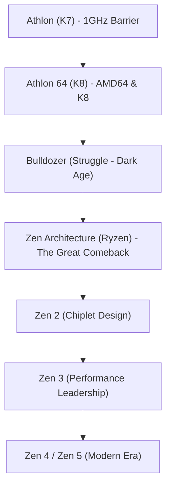

# Corporate History: The Saga of AMD - From Eternal Challenger to the Historic Ryzen Reversal

When exploring the history of the global semiconductor industry, it is impossible to overlook Advanced Micro Devices (AMD). Since its founding in 1969, AMD was long perceived merely as the "eternal runner-up" and a "second-source supplier" in the shadow of industry giant Intel. Yet its actual path has been one of the most dramatic roller-coaster journeys in corporate history.

From its golden eras of architectural superiority that shocked the world, to the dark ages on the brink of total bankruptcy, and culminating in the historic resurgence powered by the "Zen" architecture (Ryzen and EPYC series), AMD's evolution represents Silicon Valley's most thrilling turnaround saga. This article delivers a comprehensive retrospective of AMD's tumultuous journey from its founding to the AI frontier.

## 1. Founding and the Second-Source Era (1969–1980s)

AMD was founded on May 1, 1969, by Jerry Sanders and seven colleagues from Fairchild Semiconductor—just one year after Intel was established by Robert Noyce and Gordon Moore. While Intel's founders were legendary research scientists, Sanders was an extraordinarily charismatic master salesman. Under Sanders' governing philosophy—"People first, products and profits will follow, but sales drive the engine"—AMD initially focused not on foundational R&D, but on acting as a reliable second-source manufacturer producing pin-compatible chips designed by other firms.

The pivotal breakthrough arrived in 1981, when IBM was developing its iconic original "IBM PC." To guarantee absolute supply-chain resilience, IBM refused to rely on a single supplier for its central processing unit (Intel's 8088), demanding a qualified second source. In response, Intel and AMD signed a historic 10-year technology-sharing and cross-licensing agreement in 1982. This granted AMD the legal right to manufacture and distribute x86 microprocessors. The deal propelled AMD into hyper-growth, but it also branded the company with the stigma of being a mere "Intel copycat."

## 2. The Clone Wars and Seeking Architectural Independence (1990s)

By the late 1980s, fueled by the explosive growth of the personal computer market, Intel sought to monopolize lucrative CPU margins and began aggressively withholding technical designs for its 386 processor from AMD. Refusing to yield, AMD entered a brutal, decade-long legal trench war while simultaneously pursuing clean-room reverse engineering. In 1991, AMD unveiled the "Am386"—a chip completely microcode-compatible with Intel's 80386 that ran at higher clock speeds (40 MHz vs. 33 MHz) at a significantly lower price point, becoming a runaway commercial triumph. The follow-up "Am486" mirrored this success.

However, when Intel debuted the "Pentium" brand and fundamentally overhauled its microarchitecture, the limits of pure reverse-engineering clones became starkly evident. Determined to shed its identity as a clone manufacturer, AMD acquired NexGen and launched its first clean-sheet, in-house x86 microarchitecture, the "K5," in 1996 (the "K" paying homage to Superman's home planet of Krypton). While the K5 suffered design delays, the subsequent "K6" (1997)—engineered by legendary chip designer Vinod Dham, the "Father of the Pentium"—established AMD as a legitimate high-performance microprocessor designer capable of matching Intel core for core in consumer desktops.

## 3. The Golden Age: Breaking the 1 GHz Barrier and the AMD64 Triumph (1999–2005)

The turning point that permanently shattered Intel's technical infallibility occurred in August 1999 with the release of the "K7" architecture, branded as the "Athlon." Designed under the leadership of brilliant architect Dirk Meyer, the Athlon outpaced Intel's flagship Pentium III across gaming and intensive integer computing benchmarks.

In March 2000, AMD stunned the technology world by officially winning the historic race to break the mystical **1 GHz (1,000 MHz)** clock speed barrier, beating Intel by mere days.

AMD's architectural ascendancy accelerated further in 2003 with the launch of the "K8" architecture (Athlon 64 for consumer PCs and Opteron for enterprise servers). K8 introduced "AMD64 (x86-64)," a backward-compatible 64-bit extension to the x86 instruction set, beating Intel to the punch. Furthermore, K8 introduced an integrated on-die memory controller connected via the high-speed HyperTransport bus, slashing memory latency dramatically.

During this era, Intel was trapped in its "NetBurst architecture (Pentium 4)," relentlessly chasing gigahertz clock frequencies at the expense of horrific thermal dissipation and runaway power consumption. AMD's K8 delivered vastly superior Instructions Per Cycle (IPC) with exceptional energy efficiency, winning overwhelming acclaim from PC enthusiasts, gamers, and mission-critical enterprise data centers. For a shining moment, AMD seized substantial market share and stood as the undisputed technological champion of Silicon Valley.

## 4. The ATI Acquisition, Fab Spin-Off, and the "Bulldozer" Catastrophe (2006–2014)

However, triumph was fleeting. In 2006, Intel executed a ferocious counterattack with its groundbreaking "Core architecture (Core 2 Duo)," reclaiming single-threaded performance supremacy. Simultaneously, AMD finalized a momentous decision: acquiring Canadian graphics giant ATI Technologies for approximately $5.4 billion. While visionary in its long-term goal of fusing CPUs and GPUs into Accelerated Processing Units (the "Fusion" APU initiative), the debt incurred severely crippled AMD's balance sheet.

Compounding this financial burden, the escalating capital expenditure required to compete with Intel in cutting-edge semiconductor fabrication plants (fabs) became unsustainable. In 2009, AMD made the agonizing decision to spin off its manufacturing division into GlobalFoundries, transitioning into a pure "fabless" chip designer. In doing so, AMD dismantled Jerry Sanders' legendary maxim: *"Real men have fabs."*

The darkest chapter arrived in 2011 with the launch of the catastrophic "Bulldozer" microarchitecture. Prioritizing clustered multithreading over single-core efficiency, Bulldozer suffered an unforgivable defect: its single-threaded IPC was actually lower than the preceding generation, while power consumption and heat exploded. Bulldozer proved utterly uncompetitive against Intel's masterful "Sandy Bridge" Core i-series. AMD was effectively shut out of the lucrative enthusiast and enterprise server markets. With its share price plummeting below $2 per share, bankruptcy loomed and Wall Street consensus wrote AMD off as finished.

## 5. Dr. Lisa Su Takes the Helm and Prepares the "Zen" Counteroffensive (2014–2016)

In October 2014, with the company teetering on insolvency, a historic turning point occurred: Dr. Lisa Su, an MIT-educated electrical engineering PhD and veteran semiconductor executive, was named CEO. Dr. Su immediately instituted radical strategic discipline. She eliminated peripheral, low-margin distractions in mobile and IoT, consolidating all corporate capital and engineering talent around one non-negotiable core: **High-Performance Computing (CPUs and GPUs)**.

Behind closed doors, a top-secret engineering resurrection was underway. Jim Keller, the legendary microprocessor architect who had co-designed the K7/K8 and Apple's foundational A-series silicon, had returned to AMD in 2012 to architect a completely clean-sheet x86 core from scratch: the "Zen" architecture.

Dr. Su masterfully sustained the company's vital cash flows by aggressively expanding its semi-custom business—supplying the custom APU processors powering both Sony's PlayStation 4 and Microsoft's Xbox One—buying Keller's team the indispensable time required to perfect Zen.

## 6. The Birth of "Ryzen" and the Historic Comeback (2017–Present)

In March 2017, AMD formally unleashed the first-generation "Ryzen" desktop processors. Built upon the revolutionary Zen architecture, Ryzen achieved a staggering **52% IPC leap** over the Bulldozer generation—shattering AMD's own internal target of 40% and defying the historical pace of semiconductor progress. Moreover, while Intel had restricted mainstream desktop consumers to quad-core CPUs for nearly a decade, AMD democratized 8-core, 16-thread processing at aggressive, accessible price points.

$$
	ext{IPC} = rac{	ext{Instructions}}{	ext{Clock Cycle}}
$$

AMD's masterstroke was its pioneering adoption of the **"Chiplet" architecture**. Rather than manufacturing massive, monolithic silicon dies prone to catastrophic wafer defects, AMD decoupled the CPU into smaller, modular compute dies (CCDs) connected to a centralized I/O die via the high-speed Infinity Fabric. This approach maximized manufacturing yields, slashed production costs, and allowed AMD to scale compute cores up to 16 cores on mainstream desktop sockets and 64+ cores in servers.

Furthermore, divesting its fabs transformed from a past failure into AMD's supreme competitive weapon. By outsourcing fabrication to Taiwan's TSMC—the undisputed world leader in extreme ultraviolet (EUV) lithography—AMD leapfrogged Intel, which had become paralyzed by years of manufacturing delays on its 14nm and 10nm nodes. With the arrival of "Zen 2" (Ryzen 3000) in 2019 and "Zen 3" (Ryzen 5000) in 2020, AMD claimed absolute leadership across single-threaded performance, multi-threaded throughput, and power efficiency.

In enterprise data centers, AMD's "EPYC" processors breached Intel's near-total server monopoly, winning sweeping deployments across hyperscalers including Amazon Web Services (AWS), Google Cloud, and Microsoft Azure.

## 7. Into the Future: The AI Supercomputing Frontier

Today, AMD is no longer an inexpensive compromise; it is an elite technology powerhouse defining the vanguard of computing. In 2022, AMD completed the landmark $49 billion acquisition of FPGA and adaptive computing titan Xilinx, significantly diversifying its data center footprint and surpassing Intel in market capitalization.

The decisive battleground of contemporary computing is artificial intelligence. In an accelerator landscape heavily dominated by NVIDIA, AMD has deployed its flagship "Instinct MI300" series—combining CPU, GPU, and high-bandwidth memory (HBM3) into modular 3D-stacked supercomputing packages—standing as the primary credible challenger capable of driving open enterprise AI computing.

From the brink of bankruptcy to architectural supremacy, AMD's journey underscores the triumph of visionary engineering, strategic clarity, and sheer perseverance. Its fierce resurgence ensures competitive vitality across the computing ecosystem, delivering transformative technologies to creators, gamers, and enterprises worldwide.
