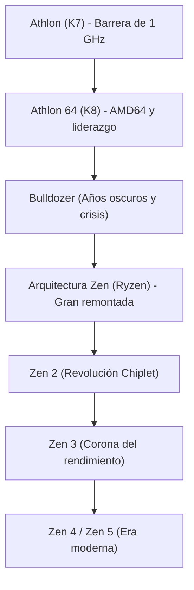

# Historia corporativa: La epopeya de AMD - Del eterno retador a la histórica resurrección con Ryzen

Al analizar la historia de la industria global de los semiconductores, resulta imposible no detenerse en Advanced Micro Devices (AMD). Desde su nacimiento en 1969, AMD fue considerada durante décadas como el «eterno segundón» y un mero «segundo proveedor» a la sombra del coloso Intel. Sin embargo, su trayectoria real encierra una de las mayores y más fascinantes montañas rusas de Silicon Valley.

Desde sus años dorados de supremacía técnica que asombraron al mundo, pasando por periodos oscuros al borde de la bancarrota absoluta, hasta el épico contraataque protagonizado por la arquitectura «Zen» (las familias Ryzen y EPYC), la historia de AMD es una lección de audacia e ingeniería de vanguardia. Este artículo recorre exhaustivamente la peripecia de AMD desde sus humildes comienzos hasta la era de la inteligencia artificial.

## 1. Fundación y la era del «segundo proveedor» (1969–década de 1980)

AMD fue fundada el 1 de mayo de 1969 por Jerry Sanders y siete compañeros procedentes de Fairchild Semiconductor, apenas un año después de que Robert Noyce y Gordon Moore crearan Intel. Mientras los fundadores de Intel eran científicos de renombre internacional, Sanders era un maestro de las ventas carismático y arrollador. Bajo su máxima («Las personas son lo primero; los productos y beneficios vendrán después, pero las ventas mueven la máquina»), AMD no apostó al inicio por arriesgados desarrollos propios, sino por actuar como fabricante secundario («second source») de chips diseñados por terceros con compatibilidad pin a pin.

El punto de inflexión llegó en 1981, cuando IBM diseñaba su revolucionario «IBM PC». Para blindar el suministro de microprocesadores y evitar la dependencia exclusiva de un solo fabricante (el Intel 8088), IBM exigió contar con una segunda fuente garantizada. A raíz de ello, Intel y AMD firmaron en 1982 un histórico acuerdo de intercambio tecnológico y licencias cruzadas. Gracias a este pacto, AMD obtuvo el derecho legal de fabricar y vender procesadores de arquitectura x86. Aquel acuerdo disparó las ventas de AMD, aunque le granjeó la fama de ser un mero «clonador de Intel».

## 2. La guerra de los clones y la búsqueda de identidad propia (década de 1990)

A finales de los ochenta, al calor del crecimiento explosivo del ordenador personal, Intel decidió acaparar los márgenes de negocio y comenzó a recortar el acceso de AMD a los diseños del procesador 386. Lejos de rendirse, AMD se enzarzó en una batalla judicial antimonopolio que duró años, al tiempo que sus ingenieros se volcaron en la ingeniería inversa en salas limpias. En 1991 vio la luz el «Am386», un procesador 100% compatible con el 80386 de Intel que ofrecía frecuencias más altas (40 MHz frente a 33 MHz) a un precio mucho más asequible, convirtiéndose en un arrollador éxito de ventas. El posterior «Am486» repitió la hazaña.

No obstante, cuando Intel lanzó la marca «Pentium» e introdujo una arquitectura totalmente renovada, la vía de la simple clonación mostró sus limitaciones. Decidida a erigirse en creador independiente, AMD adquirió NexGen y lanzó en 1996 su primera microarquitectura x86 propia: el «K5» (la «K» en homenaje a Krypton, el planeta natal de Superman). Pese a los retrasos del K5, su sucesor, el «K6» (1997) —diseñado por Vinod Dham, conocido como el «padre del Pentium»—, igualó el rendimiento de los chips de Intel y demostró la solvencia de AMD como diseñador de procesadores de alto rendimiento.

## 3. La era dorada: Ruptura de la barrera de 1 GHz y la hegemonía de AMD64 (1999–2005)

El momento decisivo que derribó el mito de la invulnerabilidad de Intel se produjo en agosto de 1999 con el estreno de la arquitectura «K7», comercializada bajo la célebre marca «Athlon». Concebida por el brillante equipo de Dirk Meyer, la arquitectura Athlon superó al buque insignia de Intel, el Pentium III, en cálculo en coma flotante y rendimiento gráfico.

En marzo de 2000, AMD sorprendió al mundo al cruzar por primera vez en la historia de los microprocesadores la barrera del **1 GHz (1.000 MHz)**, adelantándose a Intel por escasos días.

La supremacía técnica se consolidó en 2003 con la arquitectura «K8» (Athlon 64 en sobremesa y Opteron en servidores). El K8 introdujo las instrucciones «AMD64 (x86-64)», una extensión de 64 bits plenamente compatible con el software de 32 bits que obligó a la propia Intel a licenciar y adoptar el estándar creado por AMD. Además, el procesador integraba por primera vez el controlador de memoria directamente en el encapsulado del silicio y lo conectaba a través del bus ultrarrápido HyperTransport, reduciendo radicalmente las latencias.

En aquella etapa, Intel se encontraba atascada en su arquitectura «NetBurst (Pentium 4)», empeñada en subir los megahercios a costa de un consumo eléctrico disparatado y un calor asfixiante. El K8 de AMD, con su altísimo rendimiento por ciclo de reloj (IPC) y su excepcional eficiencia energética, arrasó en el sector de los videojuegos y en los centros de datos corporativos, viviendo la época más gloriosa de su historia.

## 4. La compra de ATI, la segregación de fábricas y el desastre de «Bulldozer» (2006–2014)

Sin embargo, el liderazgo duró poco. En 2006, Intel contraatacó con brillantez lanzando la arquitectura «Core (Core 2 Duo)», recuperando la cima del rendimiento mononúcleo. Prácticamente al mismo tiempo, AMD acometió una arriesgada apuesta estratégica: adquirir la firma canadiense de chips gráficos ATI Technologies por unos 5.400 millones de dólares. Aunque visionario en su propósito de integrar CPU y GPU en una sola unidad de procesamiento acelerado (la iniciativa APU Fusion), el descomunal endeudamiento dejó a la compañía en una situación financiera crítica.

Por añadidura, el vertiginoso incremento de las inversiones de capital necesarias para mantener fábricas punteras de semiconductores (fabs) se volvió insostenible frente a los recursos de Intel. En 2009, AMD tomó la dolorosa decisión de escindir sus plantas de fabricación para crear GlobalFoundries, transformándose en una empresa puramente fabless (sin fábricas propias). Con ello quedó enterrada la legendaria frase de Jerry Sanders: *«Los hombres de verdad tienen fábricas»*.

El golpe más duro sobrevino en 2011 con el estreno de la arquitectura «Bulldozer». Concebida con un enfoque defectuoso de módulos multihilo, Bulldozer arrojó un rendimiento por núcleo (IPC) inferior al de su predecesora, acompañado de un desmedido consumo térmico. Incapaz de competir contra la excelente microarquitectura «Sandy Bridge» de Intel, AMD fue barrida del mercado de gama alta y de servidores. Con sus acciones por debajo de los dos dólares, la quiebra se daba casi por descontada en Wall Street.

## 5. El liderazgo de Lisa Su y la gestación clandestina de «Zen» (2014–2016)

En octubre de 2014, con la empresa al borde del abismo, se produjo el nombramiento que cambiaría su destino: la doctora Lisa Su, brillante ingeniera eléctrica doctorada en el MIT, asumió el cargo de consejera delegada. Su actuó con implacable disciplina estratégica: canceló proyectos secundarios en telefonía móvil e IoT y concentró todo el talento y capital en el corazón de AMD: **el cómputo de alto rendimiento (CPU y GPU)**.

En el más estricto secreto, AMD desarrollaba un proyecto de resurrección. Jim Keller, el mítico arquitecto de chips que había co-diseñado el K7, el K8 y los primeros procesadores de la serie A de Apple, había vuelto a AMD en 2012 para concebir desde una hoja en blanco una microarquitectura x86 totalmente nueva: la arquitectura «Zen».

Lisa Su mantuvo a flote las finanzas de la compañía asegurando contratos de suministro de chips personalizados (las APU de PlayStation 4 y Xbox One), ganando un tiempo precioso para que los ingenieros pulieran Zen hasta la perfección.

## 6. El lanzamiento de «Ryzen» y la histórica remontada (2017–presente)

En marzo de 2017, AMD presentó oficialmente los procesadores de escritorio «Ryzen». Basados en la arquitectura Zen, los nuevos procesadores registraron un impresionante **salto del 52% en IPC** respecto a la generación Bulldozer, desbordando con creces el objetivo interno del 40% y desafiando los límites de la ley de Moore. Además, mientras Intel había encasillado a los usuarios en procesadores de 4 núcleos durante casi una década, Ryzen democratizó los 8 núcleos y 16 hilos a precios enormemente competitivos.

$$
	ext{IPC} = rac{	ext{Instructions}}{	ext{Clock Cycle}}
$$

La verdadera genialidad de Ryzen radicó en la adopción del diseño basado en **«chiplets»**. En lugar de fabricar un único silicio monolítico gigante expuesto a fallos de fabricación, AMD distribuyó los núcleos en pequeñas matrices modulares (CCD) conectadas a un chip central de E/S mediante el bus de alta velocidad Infinity Fabric. Esta innovación disparó los rendimientos de fabricación, abarató costes y facilitó la integración de hasta 16 núcleos en plataformas domésticas y más de 64 en servidores.

Asimismo, haber vendido sus fábricas años atrás se convirtió en su mayor baza. Al confiar la producción al gigante taiwanés TSMC, líder mundial indiscutible en litografía ultravioleta extrema (EUV), AMD superó a una Intel atrapada en interminables retrasos con sus nodos de 14 y 10 nanómetros. Con la llegada de «Zen 2» (2019) y «Zen 3» (2020), AMD arrebató a Intel el liderazgo absoluto en rendimiento mononúcleo, multinúcleo y eficiencia energética.

En el mercado de servidores, la familia «EPYC» rompió el monopolio del 99% que ostentaba Intel en los centros de datos, convirtiéndose en el estándar de gigantes como Amazon Web Services (AWS), Google Cloud y Microsoft Azure.

## 7. Mirada al futuro: El asalto a la supercomputación y la IA

Hoy en día, AMD ya no es una opción de segunda fila, sino una potencia tecnológica de élite. En 2022, completó la adquisición de la firma de chips adaptables Xilinx por 49.000 millones de dólares, llegando a superar a Intel en valoración bursátil.

El gran campo de batalla tecnológico actual es la inteligencia artificial. En un mercado dominado con autoridad por NVIDIA, AMD ha plantado cara con sus aceleradores «Instinct MI300», que integran CPU, GPU y memoria de gran ancho de banda (HBM3) en avanzados encapsulados 3D para desafiar el monopolio imperante mediante un ecosistema de software abierto (ROCm).

De estar al borde de la desaparición a liderar la vanguardia de la computación, la historia de AMD encarna el triunfo de la audacia técnica y la excelencia directiva. Su apasionante resurgir garantiza la vitalidad competitiva de toda la industria y asegura un futuro repleto de innovación para usuarios e investigadores de todo el mundo.
