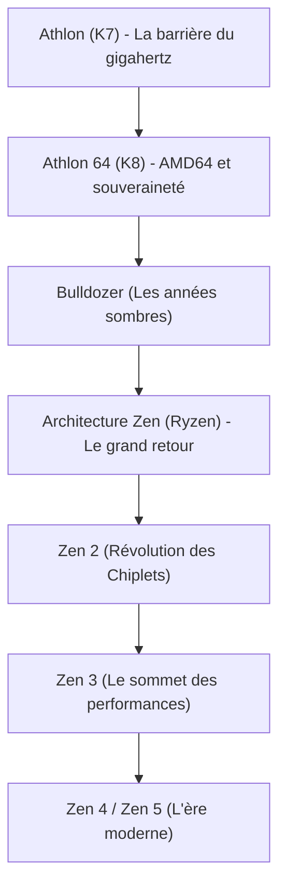

# Histoire d'entreprise : La saga AMD - De l'éternel challenger au retour historique avec Ryzen

Lorsque l'on étudie l'histoire de l'industrie des semi-conducteurs, il est impossible de faire l'impasse sur Advanced Micro Devices (AMD). Fondée en 1969, la firme a longtemps été cantonnée dans l'esprit du public au rôle de « second couteau » ou de simple « second fournisseur » dans l'ombre du géant Intel. Pourtant, la véritable histoire d'AMD constitue l'une des sagas les plus passionnantes et spectaculaires de toute la Silicon Valley.

De ses périodes fastes de supériorité architecturale qui ébahirent le monde, jusqu'aux années d'angoisse où la faillite semblait inévitable, pour enfin aboutir au retour magistral orchestré par l'architecture « Zen » (les gammes Ryzen et EPYC), l'aventure d'AMD est une formidable leçon de résilience technologique. Cet article retrace en détail ce parcours tumultueux, de la création de l'entreprise jusqu'aux défis de l'intelligence artificielle.

## 1. Fondation et l'époque de la seconde source (1969–années 1980)

AMD a été fondée le 1er mai 1969 par Jerry Sanders et sept anciens collègues de Fairchild Semiconductor, un an tout juste après la création d'Intel par Robert Noyce et Gordon Moore. Tandis que les pères fondateurs d'Intel étaient d'éminents scientifiques reconnus, Sanders était avant tout un directeur commercial charismatique et hors pair. Guidée par sa philosophie (« Les hommes d'abord, les produits et les profits suivront, mais la vente est le moteur »), la jeune pousse AMD ne se lança pas d'emblée dans des architectures novatrices, mais se spécialisa dans la fabrication de composants de substitution (« second source ») parfaitement compatibles avec les puces conçues par ses concurrents.

Le tournant décisif survint en 1981, lorsque IBM développa son mythique « IBM PC ». Soucieuse de sécuriser ses approvisionnements de processeurs (en l'occurrence l'Intel 8088), la firme d'Armonk exigea contractuellement l'existence d'une seconde source de production certifiée. En 1982, Intel et AMD signèrent un pacte historique d'échange technologique et de licences croisées. AMD obtint ainsi le droit légal de fabriquer et distribuer des microprocesseurs x86. Cet accord propulsa les ventes d'AMD vers des sommets, mais l'enferma pour longtemps dans l'image d'un fabricant de « copies Intel ».

## 2. La guerre des clones et l'émancipation architecturale (années 1990)

Vers la fin des années 1980, portée par l'explosion du marché de l'ordinateur personnel, Intel décida de verrouiller ses marges et refusa de communiquer à AMD les plans de son processeur 386. Refusant de s'incliner, AMD engagea un long marathon judiciaire tout en mobilisant ses ingénieurs pour réaliser la rétro-ingénierie intégrale de la puce. En 1991, AMD dévoila l'« Am386 », un processeur strictement compatible avec le 80386 d'Intel, mais cadencé à une fréquence supérieure (40 MHz contre 33 MHz) et vendu à un tarif défiant toute concurrence. Le triomphe fut retentissant, de même que pour l'« Am486 » qui lui succéda.

Néanmoins, lorsque Intel lança la marque « Pentium » en renouvelant de fond en comble son micro-code, les limites de la rétro-ingénierie apparurent au grand jour. Déterminée à conquérir son indépendance, AMD racheta NexGen et lança en 1996 sa première architecture conçue en interne : le « K5 » (la lettre « K » faisant référence à Krypton, la planète de Superman). Malgré les retards du K5, le « K6 » (1997) — mis au point sous la direction de Vinod Dham, surnommé le « père du Pentium » — tint la dragée haute aux processeurs d'Intel et démontra le talent d'AMD en matière de conception haute performance.

## 3. L'âge d'or : La barrière du gigahertz franchie et le triomphe AMD64 (1999–2005)

L'événement qui brisa définitivement le mythe de l'invincibilité d'Intel eut lieu en août 1999 avec l'apparition de l'architecture « K7 », commercialisée sous la marque « Athlon ». Conçu sous l'égide de l'ingénieur de génie Dirk Meyer, l'Athlon surclassa le Pentium III d'Intel aussi bien dans les jeux vidéo que dans les applications professionnelles.

En mars 2000, AMD frappa un grand coup en devenant le tout premier fabricant de l'histoire à franchir la barre mythique du **1 GHz (1 000 MHz)**, battant Intel de quelques jours.

La consécration absolue intervint en 2003 avec l'architecture « K8 » (Athlon 64 pour le grand public et Opteron pour les serveurs). Le K8 introduisit le jeu d'instructions « AMD64 (x86-64) », une extension 64 bits rétrocompatible qui contraignit Intel à s'aligner sur la norme créée par son rival. De plus, AMD intégra le contrôleur de mémoire directement sur le dé de silicium en le reliant au bus ultra-rapide HyperTransport, réduisant de façon spectaculaire les temps d'accès mémoire.

Durant cette période, Intel s'enferma dans l'impasse de l'architecture « NetBurst (Pentium 4) », cherchant à tout prix la montée en fréquence au détriment d'un dégagement thermique colossal et d'une surconsommation électrique. Avec son rendement IPC (instructions par cycle) élevé et son excellente efficacité énergétique, le K8 d'AMD s'imposa auprès des passionnés d'informatique et des gestionnaires de centres de données, inaugurant l'ère la plus faste de l'entreprise.

## 4. Rachat d'ATI, scission des usines et le gouffre de « Bulldozer » (2006–2014)

Mais ce triomphe fut de courte durée. En 2006, Intel riposta magistralement avec son architecture « Core (Core 2 Duo) » et reprit la couronne de la performance. Simultanément, AMD prit une décision capitale : le rachat du concepteur canadien de processeurs graphiques ATI Technologies pour 5,4 milliards de dollars. Si la vision à long terme consistant à fusionner CPU et GPU au sein d'une même puce (« APU Fusion ») était pionnière, la dette colossale contractée fragilisa dramatiquement les finances d'AMD.

Dans le même temps, la course aux investissements colossaux exigée par la miniaturisation des usines de fabrication (fabs) devint insoutenable face à la puissance financière d'Intel. En 2009, AMD dut se résoudre à scinder ses usines pour donner naissance à GlobalFoundries, devenant ainsi une société « fabless ». Ce choix marqua l'abandon officiel du célèbre adage de Jerry Sanders : *« Les vrais hommes possèdent leurs usines »*.

Sur le plan technique, la catastrophe survint en 2011 avec l'introduction de l'architecture « Bulldozer ». Misant à tort sur un partage des ressources entre cœurs, Bulldozer afficha des performances IPC monocœur inférieures à la génération précédente, pour une consommation électrique exorbitante. Face aux puces Sandy Bridge de la gamme Core i d'Intel, Bulldozer fut laminé. AMD dut quasiment abandonner le marché des PC haut de gamme et des serveurs. Son action tomba sous les 2 dollars et la faillite fut alors largement évoquée à Wall Street.

## 5. L'arrivée de Lisa Su et la genèse secrète de « Zen » (2014–2016)

En octobre 2014, alors que l'entreprise était au bord du gouffre, survint un tournant historique : le docteur Lisa Su, brillante physicienne et ingénieure issue du MIT, fut nommée directrice générale. Elle imposa immédiatement un recentrage stratégique radical : finis les projets périphériques dans le mobile ou les objets connectés, toutes les ressources furent vouées au cœur de métier d'AMD : **le calcul haute performance (CPU et GPU)**.

Dans le secret le plus absolu, un projet salvateur était déjà en cours. Jim Keller, l'architecte légendaire à l'origine des K7/K8 et des processeurs Apple Silicon série A, était revenu chez AMD en 2012 pour concevoir une architecture x86 entièrement neuve : l'architecture « Zen ».

Lisa Su sécurisa la trésorerie de l'entreprise en fournissant les processeurs sur mesure (APU) des consoles de salon PlayStation 4 de Sony et Xbox One de Microsoft, accordant ainsi aux équipes d'ingénieurs le temps indispensable pour parfaire Zen.

## 6. La naissance de « Ryzen » et l'immense remontée (2017–présent)

En mars 2017, AMD dévoila officiellement ses processeurs de bureau « Ryzen ». Bâtis sur l'architecture Zen, ils réalisèrent un **gain d'IPC phénoménal de 52 %** par rapport à Bulldozer, pulvérisant l'objectif initial de 40 % et défiant le ralentissement de la loi de Moore. De plus, alors qu'Intel cantonnait le marché grand public aux processeurs 4 cœurs depuis une décennie, Ryzen démocratisa les puces à 8 cœurs et 16 threads à des tarifs particulièrement attractifs.

$$
	ext{IPC} = rac{	ext{Instructions}}{	ext{Clock Cycle}}
$$

Le coup de maître d'AMD résida dans l'adoption pionnière de la conception en **« chiplets »**. Au lieu de graver un énorme dé de silicium monolithique au rendement incertain, AMD divisa le processeur en petits modules de calcul (CCD) interconnectés avec une puce d'entrées/sorties via le bus Infinity Fabric. Cette méthode révolutionnaire optimisa les rendements, réduisit les coûts de production et permit d'offrir jusqu'à 16 cœurs en grand public et 64 cœurs en serveurs.

De plus, l'abandon passé de ses usines s'avéra être son meilleur atout. En confiant sa production au géant taïwanais TSMC, leader incontesté de la gravure en lithographie extrême (EUV), AMD prit de vitesse un groupe Intel empêtré dans les retards de ses procédés 14 et 10 nanomètres. Avec les sorties de « Zen 2 » (2019) et « Zen 3 » (2020), AMD détrôna Intel sur les performances monocœur, multicœur et l'efficacité énergétique.

Dans les centres de données, la gamme de processeurs « EPYC » brisa le quasi-monopole d'Intel pour équiper en masse les géants du cloud que sont AWS, Google Cloud et Microsoft Azure.

## 7. Vers l'avenir : L'assaut de l'IA et des supercalculateurs

Aujourd'hui, AMD n'est plus une alternative d'appoint ; c'est un géant incontournable de la tech mondiale. En 2022, elle a finalisé le rachat historique de Xilinx pour 49 milliards de dollars, surpassant même temporairement Intel en valeur boursière.

Le grand défi technologique actuel est l'intelligence artificielle. Face au monopole de NVIDIA, AMD a déployé ses accélérateurs « Instinct MI300 », combinant CPU, GPU et mémoire à très haute bande passante (HBM3) au sein d'empilements 3D sophistiqués, pour offrir une alternative ouverte (ROCm) et crédible sur le marché des supercalculateurs et de l'IA générative.

Passée du bord de la disparition à l'avant-garde de l'informatique mondiale grâce à sa rigueur technique et au leadership de Lisa Su, AMD incarne l'esprit même de l'innovation. Sa présence garantit une émulation indispensable qui tire l'ensemble de l'industrie technologique vers le haut.
