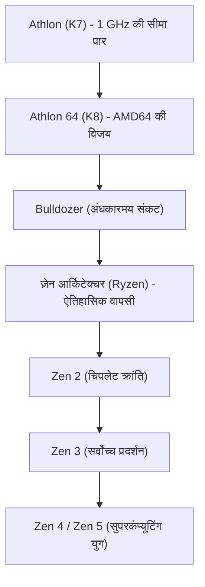

# कॉर्पोरेट इतिहास: एएमडी (AMD) की गाथा — शाश्वत प्रतिद्वंद्वी से राइज़न (Ryzen) की ऐतिहासिक वापसी तक

वैश्विक सेमीकंडक्टर उद्योग के इतिहास पर चर्चा करते समय एडवांस्ड माइक्रो डिवाइसेस (AMD) के योगदान को नजरअंदाज करना असंभव है। 1969 में अपनी स्थापना के बाद से, दशकों तक इसे उद्योग के निर्विवाद सम्राट इंटेल (Intel) की छाया में एक "शाश्वत चुनौती" और दूसरे दर्जे के आपूर्तिकर्ता के रूप में ही देखा गया। लेकिन एएमडी की वास्तविक यात्रा सिलिकॉन वैली के इतिहास की सबसे रोमांचक और नाटकीय वापसी की कहानी है।

तकनीकी श्रेष्ठता के उस स्वर्णिम काल से जिसने दुनिया को स्तब्ध कर दिया था, दिवालिया होने की कगार पर पहुंचे अंधकारमय दौर से होते हुए, 'ज़ेन (Zen)' आर्किटेक्चर (Ryzen और EPYC प्रोसेसर) द्वारा हासिल की गई ऐतिहासिक विजय तक, एएमडी का सफर शुद्ध इंजीनियरिंग और कुशल नेतृत्व की जीत का प्रतीक है। यह लेख एएमडी की स्थापना से लेकर एआई युग तक के उतार-चढ़ाव भरे इतिहास का समग्र विश्लेषण प्रस्तुत करता है।

## 1. स्थापना और 'सेकंड-सोर्स' का दौर (1969–1980 का दशक)

एएमडी की स्थापना 1 मई 1969 को फेयरचाइल्ड सेमीकंडक्टर के पूर्व सेल्स एग्जीक्यूटिव जेरी सैंडर्स (Jerry Sanders) और उनके सात साथियों द्वारा की गई थी—रॉबर्ट नॉयस और गॉर्डन मूर द्वारा इंटेल की स्थापना के ठीक एक साल बाद। इंटेल के संस्थापक जहां वैज्ञानिक पृष्ठभूमि से थे, वहीं सैंडर्स एक बेहद करिश्माई सेल्समैन थे। सैंडर्स के इस दर्शन के तहत कि "लोग पहले आते हैं, उत्पाद और लाभ बाद में आएंगे, लेकिन बिक्री इंजन को चलाती है", एएमडी ने शुरुआत में बड़े अनुसंधान के बजाय अन्य कंपनियों द्वारा डिजाइन किए गए चिप्स के वैकल्पिक निर्माण (Second Source) पर ध्यान केंद्रित किया।

निर्णायक मोड़ 1981 में आया, जब आईबीएम अपना पहला "IBM PC" विकसित कर रहा था। प्रोसेसर (इंटेल का 8088) की आपूर्ति को सुरक्षित रखने के लिए आईबीएम ने अनिवार्य किया कि उसके पास एक प्रमाणित दूसरा विनिर्माता होना चाहिए। इसके परिणामस्वरूप, इंटेल और एएमडी ने 1982 में एक ऐतिहासिक प्रौद्योगिकी-आदान-प्रदान (क्रॉस-लाइसेंस) समझौता किया। इससे एएमडी को वैध रूप से x86 प्रोसेसर बनाने और बेचने का अधिकार मिल गया। इस समझौते ने एएमडी के विकास को पंख लगा दिए, लेकिन साथ ही उस पर "इंटेल की नकल करने वाली कंपनी" का ठप्पा भी लग गया।

## 2. क्लोन युद्ध और आत्मनिर्भरता की राह (1990 का दशक)

1980 के दशक के उत्तरार्ध में पर्सनल कंप्यूटर बाजार के तेजी से बढ़ने पर इंटेल ने सारा मुनाफा खुद रखने की मंशा से एएमडी को अपने 386 प्रोसेसर के डिजाइन देने से मना कर दिया। एएमडी ने हार नहीं मानी और लंबी कानूनी लड़ाई लड़ते हुए रिवर्स-इंजीनियरिंग के जरिए खुद चिप विकसित करना शुरू किया। 1991 में एएमडी ने "Am386" प्रोसेसर पेश किया—जो इंटेल के 386 के साथ पूरी तरह संगत था, लेकिन 40 मेगाहर्ट्ज की तेज गति और कम कीमत के कारण जबरदस्त हिट साबित हुआ। इसके बाद आए "Am486" ने भी बड़ी सफलता हासिल की।

हालाँकि, जब इंटेल ने "पेंटियम (Pentium)" ब्रांड पेश करके अपनी पूरी आर्किटेक्चर बदल दी, तो केवल क्लोन बनाने की सीमाएं स्पष्ट हो गईं। नकलची की छवि से बाहर निकलने के लिए एएमडी ने नेक्सजेन का अधिग्रहण किया और 1996 में अपनी पहली स्व-डिजाइन की गई x86 आर्किटेक्चर "K5" लॉन्च की (सुपरमैन के गृह ग्रह क्रिप्टन के नाम पर)। इसके बाद "पेंटियम के जनक" विनोद धाम के नेतृत्व में तैयार किए गए "K6" (1997) ने इंटेल के पेंटियम की बराबरी की और एएमडी को एक उच्च-प्रदर्शन चिप डिजाइनर के रूप में स्थापित किया।

## 3. स्वर्णिम युग: 1 GHz की बाधा तोड़ना और AMD64 की विजय (1999–2005)

इंटेल के अजेय होने के भ्रम को पूरी तरह तोड़ने वाला ऐतिहासिक मोड़ अगस्त 1999 में आया, जब एएमडी ने "K7" आर्किटेक्चर पेश किया, जिसे "एथलॉन (Athlon)" नाम दिया गया। प्रतिभाशाली इंजीनियर डर्क मेयर के नेतृत्व में बने एथलॉन ने गेमिंग और गणना में इंटेल के पेंटियम III को पछाड़ दिया।

मार्च 2000 में एएमडी ने दुनिया को चौंका दिया, जब वह आधिकारिक तौर पर **1 GHz (1000 MHz)** की गति सीमा को पार करने वाली दुनिया की पहली कंपनी बनी, और उसने इंटेल को कुछ ही दिनों के अंतर से हरा दिया।

तकनीकी बढ़त 2003 में "K8" आर्किटेक्चर (Athlon 64 और सर्वर के लिए Opteron) के साथ अपने चरम पर पहुंच गई। K8 ने "AMD64 (x86-64)" तकनीक पेश की, जिसने 32-बिट सॉफ्टवेयर के साथ पूरी संगतता बनाए रखते हुए x86 को 64-बिट में बदल दिया। इसने इंटेल को भी एएमडी के 64-बिट मानक को अपनाने के लिए मजबूर कर दिया। इसके अलावा, मेमोरी कंट्रोलर को सीधे प्रोसेसर में जोड़कर डेटा ट्रांसफर में होने वाली देरी को खत्म कर दिया।

उस समय इंटेल अपनी "नेटबर्स्ट आर्किटेक्चर (पेंटियम 4)" में उलझा हुआ था, जहां अत्यधिक बिजली की खपत और भारी गर्मी की समस्या थी। एएमडी के K8 ने बेहतरीन प्रदर्शन और कम बिजली खपत के साथ गेमर्स और डेटा सेंटर बाजार में धूम मचा दी। यह एएमडी का सबसे सुनहरा दौर था।

## 4. एटीआई का अधिग्रहण, फैक्ट्रियों का अलगाव और 'बुलडोजर' संकट (2006–2014)

लेकिन यह सफलता ज्यादा समय तक नहीं टिकी। 2006 में इंटेल ने अपनी क्रांतिकारी "कोर (Core 2 Duo)" आर्किटेक्चर के साथ शानदार वापसी की। उसी समय, एएमडी ने कनाडाई ग्राफिक्स कंपनी एटीआई (ATI) को 5.4 अरब डॉलर में खरीद लिया। सीपीयू और जीपीयू को एक साथ जोड़ने का विजन (APU) भले ही दूरदर्शी था, लेकिन इस भारी कर्ज ने एएमडी की वित्तीय स्थिति को गंभीर रूप से नुकसान पहुंचाया।

इसके अलावा, सेमीकंडक्टर फैब्रिकेशन प्लांट (Fabs) चलाने के बढ़ते खर्च को वहन करना एएमडी के लिए नामुमकिन हो गया। 2009 में एएमडी ने अपनी मैन्युफैक्चरिंग यूनिट को अलग करके 'ग्लोबलफाउंड्रीज' नाम दिया और खुद एक डिजाइन-ओनली (Fabless) कंपनी बन गई। इसने जेरी सैंडर्स के मशहूर कथन को तोड़ दिया: *"असली मर्दों के पास अपनी फैक्ट्रियां होती हैं"*.

सबसे बड़ा तकनीकी संकट 2011 में आया, जब नई आर्किटेक्चर "बुलडोजर (Bulldozer)" पूरी तरह असफल साबित हुई। गलत डिजाइन के कारण इसका सिंगल-कोर प्रदर्शन पिछली पीढ़ी से भी खराब था और बिजली की खपत अत्यधिक थी। इंटेल के सैंडी ब्रिज प्रोसेसरों के सामने बुलडोजर टिक नहीं सका। एएमडी प्रीमियम पीसी और सर्वर बाजार से लगभग बाहर हो गई। शेयर की कीमत 2 डॉलर से नीचे गिर गई और कई लोगों ने मान लिया कि एएमडी का अंत हो चुका है।

## 5. लीसा सु का आगमन और गुप्त परियोजना 'ज़ेन' की तैयारी (2014–2016)

अक्टूबर 2014 में, जब कंपनी दिवालिया होने के कगार पर थी, एक निर्णायक मोड़ आया: एमआईटी से डॉक्टरेट की उपाधि प्राप्त इंजीनियर डॉ. लीसा सु (Dr. Lisa Su) सीईओ बनीं। उन्होंने तुरंत कड़े फैसले लिए: गैर-जरूरी मोबाइल और आईओटी प्रोजेक्ट्स बंद कर दिए और सारा ध्यान एएमडी की मूल ताकत—**हाई-परफॉर्मेंस कंप्यूटिंग (CPU और GPU)** पर लगा दिया।

इसी दौरान, एएमडी के भीतर एक गुप्त परियोजना चल रही थी। K7 और K8 के प्रमुख डिजाइनर जिम केलर (Jim Keller) 2012 में वापस लौटे थे और उन्होंने शुरुआत से एक नई x86 आर्किटेक्चर डिजाइन करना शुरू किया: "ज़ेन (Zen)"।

डॉ. लीसा सु ने गेमिंग कंसोल (Sony PS4 और Microsoft Xbox One) के लिए चिप्स की आपूर्ति सुनिश्चित करके कंपनी के पास नकदी बनाए रखी, जिससे केलर की टीम को ज़ेन को पूरा करने का आवश्यक समय मिल सका।

## 6. 'राइज़न (Ryzen)' का जन्म और ऐतिहासिक वापसी (2017 — वर्तमान)

मार्च 2017 में एएमडी ने आधिकारिक तौर पर "राइज़न (Ryzen)" प्रोसेसर लॉन्च किए। ज़ेन आर्किटेक्चर पर आधारित राइज़न ने बुलडोजर की तुलना में **IPC में 52% की अभूतपूर्व वृद्धि** दर्ज की, जिसने एएमडी के 40% के आंतरिक लक्ष्य को भी पीछे छोड़ दिया। इसके अलावा, जहां इंटेल लगभग एक दशक से उपभोक्ताओं को 4-कोर में सीमित रखे हुए था, राइज़न ने बेहद किफायती कीमत पर 8-कोर और 16-थ्रेड देकर मल्टी-कोर क्रांति ला दी।

$$
	ext{IPC} = rac{	ext{Instructions}}{	ext{Clock Cycle}}
$$

एएमडी का सबसे बड़ा नवाचार **"चिपलेट (Chiplet)" डिजाइन** था। एक विशाल चिप बनाने के बजाय, एएमडी ने छोटे-छोटे चिप्स (CCD) को हाई-स्पीड इन्फिनिटी फैब्रिक से जोड़कर प्रोसेसर तैयार किया। इससे उत्पादन लागत में भारी कमी आई और डेस्कटॉप पर 16-कोर तथा सर्वर में 64-कोर से अधिक के प्रोसेसर बनाना संभव हो गया।

इसके अलावा, अपनी फैक्ट्रियों को बेचने का फैसला सबसे बड़ा वरदान साबित हुआ। ताइवान की टीएसएमसी (TSMC) से चिप्स बनवाकर एएमडी ने निर्माण तकनीक में बढ़त हासिल कर ली, जबकि इंटेल अपनी 14nm और 10nm तकनीक की देरी में फंसा रहा। "Zen 2" (2019) और "Zen 3" (2020) के साथ एएमडी ने सिंगल-कोर, मल्टी-कोर और ऊर्जा दक्षता तीनों क्षेत्रों में इंटेल को पीछे छोड़ दिया।

सर्वर बाजार में एएमडी के "EPYC" प्रोसेसरों ने इंटेल के 99% के एकाधिकार को तोड़ दिया और आज एडब्ल्यूएस, गूगल क्लाउड और माइक्रोसॉफ्ट एज़्योर जैसी दिग्गज कंपनियों द्वारा बड़े पैमाने पर अपनाए जा रहे हैं।

## 7. भविष्य की ओर: एआई और सुपरकंप्यूटिंग की नई सीमाएं

आज एएमडी कोई सस्ता विकल्प नहीं, बल्कि अत्याधुनिक तकनीक का वैश्विक नेता है। 2022 में एएमडी ने 49 अरब डॉलर में ज़ाइलिनक्स (Xilinx) का अधिग्रहण पूरा किया और मार्केट कैप में इंटेल को भी पीछे छोड़ दिया।

वर्तमान में सबसे बड़ा मुकाबला आर्टिफिशियल इंटेलिजेंस (AI) का है। एनवीडिया के प्रभुत्व वाले बाजार में, एएमडी ने अपनी "Instinct MI300" सीरीज पेश की है, जो सीपीयू, जीपीयू और हाई-बैंडविड्थ मेमोरी (HBM3) को 3D पैकेजिंग में जोड़ती है।

दिवालिया होने की कगार से उठकर दुनिया की अग्रणी चिप निर्माता बनने तक का एएमडी का सफर समर्पण, नवाचार और कुशल नेतृत्व का अद्भुत उदाहरण है। इसकी मौजूदगी से बाजार में स्वस्थ प्रतिस्पर्धा बनी हुई है, जिससे दुनिया भर के उपयोगकर्ताओं को बेहतर तकनीक मिल रही है।
