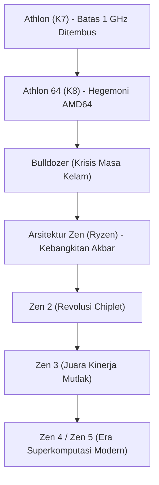

# Sejarah Perusahaan: Kisah Epik AMD - Dari Pesaing Abadi Hingga Pembalikan Bersejarah Lewat Ryzen

Dalam sejarah industri semikonduktor dunia, Advanced Micro Devices (AMD) memegang peranan yang sangat penting. Sejak didirikan pada tahun 1969, AMD lama dipandang oleh pasar sekadar sebagai "pesaing abadi" atau pabrikan alternatif lapis kedua ("second-source") di bawah bayang-bayang raksasa Intel. Namun, perjalanan nyata AMD adalah salah satu kisah kebangkitan paling mendebarkan dalam sejarah Silicon Valley.

Dari masa keemasan keunggulan arsitektur yang mengguncang industri, melintasi masa-masa kelam di ambang kebangkrutan total, hingga kebangkitan bersejarah lewat arsitektur "Zen" (keluarga prosesor Ryzen dan EPYC), AMD membuktikan ketangguhan rekayasa teknologi dan visi bisnisnya. Artikel ini mengulas secara komprehensif perjalanan berliku AMD dari awal pendirian hingga era komputasi kecerdasan buatan (AI).

## 1. Pendirian dan Era Pasokan Lapis Kedua (1969–1980-an)

AMD didirikan pada 1 Mei 1969 oleh Jerry Sanders dan tujuh rekannya dari Fairchild Semiconductor — hanya setahun setelah Intel didirikan oleh Robert Noyce dan Gordon Moore. Berbeda dengan pendiri Intel yang merupakan ilmuwan riset terkemuka, Sanders adalah eksekutif penjualan yang sangat karismatik. Berpegang pada prinsipnya ("Manusia yang utama; produk dan laba akan menyusul, tetapi penjualan adalah penggerak roda perusahaan"), AMD awalnya tidak memfokuskan modal pada desain arsitektur mandiri, melainkan bertindak sebagai produsen lapis kedua ("second-source") yang memproduksi chip kompatibel berlisensi.

Titik balik krusial terjadi pada tahun 1981, saat IBM mengembangkan "IBM PC" pertamanya. Untuk menjamin stabilitas rantai pasokan dan menghindari ketergantungan mutlak pada satu pemasok mikroprosesor (Intel 8088), IBM mewajibkan adanya pemasok alternatif berlisensi. Merespons syarat tersebut, Intel dan AMD menandatangani perjanjian lisensi silang teknologi pada tahun 1982. Kesepakatan ini memberi hak hukum bagi AMD untuk memproduksi dan memasarkan prosesor berarsitektur x86. Langkah ini melipatgandakan pendapatan AMD, meski mendatangkan reputasi sebagai pembuat "klon Intel".

## 2. Perang Kloning dan Perjuangan Menuju Kemandirian (1990-an)

Pada akhir dekade 1980-an, didorong oleh ledakan pasar komputer pribadi, Intel berupaya mengamankan laba secara sepihak dan memutus akses dokumen teknis prosesor 386 kepada AMD. Pantang menyerah, AMD menempuh jalur hukum antimonopoli yang berlarut-larut seraya menugaskan insinyurnya melakukan rekayasa balik (reverse engineering) independen. Pada tahun 1991, AMD merilis "Am386" — chip yang 100% kompatibel dengan Intel 80386 namun menawarkan kecepatan lebih tinggi (40 MHz vs 33 MHz) dengan harga lebih murah, mencatatkan kesuksesan komersial masif. Keberhasilan ini dilanjutkan oleh prosesor "Am486".

Namun, ketika Intel meluncurkan merek "Pentium" dengan perombakan arsitektur mendasar, keterbatasan strategi kloning kian nyata. Bertekad melepas status peniru, AMD mengakuisisi NexGen dan pada tahun 1996 meluncurkan arsitektur x86 orisinal pertamanya: "K5" (nama "K" diambil dari Krypton, planet asal Superman). Menyusul penundaan K5, chip penerusnya, "K6" (1997) — yang dirancang oleh Vinod Dham, tokoh di balik kesuksesan Pentium — berhasil menyamai kinerja chip Intel dan membuktikan kapasitas AMD sebagai perancang prosesor performa tinggi yang mandiri.

## 3. Era Keemasan: Menembus Batas 1 GHz dan Kejayaan AMD64 (1999–2005)

Momen yang meruntuhkan anggapan bahwa Intel tidak dapat dikalahkan terjadi pada Agustus 1999 melalui peluncuran arsitektur "K7", yang dipasarkan dengan nama "Athlon". Dipimpin arsitek brilian Dirk Meyer, Athlon melampaui kinerja Pentium III milik Intel dalam pengujian komputasi grafis dan gaming.

Pada Maret 2000, AMD menggemparkan dunia komputasi saat menjadi pabrikan pertama di dunia yang resmi menembus batas frekuensi **1 GHz (1.000 MHz)**, mendahului pengumuman Intel hanya dalam hitungan hari.

Dominasi berlanjut pada tahun 2003 dengan peluncuran arsitektur "K8" (Athlon 64 untuk desktop dan Opteron untuk server). K8 memperkenalkan instruksi "AMD64 (x86-64)", ekstensi 64-bit yang tetap kompatibel penuh dengan aplikasi 32-bit. Inovasi ini memaksa Intel mengadopsi standar 64-bit ciptaan AMD. Selain itu, K8 mengintegrasikan pengontrol memori langsung ke dalam die prosesor dan menghubungkannya lewat bus HyperTransport berkecepatan tinggi, memangkas latensi memori secara drastis.

Kala itu, Intel terjebak dalam arsitektur "NetBurst (Pentium 4)" yang memaksakan clock tinggi hingga memicu panas berlebih dan konsumsi daya boros. K8 milik AMD yang efisien dan memiliki IPC (Instructions Per Cycle) tinggi berhasil memikat komunitas perakit PC dan mendominasi pusat data perusahaan, menandai masa keemasan terbaik AMD.

## 4. Akuisisi ATI, Pemisahan Pabrik, dan Tragedi "Bulldozer" (2006–2014)

Sayangnya, puncak kejayaan tersebut tidak bertahan lama. Pada tahun 2006, Intel melancarkan serangan balik lewat arsitektur "Core (Core 2 Duo)" dan merebut kembali mahkota kinerja. Di saat bersamaan, AMD melakukan manuver berisiko besar: mengakuisisi raksasa grafis asal Kanada, ATI Technologies, senilai $5,4 miliar. Meski konsep penyatuan CPU dan GPU dalam satu chip (inisiatif APU Fusion) sangat visioner, utang besar yang ditanggung menguras kas perusahaan.

Beban kian berat karena biaya pembangunan pabrik fabrikasi semikonduktor (fabs) melonjak drastis. Pada tahun 2009, AMD mengambil langkah pahit memisahkan divisi manufakturnya menjadi GlobalFoundries, beralih menjadi perusahaan perancang murni ("fabless"). Keputusan ini mengakhiri semboyan legendaris Jerry Sanders: *"Pria sejati memiliki pabrik sendiri"*.

Pukulan terberat tiba pada tahun 2011 saat peluncuran arsitektur "Bulldozer". Mengusung konsep modul multi-threading yang keliru, kinerja per-core (IPC) Bulldozer justru menurun dibanding generasi sebelumnya, disertai lonjakan konsumsi daya dan panas. Dihadapkan pada prosesor Sandy Bridge dari Intel, Bulldozer kalah telak. AMD tersingkir dari segmen desktop kelas atas dan server. Harga sahamnya merosot di bawah $2 per lembar, dan para pengamat pasar memperkirakan AMD segera gulung tikar.

## 5. Kepemimpinan Lisa Su dan Pengembangan Rahasia "Zen" (2014–2016)

Pada Oktober 2014, saat perusahaan berada di titik nadir, babak baru dimulai: Dr. Lisa Su, seorang doktor teknik elektro lulusan MIT, diangkat menjadi CEO. Lisa Su segera memberlakukan disiplin strategis ketat: menghentikan proyek sampingan berbiaya tinggi di sektor ponsel dan IoT, serta memusatkan seluruh sumber daya pada satu fokus utama: **Komputasi Berkinerja Tinggi (CPU dan GPU)**.

Secara rahasia, proyek penyelamatan tengah berjalan. Jim Keller, perancang chip legendaris yang merancang K7/K8 dan prosesor seri A milik Apple, kembali ke AMD pada 2012 untuk merancang arsitektur x86 baru dari nol: arsitektur "Zen".

Lisa Su berhasil mengamankan arus kas perusahaan dengan memperluas pasokan chip semi-custom untuk konsol Sony PlayStation 4 dan Microsoft Xbox One, memberi waktu krusial bagi tim insinyur untuk menyempurnakan Zen.

## 6. Lahirnya "Ryzen" dan Pembalikan Sejarah Terbesar (2017–Sekarang)

Pada Maret 2017, AMD secara resmi merilis prosesor desktop generasi pertama "Ryzen". Mengusung arsitektur Zen, Ryzen mencatatkan **lonjakan IPC sebesar 52%** dibandingkan generasi Bulldozer — melampaui target internal 40% dan mendobrak perlambatan Hukum Moore. Di saat Intel membatasi pasar desktop pada prosesor 4-core selama bertahun-tahun, Ryzen menghadirkan 8-core dan 16-thread dengan harga terjangkau, memicu era adopsi multi-core massal.

$$
	ext{IPC} = rac{	ext{Instructions}}{	ext{Clock Cycle}}
$$

Kunci keberhasilan AMD terletak pada inovasi **desain modular "Chiplet"**. Ketimbang mencetak satu keping silikon monolitik berukuran besar yang rawan cacat produksi, AMD membagi prosesor menjadi chip komputasi kecil (CCD) yang dihubungkan ke chip I/O pusat melalui interkoneksi Infinity Fabric. Pendekatan ini meningkatkan hasil produksi, memangkas biaya per chip, dan mempermudah perakitan prosesor 16-core di kelas desktop serta lebih dari 64-core di server.

Selain itu, pelepasan pabrik di masa lalu berubah menjadi keunggulan terbesar. Dengan mempercayakan produksi kepada TSMC di Taiwan, pemimpin litografi ultraviolet ekstrem (EUV) dunia, AMD melompati Intel yang terhambat masalah fabrikasi 14nm dan 10nm. Lewat peluncuran "Zen 2" (2019) dan "Zen 3" (2020), AMD merebut supremasi kinerja single-core, multi-core, serta efisiensi daya.

Di pasar pusat data, prosesor "EPYC" meruntuhkan dominasi 99% milik Intel dan diadopsi secara luas oleh raksasa komputasi awan global seperti AWS, Google Cloud, dan Microsoft Azure.

## 7. Menatap Masa Depan: Gelombang Superkomputasi dan AI

Kini, AMD bukan lagi sekadar alternatif terjangkau, melainkan salah satu raksasa penentu arah teknologi dunia. Pada tahun 2022, AMD menuntaskan akuisisi perusahaan chip adaptif Xilinx senilai $49 miliar dan sempat melampaui kapitalisasi pasar Intel.

Medan persaingan utama saat ini beralih ke kecerdasan buatan (AI). Di pasar akselerator AI yang dipimpin NVIDIA, AMD menghadirkan lini "Instinct MI300" yang memadukan CPU, GPU, dan memori pita lebar tinggi (HBM3) dalam kemasan 3D canggih untuk menawarkan platform terbuka lewat ekosistem ROCm.

Dari ambang kebangkrutan hingga memimpin inovasi komputasi global, kisah AMD merupakan bukti nyata keunggulan rekayasa teknologi dan kepemimpinan yang berani. Kehadirannya menjamin iklim persaingan yang sehat dan mendorong laju inovasi bagi pengguna di seluruh dunia.
