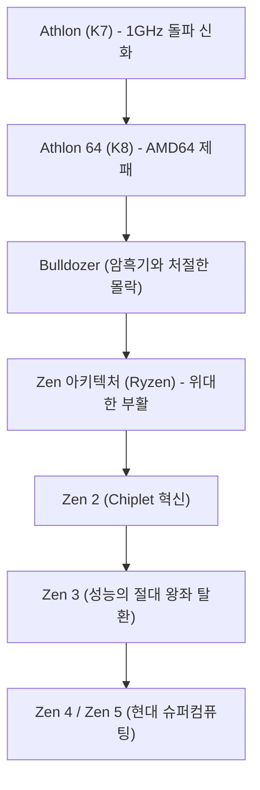

# 기업사: AMD의 역사 - 영원한 도전자에서 라이젠(Ryzen)으로 이뤄낸 위대한 역전극

글로벌 반도체 산업의 역사를 논할 때 AMD(Advanced Micro Devices)를 빼놓을 수 없습니다. 1969년 창립 이래 반세기 넘게 업계의 절대 군주인 인텔(Intel)의 '영원한 2인자'이자 '세컨드 소스(대체 제조사)'로 인식되어 왔지만, AMD의 실제 궤적은 실리콘밸리 역사상 가장 극적이고 전율 돋는 대역전극이었습니다.

경쟁사를 기술력으로 압도하며 시장을 호령했던 황금기부터, 파산 직전까지 내몰렸던 암흑기, 그리고 혁신적인 'Zen' 아키텍처(라이젠 및 에픽 시리즈)를 앞세워 일궈낸 역사적인 부활까지, AMD의 역사는 집념 어린 공학 정신과 탁월한 경영 전략의 승리였습니다. 본 기사에서는 창업부터 AI 슈퍼컴퓨팅의 최전선에 이르기까지 AMD의 대서사시를 상세히 조명합니다.

## 1. 창업과 세컨드 소스 시대 (1969년~1980년대)

AMD는 1969년 5월 1일, 페어차일드 반도체의 전설적인 영업 임원 출신인 제리 샌더스(Jerry Sanders)와 7명의 동료들에 의해 설립되었습니다. 로버트 노이스와 고든 무어가 인텔을 세운 지 정확히 1년 뒤의 일이었습니다. 기술자 출신이었던 인텔 창업자들과 달리 샌더스는 카리스마 넘치는 영업의 귀재였습니다. "사람이 먼저이고 제품과 이익은 그 뒤를 따른다"는 샌더스의 철학 아래, 초기의 AMD는 막대한 연구개발비가 드는 독자 설계 대신 타사의 칩을 대체 제조하는 '세컨드 소스(Second Source)' 공급에 집중했습니다.

운명적인 전기는 1981년 찾아왔습니다. 당시 IBM이 최초의 'IBM PC'를 개발하면서 단일 공급처의 부품 수급 위험을 없애기 위해 CPU(인텔의 8088)의 세컨드 소스를 강력히 요구한 것입니다. 이에 따라 인텔과 AMD는 1982년 기술 교환 협정(크로스 라이선스)을 체결했고, AMD는 합법적으로 x86 프로세서를 제조 및 판매할 권리를 획득했습니다. 이 계약은 AMD의 폭발적인 매출 성장을 견인했지만, 동시에 '인텔의 카피캣(복제 회사)'이라는 꼬리표를 안겨주었습니다.

## 2. 클론 전쟁과 독자 노선의 험난한 개척 (1990년대)

1980년대 후반, PC 시장이 폭발적으로 팽창하자 인텔은 시장 독점을 위해 AMD에 386 프로세서 기술 공개를 거부하며 계약 파기를 선언했습니다. 생존의 벼랑 끝에 몰린 AMD는 지루한 반독점 법정 투쟁을 벌이는 동시에 역설계(리버스 엔지니어링)를 통한 독자 칩 개발에 착수했습니다. 1991년 발표된 'Am386'은 인텔 386과 100% 호환되면서도 더 빠른 40MHz 클럭과 저렴한 가격을 무기로 공전의 히트를 기록했습니다. 후속작인 'Am486' 역시 큰 성공을 거두었습니다.

그러나 인텔이 '펜티엄(Pentium)' 브랜드를 도입하며 아키텍처를 전면 쇄신하자, 단순 클론 방식의 한계가 명확해졌습니다. 이에 AMD는 넥스젠(NexGen)을 인수하고 1996년 최초의 순수 자체 설계 x86 아키텍처인 'K5'(슈퍼맨의 고향 행성 크립톤에서 명명)를 출시했습니다. K5는 개발 지연으로 빛을 보지 못했으나, '펜티엄의 아버지' 비노드 담(Vinod Dham)이 합류해 완성한 'K6'(1997년)가 펜티엄과 동급의 성능을 내며 독자적인 고성능 CPU 설계사로서 확고한 입지를 다지게 되었습니다.

## 3. 황금기: 1GHz의 벽 돌파와 AMD64의 천하통일 (1999년~2005년)

인텔의 기술적 무결점 신화를 무너뜨린 결정적 분기점은 1999년 8월이었습니다. 천재 엔지니어 더크 마이어(Dirk Meyer)가 이끈 새로운 'K7' 아키텍처, 즉 '애슬론(Athlon)'이 화려하게 등장했습니다. 애슬론은 부동소수점 연산과 게임 성능에서 인텔의 플래그십 펜티엄 III를 압도했습니다.

그리고 2000년 3월, AMD는 전 세계 IT 업계를 발칵 뒤집어 놓았습니다. 인텔을 며칠 차이로 제치고 인류 역사상 최초로 프로세서 동작 클럭 **1GHz(1,000MHz)** 의 벽을 공식 돌파한 것입니다.

기술적 전성기는 2003년 출시된 'K8' 아키텍처(데스크톱용 애슬론 64 및 서버용 옵테론)에서 정점에 달했습니다. K8은 32비트 호환성을 완벽히 유지하면서 x86을 64비트로 확장한 'AMD64(x86-64)' 명령어를 세계 최초로 선보여, 역으로 인텔이 AMD의 64비트 표준을 채택하도록 강제했습니다. 아울러 메모리 컨트롤러를 CPU 다이에 직접 통합하여 지연 시간을 획기적으로 줄였습니다.

이 시기 인텔은 무리하게 클럭만 높이려던 '넷버스트(NetBurst, 펜티엄 4)'의 발열과 전력 소비 폭주(일명 보일러 펜티엄)에 빠져 허우적대고 있었습니다. 반면 AMD의 K8은 높은 IPC(클럭당 명령어 처리 횟수)와 경이로운 와트당 성능으로 PC 게이머와 엔터프라이즈 데이터센터 시장을 휩쓸며 인텔을 턱밑까지 추격하는 사상 최고의 황금기를 구가했습니다.

## 4. ATI 인수, 파운드리 분사, 그리고 '불도저의 비극' (2006년~2014년)

하지만 영광은 오래가지 못했습니다. 2006년 인텔이 뼈를 깎는 혁신 끝에 전설적인 '코어(Core 2 Duo)' 아키텍처를 내놓으며 왕좌를 탈환했습니다. 설상가상으로 같은 해 AMD는 캐나다의 그래픽 칩 강자 ATI를 약 54억 달러라는 거액에 인수했습니다. CPU와 GPU를 결합하는 미래 지향적 비전(Fusion/APU)이었으나, 과도한 인수 비용은 AMD의 재무구조를 심각하게 파괴했습니다.

여기에 인텔과의 미세공정 설비투자 경쟁이 가열되자 자체 팹(반도체 제조공장) 유지 비용을 감당할 수 없게 되었습니다. 결국 2009년, AMD는 제조 부문을 분사하여 글로벌파운드리(GlobalFoundries)로 독립시키고 순수 팹리스(Fabless) 설계 회사로 전환하는 뼈아픈 결단을 내립니다. 샌더스의 오랜 명언인 "진짜 남자는 팹을 소유한다(Real men have fabs)"를 스스로 깨뜨린 순간이었습니다.

기술적 재앙도 닥쳤습니다. 2011년 야심 차게 선보인 차세대 아키텍처 '불도저(Bulldozer)'가 처참한 실패로 끝난 것입니다. 무리한 모듈 구조 설계로 인해 싱글스레드 IPC가 이전 세대보다 퇴보하는 치명적 결함을 드러냈고, 발열과 전력 소모도 통제 불능이었습니다. 인텔의 2세대 코어 프로세서(샌디브릿지)에 완벽히 궤멸당한 AMD는 고성능 PC와 서버 시장에서 퇴출당했고, 주가는 2달러 밑으로 곤두박질치며 시장에서는 파산을 기정사실로 받아들였습니다.

## 5. 리사 수의 취임과 극비 프로젝트 'Zen'의 출범 (2014년~2016년)

회사가 벼랑 끝에 몰려 있던 2014년 10월, 기적의 서막이 올랐습니다. MIT 전기공학 박사 출신의 정통 엔지니어인 리사 수(Dr. Lisa Su)가 신임 CEO로 취임한 것입니다. 리사 수 박사는 취임 직후 스마트폰과 사물인터넷 등 분산되어 있던 잡다한 사업을 단호히 정리하고, AMD의 본령인 **'고성능 컴퓨팅(CPU와 GPU)'** 에 회사의 모든 사활을 집중시켰습니다.

그 무렵, AMD 내부에서는 극비 프로젝트가 진행되고 있었습니다. K7과 K8을 설계하고 애플 A 시리즈 칩의 기틀을 닦았던 전설적인 반도체 설계 거장 짐 켈러(Jim Keller)가 2012년 친정으로 복귀하여 백지상태에서 완전히 새로운 x86 아키텍처를 설계하고 있었던 것입니다. 이것이 바로 훗날 세상을 뒤흔들게 되는 'Zen'입니다.

리사 수 CEO는 콘솔 게임기(소니 PS4, 마이크로소프트 Xbox One)용 반도체를 안정적으로 공급하는 세미커스텀 사업으로 회사의 현금 유동성을 방어하며, 짐 켈러 팀이 Zen을 완성할 때까지의 귀중한 시간을 벌어주었습니다.

## 6. '라이젠(Ryzen)'의 탄생과 역사적인 대역전 (2017년〜현재)

2017년 3월, AMD는 마침내 1세대 '라이젠(Ryzen)' 프로세서를 세상에 공개했습니다. 완전히 새로운 Zen 아키텍처로 무장한 라이젠은 기존 불도저 대비 **52%의 경이적인 IPC 향상** 을 달성하며 업계의 상식을 뒤엎었습니다. 더욱이 인텔이 10년 가까이 4코어에 머무르며 '소비자 기만(일명 쿼드코어 쇄국정책)'을 지속하던 시장에, 라이젠은 합리적인 가격으로 8코어 16스레드를 전격 도입하여 멀티코어 대중화의 빗장을 열었습니다.

$$
	ext{IPC} = rac{	ext{Instructions}}{	ext{Clock Cycle}}
$$

라이젠의 진격은 멈추지 않았습니다. AMD의 가장 결정적인 신의 한 수는 **'칩렛(Chiplet)' 설계** 였습니다. 거대한 단일 다이(Monolithic Die)를 찍어내는 대신, 수율이 높은 작은 다이(CCD)들을 초고속 인피니티 패브릭(Infinity Fabric) 버스로 연결하는 이 혁신을 통해, AMD는 압도적인 저비용으로 16코어 이상의 메니코어 프로세서를 양산해냈습니다.

또한 과거 팹을 포기했던 결단이 거꾸로 신의 한 수가 되었습니다. 세계 최고의 미세공정 기술력을 보유한 대만 TSMC에 전량 위탁 생산함으로써, 14nm 및 10nm 공정 전환 지연으로 발목이 잡힌 인텔을 공정 미세화에서 완벽하게 추월한 것입니다. 2019년 'Zen 2(라이젠 3000)', 2020년 'Zen 3(라이젠 5000)'에 이르러 AMD는 마침내 싱글스레드, 멀티스레드, 전력 효율 모든 면에서 인텔의 숨통을 끊고 세계 1위의 왕관을 탈환했습니다.

서버 시장에서도 '에픽(EPYC)' 프로세서가 인텔의 99% 독점 철옹성을 허물며 아마존 AWS, 구글 클라우드, 마이크로소프트 애저 등 글로벌 빅테크의 표준 CPU로 대거 채택되었습니다.

## 7. 미래를 향하여: AI 슈퍼컴퓨팅 시대의 진격

현재의 AMD는 과거의 '가성비 대체품'이 아닙니다. 컴퓨팅의 최전선을 개척하는 반도체 제국으로 완전히 우뚝 섰습니다. 2022년 글로벌 FPGA 1위 기업인 자일링스(Xilinx)를 490억 달러에 인수 완료하며 시가총액에서 한때 인텔을 추월하는 기염을 토했습니다.

오늘날 반도체 업계의 최대 격전지는 바로 '인공지능(AI)'입니다. 엔비디아(NVIDIA)가 독점하고 있는 AI 가속기 시장에서, AMD는 CPU와 GPU, 초고대역폭 메모리(HBM3)를 3D 패키징으로 하나로 묶은 괴물 같은 칩 '인스팅트 MI300(Instinct MI300)' 시리즈를 선보이며 유일하게 대항할 수 있는 강력한 대항마로 시장을 뒤흔들고 있습니다.

파산 직전의 영원한 도전자에서 기술에 대한 순수한 열정과 완벽한 리더십으로 기적의 드라마를 완성한 AMD. 그들의 존재가 있기에 반도체 시장에는 건강한 경쟁이 유지되고 있으며, 인류는 더 강력한 기술적 진보를 누리고 있습니다. AMD의 담대한 항해는 계속되고 있습니다.
