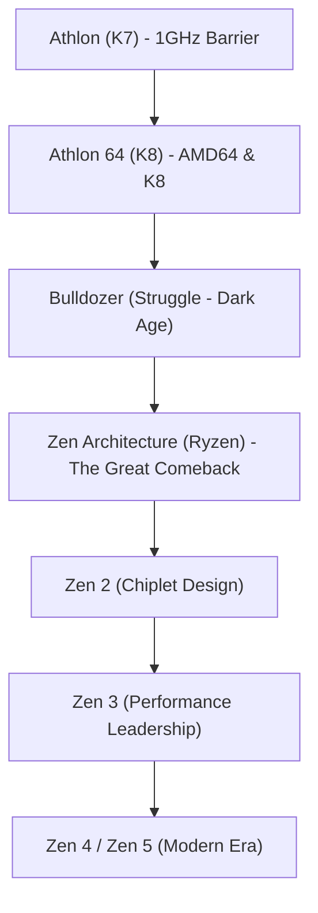

# 企業史: AMDの歴史 - 永遠の挑戦者からRyzenでの大逆転

半導体業界の歴史を語る上で、Advanced Micro Devices（AMD）の存在を抜きにすることはできません。1969年の創業以来、長らく業界の巨人であるIntelの「永遠の対抗馬」「セカンドソース」として認識されてきたAMDですが、その歴史は決して平坦なものではありませんでした。

技術的優位に立ち市場を席巻した黄金期から、倒産の危機に瀕した暗黒期、そして「Zen」アーキテクチャ（Ryzenシリーズ）による歴史的な大逆転劇まで、AMDの歩みはシリコンバレーで最も劇的で魅力的な物語の一つです。本記事では、AMDの創業から現在に至るまでの波乱万丈な歴史を詳細に振り返ります。

## 1. 創業とセカンドソース時代（1969年〜1980年代）

AMDは1969年5月1日、フェアチャイルド・セミコンダクターの元幹部であるジェリー・サンダース（Jerry Sanders）らによって設立されました。Intelが設立されたわずか1年後のことです。Intelの創業者であるロバート・ノイスやゴードン・ムーアが技術者として名を馳せていたのに対し、サンダースは卓越した営業マンでした。「人は製品第一と言うが、私は営業第一だと信じている」というサンダースの哲学のもと、AMDは初期段階では独自開発ではなく、他社製品のセカンドソース（代替製造）に注力しました。

転機が訪れたのは1981年、IBMが初代「IBM PC」を開発した際です。IBMは部品供給の安定性を確保するため、CPU（当時はIntelの8088）のセカンドソースを要求しました。これを受け、IntelとAMDは1982年にテクノロジー交換協定（クロスライセンス契約）を結びます。これによりAMDは正式にIntelのx86プロセッサを製造・販売する権利を得ました。この協定によりAMDは急成長を遂げますが、同時に「Intelのコピー品を作る会社」というレッテルを貼られることにもなりました。

## 2. クローン戦争と独自路線の模索（1990年代）

1980年代後半になると、PC市場の爆発的な成長を背景に、Intelは自社の利益を独占するためAMDへの技術提供を制限し始めます。これに反発したAMDは長きにわたる法廷闘争に突入しながらも、リバースエンジニアリングによる互換プロセッサの開発を進めました。1991年に発表された「Am386」はIntelの80386と完全互換でありながら、より高速で安価だったため大ヒットを記録。続く「Am486」でも成功を収めました。

しかし、Intelが「Pentium」を発表してアーキテクチャを一新すると、互換プロセッサの開発限界が見え始めます。AMDは単なるクローンメーカーからの脱却を決意し、1996年に初の完全自社設計アーキテクチャ「K5」を投入します（「K」はスーパーマンの故郷クリプトン星から取られました）。開発の遅れからK5は商業的に苦戦したものの、続いて買収したNexGenの技術をベースに開発された「K6」プロセッサによって、AMDは再びIntelに強力な競争を挑むことができるようになりました。

## 3. 黄金時代：1GHzの壁の突破と「AMD64」の覇権（1999年〜2005年）

1999年、AMDはシリコンバレーの天才エンジニアと称されるダーク・メイヤーらを擁して「Athlon（K7）」を発表します。Athlonの性能は圧倒的で、同世代のIntel Pentium IIIを凌駕しました。2000年3月には、PCの歴史において象徴的なマイルストーンとなる「1GHz（ギガヘルツ）」のクロック周波数を、Intelよりも数日早く達成し、世界初の1GHzプロセッサとして歴史に名を刻みました。

AMDの技術的優位はさらに続きます。2003年に発表された「K8」アーキテクチャ（Athlon 64およびサーバー向けのOpteron）は、Intelに先駆けてx86アーキテクチャを64ビットに拡張する「AMD64（x86-64）」命令セットを導入しました。また、メモリコントローラをCPUダイに統合することでメモリ遅延を大幅に削減する革新的な設計を採用しました。

この時期、Intelは「NetBurstアーキテクチャ（Pentium 4）」でクロック周波数をひたすら引き上げる戦略をとっていましたが、消費電力と発熱の壁（熱の壁）にぶつかり停滞していました。AMDのK8は低いクロックでも高いIPC（クロックあたりの命令実行数）を誇り、圧倒的なワットパフォーマンスでPCゲーマーやサーバー市場から熱狂的な支持を集めました。一時期、AMDのデスクトップPC市場におけるシェアはIntelを脅かすレベルにまで到達し、まさに黄金期を謳歌していました。

## 4. ATI買収、製造部門の分離、そして「Bulldozerの悲劇」（2006年〜2014年）

しかし、絶頂期は長くは続きませんでした。2006年、Intelは革新的な「Coreアーキテクチャ（Core 2 Duo）」を投入し、王者の座を奪還します。時を同じくして、AMDはカナダのGPUメーカーであるATI Technologiesを約54億ドルで買収しました。CPUとGPUを統合する「APU」という未来のビジョン（Fusion構想）に向けた戦略的買収でしたが、この巨額の買収資金はAMDの財務を深く傷つけました。

さらに、自社工場（ファブ）での微細化競争においてIntelに引き離され、多額の設備投資が経営の重荷となりました。2009年、AMDはついに自社の製造部門をスピンオフ（のちのGlobalFoundries）し、「ファブレス」半導体企業へと転換する苦渋の決断を下します。サンダースがかつて語った「本物の男は自前で工場を持つ（Real men have fabs）」という言葉を自ら打ち破るものでした。

技術面でも最大の危機が訪れます。2011年に満を持して投入した新アーキテクチャ「Bulldozer（ブルドーザー）」が致命的な失敗に終わったのです。マルチスレッド性能を重視するあまり、シングルスレッド性能（IPC）が前世代よりも低下するという致命的な欠陥を抱え、さらに消費電力も激増。Intelの「Sandy Bridge」などCore iシリーズに対して全く競争にならず、ハイエンド市場からの事実上の撤退を余儀なくされました。株価は2ドル未満にまで暴落し、多くの人が「AMDは終わった」と考えました。

## 5. リサ・スーの就任と「Zen」による反撃の準備（2014年〜2016年）

倒産の噂すら囁かれていた2014年10月、ターニングポイントが訪れます。MITで博士号を取得した気鋭のエンジニア、リサ・スー（Dr. Lisa Su）がCEOに就任しました。彼女は就任後、事業の選択と集中を徹底します。スマートフォンやIoTなど様々な分野に手を出していた戦略を白紙に戻し、「高性能コンピューティング（CPUとGPU）」というAMD本来の強みに全リソースを集中させる決断を下しました。

この時、AMDの社内では極秘裏にあるプロジェクトが進行していました。AppleでAシリーズチップの基礎を築き、かつてAMDでK7やK8の成功を牽引した天才アーキテクト、ジム・ケラー（Jim Keller）が2012年に復帰し、白紙の状態から全く新しいCPUアーキテクチャを設計していたのです。このアーキテクチャこそが、後に世界を驚かせることになる「Zen」です。

スーCEOは、Zenが完成するまでの数年間、セミカスタム事業（PS4やXbox One向けのチップ供給）で確実に日銭を稼ぎ、会社を存続させるという巧みな手腕を発揮しました。

## 6. 「Ryzen」の誕生、そして歴史的な大逆転（2017年〜現在）

2017年3月、AMDはついに新CPU「Ryzen（ライゼン）」を発表します。初代Zenアーキテクチャを採用したRyzenは、前世代（Bulldozer系）から一気に52%ものIPC向上を達成するという、半導体業界の常識を覆す飛躍を遂げました。さらに、Intelの同価格帯のCPUが4コアにとどまっていた時代に、Ryzenは8コア/16スレッドを衝撃的な低価格で投入。PC市場に「多コア化」という新しいパラダイムをもたらしました。

$$
\text{IPC} = \frac{\text{Instructions}}{\text{Clock Cycle}}
$$

Ryzenの快進撃は初代だけにとどまりませんでした。AMDの最大の強みとなったのは「チップレット（Chiplet）設計」です。巨大な1つのシリコンダイを製造するのではなく、小さなダイ（チップレット）を複数組み合わせて1つの高性能CPUを作るこの技術により、製造歩留まりを劇的に改善し、低コストで16コアやそれ以上のメニーコアCPUを実現しました。

また、自社工場を手放したことが逆に最大の武器となりました。世界最高の微細化技術を持つ台湾TSMCに製造を委託することで、製造プロセスで長らく足踏み（14nmや10nmでの遅延）を続けていたIntelを遂に逆転したのです。2019年の「Zen 2（Ryzen 3000シリーズ）」、2020年の「Zen 3（Ryzen 5000シリーズ）」で、AMDはついにIntelからシングルスレッド性能、マルチスレッド性能、電力効率の全ての王冠を奪い取りました。

サーバー市場でも「EPYC（エピック）」プロセッサが、長年Intelの牙城だったデータセンター市場を切り崩し、AWSやGoogle Cloudなどの巨大IT企業に次々と採用されています。

## 7. 未来へ：AI時代への挑戦

現在、AMDはかつての「安い代替品」ではありません。技術力で業界をリードするトップ企業の一角に返り咲きました。時価総額でも一時Intelを追い抜き、2022年にはFPGA大手のXilinx（ザイリンクス）の買収を完了させ、製品ポートフォリオをさらに強固にしています。

現在の半導体業界における最大の戦場は「AI（人工知能）」です。NVIDIAが圧倒的なシェアを持つAIアクセラレータ市場において、AMDは「Instinct MI」シリーズを投入し、唯一対抗しうる企業として激しい競争を繰り広げています。

永遠の挑戦者として倒産の危機を乗り越え、技術への執念と正しいリーダーシップによって大逆転を果たしたAMD。彼らの存在があるからこそ、CPU市場には健全な競争が生まれ、私たちユーザーはより良いテクノロジーを手にすることができるのです。AMDの「次の一手」に、これからも世界中が注目しています。
