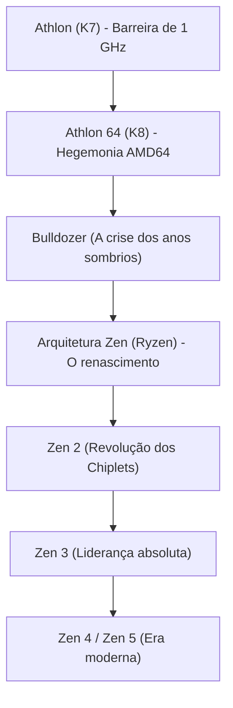

# História corporativa: A saga da AMD – Do eterno desafiante à virada triunfal com a arquitetura Ryzen

Ao explorar a história da indústria mundial de semicondutores, é impossível não destacar a Advanced Micro Devices (AMD). Fundada em 1969, a empresa foi vista por décadas apenas como a "eterna segunda colocada" e uma fabricante de chips substitutos sob a sombra da toda-poderosa Intel. No entanto, a trajetória real da AMD é uma das mais espetaculares e eletrizantes reviravoltas corporativas de todo o Vale do Silício.

De seus períodos dourados de supremacia em arquitetura de hardware, passando por momentos tenebrosos à beira da falência, até o renascimento grandioso liderado pela arquitetura "Zen" (famílias Ryzen e EPYC), a história da AMD celebra a determinação da engenharia e a visão estratégica. Este artigo revisita detalhadamente a jornada da AMD, desde suas origens até a era da inteligência artificial.

## 1. Fundação e a era dos fornecedores secundários (1969–década de 1980)

A AMD nasceu em 1º de maio de 1969 pelas mãos de Jerry Sanders e sete ex-colegas da Fairchild Semiconductor — exatamente um ano após a criação da Intel por Robert Noyce e Gordon Moore. Enquanto os fundadores da Intel eram prestigiados cientistas e inventores, Sanders era um gênio comercial nato e extremamente carismático. Com o lema "As pessoas vêm primeiro; os produtos e lucros virão em seguida, mas as vendas movem a máquina", a AMD inicialmente evitou projetos próprios de alto risco e focou na produção secundária ("second source") de chips projetados por terceiros com total compatibilidade de pinos.

O grande divisor de águas ocorreu em 1981, quando a IBM desenvolvia o lendário "IBM PC". Para mitigar riscos na cadeia de suprimentos e não depender exclusivamente de um único fornecedor para seu processador central (o Intel 8088), a IBM exigiu formalmente a existência de uma segunda fonte de fabricação certificada. Em 1982, Intel e AMD firmaram um acordo histórico de licenciamento cruzado de tecnologias, concedendo à AMD o direito legítimo de produzir e comercializar chips x86. Esse contrato provocou uma explosão nas receitas da empresa, mas cimentou sua imagem de mera "copiadora da Intel".

## 2. A guerra dos clones e a emancipação da engenharia (década de 1990)

Com a popularização acelerada dos computadores pessoais no final dos anos 1980, a Intel decidiu concentrar todos os lucros e rompeu os repasses de tecnologia do processador 386 para a AMD. Em resposta, a AMD encarou longas batalhas judiciais antitruste, ao mesmo tempo em que colocou seus engenheiros para realizar engenharia reversa do chip em salas limpas. Em 1991, lançou o "Am386", 100% compatível com as instruções do 80386 da Intel, mas entregando clocks superiores (40 MHz contra 33 MHz) por um preço muito mais acessível, tornando-se um estrondoso sucesso de vendas. O posterior "Am486" seguiu o mesmo caminho vitorioso.

Entretanto, quando a Intel lançou a marca "Pentium" com uma arquitetura renovada, a estratégia de clonagem atingiu seu teto. Determinada a conquistar sua independência criativa, a AMD adquiriu a NexGen e apresentou em 1996 sua primeira arquitetura x86 desenvolvida do zero: o "K5" (homenageando Krypton, o planeta do Superman). Apesar dos atrasos do K5, seu sucessor, o "K6" (1997) — liderado por Vinod Dham, o "pai do Pentium" —, alcançou o desempenho dos chips da Intel e provou a maturidade da AMD no design de processadores de alto rendimento.

## 3. A era de ouro: Quebra da barreira de 1 GHz e a consagração do AMD64 (1999–2005)

O momento que derrubou a mística de invencibilidade da Intel aconteceu em agosto de 1999 com a estreia da arquitetura "K7", imortalizada com o nome "Athlon". Sob o comando do brilhante arquiteto Dirk Meyer, o Athlon superou o Pentium III em cálculos de ponto flutuante e jogos eletrônicos.

Em março de 2000, a AMD assombrou a comunidade técnica global ao cruzar pela primeira vez na história a emblemática barreira de **1 GHz (1.000 MHz)** de clock, batendo a Intel por poucos dias de vantagem.

A consagração plena chegou em 2003 com a arquitetura "K8" (Athlon 64 para desktops e Opteron para servidores). O K8 introduziu as instruções "AMD64 (x86-64)", uma extensão de 64 bits perfeitamente compatível com o ecossistema de 32 bits, obrigando a própria Intel a licenciar e adotar a criação da concorrente. Além disso, o K8 integrou pela primeira vez o controlador de memória diretamente no chip principal, comunicando-se pelo veloz barramento HyperTransport e eliminando gargalos históricos de latência.

Enquanto a Intel patinava na arquitetura "NetBurst (Pentium 4)", perseguindo frequências irreais que geravam calor excessivo e consumo descontrolado de energia, o K8 da AMD entregava excelente IPC (instruções por ciclo de clock) e eficiência térmica, dominando a preferência de gamers e data centers em sua fase mais brilhante.

## 4. A compra da ATI, a separação das fábricas e a catástrofe do "Bulldozer" (2006–2014)

Contudo, a liderança foi efêmera. Em 2006, a Intel contra-atacou com a revolucionária arquitetura "Core (Core 2 Duo)", recuperando o trono de desempenho. Ao mesmo tempo, a AMD assumiu um risco financeiro titânico: comprou a gigante canadense de placas de vídeo ATI Technologies por US$ 5,4 bilhões. Embora a visão a longo prazo de unir CPU e GPU em uma única unidade ("APU Fusion") fosse acertada, a dívida contraída asfixiou as finanças da empresa.

Para agravar a situação, os custos astronômicos de modernização das fábricas de chips (fabs) tornaram-se insustentáveis frente ao poderio financeiro da Intel. Em 2009, a AMD tomou a dura decisão de desmembrar suas fábricas e fundar a GlobalFoundries, transformando-se em uma companhia puramente "fabless" (sem fábricas próprias). Rompia-se aí a histórica frase de Jerry Sanders: *“Homens de verdade têm fábricas”*.

O maior revés técnico ocorreu em 2011 com o lançamento da arquitetura "Bulldozer". Ao adotar uma divisão ineficiente de recursos por módulos, o Bulldozer sofreu uma queda no desempenho mononúcleo (IPC) em relação à geração anterior, gerando altíssimo consumo elétrico e superaquecimento. Esmagada pelos chips Sandy Bridge da Intel, a AMD foi expulsa do mercado de alto desempenho e de servidores. Suas ações despencaram para menos de 2 dólares e o mercado financeiro dava sua falência como certa.

## 5. A liderança de Lisa Su e o projeto secreto "Zen" (2014–2016)

Em outubro de 2014, à beira do colapso total, deu-se a grande guinada: a Dra. Lisa Su, PhD em engenharia elétrica pelo MIT, assumiu como CEO. Ela impôs uma severa disciplina de foco: encerrou experimentos dispersos em dispositivos móveis e IoT e canalizou cada centavo para o coração da AMD: **a computação de alto desempenho (CPUs e GPUs)**.

Nos bastidores, um ambicioso plano de salvação estava em curso. Jim Keller, o lendário projetista por trás do K7, K8 e dos primeiros chips da Apple, havia retornado à AMD em 2012 para desenhar uma microarquitetura x86 totalmente limpa: a arquitetura "Zen".

Lisa Su garantiu o fôlego financeiro da companhia expandindo o fornecimento de chips customizados (as APUs do PlayStation 4 da Sony e do Xbox One da Microsoft), comprando o tempo indispensável para que a equipe de Keller refinasse o Zen.

## 6. A consagração do "Ryzen" e a grande virada (2017–presente)

Em março de 2017, a AMD lançou oficialmente os processadores "Ryzen". Baseado na arquitetura Zen, o Ryzen registrou um estonteante **aumento de 52% no IPC** em relação ao Bulldozer — superando com folga a meta interna de 40% e quebrando a estagnação da indústria. Além disso, enquanto a Intel restringia o mercado consumidor a chips de 4 núcleos havia uma década, o Ryzen democratizou processadores de 8 núcleos e 16 threads a preços amplamente acessíveis.

$$
	ext{IPC} = rac{	ext{Instructions}}{	ext{Clock Cycle}}
$$

O trunfo supremo da AMD foi o pioneirismo no design modular baseado em **"Chiplets"**. Em vez de fabricar uma única pastilha maciça de silício propensa a defeitos, a AMD dividiu a CPU em pequenos blocos de cálculo (CCDs) conectados a um chip central de I/O pelo veloz barramento Infinity Fabric. Isso maximizou o aproveitamento das lâminas de silício, reduziu custos e permitiu colocar até 16 núcleos em computadores domésticos e mais de 64 em servidores.

A decisão anterior de abrir mão das fábricas virou sua maior vantagem competitiva: contratando a produção com a taiwanesa TSMC, líder absoluta em litografia ultravioleta extrema (EUV), a AMD ultrapassou a Intel, paralisada em sucessivos atrasos com seus nós de 14 e 10 nanômetros. Com o "Zen 2" (2019) e o "Zen 3" (2020), a AMD assumiu a dianteira em desempenho mononúcleo, multinúcleo e eficiência energética.

Nos data centers, os processadores "EPYC" romperam o monopólio quase absoluto da Intel, sendo adotados massivamente por gigantes como AWS, Google Cloud e Microsoft Azure.

## 7. Rumo ao futuro: O avanço na inteligência artificial

Atualmente, a AMD consolidou-se na elite do setor de semicondutores. Em 2022, concluiu a aquisição da fabricante de chips adaptáveis Xilinx por US$ 49 bilhões e chegou a superar a Intel em valor de mercado.

O novo campo de batalha é a inteligência artificial. Frente à forte presença da NVIDIA no setor de aceleradores, a AMD lançou a série "Instinct MI300", combinando CPU, GPU e memória HBM3 em avançados encapsulamentos 3D para oferecer uma alternativa aberta e robusta com a plataforma ROCm.

De candidata à falência a protagonista do avanço tecnológico global, a trajetória da AMD comprova a força da engenharia de ponta e da liderança determinada, mantendo o ecossistema tecnológico competitivo e fértil para as próximas gerações.
