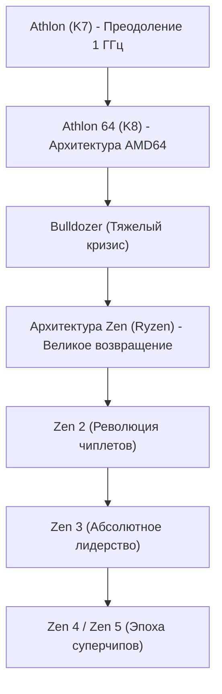

# Корпоративная история: Сага об AMD — От вечного претендента до легендарного реванша с Ryzen

Изучая историю мировой полупроводниковой индустрии, невозможно обойти вниманием компанию Advanced Micro Devices (AMD). С момента своего основания в 1969 году она десятилетиями воспринималась широкой публикой лишь как «вечный второй номер» и резервный производитель в тени гиганта Intel. Однако подлинная история AMD представляет собой одну из самых захватывающих и драматичных страниц летописи Кремниевой долины.

От золотых эпох технологического превосходства, поражавших мир, через тяжелейшие кризисные годы на грани банкротства, к историческому возрождению на базе микроархитектуры «Zen» (процессоры Ryzen и EPYC) — путь AMD стал образцом инженерной смелости и стратегической стойкости. В этой статье представлен подробный экскурс в историю AMD от истоков до эпохи искусственного интеллекта.

## 1. Основание и эра лицензионного производства (1969 — 1980-е годы)

AMD была основана 1 мая 1969 года Джерри Сандерсом и семью его коллегами из Fairchild Semiconductor — всего через год после того, как Роберт Нойс и Гордон Мур создали Intel. В отличие от основателей Intel, бывших учеными мирового уровня, Сандерс обладал выдающимся коммерческим талантом и лидерской харизмой. Руководствуясь принципом «Люди важнее всего, продукты и прибыль придут следом, но продажи двигают всё вперед», молодая компания сначала не разрабатывала собственные архитектуры, а сосредоточилась на роли надежного второго поставщика («second source»), выпускавшего полностью совместимые микросхемы сторонних разработчиков.

Решающий поворот произошел в 1981 году, когда корпорация IBM создавала первый массовый «IBM PC». Стремясь защитить цепочки поставок и избежать зависимости от единственного производителя центрального процессора (Intel 8088), IBM жестко потребовала наличия альтернативного сертифицированного поставщика. В 1982 году Intel и AMD подписали судьбоносное соглашение о взаимном лицензировании технологий, дававшее AMD законное право выпускать микропроцессоры архитектуры x86. Сделка вызвала колоссальный рост продаж AMD, но закрепила за ней репутацию компании, выпускающей «клоны Intel».

## 2. «Войны клонов» и обретение архитектурной независимости (1990-е годы)

К концу 1980-х годов на фоне взрывного роста рынка персональных компьютеров Intel решила заблокировать доступ к сверхдоходам и отказалась передавать AMD техническую документацию на процессор 386. Не отступая, AMD вступила в изнурительную судебную антимонопольную тяжбу и одновременно начала реверс-инжиниринг кристалла силами своих инженеров. В 1991 году дебютировал процессор «Am386», который был на 100% совместим с оригинальным 80386 от Intel, но превосходил его по тактовой частоте (40 МГц против 33 МГц) и продавался дешевле, став коммерческим хитом. Вышедший вслед за ним «Am486» повторил этот успех.

Однако когда Intel запустила бренд «Pentium» с принципиально новой микроархитектурой, стратегия реверс-инжиниринга исчерпала свой потенциал. Желая стать независимым разработчиком, AMD приобрела компанию NexGen и в 1996 году представила свою первую полностью оригинальную микроархитектуру x86 — «K5» (буква «К» отсылала к Криптону, родной планете Супермена). Несмотря на задержки с K5, последующий чип «K6» (1997 год), созданный под руководством «отца Pentium» Винода Дхама, не уступал оригинальному Pentium и утвердил статус AMD как разработчика передовых высокопроизводительных микропроцессоров.

## 3. Золотой век: Преодоление рубежа 1 ГГц и гегемония AMD64 (1999–2005 годы)

Событие, окончательно развеявшее миф о непобедимости Intel, произошло в августе 1999 года с анонсом микроархитектуры «K7», известной под брендом «Athlon». Разработанный выдающимся инженером Дирком Мейером, Athlon превзошел флагманский Pentium III от Intel в игровых задачах и вычислениях с плавающей запятой.

В марте 2000 года AMD потрясла мир компьютерных технологий, первой официально преодолев символическую отметку тактовой частоты в **1 ГГц (1000 МГц)** и опередив Intel на несколько дней.

Технический триумф закрепился в 2003 году с выходом микроархитектуры «K8» (Athlon 64 для настольных систем и Opteron для серверов). K8 принес набор инструкций «AMD64 (x86-64)», обеспечивший бесшовный переход на 64-битные вычисления при полной обратной совместимости с 32-битными программами. Intel была вынуждена лицензировать этот стандарт у AMD. Кроме того, K8 впервые интегрировал контроллер оперативной памяти непосредственно в кристалл процессора, соединив его со сверхскоростной шиной HyperTransport и устранив задержки традиционной системной шины.

В то время Intel зашла в тупик со своей микроархитектурой «NetBurst (Pentium 4)», наращивая мегагерцы ценой чудовищного тепловыделения и энергопотребления. Процессоры K8 от AMD демонстрировали выдающуюся производительность на такт (IPC) и великолепную энергоэффективность, завоевав безоговорочную любовь геймеров и доминируя в центрах обработки данных.

## 4. Покупка ATI, выделение фабрик и катастрофа «Bulldozer» (2006–2014 годы)

Однако золотой век продолжался недолго. В 2006 году Intel нанесла ответный удар с микроархитектурой «Core (Core 2 Duo)», вернув себе первенство по производительности. В то же самое время AMD пошла на рискованную сделку: купила канадского производителя графических чипов ATI Technologies за 5,4 млрд долларов. Хотя идея слияния CPU и GPU в гибридный процессор (концепция APU Fusion) была дальновидной, колоссальный долг обескровил финансы компании.

Кроме того, гонка миллиардных инвестиций в кремниевые фабрики (fabs) стала для AMD непосильной. В 2009 году руководство приняло тяжелое решение выделить производственные мощности в отдельную компанию GlobalFoundries и стать полностью бесфабричным («fabless») разработчиком. Так ушла в прошлое знаменитая фраза Джерри Сандерса: *«У настоящих мужчин должны быть свои фабрики»*.

Но настоящий кошмар наступил в 2011 году с выходом архитектуры «Bulldozer». Из-за неудачной двухъядерной модульной концепции производительность чипа на один такт (IPC) оказалась ниже, чем у предыдущего поколения, а энергопотребление зашкаливало. Перед лицом процессоров Intel поколения Sandy Bridge чипы Bulldozer потерпели сокрушительное фиаско. AMD фактически вылетела из сегментов высокопроизводительных ПК и серверов. Акции рухнули ниже 2 долларов, и аналитики на Уолл-стрит открыто предрекали компании скорое банкротство.

## 5. Приход Лизы Су и секретная разработка «Zen» (2014–2016 годы)

В октябре 2014 года, когда AMD находилась в шаге от финансового краха, произошел судьбоносный поворот: генеральным директором была назначена доктор Лиза Су (Dr. Lisa Su), блестящий инженер-физик с докторской степенью Массачусетского технологического института (MIT). Лиза Су проявила железную стратегическую дисциплину: закрыла бесперспективные мобильные и IoT-направления и сосредоточила все ресурсы компании на одной главной цели: **высокопроизводительных вычислениях (CPU и GPU)**.

В обстановке глубочайшей секретности компания вела разработку спасительного проекта. Джим Келлер, легендарный разработчик архитектур K7/K8 и первых процессоров Apple серии A, вернулся в AMD в 2012 году, чтобы спроектировать с чистого листа абсолютно новую x86-микроархитектуру: архитектуру «Zen».

Лиза Су спасла финансовую стабильность компании, обеспечив массовые поставки заказных процессоров для игровых консолей Sony PlayStation 4 и Microsoft Xbox One, что дало инженерам бесценное время на шлифовку Zen.

## 6. Рождение «Ryzen» и величайший реванш в индустрии (2017 — н.в.)

В марте 2017 года AMD официально представила процессоры «Ryzen». Построенные на архитектуре Zen, они продемонстрировали ошеломляющий **рост IPC на 52%** по сравнению с поколением Bulldozer, намного превзойдя собственный план в 40% и бросив вызов замедлению закона Мура. Более того, пока Intel почти десять лет держала массовый рынок на 4-ядерных CPU, Ryzen предложил 8 ядер и 16 потоков по предельно демократичной цене, начав эпоху всеобщей многоядерности.

$$
	ext{IPC} = rac{	ext{Instructions}}{	ext{Clock Cycle}}
$$

Главным технологическим прорывом AMD стал переход на **модульную чиплетную архитектуру (Chiplet)**. Вместо создания огромного монолитного кристалла с высоким процентом брака AMD разделила процессор на компактные вычислительные кристаллы (CCD), подключенные к центральному кристаллу ввода-вывода через сверхбыструю шину Infinity Fabric. Это позволило добиться рекордного выхода годных кристаллов, снизить себестоимость и выпускать до 16 ядер для обычных ПК и до 64 ядер для серверов.

При этом продажа фабрик в прошлом превратилась в главное преимущество. Разместив производство на мощностях тайваньской TSMC, абсолютного мирового лидера в литографии, AMD обогнала Intel, застрявшую в многолетних проблемах с нормами 14 нм и 10 нм. С выходом архитектур «Zen 2» (2019) и «Zen 3» (2020) AMD отвоевала у Intel корону абсолютного лидерства по однопоточной, многопоточной производительности и энергоэффективности.

В сегменте серверов линейка «EPYC» разрушила монополию Intel в центрах обработки данных, став стандартом для облачных гигантов уровня AWS, Google Cloud и Microsoft Azure.

## 7. Взгляд в будущее: Битва за искусственный интеллект

Сегодня AMD — это технологический лидер первой величины. В 2022 году компания завершила покупку разработчика адаптивных чипов Xilinx за 49 млрд долларов, временно обогнав Intel по рыночной капитализации.

Новым эпицентром индустрии стал искусственный интеллект. В сегменте ИИ-ускорителей, где лидирует NVIDIA, AMD представила семейство «Instinct MI300», объединяющее CPU, GPU и быструю память HBM3 в единых 3D-чипах, развивая открытую платформу ROCm.

Пройдя путь от угрозы банкротства до лидерства в архитектуре процессоров, история AMD доказывает силу инженерного таланта и стратегического руководства. Ее триумфальное возвращение гарантирует честную конкуренцию и ускоряет научно-технический прогресс во всем мире.
