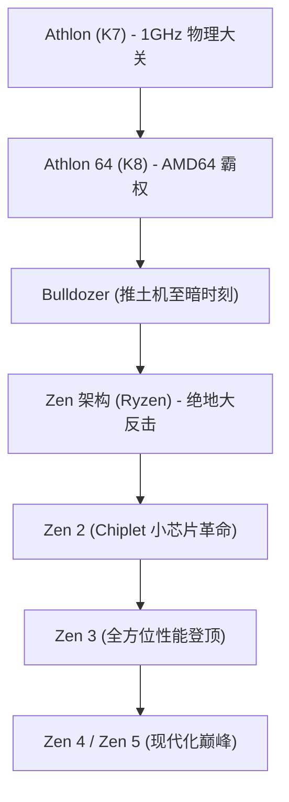

# 企业史：AMD发展史 - 从永远的挑战者到Ryzen的史诗大逆转

在回顾全球半导体产业波澜壮阔的发展史时，超威半导体（Advanced Micro Devices，简称 AMD）是绝对无法绕过的一座丰碑。自 1969 年创立以来，AMD 在长达几十年的时间里，一直被外界视作行业霸主英特尔（Intel）身后的“第二供应商”与“永远的挑战者”。然而，这家公司的真实轨迹，却是整个硅谷商业史上最惊心动魄、跌宕起伏的逆袭史诗。

从打破技术壁垒、问鼎算力王座的黄金时代，到跌入谷底、险遭破产清算的至暗时刻，再到凭借革命性的“Zen”架构（Ryzen 与 EPYC 处理器）上演惊天逆转，AMD 的奋斗历程展现了极客精神与商业战略的极致碰撞。本文将深入梳理 AMD 从创立至今的壮丽史诗。

## 1. 创立初期与“第二供应商”时代（1969年〜1980年代）

1969 年 5 月 1 日，仙童半导体（Fairchild Semiconductor）的前销售总监杰里·桑德斯（Jerry Sanders）与七位志同道合的同事共同创立了 AMD——这距离罗伯特·诺伊斯与戈登·摩尔创立英特尔仅仅过去了一年。与英特尔创始人技术泰斗的背景截然不同，桑德斯是一位魅力非凡的传奇销售天才。在桑德斯“以人为本、销售驱动”的经营理念下，早期的 AMD 并未将精力放在高风险的底层架构研发上，而是专注于为其他半导体巨头生产质量更优、引脚完全兼容的“第二供应商（Second Source）”替代芯片。

真正的命运转折点发生在 1981 年。当时 IBM 正在紧锣密鼓地研发划时代的“IBM PC”。为了确保关键零部件供应链的绝对安全稳定，IBM 强硬要求其 CPU 供应商（即英特尔的 8088 芯片）必须拥有合格的第二制造来源。在此背景下，英特尔与 AMD 于 1982 年签署了历史性的技术交叉许可协议，AMD 由此获得了合法制造和销售 x86 处理器的黄金门票。这一契机促成了 AMD 业绩的狂飙突进，但同时也让其背负了“只会抄袭英特尔的克隆厂商”的固有标签。

## 2. 克隆战争与自主研发的艰辛破局（1990年代）

进入 1980 年代中后期，伴随着个人电脑市场的几何级数爆发，英特尔为了独揽暴利，开始全面收紧技术授权，单方面撕毁协议并拒绝向 AMD 提供 386 处理器的技术资料。面对生死考验，AMD 毅然与英特尔展开了长达数年的马拉松式反垄断法庭诉讼，同时组织攻坚团队通过逆向工程进行独立研发。1991 年，AMD 震撼推出了“Am386”处理器——该芯片不仅在微码层面与英特尔 80386 完全兼容，更凭借 40 MHz 对 33 MHz 的主频优势和超高性价比迅速引爆市场。随后推出的“Am486”同样席卷全球。

然而，随着英特尔推出划时代的“Pentium（奔腾）”品牌并彻底重构微架构，逆向工程的技术红利逐渐见顶。为了彻底摆脱克隆厂商的被动命运，AMD 收购了 NexGen，并于 1996 年推出了首个完全自主研发的 x86 微架构——“K5”（代号取自超人的母星氪星 Krypton）。尽管 K5 因研发延期错失良机，但随后由“奔腾之父”维诺德·达姆（Vinod Dham）领衔打造的“K6”（1997年）不仅在性能上追平了同频奔腾，更奠定了 AMD 作为独立高性能处理器设计巨头的硬核实力。

## 3. 黄金时代：突破 1 GHz 壁垒与 AMD64 的技术称霸（1999年〜2005年）

真正终结英特尔“不可战胜”神话的里程碑事件发生在 1999 年 8 月。由天才架构师德克·迈耶（Dirk Meyer）带队研发的全新“K7”微架构——以“Athlon（速龙）”之名惊艳登场。Athlon 在浮点运算和日常处理性能上全面压制了英特尔的奔腾 III。

2000 年 3 月，AMD 迎来高光时刻：比英特尔提前数天率先打破了人类微处理器主频 **1 GHz（1000 MHz）** 的物理大关，震撼了全球科技界。

技术上的绝对统治力在 2003 年的“K8”架构（桌面端的 Athlon 64 与服务器端的 Opteron 皓龙）上达到了顶峰。K8 破天荒地推出了兼容 32 位的全新 64 位计算标准——“AMD64（x86-64）”，迫使英特尔不得不反向兼容并采纳 AMD 的 64 位指令集标准。同时，K8 首创将内存控制器直接整合进 CPU 内部并通过 HyperTransport 总线互联，消除了传统前端总线的延迟瓶颈。

此时的英特尔陷入了“NetBurst 架构（奔腾 4）”一味盲目拉高主频的高发热、高功耗泥潭（著名的“高频低能”）。而 AMD 的 K8 凭借极高 IPC（每时钟周期指令数）和优异的能效比，横扫全球极客玩家与企业数据中心。AMD 在桌面市场的份额逼近英特尔，迎来了辉煌至极的鼎盛时期。

## 4. 豪赌收购 ATI、剥离晶圆厂与“推土机”的至暗时刻（2006年〜2014年）

然而，繁荣之下暗流涌动。2006 年，英特尔痛定思痛推出了革命性的“Core（酷睿 2）”架构，闪电夺回算力王座。几乎在同一时期，AMD 做出了成立以来最重大的战略孤注一掷：斥资 54 亿美元巨资溢价收购加拿大图形芯片霸主 ATI Technologies。尽管这一旨在推动 CPU 与 GPU 深度融合的“APU（融聚理念）”极具前瞻性，但背负的沉重债务直接掏空了 AMD 的现金流。

与此同时，半导体先进制程的军备竞赛日趋白热化，维持自有晶圆厂所需的百亿美元级资本开支让 AMD 不堪重负。2009 年，AMD 被迫做出断腕求生的艰难决断：将旗下所有制造晶圆厂剥离并独立成立 GlobalFoundries（格罗方德），正式转型为无晶圆厂（Fabless）设计公司。这也亲手打破了创始人桑德斯昔日“真男人要有自己的晶圆厂（Real men have fabs）”的名言。

技术上的灾难接踵而至。2011 年，寄予厚望的全新微架构“Bulldozer（推土机）”惨烈翻车。由于盲目押注模块化多线程设计，推土机付出了单核 IPC 相比前代出现倒退的灾难性代价，同时伴随功耗与发热的彻底失控。在英特尔“Sandy Bridge”等二代酷睿处理器的代际碾压下，推土机完全溃败。AMD 被迫全线退出中高端桌面与企业级服务器市场，股价跌破 2 美元，破产传言四起，华尔街几乎一致宣判了 AMD 的“死刑”。

## 5. 苏姿丰掌舵与绝密工程“Zen”的破土新生（2014年〜2016年）

在濒临破产清算的生死关头，2014 年 10 月，AMD 迎来了命运的关键转折：麻省理工学院（MIT）电气工程博士出身的技术精英苏姿丰（Dr. Lisa Su）正式接任 CEO。苏姿丰临危受命，果断实施战略聚焦：彻底叫停智能手机与物联网等旁支业务，将全部资源全力倾注于 AMD 的灵魂核心——**高性能计算（CPU 与 GPU）** 。

彼时，AMD 内部正在秘密推进一个代号为“Zen”的复活项目。曾主导设计 K7/K8 架构以及苹果 A 系列自研芯片的传奇芯片架构宗师吉姆·凯勒（Jim Keller）于 2012 年重返 AMD，从零开始重构一套颠覆性的全新 x86 微架构。

苏姿丰运用高超的商业智慧，凭借定制芯片业务（为索尼 PS4 和微软 Xbox One 主机独家供应 SoC）牢牢稳住了公司的现金生命线，为凯勒团队打磨 Zen 架构赢得了弥足珍贵的几年喘息之机。

## 6. “Ryzen”横空出世与半导体史上的惊天逆袭（2017年〜至今）

2017 年 3 月，AMD 正式向全球发布第一代“Ryzen（锐龙）”桌面处理器。基于 Zen 架构打造的 Ryzen 实现了令人瞠目结舌的 **52% IPC 性能跃升** ，不仅远超 AMD 最初设定的 40% 目标，更打破了摩尔定律放缓以来的半导体演进纪录。更具革命性的是，在英特尔长期将主流桌面处理器限制在 4 核心的“挤牙膏”时代，Ryzen 以极其震撼的亲民价格普及了 8 核 16 线程，彻底引爆了 PC 市场的多核普及浪潮。

$$
	ext{IPC} = rac{	ext{Instructions}}{	ext{Clock Cycle}}
$$

Ryzen 的进攻势不可挡，其最大的底牌在于首创并全面落地的 **“小芯片（Chiplet）”架构设计** 。AMD 摒弃了制造良率极低的大单晶片（Monolithic Die）传统模式，而是将计算核心拆分为高良率的小芯片（CCD），并通过高速 Infinity Fabric 总线与中央 I/O 芯片互联。这一架构革新大幅降低了制造成本，使 AMD 能够举重若轻地在主流插槽上堆叠出 16 核，在服务器上扩展出 64 核甚至 128 核的怪兽级算力。

同时，当年剥离晶圆厂的苦涩决断此时转化为了最大的竞争优势。通过将芯片全面交由全球半导体先进制程霸主台积电（TSMC）代工，AMD 彻底摆脱了制程羁绊，精准抓住了台积电 7nm、5nm 的技术红利，逆转了在 14nm 节点长期难产的英特尔。随着 2019 年“Zen 2”和 2020 年“Zen 3”的推出，AMD 正式包揽了单核性能、多核性能以及能效比的三冠王宝座。

在企业级服务器市场，AMD 的“EPYC（霄龙）”处理器成功粉碎了英特尔长达十余年的垄断铁幕，被亚马逊 AWS、谷歌云、微软 Azure 等全球头部云巨头全面规模化采购。

## 7. 迈向未来：全面进军 AI 超级计算时代

今天的 AMD 早已彻底摆脱了“廉价替代品”的旧日烙印，成长为定义全球先进算力的半导体巨擘。2022 年，AMD 完成了对全球 FPGA 芯片先驱赛灵思（Xilinx）高达 490 亿美元的历史性全股票收购，市值更是一度超越英特尔。

站在人工智能（AI）重塑世界的技术拐点上，面对 NVIDIA 在 AI 加速卡领域的独步天下，AMD 强力推出了旗舰级的“Instinct MI300”系列算力平台。通过行业领先的 3D 芯片堆叠工艺将 CPU、GPU 与高带宽内存（HBM3）融为一体，AMD 正作为全球最具实力的战略对手，力推开源 ROCm 生态与英伟达全面抗衡。

从曾经徘徊在破产边缘的行业弃儿，到凭借对技术的纯粹信仰与卓越领袖掌舵完成史上最壮丽的大逆转，AMD 的存在不仅证明了创新的伟大，更打破了垄断，为全世界的科技用户与数字化未来带来了更加繁荣、多元的计算新纪元。
