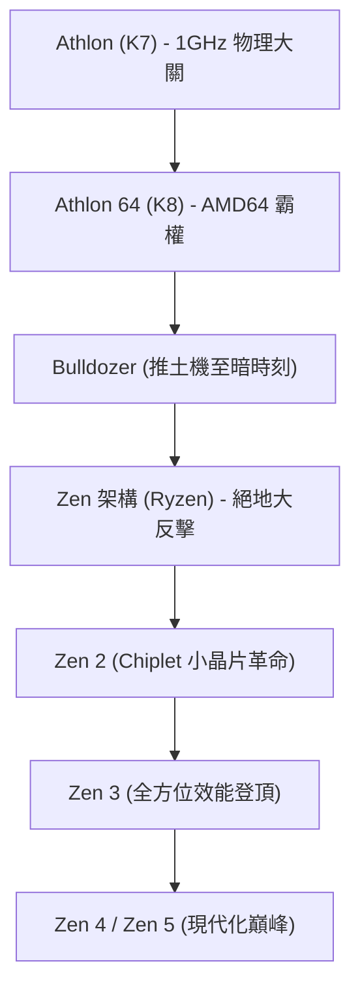

# 企業史：AMD發展史 - 從永遠的挑戰者到Ryzen的史詩大逆轉

在回顧全球半導體產業波瀾壯闊的發展史時，超微半導體（Advanced Micro Devices，簡稱 AMD）是絕對無法繞過的一座豐碑。自 1969 年創立以來，AMD 在長達幾十年的時間裡，一直被外界視作行業霸主英特爾（Intel）身後的「第二供應商」與「永遠的挑戰者」。然而，這家公司的真實軌跡，卻是整個矽谷商業史上最驚心動魄、跌宕起伏的逆襲史詩。

從打破技術壁壘、問鼎算力王座的黃金時代，到跌入谷底、險遭破產清算的至暗時刻，再到憑藉革命性的「Zen」架構（Ryzen 與 EPYC 處理器）上演驚天逆轉，AMD 的奮鬥歷程展現了極客精神與商業戰略的極致碰撞。本文將深入梳理 AMD 從創立至今的壯麗史詩。

## 1. 創立初期與「第二供應商」時代（1969年〜1980年代）

1969 年 5 月 1 日，仙童半導體（Fairchild Semiconductor）的前銷售總監傑瑞·桑德斯（Jerry Sanders）與七位志同道合的同事共同創立了 AMD——這距離羅伯特·諾伊斯與高登·摩爾創立英特爾僅僅過去了一年。與英特爾創辦人技術泰斗的背景截然不同，桑德斯是一位魅力非凡的傳奇銷售天才。在桑德斯「以人為本、銷售驅動」的經營理念下，早期的 AMD 並未將精力放在高風險的底層架構研發上，而是專注於為其他半導體巨頭生產品質更優、引腳完全相容的「第二供應商（Second Source）」替代晶片。

真正的命運轉折點發生在 1981 年。當時 IBM 正在緊鑼密鼓地研發劃時代的「IBM PC」。為了確保關鍵零組件供應鏈的絕對安全穩定，IBM 強硬要求其 CPU 供應商（即英特爾的 8088 晶片）必須擁有合格的第二製造來源。在此背景下，英特爾與 AMD 於 1982 年簽署了歷史性的技術交叉許可協議，AMD 由此獲得了合法製造和銷售 x86 處理器的黃金門票。這一契機促成了 AMD 業績的狂飆突進，但同時也讓其背負了「只會抄襲英特爾的克隆廠商」的固有標籤。

## 2. 克隆戰爭與自主研發的艱辛破局（1990年代）

進入 1980 年代中後期，伴隨著個人電腦市場的幾何級數爆發，英特爾為了獨攬暴利，開始全面收緊技術授權，單方面撕毀協議並拒絕向 AMD 提供 386 處理器的技術資料。面對生死考驗，AMD 毅然與英特爾展開了長達數年的馬拉松式反壟斷法庭訴訟，同時組織攻堅團隊透過逆向工程進行獨立研發。1991 年，AMD 震撼推出了「Am386」處理器——該晶片不僅在微碼層面與英特爾 80386 完全相容，更憑藉 40 MHz 對 33 MHz 的時脈優勢和超高性價比迅速引爆市場。隨後推出的「Am486」同樣席捲全球。

然而，隨著英特爾推出劃時代的「Pentium（奔騰）」品牌並徹底重構微架構，逆向工程的技術紅利逐漸見頂。為了徹底擺脫克隆廠商的被動命運，AMD 收購了 NexGen，並於 1996 年推出了首個完全自主研發的 x86 微架構——「K5」（代號取自超人的母星氪星 Krypton）。儘管 K5 因研發延期錯失良機，但隨後由「奔騰之父」維諾德·達姆（Vinod Dham）領銜打造的「K6」（1997年）不僅在效能上追平了同頻奔騰，更奠定了 AMD 作為獨立高性能處理器設計巨頭的硬核實力。

## 3. 黃金時代：突破 1 GHz 壁壘與 AMD64 的技術稱霸（1999年〜2005年）

真正終結英特爾「不可戰勝」神話的里程碑事件發生在 1999 年 8 月。由天才架構師德克·邁耶（Dirk Meyer）帶隊研發的全新「K7」微架構——以「Athlon（速龍）」之名驚豔登場。Athlon 在浮點運算和日常處理效能上全面壓制了英特爾的奔騰 III。

2000 年 3 月，AMD 迎來高光時刻：比英特爾提前數天率先打破了人類微處理器時脈 **1 GHz（1000 MHz）** 的物理大關，震撼了全球科技界。

技術上的絕對統治力在 2003 年的「K8」架構（桌面端的 Athlon 64 與伺服器端的 Opteron 皓龍）上達到了頂峰。K8 破天荒地推出了相容 32 位元的全新 64 位元運算標準——「AMD64（x86-64）」，迫使英特爾不得不反向相容並採納 AMD 的 64 位元指令集標準。同時，K8 首創將記憶體控制器直接整合進 CPU 內部並透過 HyperTransport 匯流排互聯，消除了傳統前端匯流排的延遲瓶頸。

此時的英特爾陷入了「NetBurst 架構（奔騰 4）」一味盲目拉高時脈的高發熱、高功耗泥淖（著名的「高頻低能」）。而 AMD 的 K8 憑藉極高 IPC（每時脈週期指令數）和優異的能效比，橫掃全球極客玩家與企業資料中心。AMD 在桌面市場的份額逼近英特爾，迎來了輝煌至極的鼎盛時期。

## 4. 豪賭收購 ATI、剝離晶圓廠與「推土機」的至暗時刻（2006年〜2014年）

然而，繁榮之下暗流湧動。2006 年，英特爾痛定思痛推出了革命性的「Core（酷睿 2）」架構，閃電奪回算力王座。幾乎在同一時期，AMD 做出了成立以來最重大的戰略孤注一擲：斥資 54 億美元巨資溢價收購加拿大圖形晶片霸主 ATI Technologies。儘管這一旨在推動 CPU 與 GPU 深度融合的「APU（融聚理念）」極具前瞻性，但背負的沉重債務直接掏空了 AMD 的現金流。

與此同時，半導體先進製程的軍備競賽日趨白熱化，維持自有晶圓廠所需的百億美元級資本支出讓 AMD 不堪重負。2009 年，AMD 被迫做出斷腕求生的艱難決斷：將旗下所有製造晶圓廠剝離並獨立成立 GlobalFoundries（格羅方德），正式轉型為無晶圓廠（Fabless）設計公司。這也親手打破了創辦人桑德斯昔日「真男人要有自己的晶圓廠（Real men have fabs）」的名言。

技術上的災難接踵而至。2011 年，寄予厚望的全新微架構「Bulldozer（推土機）」慘烈翻車。由於盲目押注模組化多執行緒設計，推土機付出了單核 IPC 相比前代出現倒退的災難性代價，同時伴隨功耗與發熱的徹底失控。在英特爾「Sandy Bridge」等二代酷睿處理器的代際碾壓下，推土機完全潰敗。AMD 被迫全線退出中高端桌面與企業級伺服器市場，股價跌破 2 美元，破產傳言四起，華爾街幾乎一致宣判了 AMD 的「死刑」。

## 5. 蘇姿丰掌舵與絕密工程「Zen」的破土新生（2014年〜2016年）

在瀕臨破產清算的生死關頭，2014 年 10 月，AMD 迎來了命運的關鍵轉折：麻省理工學院（MIT）電機工程博士出身的技術菁英蘇姿丰（Dr. Lisa Su）正式接任 CEO。蘇姿丰臨危受命，果斷實施戰略聚焦：徹底叫停智慧型手機與物聯網等旁支業務，將全部資源全力傾注於 AMD 的靈魂核心——**高效能運算（CPU 與 GPU）** 。

彼時，AMD 內部正在秘密推進一個代號為「Zen」的復活專案。曾主導設計 K7/K8 架構以及蘋果 A 系列自研晶片的傳奇晶片架構宗師吉姆·凱勒（Jim Keller）於 2012 年重返 AMD，從零開始重構一套顛覆性的全新 x86 微架構。

蘇姿丰運用高超的商業智慧，憑藉客製化晶片業務（為索尼 PS4 和微軟 Xbox One 主機獨家供應 SoC）牢牢穩住了公司的現金生命線，為凱勒團隊打磨 Zen 架構贏得了彌足珍貴的幾年喘息之機。

## 6. 「Ryzen」橫空出世與半導體史上的驚天逆襲（2017年〜至今）

2017 年 3 月，AMD 正式向全球發布第一代「Ryzen（銳龍）」桌面處理器。基於 Zen 架構打造的 Ryzen 實現了令人瞠目結舌的 **52% IPC 效能躍升** ，不僅遠超 AMD 最初設定的 40% 目標，更打破了摩爾定律放緩以來的半導體演進紀錄。更具革命性的是，在英特爾長期將主流桌面處理器限制在 4 核心的「擠牙膏」時代，Ryzen 以極其震撼的親民價格普及了 8 核 16 執行緒，徹底引爆了 PC 市場的多核普及浪潮。

$$
	ext{IPC} = rac{	ext{Instructions}}{	ext{Clock Cycle}}
$$

Ryzen 的進攻勢不可擋，其最大的底牌在於首創並全面落地的 **「小晶片（Chiplet）」架構設計** 。AMD 摒棄了製造良率極低的大單晶片（Monolithic Die）傳統模式，而是將運算核心拆分為高良率的小晶片（CCD），並透過高速 Infinity Fabric 匯流排與中央 I/O 晶片互聯。這一架構革新大幅降低了製造成本，使 AMD 能夠舉重若輕地在主流插槽上堆疊出 16 核，在伺服器上擴展出 64 核甚至 128 核的怪獸級算力。

同時，當年剝離晶圓廠的苦澀決斷此時轉化為了最大的競爭優勢。透過將晶片全面交由全球半導體先進製程霸主台積電（TSMC）代工，AMD 徹底擺脫了製程羈絆，精準抓住了台積電 7nm、5nm 的技術紅利，逆轉了在 14nm 節點長期難產的英特爾。隨著 2019 年「Zen 2」和 2020 年「Zen 3」的推出，AMD 正式包攬了單核效能、多核效能以及能效比的三冠王寶座。

在企業級伺服器市場，AMD 的「EPYC（霄龍）」處理器成功粉碎了英特爾長達十餘年的壟斷鐵幕，被亞馬遜 AWS、Google雲端、微軟 Azure 等全球頭部雲端巨頭全面規模化採購。

## 7. 邁向未來：全面進軍 AI 超級運算時代

今天的 AMD 早已徹底擺脫了「廉價替代品」的舊日烙印，成長為定義全球先進算力的半導體巨擘。2022 年，AMD 完成了對全球 FPGA 晶片先驅賽靈思（Xilinx）高達 490 億美元的歷史性全股票收購，市值更是一度超越英特爾。

站在人工智慧（AI）重塑世界的技術拐點上，面對 NVIDIA 在 AI 加速卡領域的獨步天下，AMD 強力推出了旗艦級的「Instinct MI300」系列算力平台。透過產業領先的 3D 晶片堆疊工藝將 CPU、GPU 與高頻寬記憶體（HBM3）融為一體，AMD 正作為全球最具實力的戰略對手，力推開源 ROCm 生態與輝達全面抗衡。

從曾經徘徊在破產邊緣的行業棄兒，到憑藉對技術的純粹信仰與卓越領袖掌舵完成史上最壯麗的大逆轉，AMD 的存在不僅證明了創新的偉大，更打破了壟斷，為全世界的科技用戶與數位化未來帶來了更加繁榮、多元的運算新紀元。
