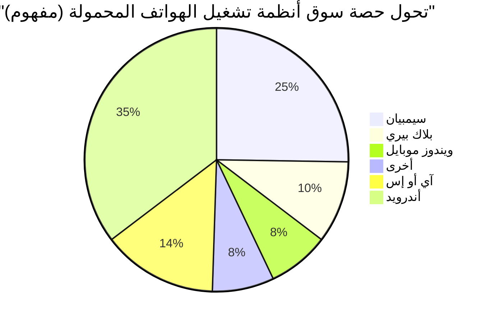

## 1. سفر التكوين: ثورة بدأت من المرآب (1976-1980)

في عام 1976، قام كل من ستيف جوبز وستيف وزنياك ورونالد واين بتأسيس "شركة أبل للكمبيوتر" في مرآب منزل عائلة جوبز في لوس ألتوس، كاليفورنيا.

كان المنتج الأول، **أبل 1** ، عبارة عن مجموعة تجميعية يتم فيها توفير اللوحة الأم فقط. لقد كانت اللحظة التي اندمجت فيها قدرات التصميم العبقري لوزنياك في الأجهزة مع رؤية جوبز التسويقية وقدرته على الاستشراف.


### النجاح الكبير لـ أبل 2
كان جهاز **أبل 2** ، الذي تم إصداره في عام 1977، منتجاً ثورياً يدمج لوحة المفاتيح في غلاف بلاستيكي وقادر على عرض رسومات ملونة. مع ظهور VisiCalc (أول برنامج جداول بيانات في العالم)، اخترق جهاز أبل 2 سوق الأعمال وسجل نجاحاً هائلاً.

## 2. ماكنتوش وفجر واجهة المستخدم الرسومية (1984)

في عام 1984، أصدرت شركة أبل جهاز **ماكنتوش** . كان هذا أول حاسوب شخصي للعامة مزود بواجهة مستخدم رسومية (GUI) وفأرة.


كتقنية ثورية في ذلك الوقت، تم تقديم مفهوم شاشة العرض النقطية والبرمجة كائنية التوجه.

## 3. العصر المظلم وعودة جوبز (1985-1997)

في عام 1985، تم طرد جوبز من شركة أبل بسبب صراعات داخلية. بعد ذلك، دخلت شركة أبل في فترة ركود. من ناحية أخرى، أسس جوبز شركتي NeXT و Pixar وحقق نجاحاً كبيراً.

في عام 1996، وصلت شركة أبل إلى طريق مسدود في تطوير نظام التشغيل من الجيل التالي وقررت الاستحواذ على شركة NeXT التابعة لجوبز. في عام 1997، عاد جوبز إلى شركة أبل وتولى منصب الرئيس التنفيذي المؤقت.

### التطور من NeXTSTEP إلى macOS
أصبحت تقنية نظام التشغيل **NeXTSTEP** التابع لشركة NeXT (نواة Mach و Objective-C) أساساً قوياً لنظام التشغيل Mac OS X (حالياً macOS) ونظام iOS لاحقاً.

```objc
// مثال على Objective-C (تقنية مشتقة من NeXTSTEP)
#import <Foundation/Foundation.h>

@interface Greeting : NSObject
- (void)sayHello;
@end

@implementation Greeting
- (void)sayHello {
    NSLog(@"مرحباً، فكر باختلاف!");
}
@end
```

## 4. آي ماك وآي بود ثم آي تيونز (1998-2006)

قام جوبز بتقليص تشكيلة المنتجات بشكل جذري وأعلن عن **آي ماك** في عام 1998. التصميم الشفاف (المنفذ للضوء) صدم العالم بأسره.

في عام 2001، أعلنت الشركة عن جهازي **آي بود** و **آي تيونز** ، مما أحدث ثورة في صناعة الموسيقى. الشعار "1000 أغنية في جيبك" كان يشير إلى الاندماج المثالي بين التكنولوجيا وتجربة المستخدم.

## 5. ثورة الآيفون وعصر الهواتف المحمولة (2007-2011)

في يناير 2007، أعلن جوبز عن جهاز **آيفون** .
"آي بود، هاتف، وجهاز اتصال بالإنترنت. هذه ليست ثلاثة أجهزة مستقلة، بل جهاز واحد."

اعتمد الآيفون على واجهة اللمس المتعدد وألغى لوحة المفاتيح الفعلية. كان هذا حدثاً غير تاريخ التواصل البشري.



## 6. عصر تيم كوك والتحول إلى شركة خدمات (2011-الآن)

بعد وفاة جوبز في عام 2011، تولى تيم كوك منصب الرئيس التنفيذي. من خلال الإدارة المتميزة لسلسلة التوريد الخاصة بكوك ونجاح الأجهزة القابلة للارتداء مثل Apple Watch و AirPods، نمت شركة أبل لتصبح أول شركة في العالم تبلغ قيمتها السوقية تريليون دولار، ثم تريليونين، وثلاثة تريليونات دولار.

### صدمة أبل سيليكون (M1/M2/M3)
في السنوات الأخيرة، أكملت الشركة الانتقال من رقائق إنتل إلى **أبل سيليكون (بنية ARM)** المصممة داخلياً. إنها تجمع بين الأداء العالي وكفاءة الطاقة الساحقة.

$$
	ext{Performance per Watt} = rac{	ext{Computation Output (FLOPS)}}{	ext{Power Consumption (Watts)}}
$$

## 7. أبل في عصر الذكاء الاصطناعي (أبل إنتليجنس)

في عام 2024، أعلنت شركة أبل عن **أبل إنتليجنس** (Apple Intelligence)، ودخلت بقوة في مجال الذكاء الاصطناعي على الأجهزة الذي يفهم السياق الشخصي. مع التركيز على الخصوصية، قامت بدمج التطور الجذري لـ Siri وتوليد النصوص والصور على مستوى نظام التشغيل.

## الخلاصة

تاريخ شركة أبل هو تاريخ استمرارها في الوقوف على مفترق الطرق بين التكنولوجيا والفنون الليبرالية. الشركة الصغيرة التي بدأت في مرآب قد بنت الآن نظاماً بيئياً رقمياً لا غنى عنه في حياة الناس في جميع أنحاء العالم.


## اعتبارات إضافية 1: تعمق في استراتيجية إدارة أبل وتكنولوجيتها


### 1.1 سفر التكوين: ثورة بدأت من المرآب (1976-1980)

في عام 1976، قام كل من ستيف جوبز وستيف وزنياك ورونالد واين بتأسيس "شركة أبل للكمبيوتر" في مرآب منزل عائلة جوبز في لوس ألتوس، كاليفورنيا.

كان المنتج الأول، **أبل 1** ، عبارة عن مجموعة تجميعية يتم فيها توفير اللوحة الأم فقط. لقد كانت اللحظة التي اندمجت فيها قدرات التصميم العبقري لوزنياك في الأجهزة مع رؤية جوبز التسويقية وقدرته على الاستشراف.


### النجاح الكبير لـ أبل 2
كان جهاز **أبل 2** ، الذي تم إصداره في عام 1977، منتجاً ثورياً يدمج لوحة المفاتيح في غلاف بلاستيكي وقادر على عرض رسومات ملونة. مع ظهور VisiCalc (أول برنامج جداول بيانات في العالم)، اخترق جهاز أبل 2 سوق الأعمال وسجل نجاحاً هائلاً.

### 1.2 ماكنتوش وفجر واجهة المستخدم الرسومية (1984)

في عام 1984، أصدرت شركة أبل جهاز **ماكنتوش** . كان هذا أول حاسوب شخصي للعامة مزود بواجهة مستخدم رسومية (GUI) وفأرة.


كتقنية ثورية في ذلك الوقت، تم تقديم مفهوم شاشة العرض النقطية والبرمجة كائنية التوجه.

## 3. العصر المظلم وعودة جوبز (1985-1997)

في عام 1985، تم طرد جوبز من شركة أبل بسبب صراعات داخلية. بعد ذلك، دخلت شركة أبل في فترة ركود. من ناحية أخرى، أسس جوبز شركتي NeXT و Pixar وحقق نجاحاً كبيراً.

في عام 1996، وصلت شركة أبل إلى طريق مسدود في تطوير نظام التشغيل من الجيل التالي وقررت الاستحواذ على شركة NeXT التابعة لجوبز. في عام 1997، عاد جوبز إلى شركة أبل وتولى منصب الرئيس التنفيذي المؤقت.

### التطور من NeXTSTEP إلى macOS
أصبحت تقنية نظام التشغيل **NeXTSTEP** التابع لشركة NeXT (نواة Mach و Objective-C) أساساً قوياً لنظام التشغيل Mac OS X (حالياً macOS) ونظام iOS لاحقاً.

```objc
// مثال على Objective-C (تقنية مشتقة من NeXTSTEP)
#import <Foundation/Foundation.h>

@interface Greeting : NSObject
- (void)sayHello;
@end

@implementation Greeting
- (void)sayHello {
    NSLog(@"مرحباً، فكر باختلاف!");
}
@end
```

## 4. آي ماك وآي بود ثم آي تيونز (1998-2006)

قام جوبز بتقليص تشكيلة المنتجات بشكل جذري وأعلن عن **آي ماك** في عام 1998. التصميم الشفاف (المنفذ للضوء) صدم العالم بأسره.

في عام 2001، أعلنت الشركة عن جهازي **آي بود** و **آي تيونز** ، مما أحدث ثورة في صناعة الموسيقى. الشعار "1000 أغنية في جيبك" كان يشير إلى الاندماج المثالي بين التكنولوجيا وتجربة المستخدم.

## 5. ثورة الآيفون وعصر الهواتف المحمولة (2007-2011)

في يناير 2007، أعلن جوبز عن جهاز **آيفون** .
"آي بود، هاتف، وجهاز اتصال بالإنترنت. هذه ليست ثلاثة أجهزة مستقلة، بل جهاز واحد."

اعتمد الآيفون على واجهة اللمس المتعدد وألغى لوحة المفاتيح الفعلية. كان هذا حدثاً غير تاريخ التواصل البشري.


## 6. عصر تيم كوك والتحول إلى شركة خدمات (2011-الآن)

بعد وفاة جوبز في عام 2011، تولى تيم كوك منصب الرئيس التنفيذي. من خلال الإدارة المتميزة لسلسلة التوريد الخاصة بكوك ونجاح الأجهزة القابلة للارتداء مثل Apple Watch و AirPods، نمت شركة أبل لتصبح أول شركة في العالم تبلغ قيمتها السوقية تريليون دولار، ثم تريليونين، وثلاثة تريليونات دولار.

### صدمة أبل سيليكون (M1/M2/M3)
في السنوات الأخيرة، أكملت الشركة الانتقال من رقائق إنتل إلى **أبل سيليكون (بنية ARM)** المصممة داخلياً. إنها تجمع بين الأداء العالي وكفاءة الطاقة الساحقة.

$$
	ext{Performance per Watt} = rac{	ext{Computation Output (FLOPS)}}{	ext{Power Consumption (Watts)}}
$$

## 7. أبل في عصر الذكاء الاصطناعي (أبل إنتليجنس)

في عام 2024، أعلنت شركة أبل عن **أبل إنتليجنس** (Apple Intelligence)، ودخلت بقوة في مجال الذكاء الاصطناعي على الأجهزة الذي يفهم السياق الشخصي. مع التركيز على الخصوصية، قامت بدمج التطور الجذري لـ Siri وتوليد النصوص والصور على مستوى نظام التشغيل.

## الخلاصة

تاريخ شركة أبل هو تاريخ استمرارها في الوقوف على مفترق الطرق بين التكنولوجيا والفنون الليبرالية. الشركة الصغيرة التي بدأت في مرآب قد بنت الآن نظاماً بيئياً رقمياً لا غنى عنه في حياة الناس في جميع أنحاء العالم.


## اعتبارات إضافية 2: تعمق في استراتيجية إدارة أبل وتكنولوجيتها


#### 2.21 سفر التكوين: ثورة بدأت من المرآب (1976-1980)

في عام 1976، قام كل من ستيف جوبز وستيف وزنياك ورونالد واين بتأسيس "شركة أبل للكمبيوتر" في مرآب منزل عائلة جوبز في لوس ألتوس، كاليفورنيا.

كان المنتج الأول، **أبل 1** ، عبارة عن مجموعة تجميعية يتم فيها توفير اللوحة الأم فقط. لقد كانت اللحظة التي اندمجت فيها قدرات التصميم العبقري لوزنياك في الأجهزة مع رؤية جوبز التسويقية وقدرته على الاستشراف.


### النجاح الكبير لـ أبل 2
كان جهاز **أبل 2** ، الذي تم إصداره في عام 1977، منتجاً ثورياً يدمج لوحة المفاتيح في غلاف بلاستيكي وقادر على عرض رسومات ملونة. مع ظهور VisiCalc (أول برنامج جداول بيانات في العالم)، اخترق جهاز أبل 2 سوق الأعمال وسجل نجاحاً هائلاً.

### 2.2 ماكنتوش وفجر واجهة المستخدم الرسومية (1984)

في عام 1984، أصدرت شركة أبل جهاز **ماكنتوش** . كان هذا أول حاسوب شخصي للعامة مزود بواجهة مستخدم رسومية (GUI) وفأرة.


كتقنية ثورية في ذلك الوقت، تم تقديم مفهوم شاشة العرض النقطية والبرمجة كائنية التوجه.

## 3. العصر المظلم وعودة جوبز (1985-1997)

في عام 1985، تم طرد جوبز من شركة أبل بسبب صراعات داخلية. بعد ذلك، دخلت شركة أبل في فترة ركود. من ناحية أخرى، أسس جوبز شركتي NeXT و Pixar وحقق نجاحاً كبيراً.

في عام 1996، وصلت شركة أبل إلى طريق مسدود في تطوير نظام التشغيل من الجيل التالي وقررت الاستحواذ على شركة NeXT التابعة لجوبز. في عام 1997، عاد جوبز إلى شركة أبل وتولى منصب الرئيس التنفيذي المؤقت.

### التطور من NeXTSTEP إلى macOS
أصبحت تقنية نظام التشغيل **NeXTSTEP** التابع لشركة NeXT (نواة Mach و Objective-C) أساساً قوياً لنظام التشغيل Mac OS X (حالياً macOS) ونظام iOS لاحقاً.

```objc
// مثال على Objective-C (تقنية مشتقة من NeXTSTEP)
#import <Foundation/Foundation.h>

@interface Greeting : NSObject
- (void)sayHello;
@end

@implementation Greeting
- (void)sayHello {
    NSLog(@"مرحباً، فكر باختلاف!");
}
@end
```

## 4. آي ماك وآي بود ثم آي تيونز (1998-2006)

قام جوبز بتقليص تشكيلة المنتجات بشكل جذري وأعلن عن **آي ماك** في عام 1998. التصميم الشفاف (المنفذ للضوء) صدم العالم بأسره.

في عام 2001، أعلنت الشركة عن جهازي **آي بود** و **آي تيونز** ، مما أحدث ثورة في صناعة الموسيقى. الشعار "1000 أغنية في جيبك" كان يشير إلى الاندماج المثالي بين التكنولوجيا وتجربة المستخدم.

## 5. ثورة الآيفون وعصر الهواتف المحمولة (2007-2011)

في يناير 2007، أعلن جوبز عن جهاز **آيفون** .
"آي بود، هاتف، وجهاز اتصال بالإنترنت. هذه ليست ثلاثة أجهزة مستقلة، بل جهاز واحد."

اعتمد الآيفون على واجهة اللمس المتعدد وألغى لوحة المفاتيح الفعلية. كان هذا حدثاً غير تاريخ التواصل البشري.


## 6. عصر تيم كوك والتحول إلى شركة خدمات (2011-الآن)

بعد وفاة جوبز في عام 2011، تولى تيم كوك منصب الرئيس التنفيذي. من خلال الإدارة المتميزة لسلسلة التوريد الخاصة بكوك ونجاح الأجهزة القابلة للارتداء مثل Apple Watch و AirPods، نمت شركة أبل لتصبح أول شركة في العالم تبلغ قيمتها السوقية تريليون دولار، ثم تريليونين، وثلاثة تريليونات دولار.

### صدمة أبل سيليكون (M1/M2/M3)
في السنوات الأخيرة، أكملت الشركة الانتقال من رقائق إنتل إلى **أبل سيليكون (بنية ARM)** المصممة داخلياً. إنها تجمع بين الأداء العالي وكفاءة الطاقة الساحقة.

$$
	ext{Performance per Watt} = rac{	ext{Computation Output (FLOPS)}}{	ext{Power Consumption (Watts)}}
$$

## 7. أبل في عصر الذكاء الاصطناعي (أبل إنتليجنس)

في عام 2024، أعلنت شركة أبل عن **أبل إنتليجنس** (Apple Intelligence)، ودخلت بقوة في مجال الذكاء الاصطناعي على الأجهزة الذي يفهم السياق الشخصي. مع التركيز على الخصوصية، قامت بدمج التطور الجذري لـ Siri وتوليد النصوص والصور على مستوى نظام التشغيل.

## الخلاصة

تاريخ شركة أبل هو تاريخ استمرارها في الوقوف على مفترق الطرق بين التكنولوجيا والفنون الليبرالية. الشركة الصغيرة التي بدأت في مرآب قد بنت الآن نظاماً بيئياً رقمياً لا غنى عنه في حياة الناس في جميع أنحاء العالم.


## اعتبارات إضافية 3: تعمق في استراتيجية إدارة أبل وتكنولوجيتها


### 3.1 سفر التكوين: ثورة بدأت من المرآب (1976-1980)

في عام 1976، قام كل من ستيف جوبز وستيف وزنياك ورونالد واين بتأسيس "شركة أبل للكمبيوتر" في مرآب منزل عائلة جوبز في لوس ألتوس، كاليفورنيا.

كان المنتج الأول، **أبل 1** ، عبارة عن مجموعة تجميعية يتم فيها توفير اللوحة الأم فقط. لقد كانت اللحظة التي اندمجت فيها قدرات التصميم العبقري لوزنياك في الأجهزة مع رؤية جوبز التسويقية وقدرته على الاستشراف.


### النجاح الكبير لـ أبل 2
كان جهاز **أبل 2** ، الذي تم إصداره في عام 1977، منتجاً ثورياً يدمج لوحة المفاتيح في غلاف بلاستيكي وقادر على عرض رسومات ملونة. مع ظهور VisiCalc (أول برنامج جداول بيانات في العالم)، اخترق جهاز أبل 2 سوق الأعمال وسجل نجاحاً هائلاً.

### 3.2 ماكنتوش وفجر واجهة المستخدم الرسومية (1984)

في عام 1984، أصدرت شركة أبل جهاز **ماكنتوش** . كان هذا أول حاسوب شخصي للعامة مزود بواجهة مستخدم رسومية (GUI) وفأرة.


كتقنية ثورية في ذلك الوقت، تم تقديم مفهوم شاشة العرض النقطية والبرمجة كائنية التوجه.

## 3. العصر المظلم وعودة جوبز (1985-1997)

في عام 1985، تم طرد جوبز من شركة أبل بسبب صراعات داخلية. بعد ذلك، دخلت شركة أبل في فترة ركود. من ناحية أخرى، أسس جوبز شركتي NeXT و Pixar وحقق نجاحاً كبيراً.

في عام 1996، وصلت شركة أبل إلى طريق مسدود في تطوير نظام التشغيل من الجيل التالي وقررت الاستحواذ على شركة NeXT التابعة لجوبز. في عام 1997، عاد جوبز إلى شركة أبل وتولى منصب الرئيس التنفيذي المؤقت.

### التطور من NeXTSTEP إلى macOS
أصبحت تقنية نظام التشغيل **NeXTSTEP** التابع لشركة NeXT (نواة Mach و Objective-C) أساساً قوياً لنظام التشغيل Mac OS X (حالياً macOS) ونظام iOS لاحقاً.

```objc
// مثال على Objective-C (تقنية مشتقة من NeXTSTEP)
#import <Foundation/Foundation.h>

@interface Greeting : NSObject
- (void)sayHello;
@end

@implementation Greeting
- (void)sayHello {
    NSLog(@"مرحباً، فكر باختلاف!");
}
@end
```

## 4. آي ماك وآي بود ثم آي تيونز (1998-2006)

قام جوبز بتقليص تشكيلة المنتجات بشكل جذري وأعلن عن **آي ماك** في عام 1998. التصميم الشفاف (المنفذ للضوء) صدم العالم بأسره.

في عام 2001، أعلنت الشركة عن جهازي **آي بود** و **آي تيونز** ، مما أحدث ثورة في صناعة الموسيقى. الشعار "1000 أغنية في جيبك" كان يشير إلى الاندماج المثالي بين التكنولوجيا وتجربة المستخدم.

## 5. ثورة الآيفون وعصر الهواتف المحمولة (2007-2011)

في يناير 2007، أعلن جوبز عن جهاز **آيفون** .
"آي بود، هاتف، وجهاز اتصال بالإنترنت. هذه ليست ثلاثة أجهزة مستقلة، بل جهاز واحد."

اعتمد الآيفون على واجهة اللمس المتعدد وألغى لوحة المفاتيح الفعلية. كان هذا حدثاً غير تاريخ التواصل البشري.


## 6. عصر تيم كوك والتحول إلى شركة خدمات (2011-الآن)

بعد وفاة جوبز في عام 2011، تولى تيم كوك منصب الرئيس التنفيذي. من خلال الإدارة المتميزة لسلسلة التوريد الخاصة بكوك ونجاح الأجهزة القابلة للارتداء مثل Apple Watch و AirPods، نمت شركة أبل لتصبح أول شركة في العالم تبلغ قيمتها السوقية تريليون دولار، ثم تريليونين، وثلاثة تريليونات دولار.

### صدمة أبل سيليكون (M1/M2/M3)
في السنوات الأخيرة، أكملت الشركة الانتقال من رقائق إنتل إلى **أبل سيليكون (بنية ARM)** المصممة داخلياً. إنها تجمع بين الأداء العالي وكفاءة الطاقة الساحقة.

$$
	ext{Performance per Watt} = rac{	ext{Computation Output (FLOPS)}}{	ext{Power Consumption (Watts)}}
$$

## 7. أبل في عصر الذكاء الاصطناعي (أبل إنتليجنس)

في عام 2024، أعلنت شركة أبل عن **أبل إنتليجنس** (Apple Intelligence)، ودخلت بقوة في مجال الذكاء الاصطناعي على الأجهزة الذي يفهم السياق الشخصي. مع التركيز على الخصوصية، قامت بدمج التطور الجذري لـ Siri وتوليد النصوص والصور على مستوى نظام التشغيل.

## الخلاصة

تاريخ شركة أبل هو تاريخ استمرارها في الوقوف على مفترق الطرق بين التكنولوجيا والفنون الليبرالية. الشركة الصغيرة التي بدأت في مرآب قد بنت الآن نظاماً بيئياً رقمياً لا غنى عنه في حياة الناس في جميع أنحاء العالم.


## اعتبارات إضافية 4: تعمق في استراتيجية إدارة أبل وتكنولوجيتها


### 4.1 سفر التكوين: ثورة بدأت من المرآب (1976-1980)

في عام 1976، قام كل من ستيف جوبز وستيف وزنياك ورونالد واين بتأسيس "شركة أبل للكمبيوتر" في مرآب منزل عائلة جوبز في لوس ألتوس، كاليفورنيا.

كان المنتج الأول، **أبل 1** ، عبارة عن مجموعة تجميعية يتم فيها توفير اللوحة الأم فقط. لقد كانت اللحظة التي اندمجت فيها قدرات التصميم العبقري لوزنياك في الأجهزة مع رؤية جوبز التسويقية وقدرته على الاستشراف.


### النجاح الكبير لـ أبل 2
كان جهاز **أبل 2** ، الذي تم إصداره في عام 1977، منتجاً ثورياً يدمج لوحة المفاتيح في غلاف بلاستيكي وقادر على عرض رسومات ملونة. مع ظهور VisiCalc (أول برنامج جداول بيانات في العالم)، اخترق جهاز أبل 2 سوق الأعمال وسجل نجاحاً هائلاً.

### 4.2 ماكنتوش وفجر واجهة المستخدم الرسومية (1984)

في عام 1984، أصدرت شركة أبل جهاز **ماكنتوش** . كان هذا أول حاسوب شخصي للعامة مزود بواجهة مستخدم رسومية (GUI) وفأرة.


كتقنية ثورية في ذلك الوقت، تم تقديم مفهوم شاشة العرض النقطية والبرمجة كائنية التوجه.

## 3. العصر المظلم وعودة جوبز (1985-1997)

في عام 1985، تم طرد جوبز من شركة أبل بسبب صراعات داخلية. بعد ذلك، دخلت شركة أبل في فترة ركود. من ناحية أخرى، أسس جوبز شركتي NeXT و Pixar وحقق نجاحاً كبيراً.

في عام 1996، وصلت شركة أبل إلى طريق مسدود في تطوير نظام التشغيل من الجيل التالي وقررت الاستحواذ على شركة NeXT التابعة لجوبز. في عام 1997، عاد جوبز إلى شركة أبل وتولى منصب الرئيس التنفيذي المؤقت.

### التطور من NeXTSTEP إلى macOS
أصبحت تقنية نظام التشغيل **NeXTSTEP** التابع لشركة NeXT (نواة Mach و Objective-C) أساساً قوياً لنظام التشغيل Mac OS X (حالياً macOS) ونظام iOS لاحقاً.

```objc
// مثال على Objective-C (تقنية مشتقة من NeXTSTEP)
#import <Foundation/Foundation.h>

@interface Greeting : NSObject
- (void)sayHello;
@end

@implementation Greeting
- (void)sayHello {
    NSLog(@"مرحباً، فكر باختلاف!");
}
@end
```

## 4. آي ماك وآي بود ثم آي تيونز (1998-2006)

قام جوبز بتقليص تشكيلة المنتجات بشكل جذري وأعلن عن **آي ماك** في عام 1998. التصميم الشفاف (المنفذ للضوء) صدم العالم بأسره.

في عام 2001، أعلنت الشركة عن جهازي **آي بود** و **آي تيونز** ، مما أحدث ثورة في صناعة الموسيقى. الشعار "1000 أغنية في جيبك" كان يشير إلى الاندماج المثالي بين التكنولوجيا وتجربة المستخدم.

## 5. ثورة الآيفون وعصر الهواتف المحمولة (2007-2011)

في يناير 2007، أعلن جوبز عن جهاز **آيفون** .
"آي بود، هاتف، وجهاز اتصال بالإنترنت. هذه ليست ثلاثة أجهزة مستقلة، بل جهاز واحد."

اعتمد الآيفون على واجهة اللمس المتعدد وألغى لوحة المفاتيح الفعلية. كان هذا حدثاً غير تاريخ التواصل البشري.


## 6. عصر تيم كوك والتحول إلى شركة خدمات (2011-الآن)

بعد وفاة جوبز في عام 2011، تولى تيم كوك منصب الرئيس التنفيذي. من خلال الإدارة المتميزة لسلسلة التوريد الخاصة بكوك ونجاح الأجهزة القابلة للارتداء مثل Apple Watch و AirPods، نمت شركة أبل لتصبح أول شركة في العالم تبلغ قيمتها السوقية تريليون دولار، ثم تريليونين، وثلاثة تريليونات دولار.

### صدمة أبل سيليكون (M1/M2/M3)
في السنوات الأخيرة، أكملت الشركة الانتقال من رقائق إنتل إلى **أبل سيليكون (بنية ARM)** المصممة داخلياً. إنها تجمع بين الأداء العالي وكفاءة الطاقة الساحقة.

$$
	ext{Performance per Watt} = rac{	ext{Computation Output (FLOPS)}}{	ext{Power Consumption (Watts)}}
$$

## 7. أبل في عصر الذكاء الاصطناعي (أبل إنتليجنس)

في عام 2024، أعلنت شركة أبل عن **أبل إنتليجنس** (Apple Intelligence)، ودخلت بقوة في مجال الذكاء الاصطناعي على الأجهزة الذي يفهم السياق الشخصي. مع التركيز على الخصوصية، قامت بدمج التطور الجذري لـ Siri وتوليد النصوص والصور على مستوى نظام التشغيل.

## الخلاصة

تاريخ شركة أبل هو تاريخ استمرارها في الوقوف على مفترق الطرق بين التكنولوجيا والفنون الليبرالية. الشركة الصغيرة التي بدأت في مرآب قد بنت الآن نظاماً بيئياً رقمياً لا غنى عنه في حياة الناس في جميع أنحاء العالم.


## اعتبارات إضافية 5: تعمق في استراتيجية إدارة أبل وتكنولوجيتها


### 5.1 سفر التكوين: ثورة بدأت من المرآب (1976-1980)

في عام 1976، قام كل من ستيف جوبز وستيف وزنياك ورونالد واين بتأسيس "شركة أبل للكمبيوتر" في مرآب منزل عائلة جوبز في لوس ألتوس، كاليفورنيا.

كان المنتج الأول، **أبل 1** ، عبارة عن مجموعة تجميعية يتم فيها توفير اللوحة الأم فقط. لقد كانت اللحظة التي اندمجت فيها قدرات التصميم العبقري لوزنياك في الأجهزة مع رؤية جوبز التسويقية وقدرته على الاستشراف.


### النجاح الكبير لـ أبل 2
كان جهاز **أبل 2** ، الذي تم إصداره في عام 1977، منتجاً ثورياً يدمج لوحة المفاتيح في غلاف بلاستيكي وقادر على عرض رسومات ملونة. مع ظهور VisiCalc (أول برنامج جداول بيانات في العالم)، اخترق جهاز أبل 2 سوق الأعمال وسجل نجاحاً هائلاً.

### 5.2 ماكنتوش وفجر واجهة المستخدم الرسومية (1984)

في عام 1984، أصدرت شركة أبل جهاز **ماكنتوش** . كان هذا أول حاسوب شخصي للعامة مزود بواجهة مستخدم رسومية (GUI) وفأرة.


كتقنية ثورية في ذلك الوقت، تم تقديم مفهوم شاشة العرض النقطية والبرمجة كائنية التوجه.

## 3. العصر المظلم وعودة جوبز (1985-1997)

في عام 1985، تم طرد جوبز من شركة أبل بسبب صراعات داخلية. بعد ذلك، دخلت شركة أبل في فترة ركود. من ناحية أخرى، أسس جوبز شركتي NeXT و Pixar وحقق نجاحاً كبيراً.

في عام 1996، وصلت شركة أبل إلى طريق مسدود في تطوير نظام التشغيل من الجيل التالي وقررت الاستحواذ على شركة NeXT التابعة لجوبز. في عام 1997، عاد جوبز إلى شركة أبل وتولى منصب الرئيس التنفيذي المؤقت.

### التطور من NeXTSTEP إلى macOS
أصبحت تقنية نظام التشغيل **NeXTSTEP** التابع لشركة NeXT (نواة Mach و Objective-C) أساساً قوياً لنظام التشغيل Mac OS X (حالياً macOS) ونظام iOS لاحقاً.

```objc
// مثال على Objective-C (تقنية مشتقة من NeXTSTEP)
#import <Foundation/Foundation.h>

@interface Greeting : NSObject
- (void)sayHello;
@end

@implementation Greeting
- (void)sayHello {
    NSLog(@"مرحباً، فكر باختلاف!");
}
@end
```

## 4. آي ماك وآي بود ثم آي تيونز (1998-2006)

قام جوبز بتقليص تشكيلة المنتجات بشكل جذري وأعلن عن **آي ماك** في عام 1998. التصميم الشفاف (المنفذ للضوء) صدم العالم بأسره.

في عام 2001، أعلنت الشركة عن جهازي **آي بود** و **آي تيونز** ، مما أحدث ثورة في صناعة الموسيقى. الشعار "1000 أغنية في جيبك" كان يشير إلى الاندماج المثالي بين التكنولوجيا وتجربة المستخدم.

## 5. ثورة الآيفون وعصر الهواتف المحمولة (2007-2011)

في يناير 2007، أعلن جوبز عن جهاز **آيفون** .
"آي بود، هاتف، وجهاز اتصال بالإنترنت. هذه ليست ثلاثة أجهزة مستقلة، بل جهاز واحد."

اعتمد الآيفون على واجهة اللمس المتعدد وألغى لوحة المفاتيح الفعلية. كان هذا حدثاً غير تاريخ التواصل البشري.


## 6. عصر تيم كوك والتحول إلى شركة خدمات (2011-الآن)

بعد وفاة جوبز في عام 2011، تولى تيم كوك منصب الرئيس التنفيذي. من خلال الإدارة المتميزة لسلسلة التوريد الخاصة بكوك ونجاح الأجهزة القابلة للارتداء مثل Apple Watch و AirPods، نمت شركة أبل لتصبح أول شركة في العالم تبلغ قيمتها السوقية تريليون دولار، ثم تريليونين، وثلاثة تريليونات دولار.

### صدمة أبل سيليكون (M1/M2/M3)
في السنوات الأخيرة، أكملت الشركة الانتقال من رقائق إنتل إلى **أبل سيليكون (بنية ARM)** المصممة داخلياً. إنها تجمع بين الأداء العالي وكفاءة الطاقة الساحقة.

$$
	ext{Performance per Watt} = rac{	ext{Computation Output (FLOPS)}}{	ext{Power Consumption (Watts)}}
$$

## 7. أبل في عصر الذكاء الاصطناعي (أبل إنتليجنس)

في عام 2024، أعلنت شركة أبل عن **أبل إنتليجنس** (Apple Intelligence)، ودخلت بقوة في مجال الذكاء الاصطناعي على الأجهزة الذي يفهم السياق الشخصي. مع التركيز على الخصوصية، قامت بدمج التطور الجذري لـ Siri وتوليد النصوص والصور على مستوى نظام التشغيل.

## الخلاصة

تاريخ شركة أبل هو تاريخ استمرارها في الوقوف على مفترق الطرق بين التكنولوجيا والفنون الليبرالية. الشركة الصغيرة التي بدأت في مرآب قد بنت الآن نظاماً بيئياً رقمياً لا غنى عنه في حياة الناس في جميع أنحاء العالم.


## اعتبارات إضافية 6: تعمق في استراتيجية إدارة أبل وتكنولوجيتها


### 6.1 سفر التكوين: ثورة بدأت من المرآب (1976-1980)

في عام 1976، قام كل من ستيف جوبز وستيف وزنياك ورونالد واين بتأسيس "شركة أبل للكمبيوتر" في مرآب منزل عائلة جوبز في لوس ألتوس، كاليفورنيا.

كان المنتج الأول، **أبل 1** ، عبارة عن مجموعة تجميعية يتم فيها توفير اللوحة الأم فقط. لقد كانت اللحظة التي اندمجت فيها قدرات التصميم العبقري لوزنياك في الأجهزة مع رؤية جوبز التسويقية وقدرته على الاستشراف.


### النجاح الكبير لـ أبل 2
كان جهاز **أبل 2** ، الذي تم إصداره في عام 1977، منتجاً ثورياً يدمج لوحة المفاتيح في غلاف بلاستيكي وقادر على عرض رسومات ملونة. مع ظهور VisiCalc (أول برنامج جداول بيانات في العالم)، اخترق جهاز أبل 2 سوق الأعمال وسجل نجاحاً هائلاً.

### 6.2 ماكنتوش وفجر واجهة المستخدم الرسومية (1984)

في عام 1984، أصدرت شركة أبل جهاز **ماكنتوش** . كان هذا أول حاسوب شخصي للعامة مزود بواجهة مستخدم رسومية (GUI) وفأرة.


كتقنية ثورية في ذلك الوقت، تم تقديم مفهوم شاشة العرض النقطية والبرمجة كائنية التوجه.

## 3. العصر المظلم وعودة جوبز (1985-1997)

في عام 1985، تم طرد جوبز من شركة أبل بسبب صراعات داخلية. بعد ذلك، دخلت شركة أبل في فترة ركود. من ناحية أخرى، أسس جوبز شركتي NeXT و Pixar وحقق نجاحاً كبيراً.

في عام 1996، وصلت شركة أبل إلى طريق مسدود في تطوير نظام التشغيل من الجيل التالي وقررت الاستحواذ على شركة NeXT التابعة لجوبز. في عام 1997، عاد جوبز إلى شركة أبل وتولى منصب الرئيس التنفيذي المؤقت.

### التطور من NeXTSTEP إلى macOS
أصبحت تقنية نظام التشغيل **NeXTSTEP** التابع لشركة NeXT (نواة Mach و Objective-C) أساساً قوياً لنظام التشغيل Mac OS X (حالياً macOS) ونظام iOS لاحقاً.

```objc
// مثال على Objective-C (تقنية مشتقة من NeXTSTEP)
#import <Foundation/Foundation.h>

@interface Greeting : NSObject
- (void)sayHello;
@end

@implementation Greeting
- (void)sayHello {
    NSLog(@"مرحباً، فكر باختلاف!");
}
@end
```

## 4. آي ماك وآي بود ثم آي تيونز (1998-2006)

قام جوبز بتقليص تشكيلة المنتجات بشكل جذري وأعلن عن **آي ماك** في عام 1998. التصميم الشفاف (المنفذ للضوء) صدم العالم بأسره.

في عام 2001، أعلنت الشركة عن جهازي **آي بود** و **آي تيونز** ، مما أحدث ثورة في صناعة الموسيقى. الشعار "1000 أغنية في جيبك" كان يشير إلى الاندماج المثالي بين التكنولوجيا وتجربة المستخدم.

## 5. ثورة الآيفون وعصر الهواتف المحمولة (2007-2011)

في يناير 2007، أعلن جوبز عن جهاز **آيفون** .
"آي بود، هاتف، وجهاز اتصال بالإنترنت. هذه ليست ثلاثة أجهزة مستقلة، بل جهاز واحد."

اعتمد الآيفون على واجهة اللمس المتعدد وألغى لوحة المفاتيح الفعلية. كان هذا حدثاً غير تاريخ التواصل البشري.

```mermaid
pie title "تحول حصة سوق أنظمة تشغيل الهواتف المحمولة (مفهوم)"
    "سيمبيان" : 50
    "بلاك بيري" : 20
    "ويندوز موبايل" : 15
    "أخرى" : 15
    %% ↓ بعد الآيفون/الأندرويد
    "آي أو إس" : 28
    "أندرويد" : 70
    "أخرى" : 2
```

## 6. عصر تيم كوك والتحول إلى شركة خدمات (2011-الآن)

بعد وفاة جوبز في عام 2011، تولى تيم كوك منصب الرئيس التنفيذي. من خلال الإدارة المتميزة لسلسلة التوريد الخاصة بكوك ونجاح الأجهزة القابلة للارتداء مثل Apple Watch و AirPods، نمت شركة أبل لتصبح أول شركة في العالم تبلغ قيمتها السوقية تريليون دولار، ثم تريليونين، وثلاثة تريليونات دولار.

### صدمة أبل سيليكون (M1/M2/M3)
في السنوات الأخيرة، أكملت الشركة الانتقال من رقائق إنتل إلى **أبل سيليكون (بنية ARM)** المصممة داخلياً. إنها تجمع بين الأداء العالي وكفاءة الطاقة الساحقة.

$$
	ext{Performance per Watt} = rac{	ext{Computation Output (FLOPS)}}{	ext{Power Consumption (Watts)}}
$$

## 7. أبل في عصر الذكاء الاصطناعي (أبل إنتليجنس)

في عام 2024، أعلنت شركة أبل عن **أبل إنتليجنس** (Apple Intelligence)، ودخلت بقوة في مجال الذكاء الاصطناعي على الأجهزة الذي يفهم السياق الشخصي. مع التركيز على الخصوصية، قامت بدمج التطور الجذري لـ Siri وتوليد النصوص والصور على مستوى نظام التشغيل.

## الخلاصة

تاريخ شركة أبل هو تاريخ استمرارها في الوقوف على مفترق الطرق بين التكنولوجيا والفنون الليبرالية. الشركة الصغيرة التي بدأت في مرآب قد بنت الآن نظاماً بيئياً رقمياً لا غنى عنه في حياة الناس في جميع أنحاء العالم.


## اعتبارات إضافية 7: تعمق في استراتيجية إدارة أبل وتكنولوجيتها


### 7.1 سفر التكوين: ثورة بدأت من المرآب (1976-1980)

في عام 1976، قام كل من ستيف جوبز وستيف وزنياك ورونالد واين بتأسيس "شركة أبل للكمبيوتر" في مرآب منزل عائلة جوبز في لوس ألتوس، كاليفورنيا.

كان المنتج الأول، **أبل 1** ، عبارة عن مجموعة تجميعية يتم فيها توفير اللوحة الأم فقط. لقد كانت اللحظة التي اندمجت فيها قدرات التصميم العبقري لوزنياك في الأجهزة مع رؤية جوبز التسويقية وقدرته على الاستشراف.

```mermaid
graph TD
    subgraph "مؤسسو أبل"
        SJ["ستيف جوبز (التسويق/الرؤية)"]
        SW["ستيف وزنياك (الهندسة)"]
        RW["رونالد واين (الإدارة)"]
        SJ --- SW
        SJ --- RW
        SW --- RW
    end
```

### النجاح الكبير لـ أبل 2
كان جهاز **أبل 2** ، الذي تم إصداره في عام 1977، منتجاً ثورياً يدمج لوحة المفاتيح في غلاف بلاستيكي وقادر على عرض رسومات ملونة. مع ظهور VisiCalc (أول برنامج جداول بيانات في العالم)، اخترق جهاز أبل 2 سوق الأعمال وسجل نجاحاً هائلاً.

### 7.2 ماكنتوش وفجر واجهة المستخدم الرسومية (1984)

في عام 1984، أصدرت شركة أبل جهاز **ماكنتوش** . كان هذا أول حاسوب شخصي للعامة مزود بواجهة مستخدم رسومية (GUI) وفأرة.

```mermaid
flowchart LR
    Xerox["زيروكس بارك (مفهوم واجهة المستخدم الرسومية)"] --> Jobs["زيارة ستيف جوبز (1979)"]
    Jobs --> Lisa["أبل ليزا (1983)"]
    Lisa --> Mac["ماكنتوش (1984)"]
    Mac --> Modern["نظام تشغيل ذو واجهة مستخدم رسومية حديثة"]
```

كتقنية ثورية في ذلك الوقت، تم تقديم مفهوم شاشة العرض النقطية والبرمجة كائنية التوجه.

## 3. العصر المظلم وعودة جوبز (1985-1997)

في عام 1985، تم طرد جوبز من شركة أبل بسبب صراعات داخلية. بعد ذلك، دخلت شركة أبل في فترة ركود. من ناحية أخرى، أسس جوبز شركتي NeXT و Pixar وحقق نجاحاً كبيراً.

في عام 1996، وصلت شركة أبل إلى طريق مسدود في تطوير نظام التشغيل من الجيل التالي وقررت الاستحواذ على شركة NeXT التابعة لجوبز. في عام 1997، عاد جوبز إلى شركة أبل وتولى منصب الرئيس التنفيذي المؤقت.

### التطور من NeXTSTEP إلى macOS
أصبحت تقنية نظام التشغيل **NeXTSTEP** التابع لشركة NeXT (نواة Mach و Objective-C) أساساً قوياً لنظام التشغيل Mac OS X (حالياً macOS) ونظام iOS لاحقاً.

```objc
// مثال على Objective-C (تقنية مشتقة من NeXTSTEP)
#import <Foundation/Foundation.h>

@interface Greeting : NSObject
- (void)sayHello;
@end

@implementation Greeting
- (void)sayHello {
    NSLog(@"مرحباً، فكر باختلاف!");
}
@end
```

## 4. آي ماك وآي بود ثم آي تيونز (1998-2006)

قام جوبز بتقليص تشكيلة المنتجات بشكل جذري وأعلن عن **آي ماك** في عام 1998. التصميم الشفاف (المنفذ للضوء) صدم العالم بأسره.

في عام 2001، أعلنت الشركة عن جهازي **آي بود** و **آي تيونز** ، مما أحدث ثورة في صناعة الموسيقى. الشعار "1000 أغنية في جيبك" كان يشير إلى الاندماج المثالي بين التكنولوجيا وتجربة المستخدم.

## 5. ثورة الآيفون وعصر الهواتف المحمولة (2007-2011)

في يناير 2007، أعلن جوبز عن جهاز **آيفون** .
"آي بود، هاتف، وجهاز اتصال بالإنترنت. هذه ليست ثلاثة أجهزة مستقلة، بل جهاز واحد."

اعتمد الآيفون على واجهة اللمس المتعدد وألغى لوحة المفاتيح الفعلية. كان هذا حدثاً غير تاريخ التواصل البشري.

```mermaid
pie title "تحول حصة سوق أنظمة تشغيل الهواتف المحمولة (مفهوم)"
    "سيمبيان" : 50
    "بلاك بيري" : 20
    "ويندوز موبايل" : 15
    "أخرى" : 15
    %% ↓ بعد الآيفون/الأندرويد
    "آي أو إس" : 28
    "أندرويد" : 70
    "أخرى" : 2
```

## 6. عصر تيم كوك والتحول إلى شركة خدمات (2011-الآن)

بعد وفاة جوبز في عام 2011، تولى تيم كوك منصب الرئيس التنفيذي. من خلال الإدارة المتميزة لسلسلة التوريد الخاصة بكوك ونجاح الأجهزة القابلة للارتداء مثل Apple Watch و AirPods، نمت شركة أبل لتصبح أول شركة في العالم تبلغ قيمتها السوقية تريليون دولار، ثم تريليونين، وثلاثة تريليونات دولار.

### صدمة أبل سيليكون (M1/M2/M3)
في السنوات الأخيرة، أكملت الشركة الانتقال من رقائق إنتل إلى **أبل سيليكون (بنية ARM)** المصممة داخلياً. إنها تجمع بين الأداء العالي وكفاءة الطاقة الساحقة.

$$
	ext{Performance per Watt} = rac{	ext{Computation Output (FLOPS)}}{	ext{Power Consumption (Watts)}}
$$

## 7. أبل في عصر الذكاء الاصطناعي (أبل إنتليجنس)

في عام 2024، أعلنت شركة أبل عن **أبل إنتليجنس** (Apple Intelligence)، ودخلت بقوة في مجال الذكاء الاصطناعي على الأجهزة الذي يفهم السياق الشخصي. مع التركيز على الخصوصية، قامت بدمج التطور الجذري لـ Siri وتوليد النصوص والصور على مستوى نظام التشغيل.

## الخلاصة

تاريخ شركة أبل هو تاريخ استمرارها في الوقوف على مفترق الطرق بين التكنولوجيا والفنون الليبرالية. الشركة الصغيرة التي بدأت في مرآب قد بنت الآن نظاماً بيئياً رقمياً لا غنى عنه في حياة الناس في جميع أنحاء العالم.


## اعتبارات إضافية 8: تعمق في استراتيجية إدارة أبل وتكنولوجيتها


### 8.1 سفر التكوين: ثورة بدأت من المرآب (1976-1980)

في عام 1976، قام كل من ستيف جوبز وستيف وزنياك ورونالد واين بتأسيس "شركة أبل للكمبيوتر" في مرآب منزل عائلة جوبز في لوس ألتوس، كاليفورنيا.

كان المنتج الأول، **أبل 1** ، عبارة عن مجموعة تجميعية يتم فيها توفير اللوحة الأم فقط. لقد كانت اللحظة التي اندمجت فيها قدرات التصميم العبقري لوزنياك في الأجهزة مع رؤية جوبز التسويقية وقدرته على الاستشراف.

```mermaid
graph TD
    subgraph "مؤسسو أبل"
        SJ["ستيف جوبز (التسويق/الرؤية)"]
        SW["ستيف وزنياك (الهندسة)"]
        RW["رونالد واين (الإدارة)"]
        SJ --- SW
        SJ --- RW
        SW --- RW
    end
```

### النجاح الكبير لـ أبل 2
كان جهاز **أبل 2** ، الذي تم إصداره في عام 1977، منتجاً ثورياً يدمج لوحة المفاتيح في غلاف بلاستيكي وقادر على عرض رسومات ملونة. مع ظهور VisiCalc (أول برنامج جداول بيانات في العالم)، اخترق جهاز أبل 2 سوق الأعمال وسجل نجاحاً هائلاً.

### 8.2 ماكنتوش وفجر واجهة المستخدم الرسومية (1984)

في عام 1984، أصدرت شركة أبل جهاز **ماكنتوش** . كان هذا أول حاسوب شخصي للعامة مزود بواجهة مستخدم رسومية (GUI) وفأرة.

```mermaid
flowchart LR
    Xerox["زيروكس بارك (مفهوم واجهة المستخدم الرسومية)"] --> Jobs["زيارة ستيف جوبز (1979)"]
    Jobs --> Lisa["أبل ليزا (1983)"]
    Lisa --> Mac["ماكنتوش (1984)"]
    Mac --> Modern["نظام تشغيل ذو واجهة مستخدم رسومية حديثة"]
```

كتقنية ثورية في ذلك الوقت، تم تقديم مفهوم شاشة العرض النقطية والبرمجة كائنية التوجه.

## 3. العصر المظلم وعودة جوبز (1985-1997)

في عام 1985، تم طرد جوبز من شركة أبل بسبب صراعات داخلية. بعد ذلك، دخلت شركة أبل في فترة ركود. من ناحية أخرى، أسس جوبز شركتي NeXT و Pixar وحقق نجاحاً كبيراً.

في عام 1996، وصلت شركة أبل إلى طريق مسدود في تطوير نظام التشغيل من الجيل التالي وقررت الاستحواذ على شركة NeXT التابعة لجوبز. في عام 1997، عاد جوبز إلى شركة أبل وتولى منصب الرئيس التنفيذي المؤقت.

### التطور من NeXTSTEP إلى macOS
أصبحت تقنية نظام التشغيل **NeXTSTEP** التابع لشركة NeXT (نواة Mach و Objective-C) أساساً قوياً لنظام التشغيل Mac OS X (حالياً macOS) ونظام iOS لاحقاً.

```objc
// مثال على Objective-C (تقنية مشتقة من NeXTSTEP)
#import <Foundation/Foundation.h>

@interface Greeting : NSObject
- (void)sayHello;
@end

@implementation Greeting
- (void)sayHello {
    NSLog(@"مرحباً، فكر باختلاف!");
}
@end
```

## 4. آي ماك وآي بود ثم آي تيونز (1998-2006)

قام جوبز بتقليص تشكيلة المنتجات بشكل جذري وأعلن عن **آي ماك** في عام 1998. التصميم الشفاف (المنفذ للضوء) صدم العالم بأسره.

في عام 2001، أعلنت الشركة عن جهازي **آي بود** و **آي تيونز** ، مما أحدث ثورة في صناعة الموسيقى. الشعار "1000 أغنية في جيبك" كان يشير إلى الاندماج المثالي بين التكنولوجيا وتجربة المستخدم.

## 5. ثورة الآيفون وعصر الهواتف المحمولة (2007-2011)

في يناير 2007، أعلن جوبز عن جهاز **آيفون** .
"آي بود، هاتف، وجهاز اتصال بالإنترنت. هذه ليست ثلاثة أجهزة مستقلة، بل جهاز واحد."

اعتمد الآيفون على واجهة اللمس المتعدد وألغى لوحة المفاتيح الفعلية. كان هذا حدثاً غير تاريخ التواصل البشري.

```mermaid
pie title "تحول حصة سوق أنظمة تشغيل الهواتف المحمولة (مفهوم)"
    "سيمبيان" : 50
    "بلاك بيري" : 20
    "ويندوز موبايل" : 15
    "أخرى" : 15
    %% ↓ بعد الآيفون/الأندرويد
    "آي أو إس" : 28
    "أندرويد" : 70
    "أخرى" : 2
```

## 6. عصر تيم كوك والتحول إلى شركة خدمات (2011-الآن)

بعد وفاة جوبز في عام 2011، تولى تيم كوك منصب الرئيس التنفيذي. من خلال الإدارة المتميزة لسلسلة التوريد الخاصة بكوك ونجاح الأجهزة القابلة للارتداء مثل Apple Watch و AirPods، نمت شركة أبل لتصبح أول شركة في العالم تبلغ قيمتها السوقية تريليون دولار، ثم تريليونين، وثلاثة تريليونات دولار.

### صدمة أبل سيليكون (M1/M2/M3)
في السنوات الأخيرة، أكملت الشركة الانتقال من رقائق إنتل إلى **أبل سيليكون (بنية ARM)** المصممة داخلياً. إنها تجمع بين الأداء العالي وكفاءة الطاقة الساحقة.

$$
	ext{Performance per Watt} = rac{	ext{Computation Output (FLOPS)}}{	ext{Power Consumption (Watts)}}
$$

## 7. أبل في عصر الذكاء الاصطناعي (أبل إنتليجنس)

في عام 2024، أعلنت شركة أبل عن **أبل إنتليجنس** (Apple Intelligence)، ودخلت بقوة في مجال الذكاء الاصطناعي على الأجهزة الذي يفهم السياق الشخصي. مع التركيز على الخصوصية، قامت بدمج التطور الجذري لـ Siri وتوليد النصوص والصور على مستوى نظام التشغيل.

## الخلاصة

تاريخ شركة أبل هو تاريخ استمرارها في الوقوف على مفترق الطرق بين التكنولوجيا والفنون الليبرالية. الشركة الصغيرة التي بدأت في مرآب قد بنت الآن نظاماً بيئياً رقمياً لا غنى عنه في حياة الناس في جميع أنحاء العالم.


## اعتبارات إضافية 9: تعمق في استراتيجية إدارة أبل وتكنولوجيتها


### 9.1 سفر التكوين: ثورة بدأت من المرآب (1976-1980)

في عام 1976، قام كل من ستيف جوبز وستيف وزنياك ورونالد واين بتأسيس "شركة أبل للكمبيوتر" في مرآب منزل عائلة جوبز في لوس ألتوس، كاليفورنيا.

كان المنتج الأول، **أبل 1** ، عبارة عن مجموعة تجميعية يتم فيها توفير اللوحة الأم فقط. لقد كانت اللحظة التي اندمجت فيها قدرات التصميم العبقري لوزنياك في الأجهزة مع رؤية جوبز التسويقية وقدرته على الاستشراف.

```mermaid
graph TD
    subgraph "مؤسسو أبل"
        SJ["ستيف جوبز (التسويق/الرؤية)"]
        SW["ستيف وزنياك (الهندسة)"]
        RW["رونالد واين (الإدارة)"]
        SJ --- SW
        SJ --- RW
        SW --- RW
    end
```

### النجاح الكبير لـ أبل 2
كان جهاز **أبل 2** ، الذي تم إصداره في عام 1977، منتجاً ثورياً يدمج لوحة المفاتيح في غلاف بلاستيكي وقادر على عرض رسومات ملونة. مع ظهور VisiCalc (أول برنامج جداول بيانات في العالم)، اخترق جهاز أبل 2 سوق الأعمال وسجل نجاحاً هائلاً.

### 9.2 ماكنتوش وفجر واجهة المستخدم الرسومية (1984)

في عام 1984، أصدرت شركة أبل جهاز **ماكنتوش** . كان هذا أول حاسوب شخصي للعامة مزود بواجهة مستخدم رسومية (GUI) وفأرة.

```mermaid
flowchart LR
    Xerox["زيروكس بارك (مفهوم واجهة المستخدم الرسومية)"] --> Jobs["زيارة ستيف جوبز (1979)"]
    Jobs --> Lisa["أبل ليزا (1983)"]
    Lisa --> Mac["ماكنتوش (1984)"]
    Mac --> Modern["نظام تشغيل ذو واجهة مستخدم رسومية حديثة"]
```

كتقنية ثورية في ذلك الوقت، تم تقديم مفهوم شاشة العرض النقطية والبرمجة كائنية التوجه.

## 3. العصر المظلم وعودة جوبز (1985-1997)

في عام 1985، تم طرد جوبز من شركة أبل بسبب صراعات داخلية. بعد ذلك، دخلت شركة أبل في فترة ركود. من ناحية أخرى، أسس جوبز شركتي NeXT و Pixar وحقق نجاحاً كبيراً.

في عام 1996، وصلت شركة أبل إلى طريق مسدود في تطوير نظام التشغيل من الجيل التالي وقررت الاستحواذ على شركة NeXT التابعة لجوبز. في عام 1997، عاد جوبز إلى شركة أبل وتولى منصب الرئيس التنفيذي المؤقت.

### التطور من NeXTSTEP إلى macOS
أصبحت تقنية نظام التشغيل **NeXTSTEP** التابع لشركة NeXT (نواة Mach و Objective-C) أساساً قوياً لنظام التشغيل Mac OS X (حالياً macOS) ونظام iOS لاحقاً.

```objc
// مثال على Objective-C (تقنية مشتقة من NeXTSTEP)
#import <Foundation/Foundation.h>

@interface Greeting : NSObject
- (void)sayHello;
@end

@implementation Greeting
- (void)sayHello {
    NSLog(@"مرحباً، فكر باختلاف!");
}
@end
```

## 4. آي ماك وآي بود ثم آي تيونز (1998-2006)

قام جوبز بتقليص تشكيلة المنتجات بشكل جذري وأعلن عن **آي ماك** في عام 1998. التصميم الشفاف (المنفذ للضوء) صدم العالم بأسره.

في عام 2001، أعلنت الشركة عن جهازي **آي بود** و **آي تيونز** ، مما أحدث ثورة في صناعة الموسيقى. الشعار "1000 أغنية في جيبك" كان يشير إلى الاندماج المثالي بين التكنولوجيا وتجربة المستخدم.

## 5. ثورة الآيفون وعصر الهواتف المحمولة (2007-2011)

في يناير 2007، أعلن جوبز عن جهاز **آيفون** .
"آي بود، هاتف، وجهاز اتصال بالإنترنت. هذه ليست ثلاثة أجهزة مستقلة، بل جهاز واحد."

اعتمد الآيفون على واجهة اللمس المتعدد وألغى لوحة المفاتيح الفعلية. كان هذا حدثاً غير تاريخ التواصل البشري.

```mermaid
pie title "تحول حصة سوق أنظمة تشغيل الهواتف المحمولة (مفهوم)"
    "سيمبيان" : 50
    "بلاك بيري" : 20
    "ويندوز موبايل" : 15
    "أخرى" : 15
    %% ↓ بعد الآيفون/الأندرويد
    "آي أو إس" : 28
    "أندرويد" : 70
    "أخرى" : 2
```

## 6. عصر تيم كوك والتحول إلى شركة خدمات (2011-الآن)

بعد وفاة جوبز في عام 2011، تولى تيم كوك منصب الرئيس التنفيذي. من خلال الإدارة المتميزة لسلسلة التوريد الخاصة بكوك ونجاح الأجهزة القابلة للارتداء مثل Apple Watch و AirPods، نمت شركة أبل لتصبح أول شركة في العالم تبلغ قيمتها السوقية تريليون دولار، ثم تريليونين، وثلاثة تريليونات دولار.

### صدمة أبل سيليكون (M1/M2/M3)
في السنوات الأخيرة، أكملت الشركة الانتقال من رقائق إنتل إلى **أبل سيليكون (بنية ARM)** المصممة داخلياً. إنها تجمع بين الأداء العالي وكفاءة الطاقة الساحقة.

$$
	ext{Performance per Watt} = rac{	ext{Computation Output (FLOPS)}}{	ext{Power Consumption (Watts)}}
$$

## 7. أبل في عصر الذكاء الاصطناعي (أبل إنتليجنس)

في عام 2024، أعلنت شركة أبل عن **أبل إنتليجنس** (Apple Intelligence)، ودخلت بقوة في مجال الذكاء الاصطناعي على الأجهزة الذي يفهم السياق الشخصي. مع التركيز على الخصوصية، قامت بدمج التطور الجذري لـ Siri وتوليد النصوص والصور على مستوى نظام التشغيل.

## الخلاصة

تاريخ شركة أبل هو تاريخ استمرارها في الوقوف على مفترق الطرق بين التكنولوجيا والفنون الليبرالية. الشركة الصغيرة التي بدأت في مرآب قد بنت الآن نظاماً بيئياً رقمياً لا غنى عنه في حياة الناس في جميع أنحاء العالم.
