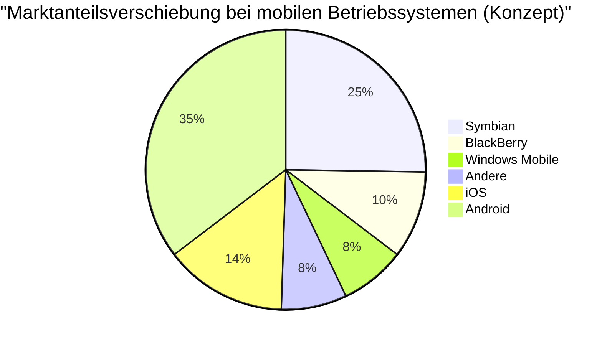

## 1. Genesis: Die Revolution, die in einer Garage begann (1976-1980)

Im Jahr 1976 gründeten Steve Jobs, Steve Wozniak und Ronald Wayne die "Apple Computer Company" in der Garage von Jobs' Elternhaus in Los Altos, Kalifornien.

Das erste Produkt, der **Apple I**, war ein Bausatz, bei dem nur das Motherboard geliefert wurde. Dies war der Moment, in dem Wozniaks geniale Fähigkeiten im Hardware-Design mit Jobs' Weitsicht und Marketing-Fähigkeiten verschmolzen.


### Der große Erfolg des Apple II
Der 1977 auf den Markt gebrachte **Apple II** war ein bahnbrechendes Produkt, das eine Tastatur in einem Kunststoffgehäuse integrierte und Farbgrafiken anzeigen konnte. Mit dem Erscheinen von VisiCalc (der weltweit ersten Tabellenkalkulationssoftware) drang der Apple II auch in den Geschäftsmarkt ein und verzeichnete einen explosiven Mega-Hit.

## 2. Der Beginn des Macintosh und der GUI (1984)

1984 brachte Apple den **Macintosh** auf den Markt. Dies war der erste PC für die breite Öffentlichkeit, der mit einer GUI (grafischen Benutzeroberfläche) und einer Maus ausgestattet war.


Als damals bahnbrechende Technologien wurden das Bitmap-Display und das Konzept der objektorientierten Programmierung eingeführt.

## 3. Die dunkle Zeit und die Rückkehr von Jobs (1985-1997)

1985 wurde Jobs aufgrund von internen Konflikten aus Apple verdrängt. Danach geriet Apple in eine Phase des Niedergangs. Jobs hingegen gründete NeXT und Pixar und feierte Erfolge.

1996 geriet Apple bei der Entwicklung eines Next-Generation-OS in eine Sackgasse und beschloss, Jobs' Unternehmen NeXT zu kaufen. 1997 kehrte Jobs zu Apple zurück und wurde Interims-CEO.

### Die Entwicklung von NeXTSTEP zu macOS
Die Technologie des OS von NeXT, **NeXTSTEP** (Mach-Kernel, Objective-C), wurde zum starken Fundament des späteren Mac OS X (dem heutigen macOS) und iOS.

```objc
// Beispiel in Objective-C (aus NeXTSTEP stammende Technologie)
#import <Foundation/Foundation.h>

@interface Greeting : NSObject
- (void)sayHello;
@end

@implementation Greeting
- (void)sayHello {
    NSLog(@"Hello, Think Different!");
}
@end
```

## 4. iMac, iPod und iTunes (1998-2006)

Jobs reduzierte die Produktpalette drastisch und kündigte 1998 den **iMac** an. Das transluzente (halbtransparente) Design versetzte die Welt in Staunen.

2001 wurden der **iPod** und **iTunes** angekündigt und revolutionierten die Musikindustrie. Der Slogan "1.000 Songs in deiner Tasche" zeigte die perfekte Verschmelzung von Technologie und Nutzererfahrung.

## 5. Die iPhone-Revolution und die mobile Ära (2007-2011)

Im Januar 2007 kündigte Jobs das **iPhone** an.
"Ein iPod, ein Telefon und ein Internet-Kommunikator. Dies sind nicht drei separate Geräte, sondern ein einziges Gerät."

Das iPhone nutzte eine Multi-Touch-Oberfläche und verzichtete auf eine physische Tastatur. Dies war ein Ereignis, das die Geschichte der menschlichen Kommunikation veränderte.



## 6. Die Tim-Cook-Ära und der Wandel zum Dienstleistungsunternehmen (2011-Gegenwart)

Nach dem Tod von Jobs im Jahr 2011 übernahm Tim Cook die Position des CEO. Durch Cooks exzellentes Supply-Chain-Management und den Erfolg von Wearables wie der Apple Watch und den AirPods wuchs Apple zum weltweit ersten Unternehmen mit einer Marktkapitalisierung von 1 Billion, 2 Billionen und 3 Billionen US-Dollar.

### Der Schock von Apple Silicon (M1/M2/M3)
In den letzten Jahren wurde der Übergang von Intel-Chips zu selbstentwickeltem **Apple Silicon (ARM-Architektur)** abgeschlossen. Es vereint hohe Leistung mit einer überwältigenden Energieeffizienz.

$$
\text{Leistung pro Watt} = \frac{\text{Rechenleistung (FLOPS)}}{\text{Stromverbrauch (Watt)}}
$$

## 7. Apple im KI-Zeitalter (Apple Intelligence)

2024 kündigte Apple **Apple Intelligence** an und stieg ernsthaft in die On-Device-KI ein, die den persönlichen Kontext versteht. Unter Wahrung der Privatsphäre wurden eine drastische Weiterentwicklung von Siri sowie die Text- und Bilderzeugung auf OS-Ebene integriert.

## Zusammenfassung

Die Geschichte von Apple ist eine Geschichte des ständigen Stehens an der Kreuzung von Technologie und freien Künsten (Liberal Arts). Das kleine Unternehmen, das in einer Garage begann, hat nun ein digitales Ökosystem aufgebaut, das aus dem Leben von Menschen auf der ganzen Welt nicht mehr wegzudenken ist.


## Zusätzliche Überlegung 1: Eine tiefergehende Betrachtung der Geschäftsstrategie und Technologie von Apple


## Zusätzliche Überlegung 2: Eine tiefergehende Betrachtung der Geschäftsstrategie und Technologie von Apple


## Zusätzliche Überlegung 3: Eine tiefergehende Betrachtung der Geschäftsstrategie und Technologie von Apple


## Zusätzliche Überlegung 4: Eine tiefergehende Betrachtung der Geschäftsstrategie und Technologie von Apple


## Zusätzliche Überlegung 5: Eine tiefergehende Betrachtung der Geschäftsstrategie und Technologie von Apple


## Zusätzliche Überlegung 6: Eine tiefergehende Betrachtung der Geschäftsstrategie und Technologie von Apple


## Zusätzliche Überlegung 7: Eine tiefergehende Betrachtung der Geschäftsstrategie und Technologie von Apple


## Zusätzliche Überlegung 8: Eine tiefergehende Betrachtung der Geschäftsstrategie und Technologie von Apple


## Zusätzliche Überlegung 9: Eine tiefergehende Betrachtung der Geschäftsstrategie und Technologie von Apple


