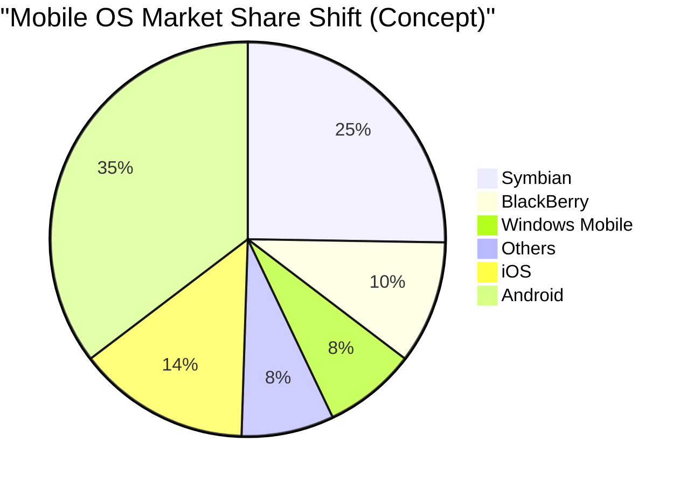

## 1. Genesis: The Revolution that Started in a Garage (1976-1980)

In 1976, Steve Jobs, Steve Wozniak, and Ronald Wayne founded the "Apple Computer Company" in the garage of Jobs' childhood home in Los Altos, California.

Their first product, the **Apple I**, was an assembly kit consisting only of a motherboard. It was the moment Wozniak's genius hardware design skills merged with Jobs' visionary and marketing prowess.


### The Massive Success of Apple II
Released in 1977, the **Apple II** was a groundbreaking product that integrated a keyboard into a plastic case and could display color graphics. With the advent of VisiCalc (the world's first spreadsheet software), the Apple II penetrated the business market and became an explosive, massive hit.

## 2. Macintosh and the Dawn of GUI (1984)

In 1984, Apple released the **Macintosh**. It was the first consumer personal computer equipped with a GUI (Graphical User Interface) and a mouse.


As groundbreaking technologies of the time, the concepts of bitmap displays and object-oriented programming were introduced.

## 3. The Dark Ages and Jobs' Return (1985-1997)

In 1985, Jobs was ousted from Apple due to internal conflicts. Subsequently, Apple entered a period of slump. Meanwhile, Jobs founded NeXT and Pixar, achieving success.

In 1996, Apple hit a wall in developing its next-generation OS and decided to acquire Jobs' NeXT. In 1997, Jobs returned to Apple and assumed the role of interim CEO.

### Evolution from NeXTSTEP to macOS
The technology of NeXT's OS, **NeXTSTEP** (Mach kernel, Objective-C), became the solid foundation for the later Mac OS X (now macOS) and iOS.

```objc
// Example of Objective-C (Technology derived from NeXTSTEP)
#import <Foundation/Foundation.h>

@interface Greeting : NSObject
- (void)sayHello;
@end

@implementation Greeting
- (void)sayHello {
    NSLog(@"Hello, Think Different!");
}
@end
```

## 4. iMac, iPod, and iTunes (1998-2006)

Jobs drastically narrowed down the product lineup and introduced the **iMac** in 1998. Its translucent design sent shockwaves around the world.

In 2001, he announced the **iPod** and **iTunes**, revolutionizing the music industry. The catchphrase "1,000 songs in your pocket" demonstrated the perfect fusion of technology and user experience.

## 5. The iPhone Revolution and the Mobile Era (2007-2011)

In January 2007, Jobs announced the **iPhone**.
"An iPod, a phone, and an internet communicator. These are not three separate devices, this is one device."

The iPhone adopted a multi-touch interface and eliminated the physical keyboard. This was an event that changed the history of human communication.



## 6. The Tim Cook Era and the Shift to a Services Company (2011-Present)

After Jobs' passing in 2011, Tim Cook took over as CEO. Through Cook's outstanding supply chain management and the success of wearable devices like the Apple Watch and AirPods, Apple grew to become the world's first company to reach a market capitalization of $1 trillion, $2 trillion, and $3 trillion.

### The Impact of Apple Silicon (M1/M2/M3)
In recent years, the company completed its transition from Intel chips to its in-house designed **Apple Silicon (ARM architecture)**. It achieves both high performance and overwhelming power efficiency.

$$
	ext{Performance per Watt} = rac{	ext{Computation Output (FLOPS)}}{	ext{Power Consumption (Watts)}}
$$

## 7. Apple in the AI Era (Apple Intelligence)

In 2024, Apple announced **Apple Intelligence**, marking its full-scale entry into on-device AI that understands personal context. While emphasizing privacy, it integrates a dramatically evolved Siri, as well as text and image generation, at the OS level.

## Conclusion

Apple's history is one of constantly standing at the intersection of technology and the liberal arts. The small company that started in a garage has now built a digital ecosystem that is indispensable to people's lives around the world.


## Additional Consideration 1: A Deep Dive into Apple's Management Strategy and Technology


### 1.1 Genesis: The Revolution that Started in a Garage (1976-1980)

In 1976, Steve Jobs, Steve Wozniak, and Ronald Wayne founded the "Apple Computer Company" in the garage of Jobs' childhood home in Los Altos, California.

Their first product, the **Apple I**, was an assembly kit consisting only of a motherboard. It was the moment Wozniak's genius hardware design skills merged with Jobs' visionary and marketing prowess.


### The Massive Success of Apple II
Released in 1977, the **Apple II** was a groundbreaking product that integrated a keyboard into a plastic case and could display color graphics. With the advent of VisiCalc (the world's first spreadsheet software), the Apple II penetrated the business market and became an explosive, massive hit.

### 1.2 Macintosh and the Dawn of GUI (1984)

In 1984, Apple released the **Macintosh**. It was the first consumer personal computer equipped with a GUI (Graphical User Interface) and a mouse.


As groundbreaking technologies of the time, the concepts of bitmap displays and object-oriented programming were introduced.

## 3. The Dark Ages and Jobs' Return (1985-1997)

In 1985, Jobs was ousted from Apple due to internal conflicts. Subsequently, Apple entered a period of slump. Meanwhile, Jobs founded NeXT and Pixar, achieving success.

In 1996, Apple hit a wall in developing its next-generation OS and decided to acquire Jobs' NeXT. In 1997, Jobs returned to Apple and assumed the role of interim CEO.

### Evolution from NeXTSTEP to macOS
The technology of NeXT's OS, **NeXTSTEP** (Mach kernel, Objective-C), became the solid foundation for the later Mac OS X (now macOS) and iOS.

```objc
// Example of Objective-C (Technology derived from NeXTSTEP)
#import <Foundation/Foundation.h>

@interface Greeting : NSObject
- (void)sayHello;
@end

@implementation Greeting
- (void)sayHello {
    NSLog(@"Hello, Think Different!");
}
@end
```

## 4. iMac, iPod, and iTunes (1998-2006)

Jobs drastically narrowed down the product lineup and introduced the **iMac** in 1998. Its translucent design sent shockwaves around the world.

In 2001, he announced the **iPod** and **iTunes**, revolutionizing the music industry. The catchphrase "1,000 songs in your pocket" demonstrated the perfect fusion of technology and user experience.

## 5. The iPhone Revolution and the Mobile Era (2007-2011)

In January 2007, Jobs announced the **iPhone**.
"An iPod, a phone, and an internet communicator. These are not three separate devices, this is one device."

The iPhone adopted a multi-touch interface and eliminated the physical keyboard. This was an event that changed the history of human communication.


## 6. The Tim Cook Era and the Shift to a Services Company (2011-Present)

After Jobs' passing in 2011, Tim Cook took over as CEO. Through Cook's outstanding supply chain management and the success of wearable devices like the Apple Watch and AirPods, Apple grew to become the world's first company to reach a market capitalization of $1 trillion, $2 trillion, and $3 trillion.

### The Impact of Apple Silicon (M1/M2/M3)
In recent years, the company completed its transition from Intel chips to its in-house designed **Apple Silicon (ARM architecture)**. It achieves both high performance and overwhelming power efficiency.

$$
	ext{Performance per Watt} = rac{	ext{Computation Output (FLOPS)}}{	ext{Power Consumption (Watts)}}
$$

## 7. Apple in the AI Era (Apple Intelligence)

In 2024, Apple announced **Apple Intelligence**, marking its full-scale entry into on-device AI that understands personal context. While emphasizing privacy, it integrates a dramatically evolved Siri, as well as text and image generation, at the OS level.

## Conclusion

Apple's history is one of constantly standing at the intersection of technology and the liberal arts. The small company that started in a garage has now built a digital ecosystem that is indispensable to people's lives around the world.


## Additional Consideration 2: A Deep Dive into Apple's Management Strategy and Technology


#### 2.21 Genesis: The Revolution that Started in a Garage (1976-1980)

In 1976, Steve Jobs, Steve Wozniak, and Ronald Wayne founded the "Apple Computer Company" in the garage of Jobs' childhood home in Los Altos, California.

Their first product, the **Apple I**, was an assembly kit consisting only of a motherboard. It was the moment Wozniak's genius hardware design skills merged with Jobs' visionary and marketing prowess.


### The Massive Success of Apple II
Released in 1977, the **Apple II** was a groundbreaking product that integrated a keyboard into a plastic case and could display color graphics. With the advent of VisiCalc (the world's first spreadsheet software), the Apple II penetrated the business market and became an explosive, massive hit.

### 2.2 Macintosh and the Dawn of GUI (1984)

In 1984, Apple released the **Macintosh**. It was the first consumer personal computer equipped with a GUI (Graphical User Interface) and a mouse.


As groundbreaking technologies of the time, the concepts of bitmap displays and object-oriented programming were introduced.

## 3. The Dark Ages and Jobs' Return (1985-1997)

In 1985, Jobs was ousted from Apple due to internal conflicts. Subsequently, Apple entered a period of slump. Meanwhile, Jobs founded NeXT and Pixar, achieving success.

In 1996, Apple hit a wall in developing its next-generation OS and decided to acquire Jobs' NeXT. In 1997, Jobs returned to Apple and assumed the role of interim CEO.

### Evolution from NeXTSTEP to macOS
The technology of NeXT's OS, **NeXTSTEP** (Mach kernel, Objective-C), became the solid foundation for the later Mac OS X (now macOS) and iOS.

```objc
// Example of Objective-C (Technology derived from NeXTSTEP)
#import <Foundation/Foundation.h>

@interface Greeting : NSObject
- (void)sayHello;
@end

@implementation Greeting
- (void)sayHello {
    NSLog(@"Hello, Think Different!");
}
@end
```

## 4. iMac, iPod, and iTunes (1998-2006)

Jobs drastically narrowed down the product lineup and introduced the **iMac** in 1998. Its translucent design sent shockwaves around the world.

In 2001, he announced the **iPod** and **iTunes**, revolutionizing the music industry. The catchphrase "1,000 songs in your pocket" demonstrated the perfect fusion of technology and user experience.

## 5. The iPhone Revolution and the Mobile Era (2007-2011)

In January 2007, Jobs announced the **iPhone**.
"An iPod, a phone, and an internet communicator. These are not three separate devices, this is one device."

The iPhone adopted a multi-touch interface and eliminated the physical keyboard. This was an event that changed the history of human communication.


## 6. The Tim Cook Era and the Shift to a Services Company (2011-Present)

After Jobs' passing in 2011, Tim Cook took over as CEO. Through Cook's outstanding supply chain management and the success of wearable devices like the Apple Watch and AirPods, Apple grew to become the world's first company to reach a market capitalization of $1 trillion, $2 trillion, and $3 trillion.

### The Impact of Apple Silicon (M1/M2/M3)
In recent years, the company completed its transition from Intel chips to its in-house designed **Apple Silicon (ARM architecture)**. It achieves both high performance and overwhelming power efficiency.

$$
	ext{Performance per Watt} = rac{	ext{Computation Output (FLOPS)}}{	ext{Power Consumption (Watts)}}
$$

## 7. Apple in the AI Era (Apple Intelligence)

In 2024, Apple announced **Apple Intelligence**, marking its full-scale entry into on-device AI that understands personal context. While emphasizing privacy, it integrates a dramatically evolved Siri, as well as text and image generation, at the OS level.

## Conclusion

Apple's history is one of constantly standing at the intersection of technology and the liberal arts. The small company that started in a garage has now built a digital ecosystem that is indispensable to people's lives around the world.


## Additional Consideration 3: A Deep Dive into Apple's Management Strategy and Technology


### 3.1 Genesis: The Revolution that Started in a Garage (1976-1980)

In 1976, Steve Jobs, Steve Wozniak, and Ronald Wayne founded the "Apple Computer Company" in the garage of Jobs' childhood home in Los Altos, California.

Their first product, the **Apple I**, was an assembly kit consisting only of a motherboard. It was the moment Wozniak's genius hardware design skills merged with Jobs' visionary and marketing prowess.


### The Massive Success of Apple II
Released in 1977, the **Apple II** was a groundbreaking product that integrated a keyboard into a plastic case and could display color graphics. With the advent of VisiCalc (the world's first spreadsheet software), the Apple II penetrated the business market and became an explosive, massive hit.

### 3.2 Macintosh and the Dawn of GUI (1984)

In 1984, Apple released the **Macintosh**. It was the first consumer personal computer equipped with a GUI (Graphical User Interface) and a mouse.


As groundbreaking technologies of the time, the concepts of bitmap displays and object-oriented programming were introduced.

## 3. The Dark Ages and Jobs' Return (1985-1997)

In 1985, Jobs was ousted from Apple due to internal conflicts. Subsequently, Apple entered a period of slump. Meanwhile, Jobs founded NeXT and Pixar, achieving success.

In 1996, Apple hit a wall in developing its next-generation OS and decided to acquire Jobs' NeXT. In 1997, Jobs returned to Apple and assumed the role of interim CEO.

### Evolution from NeXTSTEP to macOS
The technology of NeXT's OS, **NeXTSTEP** (Mach kernel, Objective-C), became the solid foundation for the later Mac OS X (now macOS) and iOS.

```objc
// Example of Objective-C (Technology derived from NeXTSTEP)
#import <Foundation/Foundation.h>

@interface Greeting : NSObject
- (void)sayHello;
@end

@implementation Greeting
- (void)sayHello {
    NSLog(@"Hello, Think Different!");
}
@end
```

## 4. iMac, iPod, and iTunes (1998-2006)

Jobs drastically narrowed down the product lineup and introduced the **iMac** in 1998. Its translucent design sent shockwaves around the world.

In 2001, he announced the **iPod** and **iTunes**, revolutionizing the music industry. The catchphrase "1,000 songs in your pocket" demonstrated the perfect fusion of technology and user experience.

## 5. The iPhone Revolution and the Mobile Era (2007-2011)

In January 2007, Jobs announced the **iPhone**.
"An iPod, a phone, and an internet communicator. These are not three separate devices, this is one device."

The iPhone adopted a multi-touch interface and eliminated the physical keyboard. This was an event that changed the history of human communication.


## 6. The Tim Cook Era and the Shift to a Services Company (2011-Present)

After Jobs' passing in 2011, Tim Cook took over as CEO. Through Cook's outstanding supply chain management and the success of wearable devices like the Apple Watch and AirPods, Apple grew to become the world's first company to reach a market capitalization of $1 trillion, $2 trillion, and $3 trillion.

### The Impact of Apple Silicon (M1/M2/M3)
In recent years, the company completed its transition from Intel chips to its in-house designed **Apple Silicon (ARM architecture)**. It achieves both high performance and overwhelming power efficiency.

$$
	ext{Performance per Watt} = rac{	ext{Computation Output (FLOPS)}}{	ext{Power Consumption (Watts)}}
$$

## 7. Apple in the AI Era (Apple Intelligence)

In 2024, Apple announced **Apple Intelligence**, marking its full-scale entry into on-device AI that understands personal context. While emphasizing privacy, it integrates a dramatically evolved Siri, as well as text and image generation, at the OS level.

## Conclusion

Apple's history is one of constantly standing at the intersection of technology and the liberal arts. The small company that started in a garage has now built a digital ecosystem that is indispensable to people's lives around the world.


## Additional Consideration 4: A Deep Dive into Apple's Management Strategy and Technology


### 4.1 Genesis: The Revolution that Started in a Garage (1976-1980)

In 1976, Steve Jobs, Steve Wozniak, and Ronald Wayne founded the "Apple Computer Company" in the garage of Jobs' childhood home in Los Altos, California.

Their first product, the **Apple I**, was an assembly kit consisting only of a motherboard. It was the moment Wozniak's genius hardware design skills merged with Jobs' visionary and marketing prowess.


### The Massive Success of Apple II
Released in 1977, the **Apple II** was a groundbreaking product that integrated a keyboard into a plastic case and could display color graphics. With the advent of VisiCalc (the world's first spreadsheet software), the Apple II penetrated the business market and became an explosive, massive hit.

### 4.2 Macintosh and the Dawn of GUI (1984)

In 1984, Apple released the **Macintosh**. It was the first consumer personal computer equipped with a GUI (Graphical User Interface) and a mouse.


As groundbreaking technologies of the time, the concepts of bitmap displays and object-oriented programming were introduced.

## 3. The Dark Ages and Jobs' Return (1985-1997)

In 1985, Jobs was ousted from Apple due to internal conflicts. Subsequently, Apple entered a period of slump. Meanwhile, Jobs founded NeXT and Pixar, achieving success.

In 1996, Apple hit a wall in developing its next-generation OS and decided to acquire Jobs' NeXT. In 1997, Jobs returned to Apple and assumed the role of interim CEO.

### Evolution from NeXTSTEP to macOS
The technology of NeXT's OS, **NeXTSTEP** (Mach kernel, Objective-C), became the solid foundation for the later Mac OS X (now macOS) and iOS.

```objc
// Example of Objective-C (Technology derived from NeXTSTEP)
#import <Foundation/Foundation.h>

@interface Greeting : NSObject
- (void)sayHello;
@end

@implementation Greeting
- (void)sayHello {
    NSLog(@"Hello, Think Different!");
}
@end
```

## 4. iMac, iPod, and iTunes (1998-2006)

Jobs drastically narrowed down the product lineup and introduced the **iMac** in 1998. Its translucent design sent shockwaves around the world.

In 2001, he announced the **iPod** and **iTunes**, revolutionizing the music industry. The catchphrase "1,000 songs in your pocket" demonstrated the perfect fusion of technology and user experience.

## 5. The iPhone Revolution and the Mobile Era (2007-2011)

In January 2007, Jobs announced the **iPhone**.
"An iPod, a phone, and an internet communicator. These are not three separate devices, this is one device."

The iPhone adopted a multi-touch interface and eliminated the physical keyboard. This was an event that changed the history of human communication.


## 6. The Tim Cook Era and the Shift to a Services Company (2011-Present)

After Jobs' passing in 2011, Tim Cook took over as CEO. Through Cook's outstanding supply chain management and the success of wearable devices like the Apple Watch and AirPods, Apple grew to become the world's first company to reach a market capitalization of $1 trillion, $2 trillion, and $3 trillion.

### The Impact of Apple Silicon (M1/M2/M3)
In recent years, the company completed its transition from Intel chips to its in-house designed **Apple Silicon (ARM architecture)**. It achieves both high performance and overwhelming power efficiency.

$$
	ext{Performance per Watt} = rac{	ext{Computation Output (FLOPS)}}{	ext{Power Consumption (Watts)}}
$$

## 7. Apple in the AI Era (Apple Intelligence)

In 2024, Apple announced **Apple Intelligence**, marking its full-scale entry into on-device AI that understands personal context. While emphasizing privacy, it integrates a dramatically evolved Siri, as well as text and image generation, at the OS level.

## Conclusion

Apple's history is one of constantly standing at the intersection of technology and the liberal arts. The small company that started in a garage has now built a digital ecosystem that is indispensable to people's lives around the world.


## Additional Consideration 5: A Deep Dive into Apple's Management Strategy and Technology


### 5.1 Genesis: The Revolution that Started in a Garage (1976-1980)

In 1976, Steve Jobs, Steve Wozniak, and Ronald Wayne founded the "Apple Computer Company" in the garage of Jobs' childhood home in Los Altos, California.

Their first product, the **Apple I**, was an assembly kit consisting only of a motherboard. It was the moment Wozniak's genius hardware design skills merged with Jobs' visionary and marketing prowess.


### The Massive Success of Apple II
Released in 1977, the **Apple II** was a groundbreaking product that integrated a keyboard into a plastic case and could display color graphics. With the advent of VisiCalc (the world's first spreadsheet software), the Apple II penetrated the business market and became an explosive, massive hit.

### 5.2 Macintosh and the Dawn of GUI (1984)

In 1984, Apple released the **Macintosh**. It was the first consumer personal computer equipped with a GUI (Graphical User Interface) and a mouse.


As groundbreaking technologies of the time, the concepts of bitmap displays and object-oriented programming were introduced.

## 3. The Dark Ages and Jobs' Return (1985-1997)

In 1985, Jobs was ousted from Apple due to internal conflicts. Subsequently, Apple entered a period of slump. Meanwhile, Jobs founded NeXT and Pixar, achieving success.

In 1996, Apple hit a wall in developing its next-generation OS and decided to acquire Jobs' NeXT. In 1997, Jobs returned to Apple and assumed the role of interim CEO.

### Evolution from NeXTSTEP to macOS
The technology of NeXT's OS, **NeXTSTEP** (Mach kernel, Objective-C), became the solid foundation for the later Mac OS X (now macOS) and iOS.

```objc
// Example of Objective-C (Technology derived from NeXTSTEP)
#import <Foundation/Foundation.h>

@interface Greeting : NSObject
- (void)sayHello;
@end

@implementation Greeting
- (void)sayHello {
    NSLog(@"Hello, Think Different!");
}
@end
```

## 4. iMac, iPod, and iTunes (1998-2006)

Jobs drastically narrowed down the product lineup and introduced the **iMac** in 1998. Its translucent design sent shockwaves around the world.

In 2001, he announced the **iPod** and **iTunes**, revolutionizing the music industry. The catchphrase "1,000 songs in your pocket" demonstrated the perfect fusion of technology and user experience.

## 5. The iPhone Revolution and the Mobile Era (2007-2011)

In January 2007, Jobs announced the **iPhone**.
"An iPod, a phone, and an internet communicator. These are not three separate devices, this is one device."

The iPhone adopted a multi-touch interface and eliminated the physical keyboard. This was an event that changed the history of human communication.


## 6. The Tim Cook Era and the Shift to a Services Company (2011-Present)

After Jobs' passing in 2011, Tim Cook took over as CEO. Through Cook's outstanding supply chain management and the success of wearable devices like the Apple Watch and AirPods, Apple grew to become the world's first company to reach a market capitalization of $1 trillion, $2 trillion, and $3 trillion.

### The Impact of Apple Silicon (M1/M2/M3)
In recent years, the company completed its transition from Intel chips to its in-house designed **Apple Silicon (ARM architecture)**. It achieves both high performance and overwhelming power efficiency.

$$
	ext{Performance per Watt} = rac{	ext{Computation Output (FLOPS)}}{	ext{Power Consumption (Watts)}}
$$

## 7. Apple in the AI Era (Apple Intelligence)

In 2024, Apple announced **Apple Intelligence**, marking its full-scale entry into on-device AI that understands personal context. While emphasizing privacy, it integrates a dramatically evolved Siri, as well as text and image generation, at the OS level.

## Conclusion

Apple's history is one of constantly standing at the intersection of technology and the liberal arts. The small company that started in a garage has now built a digital ecosystem that is indispensable to people's lives around the world.


## Additional Consideration 6: A Deep Dive into Apple's Management Strategy and Technology


### 6.1 Genesis: The Revolution that Started in a Garage (1976-1980)

In 1976, Steve Jobs, Steve Wozniak, and Ronald Wayne founded the "Apple Computer Company" in the garage of Jobs' childhood home in Los Altos, California.

Their first product, the **Apple I**, was an assembly kit consisting only of a motherboard. It was the moment Wozniak's genius hardware design skills merged with Jobs' visionary and marketing prowess.


### The Massive Success of Apple II
Released in 1977, the **Apple II** was a groundbreaking product that integrated a keyboard into a plastic case and could display color graphics. With the advent of VisiCalc (the world's first spreadsheet software), the Apple II penetrated the business market and became an explosive, massive hit.

### 6.2 Macintosh and the Dawn of GUI (1984)

In 1984, Apple released the **Macintosh**. It was the first consumer personal computer equipped with a GUI (Graphical User Interface) and a mouse.


As groundbreaking technologies of the time, the concepts of bitmap displays and object-oriented programming were introduced.

## 3. The Dark Ages and Jobs' Return (1985-1997)

In 1985, Jobs was ousted from Apple due to internal conflicts. Subsequently, Apple entered a period of slump. Meanwhile, Jobs founded NeXT and Pixar, achieving success.

In 1996, Apple hit a wall in developing its next-generation OS and decided to acquire Jobs' NeXT. In 1997, Jobs returned to Apple and assumed the role of interim CEO.

### Evolution from NeXTSTEP to macOS
The technology of NeXT's OS, **NeXTSTEP** (Mach kernel, Objective-C), became the solid foundation for the later Mac OS X (now macOS) and iOS.

```objc
// Example of Objective-C (Technology derived from NeXTSTEP)
#import <Foundation/Foundation.h>

@interface Greeting : NSObject
- (void)sayHello;
@end

@implementation Greeting
- (void)sayHello {
    NSLog(@"Hello, Think Different!");
}
@end
```

## 4. iMac, iPod, and iTunes (1998-2006)

Jobs drastically narrowed down the product lineup and introduced the **iMac** in 1998. Its translucent design sent shockwaves around the world.

In 2001, he announced the **iPod** and **iTunes**, revolutionizing the music industry. The catchphrase "1,000 songs in your pocket" demonstrated the perfect fusion of technology and user experience.

## 5. The iPhone Revolution and the Mobile Era (2007-2011)

In January 2007, Jobs announced the **iPhone**.
"An iPod, a phone, and an internet communicator. These are not three separate devices, this is one device."

The iPhone adopted a multi-touch interface and eliminated the physical keyboard. This was an event that changed the history of human communication.

```mermaid
pie title "Mobile OS Market Share Shift (Concept)"
    "Symbian" : 50
    "BlackBerry" : 20
    "Windows Mobile" : 15
    "Others" : 15
    %% ↓ After iPhone/Android
    "iOS" : 28
    "Android" : 70
    "Others" : 2
```

## 6. The Tim Cook Era and the Shift to a Services Company (2011-Present)

After Jobs' passing in 2011, Tim Cook took over as CEO. Through Cook's outstanding supply chain management and the success of wearable devices like the Apple Watch and AirPods, Apple grew to become the world's first company to reach a market capitalization of $1 trillion, $2 trillion, and $3 trillion.

### The Impact of Apple Silicon (M1/M2/M3)
In recent years, the company completed its transition from Intel chips to its in-house designed **Apple Silicon (ARM architecture)**. It achieves both high performance and overwhelming power efficiency.

$$
	ext{Performance per Watt} = rac{	ext{Computation Output (FLOPS)}}{	ext{Power Consumption (Watts)}}
$$

## 7. Apple in the AI Era (Apple Intelligence)

In 2024, Apple announced **Apple Intelligence**, marking its full-scale entry into on-device AI that understands personal context. While emphasizing privacy, it integrates a dramatically evolved Siri, as well as text and image generation, at the OS level.

## Conclusion

Apple's history is one of constantly standing at the intersection of technology and the liberal arts. The small company that started in a garage has now built a digital ecosystem that is indispensable to people's lives around the world.


## Additional Consideration 7: A Deep Dive into Apple's Management Strategy and Technology


### 7.1 Genesis: The Revolution that Started in a Garage (1976-1980)

In 1976, Steve Jobs, Steve Wozniak, and Ronald Wayne founded the "Apple Computer Company" in the garage of Jobs' childhood home in Los Altos, California.

Their first product, the **Apple I**, was an assembly kit consisting only of a motherboard. It was the moment Wozniak's genius hardware design skills merged with Jobs' visionary and marketing prowess.

```mermaid
graph TD
    subgraph "Apple Founders"
        SJ["Steve Jobs (Marketing/Vision)"]
        SW["Steve Wozniak (Engineering)"]
        RW["Ronald Wayne (Administration)"]
        SJ --- SW
        SJ --- RW
        SW --- RW
    end
```

### The Massive Success of Apple II
Released in 1977, the **Apple II** was a groundbreaking product that integrated a keyboard into a plastic case and could display color graphics. With the advent of VisiCalc (the world's first spreadsheet software), the Apple II penetrated the business market and became an explosive, massive hit.

### 7.2 Macintosh and the Dawn of GUI (1984)

In 1984, Apple released the **Macintosh**. It was the first consumer personal computer equipped with a GUI (Graphical User Interface) and a mouse.

```mermaid
flowchart LR
    Xerox["Xerox PARC (GUI Concept)"] --> Jobs["Steve Jobs Visit (1979)"]
    Jobs --> Lisa["Apple Lisa (1983)"]
    Lisa --> Mac["Macintosh (1984)"]
    Mac --> Modern["Modern GUI OS"]
```

As groundbreaking technologies of the time, the concepts of bitmap displays and object-oriented programming were introduced.

## 3. The Dark Ages and Jobs' Return (1985-1997)

In 1985, Jobs was ousted from Apple due to internal conflicts. Subsequently, Apple entered a period of slump. Meanwhile, Jobs founded NeXT and Pixar, achieving success.

In 1996, Apple hit a wall in developing its next-generation OS and decided to acquire Jobs' NeXT. In 1997, Jobs returned to Apple and assumed the role of interim CEO.

### Evolution from NeXTSTEP to macOS
The technology of NeXT's OS, **NeXTSTEP** (Mach kernel, Objective-C), became the solid foundation for the later Mac OS X (now macOS) and iOS.

```objc
// Example of Objective-C (Technology derived from NeXTSTEP)
#import <Foundation/Foundation.h>

@interface Greeting : NSObject
- (void)sayHello;
@end

@implementation Greeting
- (void)sayHello {
    NSLog(@"Hello, Think Different!");
}
@end
```

## 4. iMac, iPod, and iTunes (1998-2006)

Jobs drastically narrowed down the product lineup and introduced the **iMac** in 1998. Its translucent design sent shockwaves around the world.

In 2001, he announced the **iPod** and **iTunes**, revolutionizing the music industry. The catchphrase "1,000 songs in your pocket" demonstrated the perfect fusion of technology and user experience.

## 5. The iPhone Revolution and the Mobile Era (2007-2011)

In January 2007, Jobs announced the **iPhone**.
"An iPod, a phone, and an internet communicator. These are not three separate devices, this is one device."

The iPhone adopted a multi-touch interface and eliminated the physical keyboard. This was an event that changed the history of human communication.

```mermaid
pie title "Mobile OS Market Share Shift (Concept)"
    "Symbian" : 50
    "BlackBerry" : 20
    "Windows Mobile" : 15
    "Others" : 15
    %% ↓ After iPhone/Android
    "iOS" : 28
    "Android" : 70
    "Others" : 2
```

## 6. The Tim Cook Era and the Shift to a Services Company (2011-Present)

After Jobs' passing in 2011, Tim Cook took over as CEO. Through Cook's outstanding supply chain management and the success of wearable devices like the Apple Watch and AirPods, Apple grew to become the world's first company to reach a market capitalization of $1 trillion, $2 trillion, and $3 trillion.

### The Impact of Apple Silicon (M1/M2/M3)
In recent years, the company completed its transition from Intel chips to its in-house designed **Apple Silicon (ARM architecture)**. It achieves both high performance and overwhelming power efficiency.

$$
	ext{Performance per Watt} = rac{	ext{Computation Output (FLOPS)}}{	ext{Power Consumption (Watts)}}
$$

## 7. Apple in the AI Era (Apple Intelligence)

In 2024, Apple announced **Apple Intelligence**, marking its full-scale entry into on-device AI that understands personal context. While emphasizing privacy, it integrates a dramatically evolved Siri, as well as text and image generation, at the OS level.

## Conclusion

Apple's history is one of constantly standing at the intersection of technology and the liberal arts. The small company that started in a garage has now built a digital ecosystem that is indispensable to people's lives around the world.


## Additional Consideration 8: A Deep Dive into Apple's Management Strategy and Technology


### 8.1 Genesis: The Revolution that Started in a Garage (1976-1980)

In 1976, Steve Jobs, Steve Wozniak, and Ronald Wayne founded the "Apple Computer Company" in the garage of Jobs' childhood home in Los Altos, California.

Their first product, the **Apple I**, was an assembly kit consisting only of a motherboard. It was the moment Wozniak's genius hardware design skills merged with Jobs' visionary and marketing prowess.

```mermaid
graph TD
    subgraph "Apple Founders"
        SJ["Steve Jobs (Marketing/Vision)"]
        SW["Steve Wozniak (Engineering)"]
        RW["Ronald Wayne (Administration)"]
        SJ --- SW
        SJ --- RW
        SW --- RW
    end
```

### The Massive Success of Apple II
Released in 1977, the **Apple II** was a groundbreaking product that integrated a keyboard into a plastic case and could display color graphics. With the advent of VisiCalc (the world's first spreadsheet software), the Apple II penetrated the business market and became an explosive, massive hit.

### 8.2 Macintosh and the Dawn of GUI (1984)

In 1984, Apple released the **Macintosh**. It was the first consumer personal computer equipped with a GUI (Graphical User Interface) and a mouse.

```mermaid
flowchart LR
    Xerox["Xerox PARC (GUI Concept)"] --> Jobs["Steve Jobs Visit (1979)"]
    Jobs --> Lisa["Apple Lisa (1983)"]
    Lisa --> Mac["Macintosh (1984)"]
    Mac --> Modern["Modern GUI OS"]
```

As groundbreaking technologies of the time, the concepts of bitmap displays and object-oriented programming were introduced.

## 3. The Dark Ages and Jobs' Return (1985-1997)

In 1985, Jobs was ousted from Apple due to internal conflicts. Subsequently, Apple entered a period of slump. Meanwhile, Jobs founded NeXT and Pixar, achieving success.

In 1996, Apple hit a wall in developing its next-generation OS and decided to acquire Jobs' NeXT. In 1997, Jobs returned to Apple and assumed the role of interim CEO.

### Evolution from NeXTSTEP to macOS
The technology of NeXT's OS, **NeXTSTEP** (Mach kernel, Objective-C), became the solid foundation for the later Mac OS X (now macOS) and iOS.

```objc
// Example of Objective-C (Technology derived from NeXTSTEP)
#import <Foundation/Foundation.h>

@interface Greeting : NSObject
- (void)sayHello;
@end

@implementation Greeting
- (void)sayHello {
    NSLog(@"Hello, Think Different!");
}
@end
```

## 4. iMac, iPod, and iTunes (1998-2006)

Jobs drastically narrowed down the product lineup and introduced the **iMac** in 1998. Its translucent design sent shockwaves around the world.

In 2001, he announced the **iPod** and **iTunes**, revolutionizing the music industry. The catchphrase "1,000 songs in your pocket" demonstrated the perfect fusion of technology and user experience.

## 5. The iPhone Revolution and the Mobile Era (2007-2011)

In January 2007, Jobs announced the **iPhone**.
"An iPod, a phone, and an internet communicator. These are not three separate devices, this is one device."

The iPhone adopted a multi-touch interface and eliminated the physical keyboard. This was an event that changed the history of human communication.

```mermaid
pie title "Mobile OS Market Share Shift (Concept)"
    "Symbian" : 50
    "BlackBerry" : 20
    "Windows Mobile" : 15
    "Others" : 15
    %% ↓ After iPhone/Android
    "iOS" : 28
    "Android" : 70
    "Others" : 2
```

## 6. The Tim Cook Era and the Shift to a Services Company (2011-Present)

After Jobs' passing in 2011, Tim Cook took over as CEO. Through Cook's outstanding supply chain management and the success of wearable devices like the Apple Watch and AirPods, Apple grew to become the world's first company to reach a market capitalization of $1 trillion, $2 trillion, and $3 trillion.

### The Impact of Apple Silicon (M1/M2/M3)
In recent years, the company completed its transition from Intel chips to its in-house designed **Apple Silicon (ARM architecture)**. It achieves both high performance and overwhelming power efficiency.

$$
	ext{Performance per Watt} = rac{	ext{Computation Output (FLOPS)}}{	ext{Power Consumption (Watts)}}
$$

## 7. Apple in the AI Era (Apple Intelligence)

In 2024, Apple announced **Apple Intelligence**, marking its full-scale entry into on-device AI that understands personal context. While emphasizing privacy, it integrates a dramatically evolved Siri, as well as text and image generation, at the OS level.

## Conclusion

Apple's history is one of constantly standing at the intersection of technology and the liberal arts. The small company that started in a garage has now built a digital ecosystem that is indispensable to people's lives around the world.


## Additional Consideration 9: A Deep Dive into Apple's Management Strategy and Technology


### 9.1 Genesis: The Revolution that Started in a Garage (1976-1980)

In 1976, Steve Jobs, Steve Wozniak, and Ronald Wayne founded the "Apple Computer Company" in the garage of Jobs' childhood home in Los Altos, California.

Their first product, the **Apple I**, was an assembly kit consisting only of a motherboard. It was the moment Wozniak's genius hardware design skills merged with Jobs' visionary and marketing prowess.

```mermaid
graph TD
    subgraph "Apple Founders"
        SJ["Steve Jobs (Marketing/Vision)"]
        SW["Steve Wozniak (Engineering)"]
        RW["Ronald Wayne (Administration)"]
        SJ --- SW
        SJ --- RW
        SW --- RW
    end
```

### The Massive Success of Apple II
Released in 1977, the **Apple II** was a groundbreaking product that integrated a keyboard into a plastic case and could display color graphics. With the advent of VisiCalc (the world's first spreadsheet software), the Apple II penetrated the business market and became an explosive, massive hit.

### 9.2 Macintosh and the Dawn of GUI (1984)

In 1984, Apple released the **Macintosh**. It was the first consumer personal computer equipped with a GUI (Graphical User Interface) and a mouse.

```mermaid
flowchart LR
    Xerox["Xerox PARC (GUI Concept)"] --> Jobs["Steve Jobs Visit (1979)"]
    Jobs --> Lisa["Apple Lisa (1983)"]
    Lisa --> Mac["Macintosh (1984)"]
    Mac --> Modern["Modern GUI OS"]
```

As groundbreaking technologies of the time, the concepts of bitmap displays and object-oriented programming were introduced.

## 3. The Dark Ages and Jobs' Return (1985-1997)

In 1985, Jobs was ousted from Apple due to internal conflicts. Subsequently, Apple entered a period of slump. Meanwhile, Jobs founded NeXT and Pixar, achieving success.

In 1996, Apple hit a wall in developing its next-generation OS and decided to acquire Jobs' NeXT. In 1997, Jobs returned to Apple and assumed the role of interim CEO.

### Evolution from NeXTSTEP to macOS
The technology of NeXT's OS, **NeXTSTEP** (Mach kernel, Objective-C), became the solid foundation for the later Mac OS X (now macOS) and iOS.

```objc
// Example of Objective-C (Technology derived from NeXTSTEP)
#import <Foundation/Foundation.h>

@interface Greeting : NSObject
- (void)sayHello;
@end

@implementation Greeting
- (void)sayHello {
    NSLog(@"Hello, Think Different!");
}
@end
```

## 4. iMac, iPod, and iTunes (1998-2006)

Jobs drastically narrowed down the product lineup and introduced the **iMac** in 1998. Its translucent design sent shockwaves around the world.

In 2001, he announced the **iPod** and **iTunes**, revolutionizing the music industry. The catchphrase "1,000 songs in your pocket" demonstrated the perfect fusion of technology and user experience.

## 5. The iPhone Revolution and the Mobile Era (2007-2011)

In January 2007, Jobs announced the **iPhone**.
"An iPod, a phone, and an internet communicator. These are not three separate devices, this is one device."

The iPhone adopted a multi-touch interface and eliminated the physical keyboard. This was an event that changed the history of human communication.

```mermaid
pie title "Mobile OS Market Share Shift (Concept)"
    "Symbian" : 50
    "BlackBerry" : 20
    "Windows Mobile" : 15
    "Others" : 15
    %% ↓ After iPhone/Android
    "iOS" : 28
    "Android" : 70
    "Others" : 2
```

## 6. The Tim Cook Era and the Shift to a Services Company (2011-Present)

After Jobs' passing in 2011, Tim Cook took over as CEO. Through Cook's outstanding supply chain management and the success of wearable devices like the Apple Watch and AirPods, Apple grew to become the world's first company to reach a market capitalization of $1 trillion, $2 trillion, and $3 trillion.

### The Impact of Apple Silicon (M1/M2/M3)
In recent years, the company completed its transition from Intel chips to its in-house designed **Apple Silicon (ARM architecture)**. It achieves both high performance and overwhelming power efficiency.

$$
	ext{Performance per Watt} = rac{	ext{Computation Output (FLOPS)}}{	ext{Power Consumption (Watts)}}
$$

## 7. Apple in the AI Era (Apple Intelligence)

In 2024, Apple announced **Apple Intelligence**, marking its full-scale entry into on-device AI that understands personal context. While emphasizing privacy, it integrates a dramatically evolved Siri, as well as text and image generation, at the OS level.

## Conclusion

Apple's history is one of constantly standing at the intersection of technology and the liberal arts. The small company that started in a garage has now built a digital ecosystem that is indispensable to people's lives around the world.
