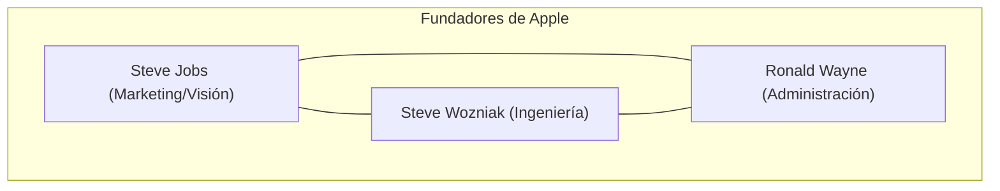
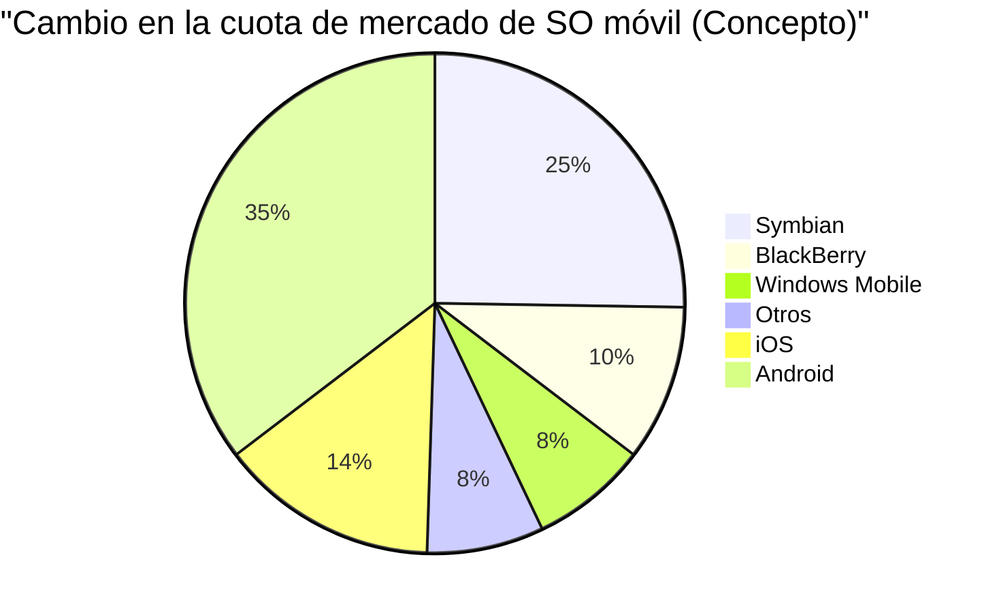

## 1. Génesis: La revolución que comenzó en un garaje (1976-1980)

En 1976, Steve Jobs, Steve Wozniak y Ronald Wayne fundaron la "Apple Computer Company" en el garaje de la casa de la infancia de Jobs en Los Altos, California.

El primer producto, **Apple I**, fue un kit de ensamblaje en el que solo se proporcionaba la placa base. Fue el momento en el que se fusionaron la genial capacidad de diseño de hardware de Wozniak con la visión y capacidad de marketing de Jobs.



### El gran éxito del Apple II
Lanzado en 1977, el **Apple II** fue un producto revolucionario que integraba un teclado en una carcasa de plástico y podía mostrar gráficos en color. Con la llegada de VisiCalc (el primer software de hojas de cálculo del mundo), el Apple II también penetró en el mercado empresarial y registró un éxito explosivo.

## 2. Macintosh y el amanecer de la GUI (1984)

En 1984, Apple lanzó el **Macintosh**. Este fue el primer ordenador personal dirigido al público en general que contaba con una GUI (interfaz gráfica de usuario) y un ratón.


Como tecnología revolucionaria de la época, se introdujeron la pantalla de mapa de bits y el concepto de programación orientada a objetos.

## 3. La era oscura y el regreso de Jobs (1985-1997)

En 1985, debido a conflictos internos, Jobs fue expulsado de Apple. Después de eso, Apple entró en un período de estancamiento. Por su parte, Jobs fundó NeXT y Pixar, logrando un gran éxito.

En 1996, Apple se estancó en el desarrollo de su sistema operativo de próxima generación y decidió adquirir NeXT de Jobs. En 1997, Jobs regresó a Apple y asumió el cargo de CEO interino.

### Evolución de NeXTSTEP a macOS
La tecnología de **NeXTSTEP**, el sistema operativo de NeXT (núcleo Mach, Objective-C), se convirtió en la base sólida del posterior Mac OS X (actual macOS) y de iOS.

```objc
// Ejemplo de Objective-C (Tecnología derivada de NeXTSTEP)
#import <Foundation/Foundation.h>

@interface Greeting : NSObject
- (void)sayHello;
@end

@implementation Greeting
- (void)sayHello {
    NSLog(@"¡Hola, Piensa Diferente!");
}
@end
```

## 4. iMac, iPod e iTunes (1998-2006)

Jobs redujo drásticamente la línea de productos y, en 1998, anunció el **iMac**. El diseño translúcido (semitransparente) impactó al mundo entero.

En 2001, anunció el **iPod** e **iTunes**, revolucionando la industria musical. El eslogan "1000 canciones en tu bolsillo" demostró la fusión perfecta entre la tecnología y la experiencia del usuario.

## 5. La revolución del iPhone y la era móvil (2007-2011)

En enero de 2007, Jobs anunció el **iPhone**.
"Un iPod, un teléfono y un comunicador de internet. Estos no son tres dispositivos independientes, sino un solo dispositivo."

El iPhone adoptó una interfaz multitáctil y eliminó el teclado físico. Este fue un evento que cambió la historia de la comunicación humana.



## 6. La era de Tim Cook y la transición a una empresa de servicios (2011-presente)

Tras el fallecimiento de Jobs en 2011, Tim Cook asumió el cargo de CEO. Gracias a la excelente gestión de la cadena de suministro de Cook y al éxito de dispositivos portátiles como el Apple Watch y los AirPods, Apple creció hasta convertirse en la primera empresa del mundo con una capitalización bursátil de 1, 2 y 3 billones de dólares.

### El impacto de Apple Silicon (M1/M2/M3)
En los últimos años, completó la transición de chips Intel a su propio diseño de **Apple Silicon (arquitectura ARM)**. Combina un alto rendimiento con una eficiencia energética abrumadora.

$$
\text{Rendimiento por Vatio} = \frac{\text{Salida de Computación (FLOPS)}}{\text{Consumo de Energía (Vatios)}}
$$

## 7. Apple en la era de la IA (Apple Intelligence)

En 2024, Apple anunció **Apple Intelligence**, haciendo una entrada a gran escala en la IA en el dispositivo que entiende el contexto personal. Manteniendo un fuerte enfoque en la privacidad, ha integrado a nivel del sistema operativo una evolución drástica de Siri, así como la generación de texto e imágenes.

## Conclusión

La historia de Apple es la historia de mantenerse en la intersección de la tecnología y las artes liberales. La pequeña empresa que comenzó en un garaje ha construido ahora un ecosistema digital esencial para la vida de personas en todo el mundo.


## Consideración adicional 1: Análisis profundo de la estrategia de gestión y la tecnología de Apple


## Consideración adicional 2: Análisis profundo de la estrategia de gestión y la tecnología de Apple


## Consideración adicional 3: Análisis profundo de la estrategia de gestión y la tecnología de Apple


## Consideración adicional 4: Análisis profundo de la estrategia de gestión y la tecnología de Apple


## Consideración adicional 5: Análisis profundo de la estrategia de gestión y la tecnología de Apple


## Consideración adicional 6: Análisis profundo de la estrategia de gestión y la tecnología de Apple


## Consideración adicional 7: Análisis profundo de la estrategia de gestión y la tecnología de Apple


## Consideración adicional 8: Análisis profundo de la estrategia de gestión y la tecnología de Apple


## Consideración adicional 9: Análisis profundo de la estrategia de gestión y la tecnología de Apple


