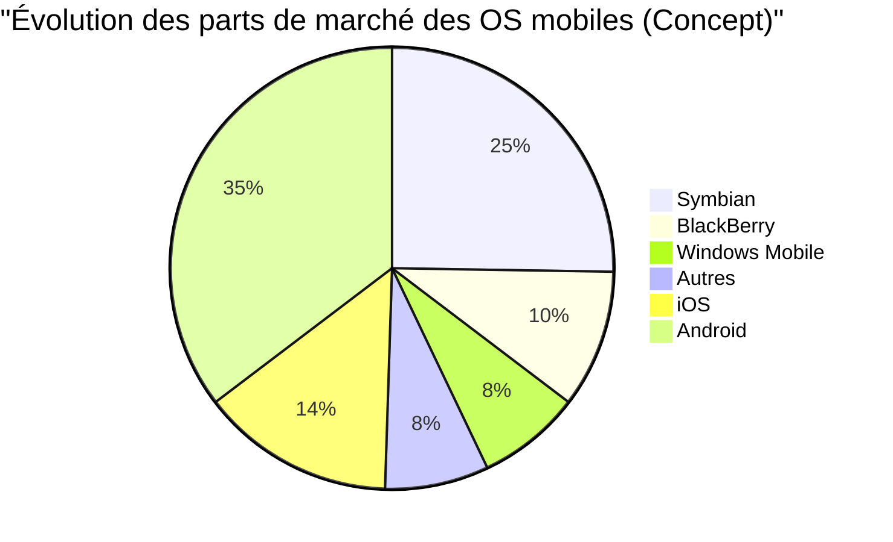

## 1. Genèse : La révolution commencée dans un garage (1976-1980)

En 1976, Steve Jobs, Steve Wozniak et Ronald Wayne ont fondé "Apple Computer Company" dans le garage de la maison d'enfance de Jobs à Los Altos, en Californie.

Le premier produit, l'**Apple I**, était un kit à assembler fourni uniquement avec une carte mère. C'est le moment où le génie de la conception matérielle de Wozniak a fusionné avec la vision et les compétences en marketing de Jobs.


### L'immense succès de l'Apple II
Lancé en 1977, l'**Apple II** était un produit révolutionnaire qui intégrait un clavier dans un boîtier en plastique et pouvait afficher des graphiques en couleur. Avec l'arrivée de VisiCalc (le premier tableur au monde), l'Apple II a également pénétré le marché des entreprises et a enregistré un succès explosif.

## 2. Macintosh et l'aube de l'interface graphique (1984)

En 1984, Apple lance le **Macintosh**. Il s'agissait du premier ordinateur personnel destiné au grand public doté d'une interface graphique (GUI) et d'une souris.


En tant que technologies révolutionnaires de l'époque, les concepts d'affichage bitmap et de programmation orientée objet ont été introduits.

## 3. L'âge sombre et le retour de Jobs (1985-1997)

En 1985, suite à des conflits internes, Jobs est évincé d'Apple. Par la suite, Apple entre dans une période de stagnation. Pendant ce temps, Jobs fonde NeXT et Pixar, rencontrant un grand succès.

En 1996, Apple se trouve dans une impasse quant au développement de son système d'exploitation de nouvelle génération et décide d'acquérir l'entreprise NeXT de Jobs. En 1997, Jobs retourne chez Apple et devient PDG par intérim.

### Évolution de NeXTSTEP vers macOS
La technologie du système d'exploitation **NeXTSTEP** de NeXT (noyau Mach, Objective-C) est devenue une base solide pour le futur Mac OS X (actuellement macOS) et iOS.

```objc
// Exemple en Objective-C (Technologie dérivée de NeXTSTEP)
#import <Foundation/Foundation.h>

@interface Greeting : NSObject
- (void)sayHello;
@end

@implementation Greeting
- (void)sayHello {
    NSLog(@"Bonjour, Pensez Différemment !");
}
@end
```

## 4. iMac, iPod et iTunes (1998-2006)

Jobs a considérablement réduit la gamme de produits et a annoncé l'**iMac** en 1998. Son design translucide (semi-transparent) a choqué le monde entier.

En 2001, ils ont annoncé l'**iPod** et **iTunes**, révolutionnant ainsi l'industrie musicale. Le slogan "1000 chansons dans votre poche" a démontré la fusion parfaite de la technologie et de l'expérience utilisateur.

## 5. La révolution de l'iPhone et l'ère mobile (2007-2011)

En janvier 2007, Jobs a annoncé l'**iPhone**.
"Un iPod, un téléphone et un communicateur Internet. Ce ne sont pas trois appareils distincts, mais un seul appareil."

L'iPhone a adopté une interface multi-touch et a éliminé le clavier physique. C'est un événement qui a changé l'histoire de la communication humaine.



## 6. L'ère de Tim Cook et la transition vers une entreprise de services (2011-Présent)

Après le décès de Jobs en 2011, Tim Cook a pris la relève en tant que PDG. Grâce à l'excellente gestion de la chaîne d'approvisionnement de Cook et au succès des appareils portables tels que l'Apple Watch et les AirPods, Apple est devenue la première entreprise au monde à atteindre une capitalisation boursière de 1 000 milliards, 2 000 milliards et 3 000 milliards de dollars.

### L'impact de l'Apple Silicon (M1/M2/M3)
Ces dernières années, ils ont achevé la transition des puces Intel vers l'**Apple Silicon (Architecture ARM)** conçu en interne. Il allie des performances élevées à une efficacité énergétique exceptionnelle.

$$
	ext{Performance per Watt} = rac{	ext{Computation Output (FLOPS)}}{	ext{Power Consumption (Watts)}}
$$

## 7. Apple à l'ère de l'IA (Apple Intelligence)

En 2024, Apple a annoncé **Apple Intelligence**, marquant ainsi son entrée à part entière dans l'IA embarquée sur appareil qui comprend le contexte personnel. Tout en mettant l'accent sur la confidentialité, ils intègrent l'évolution spectaculaire de Siri et la génération de texte et d'images au niveau du système d'exploitation.

## Conclusion

L'histoire d'Apple est l'histoire de rester à l'intersection de la technologie et des arts libéraux. La petite entreprise qui a commencé dans un garage a maintenant construit un écosystème numérique indispensable à la vie des personnes à travers le monde.


## Réflexion supplémentaire 1 : Analyse approfondie de la stratégie commerciale et de la technologie d\'Apple


## Réflexion supplémentaire 2 : Analyse approfondie de la stratégie commerciale et de la technologie d\'Apple


## Réflexion supplémentaire 3 : Analyse approfondie de la stratégie commerciale et de la technologie d\'Apple


## Réflexion supplémentaire 4 : Analyse approfondie de la stratégie commerciale et de la technologie d\'Apple


## Réflexion supplémentaire 5 : Analyse approfondie de la stratégie commerciale et de la technologie d\'Apple


## Réflexion supplémentaire 6 : Analyse approfondie de la stratégie commerciale et de la technologie d\'Apple


## Réflexion supplémentaire 7 : Analyse approfondie de la stratégie commerciale et de la technologie d\'Apple


## Réflexion supplémentaire 8 : Analyse approfondie de la stratégie commerciale et de la technologie d\'Apple


## Réflexion supplémentaire 9 : Analyse approfondie de la stratégie commerciale et de la technologie d\'Apple


