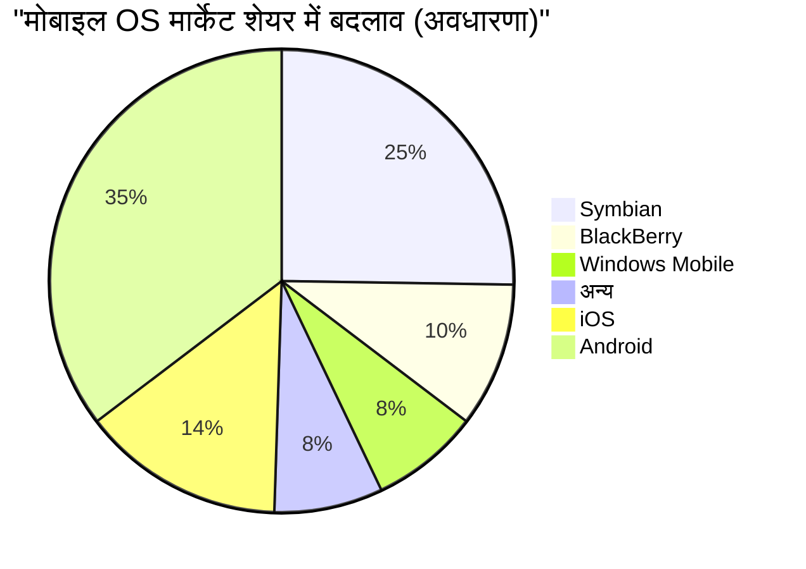

## 1. उत्पत्ति: गैरेज से शुरू हुई क्रांति (1976-1980)

1976 में, स्टीव जॉब्स, स्टीव वोज्नियाक और रोनाल्ड वेन ने कैलिफोर्निया के लॉस अल्टोस में जॉब्स के बचपन के घर के गैरेज में "Apple Computer Company" की स्थापना की।

उनका पहला उत्पाद, **Apple I**, एक असेंबली किट था जिसमें केवल मदरबोर्ड प्रदान किया गया था। यह वह क्षण था जब वोज्नियाक की शानदार हार्डवेयर इंजीनियरिंग और जॉब्स की दूरदर्शिता और मार्केटिंग कौशल एक साथ आए।


### Apple II की बड़ी सफलता
1977 में जारी, **Apple II** एक क्रांतिकारी उत्पाद था जिसने प्लास्टिक केस में कीबोर्ड को एकीकृत किया और रंगीन ग्राफिक्स प्रदर्शित कर सकता था। VisiCalc (दुनिया का पहला स्प्रेडशीट सॉफ़्टवेयर) की शुरुआत के साथ, Apple II ने व्यापार बाजार में भी प्रवेश किया और एक शानदार हिट बन गया।

## 2. मैकिन्टोश और GUI की शुरुआत (1984)

1984 में, ऐप्पल ने **Macintosh (मैकिन्टोश)** जारी किया। यह ग्राफिकल यूजर इंटरफेस (GUI) और माउस की सुविधा वाला पहला उपभोक्ता व्यक्तिगत कंप्यूटर था।


उस समय की क्रांतिकारी तकनीकों के रूप में, बिटमैप डिस्प्ले और ऑब्जेक्ट-ओरिएंटेड प्रोग्रामिंग की अवधारणाओं को पेश किया गया था।

## 3. अंधकार युग और जॉब्स की वापसी (1985-1997)

1985 में, आंतरिक संघर्षों के कारण जॉब्स को ऐप्पल से निकाल दिया गया था। इसके बाद, ऐप्पल ने मंदी के दौर में प्रवेश किया। इस बीच, जॉब्स ने NeXT और Pixar की स्थापना की और सफलता हासिल की।

1996 में, ऐप्पल अपनी अगली पीढ़ी के OS को विकसित करने में गतिरोध पर पहुंच गया और जॉब्स की कंपनी NeXT का अधिग्रहण करने का निर्णय लिया। 1997 में, जॉब्स ऐप्पल में लौट आए और अंतरिम CEO बने।

### NeXTSTEP से macOS तक का विकास
NeXT के OS, **NeXTSTEP** की तकनीक (Mach कर्नेल, Objective-C), बाद के Mac OS X (अब macOS) और iOS के लिए एक मजबूत आधार बन गई।

```objc
// Objective-C का उदाहरण (NeXTSTEP से उत्पन्न तकनीक)
#import <Foundation/Foundation.h>

@interface Greeting : NSObject
- (void)sayHello;
@end

@implementation Greeting
- (void)sayHello {
    NSLog(@"नमस्ते, अलग सोचें!");
}
@end
```

## 4. iMac, iPod, और iTunes (1998-2006)

जॉब्स ने उत्पाद लाइनअप को काफी कम कर दिया और 1998 में **iMac** की घोषणा की। इसके पारभासी (ट्रांसलूसेंट) डिज़ाइन ने दुनिया को चौंका दिया।

2001 में, उन्होंने **iPod** और **iTunes** की घोषणा की, जिसने संगीत उद्योग में क्रांति ला दी। "जेब में 1000 गाने" का कैचफ्रेज़ तकनीक और उपयोगकर्ता अनुभव के पूर्ण संलयन को दर्शाता है।

## 5. iPhone क्रांति और मोबाइल युग (2007-2011)

जनवरी 2007 में, जॉब्स ने **iPhone** की घोषणा की।
"एक iPod, एक फोन और एक इंटरनेट कम्युनिकेटर। ये तीन अलग-अलग डिवाइस नहीं हैं, बल्कि एक ही डिवाइस है।"

iPhone ने मल्टी-टच इंटरफेस अपनाया और भौतिक कीबोर्ड को हटा दिया। यह एक ऐसी घटना थी जिसने मानव संचार के इतिहास को बदल दिया।



## 6. टिम कुक का युग और सेवा कंपनी में परिवर्तन (2011-वर्तमान)

2011 में जॉब्स के निधन के बाद, टिम कुक ने CEO का पद संभाला। कुक के उत्कृष्ट आपूर्ति श्रृंखला प्रबंधन और Apple Watch और AirPods जैसे वियरेबल डिवाइस की सफलता के साथ, ऐप्पल दुनिया की पहली 1 ट्रिलियन डॉलर, 2 ट्रिलियन डॉलर और 3 ट्रिलियन डॉलर मार्केट कैप वाली कंपनी बन गई।

### Apple Silicon (M1/M2/M3) का प्रभाव
हाल के वर्षों में, इसने इंटेल चिप्स से अपने स्वयं के डिज़ाइन किए गए **Apple Silicon (ARM आर्किटेक्चर)** में संक्रमण पूरा कर लिया है। यह उच्च प्रदर्शन और अत्यधिक बिजली दक्षता दोनों प्राप्त करता है।

$$
\text{प्रति वाट प्रदर्शन} = \frac{\text{कंप्यूटेशन आउटपुट (FLOPS)}}{\text{बिजली की खपत (Watts)}}
$$

## 7. AI युग में ऐप्पल (Apple Intelligence)

2024 में, ऐप्पल ने **Apple Intelligence** की घोषणा की, जो व्यक्तिगत संदर्भ को समझने वाले ऑन-डिवाइस AI में अपनी पूर्ण प्रविष्टि को चिह्नित करता है। गोपनीयता पर जोर देते हुए, यह OS स्तर पर Siri के नाटकीय विकास और टेक्स्ट/छवि निर्माण को एकीकृत करता है।

## निष्कर्ष

ऐप्पल का इतिहास एक ऐसा इतिहास है जो हमेशा प्रौद्योगिकी और उदार कलाओं (लिबरल आर्ट्स) के चौराहे पर खड़ा रहा है। गैरेज में शुरू हुई एक छोटी सी कंपनी ने अब एक डिजिटल पारिस्थितिकी तंत्र का निर्माण किया है जो दुनिया भर के लोगों के जीवन के लिए आवश्यक है।


## अतिरिक्त विचार 1: ऐप्पल की प्रबंधन रणनीति और तकनीक का गहन विश्लेषण


### 1.1 उत्पत्ति: गैरेज से शुरू हुई क्रांति (1976-1980)

1976 में, स्टीव जॉब्स, स्टीव वोज्नियाक और रोनाल्ड वेन ने कैलिफोर्निया के लॉस अल्टोस में जॉब्स के बचपन के घर के गैरेज में "Apple Computer Company" की स्थापना की।

उनका पहला उत्पाद, **Apple I**, एक असेंबली किट था जिसमें केवल मदरबोर्ड प्रदान किया गया था। यह वह क्षण था जब वोज्नियाक की शानदार हार्डवेयर इंजीनियरिंग और जॉब्स की दूरदर्शिता और मार्केटिंग कौशल एक साथ आए।


### Apple II की बड़ी सफलता
1977 में जारी, **Apple II** एक क्रांतिकारी उत्पाद था जिसने प्लास्टिक केस में कीबोर्ड को एकीकृत किया और रंगीन ग्राफिक्स प्रदर्शित कर सकता था। VisiCalc (दुनिया का पहला स्प्रेडशीट सॉफ़्टवेयर) की शुरुआत के साथ, Apple II ने व्यापार बाजार में भी प्रवेश किया और एक शानदार हिट बन गया।

### 1.2 मैकिन्टोश और GUI की शुरुआत (1984)

1984 में, ऐप्पल ने **Macintosh (मैकिन्टोश)** जारी किया। यह ग्राफिकल यूजर इंटरफेस (GUI) और माउस की सुविधा वाला पहला उपभोक्ता व्यक्तिगत कंप्यूटर था।


उस समय की क्रांतिकारी तकनीकों के रूप में, बिटमैप डिस्प्ले और ऑब्जेक्ट-ओरिएंटेड प्रोग्रामिंग की अवधारणाओं को पेश किया गया था।

## 3. अंधकार युग और जॉब्स की वापसी (1985-1997)

1985 में, आंतरिक संघर्षों के कारण जॉब्स को ऐप्पल से निकाल दिया गया था। इसके बाद, ऐप्पल ने मंदी के दौर में प्रवेश किया। इस बीच, जॉब्स ने NeXT और Pixar की स्थापना की और सफलता हासिल की।

1996 में, ऐप्पल अपनी अगली पीढ़ी के OS को विकसित करने में गतिरोध पर पहुंच गया और जॉब्स की कंपनी NeXT का अधिग्रहण करने का निर्णय लिया। 1997 में, जॉब्स ऐप्पल में लौट आए और अंतरिम CEO बने।

### NeXTSTEP से macOS तक का विकास
NeXT के OS, **NeXTSTEP** की तकनीक (Mach कर्नेल, Objective-C), बाद के Mac OS X (अब macOS) और iOS के लिए एक मजबूत आधार बन गई।

```objc
// Objective-C का उदाहरण (NeXTSTEP से उत्पन्न तकनीक)
#import <Foundation/Foundation.h>

@interface Greeting : NSObject
- (void)sayHello;
@end

@implementation Greeting
- (void)sayHello {
    NSLog(@"नमस्ते, अलग सोचें!");
}
@end
```

## 4. iMac, iPod, और iTunes (1998-2006)

जॉब्स ने उत्पाद लाइनअप को काफी कम कर दिया और 1998 में **iMac** की घोषणा की। इसके पारभासी (ट्रांसलूसेंट) डिज़ाइन ने दुनिया को चौंका दिया।

2001 में, उन्होंने **iPod** और **iTunes** की घोषणा की, जिसने संगीत उद्योग में क्रांति ला दी। "जेब में 1000 गाने" का कैचफ्रेज़ तकनीक और उपयोगकर्ता अनुभव के पूर्ण संलयन को दर्शाता है।

## 5. iPhone क्रांति और मोबाइल युग (2007-2011)

जनवरी 2007 में, जॉब्स ने **iPhone** की घोषणा की।
"एक iPod, एक फोन और एक इंटरनेट कम्युनिकेटर। ये तीन अलग-अलग डिवाइस नहीं हैं, बल्कि एक ही डिवाइस है।"

iPhone ने मल्टी-टच इंटरफेस अपनाया और भौतिक कीबोर्ड को हटा दिया। यह एक ऐसी घटना थी जिसने मानव संचार के इतिहास को बदल दिया।


## 6. टिम कुक का युग और सेवा कंपनी में परिवर्तन (2011-वर्तमान)

2011 में जॉब्स के निधन के बाद, टिम कुक ने CEO का पद संभाला। कुक के उत्कृष्ट आपूर्ति श्रृंखला प्रबंधन और Apple Watch और AirPods जैसे वियरेबल डिवाइस की सफलता के साथ, ऐप्पल दुनिया की पहली 1 ट्रिलियन डॉलर, 2 ट्रिलियन डॉलर और 3 ट्रिलियन डॉलर मार्केट कैप वाली कंपनी बन गई।

### Apple Silicon (M1/M2/M3) का प्रभाव
हाल के वर्षों में, इसने इंटेल चिप्स से अपने स्वयं के डिज़ाइन किए गए **Apple Silicon (ARM आर्किटेक्चर)** में संक्रमण पूरा कर लिया है। यह उच्च प्रदर्शन और अत्यधिक बिजली दक्षता दोनों प्राप्त करता है।

$$
\text{प्रति वाट प्रदर्शन} = \frac{\text{कंप्यूटेशन आउटपुट (FLOPS)}}{\text{बिजली की खपत (Watts)}}
$$

## 7. AI युग में ऐप्पल (Apple Intelligence)

2024 में, ऐप्पल ने **Apple Intelligence** की घोषणा की, जो व्यक्तिगत संदर्भ को समझने वाले ऑन-डिवाइस AI में अपनी पूर्ण प्रविष्टि को चिह्नित करता है। गोपनीयता पर जोर देते हुए, यह OS स्तर पर Siri के नाटकीय विकास और टेक्स्ट/छवि निर्माण को एकीकृत करता है।

## निष्कर्ष

ऐप्पल का इतिहास एक ऐसा इतिहास है जो हमेशा प्रौद्योगिकी और उदार कलाओं (लिबरल आर्ट्स) के चौराहे पर खड़ा रहा है। गैरेज में शुरू हुई एक छोटी सी कंपनी ने अब एक डिजिटल पारिस्थितिकी तंत्र का निर्माण किया है जो दुनिया भर के लोगों के जीवन के लिए आवश्यक है।


## अतिरिक्त विचार 2: ऐप्पल की प्रबंधन रणनीति और तकनीक का गहन विश्लेषण


#### 2.21 उत्पत्ति: गैरेज से शुरू हुई क्रांति (1976-1980)

1976 में, स्टीव जॉब्स, स्टीव वोज्नियाक और रोनाल्ड वेन ने कैलिफोर्निया के लॉस अल्टोस में जॉब्स के बचपन के घर के गैरेज में "Apple Computer Company" की स्थापना की।

उनका पहला उत्पाद, **Apple I**, एक असेंबली किट था जिसमें केवल मदरबोर्ड प्रदान किया गया था। यह वह क्षण था जब वोज्नियाक की शानदार हार्डवेयर इंजीनियरिंग और जॉब्स की दूरदर्शिता और मार्केटिंग कौशल एक साथ आए।


### Apple II की बड़ी सफलता
1977 में जारी, **Apple II** एक क्रांतिकारी उत्पाद था जिसने प्लास्टिक केस में कीबोर्ड को एकीकृत किया और रंगीन ग्राफिक्स प्रदर्शित कर सकता था। VisiCalc (दुनिया का पहला स्प्रेडशीट सॉफ़्टवेयर) की शुरुआत के साथ, Apple II ने व्यापार बाजार में भी प्रवेश किया और एक शानदार हिट बन गया।

### 2.2 मैकिन्टोश और GUI की शुरुआत (1984)

1984 में, ऐप्पल ने **Macintosh (मैकिन्टोश)** जारी किया। यह ग्राफिकल यूजर इंटरफेस (GUI) और माउस की सुविधा वाला पहला उपभोक्ता व्यक्तिगत कंप्यूटर था।


उस समय की क्रांतिकारी तकनीकों के रूप में, बिटमैप डिस्प्ले और ऑब्जेक्ट-ओरिएंटेड प्रोग्रामिंग की अवधारणाओं को पेश किया गया था।

## 3. अंधकार युग और जॉब्स की वापसी (1985-1997)

1985 में, आंतरिक संघर्षों के कारण जॉब्स को ऐप्पल से निकाल दिया गया था। इसके बाद, ऐप्पल ने मंदी के दौर में प्रवेश किया। इस बीच, जॉब्स ने NeXT और Pixar की स्थापना की और सफलता हासिल की।

1996 में, ऐप्पल अपनी अगली पीढ़ी के OS को विकसित करने में गतिरोध पर पहुंच गया और जॉब्स की कंपनी NeXT का अधिग्रहण करने का निर्णय लिया। 1997 में, जॉब्स ऐप्पल में लौट आए और अंतरिम CEO बने।

### NeXTSTEP से macOS तक का विकास
NeXT के OS, **NeXTSTEP** की तकनीक (Mach कर्नेल, Objective-C), बाद के Mac OS X (अब macOS) और iOS के लिए एक मजबूत आधार बन गई।

```objc
// Objective-C का उदाहरण (NeXTSTEP से उत्पन्न तकनीक)
#import <Foundation/Foundation.h>

@interface Greeting : NSObject
- (void)sayHello;
@end

@implementation Greeting
- (void)sayHello {
    NSLog(@"नमस्ते, अलग सोचें!");
}
@end
```

## 4. iMac, iPod, और iTunes (1998-2006)

जॉब्स ने उत्पाद लाइनअप को काफी कम कर दिया और 1998 में **iMac** की घोषणा की। इसके पारभासी (ट्रांसलूसेंट) डिज़ाइन ने दुनिया को चौंका दिया।

2001 में, उन्होंने **iPod** और **iTunes** की घोषणा की, जिसने संगीत उद्योग में क्रांति ला दी। "जेब में 1000 गाने" का कैचफ्रेज़ तकनीक और उपयोगकर्ता अनुभव के पूर्ण संलयन को दर्शाता है।

## 5. iPhone क्रांति और मोबाइल युग (2007-2011)

जनवरी 2007 में, जॉब्स ने **iPhone** की घोषणा की।
"एक iPod, एक फोन और एक इंटरनेट कम्युनिकेटर। ये तीन अलग-अलग डिवाइस नहीं हैं, बल्कि एक ही डिवाइस है।"

iPhone ने मल्टी-टच इंटरफेस अपनाया और भौतिक कीबोर्ड को हटा दिया। यह एक ऐसी घटना थी जिसने मानव संचार के इतिहास को बदल दिया।


## 6. टिम कुक का युग और सेवा कंपनी में परिवर्तन (2011-वर्तमान)

2011 में जॉब्स के निधन के बाद, टिम कुक ने CEO का पद संभाला। कुक के उत्कृष्ट आपूर्ति श्रृंखला प्रबंधन और Apple Watch और AirPods जैसे वियरेबल डिवाइस की सफलता के साथ, ऐप्पल दुनिया की पहली 1 ट्रिलियन डॉलर, 2 ट्रिलियन डॉलर और 3 ट्रिलियन डॉलर मार्केट कैप वाली कंपनी बन गई।

### Apple Silicon (M1/M2/M3) का प्रभाव
हाल के वर्षों में, इसने इंटेल चिप्स से अपने स्वयं के डिज़ाइन किए गए **Apple Silicon (ARM आर्किटेक्चर)** में संक्रमण पूरा कर लिया है। यह उच्च प्रदर्शन और अत्यधिक बिजली दक्षता दोनों प्राप्त करता है।

$$
\text{प्रति वाट प्रदर्शन} = \frac{\text{कंप्यूटेशन आउटपुट (FLOPS)}}{\text{बिजली की खपत (Watts)}}
$$

## 7. AI युग में ऐप्पल (Apple Intelligence)

2024 में, ऐप्पल ने **Apple Intelligence** की घोषणा की, जो व्यक्तिगत संदर्भ को समझने वाले ऑन-डिवाइस AI में अपनी पूर्ण प्रविष्टि को चिह्नित करता है। गोपनीयता पर जोर देते हुए, यह OS स्तर पर Siri के नाटकीय विकास और टेक्स्ट/छवि निर्माण को एकीकृत करता है।

## निष्कर्ष

ऐप्पल का इतिहास एक ऐसा इतिहास है जो हमेशा प्रौद्योगिकी और उदार कलाओं (लिबरल आर्ट्स) के चौराहे पर खड़ा रहा है। गैरेज में शुरू हुई एक छोटी सी कंपनी ने अब एक डिजिटल पारिस्थितिकी तंत्र का निर्माण किया है जो दुनिया भर के लोगों के जीवन के लिए आवश्यक है।


## अतिरिक्त विचार 3: ऐप्पल की प्रबंधन रणनीति और तकनीक का गहन विश्लेषण


### 3.1 उत्पत्ति: गैरेज से शुरू हुई क्रांति (1976-1980)

1976 में, स्टीव जॉब्स, स्टीव वोज्नियाक और रोनाल्ड वेन ने कैलिफोर्निया के लॉस अल्टोस में जॉब्स के बचपन के घर के गैरेज में "Apple Computer Company" की स्थापना की।

उनका पहला उत्पाद, **Apple I**, एक असेंबली किट था जिसमें केवल मदरबोर्ड प्रदान किया गया था। यह वह क्षण था जब वोज्नियाक की शानदार हार्डवेयर इंजीनियरिंग और जॉब्स की दूरदर्शिता और मार्केटिंग कौशल एक साथ आए।


### Apple II की बड़ी सफलता
1977 में जारी, **Apple II** एक क्रांतिकारी उत्पाद था जिसने प्लास्टिक केस में कीबोर्ड को एकीकृत किया और रंगीन ग्राफिक्स प्रदर्शित कर सकता था। VisiCalc (दुनिया का पहला स्प्रेडशीट सॉफ़्टवेयर) की शुरुआत के साथ, Apple II ने व्यापार बाजार में भी प्रवेश किया और एक शानदार हिट बन गया।

### 3.2 मैकिन्टोश और GUI की शुरुआत (1984)

1984 में, ऐप्पल ने **Macintosh (मैकिन्टोश)** जारी किया। यह ग्राफिकल यूजर इंटरफेस (GUI) और माउस की सुविधा वाला पहला उपभोक्ता व्यक्तिगत कंप्यूटर था।


उस समय की क्रांतिकारी तकनीकों के रूप में, बिटमैप डिस्प्ले और ऑब्जेक्ट-ओरिएंटेड प्रोग्रामिंग की अवधारणाओं को पेश किया गया था।

## 3. अंधकार युग और जॉब्स की वापसी (1985-1997)

1985 में, आंतरिक संघर्षों के कारण जॉब्स को ऐप्पल से निकाल दिया गया था। इसके बाद, ऐप्पल ने मंदी के दौर में प्रवेश किया। इस बीच, जॉब्स ने NeXT और Pixar की स्थापना की और सफलता हासिल की।

1996 में, ऐप्पल अपनी अगली पीढ़ी के OS को विकसित करने में गतिरोध पर पहुंच गया और जॉब्स की कंपनी NeXT का अधिग्रहण करने का निर्णय लिया। 1997 में, जॉब्स ऐप्पल में लौट आए और अंतरिम CEO बने।

### NeXTSTEP से macOS तक का विकास
NeXT के OS, **NeXTSTEP** की तकनीक (Mach कर्नेल, Objective-C), बाद के Mac OS X (अब macOS) और iOS के लिए एक मजबूत आधार बन गई।

```objc
// Objective-C का उदाहरण (NeXTSTEP से उत्पन्न तकनीक)
#import <Foundation/Foundation.h>

@interface Greeting : NSObject
- (void)sayHello;
@end

@implementation Greeting
- (void)sayHello {
    NSLog(@"नमस्ते, अलग सोचें!");
}
@end
```

## 4. iMac, iPod, और iTunes (1998-2006)

जॉब्स ने उत्पाद लाइनअप को काफी कम कर दिया और 1998 में **iMac** की घोषणा की। इसके पारभासी (ट्रांसलूसेंट) डिज़ाइन ने दुनिया को चौंका दिया।

2001 में, उन्होंने **iPod** और **iTunes** की घोषणा की, जिसने संगीत उद्योग में क्रांति ला दी। "जेब में 1000 गाने" का कैचफ्रेज़ तकनीक और उपयोगकर्ता अनुभव के पूर्ण संलयन को दर्शाता है।

## 5. iPhone क्रांति और मोबाइल युग (2007-2011)

जनवरी 2007 में, जॉब्स ने **iPhone** की घोषणा की।
"एक iPod, एक फोन और एक इंटरनेट कम्युनिकेटर। ये तीन अलग-अलग डिवाइस नहीं हैं, बल्कि एक ही डिवाइस है।"

iPhone ने मल्टी-टच इंटरफेस अपनाया और भौतिक कीबोर्ड को हटा दिया। यह एक ऐसी घटना थी जिसने मानव संचार के इतिहास को बदल दिया।


## 6. टिम कुक का युग और सेवा कंपनी में परिवर्तन (2011-वर्तमान)

2011 में जॉब्स के निधन के बाद, टिम कुक ने CEO का पद संभाला। कुक के उत्कृष्ट आपूर्ति श्रृंखला प्रबंधन और Apple Watch और AirPods जैसे वियरेबल डिवाइस की सफलता के साथ, ऐप्पल दुनिया की पहली 1 ट्रिलियन डॉलर, 2 ट्रिलियन डॉलर और 3 ट्रिलियन डॉलर मार्केट कैप वाली कंपनी बन गई।

### Apple Silicon (M1/M2/M3) का प्रभाव
हाल के वर्षों में, इसने इंटेल चिप्स से अपने स्वयं के डिज़ाइन किए गए **Apple Silicon (ARM आर्किटेक्चर)** में संक्रमण पूरा कर लिया है। यह उच्च प्रदर्शन और अत्यधिक बिजली दक्षता दोनों प्राप्त करता है।

$$
\text{प्रति वाट प्रदर्शन} = \frac{\text{कंप्यूटेशन आउटपुट (FLOPS)}}{\text{बिजली की खपत (Watts)}}
$$

## 7. AI युग में ऐप्पल (Apple Intelligence)

2024 में, ऐप्पल ने **Apple Intelligence** की घोषणा की, जो व्यक्तिगत संदर्भ को समझने वाले ऑन-डिवाइस AI में अपनी पूर्ण प्रविष्टि को चिह्नित करता है। गोपनीयता पर जोर देते हुए, यह OS स्तर पर Siri के नाटकीय विकास और टेक्स्ट/छवि निर्माण को एकीकृत करता है।

## निष्कर्ष

ऐप्पल का इतिहास एक ऐसा इतिहास है जो हमेशा प्रौद्योगिकी और उदार कलाओं (लिबरल आर्ट्स) के चौराहे पर खड़ा रहा है। गैरेज में शुरू हुई एक छोटी सी कंपनी ने अब एक डिजिटल पारिस्थितिकी तंत्र का निर्माण किया है जो दुनिया भर के लोगों के जीवन के लिए आवश्यक है।


## अतिरिक्त विचार 4: ऐप्पल की प्रबंधन रणनीति और तकनीक का गहन विश्लेषण


### 4.1 उत्पत्ति: गैरेज से शुरू हुई क्रांति (1976-1980)

1976 में, स्टीव जॉब्स, स्टीव वोज्नियाक और रोनाल्ड वेन ने कैलिफोर्निया के लॉस अल्टोस में जॉब्स के बचपन के घर के गैरेज में "Apple Computer Company" की स्थापना की।

उनका पहला उत्पाद, **Apple I**, एक असेंबली किट था जिसमें केवल मदरबोर्ड प्रदान किया गया था। यह वह क्षण था जब वोज्नियाक की शानदार हार्डवेयर इंजीनियरिंग और जॉब्स की दूरदर्शिता और मार्केटिंग कौशल एक साथ आए।


### Apple II की बड़ी सफलता
1977 में जारी, **Apple II** एक क्रांतिकारी उत्पाद था जिसने प्लास्टिक केस में कीबोर्ड को एकीकृत किया और रंगीन ग्राफिक्स प्रदर्शित कर सकता था। VisiCalc (दुनिया का पहला स्प्रेडशीट सॉफ़्टवेयर) की शुरुआत के साथ, Apple II ने व्यापार बाजार में भी प्रवेश किया और एक शानदार हिट बन गया।

### 4.2 मैकिन्टोश और GUI की शुरुआत (1984)

1984 में, ऐप्पल ने **Macintosh (मैकिन्टोश)** जारी किया। यह ग्राफिकल यूजर इंटरफेस (GUI) और माउस की सुविधा वाला पहला उपभोक्ता व्यक्तिगत कंप्यूटर था।


उस समय की क्रांतिकारी तकनीकों के रूप में, बिटमैप डिस्प्ले और ऑब्जेक्ट-ओरिएंटेड प्रोग्रामिंग की अवधारणाओं को पेश किया गया था।

## 3. अंधकार युग और जॉब्स की वापसी (1985-1997)

1985 में, आंतरिक संघर्षों के कारण जॉब्स को ऐप्पल से निकाल दिया गया था। इसके बाद, ऐप्पल ने मंदी के दौर में प्रवेश किया। इस बीच, जॉब्स ने NeXT और Pixar की स्थापना की और सफलता हासिल की।

1996 में, ऐप्पल अपनी अगली पीढ़ी के OS को विकसित करने में गतिरोध पर पहुंच गया और जॉब्स की कंपनी NeXT का अधिग्रहण करने का निर्णय लिया। 1997 में, जॉब्स ऐप्पल में लौट आए और अंतरिम CEO बने।

### NeXTSTEP से macOS तक का विकास
NeXT के OS, **NeXTSTEP** की तकनीक (Mach कर्नेल, Objective-C), बाद के Mac OS X (अब macOS) और iOS के लिए एक मजबूत आधार बन गई।

```objc
// Objective-C का उदाहरण (NeXTSTEP से उत्पन्न तकनीक)
#import <Foundation/Foundation.h>

@interface Greeting : NSObject
- (void)sayHello;
@end

@implementation Greeting
- (void)sayHello {
    NSLog(@"नमस्ते, अलग सोचें!");
}
@end
```

## 4. iMac, iPod, और iTunes (1998-2006)

जॉब्स ने उत्पाद लाइनअप को काफी कम कर दिया और 1998 में **iMac** की घोषणा की। इसके पारभासी (ट्रांसलूसेंट) डिज़ाइन ने दुनिया को चौंका दिया।

2001 में, उन्होंने **iPod** और **iTunes** की घोषणा की, जिसने संगीत उद्योग में क्रांति ला दी। "जेब में 1000 गाने" का कैचफ्रेज़ तकनीक और उपयोगकर्ता अनुभव के पूर्ण संलयन को दर्शाता है।

## 5. iPhone क्रांति और मोबाइल युग (2007-2011)

जनवरी 2007 में, जॉब्स ने **iPhone** की घोषणा की।
"एक iPod, एक फोन और एक इंटरनेट कम्युनिकेटर। ये तीन अलग-अलग डिवाइस नहीं हैं, बल्कि एक ही डिवाइस है।"

iPhone ने मल्टी-टच इंटरफेस अपनाया और भौतिक कीबोर्ड को हटा दिया। यह एक ऐसी घटना थी जिसने मानव संचार के इतिहास को बदल दिया।


## 6. टिम कुक का युग और सेवा कंपनी में परिवर्तन (2011-वर्तमान)

2011 में जॉब्स के निधन के बाद, टिम कुक ने CEO का पद संभाला। कुक के उत्कृष्ट आपूर्ति श्रृंखला प्रबंधन और Apple Watch और AirPods जैसे वियरेबल डिवाइस की सफलता के साथ, ऐप्पल दुनिया की पहली 1 ट्रिलियन डॉलर, 2 ट्रिलियन डॉलर और 3 ट्रिलियन डॉलर मार्केट कैप वाली कंपनी बन गई।

### Apple Silicon (M1/M2/M3) का प्रभाव
हाल के वर्षों में, इसने इंटेल चिप्स से अपने स्वयं के डिज़ाइन किए गए **Apple Silicon (ARM आर्किटेक्चर)** में संक्रमण पूरा कर लिया है। यह उच्च प्रदर्शन और अत्यधिक बिजली दक्षता दोनों प्राप्त करता है।

$$
\text{प्रति वाट प्रदर्शन} = \frac{\text{कंप्यूटेशन आउटपुट (FLOPS)}}{\text{बिजली की खपत (Watts)}}
$$

## 7. AI युग में ऐप्पल (Apple Intelligence)

2024 में, ऐप्पल ने **Apple Intelligence** की घोषणा की, जो व्यक्तिगत संदर्भ को समझने वाले ऑन-डिवाइस AI में अपनी पूर्ण प्रविष्टि को चिह्नित करता है। गोपनीयता पर जोर देते हुए, यह OS स्तर पर Siri के नाटकीय विकास और टेक्स्ट/छवि निर्माण को एकीकृत करता है।

## निष्कर्ष

ऐप्पल का इतिहास एक ऐसा इतिहास है जो हमेशा प्रौद्योगिकी और उदार कलाओं (लिबरल आर्ट्स) के चौराहे पर खड़ा रहा है। गैरेज में शुरू हुई एक छोटी सी कंपनी ने अब एक डिजिटल पारिस्थितिकी तंत्र का निर्माण किया है जो दुनिया भर के लोगों के जीवन के लिए आवश्यक है।


## अतिरिक्त विचार 5: ऐप्पल की प्रबंधन रणनीति और तकनीक का गहन विश्लेषण


### 5.1 उत्पत्ति: गैरेज से शुरू हुई क्रांति (1976-1980)

1976 में, स्टीव जॉब्स, स्टीव वोज्नियाक और रोनाल्ड वेन ने कैलिफोर्निया के लॉस अल्टोस में जॉब्स के बचपन के घर के गैरेज में "Apple Computer Company" की स्थापना की।

उनका पहला उत्पाद, **Apple I**, एक असेंबली किट था जिसमें केवल मदरबोर्ड प्रदान किया गया था। यह वह क्षण था जब वोज्नियाक की शानदार हार्डवेयर इंजीनियरिंग और जॉब्स की दूरदर्शिता और मार्केटिंग कौशल एक साथ आए।


### Apple II की बड़ी सफलता
1977 में जारी, **Apple II** एक क्रांतिकारी उत्पाद था जिसने प्लास्टिक केस में कीबोर्ड को एकीकृत किया और रंगीन ग्राफिक्स प्रदर्शित कर सकता था। VisiCalc (दुनिया का पहला स्प्रेडशीट सॉफ़्टवेयर) की शुरुआत के साथ, Apple II ने व्यापार बाजार में भी प्रवेश किया और एक शानदार हिट बन गया।

### 5.2 मैकिन्टोश और GUI की शुरुआत (1984)

1984 में, ऐप्पल ने **Macintosh (मैकिन्टोश)** जारी किया। यह ग्राफिकल यूजर इंटरफेस (GUI) और माउस की सुविधा वाला पहला उपभोक्ता व्यक्तिगत कंप्यूटर था।


उस समय की क्रांतिकारी तकनीकों के रूप में, बिटमैप डिस्प्ले और ऑब्जेक्ट-ओरिएंटेड प्रोग्रामिंग की अवधारणाओं को पेश किया गया था।

## 3. अंधकार युग और जॉब्स की वापसी (1985-1997)

1985 में, आंतरिक संघर्षों के कारण जॉब्स को ऐप्पल से निकाल दिया गया था। इसके बाद, ऐप्पल ने मंदी के दौर में प्रवेश किया। इस बीच, जॉब्स ने NeXT और Pixar की स्थापना की और सफलता हासिल की।

1996 में, ऐप्पल अपनी अगली पीढ़ी के OS को विकसित करने में गतिरोध पर पहुंच गया और जॉब्स की कंपनी NeXT का अधिग्रहण करने का निर्णय लिया। 1997 में, जॉब्स ऐप्पल में लौट आए और अंतरिम CEO बने।

### NeXTSTEP से macOS तक का विकास
NeXT के OS, **NeXTSTEP** की तकनीक (Mach कर्नेल, Objective-C), बाद के Mac OS X (अब macOS) और iOS के लिए एक मजबूत आधार बन गई।

```objc
// Objective-C का उदाहरण (NeXTSTEP से उत्पन्न तकनीक)
#import <Foundation/Foundation.h>

@interface Greeting : NSObject
- (void)sayHello;
@end

@implementation Greeting
- (void)sayHello {
    NSLog(@"नमस्ते, अलग सोचें!");
}
@end
```

## 4. iMac, iPod, और iTunes (1998-2006)

जॉब्स ने उत्पाद लाइनअप को काफी कम कर दिया और 1998 में **iMac** की घोषणा की। इसके पारभासी (ट्रांसलूसेंट) डिज़ाइन ने दुनिया को चौंका दिया।

2001 में, उन्होंने **iPod** और **iTunes** की घोषणा की, जिसने संगीत उद्योग में क्रांति ला दी। "जेब में 1000 गाने" का कैचफ्रेज़ तकनीक और उपयोगकर्ता अनुभव के पूर्ण संलयन को दर्शाता है।

## 5. iPhone क्रांति और मोबाइल युग (2007-2011)

जनवरी 2007 में, जॉब्स ने **iPhone** की घोषणा की।
"एक iPod, एक फोन और एक इंटरनेट कम्युनिकेटर। ये तीन अलग-अलग डिवाइस नहीं हैं, बल्कि एक ही डिवाइस है।"

iPhone ने मल्टी-टच इंटरफेस अपनाया और भौतिक कीबोर्ड को हटा दिया। यह एक ऐसी घटना थी जिसने मानव संचार के इतिहास को बदल दिया।


## 6. टिम कुक का युग और सेवा कंपनी में परिवर्तन (2011-वर्तमान)

2011 में जॉब्स के निधन के बाद, टिम कुक ने CEO का पद संभाला। कुक के उत्कृष्ट आपूर्ति श्रृंखला प्रबंधन और Apple Watch और AirPods जैसे वियरेबल डिवाइस की सफलता के साथ, ऐप्पल दुनिया की पहली 1 ट्रिलियन डॉलर, 2 ट्रिलियन डॉलर और 3 ट्रिलियन डॉलर मार्केट कैप वाली कंपनी बन गई।

### Apple Silicon (M1/M2/M3) का प्रभाव
हाल के वर्षों में, इसने इंटेल चिप्स से अपने स्वयं के डिज़ाइन किए गए **Apple Silicon (ARM आर्किटेक्चर)** में संक्रमण पूरा कर लिया है। यह उच्च प्रदर्शन और अत्यधिक बिजली दक्षता दोनों प्राप्त करता है।

$$
\text{प्रति वाट प्रदर्शन} = \frac{\text{कंप्यूटेशन आउटपुट (FLOPS)}}{\text{बिजली की खपत (Watts)}}
$$

## 7. AI युग में ऐप्पल (Apple Intelligence)

2024 में, ऐप्पल ने **Apple Intelligence** की घोषणा की, जो व्यक्तिगत संदर्भ को समझने वाले ऑन-डिवाइस AI में अपनी पूर्ण प्रविष्टि को चिह्नित करता है। गोपनीयता पर जोर देते हुए, यह OS स्तर पर Siri के नाटकीय विकास और टेक्स्ट/छवि निर्माण को एकीकृत करता है।

## निष्कर्ष

ऐप्पल का इतिहास एक ऐसा इतिहास है जो हमेशा प्रौद्योगिकी और उदार कलाओं (लिबरल आर्ट्स) के चौराहे पर खड़ा रहा है। गैरेज में शुरू हुई एक छोटी सी कंपनी ने अब एक डिजिटल पारिस्थितिकी तंत्र का निर्माण किया है जो दुनिया भर के लोगों के जीवन के लिए आवश्यक है।


## अतिरिक्त विचार 6: ऐप्पल की प्रबंधन रणनीति और तकनीक का गहन विश्लेषण


### 6.1 उत्पत्ति: गैरेज से शुरू हुई क्रांति (1976-1980)

1976 में, स्टीव जॉब्स, स्टीव वोज्नियाक और रोनाल्ड वेन ने कैलिफोर्निया के लॉस अल्टोस में जॉब्स के बचपन के घर के गैरेज में "Apple Computer Company" की स्थापना की।

उनका पहला उत्पाद, **Apple I**, एक असेंबली किट था जिसमें केवल मदरबोर्ड प्रदान किया गया था। यह वह क्षण था जब वोज्नियाक की शानदार हार्डवेयर इंजीनियरिंग और जॉब्स की दूरदर्शिता और मार्केटिंग कौशल एक साथ आए।


### Apple II की बड़ी सफलता
1977 में जारी, **Apple II** एक क्रांतिकारी उत्पाद था जिसने प्लास्टिक केस में कीबोर्ड को एकीकृत किया और रंगीन ग्राफिक्स प्रदर्शित कर सकता था। VisiCalc (दुनिया का पहला स्प्रेडशीट सॉफ़्टवेयर) की शुरुआत के साथ, Apple II ने व्यापार बाजार में भी प्रवेश किया और एक शानदार हिट बन गया।

### 6.2 मैकिन्टोश और GUI की शुरुआत (1984)

1984 में, ऐप्पल ने **Macintosh (मैकिन्टोश)** जारी किया। यह ग्राफिकल यूजर इंटरफेस (GUI) और माउस की सुविधा वाला पहला उपभोक्ता व्यक्तिगत कंप्यूटर था।


उस समय की क्रांतिकारी तकनीकों के रूप में, बिटमैप डिस्प्ले और ऑब्जेक्ट-ओरिएंटेड प्रोग्रामिंग की अवधारणाओं को पेश किया गया था।

## 3. अंधकार युग और जॉब्स की वापसी (1985-1997)

1985 में, आंतरिक संघर्षों के कारण जॉब्स को ऐप्पल से निकाल दिया गया था। इसके बाद, ऐप्पल ने मंदी के दौर में प्रवेश किया। इस बीच, जॉब्स ने NeXT और Pixar की स्थापना की और सफलता हासिल की।

1996 में, ऐप्पल अपनी अगली पीढ़ी के OS को विकसित करने में गतिरोध पर पहुंच गया और जॉब्स की कंपनी NeXT का अधिग्रहण करने का निर्णय लिया। 1997 में, जॉब्स ऐप्पल में लौट आए और अंतरिम CEO बने।

### NeXTSTEP से macOS तक का विकास
NeXT के OS, **NeXTSTEP** की तकनीक (Mach कर्नेल, Objective-C), बाद के Mac OS X (अब macOS) और iOS के लिए एक मजबूत आधार बन गई।

```objc
// Objective-C का उदाहरण (NeXTSTEP से उत्पन्न तकनीक)
#import <Foundation/Foundation.h>

@interface Greeting : NSObject
- (void)sayHello;
@end

@implementation Greeting
- (void)sayHello {
    NSLog(@"नमस्ते, अलग सोचें!");
}
@end
```

## 4. iMac, iPod, और iTunes (1998-2006)

जॉब्स ने उत्पाद लाइनअप को काफी कम कर दिया और 1998 में **iMac** की घोषणा की। इसके पारभासी (ट्रांसलूसेंट) डिज़ाइन ने दुनिया को चौंका दिया।

2001 में, उन्होंने **iPod** और **iTunes** की घोषणा की, जिसने संगीत उद्योग में क्रांति ला दी। "जेब में 1000 गाने" का कैचफ्रेज़ तकनीक और उपयोगकर्ता अनुभव के पूर्ण संलयन को दर्शाता है।

## 5. iPhone क्रांति और मोबाइल युग (2007-2011)

जनवरी 2007 में, जॉब्स ने **iPhone** की घोषणा की।
"एक iPod, एक फोन और एक इंटरनेट कम्युनिकेटर। ये तीन अलग-अलग डिवाइस नहीं हैं, बल्कि एक ही डिवाइस है।"

iPhone ने मल्टी-टच इंटरफेस अपनाया और भौतिक कीबोर्ड को हटा दिया। यह एक ऐसी घटना थी जिसने मानव संचार के इतिहास को बदल दिया।

```mermaid
pie title "मोबाइल OS मार्केट शेयर में बदलाव (अवधारणा)"
    "Symbian" : 50
    "BlackBerry" : 20
    "Windows Mobile" : 15
    "अन्य" : 15
    %% ↓ iPhone/Android के बाद
    "iOS" : 28
    "Android" : 70
    "अन्य" : 2
```

## 6. टिम कुक का युग और सेवा कंपनी में परिवर्तन (2011-वर्तमान)

2011 में जॉब्स के निधन के बाद, टिम कुक ने CEO का पद संभाला। कुक के उत्कृष्ट आपूर्ति श्रृंखला प्रबंधन और Apple Watch और AirPods जैसे वियरेबल डिवाइस की सफलता के साथ, ऐप्पल दुनिया की पहली 1 ट्रिलियन डॉलर, 2 ट्रिलियन डॉलर और 3 ट्रिलियन डॉलर मार्केट कैप वाली कंपनी बन गई।

### Apple Silicon (M1/M2/M3) का प्रभाव
हाल के वर्षों में, इसने इंटेल चिप्स से अपने स्वयं के डिज़ाइन किए गए **Apple Silicon (ARM आर्किटेक्चर)** में संक्रमण पूरा कर लिया है। यह उच्च प्रदर्शन और अत्यधिक बिजली दक्षता दोनों प्राप्त करता है।

$$
\text{प्रति वाट प्रदर्शन} = \frac{\text{कंप्यूटेशन आउटपुट (FLOPS)}}{\text{बिजली की खपत (Watts)}}
$$

## 7. AI युग में ऐप्पल (Apple Intelligence)

2024 में, ऐप्पल ने **Apple Intelligence** की घोषणा की, जो व्यक्तिगत संदर्भ को समझने वाले ऑन-डिवाइस AI में अपनी पूर्ण प्रविष्टि को चिह्नित करता है। गोपनीयता पर जोर देते हुए, यह OS स्तर पर Siri के नाटकीय विकास और टेक्स्ट/छवि निर्माण को एकीकृत करता है।

## निष्कर्ष

ऐप्पल का इतिहास एक ऐसा इतिहास है जो हमेशा प्रौद्योगिकी और उदार कलाओं (लिबरल आर्ट्स) के चौराहे पर खड़ा रहा है। गैरेज में शुरू हुई एक छोटी सी कंपनी ने अब एक डिजिटल पारिस्थितिकी तंत्र का निर्माण किया है जो दुनिया भर के लोगों के जीवन के लिए आवश्यक है।


## अतिरिक्त विचार 7: ऐप्पल की प्रबंधन रणनीति और तकनीक का गहन विश्लेषण


### 7.1 उत्पत्ति: गैरेज से शुरू हुई क्रांति (1976-1980)

1976 में, स्टीव जॉब्स, स्टीव वोज्नियाक और रोनाल्ड वेन ने कैलिफोर्निया के लॉस अल्टोस में जॉब्स के बचपन के घर के गैरेज में "Apple Computer Company" की स्थापना की।

उनका पहला उत्पाद, **Apple I**, एक असेंबली किट था जिसमें केवल मदरबोर्ड प्रदान किया गया था। यह वह क्षण था जब वोज्नियाक की शानदार हार्डवेयर इंजीनियरिंग और जॉब्स की दूरदर्शिता और मार्केटिंग कौशल एक साथ आए।

```mermaid
graph TD
    subgraph "ऐप्पल के संस्थापक"
        SJ["स्टीव जॉब्स (मार्केटिंग/विज़न)"]
        SW["स्टीव वोज्नियाक (इंजीनियरिंग)"]
        RW["रोनाल्ड वेन (प्रशासन)"]
        SJ --- SW
        SJ --- RW
        SW --- RW
    end
```

### Apple II की बड़ी सफलता
1977 में जारी, **Apple II** एक क्रांतिकारी उत्पाद था जिसने प्लास्टिक केस में कीबोर्ड को एकीकृत किया और रंगीन ग्राफिक्स प्रदर्शित कर सकता था। VisiCalc (दुनिया का पहला स्प्रेडशीट सॉफ़्टवेयर) की शुरुआत के साथ, Apple II ने व्यापार बाजार में भी प्रवेश किया और एक शानदार हिट बन गया।

### 7.2 मैकिन्टोश और GUI की शुरुआत (1984)

1984 में, ऐप्पल ने **Macintosh (मैकिन्टोश)** जारी किया। यह ग्राफिकल यूजर इंटरफेस (GUI) और माउस की सुविधा वाला पहला उपभोक्ता व्यक्तिगत कंप्यूटर था।

```mermaid
flowchart LR
    Xerox["Xerox PARC (GUI कॉन्सेप्ट)"] --> Jobs["स्टीव जॉब्स का दौरा (1979)"]
    Jobs --> Lisa["Apple Lisa (1983)"]
    Lisa --> Mac["Macintosh (1984)"]
    Mac --> Modern["आधुनिक GUI OS"]
```

उस समय की क्रांतिकारी तकनीकों के रूप में, बिटमैप डिस्प्ले और ऑब्जेक्ट-ओरिएंटेड प्रोग्रामिंग की अवधारणाओं को पेश किया गया था।

## 3. अंधकार युग और जॉब्स की वापसी (1985-1997)

1985 में, आंतरिक संघर्षों के कारण जॉब्स को ऐप्पल से निकाल दिया गया था। इसके बाद, ऐप्पल ने मंदी के दौर में प्रवेश किया। इस बीच, जॉब्स ने NeXT और Pixar की स्थापना की और सफलता हासिल की।

1996 में, ऐप्पल अपनी अगली पीढ़ी के OS को विकसित करने में गतिरोध पर पहुंच गया और जॉब्स की कंपनी NeXT का अधिग्रहण करने का निर्णय लिया। 1997 में, जॉब्स ऐप्पल में लौट आए और अंतरिम CEO बने।

### NeXTSTEP से macOS तक का विकास
NeXT के OS, **NeXTSTEP** की तकनीक (Mach कर्नेल, Objective-C), बाद के Mac OS X (अब macOS) और iOS के लिए एक मजबूत आधार बन गई।

```objc
// Objective-C का उदाहरण (NeXTSTEP से उत्पन्न तकनीक)
#import <Foundation/Foundation.h>

@interface Greeting : NSObject
- (void)sayHello;
@end

@implementation Greeting
- (void)sayHello {
    NSLog(@"नमस्ते, अलग सोचें!");
}
@end
```

## 4. iMac, iPod, और iTunes (1998-2006)

जॉब्स ने उत्पाद लाइनअप को काफी कम कर दिया और 1998 में **iMac** की घोषणा की। इसके पारभासी (ट्रांसलूसेंट) डिज़ाइन ने दुनिया को चौंका दिया।

2001 में, उन्होंने **iPod** और **iTunes** की घोषणा की, जिसने संगीत उद्योग में क्रांति ला दी। "जेब में 1000 गाने" का कैचफ्रेज़ तकनीक और उपयोगकर्ता अनुभव के पूर्ण संलयन को दर्शाता है।

## 5. iPhone क्रांति और मोबाइल युग (2007-2011)

जनवरी 2007 में, जॉब्स ने **iPhone** की घोषणा की।
"एक iPod, एक फोन और एक इंटरनेट कम्युनिकेटर। ये तीन अलग-अलग डिवाइस नहीं हैं, बल्कि एक ही डिवाइस है।"

iPhone ने मल्टी-टच इंटरफेस अपनाया और भौतिक कीबोर्ड को हटा दिया। यह एक ऐसी घटना थी जिसने मानव संचार के इतिहास को बदल दिया।

```mermaid
pie title "मोबाइल OS मार्केट शेयर में बदलाव (अवधारणा)"
    "Symbian" : 50
    "BlackBerry" : 20
    "Windows Mobile" : 15
    "अन्य" : 15
    %% ↓ iPhone/Android के बाद
    "iOS" : 28
    "Android" : 70
    "अन्य" : 2
```

## 6. टिम कुक का युग और सेवा कंपनी में परिवर्तन (2011-वर्तमान)

2011 में जॉब्स के निधन के बाद, टिम कुक ने CEO का पद संभाला। कुक के उत्कृष्ट आपूर्ति श्रृंखला प्रबंधन और Apple Watch और AirPods जैसे वियरेबल डिवाइस की सफलता के साथ, ऐप्पल दुनिया की पहली 1 ट्रिलियन डॉलर, 2 ट्रिलियन डॉलर और 3 ट्रिलियन डॉलर मार्केट कैप वाली कंपनी बन गई।

### Apple Silicon (M1/M2/M3) का प्रभाव
हाल के वर्षों में, इसने इंटेल चिप्स से अपने स्वयं के डिज़ाइन किए गए **Apple Silicon (ARM आर्किटेक्चर)** में संक्रमण पूरा कर लिया है। यह उच्च प्रदर्शन और अत्यधिक बिजली दक्षता दोनों प्राप्त करता है।

$$
\text{प्रति वाट प्रदर्शन} = \frac{\text{कंप्यूटेशन आउटपुट (FLOPS)}}{\text{बिजली की खपत (Watts)}}
$$

## 7. AI युग में ऐप्पल (Apple Intelligence)

2024 में, ऐप्पल ने **Apple Intelligence** की घोषणा की, जो व्यक्तिगत संदर्भ को समझने वाले ऑन-डिवाइस AI में अपनी पूर्ण प्रविष्टि को चिह्नित करता है। गोपनीयता पर जोर देते हुए, यह OS स्तर पर Siri के नाटकीय विकास और टेक्स्ट/छवि निर्माण को एकीकृत करता है।

## निष्कर्ष

ऐप्पल का इतिहास एक ऐसा इतिहास है जो हमेशा प्रौद्योगिकी और उदार कलाओं (लिबरल आर्ट्स) के चौराहे पर खड़ा रहा है। गैरेज में शुरू हुई एक छोटी सी कंपनी ने अब एक डिजिटल पारिस्थितिकी तंत्र का निर्माण किया है जो दुनिया भर के लोगों के जीवन के लिए आवश्यक है।


## अतिरिक्त विचार 8: ऐप्पल की प्रबंधन रणनीति और तकनीक का गहन विश्लेषण


### 8.1 उत्पत्ति: गैरेज से शुरू हुई क्रांति (1976-1980)

1976 में, स्टीव जॉब्स, स्टीव वोज्नियाक और रोनाल्ड वेन ने कैलिफोर्निया के लॉस अल्टोस में जॉब्स के बचपन के घर के गैरेज में "Apple Computer Company" की स्थापना की।

उनका पहला उत्पाद, **Apple I**, एक असेंबली किट था जिसमें केवल मदरबोर्ड प्रदान किया गया था। यह वह क्षण था जब वोज्नियाक की शानदार हार्डवेयर इंजीनियरिंग और जॉब्स की दूरदर्शिता और मार्केटिंग कौशल एक साथ आए।

```mermaid
graph TD
    subgraph "ऐप्पल के संस्थापक"
        SJ["स्टीव जॉब्स (मार्केटिंग/विज़न)"]
        SW["स्टीव वोज्नियाक (इंजीनियरिंग)"]
        RW["रोनाल्ड वेन (प्रशासन)"]
        SJ --- SW
        SJ --- RW
        SW --- RW
    end
```

### Apple II की बड़ी सफलता
1977 में जारी, **Apple II** एक क्रांतिकारी उत्पाद था जिसने प्लास्टिक केस में कीबोर्ड को एकीकृत किया और रंगीन ग्राफिक्स प्रदर्शित कर सकता था। VisiCalc (दुनिया का पहला स्प्रेडशीट सॉफ़्टवेयर) की शुरुआत के साथ, Apple II ने व्यापार बाजार में भी प्रवेश किया और एक शानदार हिट बन गया।

### 8.2 मैकिन्टोश और GUI की शुरुआत (1984)

1984 में, ऐप्पल ने **Macintosh (मैकिन्टोश)** जारी किया। यह ग्राफिकल यूजर इंटरफेस (GUI) और माउस की सुविधा वाला पहला उपभोक्ता व्यक्तिगत कंप्यूटर था।

```mermaid
flowchart LR
    Xerox["Xerox PARC (GUI कॉन्सेप्ट)"] --> Jobs["स्टीव जॉब्स का दौरा (1979)"]
    Jobs --> Lisa["Apple Lisa (1983)"]
    Lisa --> Mac["Macintosh (1984)"]
    Mac --> Modern["आधुनिक GUI OS"]
```

उस समय की क्रांतिकारी तकनीकों के रूप में, बिटमैप डिस्प्ले और ऑब्जेक्ट-ओरिएंटेड प्रोग्रामिंग की अवधारणाओं को पेश किया गया था।

## 3. अंधकार युग और जॉब्स की वापसी (1985-1997)

1985 में, आंतरिक संघर्षों के कारण जॉब्स को ऐप्पल से निकाल दिया गया था। इसके बाद, ऐप्पल ने मंदी के दौर में प्रवेश किया। इस बीच, जॉब्स ने NeXT और Pixar की स्थापना की और सफलता हासिल की।

1996 में, ऐप्पल अपनी अगली पीढ़ी के OS को विकसित करने में गतिरोध पर पहुंच गया और जॉब्स की कंपनी NeXT का अधिग्रहण करने का निर्णय लिया। 1997 में, जॉब्स ऐप्पल में लौट आए और अंतरिम CEO बने।

### NeXTSTEP से macOS तक का विकास
NeXT के OS, **NeXTSTEP** की तकनीक (Mach कर्नेल, Objective-C), बाद के Mac OS X (अब macOS) और iOS के लिए एक मजबूत आधार बन गई।

```objc
// Objective-C का उदाहरण (NeXTSTEP से उत्पन्न तकनीक)
#import <Foundation/Foundation.h>

@interface Greeting : NSObject
- (void)sayHello;
@end

@implementation Greeting
- (void)sayHello {
    NSLog(@"नमस्ते, अलग सोचें!");
}
@end
```

## 4. iMac, iPod, और iTunes (1998-2006)

जॉब्स ने उत्पाद लाइनअप को काफी कम कर दिया और 1998 में **iMac** की घोषणा की। इसके पारभासी (ट्रांसलूसेंट) डिज़ाइन ने दुनिया को चौंका दिया।

2001 में, उन्होंने **iPod** और **iTunes** की घोषणा की, जिसने संगीत उद्योग में क्रांति ला दी। "जेब में 1000 गाने" का कैचफ्रेज़ तकनीक और उपयोगकर्ता अनुभव के पूर्ण संलयन को दर्शाता है।

## 5. iPhone क्रांति और मोबाइल युग (2007-2011)

जनवरी 2007 में, जॉब्स ने **iPhone** की घोषणा की।
"एक iPod, एक फोन और एक इंटरनेट कम्युनिकेटर। ये तीन अलग-अलग डिवाइस नहीं हैं, बल्कि एक ही डिवाइस है।"

iPhone ने मल्टी-टच इंटरफेस अपनाया और भौतिक कीबोर्ड को हटा दिया। यह एक ऐसी घटना थी जिसने मानव संचार के इतिहास को बदल दिया।

```mermaid
pie title "मोबाइल OS मार्केट शेयर में बदलाव (अवधारणा)"
    "Symbian" : 50
    "BlackBerry" : 20
    "Windows Mobile" : 15
    "अन्य" : 15
    %% ↓ iPhone/Android के बाद
    "iOS" : 28
    "Android" : 70
    "अन्य" : 2
```

## 6. टिम कुक का युग और सेवा कंपनी में परिवर्तन (2011-वर्तमान)

2011 में जॉब्स के निधन के बाद, टिम कुक ने CEO का पद संभाला। कुक के उत्कृष्ट आपूर्ति श्रृंखला प्रबंधन और Apple Watch और AirPods जैसे वियरेबल डिवाइस की सफलता के साथ, ऐप्पल दुनिया की पहली 1 ट्रिलियन डॉलर, 2 ट्रिलियन डॉलर और 3 ट्रिलियन डॉलर मार्केट कैप वाली कंपनी बन गई।

### Apple Silicon (M1/M2/M3) का प्रभाव
हाल के वर्षों में, इसने इंटेल चिप्स से अपने स्वयं के डिज़ाइन किए गए **Apple Silicon (ARM आर्किटेक्चर)** में संक्रमण पूरा कर लिया है। यह उच्च प्रदर्शन और अत्यधिक बिजली दक्षता दोनों प्राप्त करता है।

$$
\text{प्रति वाट प्रदर्शन} = \frac{\text{कंप्यूटेशन आउटपुट (FLOPS)}}{\text{बिजली की खपत (Watts)}}
$$

## 7. AI युग में ऐप्पल (Apple Intelligence)

2024 में, ऐप्पल ने **Apple Intelligence** की घोषणा की, जो व्यक्तिगत संदर्भ को समझने वाले ऑन-डिवाइस AI में अपनी पूर्ण प्रविष्टि को चिह्नित करता है। गोपनीयता पर जोर देते हुए, यह OS स्तर पर Siri के नाटकीय विकास और टेक्स्ट/छवि निर्माण को एकीकृत करता है।

## निष्कर्ष

ऐप्पल का इतिहास एक ऐसा इतिहास है जो हमेशा प्रौद्योगिकी और उदार कलाओं (लिबरल आर्ट्स) के चौराहे पर खड़ा रहा है। गैरेज में शुरू हुई एक छोटी सी कंपनी ने अब एक डिजिटल पारिस्थितिकी तंत्र का निर्माण किया है जो दुनिया भर के लोगों के जीवन के लिए आवश्यक है।


## अतिरिक्त विचार 9: ऐप्पल की प्रबंधन रणनीति और तकनीक का गहन विश्लेषण


### 9.1 उत्पत्ति: गैरेज से शुरू हुई क्रांति (1976-1980)

1976 में, स्टीव जॉब्स, स्टीव वोज्नियाक और रोनाल्ड वेन ने कैलिफोर्निया के लॉस अल्टोस में जॉब्स के बचपन के घर के गैरेज में "Apple Computer Company" की स्थापना की।

उनका पहला उत्पाद, **Apple I**, एक असेंबली किट था जिसमें केवल मदरबोर्ड प्रदान किया गया था। यह वह क्षण था जब वोज्नियाक की शानदार हार्डवेयर इंजीनियरिंग और जॉब्स की दूरदर्शिता और मार्केटिंग कौशल एक साथ आए।

```mermaid
graph TD
    subgraph "ऐप्पल के संस्थापक"
        SJ["स्टीव जॉब्स (मार्केटिंग/विज़न)"]
        SW["स्टीव वोज्नियाक (इंजीनियरिंग)"]
        RW["रोनाल्ड वेन (प्रशासन)"]
        SJ --- SW
        SJ --- RW
        SW --- RW
    end
```

### Apple II की बड़ी सफलता
1977 में जारी, **Apple II** एक क्रांतिकारी उत्पाद था जिसने प्लास्टिक केस में कीबोर्ड को एकीकृत किया और रंगीन ग्राफिक्स प्रदर्शित कर सकता था। VisiCalc (दुनिया का पहला स्प्रेडशीट सॉफ़्टवेयर) की शुरुआत के साथ, Apple II ने व्यापार बाजार में भी प्रवेश किया और एक शानदार हिट बन गया।

### 9.2 मैकिन्टोश और GUI की शुरुआत (1984)

1984 में, ऐप्पल ने **Macintosh (मैकिन्टोश)** जारी किया। यह ग्राफिकल यूजर इंटरफेस (GUI) और माउस की सुविधा वाला पहला उपभोक्ता व्यक्तिगत कंप्यूटर था।

```mermaid
flowchart LR
    Xerox["Xerox PARC (GUI कॉन्सेप्ट)"] --> Jobs["स्टीव जॉब्स का दौरा (1979)"]
    Jobs --> Lisa["Apple Lisa (1983)"]
    Lisa --> Mac["Macintosh (1984)"]
    Mac --> Modern["आधुनिक GUI OS"]
```

उस समय की क्रांतिकारी तकनीकों के रूप में, बिटमैप डिस्प्ले और ऑब्जेक्ट-ओरिएंटेड प्रोग्रामिंग की अवधारणाओं को पेश किया गया था।

## 3. अंधकार युग और जॉब्स की वापसी (1985-1997)

1985 में, आंतरिक संघर्षों के कारण जॉब्स को ऐप्पल से निकाल दिया गया था। इसके बाद, ऐप्पल ने मंदी के दौर में प्रवेश किया। इस बीच, जॉब्स ने NeXT और Pixar की स्थापना की और सफलता हासिल की।

1996 में, ऐप्पल अपनी अगली पीढ़ी के OS को विकसित करने में गतिरोध पर पहुंच गया और जॉब्स की कंपनी NeXT का अधिग्रहण करने का निर्णय लिया। 1997 में, जॉब्स ऐप्पल में लौट आए और अंतरिम CEO बने।

### NeXTSTEP से macOS तक का विकास
NeXT के OS, **NeXTSTEP** की तकनीक (Mach कर्नेल, Objective-C), बाद के Mac OS X (अब macOS) और iOS के लिए एक मजबूत आधार बन गई।

```objc
// Objective-C का उदाहरण (NeXTSTEP से उत्पन्न तकनीक)
#import <Foundation/Foundation.h>

@interface Greeting : NSObject
- (void)sayHello;
@end

@implementation Greeting
- (void)sayHello {
    NSLog(@"नमस्ते, अलग सोचें!");
}
@end
```

## 4. iMac, iPod, और iTunes (1998-2006)

जॉब्स ने उत्पाद लाइनअप को काफी कम कर दिया और 1998 में **iMac** की घोषणा की। इसके पारभासी (ट्रांसलूसेंट) डिज़ाइन ने दुनिया को चौंका दिया।

2001 में, उन्होंने **iPod** और **iTunes** की घोषणा की, जिसने संगीत उद्योग में क्रांति ला दी। "जेब में 1000 गाने" का कैचफ्रेज़ तकनीक और उपयोगकर्ता अनुभव के पूर्ण संलयन को दर्शाता है।

## 5. iPhone क्रांति और मोबाइल युग (2007-2011)

जनवरी 2007 में, जॉब्स ने **iPhone** की घोषणा की।
"एक iPod, एक फोन और एक इंटरनेट कम्युनिकेटर। ये तीन अलग-अलग डिवाइस नहीं हैं, बल्कि एक ही डिवाइस है।"

iPhone ने मल्टी-टच इंटरफेस अपनाया और भौतिक कीबोर्ड को हटा दिया। यह एक ऐसी घटना थी जिसने मानव संचार के इतिहास को बदल दिया।

```mermaid
pie title "मोबाइल OS मार्केट शेयर में बदलाव (अवधारणा)"
    "Symbian" : 50
    "BlackBerry" : 20
    "Windows Mobile" : 15
    "अन्य" : 15
    %% ↓ iPhone/Android के बाद
    "iOS" : 28
    "Android" : 70
    "अन्य" : 2
```

## 6. टिम कुक का युग और सेवा कंपनी में परिवर्तन (2011-वर्तमान)

2011 में जॉब्स के निधन के बाद, टिम कुक ने CEO का पद संभाला। कुक के उत्कृष्ट आपूर्ति श्रृंखला प्रबंधन और Apple Watch और AirPods जैसे वियरेबल डिवाइस की सफलता के साथ, ऐप्पल दुनिया की पहली 1 ट्रिलियन डॉलर, 2 ट्रिलियन डॉलर और 3 ट्रिलियन डॉलर मार्केट कैप वाली कंपनी बन गई।

### Apple Silicon (M1/M2/M3) का प्रभाव
हाल के वर्षों में, इसने इंटेल चिप्स से अपने स्वयं के डिज़ाइन किए गए **Apple Silicon (ARM आर्किटेक्चर)** में संक्रमण पूरा कर लिया है। यह उच्च प्रदर्शन और अत्यधिक बिजली दक्षता दोनों प्राप्त करता है।

$$
\text{प्रति वाट प्रदर्शन} = \frac{\text{कंप्यूटेशन आउटपुट (FLOPS)}}{\text{बिजली की खपत (Watts)}}
$$

## 7. AI युग में ऐप्पल (Apple Intelligence)

2024 में, ऐप्पल ने **Apple Intelligence** की घोषणा की, जो व्यक्तिगत संदर्भ को समझने वाले ऑन-डिवाइस AI में अपनी पूर्ण प्रविष्टि को चिह्नित करता है। गोपनीयता पर जोर देते हुए, यह OS स्तर पर Siri के नाटकीय विकास और टेक्स्ट/छवि निर्माण को एकीकृत करता है।

## निष्कर्ष

ऐप्पल का इतिहास एक ऐसा इतिहास है जो हमेशा प्रौद्योगिकी और उदार कलाओं (लिबरल आर्ट्स) के चौराहे पर खड़ा रहा है। गैरेज में शुरू हुई एक छोटी सी कंपनी ने अब एक डिजिटल पारिस्थितिकी तंत्र का निर्माण किया है जो दुनिया भर के लोगों के जीवन के लिए आवश्यक है।
