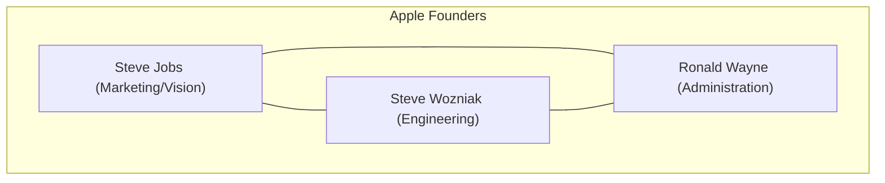
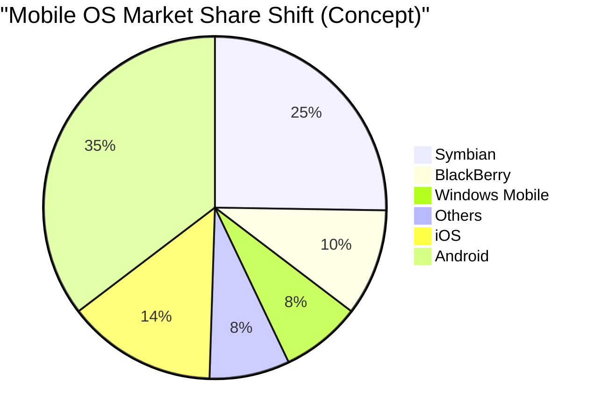

## 1. Masa Awal: Revolusi yang Dimulai dari Garasi (1976-1980)

Pada tahun 1976, Steve Jobs, Steve Wozniak, dan Ronald Wayne mendirikan "Apple Computer Company" di garasi rumah masa kecil Jobs di Los Altos, California.

Produk pertama mereka, **Apple I**, adalah kit perakitan yang hanya menyediakan motherboard. Ini adalah momen di mana kemampuan desain perangkat keras jenius Wozniak berpadu dengan visi dan keahlian pemasaran Jobs.



### Kesuksesan Besar Apple II
Diluncurkan pada tahun 1977, **Apple II** adalah produk inovatif yang mengintegrasikan keyboard ke dalam wadah plastik dan mampu menampilkan grafik berwarna. Dengan hadirnya VisiCalc (perangkat lunak spreadsheet pertama di dunia), Apple II menembus pasar bisnis dan mencatat kesuksesan yang luar biasa.

## 2. Macintosh dan Fajar GUI (1984)

Pada tahun 1984, Apple merilis **Macintosh**. Ini adalah komputer pribadi pertama untuk konsumen umum yang dilengkapi dengan GUI (Antarmuka Pengguna Grafis) dan mouse.


Sebagai teknologi terobosan pada masa itu, konsep tampilan bitmap dan pemrograman berorientasi objek diperkenalkan.

## 3. Masa Kelam dan Kembalinya Jobs (1985-1997)

Pada tahun 1985, akibat konflik internal, Jobs didepak dari Apple. Setelah itu, Apple memasuki masa kemerosotan. Di sisi lain, Jobs mendirikan perusahaan NeXT dan Pixar, serta meraih kesuksesan.

Pada tahun 1996, Apple menemui jalan buntu dalam pengembangan OS generasi berikutnya dan memutuskan untuk mengakuisisi perusahaan NeXT milik Jobs. Pada tahun 1997, Jobs kembali ke Apple dan menjabat sebagai CEO sementara.

### Evolusi dari NeXTSTEP ke macOS
Teknologi OS NeXT, **NeXTSTEP** (kernel Mach, Objective-C), menjadi fondasi kuat untuk Mac OS X (kini macOS) dan iOS di masa depan.

```objc
// Contoh Objective-C (Teknologi yang berasal dari NeXTSTEP)
#import <Foundation/Foundation.h>

@interface Greeting : NSObject
- (void)sayHello;
@end

@implementation Greeting
- (void)sayHello {
    NSLog(@"Hello, Think Different!");
}
@end
```

## 4. iMac, iPod, dan iTunes (1998-2006)

Jobs merampingkan lini produk secara drastis dan mengumumkan **iMac** pada tahun 1998. Desain translusen (semi-transparan) tersebut mengejutkan dunia.

Pada tahun 2001, ia mengumumkan **iPod** dan **iTunes**, merevolusi industri musik. Slogan "1.000 lagu di saku Anda" menunjukkan perpaduan sempurna antara teknologi dan pengalaman pengguna.

## 5. Revolusi iPhone dan Era Seluler (2007-2011)

Pada Januari 2007, Jobs mengumumkan **iPhone**.
"iPod, telepon, komunikator internet. Ini bukan tiga perangkat terpisah, melainkan satu perangkat."

iPhone mengadopsi antarmuka multi-sentuh dan menghilangkan keyboard fisik. Ini adalah peristiwa yang mengubah sejarah komunikasi umat manusia.



## 6. Era Tim Cook dan Transisi ke Perusahaan Layanan (2011-Sekarang)

Setelah meninggalnya Jobs pada tahun 2011, Tim Cook mengambil alih posisi CEO. Berkat manajemen rantai pasok Cook yang luar biasa dan kesuksesan perangkat wearable seperti Apple Watch dan AirPods, Apple tumbuh menjadi perusahaan pertama di dunia yang mencapai kapitalisasi pasar sebesar 1 triliun, 2 triliun, dan 3 triliun dolar.

### Gebrakan Apple Silicon (M1/M2/M3)
Dalam beberapa tahun terakhir, Apple telah menyelesaikan transisi dari chip Intel ke desain mandiri **Apple Silicon (arsitektur ARM)**. Apple mencapai keseimbangan antara performa tinggi dan efisiensi daya yang luar biasa.

$$
	ext{Performa per Watt} = rac{	ext{Output Komputasi (FLOPS)}}{	ext{Konsumsi Daya (Watt)}}
$$

## 7. Apple di Era AI (Apple Intelligence)

Pada tahun 2024, Apple mengumumkan **Apple Intelligence**, menandai masuknya mereka secara serius ke dalam AI pada perangkat (on-device AI) yang memahami konteks personal. Dengan tetap mengutamakan privasi, Apple mengintegrasikan evolusi dramatis Siri dan pembuatan teks/gambar pada tingkat OS.

## Kesimpulan

Sejarah Apple adalah sejarah yang terus berdiri di persimpangan antara teknologi dan seni liberal. Perusahaan kecil yang bermula dari garasi ini, kini telah membangun ekosistem digital yang tak terpisahkan dari kehidupan orang-orang di seluruh dunia.


## Analisis Tambahan 1: Mendalami Strategi Manajemen dan Teknologi Apple


### 1.1 Masa Awal: Revolusi yang Dimulai dari Garasi (1976-1980)

Pada tahun 1976, Steve Jobs, Steve Wozniak, dan Ronald Wayne mendirikan "Apple Computer Company" di garasi rumah masa kecil Jobs di Los Altos, California.

Produk pertama mereka, **Apple I**, adalah kit perakitan yang hanya menyediakan motherboard. Ini adalah momen di mana kemampuan desain perangkat keras jenius Wozniak berpadu dengan visi dan keahlian pemasaran Jobs.


### Kesuksesan Besar Apple II
Diluncurkan pada tahun 1977, **Apple II** adalah produk inovatif yang mengintegrasikan keyboard ke dalam wadah plastik dan mampu menampilkan grafik berwarna. Dengan hadirnya VisiCalc (perangkat lunak spreadsheet pertama di dunia), Apple II menembus pasar bisnis dan mencatat kesuksesan yang luar biasa.

### 1.2 Macintosh dan Fajar GUI (1984)

Pada tahun 1984, Apple merilis **Macintosh**. Ini adalah komputer pribadi pertama untuk konsumen umum yang dilengkapi dengan GUI (Antarmuka Pengguna Grafis) dan mouse.


Sebagai teknologi terobosan pada masa itu, konsep tampilan bitmap dan pemrograman berorientasi objek diperkenalkan.

## 3. Masa Kelam dan Kembalinya Jobs (1985-1997)

Pada tahun 1985, akibat konflik internal, Jobs didepak dari Apple. Setelah itu, Apple memasuki masa kemerosotan. Di sisi lain, Jobs mendirikan perusahaan NeXT dan Pixar, serta meraih kesuksesan.

Pada tahun 1996, Apple menemui jalan buntu dalam pengembangan OS generasi berikutnya dan memutuskan untuk mengakuisisi perusahaan NeXT milik Jobs. Pada tahun 1997, Jobs kembali ke Apple dan menjabat sebagai CEO sementara.

### Evolusi dari NeXTSTEP ke macOS
Teknologi OS NeXT, **NeXTSTEP** (kernel Mach, Objective-C), menjadi fondasi kuat untuk Mac OS X (kini macOS) dan iOS di masa depan.

```objc
// Contoh Objective-C (Teknologi yang berasal dari NeXTSTEP)
#import <Foundation/Foundation.h>

@interface Greeting : NSObject
- (void)sayHello;
@end

@implementation Greeting
- (void)sayHello {
    NSLog(@"Hello, Think Different!");
}
@end
```

## 4. iMac, iPod, dan iTunes (1998-2006)

Jobs merampingkan lini produk secara drastis dan mengumumkan **iMac** pada tahun 1998. Desain translusen (semi-transparan) tersebut mengejutkan dunia.

Pada tahun 2001, ia mengumumkan **iPod** dan **iTunes**, merevolusi industri musik. Slogan "1.000 lagu di saku Anda" menunjukkan perpaduan sempurna antara teknologi dan pengalaman pengguna.

## 5. Revolusi iPhone dan Era Seluler (2007-2011)

Pada Januari 2007, Jobs mengumumkan **iPhone**.
"iPod, telepon, komunikator internet. Ini bukan tiga perangkat terpisah, melainkan satu perangkat."

iPhone mengadopsi antarmuka multi-sentuh dan menghilangkan keyboard fisik. Ini adalah peristiwa yang mengubah sejarah komunikasi umat manusia.


## 6. Era Tim Cook dan Transisi ke Perusahaan Layanan (2011-Sekarang)

Setelah meninggalnya Jobs pada tahun 2011, Tim Cook mengambil alih posisi CEO. Berkat manajemen rantai pasok Cook yang luar biasa dan kesuksesan perangkat wearable seperti Apple Watch dan AirPods, Apple tumbuh menjadi perusahaan pertama di dunia yang mencapai kapitalisasi pasar sebesar 1 triliun, 2 triliun, dan 3 triliun dolar.

### Gebrakan Apple Silicon (M1/M2/M3)
Dalam beberapa tahun terakhir, Apple telah menyelesaikan transisi dari chip Intel ke desain mandiri **Apple Silicon (arsitektur ARM)**. Apple mencapai keseimbangan antara performa tinggi dan efisiensi daya yang luar biasa.

$$
	ext{Performa per Watt} = rac{	ext{Output Komputasi (FLOPS)}}{	ext{Konsumsi Daya (Watt)}}
$$

## 7. Apple di Era AI (Apple Intelligence)

Pada tahun 2024, Apple mengumumkan **Apple Intelligence**, menandai masuknya mereka secara serius ke dalam AI pada perangkat (on-device AI) yang memahami konteks personal. Dengan tetap mengutamakan privasi, Apple mengintegrasikan evolusi dramatis Siri dan pembuatan teks/gambar pada tingkat OS.

## Kesimpulan

Sejarah Apple adalah sejarah yang terus berdiri di persimpangan antara teknologi dan seni liberal. Perusahaan kecil yang bermula dari garasi ini, kini telah membangun ekosistem digital yang tak terpisahkan dari kehidupan orang-orang di seluruh dunia.


## Analisis Tambahan 2: Mendalami Strategi Manajemen dan Teknologi Apple


#### 2.21 Masa Awal: Revolusi yang Dimulai dari Garasi (1976-1980)

Pada tahun 1976, Steve Jobs, Steve Wozniak, dan Ronald Wayne mendirikan "Apple Computer Company" di garasi rumah masa kecil Jobs di Los Altos, California.

Produk pertama mereka, **Apple I**, adalah kit perakitan yang hanya menyediakan motherboard. Ini adalah momen di mana kemampuan desain perangkat keras jenius Wozniak berpadu dengan visi dan keahlian pemasaran Jobs.


### Kesuksesan Besar Apple II
Diluncurkan pada tahun 1977, **Apple II** adalah produk inovatif yang mengintegrasikan keyboard ke dalam wadah plastik dan mampu menampilkan grafik berwarna. Dengan hadirnya VisiCalc (perangkat lunak spreadsheet pertama di dunia), Apple II menembus pasar bisnis dan mencatat kesuksesan yang luar biasa.

### 2.2 Macintosh dan Fajar GUI (1984)

Pada tahun 1984, Apple merilis **Macintosh**. Ini adalah komputer pribadi pertama untuk konsumen umum yang dilengkapi dengan GUI (Antarmuka Pengguna Grafis) dan mouse.


Sebagai teknologi terobosan pada masa itu, konsep tampilan bitmap dan pemrograman berorientasi objek diperkenalkan.

## 3. Masa Kelam dan Kembalinya Jobs (1985-1997)

Pada tahun 1985, akibat konflik internal, Jobs didepak dari Apple. Setelah itu, Apple memasuki masa kemerosotan. Di sisi lain, Jobs mendirikan perusahaan NeXT dan Pixar, serta meraih kesuksesan.

Pada tahun 1996, Apple menemui jalan buntu dalam pengembangan OS generasi berikutnya dan memutuskan untuk mengakuisisi perusahaan NeXT milik Jobs. Pada tahun 1997, Jobs kembali ke Apple dan menjabat sebagai CEO sementara.

### Evolusi dari NeXTSTEP ke macOS
Teknologi OS NeXT, **NeXTSTEP** (kernel Mach, Objective-C), menjadi fondasi kuat untuk Mac OS X (kini macOS) dan iOS di masa depan.

```objc
// Contoh Objective-C (Teknologi yang berasal dari NeXTSTEP)
#import <Foundation/Foundation.h>

@interface Greeting : NSObject
- (void)sayHello;
@end

@implementation Greeting
- (void)sayHello {
    NSLog(@"Hello, Think Different!");
}
@end
```

## 4. iMac, iPod, dan iTunes (1998-2006)

Jobs merampingkan lini produk secara drastis dan mengumumkan **iMac** pada tahun 1998. Desain translusen (semi-transparan) tersebut mengejutkan dunia.

Pada tahun 2001, ia mengumumkan **iPod** dan **iTunes**, merevolusi industri musik. Slogan "1.000 lagu di saku Anda" menunjukkan perpaduan sempurna antara teknologi dan pengalaman pengguna.

## 5. Revolusi iPhone dan Era Seluler (2007-2011)

Pada Januari 2007, Jobs mengumumkan **iPhone**.
"iPod, telepon, komunikator internet. Ini bukan tiga perangkat terpisah, melainkan satu perangkat."

iPhone mengadopsi antarmuka multi-sentuh dan menghilangkan keyboard fisik. Ini adalah peristiwa yang mengubah sejarah komunikasi umat manusia.


## 6. Era Tim Cook dan Transisi ke Perusahaan Layanan (2011-Sekarang)

Setelah meninggalnya Jobs pada tahun 2011, Tim Cook mengambil alih posisi CEO. Berkat manajemen rantai pasok Cook yang luar biasa dan kesuksesan perangkat wearable seperti Apple Watch dan AirPods, Apple tumbuh menjadi perusahaan pertama di dunia yang mencapai kapitalisasi pasar sebesar 1 triliun, 2 triliun, dan 3 triliun dolar.

### Gebrakan Apple Silicon (M1/M2/M3)
Dalam beberapa tahun terakhir, Apple telah menyelesaikan transisi dari chip Intel ke desain mandiri **Apple Silicon (arsitektur ARM)**. Apple mencapai keseimbangan antara performa tinggi dan efisiensi daya yang luar biasa.

$$
	ext{Performa per Watt} = rac{	ext{Output Komputasi (FLOPS)}}{	ext{Konsumsi Daya (Watt)}}
$$

## 7. Apple di Era AI (Apple Intelligence)

Pada tahun 2024, Apple mengumumkan **Apple Intelligence**, menandai masuknya mereka secara serius ke dalam AI pada perangkat (on-device AI) yang memahami konteks personal. Dengan tetap mengutamakan privasi, Apple mengintegrasikan evolusi dramatis Siri dan pembuatan teks/gambar pada tingkat OS.

## Kesimpulan

Sejarah Apple adalah sejarah yang terus berdiri di persimpangan antara teknologi dan seni liberal. Perusahaan kecil yang bermula dari garasi ini, kini telah membangun ekosistem digital yang tak terpisahkan dari kehidupan orang-orang di seluruh dunia.


## Analisis Tambahan 3: Mendalami Strategi Manajemen dan Teknologi Apple


### 3.1 Masa Awal: Revolusi yang Dimulai dari Garasi (1976-1980)

Pada tahun 1976, Steve Jobs, Steve Wozniak, dan Ronald Wayne mendirikan "Apple Computer Company" di garasi rumah masa kecil Jobs di Los Altos, California.

Produk pertama mereka, **Apple I**, adalah kit perakitan yang hanya menyediakan motherboard. Ini adalah momen di mana kemampuan desain perangkat keras jenius Wozniak berpadu dengan visi dan keahlian pemasaran Jobs.


### Kesuksesan Besar Apple II
Diluncurkan pada tahun 1977, **Apple II** adalah produk inovatif yang mengintegrasikan keyboard ke dalam wadah plastik dan mampu menampilkan grafik berwarna. Dengan hadirnya VisiCalc (perangkat lunak spreadsheet pertama di dunia), Apple II menembus pasar bisnis dan mencatat kesuksesan yang luar biasa.

### 3.2 Macintosh dan Fajar GUI (1984)

Pada tahun 1984, Apple merilis **Macintosh**. Ini adalah komputer pribadi pertama untuk konsumen umum yang dilengkapi dengan GUI (Antarmuka Pengguna Grafis) dan mouse.


Sebagai teknologi terobosan pada masa itu, konsep tampilan bitmap dan pemrograman berorientasi objek diperkenalkan.

## 3. Masa Kelam dan Kembalinya Jobs (1985-1997)

Pada tahun 1985, akibat konflik internal, Jobs didepak dari Apple. Setelah itu, Apple memasuki masa kemerosotan. Di sisi lain, Jobs mendirikan perusahaan NeXT dan Pixar, serta meraih kesuksesan.

Pada tahun 1996, Apple menemui jalan buntu dalam pengembangan OS generasi berikutnya dan memutuskan untuk mengakuisisi perusahaan NeXT milik Jobs. Pada tahun 1997, Jobs kembali ke Apple dan menjabat sebagai CEO sementara.

### Evolusi dari NeXTSTEP ke macOS
Teknologi OS NeXT, **NeXTSTEP** (kernel Mach, Objective-C), menjadi fondasi kuat untuk Mac OS X (kini macOS) dan iOS di masa depan.

```objc
// Contoh Objective-C (Teknologi yang berasal dari NeXTSTEP)
#import <Foundation/Foundation.h>

@interface Greeting : NSObject
- (void)sayHello;
@end

@implementation Greeting
- (void)sayHello {
    NSLog(@"Hello, Think Different!");
}
@end
```

## 4. iMac, iPod, dan iTunes (1998-2006)

Jobs merampingkan lini produk secara drastis dan mengumumkan **iMac** pada tahun 1998. Desain translusen (semi-transparan) tersebut mengejutkan dunia.

Pada tahun 2001, ia mengumumkan **iPod** dan **iTunes**, merevolusi industri musik. Slogan "1.000 lagu di saku Anda" menunjukkan perpaduan sempurna antara teknologi dan pengalaman pengguna.

## 5. Revolusi iPhone dan Era Seluler (2007-2011)

Pada Januari 2007, Jobs mengumumkan **iPhone**.
"iPod, telepon, komunikator internet. Ini bukan tiga perangkat terpisah, melainkan satu perangkat."

iPhone mengadopsi antarmuka multi-sentuh dan menghilangkan keyboard fisik. Ini adalah peristiwa yang mengubah sejarah komunikasi umat manusia.


## 6. Era Tim Cook dan Transisi ke Perusahaan Layanan (2011-Sekarang)

Setelah meninggalnya Jobs pada tahun 2011, Tim Cook mengambil alih posisi CEO. Berkat manajemen rantai pasok Cook yang luar biasa dan kesuksesan perangkat wearable seperti Apple Watch dan AirPods, Apple tumbuh menjadi perusahaan pertama di dunia yang mencapai kapitalisasi pasar sebesar 1 triliun, 2 triliun, dan 3 triliun dolar.

### Gebrakan Apple Silicon (M1/M2/M3)
Dalam beberapa tahun terakhir, Apple telah menyelesaikan transisi dari chip Intel ke desain mandiri **Apple Silicon (arsitektur ARM)**. Apple mencapai keseimbangan antara performa tinggi dan efisiensi daya yang luar biasa.

$$
	ext{Performa per Watt} = rac{	ext{Output Komputasi (FLOPS)}}{	ext{Konsumsi Daya (Watt)}}
$$

## 7. Apple di Era AI (Apple Intelligence)

Pada tahun 2024, Apple mengumumkan **Apple Intelligence**, menandai masuknya mereka secara serius ke dalam AI pada perangkat (on-device AI) yang memahami konteks personal. Dengan tetap mengutamakan privasi, Apple mengintegrasikan evolusi dramatis Siri dan pembuatan teks/gambar pada tingkat OS.

## Kesimpulan

Sejarah Apple adalah sejarah yang terus berdiri di persimpangan antara teknologi dan seni liberal. Perusahaan kecil yang bermula dari garasi ini, kini telah membangun ekosistem digital yang tak terpisahkan dari kehidupan orang-orang di seluruh dunia.


## Analisis Tambahan 4: Mendalami Strategi Manajemen dan Teknologi Apple


### 4.1 Masa Awal: Revolusi yang Dimulai dari Garasi (1976-1980)

Pada tahun 1976, Steve Jobs, Steve Wozniak, dan Ronald Wayne mendirikan "Apple Computer Company" di garasi rumah masa kecil Jobs di Los Altos, California.

Produk pertama mereka, **Apple I**, adalah kit perakitan yang hanya menyediakan motherboard. Ini adalah momen di mana kemampuan desain perangkat keras jenius Wozniak berpadu dengan visi dan keahlian pemasaran Jobs.


### Kesuksesan Besar Apple II
Diluncurkan pada tahun 1977, **Apple II** adalah produk inovatif yang mengintegrasikan keyboard ke dalam wadah plastik dan mampu menampilkan grafik berwarna. Dengan hadirnya VisiCalc (perangkat lunak spreadsheet pertama di dunia), Apple II menembus pasar bisnis dan mencatat kesuksesan yang luar biasa.

### 4.2 Macintosh dan Fajar GUI (1984)

Pada tahun 1984, Apple merilis **Macintosh**. Ini adalah komputer pribadi pertama untuk konsumen umum yang dilengkapi dengan GUI (Antarmuka Pengguna Grafis) dan mouse.


Sebagai teknologi terobosan pada masa itu, konsep tampilan bitmap dan pemrograman berorientasi objek diperkenalkan.

## 3. Masa Kelam dan Kembalinya Jobs (1985-1997)

Pada tahun 1985, akibat konflik internal, Jobs didepak dari Apple. Setelah itu, Apple memasuki masa kemerosotan. Di sisi lain, Jobs mendirikan perusahaan NeXT dan Pixar, serta meraih kesuksesan.

Pada tahun 1996, Apple menemui jalan buntu dalam pengembangan OS generasi berikutnya dan memutuskan untuk mengakuisisi perusahaan NeXT milik Jobs. Pada tahun 1997, Jobs kembali ke Apple dan menjabat sebagai CEO sementara.

### Evolusi dari NeXTSTEP ke macOS
Teknologi OS NeXT, **NeXTSTEP** (kernel Mach, Objective-C), menjadi fondasi kuat untuk Mac OS X (kini macOS) dan iOS di masa depan.

```objc
// Contoh Objective-C (Teknologi yang berasal dari NeXTSTEP)
#import <Foundation/Foundation.h>

@interface Greeting : NSObject
- (void)sayHello;
@end

@implementation Greeting
- (void)sayHello {
    NSLog(@"Hello, Think Different!");
}
@end
```

## 4. iMac, iPod, dan iTunes (1998-2006)

Jobs merampingkan lini produk secara drastis dan mengumumkan **iMac** pada tahun 1998. Desain translusen (semi-transparan) tersebut mengejutkan dunia.

Pada tahun 2001, ia mengumumkan **iPod** dan **iTunes**, merevolusi industri musik. Slogan "1.000 lagu di saku Anda" menunjukkan perpaduan sempurna antara teknologi dan pengalaman pengguna.

## 5. Revolusi iPhone dan Era Seluler (2007-2011)

Pada Januari 2007, Jobs mengumumkan **iPhone**.
"iPod, telepon, komunikator internet. Ini bukan tiga perangkat terpisah, melainkan satu perangkat."

iPhone mengadopsi antarmuka multi-sentuh dan menghilangkan keyboard fisik. Ini adalah peristiwa yang mengubah sejarah komunikasi umat manusia.


## 6. Era Tim Cook dan Transisi ke Perusahaan Layanan (2011-Sekarang)

Setelah meninggalnya Jobs pada tahun 2011, Tim Cook mengambil alih posisi CEO. Berkat manajemen rantai pasok Cook yang luar biasa dan kesuksesan perangkat wearable seperti Apple Watch dan AirPods, Apple tumbuh menjadi perusahaan pertama di dunia yang mencapai kapitalisasi pasar sebesar 1 triliun, 2 triliun, dan 3 triliun dolar.

### Gebrakan Apple Silicon (M1/M2/M3)
Dalam beberapa tahun terakhir, Apple telah menyelesaikan transisi dari chip Intel ke desain mandiri **Apple Silicon (arsitektur ARM)**. Apple mencapai keseimbangan antara performa tinggi dan efisiensi daya yang luar biasa.

$$
	ext{Performa per Watt} = rac{	ext{Output Komputasi (FLOPS)}}{	ext{Konsumsi Daya (Watt)}}
$$

## 7. Apple di Era AI (Apple Intelligence)

Pada tahun 2024, Apple mengumumkan **Apple Intelligence**, menandai masuknya mereka secara serius ke dalam AI pada perangkat (on-device AI) yang memahami konteks personal. Dengan tetap mengutamakan privasi, Apple mengintegrasikan evolusi dramatis Siri dan pembuatan teks/gambar pada tingkat OS.

## Kesimpulan

Sejarah Apple adalah sejarah yang terus berdiri di persimpangan antara teknologi dan seni liberal. Perusahaan kecil yang bermula dari garasi ini, kini telah membangun ekosistem digital yang tak terpisahkan dari kehidupan orang-orang di seluruh dunia.


## Analisis Tambahan 5: Mendalami Strategi Manajemen dan Teknologi Apple


### 5.1 Masa Awal: Revolusi yang Dimulai dari Garasi (1976-1980)

Pada tahun 1976, Steve Jobs, Steve Wozniak, dan Ronald Wayne mendirikan "Apple Computer Company" di garasi rumah masa kecil Jobs di Los Altos, California.

Produk pertama mereka, **Apple I**, adalah kit perakitan yang hanya menyediakan motherboard. Ini adalah momen di mana kemampuan desain perangkat keras jenius Wozniak berpadu dengan visi dan keahlian pemasaran Jobs.


### Kesuksesan Besar Apple II
Diluncurkan pada tahun 1977, **Apple II** adalah produk inovatif yang mengintegrasikan keyboard ke dalam wadah plastik dan mampu menampilkan grafik berwarna. Dengan hadirnya VisiCalc (perangkat lunak spreadsheet pertama di dunia), Apple II menembus pasar bisnis dan mencatat kesuksesan yang luar biasa.

### 5.2 Macintosh dan Fajar GUI (1984)

Pada tahun 1984, Apple merilis **Macintosh**. Ini adalah komputer pribadi pertama untuk konsumen umum yang dilengkapi dengan GUI (Antarmuka Pengguna Grafis) dan mouse.


Sebagai teknologi terobosan pada masa itu, konsep tampilan bitmap dan pemrograman berorientasi objek diperkenalkan.

## 3. Masa Kelam dan Kembalinya Jobs (1985-1997)

Pada tahun 1985, akibat konflik internal, Jobs didepak dari Apple. Setelah itu, Apple memasuki masa kemerosotan. Di sisi lain, Jobs mendirikan perusahaan NeXT dan Pixar, serta meraih kesuksesan.

Pada tahun 1996, Apple menemui jalan buntu dalam pengembangan OS generasi berikutnya dan memutuskan untuk mengakuisisi perusahaan NeXT milik Jobs. Pada tahun 1997, Jobs kembali ke Apple dan menjabat sebagai CEO sementara.

### Evolusi dari NeXTSTEP ke macOS
Teknologi OS NeXT, **NeXTSTEP** (kernel Mach, Objective-C), menjadi fondasi kuat untuk Mac OS X (kini macOS) dan iOS di masa depan.

```objc
// Contoh Objective-C (Teknologi yang berasal dari NeXTSTEP)
#import <Foundation/Foundation.h>

@interface Greeting : NSObject
- (void)sayHello;
@end

@implementation Greeting
- (void)sayHello {
    NSLog(@"Hello, Think Different!");
}
@end
```

## 4. iMac, iPod, dan iTunes (1998-2006)

Jobs merampingkan lini produk secara drastis dan mengumumkan **iMac** pada tahun 1998. Desain translusen (semi-transparan) tersebut mengejutkan dunia.

Pada tahun 2001, ia mengumumkan **iPod** dan **iTunes**, merevolusi industri musik. Slogan "1.000 lagu di saku Anda" menunjukkan perpaduan sempurna antara teknologi dan pengalaman pengguna.

## 5. Revolusi iPhone dan Era Seluler (2007-2011)

Pada Januari 2007, Jobs mengumumkan **iPhone**.
"iPod, telepon, komunikator internet. Ini bukan tiga perangkat terpisah, melainkan satu perangkat."

iPhone mengadopsi antarmuka multi-sentuh dan menghilangkan keyboard fisik. Ini adalah peristiwa yang mengubah sejarah komunikasi umat manusia.


## 6. Era Tim Cook dan Transisi ke Perusahaan Layanan (2011-Sekarang)

Setelah meninggalnya Jobs pada tahun 2011, Tim Cook mengambil alih posisi CEO. Berkat manajemen rantai pasok Cook yang luar biasa dan kesuksesan perangkat wearable seperti Apple Watch dan AirPods, Apple tumbuh menjadi perusahaan pertama di dunia yang mencapai kapitalisasi pasar sebesar 1 triliun, 2 triliun, dan 3 triliun dolar.

### Gebrakan Apple Silicon (M1/M2/M3)
Dalam beberapa tahun terakhir, Apple telah menyelesaikan transisi dari chip Intel ke desain mandiri **Apple Silicon (arsitektur ARM)**. Apple mencapai keseimbangan antara performa tinggi dan efisiensi daya yang luar biasa.

$$
	ext{Performa per Watt} = rac{	ext{Output Komputasi (FLOPS)}}{	ext{Konsumsi Daya (Watt)}}
$$

## 7. Apple di Era AI (Apple Intelligence)

Pada tahun 2024, Apple mengumumkan **Apple Intelligence**, menandai masuknya mereka secara serius ke dalam AI pada perangkat (on-device AI) yang memahami konteks personal. Dengan tetap mengutamakan privasi, Apple mengintegrasikan evolusi dramatis Siri dan pembuatan teks/gambar pada tingkat OS.

## Kesimpulan

Sejarah Apple adalah sejarah yang terus berdiri di persimpangan antara teknologi dan seni liberal. Perusahaan kecil yang bermula dari garasi ini, kini telah membangun ekosistem digital yang tak terpisahkan dari kehidupan orang-orang di seluruh dunia.


## Analisis Tambahan 6: Mendalami Strategi Manajemen dan Teknologi Apple


### 6.1 Masa Awal: Revolusi yang Dimulai dari Garasi (1976-1980)

Pada tahun 1976, Steve Jobs, Steve Wozniak, dan Ronald Wayne mendirikan "Apple Computer Company" di garasi rumah masa kecil Jobs di Los Altos, California.

Produk pertama mereka, **Apple I**, adalah kit perakitan yang hanya menyediakan motherboard. Ini adalah momen di mana kemampuan desain perangkat keras jenius Wozniak berpadu dengan visi dan keahlian pemasaran Jobs.


### Kesuksesan Besar Apple II
Diluncurkan pada tahun 1977, **Apple II** adalah produk inovatif yang mengintegrasikan keyboard ke dalam wadah plastik dan mampu menampilkan grafik berwarna. Dengan hadirnya VisiCalc (perangkat lunak spreadsheet pertama di dunia), Apple II menembus pasar bisnis dan mencatat kesuksesan yang luar biasa.

### 6.2 Macintosh dan Fajar GUI (1984)

Pada tahun 1984, Apple merilis **Macintosh**. Ini adalah komputer pribadi pertama untuk konsumen umum yang dilengkapi dengan GUI (Antarmuka Pengguna Grafis) dan mouse.


Sebagai teknologi terobosan pada masa itu, konsep tampilan bitmap dan pemrograman berorientasi objek diperkenalkan.

## 3. Masa Kelam dan Kembalinya Jobs (1985-1997)

Pada tahun 1985, akibat konflik internal, Jobs didepak dari Apple. Setelah itu, Apple memasuki masa kemerosotan. Di sisi lain, Jobs mendirikan perusahaan NeXT dan Pixar, serta meraih kesuksesan.

Pada tahun 1996, Apple menemui jalan buntu dalam pengembangan OS generasi berikutnya dan memutuskan untuk mengakuisisi perusahaan NeXT milik Jobs. Pada tahun 1997, Jobs kembali ke Apple dan menjabat sebagai CEO sementara.

### Evolusi dari NeXTSTEP ke macOS
Teknologi OS NeXT, **NeXTSTEP** (kernel Mach, Objective-C), menjadi fondasi kuat untuk Mac OS X (kini macOS) dan iOS di masa depan.

```objc
// Contoh Objective-C (Teknologi yang berasal dari NeXTSTEP)
#import <Foundation/Foundation.h>

@interface Greeting : NSObject
- (void)sayHello;
@end

@implementation Greeting
- (void)sayHello {
    NSLog(@"Hello, Think Different!");
}
@end
```

## 4. iMac, iPod, dan iTunes (1998-2006)

Jobs merampingkan lini produk secara drastis dan mengumumkan **iMac** pada tahun 1998. Desain translusen (semi-transparan) tersebut mengejutkan dunia.

Pada tahun 2001, ia mengumumkan **iPod** dan **iTunes**, merevolusi industri musik. Slogan "1.000 lagu di saku Anda" menunjukkan perpaduan sempurna antara teknologi dan pengalaman pengguna.

## 5. Revolusi iPhone dan Era Seluler (2007-2011)

Pada Januari 2007, Jobs mengumumkan **iPhone**.
"iPod, telepon, komunikator internet. Ini bukan tiga perangkat terpisah, melainkan satu perangkat."

iPhone mengadopsi antarmuka multi-sentuh dan menghilangkan keyboard fisik. Ini adalah peristiwa yang mengubah sejarah komunikasi umat manusia.

```mermaid
pie title "Mobile OS Market Share Shift (Concept)"
    "Symbian" : 50
    "BlackBerry" : 20
    "Windows Mobile" : 15
    "Others" : 15
    %% ↓ Setelah iPhone/Android
    "iOS" : 28
    "Android" : 70
    "Others" : 2
```

## 6. Era Tim Cook dan Transisi ke Perusahaan Layanan (2011-Sekarang)

Setelah meninggalnya Jobs pada tahun 2011, Tim Cook mengambil alih posisi CEO. Berkat manajemen rantai pasok Cook yang luar biasa dan kesuksesan perangkat wearable seperti Apple Watch dan AirPods, Apple tumbuh menjadi perusahaan pertama di dunia yang mencapai kapitalisasi pasar sebesar 1 triliun, 2 triliun, dan 3 triliun dolar.

### Gebrakan Apple Silicon (M1/M2/M3)
Dalam beberapa tahun terakhir, Apple telah menyelesaikan transisi dari chip Intel ke desain mandiri **Apple Silicon (arsitektur ARM)**. Apple mencapai keseimbangan antara performa tinggi dan efisiensi daya yang luar biasa.

$$
	ext{Performa per Watt} = rac{	ext{Output Komputasi (FLOPS)}}{	ext{Konsumsi Daya (Watt)}}
$$

## 7. Apple di Era AI (Apple Intelligence)

Pada tahun 2024, Apple mengumumkan **Apple Intelligence**, menandai masuknya mereka secara serius ke dalam AI pada perangkat (on-device AI) yang memahami konteks personal. Dengan tetap mengutamakan privasi, Apple mengintegrasikan evolusi dramatis Siri dan pembuatan teks/gambar pada tingkat OS.

## Kesimpulan

Sejarah Apple adalah sejarah yang terus berdiri di persimpangan antara teknologi dan seni liberal. Perusahaan kecil yang bermula dari garasi ini, kini telah membangun ekosistem digital yang tak terpisahkan dari kehidupan orang-orang di seluruh dunia.


## Analisis Tambahan 7: Mendalami Strategi Manajemen dan Teknologi Apple


### 7.1 Masa Awal: Revolusi yang Dimulai dari Garasi (1976-1980)

Pada tahun 1976, Steve Jobs, Steve Wozniak, dan Ronald Wayne mendirikan "Apple Computer Company" di garasi rumah masa kecil Jobs di Los Altos, California.

Produk pertama mereka, **Apple I**, adalah kit perakitan yang hanya menyediakan motherboard. Ini adalah momen di mana kemampuan desain perangkat keras jenius Wozniak berpadu dengan visi dan keahlian pemasaran Jobs.

```mermaid
graph TD
    subgraph "Apple Founders"
        SJ["Steve Jobs (Marketing/Vision)"]
        SW["Steve Wozniak (Engineering)"]
        RW["Ronald Wayne (Administration)"]
        SJ --- SW
        SJ --- RW
        SW --- RW
    end
```

### Kesuksesan Besar Apple II
Diluncurkan pada tahun 1977, **Apple II** adalah produk inovatif yang mengintegrasikan keyboard ke dalam wadah plastik dan mampu menampilkan grafik berwarna. Dengan hadirnya VisiCalc (perangkat lunak spreadsheet pertama di dunia), Apple II menembus pasar bisnis dan mencatat kesuksesan yang luar biasa.

### 7.2 Macintosh dan Fajar GUI (1984)

Pada tahun 1984, Apple merilis **Macintosh**. Ini adalah komputer pribadi pertama untuk konsumen umum yang dilengkapi dengan GUI (Antarmuka Pengguna Grafis) dan mouse.

```mermaid
flowchart LR
    Xerox["Xerox PARC (GUI Concept)"] --> Jobs["Steve Jobs Visit (1979)"]
    Jobs --> Lisa["Apple Lisa (1983)"]
    Lisa --> Mac["Macintosh (1984)"]
    Mac --> Modern["Modern GUI OS"]
```

Sebagai teknologi terobosan pada masa itu, konsep tampilan bitmap dan pemrograman berorientasi objek diperkenalkan.

## 3. Masa Kelam dan Kembalinya Jobs (1985-1997)

Pada tahun 1985, akibat konflik internal, Jobs didepak dari Apple. Setelah itu, Apple memasuki masa kemerosotan. Di sisi lain, Jobs mendirikan perusahaan NeXT dan Pixar, serta meraih kesuksesan.

Pada tahun 1996, Apple menemui jalan buntu dalam pengembangan OS generasi berikutnya dan memutuskan untuk mengakuisisi perusahaan NeXT milik Jobs. Pada tahun 1997, Jobs kembali ke Apple dan menjabat sebagai CEO sementara.

### Evolusi dari NeXTSTEP ke macOS
Teknologi OS NeXT, **NeXTSTEP** (kernel Mach, Objective-C), menjadi fondasi kuat untuk Mac OS X (kini macOS) dan iOS di masa depan.

```objc
// Contoh Objective-C (Teknologi yang berasal dari NeXTSTEP)
#import <Foundation/Foundation.h>

@interface Greeting : NSObject
- (void)sayHello;
@end

@implementation Greeting
- (void)sayHello {
    NSLog(@"Hello, Think Different!");
}
@end
```

## 4. iMac, iPod, dan iTunes (1998-2006)

Jobs merampingkan lini produk secara drastis dan mengumumkan **iMac** pada tahun 1998. Desain translusen (semi-transparan) tersebut mengejutkan dunia.

Pada tahun 2001, ia mengumumkan **iPod** dan **iTunes**, merevolusi industri musik. Slogan "1.000 lagu di saku Anda" menunjukkan perpaduan sempurna antara teknologi dan pengalaman pengguna.

## 5. Revolusi iPhone dan Era Seluler (2007-2011)

Pada Januari 2007, Jobs mengumumkan **iPhone**.
"iPod, telepon, komunikator internet. Ini bukan tiga perangkat terpisah, melainkan satu perangkat."

iPhone mengadopsi antarmuka multi-sentuh dan menghilangkan keyboard fisik. Ini adalah peristiwa yang mengubah sejarah komunikasi umat manusia.

```mermaid
pie title "Mobile OS Market Share Shift (Concept)"
    "Symbian" : 50
    "BlackBerry" : 20
    "Windows Mobile" : 15
    "Others" : 15
    %% ↓ Setelah iPhone/Android
    "iOS" : 28
    "Android" : 70
    "Others" : 2
```

## 6. Era Tim Cook dan Transisi ke Perusahaan Layanan (2011-Sekarang)

Setelah meninggalnya Jobs pada tahun 2011, Tim Cook mengambil alih posisi CEO. Berkat manajemen rantai pasok Cook yang luar biasa dan kesuksesan perangkat wearable seperti Apple Watch dan AirPods, Apple tumbuh menjadi perusahaan pertama di dunia yang mencapai kapitalisasi pasar sebesar 1 triliun, 2 triliun, dan 3 triliun dolar.

### Gebrakan Apple Silicon (M1/M2/M3)
Dalam beberapa tahun terakhir, Apple telah menyelesaikan transisi dari chip Intel ke desain mandiri **Apple Silicon (arsitektur ARM)**. Apple mencapai keseimbangan antara performa tinggi dan efisiensi daya yang luar biasa.

$$
	ext{Performa per Watt} = rac{	ext{Output Komputasi (FLOPS)}}{	ext{Konsumsi Daya (Watt)}}
$$

## 7. Apple di Era AI (Apple Intelligence)

Pada tahun 2024, Apple mengumumkan **Apple Intelligence**, menandai masuknya mereka secara serius ke dalam AI pada perangkat (on-device AI) yang memahami konteks personal. Dengan tetap mengutamakan privasi, Apple mengintegrasikan evolusi dramatis Siri dan pembuatan teks/gambar pada tingkat OS.

## Kesimpulan

Sejarah Apple adalah sejarah yang terus berdiri di persimpangan antara teknologi dan seni liberal. Perusahaan kecil yang bermula dari garasi ini, kini telah membangun ekosistem digital yang tak terpisahkan dari kehidupan orang-orang di seluruh dunia.


## Analisis Tambahan 8: Mendalami Strategi Manajemen dan Teknologi Apple


### 8.1 Masa Awal: Revolusi yang Dimulai dari Garasi (1976-1980)

Pada tahun 1976, Steve Jobs, Steve Wozniak, dan Ronald Wayne mendirikan "Apple Computer Company" di garasi rumah masa kecil Jobs di Los Altos, California.

Produk pertama mereka, **Apple I**, adalah kit perakitan yang hanya menyediakan motherboard. Ini adalah momen di mana kemampuan desain perangkat keras jenius Wozniak berpadu dengan visi dan keahlian pemasaran Jobs.

```mermaid
graph TD
    subgraph "Apple Founders"
        SJ["Steve Jobs (Marketing/Vision)"]
        SW["Steve Wozniak (Engineering)"]
        RW["Ronald Wayne (Administration)"]
        SJ --- SW
        SJ --- RW
        SW --- RW
    end
```

### Kesuksesan Besar Apple II
Diluncurkan pada tahun 1977, **Apple II** adalah produk inovatif yang mengintegrasikan keyboard ke dalam wadah plastik dan mampu menampilkan grafik berwarna. Dengan hadirnya VisiCalc (perangkat lunak spreadsheet pertama di dunia), Apple II menembus pasar bisnis dan mencatat kesuksesan yang luar biasa.

### 8.2 Macintosh dan Fajar GUI (1984)

Pada tahun 1984, Apple merilis **Macintosh**. Ini adalah komputer pribadi pertama untuk konsumen umum yang dilengkapi dengan GUI (Antarmuka Pengguna Grafis) dan mouse.

```mermaid
flowchart LR
    Xerox["Xerox PARC (GUI Concept)"] --> Jobs["Steve Jobs Visit (1979)"]
    Jobs --> Lisa["Apple Lisa (1983)"]
    Lisa --> Mac["Macintosh (1984)"]
    Mac --> Modern["Modern GUI OS"]
```

Sebagai teknologi terobosan pada masa itu, konsep tampilan bitmap dan pemrograman berorientasi objek diperkenalkan.

## 3. Masa Kelam dan Kembalinya Jobs (1985-1997)

Pada tahun 1985, akibat konflik internal, Jobs didepak dari Apple. Setelah itu, Apple memasuki masa kemerosotan. Di sisi lain, Jobs mendirikan perusahaan NeXT dan Pixar, serta meraih kesuksesan.

Pada tahun 1996, Apple menemui jalan buntu dalam pengembangan OS generasi berikutnya dan memutuskan untuk mengakuisisi perusahaan NeXT milik Jobs. Pada tahun 1997, Jobs kembali ke Apple dan menjabat sebagai CEO sementara.

### Evolusi dari NeXTSTEP ke macOS
Teknologi OS NeXT, **NeXTSTEP** (kernel Mach, Objective-C), menjadi fondasi kuat untuk Mac OS X (kini macOS) dan iOS di masa depan.

```objc
// Contoh Objective-C (Teknologi yang berasal dari NeXTSTEP)
#import <Foundation/Foundation.h>

@interface Greeting : NSObject
- (void)sayHello;
@end

@implementation Greeting
- (void)sayHello {
    NSLog(@"Hello, Think Different!");
}
@end
```

## 4. iMac, iPod, dan iTunes (1998-2006)

Jobs merampingkan lini produk secara drastis dan mengumumkan **iMac** pada tahun 1998. Desain translusen (semi-transparan) tersebut mengejutkan dunia.

Pada tahun 2001, ia mengumumkan **iPod** dan **iTunes**, merevolusi industri musik. Slogan "1.000 lagu di saku Anda" menunjukkan perpaduan sempurna antara teknologi dan pengalaman pengguna.

## 5. Revolusi iPhone dan Era Seluler (2007-2011)

Pada Januari 2007, Jobs mengumumkan **iPhone**.
"iPod, telepon, komunikator internet. Ini bukan tiga perangkat terpisah, melainkan satu perangkat."

iPhone mengadopsi antarmuka multi-sentuh dan menghilangkan keyboard fisik. Ini adalah peristiwa yang mengubah sejarah komunikasi umat manusia.

```mermaid
pie title "Mobile OS Market Share Shift (Concept)"
    "Symbian" : 50
    "BlackBerry" : 20
    "Windows Mobile" : 15
    "Others" : 15
    %% ↓ Setelah iPhone/Android
    "iOS" : 28
    "Android" : 70
    "Others" : 2
```

## 6. Era Tim Cook dan Transisi ke Perusahaan Layanan (2011-Sekarang)

Setelah meninggalnya Jobs pada tahun 2011, Tim Cook mengambil alih posisi CEO. Berkat manajemen rantai pasok Cook yang luar biasa dan kesuksesan perangkat wearable seperti Apple Watch dan AirPods, Apple tumbuh menjadi perusahaan pertama di dunia yang mencapai kapitalisasi pasar sebesar 1 triliun, 2 triliun, dan 3 triliun dolar.

### Gebrakan Apple Silicon (M1/M2/M3)
Dalam beberapa tahun terakhir, Apple telah menyelesaikan transisi dari chip Intel ke desain mandiri **Apple Silicon (arsitektur ARM)**. Apple mencapai keseimbangan antara performa tinggi dan efisiensi daya yang luar biasa.

$$
	ext{Performa per Watt} = rac{	ext{Output Komputasi (FLOPS)}}{	ext{Konsumsi Daya (Watt)}}
$$

## 7. Apple di Era AI (Apple Intelligence)

Pada tahun 2024, Apple mengumumkan **Apple Intelligence**, menandai masuknya mereka secara serius ke dalam AI pada perangkat (on-device AI) yang memahami konteks personal. Dengan tetap mengutamakan privasi, Apple mengintegrasikan evolusi dramatis Siri dan pembuatan teks/gambar pada tingkat OS.

## Kesimpulan

Sejarah Apple adalah sejarah yang terus berdiri di persimpangan antara teknologi dan seni liberal. Perusahaan kecil yang bermula dari garasi ini, kini telah membangun ekosistem digital yang tak terpisahkan dari kehidupan orang-orang di seluruh dunia.


## Analisis Tambahan 9: Mendalami Strategi Manajemen dan Teknologi Apple


### 9.1 Masa Awal: Revolusi yang Dimulai dari Garasi (1976-1980)

Pada tahun 1976, Steve Jobs, Steve Wozniak, dan Ronald Wayne mendirikan "Apple Computer Company" di garasi rumah masa kecil Jobs di Los Altos, California.

Produk pertama mereka, **Apple I**, adalah kit perakitan yang hanya menyediakan motherboard. Ini adalah momen di mana kemampuan desain perangkat keras jenius Wozniak berpadu dengan visi dan keahlian pemasaran Jobs.

```mermaid
graph TD
    subgraph "Apple Founders"
        SJ["Steve Jobs (Marketing/Vision)"]
        SW["Steve Wozniak (Engineering)"]
        RW["Ronald Wayne (Administration)"]
        SJ --- SW
        SJ --- RW
        SW --- RW
    end
```

### Kesuksesan Besar Apple II
Diluncurkan pada tahun 1977, **Apple II** adalah produk inovatif yang mengintegrasikan keyboard ke dalam wadah plastik dan mampu menampilkan grafik berwarna. Dengan hadirnya VisiCalc (perangkat lunak spreadsheet pertama di dunia), Apple II menembus pasar bisnis dan mencatat kesuksesan yang luar biasa.

### 9.2 Macintosh dan Fajar GUI (1984)

Pada tahun 1984, Apple merilis **Macintosh**. Ini adalah komputer pribadi pertama untuk konsumen umum yang dilengkapi dengan GUI (Antarmuka Pengguna Grafis) dan mouse.

```mermaid
flowchart LR
    Xerox["Xerox PARC (GUI Concept)"] --> Jobs["Steve Jobs Visit (1979)"]
    Jobs --> Lisa["Apple Lisa (1983)"]
    Lisa --> Mac["Macintosh (1984)"]
    Mac --> Modern["Modern GUI OS"]
```

Sebagai teknologi terobosan pada masa itu, konsep tampilan bitmap dan pemrograman berorientasi objek diperkenalkan.

## 3. Masa Kelam dan Kembalinya Jobs (1985-1997)

Pada tahun 1985, akibat konflik internal, Jobs didepak dari Apple. Setelah itu, Apple memasuki masa kemerosotan. Di sisi lain, Jobs mendirikan perusahaan NeXT dan Pixar, serta meraih kesuksesan.

Pada tahun 1996, Apple menemui jalan buntu dalam pengembangan OS generasi berikutnya dan memutuskan untuk mengakuisisi perusahaan NeXT milik Jobs. Pada tahun 1997, Jobs kembali ke Apple dan menjabat sebagai CEO sementara.

### Evolusi dari NeXTSTEP ke macOS
Teknologi OS NeXT, **NeXTSTEP** (kernel Mach, Objective-C), menjadi fondasi kuat untuk Mac OS X (kini macOS) dan iOS di masa depan.

```objc
// Contoh Objective-C (Teknologi yang berasal dari NeXTSTEP)
#import <Foundation/Foundation.h>

@interface Greeting : NSObject
- (void)sayHello;
@end

@implementation Greeting
- (void)sayHello {
    NSLog(@"Hello, Think Different!");
}
@end
```

## 4. iMac, iPod, dan iTunes (1998-2006)

Jobs merampingkan lini produk secara drastis dan mengumumkan **iMac** pada tahun 1998. Desain translusen (semi-transparan) tersebut mengejutkan dunia.

Pada tahun 2001, ia mengumumkan **iPod** dan **iTunes**, merevolusi industri musik. Slogan "1.000 lagu di saku Anda" menunjukkan perpaduan sempurna antara teknologi dan pengalaman pengguna.

## 5. Revolusi iPhone dan Era Seluler (2007-2011)

Pada Januari 2007, Jobs mengumumkan **iPhone**.
"iPod, telepon, komunikator internet. Ini bukan tiga perangkat terpisah, melainkan satu perangkat."

iPhone mengadopsi antarmuka multi-sentuh dan menghilangkan keyboard fisik. Ini adalah peristiwa yang mengubah sejarah komunikasi umat manusia.

```mermaid
pie title "Mobile OS Market Share Shift (Concept)"
    "Symbian" : 50
    "BlackBerry" : 20
    "Windows Mobile" : 15
    "Others" : 15
    %% ↓ Setelah iPhone/Android
    "iOS" : 28
    "Android" : 70
    "Others" : 2
```

## 6. Era Tim Cook dan Transisi ke Perusahaan Layanan (2011-Sekarang)

Setelah meninggalnya Jobs pada tahun 2011, Tim Cook mengambil alih posisi CEO. Berkat manajemen rantai pasok Cook yang luar biasa dan kesuksesan perangkat wearable seperti Apple Watch dan AirPods, Apple tumbuh menjadi perusahaan pertama di dunia yang mencapai kapitalisasi pasar sebesar 1 triliun, 2 triliun, dan 3 triliun dolar.

### Gebrakan Apple Silicon (M1/M2/M3)
Dalam beberapa tahun terakhir, Apple telah menyelesaikan transisi dari chip Intel ke desain mandiri **Apple Silicon (arsitektur ARM)**. Apple mencapai keseimbangan antara performa tinggi dan efisiensi daya yang luar biasa.

$$
	ext{Performa per Watt} = rac{	ext{Output Komputasi (FLOPS)}}{	ext{Konsumsi Daya (Watt)}}
$$

## 7. Apple di Era AI (Apple Intelligence)

Pada tahun 2024, Apple mengumumkan **Apple Intelligence**, menandai masuknya mereka secara serius ke dalam AI pada perangkat (on-device AI) yang memahami konteks personal. Dengan tetap mengutamakan privasi, Apple mengintegrasikan evolusi dramatis Siri dan pembuatan teks/gambar pada tingkat OS.

## Kesimpulan

Sejarah Apple adalah sejarah yang terus berdiri di persimpangan antara teknologi dan seni liberal. Perusahaan kecil yang bermula dari garasi ini, kini telah membangun ekosistem digital yang tak terpisahkan dari kehidupan orang-orang di seluruh dunia.
