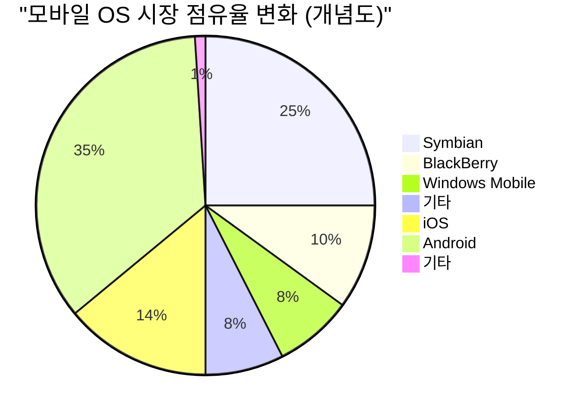

## 1. 창세기: 차고에서 시작된 혁명 (1976-1980)

1976년, 스티브 잡스, 스티브 워즈니악, 로널드 웨인 3명은 캘리포니아주 로스알토스에 있는 잡스의 본가 차고에서 'Apple Computer Company'를 설립했습니다.

최초의 제품인 **Apple I** 은 마더보드만 제공되는 조립 키트였습니다. 워즈니악의 천재적인 하드웨어 설계 능력과 잡스의 선견지명 및 마케팅 능력이 융합된 순간입니다.


### Apple II의 대성공
1977년에 출시된 **Apple II** 는 플라스틱 케이스에 키보드를 통합하고, 컬러 그래픽을 표시할 수 있는 획기적인 제품이었습니다. VisiCalc(세계 최초의 스프레드시트 소프트웨어)의 등장으로, Apple II 는 비즈니스 시장에도 침투하며 폭발적인 대히트를 기록합니다.

## 2. 매킨토시와 GUI의 여명 (1984)

1984년, Apple은 **Macintosh(매킨토시)** 를 출시합니다. 이는 GUI(그래픽 사용자 인터페이스)와 마우스를 갖춘 최초의 일반인용 PC였습니다.


당시의 획기적인 기술로서, 비트맵 디스플레이와 객체 지향 프로그래밍의 개념이 도입되었습니다.

## 3. 암흑시대와 잡스의 복귀 (1985-1997)

1985년, 사내 대립으로 인해 잡스는 Apple에서 추방됩니다. 그 후, Apple은 침체기에 빠집니다. 한편 잡스는 NeXT사와 Pixar사를 설립하여 성공을 거둡니다.

1996년, Apple은 차세대 OS 개발에 난항을 겪다 잡스의 NeXT사를 인수하기로 결정합니다. 1997년에 잡스는 Apple에 복귀하여 잠정 CEO에 취임합니다.

### NeXTSTEP에서 macOS로의 진화
NeXT사의 OS인 **NeXTSTEP** 의 기술(Mach 커널, Objective-C)은 향후 Mac OS X(현재의 macOS) 및 iOS의 견고한 기반이 되었습니다.

```objc
// Objective-C의 예 (NeXTSTEP 유래의 기술)
#import <Foundation/Foundation.h>

@interface Greeting : NSObject
- (void)sayHello;
@end

@implementation Greeting
- (void)sayHello {
    NSLog(@"Hello, Think Different!");
}
@end
```

## 4. iMac, iPod, 그리고 iTunes (1998-2006)

잡스는 제품 라인업을 극적으로 압축하여, 1998년에 **iMac** 을 발표했습니다. 트랜스루센트(반투명) 디자인은 전 세계에 충격을 주었습니다.

2001년에는 **iPod** 과 **iTunes** 를 발표하여, 음악 산업에 혁명을 일으킵니다. "주머니 속에 1000곡을"이라는 캐치프레이즈는 기술과 사용자 경험의 완벽한 융합을 보여주었습니다.

## 5. iPhone 혁명과 모바일 시대 (2007-2011)

2007년 1월, 잡스는 **iPhone** 을 발표했습니다.
"iPod, 전화, 인터넷 커뮤니케이터. 이것들은 3개의 독립된 기기가 아니라, 1개의 기기다."

iPhone은 멀티 터치 인터페이스를 채택하고, 물리 키보드를 배제했습니다. 이는 인류 커뮤니케이션의 역사를 바꾼 사건이었습니다.



## 6. 팀 쿡 시대와 서비스 기업으로의 전환 (2011-현재)

2011년 잡스 서거 후, 팀 쿡이 CEO를 이어받았습니다. 쿡의 탁월한 공급망 관리와 Apple Watch, AirPods 등 웨어러블 기기의 성공으로, Apple은 세계 최초로 시가총액 1조 달러, 2조 달러, 3조 달러 기업으로 성장했습니다.

### Apple Silicon (M1/M2/M3) 의 충격
최근에는 Intel 칩에서 자체 설계한 **Apple Silicon (ARM 아키텍처)** 으로의 전환을 완료했습니다. 높은 성능과 압도적인 전력 효율을 양립시키고 있습니다.


\text{와트당 성능} = \frac{\text{연산 출력 (FLOPS)}}{\text{전력 소비량 (Watts)}}


## 7. AI 시대의 Apple (Apple Intelligence)

2024년, Apple은 **Apple Intelligence** 를 발표하며 개인 문맥을 이해하는 온디바이스 AI에 본격 진출했습니다. 개인 정보 보호를 중시하면서, Siri의 극적인 진화와 문장 생성 및 이미지 생성을 OS 수준에서 통합하고 있습니다.

## 요약

Apple의 역사는 기술과 인문학의 교차점에 계속 서 있던 역사입니다. 차고에서 시작된 작은 회사는 이제 전 세계 사람들의 삶에 없어서는 안 될 디지털 생태계를 구축하고 있습니다.


## 추가 고찰 1: Apple의 경영 전략과 기술 심층 탐구


## 추가 고찰 2: Apple의 경영 전략과 기술 심층 탐구


## 추가 고찰 3: Apple의 경영 전략과 기술 심층 탐구


## 추가 고찰 4: Apple의 경영 전략과 기술 심층 탐구


## 추가 고찰 5: Apple의 경영 전략과 기술 심층 탐구


## 추가 고찰 6: Apple의 경영 전략과 기술 심층 탐구


## 추가 고찰 7: Apple의 경영 전략과 기술 심층 탐구


## 추가 고찰 8: Apple의 경영 전략과 기술 심층 탐구


## 추가 고찰 9: Apple의 경영 전략과 기술 심층 탐구


