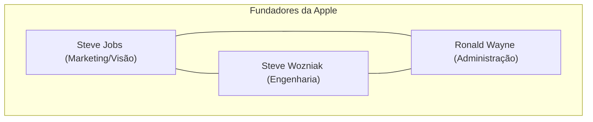
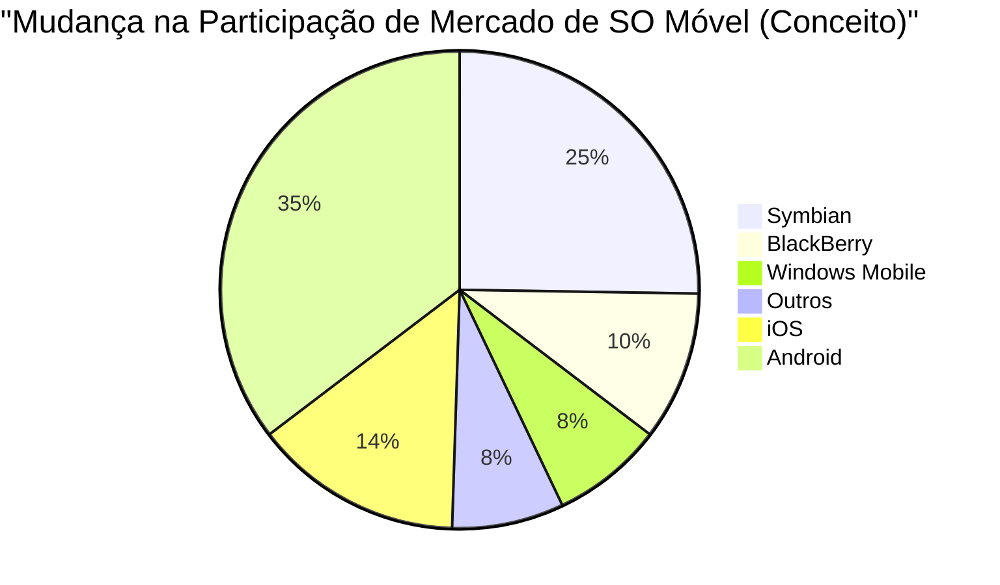

## 1. Gênese: A Revolução que Começou em uma Garagem (1976-1980)

Em 1976, Steve Jobs, Steve Wozniak e Ronald Wayne fundaram a "Apple Computer Company" na garagem da casa dos pais de Jobs, em Los Altos, Califórnia.

O primeiro produto, o **Apple I** , era um kit de montagem que fornecia apenas a placa-mãe. Foi o momento em que a genialidade do design de hardware de Wozniak se fundiu com a visão e capacidade de marketing de Jobs.



### O Grande Sucesso do Apple II
Lançado em 1977, o **Apple II** foi um produto revolucionário que integrava um teclado em um gabinete de plástico e era capaz de exibir gráficos coloridos. Com o surgimento do VisiCalc (o primeiro software de planilha eletrônica do mundo), o Apple II penetrou também no mercado corporativo e registrou um sucesso estrondoso.

## 2. A Aurora do Macintosh e da Interface Gráfica (1984)

Em 1984, a Apple lançou o **Macintosh** . Este foi o primeiro computador pessoal voltado para o público geral equipado com uma GUI (Interface Gráfica do Usuário) e um mouse.


Como tecnologias inovadoras da época, foram introduzidos os conceitos de tela de bitmap e programação orientada a objetos.

## 3. A Era das Trevas e o Retorno de Jobs (1985-1997)

Em 1985, devido a conflitos internos, Jobs foi expulso da Apple. Depois disso, a Apple entrou em um período de declínio. Por outro lado, Jobs fundou a NeXT e a Pixar, alcançando o sucesso.

Em 1996, a Apple chegou a um impasse no desenvolvimento de seu sistema operacional de próxima geração e decidiu comprar a NeXT, empresa de Jobs. Em 1997, Jobs retornou à Apple e assumiu o cargo de CEO interino.

### A Evolução do NeXTSTEP para o macOS
A tecnologia do **NeXTSTEP** , o sistema operacional da NeXT (kernel Mach, Objective-C), tornou-se a base sólida para o posterior Mac OS X (atual macOS) e iOS.

```objc
// Exemplo em Objective-C (tecnologia originada do NeXTSTEP)
#import <Foundation/Foundation.h>

@interface Greeting : NSObject
- (void)sayHello;
@end

@implementation Greeting
- (void)sayHello {
    NSLog(@"Olá, Pense Diferente!");
}
@end
```

## 4. iMac, iPod e iTunes (1998-2006)

Jobs reduziu drasticamente a linha de produtos e, em 1998, anunciou o **iMac** . O design translúcido (semitransparente) chocou o mundo todo.

Em 2001, ele anunciou o **iPod** e o **iTunes** , revolucionando a indústria da música. O slogan "1.000 músicas no seu bolso" demonstrou a fusão perfeita entre tecnologia e experiência do usuário.

## 5. A Revolução do iPhone e a Era Móvel (2007-2011)

Em janeiro de 2007, Jobs anunciou o **iPhone** .
"Um iPod, um telefone e um comunicador de internet. Estes não são três dispositivos separados, mas sim um único dispositivo."

O iPhone adotou uma interface multitoque e eliminou o teclado físico. Esse foi um evento que mudou a história da comunicação humana.



## 6. A Era Tim Cook e a Transição para uma Empresa de Serviços (2011-Presente)

Após o falecimento de Jobs em 2011, Tim Cook assumiu o cargo de CEO. O excelente gerenciamento da cadeia de suprimentos de Cook e o sucesso de dispositivos vestíveis, como o Apple Watch e os AirPods, fizeram com que a Apple crescesse e se tornasse a primeira empresa do mundo com valor de mercado de 1 trilhão, 2 trilhões e 3 trilhões de dólares.

### O Impacto do Apple Silicon (M1/M2/M3)
Nos últimos anos, a empresa concluiu a transição dos chips da Intel para o **Apple Silicon (arquitetura ARM)** de design próprio. Eles alcançaram um equilíbrio entre alto desempenho e eficiência energética esmagadora.

$$
	ext{Desempenho por Watt} = rac{	ext{Saída de Computação (FLOPS)}}{	ext{Consumo de Energia (Watts)}}
$$

## 7. A Apple na Era da IA (Apple Intelligence)

Em 2024, a Apple anunciou a **Apple Intelligence** , marcando sua entrada em grande escala na IA no dispositivo (on-device) que entende o contexto pessoal. Mantendo o foco na privacidade, eles integraram uma evolução dramática da Siri e a geração de textos e imagens em nível de sistema operacional.

## Resumo

A história da Apple é a história de estar constantemente na interseção entre a tecnologia e as artes liberais. A pequena empresa que começou em uma garagem agora construiu um ecossistema digital que é indispensável para a vida das pessoas em todo o mundo.


## Análise Adicional 1: Aprofundamento na Estratégia de Negócios e Tecnologia da Apple


## Análise Adicional 2: Aprofundamento na Estratégia de Negócios e Tecnologia da Apple


## Análise Adicional 3: Aprofundamento na Estratégia de Negócios e Tecnologia da Apple


## Análise Adicional 4: Aprofundamento na Estratégia de Negócios e Tecnologia da Apple


## Análise Adicional 5: Aprofundamento na Estratégia de Negócios e Tecnologia da Apple


## Análise Adicional 6: Aprofundamento na Estratégia de Negócios e Tecnologia da Apple


## Análise Adicional 7: Aprofundamento na Estratégia de Negócios e Tecnologia da Apple


## Análise Adicional 8: Aprofundamento na Estratégia de Negócios e Tecnologia da Apple


## Análise Adicional 9: Aprofundamento na Estratégia de Negócios e Tecnologia da Apple


