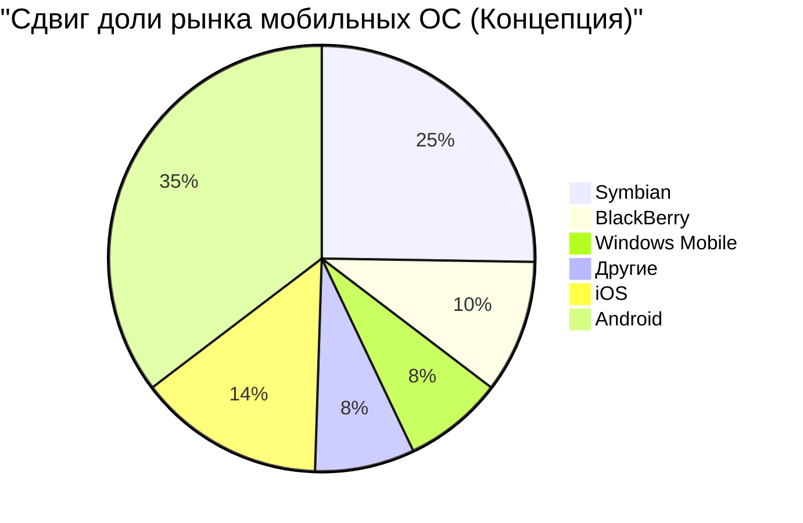

## 1. Зарождение: Революция, начавшаяся в гараже (1976-1980)

В 1976 году Стив Джобс, Стив Возняк и Рональд Уэйн основали «Apple Computer Company» в гараже родительского дома Джобса в Лос-Алтосе, Калифорния.

Первый продукт, **Apple I**, представлял собой набор для сборки, состоящий только из материнской платы. Это был момент слияния гениальных навыков Возняка в проектировании оборудования с дальновидностью и маркетинговым талантом Джобса.


### Огромный успех Apple II
Выпущенный в 1977 году **Apple II** стал революционным продуктом: он имел встроенную в пластиковый корпус клавиатуру и мог отображать цветную графику. С появлением VisiCalc (первой в мире программы для работы с электронными таблицами) Apple II проник на бизнес-рынок и стал взрывным хитом.

## 2. Macintosh и рассвет GUI (1984)

В 1984 году Apple выпустила **Macintosh**. Это был первый персональный компьютер для массового пользователя, оснащенный GUI (графическим пользовательским интерфейсом) и мышью.


В качестве прорывных технологий того времени были внедрены растровый дисплей и концепции объектно-ориентированного программирования.

## 3. Темные времена и возвращение Джобса (1985-1997)

В 1985 году из-за внутренних конфликтов Джобс был изгнан из Apple. После этого Apple вступила в период упадка. Тем временем Джобс основал компании NeXT и Pixar, добившись успеха.

В 1996 году разработка ОС нового поколения в Apple зашла в тупик, и было принято решение купить компанию Джобса NeXT. В 1997 году Джобс вернулся в Apple и занял пост временного генерального директора.

### Эволюция от NeXTSTEP к macOS
Технологии ОС **NeXTSTEP** (ядро Mach, Objective-C) от NeXT стали надежной основой для будущей Mac OS X (ныне macOS) и iOS.

```objc
// Пример Objective-C (Технологии от NeXTSTEP)
#import <Foundation/Foundation.h>

@interface Greeting : NSObject
- (void)sayHello;
@end

@implementation Greeting
- (void)sayHello {
    NSLog(@"Привет, Думай иначе!");
}
@end
```

## 4. iMac, iPod и iTunes (1998-2006)

Джобс радикально сократил линейку продуктов и в 1998 году представил **iMac**. Полупрозрачный дизайн устройства потряс весь мир.

В 2001 году были представлены **iPod** и **iTunes**, что произвело революцию в музыкальной индустрии. Слоган «1000 песен у вас в кармане» продемонстрировал идеальное сочетание технологий и пользовательского опыта.

## 5. Революция iPhone и мобильная эра (2007-2011)

В январе 2007 года Джобс представил **iPhone**.
«iPod, телефон и интернет-коммуникатор. Это не три разных устройства, это одно устройство».

В iPhone использовался мультисенсорный интерфейс и отсутствовала физическая клавиатура. Это стало событием, изменившим историю человеческого общения.



## 6. Эпоха Тима Кука и трансформация в сервисную компанию (2011-настоящее время)

После кончины Джобса в 2011 году пост генерального директора занял Тим Кук. Благодаря превосходному управлению цепочками поставок Кука и успеху носимых устройств, таких как Apple Watch и AirPods, Apple стала первой в мире компанией с капитализацией в 1, 2 и 3 триллиона долларов.

### Влияние Apple Silicon (M1/M2/M3)
В последние годы был завершен переход с процессоров Intel на чипы собственной разработки **Apple Silicon (архитектура ARM)**. Они сочетают в себе высокую производительность и невероятную энергоэффективность.

$$
	ext{Performance per Watt} = rac{	ext{Computation Output (FLOPS)}}{	ext{Power Consumption (Watts)}}
$$

## 7. Apple в эпоху ИИ (Apple Intelligence)

В 2024 году Apple представила **Apple Intelligence**, ознаменовав полномасштабный выход на рынок встроенного ИИ (on-device AI), понимающего личный контекст. Сохраняя акцент на конфиденциальности, компания интегрировала на уровне ОС кардинально улучшенную Siri, а также генерацию текстов и изображений.

## Заключение

История Apple — это история пребывания на пересечении технологий и гуманитарных наук. Небольшая компания, начавшаяся в гараже, теперь создала цифровую экосистему, без которой немыслима жизнь людей по всему миру.


## Дополнительный анализ 1: Углубленный взгляд на бизнес-стратегию и технологии Apple


### 1.1 Зарождение: Революция, начавшаяся в гараже (1976-1980)

В 1976 году Стив Джобс, Стив Возняк и Рональд Уэйн основали «Apple Computer Company» в гараже родительского дома Джобса в Лос-Алтосе, Калифорния.

Первый продукт, **Apple I**, представлял собой набор для сборки, состоящий только из материнской платы. Это был момент слияния гениальных навыков Возняка в проектировании оборудования с дальновидностью и маркетинговым талантом Джобса.


### Огромный успех Apple II
Выпущенный в 1977 году **Apple II** стал революционным продуктом: он имел встроенную в пластиковый корпус клавиатуру и мог отображать цветную графику. С появлением VisiCalc (первой в мире программы для работы с электронными таблицами) Apple II проник на бизнес-рынок и стал взрывным хитом.

### 1.2 Macintosh и рассвет GUI (1984)

В 1984 году Apple выпустила **Macintosh**. Это был первый персональный компьютер для массового пользователя, оснащенный GUI (графическим пользовательским интерфейсом) и мышью.


В качестве прорывных технологий того времени были внедрены растровый дисплей и концепции объектно-ориентированного программирования.

## 3. Темные времена и возвращение Джобса (1985-1997)

В 1985 году из-за внутренних конфликтов Джобс был изгнан из Apple. После этого Apple вступила в период упадка. Тем временем Джобс основал компании NeXT и Pixar, добившись успеха.

В 1996 году разработка ОС нового поколения в Apple зашла в тупик, и было принято решение купить компанию Джобса NeXT. В 1997 году Джобс вернулся в Apple и занял пост временного генерального директора.

### Эволюция от NeXTSTEP к macOS
Технологии ОС **NeXTSTEP** (ядро Mach, Objective-C) от NeXT стали надежной основой для будущей Mac OS X (ныне macOS) и iOS.

```objc
// Пример Objective-C (Технологии от NeXTSTEP)
#import <Foundation/Foundation.h>

@interface Greeting : NSObject
- (void)sayHello;
@end

@implementation Greeting
- (void)sayHello {
    NSLog(@"Привет, Думай иначе!");
}
@end
```

## 4. iMac, iPod и iTunes (1998-2006)

Джобс радикально сократил линейку продуктов и в 1998 году представил **iMac**. Полупрозрачный дизайн устройства потряс весь мир.

В 2001 году были представлены **iPod** и **iTunes**, что произвело революцию в музыкальной индустрии. Слоган «1000 песен у вас в кармане» продемонстрировал идеальное сочетание технологий и пользовательского опыта.

## 5. Революция iPhone и мобильная эра (2007-2011)

В январе 2007 года Джобс представил **iPhone**.
«iPod, телефон и интернет-коммуникатор. Это не три разных устройства, это одно устройство».

В iPhone использовался мультисенсорный интерфейс и отсутствовала физическая клавиатура. Это стало событием, изменившим историю человеческого общения.


## 6. Эпоха Тима Кука и трансформация в сервисную компанию (2011-настоящее время)

После кончины Джобса в 2011 году пост генерального директора занял Тим Кук. Благодаря превосходному управлению цепочками поставок Кука и успеху носимых устройств, таких как Apple Watch и AirPods, Apple стала первой в мире компанией с капитализацией в 1, 2 и 3 триллиона долларов.

### Влияние Apple Silicon (M1/M2/M3)
В последние годы был завершен переход с процессоров Intel на чипы собственной разработки **Apple Silicon (архитектура ARM)**. Они сочетают в себе высокую производительность и невероятную энергоэффективность.

$$
	ext{Performance per Watt} = rac{	ext{Computation Output (FLOPS)}}{	ext{Power Consumption (Watts)}}
$$

## 7. Apple в эпоху ИИ (Apple Intelligence)

В 2024 году Apple представила **Apple Intelligence**, ознаменовав полномасштабный выход на рынок встроенного ИИ (on-device AI), понимающего личный контекст. Сохраняя акцент на конфиденциальности, компания интегрировала на уровне ОС кардинально улучшенную Siri, а также генерацию текстов и изображений.

## Заключение

История Apple — это история пребывания на пересечении технологий и гуманитарных наук. Небольшая компания, начавшаяся в гараже, теперь создала цифровую экосистему, без которой немыслима жизнь людей по всему миру.


## Дополнительный анализ 2: Углубленный взгляд на бизнес-стратегию и технологии Apple


#### 2.21 Зарождение: Революция, начавшаяся в гараже (1976-1980)

В 1976 году Стив Джобс, Стив Возняк и Рональд Уэйн основали «Apple Computer Company» в гараже родительского дома Джобса в Лос-Алтосе, Калифорния.

Первый продукт, **Apple I**, представлял собой набор для сборки, состоящий только из материнской платы. Это был момент слияния гениальных навыков Возняка в проектировании оборудования с дальновидностью и маркетинговым талантом Джобса.


### Огромный успех Apple II
Выпущенный в 1977 году **Apple II** стал революционным продуктом: он имел встроенную в пластиковый корпус клавиатуру и мог отображать цветную графику. С появлением VisiCalc (первой в мире программы для работы с электронными таблицами) Apple II проник на бизнес-рынок и стал взрывным хитом.

### 2.2 Macintosh и рассвет GUI (1984)

В 1984 году Apple выпустила **Macintosh**. Это был первый персональный компьютер для массового пользователя, оснащенный GUI (графическим пользовательским интерфейсом) и мышью.


В качестве прорывных технологий того времени были внедрены растровый дисплей и концепции объектно-ориентированного программирования.

## 3. Темные времена и возвращение Джобса (1985-1997)

В 1985 году из-за внутренних конфликтов Джобс был изгнан из Apple. После этого Apple вступила в период упадка. Тем временем Джобс основал компании NeXT и Pixar, добившись успеха.

В 1996 году разработка ОС нового поколения в Apple зашла в тупик, и было принято решение купить компанию Джобса NeXT. В 1997 году Джобс вернулся в Apple и занял пост временного генерального директора.

### Эволюция от NeXTSTEP к macOS
Технологии ОС **NeXTSTEP** (ядро Mach, Objective-C) от NeXT стали надежной основой для будущей Mac OS X (ныне macOS) и iOS.

```objc
// Пример Objective-C (Технологии от NeXTSTEP)
#import <Foundation/Foundation.h>

@interface Greeting : NSObject
- (void)sayHello;
@end

@implementation Greeting
- (void)sayHello {
    NSLog(@"Привет, Думай иначе!");
}
@end
```

## 4. iMac, iPod и iTunes (1998-2006)

Джобс радикально сократил линейку продуктов и в 1998 году представил **iMac**. Полупрозрачный дизайн устройства потряс весь мир.

В 2001 году были представлены **iPod** и **iTunes**, что произвело революцию в музыкальной индустрии. Слоган «1000 песен у вас в кармане» продемонстрировал идеальное сочетание технологий и пользовательского опыта.

## 5. Революция iPhone и мобильная эра (2007-2011)

В январе 2007 года Джобс представил **iPhone**.
«iPod, телефон и интернет-коммуникатор. Это не три разных устройства, это одно устройство».

В iPhone использовался мультисенсорный интерфейс и отсутствовала физическая клавиатура. Это стало событием, изменившим историю человеческого общения.


## 6. Эпоха Тима Кука и трансформация в сервисную компанию (2011-настоящее время)

После кончины Джобса в 2011 году пост генерального директора занял Тим Кук. Благодаря превосходному управлению цепочками поставок Кука и успеху носимых устройств, таких как Apple Watch и AirPods, Apple стала первой в мире компанией с капитализацией в 1, 2 и 3 триллиона долларов.

### Влияние Apple Silicon (M1/M2/M3)
В последние годы был завершен переход с процессоров Intel на чипы собственной разработки **Apple Silicon (архитектура ARM)**. Они сочетают в себе высокую производительность и невероятную энергоэффективность.

$$
	ext{Performance per Watt} = rac{	ext{Computation Output (FLOPS)}}{	ext{Power Consumption (Watts)}}
$$

## 7. Apple в эпоху ИИ (Apple Intelligence)

В 2024 году Apple представила **Apple Intelligence**, ознаменовав полномасштабный выход на рынок встроенного ИИ (on-device AI), понимающего личный контекст. Сохраняя акцент на конфиденциальности, компания интегрировала на уровне ОС кардинально улучшенную Siri, а также генерацию текстов и изображений.

## Заключение

История Apple — это история пребывания на пересечении технологий и гуманитарных наук. Небольшая компания, начавшаяся в гараже, теперь создала цифровую экосистему, без которой немыслима жизнь людей по всему миру.


## Дополнительный анализ 3: Углубленный взгляд на бизнес-стратегию и технологии Apple


### 3.1 Зарождение: Революция, начавшаяся в гараже (1976-1980)

В 1976 году Стив Джобс, Стив Возняк и Рональд Уэйн основали «Apple Computer Company» в гараже родительского дома Джобса в Лос-Алтосе, Калифорния.

Первый продукт, **Apple I**, представлял собой набор для сборки, состоящий только из материнской платы. Это был момент слияния гениальных навыков Возняка в проектировании оборудования с дальновидностью и маркетинговым талантом Джобса.


### Огромный успех Apple II
Выпущенный в 1977 году **Apple II** стал революционным продуктом: он имел встроенную в пластиковый корпус клавиатуру и мог отображать цветную графику. С появлением VisiCalc (первой в мире программы для работы с электронными таблицами) Apple II проник на бизнес-рынок и стал взрывным хитом.

### 3.2 Macintosh и рассвет GUI (1984)

В 1984 году Apple выпустила **Macintosh**. Это был первый персональный компьютер для массового пользователя, оснащенный GUI (графическим пользовательским интерфейсом) и мышью.


В качестве прорывных технологий того времени были внедрены растровый дисплей и концепции объектно-ориентированного программирования.

## 3. Темные времена и возвращение Джобса (1985-1997)

В 1985 году из-за внутренних конфликтов Джобс был изгнан из Apple. После этого Apple вступила в период упадка. Тем временем Джобс основал компании NeXT и Pixar, добившись успеха.

В 1996 году разработка ОС нового поколения в Apple зашла в тупик, и было принято решение купить компанию Джобса NeXT. В 1997 году Джобс вернулся в Apple и занял пост временного генерального директора.

### Эволюция от NeXTSTEP к macOS
Технологии ОС **NeXTSTEP** (ядро Mach, Objective-C) от NeXT стали надежной основой для будущей Mac OS X (ныне macOS) и iOS.

```objc
// Пример Objective-C (Технологии от NeXTSTEP)
#import <Foundation/Foundation.h>

@interface Greeting : NSObject
- (void)sayHello;
@end

@implementation Greeting
- (void)sayHello {
    NSLog(@"Привет, Думай иначе!");
}
@end
```

## 4. iMac, iPod и iTunes (1998-2006)

Джобс радикально сократил линейку продуктов и в 1998 году представил **iMac**. Полупрозрачный дизайн устройства потряс весь мир.

В 2001 году были представлены **iPod** и **iTunes**, что произвело революцию в музыкальной индустрии. Слоган «1000 песен у вас в кармане» продемонстрировал идеальное сочетание технологий и пользовательского опыта.

## 5. Революция iPhone и мобильная эра (2007-2011)

В январе 2007 года Джобс представил **iPhone**.
«iPod, телефон и интернет-коммуникатор. Это не три разных устройства, это одно устройство».

В iPhone использовался мультисенсорный интерфейс и отсутствовала физическая клавиатура. Это стало событием, изменившим историю человеческого общения.


## 6. Эпоха Тима Кука и трансформация в сервисную компанию (2011-настоящее время)

После кончины Джобса в 2011 году пост генерального директора занял Тим Кук. Благодаря превосходному управлению цепочками поставок Кука и успеху носимых устройств, таких как Apple Watch и AirPods, Apple стала первой в мире компанией с капитализацией в 1, 2 и 3 триллиона долларов.

### Влияние Apple Silicon (M1/M2/M3)
В последние годы был завершен переход с процессоров Intel на чипы собственной разработки **Apple Silicon (архитектура ARM)**. Они сочетают в себе высокую производительность и невероятную энергоэффективность.

$$
	ext{Performance per Watt} = rac{	ext{Computation Output (FLOPS)}}{	ext{Power Consumption (Watts)}}
$$

## 7. Apple в эпоху ИИ (Apple Intelligence)

В 2024 году Apple представила **Apple Intelligence**, ознаменовав полномасштабный выход на рынок встроенного ИИ (on-device AI), понимающего личный контекст. Сохраняя акцент на конфиденциальности, компания интегрировала на уровне ОС кардинально улучшенную Siri, а также генерацию текстов и изображений.

## Заключение

История Apple — это история пребывания на пересечении технологий и гуманитарных наук. Небольшая компания, начавшаяся в гараже, теперь создала цифровую экосистему, без которой немыслима жизнь людей по всему миру.


## Дополнительный анализ 4: Углубленный взгляд на бизнес-стратегию и технологии Apple


### 4.1 Зарождение: Революция, начавшаяся в гараже (1976-1980)

В 1976 году Стив Джобс, Стив Возняк и Рональд Уэйн основали «Apple Computer Company» в гараже родительского дома Джобса в Лос-Алтосе, Калифорния.

Первый продукт, **Apple I**, представлял собой набор для сборки, состоящий только из материнской платы. Это был момент слияния гениальных навыков Возняка в проектировании оборудования с дальновидностью и маркетинговым талантом Джобса.


### Огромный успех Apple II
Выпущенный в 1977 году **Apple II** стал революционным продуктом: он имел встроенную в пластиковый корпус клавиатуру и мог отображать цветную графику. С появлением VisiCalc (первой в мире программы для работы с электронными таблицами) Apple II проник на бизнес-рынок и стал взрывным хитом.

### 4.2 Macintosh и рассвет GUI (1984)

В 1984 году Apple выпустила **Macintosh**. Это был первый персональный компьютер для массового пользователя, оснащенный GUI (графическим пользовательским интерфейсом) и мышью.


В качестве прорывных технологий того времени были внедрены растровый дисплей и концепции объектно-ориентированного программирования.

## 3. Темные времена и возвращение Джобса (1985-1997)

В 1985 году из-за внутренних конфликтов Джобс был изгнан из Apple. После этого Apple вступила в период упадка. Тем временем Джобс основал компании NeXT и Pixar, добившись успеха.

В 1996 году разработка ОС нового поколения в Apple зашла в тупик, и было принято решение купить компанию Джобса NeXT. В 1997 году Джобс вернулся в Apple и занял пост временного генерального директора.

### Эволюция от NeXTSTEP к macOS
Технологии ОС **NeXTSTEP** (ядро Mach, Objective-C) от NeXT стали надежной основой для будущей Mac OS X (ныне macOS) и iOS.

```objc
// Пример Objective-C (Технологии от NeXTSTEP)
#import <Foundation/Foundation.h>

@interface Greeting : NSObject
- (void)sayHello;
@end

@implementation Greeting
- (void)sayHello {
    NSLog(@"Привет, Думай иначе!");
}
@end
```

## 4. iMac, iPod и iTunes (1998-2006)

Джобс радикально сократил линейку продуктов и в 1998 году представил **iMac**. Полупрозрачный дизайн устройства потряс весь мир.

В 2001 году были представлены **iPod** и **iTunes**, что произвело революцию в музыкальной индустрии. Слоган «1000 песен у вас в кармане» продемонстрировал идеальное сочетание технологий и пользовательского опыта.

## 5. Революция iPhone и мобильная эра (2007-2011)

В январе 2007 года Джобс представил **iPhone**.
«iPod, телефон и интернет-коммуникатор. Это не три разных устройства, это одно устройство».

В iPhone использовался мультисенсорный интерфейс и отсутствовала физическая клавиатура. Это стало событием, изменившим историю человеческого общения.


## 6. Эпоха Тима Кука и трансформация в сервисную компанию (2011-настоящее время)

После кончины Джобса в 2011 году пост генерального директора занял Тим Кук. Благодаря превосходному управлению цепочками поставок Кука и успеху носимых устройств, таких как Apple Watch и AirPods, Apple стала первой в мире компанией с капитализацией в 1, 2 и 3 триллиона долларов.

### Влияние Apple Silicon (M1/M2/M3)
В последние годы был завершен переход с процессоров Intel на чипы собственной разработки **Apple Silicon (архитектура ARM)**. Они сочетают в себе высокую производительность и невероятную энергоэффективность.

$$
	ext{Performance per Watt} = rac{	ext{Computation Output (FLOPS)}}{	ext{Power Consumption (Watts)}}
$$

## 7. Apple в эпоху ИИ (Apple Intelligence)

В 2024 году Apple представила **Apple Intelligence**, ознаменовав полномасштабный выход на рынок встроенного ИИ (on-device AI), понимающего личный контекст. Сохраняя акцент на конфиденциальности, компания интегрировала на уровне ОС кардинально улучшенную Siri, а также генерацию текстов и изображений.

## Заключение

История Apple — это история пребывания на пересечении технологий и гуманитарных наук. Небольшая компания, начавшаяся в гараже, теперь создала цифровую экосистему, без которой немыслима жизнь людей по всему миру.


## Дополнительный анализ 5: Углубленный взгляд на бизнес-стратегию и технологии Apple


### 5.1 Зарождение: Революция, начавшаяся в гараже (1976-1980)

В 1976 году Стив Джобс, Стив Возняк и Рональд Уэйн основали «Apple Computer Company» в гараже родительского дома Джобса в Лос-Алтосе, Калифорния.

Первый продукт, **Apple I**, представлял собой набор для сборки, состоящий только из материнской платы. Это был момент слияния гениальных навыков Возняка в проектировании оборудования с дальновидностью и маркетинговым талантом Джобса.


### Огромный успех Apple II
Выпущенный в 1977 году **Apple II** стал революционным продуктом: он имел встроенную в пластиковый корпус клавиатуру и мог отображать цветную графику. С появлением VisiCalc (первой в мире программы для работы с электронными таблицами) Apple II проник на бизнес-рынок и стал взрывным хитом.

### 5.2 Macintosh и рассвет GUI (1984)

В 1984 году Apple выпустила **Macintosh**. Это был первый персональный компьютер для массового пользователя, оснащенный GUI (графическим пользовательским интерфейсом) и мышью.


В качестве прорывных технологий того времени были внедрены растровый дисплей и концепции объектно-ориентированного программирования.

## 3. Темные времена и возвращение Джобса (1985-1997)

В 1985 году из-за внутренних конфликтов Джобс был изгнан из Apple. После этого Apple вступила в период упадка. Тем временем Джобс основал компании NeXT и Pixar, добившись успеха.

В 1996 году разработка ОС нового поколения в Apple зашла в тупик, и было принято решение купить компанию Джобса NeXT. В 1997 году Джобс вернулся в Apple и занял пост временного генерального директора.

### Эволюция от NeXTSTEP к macOS
Технологии ОС **NeXTSTEP** (ядро Mach, Objective-C) от NeXT стали надежной основой для будущей Mac OS X (ныне macOS) и iOS.

```objc
// Пример Objective-C (Технологии от NeXTSTEP)
#import <Foundation/Foundation.h>

@interface Greeting : NSObject
- (void)sayHello;
@end

@implementation Greeting
- (void)sayHello {
    NSLog(@"Привет, Думай иначе!");
}
@end
```

## 4. iMac, iPod и iTunes (1998-2006)

Джобс радикально сократил линейку продуктов и в 1998 году представил **iMac**. Полупрозрачный дизайн устройства потряс весь мир.

В 2001 году были представлены **iPod** и **iTunes**, что произвело революцию в музыкальной индустрии. Слоган «1000 песен у вас в кармане» продемонстрировал идеальное сочетание технологий и пользовательского опыта.

## 5. Революция iPhone и мобильная эра (2007-2011)

В январе 2007 года Джобс представил **iPhone**.
«iPod, телефон и интернет-коммуникатор. Это не три разных устройства, это одно устройство».

В iPhone использовался мультисенсорный интерфейс и отсутствовала физическая клавиатура. Это стало событием, изменившим историю человеческого общения.


## 6. Эпоха Тима Кука и трансформация в сервисную компанию (2011-настоящее время)

После кончины Джобса в 2011 году пост генерального директора занял Тим Кук. Благодаря превосходному управлению цепочками поставок Кука и успеху носимых устройств, таких как Apple Watch и AirPods, Apple стала первой в мире компанией с капитализацией в 1, 2 и 3 триллиона долларов.

### Влияние Apple Silicon (M1/M2/M3)
В последние годы был завершен переход с процессоров Intel на чипы собственной разработки **Apple Silicon (архитектура ARM)**. Они сочетают в себе высокую производительность и невероятную энергоэффективность.

$$
	ext{Performance per Watt} = rac{	ext{Computation Output (FLOPS)}}{	ext{Power Consumption (Watts)}}
$$

## 7. Apple в эпоху ИИ (Apple Intelligence)

В 2024 году Apple представила **Apple Intelligence**, ознаменовав полномасштабный выход на рынок встроенного ИИ (on-device AI), понимающего личный контекст. Сохраняя акцент на конфиденциальности, компания интегрировала на уровне ОС кардинально улучшенную Siri, а также генерацию текстов и изображений.

## Заключение

История Apple — это история пребывания на пересечении технологий и гуманитарных наук. Небольшая компания, начавшаяся в гараже, теперь создала цифровую экосистему, без которой немыслима жизнь людей по всему миру.


## Дополнительный анализ 6: Углубленный взгляд на бизнес-стратегию и технологии Apple


### 6.1 Зарождение: Революция, начавшаяся в гараже (1976-1980)

В 1976 году Стив Джобс, Стив Возняк и Рональд Уэйн основали «Apple Computer Company» в гараже родительского дома Джобса в Лос-Алтосе, Калифорния.

Первый продукт, **Apple I**, представлял собой набор для сборки, состоящий только из материнской платы. Это был момент слияния гениальных навыков Возняка в проектировании оборудования с дальновидностью и маркетинговым талантом Джобса.


### Огромный успех Apple II
Выпущенный в 1977 году **Apple II** стал революционным продуктом: он имел встроенную в пластиковый корпус клавиатуру и мог отображать цветную графику. С появлением VisiCalc (первой в мире программы для работы с электронными таблицами) Apple II проник на бизнес-рынок и стал взрывным хитом.

### 6.2 Macintosh и рассвет GUI (1984)

В 1984 году Apple выпустила **Macintosh**. Это был первый персональный компьютер для массового пользователя, оснащенный GUI (графическим пользовательским интерфейсом) и мышью.


В качестве прорывных технологий того времени были внедрены растровый дисплей и концепции объектно-ориентированного программирования.

## 3. Темные времена и возвращение Джобса (1985-1997)

В 1985 году из-за внутренних конфликтов Джобс был изгнан из Apple. После этого Apple вступила в период упадка. Тем временем Джобс основал компании NeXT и Pixar, добившись успеха.

В 1996 году разработка ОС нового поколения в Apple зашла в тупик, и было принято решение купить компанию Джобса NeXT. В 1997 году Джобс вернулся в Apple и занял пост временного генерального директора.

### Эволюция от NeXTSTEP к macOS
Технологии ОС **NeXTSTEP** (ядро Mach, Objective-C) от NeXT стали надежной основой для будущей Mac OS X (ныне macOS) и iOS.

```objc
// Пример Objective-C (Технологии от NeXTSTEP)
#import <Foundation/Foundation.h>

@interface Greeting : NSObject
- (void)sayHello;
@end

@implementation Greeting
- (void)sayHello {
    NSLog(@"Привет, Думай иначе!");
}
@end
```

## 4. iMac, iPod и iTunes (1998-2006)

Джобс радикально сократил линейку продуктов и в 1998 году представил **iMac**. Полупрозрачный дизайн устройства потряс весь мир.

В 2001 году были представлены **iPod** и **iTunes**, что произвело революцию в музыкальной индустрии. Слоган «1000 песен у вас в кармане» продемонстрировал идеальное сочетание технологий и пользовательского опыта.

## 5. Революция iPhone и мобильная эра (2007-2011)

В январе 2007 года Джобс представил **iPhone**.
«iPod, телефон и интернет-коммуникатор. Это не три разных устройства, это одно устройство».

В iPhone использовался мультисенсорный интерфейс и отсутствовала физическая клавиатура. Это стало событием, изменившим историю человеческого общения.

```mermaid
pie title "Сдвиг доли рынка мобильных ОС (Концепция)"
    "Symbian" : 50
    "BlackBerry" : 20
    "Windows Mobile" : 15
    "Другие" : 15
    %% ↓ После iPhone/Android
    "iOS" : 28
    "Android" : 70
    "Другие" : 2
```

## 6. Эпоха Тима Кука и трансформация в сервисную компанию (2011-настоящее время)

После кончины Джобса в 2011 году пост генерального директора занял Тим Кук. Благодаря превосходному управлению цепочками поставок Кука и успеху носимых устройств, таких как Apple Watch и AirPods, Apple стала первой в мире компанией с капитализацией в 1, 2 и 3 триллиона долларов.

### Влияние Apple Silicon (M1/M2/M3)
В последние годы был завершен переход с процессоров Intel на чипы собственной разработки **Apple Silicon (архитектура ARM)**. Они сочетают в себе высокую производительность и невероятную энергоэффективность.

$$
	ext{Performance per Watt} = rac{	ext{Computation Output (FLOPS)}}{	ext{Power Consumption (Watts)}}
$$

## 7. Apple в эпоху ИИ (Apple Intelligence)

В 2024 году Apple представила **Apple Intelligence**, ознаменовав полномасштабный выход на рынок встроенного ИИ (on-device AI), понимающего личный контекст. Сохраняя акцент на конфиденциальности, компания интегрировала на уровне ОС кардинально улучшенную Siri, а также генерацию текстов и изображений.

## Заключение

История Apple — это история пребывания на пересечении технологий и гуманитарных наук. Небольшая компания, начавшаяся в гараже, теперь создала цифровую экосистему, без которой немыслима жизнь людей по всему миру.


## Дополнительный анализ 7: Углубленный взгляд на бизнес-стратегию и технологии Apple


### 7.1 Зарождение: Революция, начавшаяся в гараже (1976-1980)

В 1976 году Стив Джобс, Стив Возняк и Рональд Уэйн основали «Apple Computer Company» в гараже родительского дома Джобса в Лос-Алтосе, Калифорния.

Первый продукт, **Apple I**, представлял собой набор для сборки, состоящий только из материнской платы. Это был момент слияния гениальных навыков Возняка в проектировании оборудования с дальновидностью и маркетинговым талантом Джобса.

```mermaid
graph TD
    subgraph "Основатели Apple"
        SJ["Стив Джобс (Маркетинг/Видение)"]
        SW["Стив Возняк (Инженерия)"]
        RW["Рональд Уэйн (Администрация)"]
        SJ --- SW
        SJ --- RW
        SW --- RW
    end
```

### Огромный успех Apple II
Выпущенный в 1977 году **Apple II** стал революционным продуктом: он имел встроенную в пластиковый корпус клавиатуру и мог отображать цветную графику. С появлением VisiCalc (первой в мире программы для работы с электронными таблицами) Apple II проник на бизнес-рынок и стал взрывным хитом.

### 7.2 Macintosh и рассвет GUI (1984)

В 1984 году Apple выпустила **Macintosh**. Это был первый персональный компьютер для массового пользователя, оснащенный GUI (графическим пользовательским интерфейсом) и мышью.

```mermaid
flowchart LR
    Xerox["Xerox PARC (Концепция GUI)"] --> Jobs["Визит Стива Джобса (1979)"]
    Jobs --> Lisa["Apple Lisa (1983)"]
    Lisa --> Mac["Macintosh (1984)"]
    Mac --> Modern["Современные ОС с GUI"]
```

В качестве прорывных технологий того времени были внедрены растровый дисплей и концепции объектно-ориентированного программирования.

## 3. Темные времена и возвращение Джобса (1985-1997)

В 1985 году из-за внутренних конфликтов Джобс был изгнан из Apple. После этого Apple вступила в период упадка. Тем временем Джобс основал компании NeXT и Pixar, добившись успеха.

В 1996 году разработка ОС нового поколения в Apple зашла в тупик, и было принято решение купить компанию Джобса NeXT. В 1997 году Джобс вернулся в Apple и занял пост временного генерального директора.

### Эволюция от NeXTSTEP к macOS
Технологии ОС **NeXTSTEP** (ядро Mach, Objective-C) от NeXT стали надежной основой для будущей Mac OS X (ныне macOS) и iOS.

```objc
// Пример Objective-C (Технологии от NeXTSTEP)
#import <Foundation/Foundation.h>

@interface Greeting : NSObject
- (void)sayHello;
@end

@implementation Greeting
- (void)sayHello {
    NSLog(@"Привет, Думай иначе!");
}
@end
```

## 4. iMac, iPod и iTunes (1998-2006)

Джобс радикально сократил линейку продуктов и в 1998 году представил **iMac**. Полупрозрачный дизайн устройства потряс весь мир.

В 2001 году были представлены **iPod** и **iTunes**, что произвело революцию в музыкальной индустрии. Слоган «1000 песен у вас в кармане» продемонстрировал идеальное сочетание технологий и пользовательского опыта.

## 5. Революция iPhone и мобильная эра (2007-2011)

В январе 2007 года Джобс представил **iPhone**.
«iPod, телефон и интернет-коммуникатор. Это не три разных устройства, это одно устройство».

В iPhone использовался мультисенсорный интерфейс и отсутствовала физическая клавиатура. Это стало событием, изменившим историю человеческого общения.

```mermaid
pie title "Сдвиг доли рынка мобильных ОС (Концепция)"
    "Symbian" : 50
    "BlackBerry" : 20
    "Windows Mobile" : 15
    "Другие" : 15
    %% ↓ После iPhone/Android
    "iOS" : 28
    "Android" : 70
    "Другие" : 2
```

## 6. Эпоха Тима Кука и трансформация в сервисную компанию (2011-настоящее время)

После кончины Джобса в 2011 году пост генерального директора занял Тим Кук. Благодаря превосходному управлению цепочками поставок Кука и успеху носимых устройств, таких как Apple Watch и AirPods, Apple стала первой в мире компанией с капитализацией в 1, 2 и 3 триллиона долларов.

### Влияние Apple Silicon (M1/M2/M3)
В последние годы был завершен переход с процессоров Intel на чипы собственной разработки **Apple Silicon (архитектура ARM)**. Они сочетают в себе высокую производительность и невероятную энергоэффективность.

$$
	ext{Performance per Watt} = rac{	ext{Computation Output (FLOPS)}}{	ext{Power Consumption (Watts)}}
$$

## 7. Apple в эпоху ИИ (Apple Intelligence)

В 2024 году Apple представила **Apple Intelligence**, ознаменовав полномасштабный выход на рынок встроенного ИИ (on-device AI), понимающего личный контекст. Сохраняя акцент на конфиденциальности, компания интегрировала на уровне ОС кардинально улучшенную Siri, а также генерацию текстов и изображений.

## Заключение

История Apple — это история пребывания на пересечении технологий и гуманитарных наук. Небольшая компания, начавшаяся в гараже, теперь создала цифровую экосистему, без которой немыслима жизнь людей по всему миру.


## Дополнительный анализ 8: Углубленный взгляд на бизнес-стратегию и технологии Apple


### 8.1 Зарождение: Революция, начавшаяся в гараже (1976-1980)

В 1976 году Стив Джобс, Стив Возняк и Рональд Уэйн основали «Apple Computer Company» в гараже родительского дома Джобса в Лос-Алтосе, Калифорния.

Первый продукт, **Apple I**, представлял собой набор для сборки, состоящий только из материнской платы. Это был момент слияния гениальных навыков Возняка в проектировании оборудования с дальновидностью и маркетинговым талантом Джобса.

```mermaid
graph TD
    subgraph "Основатели Apple"
        SJ["Стив Джобс (Маркетинг/Видение)"]
        SW["Стив Возняк (Инженерия)"]
        RW["Рональд Уэйн (Администрация)"]
        SJ --- SW
        SJ --- RW
        SW --- RW
    end
```

### Огромный успех Apple II
Выпущенный в 1977 году **Apple II** стал революционным продуктом: он имел встроенную в пластиковый корпус клавиатуру и мог отображать цветную графику. С появлением VisiCalc (первой в мире программы для работы с электронными таблицами) Apple II проник на бизнес-рынок и стал взрывным хитом.

### 8.2 Macintosh и рассвет GUI (1984)

В 1984 году Apple выпустила **Macintosh**. Это был первый персональный компьютер для массового пользователя, оснащенный GUI (графическим пользовательским интерфейсом) и мышью.

```mermaid
flowchart LR
    Xerox["Xerox PARC (Концепция GUI)"] --> Jobs["Визит Стива Джобса (1979)"]
    Jobs --> Lisa["Apple Lisa (1983)"]
    Lisa --> Mac["Macintosh (1984)"]
    Mac --> Modern["Современные ОС с GUI"]
```

В качестве прорывных технологий того времени были внедрены растровый дисплей и концепции объектно-ориентированного программирования.

## 3. Темные времена и возвращение Джобса (1985-1997)

В 1985 году из-за внутренних конфликтов Джобс был изгнан из Apple. После этого Apple вступила в период упадка. Тем временем Джобс основал компании NeXT и Pixar, добившись успеха.

В 1996 году разработка ОС нового поколения в Apple зашла в тупик, и было принято решение купить компанию Джобса NeXT. В 1997 году Джобс вернулся в Apple и занял пост временного генерального директора.

### Эволюция от NeXTSTEP к macOS
Технологии ОС **NeXTSTEP** (ядро Mach, Objective-C) от NeXT стали надежной основой для будущей Mac OS X (ныне macOS) и iOS.

```objc
// Пример Objective-C (Технологии от NeXTSTEP)
#import <Foundation/Foundation.h>

@interface Greeting : NSObject
- (void)sayHello;
@end

@implementation Greeting
- (void)sayHello {
    NSLog(@"Привет, Думай иначе!");
}
@end
```

## 4. iMac, iPod и iTunes (1998-2006)

Джобс радикально сократил линейку продуктов и в 1998 году представил **iMac**. Полупрозрачный дизайн устройства потряс весь мир.

В 2001 году были представлены **iPod** и **iTunes**, что произвело революцию в музыкальной индустрии. Слоган «1000 песен у вас в кармане» продемонстрировал идеальное сочетание технологий и пользовательского опыта.

## 5. Революция iPhone и мобильная эра (2007-2011)

В январе 2007 года Джобс представил **iPhone**.
«iPod, телефон и интернет-коммуникатор. Это не три разных устройства, это одно устройство».

В iPhone использовался мультисенсорный интерфейс и отсутствовала физическая клавиатура. Это стало событием, изменившим историю человеческого общения.

```mermaid
pie title "Сдвиг доли рынка мобильных ОС (Концепция)"
    "Symbian" : 50
    "BlackBerry" : 20
    "Windows Mobile" : 15
    "Другие" : 15
    %% ↓ После iPhone/Android
    "iOS" : 28
    "Android" : 70
    "Другие" : 2
```

## 6. Эпоха Тима Кука и трансформация в сервисную компанию (2011-настоящее время)

После кончины Джобса в 2011 году пост генерального директора занял Тим Кук. Благодаря превосходному управлению цепочками поставок Кука и успеху носимых устройств, таких как Apple Watch и AirPods, Apple стала первой в мире компанией с капитализацией в 1, 2 и 3 триллиона долларов.

### Влияние Apple Silicon (M1/M2/M3)
В последние годы был завершен переход с процессоров Intel на чипы собственной разработки **Apple Silicon (архитектура ARM)**. Они сочетают в себе высокую производительность и невероятную энергоэффективность.

$$
	ext{Performance per Watt} = rac{	ext{Computation Output (FLOPS)}}{	ext{Power Consumption (Watts)}}
$$

## 7. Apple в эпоху ИИ (Apple Intelligence)

В 2024 году Apple представила **Apple Intelligence**, ознаменовав полномасштабный выход на рынок встроенного ИИ (on-device AI), понимающего личный контекст. Сохраняя акцент на конфиденциальности, компания интегрировала на уровне ОС кардинально улучшенную Siri, а также генерацию текстов и изображений.

## Заключение

История Apple — это история пребывания на пересечении технологий и гуманитарных наук. Небольшая компания, начавшаяся в гараже, теперь создала цифровую экосистему, без которой немыслима жизнь людей по всему миру.


## Дополнительный анализ 9: Углубленный взгляд на бизнес-стратегию и технологии Apple


### 9.1 Зарождение: Революция, начавшаяся в гараже (1976-1980)

В 1976 году Стив Джобс, Стив Возняк и Рональд Уэйн основали «Apple Computer Company» в гараже родительского дома Джобса в Лос-Алтосе, Калифорния.

Первый продукт, **Apple I**, представлял собой набор для сборки, состоящий только из материнской платы. Это был момент слияния гениальных навыков Возняка в проектировании оборудования с дальновидностью и маркетинговым талантом Джобса.

```mermaid
graph TD
    subgraph "Основатели Apple"
        SJ["Стив Джобс (Маркетинг/Видение)"]
        SW["Стив Возняк (Инженерия)"]
        RW["Рональд Уэйн (Администрация)"]
        SJ --- SW
        SJ --- RW
        SW --- RW
    end
```

### Огромный успех Apple II
Выпущенный в 1977 году **Apple II** стал революционным продуктом: он имел встроенную в пластиковый корпус клавиатуру и мог отображать цветную графику. С появлением VisiCalc (первой в мире программы для работы с электронными таблицами) Apple II проник на бизнес-рынок и стал взрывным хитом.

### 9.2 Macintosh и рассвет GUI (1984)

В 1984 году Apple выпустила **Macintosh**. Это был первый персональный компьютер для массового пользователя, оснащенный GUI (графическим пользовательским интерфейсом) и мышью.

```mermaid
flowchart LR
    Xerox["Xerox PARC (Концепция GUI)"] --> Jobs["Визит Стива Джобса (1979)"]
    Jobs --> Lisa["Apple Lisa (1983)"]
    Lisa --> Mac["Macintosh (1984)"]
    Mac --> Modern["Современные ОС с GUI"]
```

В качестве прорывных технологий того времени были внедрены растровый дисплей и концепции объектно-ориентированного программирования.

## 3. Темные времена и возвращение Джобса (1985-1997)

В 1985 году из-за внутренних конфликтов Джобс был изгнан из Apple. После этого Apple вступила в период упадка. Тем временем Джобс основал компании NeXT и Pixar, добившись успеха.

В 1996 году разработка ОС нового поколения в Apple зашла в тупик, и было принято решение купить компанию Джобса NeXT. В 1997 году Джобс вернулся в Apple и занял пост временного генерального директора.

### Эволюция от NeXTSTEP к macOS
Технологии ОС **NeXTSTEP** (ядро Mach, Objective-C) от NeXT стали надежной основой для будущей Mac OS X (ныне macOS) и iOS.

```objc
// Пример Objective-C (Технологии от NeXTSTEP)
#import <Foundation/Foundation.h>

@interface Greeting : NSObject
- (void)sayHello;
@end

@implementation Greeting
- (void)sayHello {
    NSLog(@"Привет, Думай иначе!");
}
@end
```

## 4. iMac, iPod и iTunes (1998-2006)

Джобс радикально сократил линейку продуктов и в 1998 году представил **iMac**. Полупрозрачный дизайн устройства потряс весь мир.

В 2001 году были представлены **iPod** и **iTunes**, что произвело революцию в музыкальной индустрии. Слоган «1000 песен у вас в кармане» продемонстрировал идеальное сочетание технологий и пользовательского опыта.

## 5. Революция iPhone и мобильная эра (2007-2011)

В январе 2007 года Джобс представил **iPhone**.
«iPod, телефон и интернет-коммуникатор. Это не три разных устройства, это одно устройство».

В iPhone использовался мультисенсорный интерфейс и отсутствовала физическая клавиатура. Это стало событием, изменившим историю человеческого общения.

```mermaid
pie title "Сдвиг доли рынка мобильных ОС (Концепция)"
    "Symbian" : 50
    "BlackBerry" : 20
    "Windows Mobile" : 15
    "Другие" : 15
    %% ↓ После iPhone/Android
    "iOS" : 28
    "Android" : 70
    "Другие" : 2
```

## 6. Эпоха Тима Кука и трансформация в сервисную компанию (2011-настоящее время)

После кончины Джобса в 2011 году пост генерального директора занял Тим Кук. Благодаря превосходному управлению цепочками поставок Кука и успеху носимых устройств, таких как Apple Watch и AirPods, Apple стала первой в мире компанией с капитализацией в 1, 2 и 3 триллиона долларов.

### Влияние Apple Silicon (M1/M2/M3)
В последние годы был завершен переход с процессоров Intel на чипы собственной разработки **Apple Silicon (архитектура ARM)**. Они сочетают в себе высокую производительность и невероятную энергоэффективность.

$$
	ext{Performance per Watt} = rac{	ext{Computation Output (FLOPS)}}{	ext{Power Consumption (Watts)}}
$$

## 7. Apple в эпоху ИИ (Apple Intelligence)

В 2024 году Apple представила **Apple Intelligence**, ознаменовав полномасштабный выход на рынок встроенного ИИ (on-device AI), понимающего личный контекст. Сохраняя акцент на конфиденциальности, компания интегрировала на уровне ОС кардинально улучшенную Siri, а также генерацию текстов и изображений.

## Заключение

История Apple — это история пребывания на пересечении технологий и гуманитарных наук. Небольшая компания, начавшаяся в гараже, теперь создала цифровую экосистему, без которой немыслима жизнь людей по всему миру.
