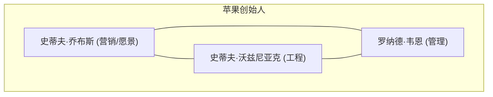
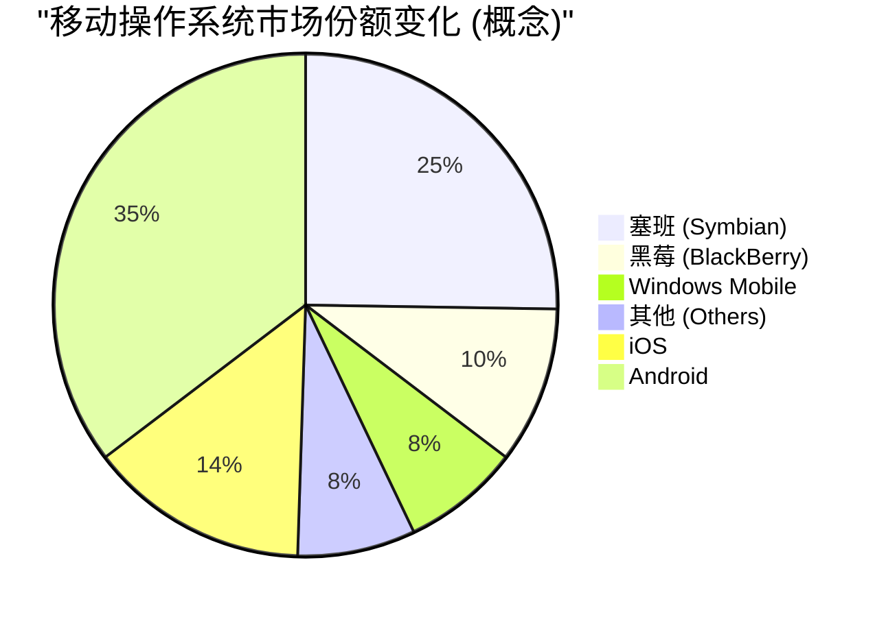

## 1. 创世纪：始于车库的革命 (1976-1980)

1976年，史蒂夫·乔布斯、史蒂夫·沃兹尼亚克和罗纳德·韦恩三人在加利福尼亚州洛思阿图斯乔布斯老家的车库里成立了“苹果电脑公司”（Apple Computer Company）。

他们的第一款产品 **Apple I** 是一款仅提供主板的组装套件。这是沃兹尼亚克天才的硬件设计能力与乔布斯的远见和营销能力融合的瞬间。



### Apple II 的巨大成功
1977年发布的 **Apple II** 是一款革命性的产品，它将键盘集成在塑料外壳中，并能显示彩色图形。随着VisiCalc（世界首款电子表格软件）的出现，Apple II 也渗透到了商业市场，创下了爆炸性的巨大销量。

## 2. 麦金塔与GUI的黎明 (1984)

1984年，苹果发布了 **Macintosh（麦金塔）** 。这是首款配备GUI（图形用户界面）和鼠标的面向普通用户的个人电脑。


作为当时的突破性技术，它引入了位图显示和面向对象编程的概念。

## 3. 黑暗时代与乔布斯的回归 (1985-1997)

1985年，由于公司内部冲突，乔布斯被逐出苹果。此后，苹果进入了低迷期。另一方面，乔布斯创立了NeXT公司和皮克斯（Pixar）公司，并取得了成功。

1996年，苹果在下一代操作系统的开发上陷入僵局，决定收购乔布斯的NeXT公司。1997年，乔布斯回归苹果，并就任临时CEO。

### 从 NeXTSTEP 到 macOS 的演进
NeXT公司的操作系统 **NeXTSTEP** 的技术（Mach内核、Objective-C）成为了后来 Mac OS X（现在的macOS）以及iOS的坚实基础。

```objc
// Objective-C 示例 (源自 NeXTSTEP 的技术)
#import <Foundation/Foundation.h>

@interface Greeting : NSObject
- (void)sayHello;
@end

@implementation Greeting
- (void)sayHello {
    NSLog(@"你好，不同凡想！(Hello, Think Different!)");
}
@end
```

## 4. iMac, iPod, 与 iTunes (1998-2006)

乔布斯大幅精简了产品线，并于1998年发布了 **iMac** 。其半透明（Translucent）的设计震惊了全世界。

2001年，发布了 **iPod** 和 **iTunes** ，给音乐产业带来了革命。“把1000首歌曲装进口袋”的口号，展现了技术与用户体验的完美结合。

## 5. iPhone 革命与移动时代 (2007-2011)

2007年1月，乔布斯发布了 **iPhone** 。
“一部iPod，一部手机，一台互联网通讯器。这些不是三个独立的设备，而是一个设备。”

iPhone采用了多点触控界面，并取消了物理键盘。这是改变人类通讯历史的事件。



## 6. 蒂姆·库克时代与向服务型企业的转变 (2011-至今)

在2011年乔布斯逝世后，蒂姆·库克（Tim Cook）接任了CEO。凭借库克卓越的供应链管理，以及Apple Watch、AirPods等可穿戴设备的成功，苹果成长为全球首家市值突破1万亿、2万亿、3万亿美元的公司。

### Apple Silicon (M1/M2/M3) 的冲击
近年来，苹果完成了从英特尔芯片向自主设计的 **Apple Silicon (ARM架构)** 的过渡。实现了高性能与压倒性功耗效率的兼顾。

$$
\text{每瓦性能} = \frac{\text{计算输出 (FLOPS)}}{\text{功耗 (瓦特)}}
$$

## 7. AI时代的苹果 (Apple Intelligence)

2024年，苹果发布了 **Apple Intelligence** ，正式进军能够理解个人语境的端侧AI领域。在重视隐私的同时，实现了Siri的剧烈进化以及在操作系统层面上对文本生成和图像生成的整合。

## 总结

苹果的历史，是一部始终站在科技与人文十字路口的历史。这家从车库起步的小公司，如今已构建起全世界人们生活中不可或缺的数字生态系统。


## 补充探讨 1: 苹果的经营战略与技术深掘


## 补充探讨 2: 苹果的经营战略与技术深掘


## 补充探讨 3: 苹果的经营战略与技术深掘


## 补充探讨 4: 苹果的经营战略与技术深掘


## 补充探讨 5: 苹果的经营战略与技术深掘


## 补充探讨 6: 苹果的经营战略与技术深掘


## 补充探讨 7: 苹果的经营战略与技术深掘


## 补充探讨 8: 苹果的经营战略与技术深掘


## 补充探讨 9: 苹果的经营战略与技术深掘


