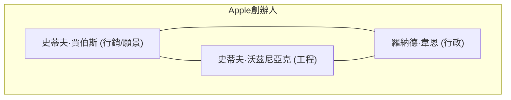
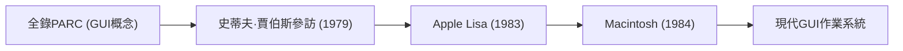
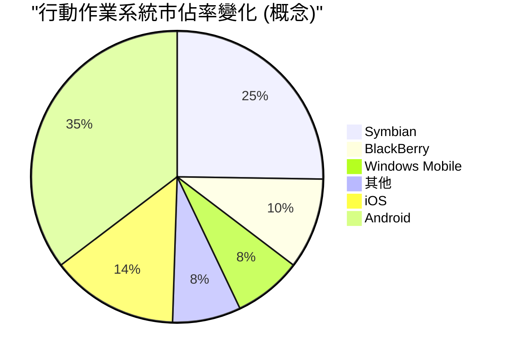

## 1. 創世記：從車庫開始的革命 (1976-1980)

1976年，史蒂夫·賈伯斯、史蒂夫·沃茲尼亞克與羅納德·韋恩三人在加州洛斯阿圖斯賈伯斯老家的車庫裡成立了「Apple Computer Company」。

他們的第一款產品 **Apple I** 是僅提供主機板的組裝套件。這是沃茲尼亞克天才般的硬體設計能力與賈伯斯的遠見及行銷能力完美融合的瞬間。



### Apple II 的大成功
1977年發售的 **Apple II** 是一款將鍵盤整合進塑膠機殼內，並能顯示彩色圖形的劃時代產品。隨著 VisiCalc（世界首款試算表軟體）的登場， **Apple II** 也滲透進了商業市場，創下了爆發性的大熱賣紀錄。

## 2. 麥金塔與GUI的黎明 (1984)

1984年，Apple發售了 **Macintosh（麥金塔）** 。這是首款配備 GUI（圖形使用者介面）與滑鼠的面嚮一般大眾的個人電腦。



作為當時劃時代的技術，點陣圖顯示器與物件導向程式設計的概念被導入其中。

## 3. 暗黑時代與賈伯斯的回歸 (1985-1997)

1985年，因公司內部衝突，賈伯斯被逐出Apple。此後，Apple進入了低迷期。另一方面，賈伯斯創立了NeXT公司與Pixar公司，並取得了成功。

1996年，Apple在次世代作業系統的開發上陷入僵局，決定收購賈伯斯的NeXT公司。1997年賈伯斯回歸Apple，並就任臨時CEO。

### 從NeXTSTEP到macOS的進化
NeXT公司的作業系統 **NeXTSTEP** 的技術（Mach核心、Objective-C），成為了後來 Mac OS X（現在的macOS）以及iOS的堅固基礎。

```objc
// Objective-C 的範例 (源自NeXTSTEP的技術)
#import <Foundation/Foundation.h>

@interface Greeting : NSObject
- (void)sayHello;
@end

@implementation Greeting
- (void)sayHello {
    NSLog(@"Hello, Think Different!");
}
@end
```

## 4. iMac, iPod, 以及 iTunes (1998-2006)

賈伯斯大幅縮減了產品線，並在1998年發表了 **iMac** 。其半透明的設計震驚了全世界。

2001年發表了 **iPod** 與 **iTunes** ，在音樂業界掀起了革命。「把1000首歌裝進口袋」這句廣告標語，展示了技術與使用者體驗的完美融合。

## 5. iPhone革命與行動時代 (2007-2011)

2007年1月，賈伯斯發表了 **iPhone** 。
「iPod、電話、網際網路通訊器。這不是三個獨立的裝置，而是一個裝置。」

iPhone採用了多點觸控介面，並排除了實體鍵盤。這是改變人類通訊歷史的重大事件。



## 6. 提姆·庫克時代與向服務企業的轉型 (2011-現在)

2011年賈伯斯逝世後，提姆·庫克接任了CEO。憑藉庫克卓越的供應鏈管理，以及Apple Watch、AirPods等穿戴式裝置的成功，Apple成長為全球首家市值突破1兆美元、2兆美元、3兆美元的企業。

### Apple Silicon (M1/M2/M3) 的衝擊
近年來，完成了從Intel晶片到自家設計的 **Apple Silicon (ARM架構)** 的過渡。實現了高效能與壓倒性用電效率的兼顧。

$$
\text{每瓦效能} = \frac{\text{運算輸出 (FLOPS)}}{\text{功耗 (瓦特)}}
$$

## 7. AI時代的Apple (Apple Intelligence)

2024年，Apple發表了 **Apple Intelligence** ，正式進軍能理解個人情境的裝置端AI。在重視隱私的同時，將Siri的劇烈進化、文章生成及圖像生成在作業系統層級進行了整合。

## 總結

Apple的歷史，是一部始終站在科技與人文交匯點的歷史。這家從車庫起步的小公司，如今已建構出全世界人們生活中不可或缺的數位生態系統。


## 補充考察 1: 深入探討Apple的經營策略與技術


### 1.1 創世記：從車庫開始的革命 (1976-1980)

1976年，史蒂夫·賈伯斯、史蒂夫·沃茲尼亞克與羅納德·韋恩三人在加州洛斯阿圖斯賈伯斯老家的車庫裡成立了「Apple Computer Company」。

他們的第一款產品 **Apple I** 是僅提供主機板的組裝套件。這是沃茲尼亞克天才般的硬體設計能力與賈伯斯的遠見及行銷能力完美融合的瞬間。


### Apple II 的大成功
1977年發售的 **Apple II** 是一款將鍵盤整合進塑膠機殼內，並能顯示彩色圖形的劃時代產品。隨著 VisiCalc（世界首款試算表軟體）的登場， **Apple II** 也滲透進了商業市場，創下了爆發性的大熱賣紀錄。

### 1.2 麥金塔與GUI的黎明 (1984)

1984年，Apple發售了 **Macintosh（麥金塔）** 。這是首款配備 GUI（圖形使用者介面）與滑鼠的面嚮一般大眾的個人電腦。


作為當時劃時代的技術，點陣圖顯示器與物件導向程式設計的概念被導入其中。

## 3. 暗黑時代與賈伯斯的回歸 (1985-1997)

1985年，因公司內部衝突，賈伯斯被逐出Apple。此後，Apple進入了低迷期。另一方面，賈伯斯創立了NeXT公司與Pixar公司，並取得了成功。

1996年，Apple在次世代作業系統的開發上陷入僵局，決定收購賈伯斯的NeXT公司。1997年賈伯斯回歸Apple，並就任臨時CEO。

### 從NeXTSTEP到macOS的進化
NeXT公司的作業系統 **NeXTSTEP** 的技術（Mach核心、Objective-C），成為了後來 Mac OS X（現在的macOS）以及iOS的堅固基礎。

```objc
// Objective-C 的範例 (源自NeXTSTEP的技術)
#import <Foundation/Foundation.h>

@interface Greeting : NSObject
- (void)sayHello;
@end

@implementation Greeting
- (void)sayHello {
    NSLog(@"Hello, Think Different!");
}
@end
```

## 4. iMac, iPod, 以及 iTunes (1998-2006)

賈伯斯大幅縮減了產品線，並在1998年發表了 **iMac** 。其半透明的設計震驚了全世界。

2001年發表了 **iPod** 與 **iTunes** ，在音樂業界掀起了革命。「把1000首歌裝進口袋」這句廣告標語，展示了技術與使用者體驗的完美融合。

## 5. iPhone革命與行動時代 (2007-2011)

2007年1月，賈伯斯發表了 **iPhone** 。
「iPod、電話、網際網路通訊器。這不是三個獨立的裝置，而是一個裝置。」

iPhone採用了多點觸控介面，並排除了實體鍵盤。這是改變人類通訊歷史的重大事件。


## 6. 提姆·庫克時代與向服務企業的轉型 (2011-現在)

2011年賈伯斯逝世後，提姆·庫克接任了CEO。憑藉庫克卓越的供應鏈管理，以及Apple Watch、AirPods等穿戴式裝置的成功，Apple成長為全球首家市值突破1兆美元、2兆美元、3兆美元的企業。

### Apple Silicon (M1/M2/M3) 的衝擊
近年來，完成了從Intel晶片到自家設計的 **Apple Silicon (ARM架構)** 的過渡。實現了高效能與壓倒性用電效率的兼顧。

$$
\text{每瓦效能} = \frac{\text{運算輸出 (FLOPS)}}{\text{功耗 (瓦特)}}
$$

## 7. AI時代的Apple (Apple Intelligence)

2024年，Apple發表了 **Apple Intelligence** ，正式進軍能理解個人情境的裝置端AI。在重視隱私的同時，將Siri的劇烈進化、文章生成及圖像生成在作業系統層級進行了整合。

## 總結

Apple的歷史，是一部始終站在科技與人文交匯點的歷史。這家從車庫起步的小公司，如今已建構出全世界人們生活中不可或缺的數位生態系統。


## 補充考察 2: 深入探討Apple的經營策略與技術


#### 2.21 創世記：從車庫開始的革命 (1976-1980)

1976年，史蒂夫·賈伯斯、史蒂夫·沃茲尼亞克與羅納德·韋恩三人在加州洛斯阿圖斯賈伯斯老家的車庫裡成立了「Apple Computer Company」。

他們的第一款產品 **Apple I** 是僅提供主機板的組裝套件。這是沃茲尼亞克天才般的硬體設計能力與賈伯斯的遠見及行銷能力完美融合的瞬間。


### Apple II 的大成功
1977年發售的 **Apple II** 是一款將鍵盤整合進塑膠機殼內，並能顯示彩色圖形的劃時代產品。隨著 VisiCalc（世界首款試算表軟體）的登場， **Apple II** 也滲透進了商業市場，創下了爆發性的大熱賣紀錄。

### 2.2 麥金塔與GUI的黎明 (1984)

1984年，Apple發售了 **Macintosh（麥金塔）** 。這是首款配備 GUI（圖形使用者介面）與滑鼠的面嚮一般大眾的個人電腦。


作為當時劃時代的技術，點陣圖顯示器與物件導向程式設計的概念被導入其中。

## 3. 暗黑時代與賈伯斯的回歸 (1985-1997)

1985年，因公司內部衝突，賈伯斯被逐出Apple。此後，Apple進入了低迷期。另一方面，賈伯斯創立了NeXT公司與Pixar公司，並取得了成功。

1996年，Apple在次世代作業系統的開發上陷入僵局，決定收購賈伯斯的NeXT公司。1997年賈伯斯回歸Apple，並就任臨時CEO。

### 從NeXTSTEP到macOS的進化
NeXT公司的作業系統 **NeXTSTEP** 的技術（Mach核心、Objective-C），成為了後來 Mac OS X（現在的macOS）以及iOS的堅固基礎。

```objc
// Objective-C 的範例 (源自NeXTSTEP的技術)
#import <Foundation/Foundation.h>

@interface Greeting : NSObject
- (void)sayHello;
@end

@implementation Greeting
- (void)sayHello {
    NSLog(@"Hello, Think Different!");
}
@end
```

## 4. iMac, iPod, 以及 iTunes (1998-2006)

賈伯斯大幅縮減了產品線，並在1998年發表了 **iMac** 。其半透明的設計震驚了全世界。

2001年發表了 **iPod** 與 **iTunes** ，在音樂業界掀起了革命。「把1000首歌裝進口袋」這句廣告標語，展示了技術與使用者體驗的完美融合。

## 5. iPhone革命與行動時代 (2007-2011)

2007年1月，賈伯斯發表了 **iPhone** 。
「iPod、電話、網際網路通訊器。這不是三個獨立的裝置，而是一個裝置。」

iPhone採用了多點觸控介面，並排除了實體鍵盤。這是改變人類通訊歷史的重大事件。


## 6. 提姆·庫克時代與向服務企業的轉型 (2011-現在)

2011年賈伯斯逝世後，提姆·庫克接任了CEO。憑藉庫克卓越的供應鏈管理，以及Apple Watch、AirPods等穿戴式裝置的成功，Apple成長為全球首家市值突破1兆美元、2兆美元、3兆美元的企業。

### Apple Silicon (M1/M2/M3) 的衝擊
近年來，完成了從Intel晶片到自家設計的 **Apple Silicon (ARM架構)** 的過渡。實現了高效能與壓倒性用電效率的兼顧。

$$
\text{每瓦效能} = \frac{\text{運算輸出 (FLOPS)}}{\text{功耗 (瓦特)}}
$$

## 7. AI時代的Apple (Apple Intelligence)

2024年，Apple發表了 **Apple Intelligence** ，正式進軍能理解個人情境的裝置端AI。在重視隱私的同時，將Siri的劇烈進化、文章生成及圖像生成在作業系統層級進行了整合。

## 總結

Apple的歷史，是一部始終站在科技與人文交匯點的歷史。這家從車庫起步的小公司，如今已建構出全世界人們生活中不可或缺的數位生態系統。


## 補充考察 3: 深入探討Apple的經營策略與技術


### 3.1 創世記：從車庫開始的革命 (1976-1980)

1976年，史蒂夫·賈伯斯、史蒂夫·沃茲尼亞克與羅納德·韋恩三人在加州洛斯阿圖斯賈伯斯老家的車庫裡成立了「Apple Computer Company」。

他們的第一款產品 **Apple I** 是僅提供主機板的組裝套件。這是沃茲尼亞克天才般的硬體設計能力與賈伯斯的遠見及行銷能力完美融合的瞬間。


### Apple II 的大成功
1977年發售的 **Apple II** 是一款將鍵盤整合進塑膠機殼內，並能顯示彩色圖形的劃時代產品。隨著 VisiCalc（世界首款試算表軟體）的登場， **Apple II** 也滲透進了商業市場，創下了爆發性的大熱賣紀錄。

### 3.2 麥金塔與GUI的黎明 (1984)

1984年，Apple發售了 **Macintosh（麥金塔）** 。這是首款配備 GUI（圖形使用者介面）與滑鼠的面嚮一般大眾的個人電腦。


作為當時劃時代的技術，點陣圖顯示器與物件導向程式設計的概念被導入其中。

## 3. 暗黑時代與賈伯斯的回歸 (1985-1997)

1985年，因公司內部衝突，賈伯斯被逐出Apple。此後，Apple進入了低迷期。另一方面，賈伯斯創立了NeXT公司與Pixar公司，並取得了成功。

1996年，Apple在次世代作業系統的開發上陷入僵局，決定收購賈伯斯的NeXT公司。1997年賈伯斯回歸Apple，並就任臨時CEO。

### 從NeXTSTEP到macOS的進化
NeXT公司的作業系統 **NeXTSTEP** 的技術（Mach核心、Objective-C），成為了後來 Mac OS X（現在的macOS）以及iOS的堅固基礎。

```objc
// Objective-C 的範例 (源自NeXTSTEP的技術)
#import <Foundation/Foundation.h>

@interface Greeting : NSObject
- (void)sayHello;
@end

@implementation Greeting
- (void)sayHello {
    NSLog(@"Hello, Think Different!");
}
@end
```

## 4. iMac, iPod, 以及 iTunes (1998-2006)

賈伯斯大幅縮減了產品線，並在1998年發表了 **iMac** 。其半透明的設計震驚了全世界。

2001年發表了 **iPod** 與 **iTunes** ，在音樂業界掀起了革命。「把1000首歌裝進口袋」這句廣告標語，展示了技術與使用者體驗的完美融合。

## 5. iPhone革命與行動時代 (2007-2011)

2007年1月，賈伯斯發表了 **iPhone** 。
「iPod、電話、網際網路通訊器。這不是三個獨立的裝置，而是一個裝置。」

iPhone採用了多點觸控介面，並排除了實體鍵盤。這是改變人類通訊歷史的重大事件。


## 6. 提姆·庫克時代與向服務企業的轉型 (2011-現在)

2011年賈伯斯逝世後，提姆·庫克接任了CEO。憑藉庫克卓越的供應鏈管理，以及Apple Watch、AirPods等穿戴式裝置的成功，Apple成長為全球首家市值突破1兆美元、2兆美元、3兆美元的企業。

### Apple Silicon (M1/M2/M3) 的衝擊
近年來，完成了從Intel晶片到自家設計的 **Apple Silicon (ARM架構)** 的過渡。實現了高效能與壓倒性用電效率的兼顧。

$$
\text{每瓦效能} = \frac{\text{運算輸出 (FLOPS)}}{\text{功耗 (瓦特)}}
$$

## 7. AI時代的Apple (Apple Intelligence)

2024年，Apple發表了 **Apple Intelligence** ，正式進軍能理解個人情境的裝置端AI。在重視隱私的同時，將Siri的劇烈進化、文章生成及圖像生成在作業系統層級進行了整合。

## 總結

Apple的歷史，是一部始終站在科技與人文交匯點的歷史。這家從車庫起步的小公司，如今已建構出全世界人們生活中不可或缺的數位生態系統。


## 補充考察 4: 深入探討Apple的經營策略與技術


### 4.1 創世記：從車庫開始的革命 (1976-1980)

1976年，史蒂夫·賈伯斯、史蒂夫·沃茲尼亞克與羅納德·韋恩三人在加州洛斯阿圖斯賈伯斯老家的車庫裡成立了「Apple Computer Company」。

他們的第一款產品 **Apple I** 是僅提供主機板的組裝套件。這是沃茲尼亞克天才般的硬體設計能力與賈伯斯的遠見及行銷能力完美融合的瞬間。


### Apple II 的大成功
1977年發售的 **Apple II** 是一款將鍵盤整合進塑膠機殼內，並能顯示彩色圖形的劃時代產品。隨著 VisiCalc（世界首款試算表軟體）的登場， **Apple II** 也滲透進了商業市場，創下了爆發性的大熱賣紀錄。

### 4.2 麥金塔與GUI的黎明 (1984)

1984年，Apple發售了 **Macintosh（麥金塔）** 。這是首款配備 GUI（圖形使用者介面）與滑鼠的面嚮一般大眾的個人電腦。


作為當時劃時代的技術，點陣圖顯示器與物件導向程式設計的概念被導入其中。

## 3. 暗黑時代與賈伯斯的回歸 (1985-1997)

1985年，因公司內部衝突，賈伯斯被逐出Apple。此後，Apple進入了低迷期。另一方面，賈伯斯創立了NeXT公司與Pixar公司，並取得了成功。

1996年，Apple在次世代作業系統的開發上陷入僵局，決定收購賈伯斯的NeXT公司。1997年賈伯斯回歸Apple，並就任臨時CEO。

### 從NeXTSTEP到macOS的進化
NeXT公司的作業系統 **NeXTSTEP** 的技術（Mach核心、Objective-C），成為了後來 Mac OS X（現在的macOS）以及iOS的堅固基礎。

```objc
// Objective-C 的範例 (源自NeXTSTEP的技術)
#import <Foundation/Foundation.h>

@interface Greeting : NSObject
- (void)sayHello;
@end

@implementation Greeting
- (void)sayHello {
    NSLog(@"Hello, Think Different!");
}
@end
```

## 4. iMac, iPod, 以及 iTunes (1998-2006)

賈伯斯大幅縮減了產品線，並在1998年發表了 **iMac** 。其半透明的設計震驚了全世界。

2001年發表了 **iPod** 與 **iTunes** ，在音樂業界掀起了革命。「把1000首歌裝進口袋」這句廣告標語，展示了技術與使用者體驗的完美融合。

## 5. iPhone革命與行動時代 (2007-2011)

2007年1月，賈伯斯發表了 **iPhone** 。
「iPod、電話、網際網路通訊器。這不是三個獨立的裝置，而是一個裝置。」

iPhone採用了多點觸控介面，並排除了實體鍵盤。這是改變人類通訊歷史的重大事件。


## 6. 提姆·庫克時代與向服務企業的轉型 (2011-現在)

2011年賈伯斯逝世後，提姆·庫克接任了CEO。憑藉庫克卓越的供應鏈管理，以及Apple Watch、AirPods等穿戴式裝置的成功，Apple成長為全球首家市值突破1兆美元、2兆美元、3兆美元的企業。

### Apple Silicon (M1/M2/M3) 的衝擊
近年來，完成了從Intel晶片到自家設計的 **Apple Silicon (ARM架構)** 的過渡。實現了高效能與壓倒性用電效率的兼顧。

$$
\text{每瓦效能} = \frac{\text{運算輸出 (FLOPS)}}{\text{功耗 (瓦特)}}
$$

## 7. AI時代的Apple (Apple Intelligence)

2024年，Apple發表了 **Apple Intelligence** ，正式進軍能理解個人情境的裝置端AI。在重視隱私的同時，將Siri的劇烈進化、文章生成及圖像生成在作業系統層級進行了整合。

## 總結

Apple的歷史，是一部始終站在科技與人文交匯點的歷史。這家從車庫起步的小公司，如今已建構出全世界人們生活中不可或缺的數位生態系統。


## 補充考察 5: 深入探討Apple的經營策略與技術


### 5.1 創世記：從車庫開始的革命 (1976-1980)

1976年，史蒂夫·賈伯斯、史蒂夫·沃茲尼亞克與羅納德·韋恩三人在加州洛斯阿圖斯賈伯斯老家的車庫裡成立了「Apple Computer Company」。

他們的第一款產品 **Apple I** 是僅提供主機板的組裝套件。這是沃茲尼亞克天才般的硬體設計能力與賈伯斯的遠見及行銷能力完美融合的瞬間。


### Apple II 的大成功
1977年發售的 **Apple II** 是一款將鍵盤整合進塑膠機殼內，並能顯示彩色圖形的劃時代產品。隨著 VisiCalc（世界首款試算表軟體）的登場， **Apple II** 也滲透進了商業市場，創下了爆發性的大熱賣紀錄。

### 5.2 麥金塔與GUI的黎明 (1984)

1984年，Apple發售了 **Macintosh（麥金塔）** 。這是首款配備 GUI（圖形使用者介面）與滑鼠的面嚮一般大眾的個人電腦。


作為當時劃時代的技術，點陣圖顯示器與物件導向程式設計的概念被導入其中。

## 3. 暗黑時代與賈伯斯的回歸 (1985-1997)

1985年，因公司內部衝突，賈伯斯被逐出Apple。此後，Apple進入了低迷期。另一方面，賈伯斯創立了NeXT公司與Pixar公司，並取得了成功。

1996年，Apple在次世代作業系統的開發上陷入僵局，決定收購賈伯斯的NeXT公司。1997年賈伯斯回歸Apple，並就任臨時CEO。

### 從NeXTSTEP到macOS的進化
NeXT公司的作業系統 **NeXTSTEP** 的技術（Mach核心、Objective-C），成為了後來 Mac OS X（現在的macOS）以及iOS的堅固基礎。

```objc
// Objective-C 的範例 (源自NeXTSTEP的技術)
#import <Foundation/Foundation.h>

@interface Greeting : NSObject
- (void)sayHello;
@end

@implementation Greeting
- (void)sayHello {
    NSLog(@"Hello, Think Different!");
}
@end
```

## 4. iMac, iPod, 以及 iTunes (1998-2006)

賈伯斯大幅縮減了產品線，並在1998年發表了 **iMac** 。其半透明的設計震驚了全世界。

2001年發表了 **iPod** 與 **iTunes** ，在音樂業界掀起了革命。「把1000首歌裝進口袋」這句廣告標語，展示了技術與使用者體驗的完美融合。

## 5. iPhone革命與行動時代 (2007-2011)

2007年1月，賈伯斯發表了 **iPhone** 。
「iPod、電話、網際網路通訊器。這不是三個獨立的裝置，而是一個裝置。」

iPhone採用了多點觸控介面，並排除了實體鍵盤。這是改變人類通訊歷史的重大事件。


## 6. 提姆·庫克時代與向服務企業的轉型 (2011-現在)

2011年賈伯斯逝世後，提姆·庫克接任了CEO。憑藉庫克卓越的供應鏈管理，以及Apple Watch、AirPods等穿戴式裝置的成功，Apple成長為全球首家市值突破1兆美元、2兆美元、3兆美元的企業。

### Apple Silicon (M1/M2/M3) 的衝擊
近年來，完成了從Intel晶片到自家設計的 **Apple Silicon (ARM架構)** 的過渡。實現了高效能與壓倒性用電效率的兼顧。

$$
\text{每瓦效能} = \frac{\text{運算輸出 (FLOPS)}}{\text{功耗 (瓦特)}}
$$

## 7. AI時代的Apple (Apple Intelligence)

2024年，Apple發表了 **Apple Intelligence** ，正式進軍能理解個人情境的裝置端AI。在重視隱私的同時，將Siri的劇烈進化、文章生成及圖像生成在作業系統層級進行了整合。

## 總結

Apple的歷史，是一部始終站在科技與人文交匯點的歷史。這家從車庫起步的小公司，如今已建構出全世界人們生活中不可或缺的數位生態系統。


## 補充考察 6: 深入探討Apple的經營策略與技術


### 6.1 創世記：從車庫開始的革命 (1976-1980)

1976年，史蒂夫·賈伯斯、史蒂夫·沃茲尼亞克與羅納德·韋恩三人在加州洛斯阿圖斯賈伯斯老家的車庫裡成立了「Apple Computer Company」。

他們的第一款產品 **Apple I** 是僅提供主機板的組裝套件。這是沃茲尼亞克天才般的硬體設計能力與賈伯斯的遠見及行銷能力完美融合的瞬間。


### Apple II 的大成功
1977年發售的 **Apple II** 是一款將鍵盤整合進塑膠機殼內，並能顯示彩色圖形的劃時代產品。隨著 VisiCalc（世界首款試算表軟體）的登場， **Apple II** 也滲透進了商業市場，創下了爆發性的大熱賣紀錄。

### 6.2 麥金塔與GUI的黎明 (1984)

1984年，Apple發售了 **Macintosh（麥金塔）** 。這是首款配備 GUI（圖形使用者介面）與滑鼠的面嚮一般大眾的個人電腦。


作為當時劃時代的技術，點陣圖顯示器與物件導向程式設計的概念被導入其中。

## 3. 暗黑時代與賈伯斯的回歸 (1985-1997)

1985年，因公司內部衝突，賈伯斯被逐出Apple。此後，Apple進入了低迷期。另一方面，賈伯斯創立了NeXT公司與Pixar公司，並取得了成功。

1996年，Apple在次世代作業系統的開發上陷入僵局，決定收購賈伯斯的NeXT公司。1997年賈伯斯回歸Apple，並就任臨時CEO。

### 從NeXTSTEP到macOS的進化
NeXT公司的作業系統 **NeXTSTEP** 的技術（Mach核心、Objective-C），成為了後來 Mac OS X（現在的macOS）以及iOS的堅固基礎。

```objc
// Objective-C 的範例 (源自NeXTSTEP的技術)
#import <Foundation/Foundation.h>

@interface Greeting : NSObject
- (void)sayHello;
@end

@implementation Greeting
- (void)sayHello {
    NSLog(@"Hello, Think Different!");
}
@end
```

## 4. iMac, iPod, 以及 iTunes (1998-2006)

賈伯斯大幅縮減了產品線，並在1998年發表了 **iMac** 。其半透明的設計震驚了全世界。

2001年發表了 **iPod** 與 **iTunes** ，在音樂業界掀起了革命。「把1000首歌裝進口袋」這句廣告標語，展示了技術與使用者體驗的完美融合。

## 5. iPhone革命與行動時代 (2007-2011)

2007年1月，賈伯斯發表了 **iPhone** 。
「iPod、電話、網際網路通訊器。這不是三個獨立的裝置，而是一個裝置。」

iPhone採用了多點觸控介面，並排除了實體鍵盤。這是改變人類通訊歷史的重大事件。

```mermaid
pie title "行動作業系統市佔率變化 (概念)"
    "Symbian" : 50
    "BlackBerry" : 20
    "Windows Mobile" : 15
    "其他" : 15
    %% ↓ iPhone/Android出現後
    "iOS" : 28
    "Android" : 70
    "其他" : 2
```

## 6. 提姆·庫克時代與向服務企業的轉型 (2011-現在)

2011年賈伯斯逝世後，提姆·庫克接任了CEO。憑藉庫克卓越的供應鏈管理，以及Apple Watch、AirPods等穿戴式裝置的成功，Apple成長為全球首家市值突破1兆美元、2兆美元、3兆美元的企業。

### Apple Silicon (M1/M2/M3) 的衝擊
近年來，完成了從Intel晶片到自家設計的 **Apple Silicon (ARM架構)** 的過渡。實現了高效能與壓倒性用電效率的兼顧。

$$
\text{每瓦效能} = \frac{\text{運算輸出 (FLOPS)}}{\text{功耗 (瓦特)}}
$$

## 7. AI時代的Apple (Apple Intelligence)

2024年，Apple發表了 **Apple Intelligence** ，正式進軍能理解個人情境的裝置端AI。在重視隱私的同時，將Siri的劇烈進化、文章生成及圖像生成在作業系統層級進行了整合。

## 總結

Apple的歷史，是一部始終站在科技與人文交匯點的歷史。這家從車庫起步的小公司，如今已建構出全世界人們生活中不可或缺的數位生態系統。


## 補充考察 7: 深入探討Apple的經營策略與技術


### 7.1 創世記：從車庫開始的革命 (1976-1980)

1976年，史蒂夫·賈伯斯、史蒂夫·沃茲尼亞克與羅納德·韋恩三人在加州洛斯阿圖斯賈伯斯老家的車庫裡成立了「Apple Computer Company」。

他們的第一款產品 **Apple I** 是僅提供主機板的組裝套件。這是沃茲尼亞克天才般的硬體設計能力與賈伯斯的遠見及行銷能力完美融合的瞬間。

```mermaid
graph TD
    subgraph "Apple創辦人"
        SJ["史蒂夫·賈伯斯 (行銷/願景)"]
        SW["史蒂夫·沃茲尼亞克 (工程)"]
        RW["羅納德·韋恩 (行政)"]
        SJ --- SW
        SJ --- RW
        SW --- RW
    end
```

### Apple II 的大成功
1977年發售的 **Apple II** 是一款將鍵盤整合進塑膠機殼內，並能顯示彩色圖形的劃時代產品。隨著 VisiCalc（世界首款試算表軟體）的登場， **Apple II** 也滲透進了商業市場，創下了爆發性的大熱賣紀錄。

### 7.2 麥金塔與GUI的黎明 (1984)

1984年，Apple發售了 **Macintosh（麥金塔）** 。這是首款配備 GUI（圖形使用者介面）與滑鼠的面嚮一般大眾的個人電腦。

```mermaid
flowchart LR
    Xerox["全錄PARC (GUI概念)"] --> Jobs["史蒂夫·賈伯斯參訪 (1979)"]
    Jobs --> Lisa["Apple Lisa (1983)"]
    Lisa --> Mac["Macintosh (1984)"]
    Mac --> Modern["現代GUI作業系統"]
```

作為當時劃時代的技術，點陣圖顯示器與物件導向程式設計的概念被導入其中。

## 3. 暗黑時代與賈伯斯的回歸 (1985-1997)

1985年，因公司內部衝突，賈伯斯被逐出Apple。此後，Apple進入了低迷期。另一方面，賈伯斯創立了NeXT公司與Pixar公司，並取得了成功。

1996年，Apple在次世代作業系統的開發上陷入僵局，決定收購賈伯斯的NeXT公司。1997年賈伯斯回歸Apple，並就任臨時CEO。

### 從NeXTSTEP到macOS的進化
NeXT公司的作業系統 **NeXTSTEP** 的技術（Mach核心、Objective-C），成為了後來 Mac OS X（現在的macOS）以及iOS的堅固基礎。

```objc
// Objective-C 的範例 (源自NeXTSTEP的技術)
#import <Foundation/Foundation.h>

@interface Greeting : NSObject
- (void)sayHello;
@end

@implementation Greeting
- (void)sayHello {
    NSLog(@"Hello, Think Different!");
}
@end
```

## 4. iMac, iPod, 以及 iTunes (1998-2006)

賈伯斯大幅縮減了產品線，並在1998年發表了 **iMac** 。其半透明的設計震驚了全世界。

2001年發表了 **iPod** 與 **iTunes** ，在音樂業界掀起了革命。「把1000首歌裝進口袋」這句廣告標語，展示了技術與使用者體驗的完美融合。

## 5. iPhone革命與行動時代 (2007-2011)

2007年1月，賈伯斯發表了 **iPhone** 。
「iPod、電話、網際網路通訊器。這不是三個獨立的裝置，而是一個裝置。」

iPhone採用了多點觸控介面，並排除了實體鍵盤。這是改變人類通訊歷史的重大事件。

```mermaid
pie title "行動作業系統市佔率變化 (概念)"
    "Symbian" : 50
    "BlackBerry" : 20
    "Windows Mobile" : 15
    "其他" : 15
    %% ↓ iPhone/Android出現後
    "iOS" : 28
    "Android" : 70
    "其他" : 2
```

## 6. 提姆·庫克時代與向服務企業的轉型 (2011-現在)

2011年賈伯斯逝世後，提姆·庫克接任了CEO。憑藉庫克卓越的供應鏈管理，以及Apple Watch、AirPods等穿戴式裝置的成功，Apple成長為全球首家市值突破1兆美元、2兆美元、3兆美元的企業。

### Apple Silicon (M1/M2/M3) 的衝擊
近年來，完成了從Intel晶片到自家設計的 **Apple Silicon (ARM架構)** 的過渡。實現了高效能與壓倒性用電效率的兼顧。

$$
\text{每瓦效能} = \frac{\text{運算輸出 (FLOPS)}}{\text{功耗 (瓦特)}}
$$

## 7. AI時代的Apple (Apple Intelligence)

2024年，Apple發表了 **Apple Intelligence** ，正式進軍能理解個人情境的裝置端AI。在重視隱私的同時，將Siri的劇烈進化、文章生成及圖像生成在作業系統層級進行了整合。

## 總結

Apple的歷史，是一部始終站在科技與人文交匯點的歷史。這家從車庫起步的小公司，如今已建構出全世界人們生活中不可或缺的數位生態系統。


## 補充考察 8: 深入探討Apple的經營策略與技術


### 8.1 創世記：從車庫開始的革命 (1976-1980)

1976年，史蒂夫·賈伯斯、史蒂夫·沃茲尼亞克與羅納德·韋恩三人在加州洛斯阿圖斯賈伯斯老家的車庫裡成立了「Apple Computer Company」。

他們的第一款產品 **Apple I** 是僅提供主機板的組裝套件。這是沃茲尼亞克天才般的硬體設計能力與賈伯斯的遠見及行銷能力完美融合的瞬間。

```mermaid
graph TD
    subgraph "Apple創辦人"
        SJ["史蒂夫·賈伯斯 (行銷/願景)"]
        SW["史蒂夫·沃茲尼亞克 (工程)"]
        RW["羅納德·韋恩 (行政)"]
        SJ --- SW
        SJ --- RW
        SW --- RW
    end
```

### Apple II 的大成功
1977年發售的 **Apple II** 是一款將鍵盤整合進塑膠機殼內，並能顯示彩色圖形的劃時代產品。隨著 VisiCalc（世界首款試算表軟體）的登場， **Apple II** 也滲透進了商業市場，創下了爆發性的大熱賣紀錄。

### 8.2 麥金塔與GUI的黎明 (1984)

1984年，Apple發售了 **Macintosh（麥金塔）** 。這是首款配備 GUI（圖形使用者介面）與滑鼠的面嚮一般大眾的個人電腦。

```mermaid
flowchart LR
    Xerox["全錄PARC (GUI概念)"] --> Jobs["史蒂夫·賈伯斯參訪 (1979)"]
    Jobs --> Lisa["Apple Lisa (1983)"]
    Lisa --> Mac["Macintosh (1984)"]
    Mac --> Modern["現代GUI作業系統"]
```

作為當時劃時代的技術，點陣圖顯示器與物件導向程式設計的概念被導入其中。

## 3. 暗黑時代與賈伯斯的回歸 (1985-1997)

1985年，因公司內部衝突，賈伯斯被逐出Apple。此後，Apple進入了低迷期。另一方面，賈伯斯創立了NeXT公司與Pixar公司，並取得了成功。

1996年，Apple在次世代作業系統的開發上陷入僵局，決定收購賈伯斯的NeXT公司。1997年賈伯斯回歸Apple，並就任臨時CEO。

### 從NeXTSTEP到macOS的進化
NeXT公司的作業系統 **NeXTSTEP** 的技術（Mach核心、Objective-C），成為了後來 Mac OS X（現在的macOS）以及iOS的堅固基礎。

```objc
// Objective-C 的範例 (源自NeXTSTEP的技術)
#import <Foundation/Foundation.h>

@interface Greeting : NSObject
- (void)sayHello;
@end

@implementation Greeting
- (void)sayHello {
    NSLog(@"Hello, Think Different!");
}
@end
```

## 4. iMac, iPod, 以及 iTunes (1998-2006)

賈伯斯大幅縮減了產品線，並在1998年發表了 **iMac** 。其半透明的設計震驚了全世界。

2001年發表了 **iPod** 與 **iTunes** ，在音樂業界掀起了革命。「把1000首歌裝進口袋」這句廣告標語，展示了技術與使用者體驗的完美融合。

## 5. iPhone革命與行動時代 (2007-2011)

2007年1月，賈伯斯發表了 **iPhone** 。
「iPod、電話、網際網路通訊器。這不是三個獨立的裝置，而是一個裝置。」

iPhone採用了多點觸控介面，並排除了實體鍵盤。這是改變人類通訊歷史的重大事件。

```mermaid
pie title "行動作業系統市佔率變化 (概念)"
    "Symbian" : 50
    "BlackBerry" : 20
    "Windows Mobile" : 15
    "其他" : 15
    %% ↓ iPhone/Android出現後
    "iOS" : 28
    "Android" : 70
    "其他" : 2
```

## 6. 提姆·庫克時代與向服務企業的轉型 (2011-現在)

2011年賈伯斯逝世後，提姆·庫克接任了CEO。憑藉庫克卓越的供應鏈管理，以及Apple Watch、AirPods等穿戴式裝置的成功，Apple成長為全球首家市值突破1兆美元、2兆美元、3兆美元的企業。

### Apple Silicon (M1/M2/M3) 的衝擊
近年來，完成了從Intel晶片到自家設計的 **Apple Silicon (ARM架構)** 的過渡。實現了高效能與壓倒性用電效率的兼顧。

$$
\text{每瓦效能} = \frac{\text{運算輸出 (FLOPS)}}{\text{功耗 (瓦特)}}
$$

## 7. AI時代的Apple (Apple Intelligence)

2024年，Apple發表了 **Apple Intelligence** ，正式進軍能理解個人情境的裝置端AI。在重視隱私的同時，將Siri的劇烈進化、文章生成及圖像生成在作業系統層級進行了整合。

## 總結

Apple的歷史，是一部始終站在科技與人文交匯點的歷史。這家從車庫起步的小公司，如今已建構出全世界人們生活中不可或缺的數位生態系統。


## 補充考察 9: 深入探討Apple的經營策略與技術


### 9.1 創世記：從車庫開始的革命 (1976-1980)

1976年，史蒂夫·賈伯斯、史蒂夫·沃茲尼亞克與羅納德·韋恩三人在加州洛斯阿圖斯賈伯斯老家的車庫裡成立了「Apple Computer Company」。

他們的第一款產品 **Apple I** 是僅提供主機板的組裝套件。這是沃茲尼亞克天才般的硬體設計能力與賈伯斯的遠見及行銷能力完美融合的瞬間。

```mermaid
graph TD
    subgraph "Apple創辦人"
        SJ["史蒂夫·賈伯斯 (行銷/願景)"]
        SW["史蒂夫·沃茲尼亞克 (工程)"]
        RW["羅納德·韋恩 (行政)"]
        SJ --- SW
        SJ --- RW
        SW --- RW
    end
```

### Apple II 的大成功
1977年發售的 **Apple II** 是一款將鍵盤整合進塑膠機殼內，並能顯示彩色圖形的劃時代產品。隨著 VisiCalc（世界首款試算表軟體）的登場， **Apple II** 也滲透進了商業市場，創下了爆發性的大熱賣紀錄。

### 9.2 麥金塔與GUI的黎明 (1984)

1984年，Apple發售了 **Macintosh（麥金塔）** 。這是首款配備 GUI（圖形使用者介面）與滑鼠的面嚮一般大眾的個人電腦。

```mermaid
flowchart LR
    Xerox["全錄PARC (GUI概念)"] --> Jobs["史蒂夫·賈伯斯參訪 (1979)"]
    Jobs --> Lisa["Apple Lisa (1983)"]
    Lisa --> Mac["Macintosh (1984)"]
    Mac --> Modern["現代GUI作業系統"]
```

作為當時劃時代的技術，點陣圖顯示器與物件導向程式設計的概念被導入其中。

## 3. 暗黑時代與賈伯斯的回歸 (1985-1997)

1985年，因公司內部衝突，賈伯斯被逐出Apple。此後，Apple進入了低迷期。另一方面，賈伯斯創立了NeXT公司與Pixar公司，並取得了成功。

1996年，Apple在次世代作業系統的開發上陷入僵局，決定收購賈伯斯的NeXT公司。1997年賈伯斯回歸Apple，並就任臨時CEO。

### 從NeXTSTEP到macOS的進化
NeXT公司的作業系統 **NeXTSTEP** 的技術（Mach核心、Objective-C），成為了後來 Mac OS X（現在的macOS）以及iOS的堅固基礎。

```objc
// Objective-C 的範例 (源自NeXTSTEP的技術)
#import <Foundation/Foundation.h>

@interface Greeting : NSObject
- (void)sayHello;
@end

@implementation Greeting
- (void)sayHello {
    NSLog(@"Hello, Think Different!");
}
@end
```

## 4. iMac, iPod, 以及 iTunes (1998-2006)

賈伯斯大幅縮減了產品線，並在1998年發表了 **iMac** 。其半透明的設計震驚了全世界。

2001年發表了 **iPod** 與 **iTunes** ，在音樂業界掀起了革命。「把1000首歌裝進口袋」這句廣告標語，展示了技術與使用者體驗的完美融合。

## 5. iPhone革命與行動時代 (2007-2011)

2007年1月，賈伯斯發表了 **iPhone** 。
「iPod、電話、網際網路通訊器。這不是三個獨立的裝置，而是一個裝置。」

iPhone採用了多點觸控介面，並排除了實體鍵盤。這是改變人類通訊歷史的重大事件。

```mermaid
pie title "行動作業系統市佔率變化 (概念)"
    "Symbian" : 50
    "BlackBerry" : 20
    "Windows Mobile" : 15
    "其他" : 15
    %% ↓ iPhone/Android出現後
    "iOS" : 28
    "Android" : 70
    "其他" : 2
```

## 6. 提姆·庫克時代與向服務企業的轉型 (2011-現在)

2011年賈伯斯逝世後，提姆·庫克接任了CEO。憑藉庫克卓越的供應鏈管理，以及Apple Watch、AirPods等穿戴式裝置的成功，Apple成長為全球首家市值突破1兆美元、2兆美元、3兆美元的企業。

### Apple Silicon (M1/M2/M3) 的衝擊
近年來，完成了從Intel晶片到自家設計的 **Apple Silicon (ARM架構)** 的過渡。實現了高效能與壓倒性用電效率的兼顧。

$$
\text{每瓦效能} = \frac{\text{運算輸出 (FLOPS)}}{\text{功耗 (瓦特)}}
$$

## 7. AI時代的Apple (Apple Intelligence)

2024年，Apple發表了 **Apple Intelligence** ，正式進軍能理解個人情境的裝置端AI。在重視隱私的同時，將Siri的劇烈進化、文章生成及圖像生成在作業系統層級進行了整合。

## 總結

Apple的歷史，是一部始終站在科技與人文交匯點的歷史。這家從車庫起步的小公司，如今已建構出全世界人們生活中不可或缺的數位生態系統。
