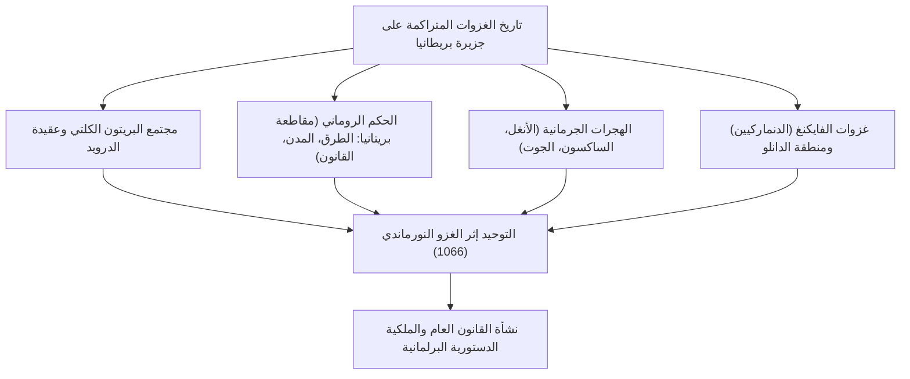
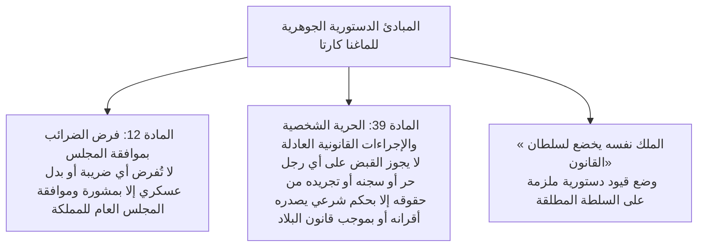
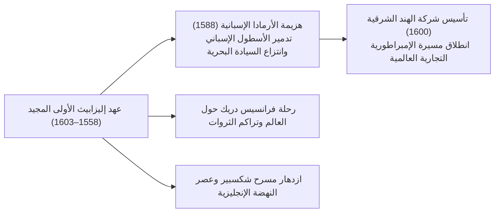
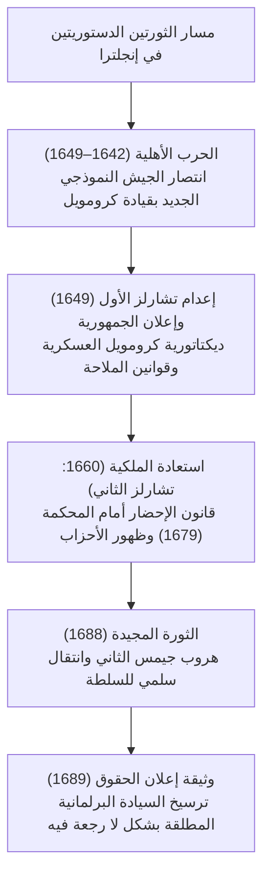
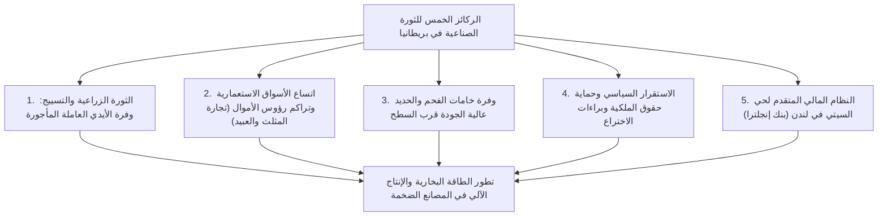
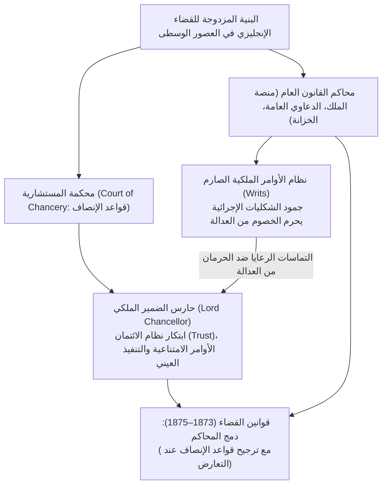
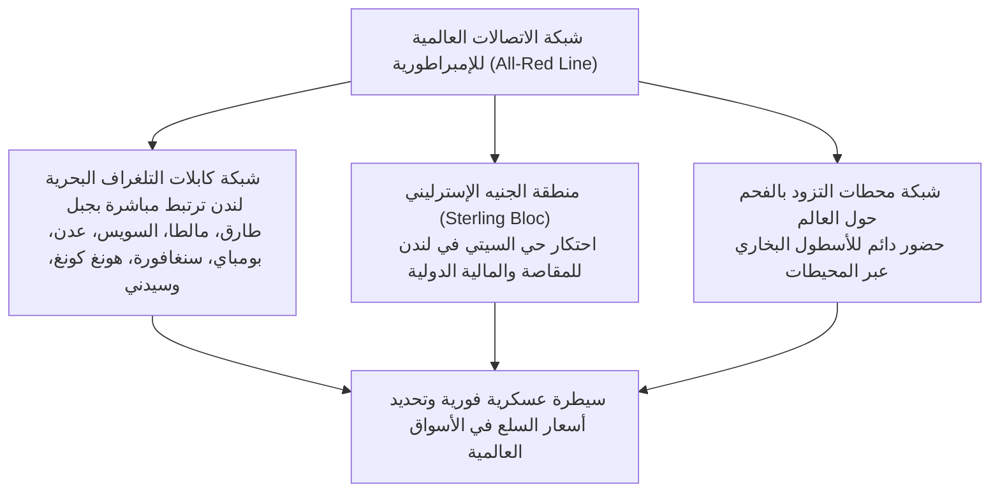
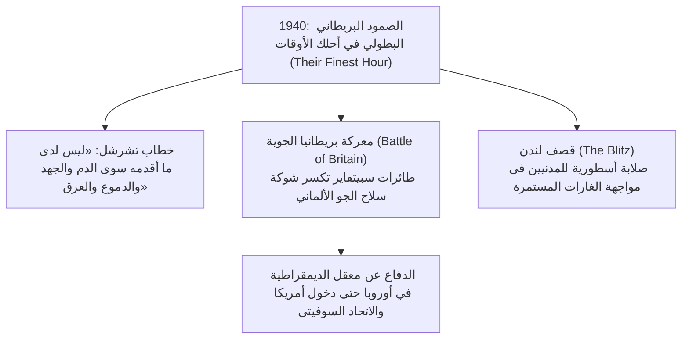
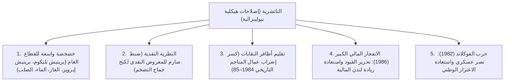

## 1. مقدمة: جيوسياسية الجزيرة وروح النظام القانوني البريطاني

### 1.1 الحضارة المغليثية الكلتية ومقاطعة بريتانيا الرومانية

تقع جزيرة بريطانيا العظمى في المياه الشمالية الغربية لقارة أوروبا، وشهدت منذ العصور السحيقة موجات متلاحقة من الهجرات والغزوات القادمة من القارة. ويعد صرح **ستونهنج (Stonehenge)** المغليثي العملاق، الذي شُيّد في سهل سالزبوري خلال الألفية الثالثة قبل الميلاد، شاهدًا خالدًا على المعرفة الفلكية المتقدمة والنزعة الروحية العميقة للشعوب الأصلية قبل عصر التدوين.

وفي الألفية الأولى قبل الميلاد، استقرت القبائل الكلتية (البريتون) المسلحة بالحضارة الحديدية في الجزيرة، وطوّرت نشاطًا زراعيًا خصبًا وأقامت طقوس عبادة الطبيعة تحت إشراف كهنة الدرويد (Druids). وبعد حملتين استكشافيتين قادهما غايوس يوليوس قيصر عامي 55 و54 قبل الميلاد، شن الإمبراطور كلوديوس غزوًا شاملاً عام 43 ميلادية، لتتحول الأجزاء الجنوبية من الجزيرة إلى مقاطعة رومانية خاضعة للتاج باسم **بريتانيا (Britannia)**.

دام الحكم الروماني قرابة أربعة قرون. شُيدت خلالها مدن ذات تخطيط دقيق، وفي طليعتها **لوندينيوم (Londinium)** — النواة التاريخية للندن الحديثة —، وشقت شبكة واسعة من الطرق المرصوفة بالحجارة (مثل طريق واتلينغ). ونقل الرومان تقنيات التعدين، والحمامات العامة، واللغة اللاتينية، والمسيحية. ولصد هجمات قبائل البكتس المحاربة في كاليدونيا (اسكتلندا) شمالاً، أمر الإمبراطور هادريان ببناء **جدار هادريان (Hadrian's Wall)** الحجري المهيب، الذي لا يزال شامخًا كحصن دفاعي على أقصى تخوم الإمبراطورية الشمالية. وفي عام 410 ميلادية، ومع تعرض روما لخطر اجتياح القوط الغربيين، أصدر الإمبراطور هونوريوس أوامره بالانسحاب الكامل للفيالق الرومانية من بريتانيا، لتقذف الجزيرة مجددًا في لجج العصور المظلمة.

---

### 1.2 الغزو الأنجلوسكسوني، عهد الممالك السبع، ومعجزة ألفريد العظيم

عقب رحيل الفيالق الرومانية، تدفقت عبر بحر الشمال ثلاث قبائل جرمانية رئيسية — الأنغل والساكسون والجوت — في موجات غزو عاتية منتصف القرن الخامس الميلادي. وأجبر السكان البريتون الكلتيون الأصليون على التراجع غربًا نحو ويلز وكورنوال، وشمالاً نحو جبال اسكتلندا الوعرة (وقد تحولت ملاحم الصمود الكلتي لاحقًا في الأدب الفروسي إلى أسطورة الملك آرثر الشهيرة).

أسس الغزاة دويلات عديدة استقرت في نهاية المطاف في ما عُرف بـ **«الممالك السبع» (الهبتاركية: Heptarchy)**: نورثمبريا، ميرسيا، إيست أنغليا، إسكس، ساسكس، ويسكس، وكنت. وفي أواخر القرن السادس، أرسل البابا غريغوري الأول بعثة كنسية برئاسة أوغسطين (أول رئيس لأساقفة كانتربري)، مما سرّع وتيرة اعتناق إنجلترا للمسيحية.

وفي أواخر القرن الثامن، أغار غزاة الفايكنغ الاسكندنافيون (الدنماركيون) على الشواطئ البريطانية، فنهبوا الأديرة وبسطوا سيطرتهم على النصف الشرقي لإنجلترا. وفي خضم هذا الخطر الماحق، نهض ملك ويسكس الصامدة في الجنوب الغربي، **ألفريد العظيم (Alfred the Great، حكم 871–899)**:
- سحق الجيش الدنماركي في **معركة إيدينغتون (878)** وأبرم معاهدة ويدمور، التي قسمت إنجلترا وأقرت منطقة الحكم الذاتي الدنماركي «الدانلو» (Danelaw).
- حصّن مملكته بشبكة من المدن والقلاع الدفاعية (**البورغ / Burghs**) وأرسى دعائم البحرية الملكية.
- جمع القوانين ودوّنها، واهتم بالتعليم عبر ترجمة أمهات الكتب اللاتينية الكلاسيكية إلى الإنجليزية القديمة للكهنة والعامة، وأمر بتدوين *الوقائع الأنجلوسكسونية*.
- باعتباره الملك الوحيد في تاريخ إنجلترا الذي لُقب بـ «العظيم»، شهد عهد ألفريد ولادة الفكرة التأسيسية للأمة الموحدة: **«إنغلا-لاند» (أرض الأنغل = إنجلترا)**.

---

## 2. الغزو النورماندي (1066) وفقه الماغنا كارتا

### 2.1 عام المصير 1066: معركة هاستنغز وتأسيس الأسرة النورماندية

في عام 1066، تسببت وفاة الملك إدوارد المعترف دون وارث في اندلاع أزمة وراثة عنيفة. وإذ بايع مجلس الحكماء (الويتنامونت) هارولد غودوينسون ملكًا باسم هارولد الثاني، ادعى ويليام دوق نورمانديا حقه الشرعي في العرش وجهز أسطول غزو ضخمًا عبر بحر المانش.

وفي 14 أكتوبر 1066، دارت رحى **معركة هاستنغز (Battle of Hastings)** الفاصلة.
صمد «جدار الدروع» المشكل من المشاة الأنجلوسكسون ساعات طوال في وجه هجمات الفرسان النورمان ورماة السهام. ومع حلول الغسق، أصيب هارولد الثاني بسهم قاتل في عينه؛ فتفككت صفوف الساكسون، وتُوّج ويليام ملكًا على إنجلترا في كنيسة وستمنستر يوم عيد الميلاد عام 1066 باسم ويليام الأول (ويليام الفاتح).

شكل هذا **الغزو النورماندي (Norman Conquest)** أهم منعطف في التاريخ البريطاني:
1. **التحول الجيوسياسي**: انقطعت إنجلترا نهائيًا عن فلك العالم الاسكندنافي الشمالي لتندمج بالكامل في الفضاء الإقطاعي واللاتيني لفرنسا وأوروبا القارية.
2. **الازدواج اللغوي والطبقي**: تحدثت الطبقة الحاكمة (النبلاء، البلاط، القضاة) باللغة الأنجلو-نورماندية (الفرنسية القديمة)، بينما تحدثت الطبقات الكادحة بالإنجليزية القديمة الجرمانية. وتمازجت اللغتان على مدار القرون لتنتج الإنجليزية الحديثة الثرية بمفرداتها.
3. **كتاب يوم القيامة (Domesday Book، 1086)**: أمر ويليام الأول بمسح شامل لجميع الأراضي الزراعية والغابات والمطاحن والماشية وتعداد السكان، مما أرسى نظام حكم إقطاعي مركزي صارم فاق بكثير ما كان سائدًا في القارة الأوروبية.

---

### 2.2 إصلاحات هنري الثاني القضائية وولادة القانون العام (Common Law)

في منتصف القرن الثاني عشر، اعتلى هنري دوق أنجو العرش مؤسسًا أسرة بلانتاجانت باسم **هنري الثاني (حكم 1154–1189)**. وبصفته حاكمًا للإمبراطورية الأنجوية المترامية الأطراف — الممتدة من اسكتلندا حتى جبال البرانس —، أحدث ثورة شاملة في المنظومة القضائية الإنجليزية.

وللقضاء على فوضى المحاكم الإقطاعية المحلية وتشتت الأعراف الإقليمية، وضع هنري الثاني نظام القضاة الملكيين المتجولين عبر **محاكم الجنايات الدورية (Assize Courts)**:
- عمل هؤلاء القضاة على استخلاص أفضل الأعراف والسوابق القضائية وتوحيدها في نسق قانوني متجانس يسري في سائر أرجاء المملكة: **القانون العام (Common Law)**.
- أرسى الركائز الإجرائية لـ **نظام هيئة المحلفين (Jury System)**، مستعينًا بشهادة مواطنين محليين نزهاء تحت القسم لإثبات الوقائع المتنازع عليها.
- تكرس مبدأ السوابق القضائية الملزمة (**Stare Decisis**)، حيث يتطور القانون من خلال تراكم أحكام القضاة عبر العصور بدلاً من الاعتماد الحصري على مدونات تشريعية مجردة.

---

### 2.3 الماغنا كارتا (الميثاق الأعظم، 1215): انبثاق سيادة القانون

مُني نجل هنري الثاني الأصغر، الملك سيئ السمعة **جون «لَاكْلَانْد» (حكم 1199–1216)**، بهزائم ماحقة أمام ملك فرنسا فيليب الثاني، ففقد معظم الممتلكات القارية، وحُرم كنسيًا من قبل البابا إينوسنت الثالث. ولتمويل حروبه، فرض جون ضرائب تعسفية باهظة وحكم بالقمع والابتزاز. فثار البارونات الإقطاعيون واحتلوا لندن.

وفي 15 يونيو 1215، وفي مرج رانيميد قرب وندسور، أجبر البارونات الملك جون على وضع ختمه الملكي على الوثيقة الخالدة: **الماغنا كارتا (Magna Carta: الميثاق الأعظم)**.

تجاوزت القيمة التاريخية للماغنا كارتا حدود وثيقة صلح إقطاعية تدافع عن امتيازات النبلاء، لتؤسس المبدأ الكوني لـ **سيادة القانون (Rule of Law)**: *أن السلطة العليا ذاتها مقيدة بأحكام القانون ولا يحق لها تجاوزه*. وتحديدًا، شكلت المادة 39 حجر الزاوية لمفهوم **«الإجراءات القانونية الواجبة» (Due Process of Law)**، التي ألهمت الثورات الإنجليزية في القرن السابع عشر والدستور الأمريكي.

وفي عام 1295، دعا الملك إدوارد الأول إلى انعقاد **البرلمان النموذجي (Model Parliament)**، الذي ضم لأول مرة إلى جانب النبلاء ورجال الدين فارسين منتخبين عن كل مقاطعة ومواطنين عن كل بلدة، واضعًا بذلك الهيكل الثنائي الدائم للبرلمان البريطاني: مجلس اللوردات ومجلس العموم.

---

## 3. حرب المئة عام، حرب الوردتين، ومطلقية أسرة تيودور

### 3.1 حرب المئة عام (1337–1453)، الموت الأسود، وتصدع نظام القنانة

أشعل النزاع حول وراثة العرش الفرنسي والسيطرة على تجارة الصوف في فلاندرز **حرب المئة عام** بين إنجلترا وفرنسا، والتي دامت 116 عامًا من الصراع المتقطع.
- اعتمدت الجيوش الإنجليزية بقيادة إدوارد الثالث، والأمير الأسود، وهنري الخامس على كتائب **رماة القوس الطويل الويلزي (Longbow)**. وفي معارك كريسيه (1346) وأجينكور (1415)، أباد الرماة الإنجليز سلاح الفرسان الفرنسي الثقيل، معلنين نهاية أساليب الحرب الإقطاعية.
- غير أن ظهور جان دارك قلب موازين الصراع لصالح فرنسا؛ وبحلول عام 1453، فقدت إنجلترا كل أراضيها القارية باستثناء كاليه. وأجبرت هذه الهزيمة النبلاء الإنجليز على التخلي عن ارتباطهم بالهوية الفرنسية وتبني هوية وطنية إنجليزية أصيلة.

وتزامن ذلك مع اجتياح طاعون **الموت الأسود** عام 1348 للجزيرة، حاصدًا أرواح ما بين ثلث إلى نصف السكان:
- أدى النقص الشديد في الأيدي العاملة إلى ارتفاع كبير في الأجور والقوة التفاوضية للعمال والفرسان الناجين.
- وأشعلت محاولات كبار الملاك لتجميد الأجور قسرًا **ثورة الفلاحين عام 1381** بقيادة وت تايلر وجون بول. وتحت الشعار الخالد: *«حين كان آدم يحرث وحواء تغزل، من ذا الذي كان سيدًا نبيلًا؟»*، انهار نظام القنانة الإقطاعي في إنجلترا قبل نظيره في القارة الأوروبية بعدة قرون.

---

### 3.2 حرب الوردتين وبزوغ فجر أسرة تيودور

عقب الانكسار في فرنسا، انزلقت إنجلترا إلى أتون حرب أهلية دامية استمرت ثلاثة عقود حول أحقية اعتلاء العرش: **حرب الوردتين (1455–1485)** بين أسرة لانكستر (الوردة الحمراء) وأسرة يورك (الوردة البيضاء).
وقد أدت المعارك وحملات الإعدام المتتالية إلى إفناء معظم البيوت الإقطاعية الكبرى القديمة، مما حطم مراكز القوى الإقطاعية المتناحرة.

وفي عام 1485، نجح هنري تيودور في حسم معركة بوسوورث وقتل ريتشارد الثالث ملك يورك، ليعتلي العرش باسم هنري السابع مؤسسًا **أسرة تيودور**. وقام بإخضاع النبلاء المتمردين عبر محكمة غرفة النجوم الاستثنائية (*Court of Star Chamber*)، واعتمد على طبقة صغار ملاك الأراضي في الأرياف (*الجنتري / Gentry*) كقضاة صلح (*Justices of the Peace*)، واضعًا مداميك الدولة البيروقراطية المركزية الحديثة.

---

### 3.3 الإصلاح الديني لهنري الثامن والعصر الذهبي لإليزابيث الأولى

شهد عصر تيودور منعطفًا جذريًا مع حركة الإصلاح الديني التي قادها **هنري الثامن (حكم 1509–1547)**.
فعندما رفض البابا كليمنت السابع فسخ زواجه من كاثرين الأراغونية ليتسنى له الزواج من آن بولين، قرر هنري الانفصال نهائيًا عن كنيسة روما:
- **قانون السيادة لعام 1534 (Act of Supremacy)**: أعلن الملك رئيسًا أعلى ووحيدًا على وجه الأرض لكنيسة إنجلترا (الكنيسة الأنجليكانية).
- قام بحل الأديرة الكاثوليكية ومصادرة عقاراتها الشاسعة وإعادة بيعها للجنتري وكبار التجار، مما أفرز طبقة جديدة من كبار الملاك ارتبطت مصالحهم المادية ببقاء الانفصال عن روما.

وبعد فترة ردة دموية قاسية في عهد ماري الأولى («ماري الدموية»)، اعتلت ابنة هنري الثامن العرش: **إليزابيث الأولى (حكم 1558–1603)**. واستطاعت عبر قانون التوحيد ترسيخ «النهج الأوسط» (*Via Media*)، الموفق بين الطقوس الكاثوليكية التقليدية واللاهوت البروتستانتي المعتدل.

وفي عام 1588، أرسل ملك إسبانيا فيليب الثاني «الأرمادا التي لا تُقهر» لغزو إنجلترا. وبفضل تكتيكات السفن المشتعلة بقيادة السير فرانسيس دريك والعواصف الأطلسية العاتية، تشتت الأسطول الإسباني وغرق معظمه. وفي عام 1600، منحت الملكة الميثاق لـ **شركة الهند الشرقية البريطانية**. ومع تألق مسرحيات وليم شكسبير على مسرح غلوب في لندن، تقدمت إنجلترا بثبات لتصبح سيدة البحار.

---

## 3.6 «الخراف تأكل البشر»: حركة التسييج وقوانين الفقراء الإليزابيثية

شهد القرن السادس عشر في عهد تيودور تحولات اقتصادية هائلة عبر ما عُرف بـ **«الموجة الأولى لتسييج الأراضي» (Enclosures)**، المدفوعة بالطلب الأوروبي الهائل على الصوف الإنجليزي.

### ① إدانة توماس مور في كتابه *يوتوبيا* (1516)
قام كبار الملاك والنبلاء بطرد الفلاحين من الأراضي المشاعة والحقول المفتوحة، وأحاطوها بأسيجة لتحويلها إلى مراعٍ مخصصة لتربية الأغنام ذات العوائد المرتفعة.
وأدان المفكر واللورد المستشار توماس مور هذا التراكم الرأسمالي البدائي بمرارة في كتابه الشهير *يوتوبيا*:

> **«إن خرافكم، التي اعتدنا عليها وديعة وقنوعة بأقل قوت، قد غدت اليوم — كما يُقال — شرسة ونهمة إلى حد أنها تلتهم البشر أنفسهم، وتخرب الحقول والمنازل والمدن وتفنيها.»**

أضحى الفلاحون الذين جُردوا من أراضيهم مشردين يتدفقون إلى المدن مثل لندن، وشُنق الآلاف منهم بموجب قوانين التشرد الصارمة.

### ② الأهمية التاريخية لقانون الفقراء لعام 1601
ولمواجهة تفشي الفقر والاضطرابات، أصدر البرلمان **قانون الفقراء لعام 1601 (*Poor Law of 1601*)**:
- جباية ضريبة إلزامية لرعاية الفقراء (**Poor Rate**) على مستوى كل رعية (Parish).
- تقسيم المحتاجين إلى ثلاث فئات محددة:
  1. **الفقراء القادرون على العمل**: تشغيلهم إجباريًا في مصانع العمل الشاق (*workhouses*).
  2. **الفقراء العاجزون** (اليتامى، العجزة، المرضى): إيواؤهم في ملاجئ أو تقديم إعانات منزلية لهم.
  3. **المتشردون المتكاسلون**: إيداعهم في دور التأديب ومعاقبتهم.
- وبتحويل إعانة المحتاجين من عمل خيري ديني طوعي إلى التزام قانوني عام يقع على عاتق الدولة، أرسى هذا القانون اللبنة الأولى لأنظمة الضمان الاجتماعي الحديثة.

---

## 4. الثورات الإنجليزية وولادة الملكية الدستورية

### 4.1 استبداد أسرة ستيوارت والثورة البيوريتانية (1642–1649)

مع وفاة إليزابيث الأولى دون عقب، نودي بملك اسكتلندا جيمس السادس ملكًا على إنجلترا باسم **جيمس الأول**، مدشنًا حكم سلالة ستيوارت.

وتمسك جيمس الأول ونجله **تشارلز الأول** بنظرية **«الحق الإلهي للملوك»**، ففرضا ضرائب دون موافقة البرلمان (مثل ضريبة السفن) واضطهدا طائفة البيوريتان (التطهيريين). ورد الفقيه القانوني إدوارد كوك مؤكدًا أن «الملك نفسه خاضع لله وللقانون». وفي عام 1628، أصدر البرلمان **ملتمس الحق (Petition of Right)**، مانعًا الاعتقال التعسفي وفرض الضرائب دون مصادقة البرلمان.

وبعد أن حكم تشارلز الأول إحدى عشرة سنة دون برلمان (*Eleven Years' Tyranny*)، اضطر لدعوته لتمويل حربه ضد الاسكتلنديين. وسرعان ما تفاقم النزاع إلى حرب أهلية شاملة بين أنصار الملك («الفرسان») وأنصار البرلمان («ذوي الرؤوس المستديرة») — وهي **الثورة البيوريتانية**.

قاد أوليفر كرومويل **الجيش النموذجي الجديد (New Model Army)** الصارم وسحق القوات الملكية. وفي 30 يناير 1649، حُوكم **الملك تشارلز الأول بتهمة الخيانة العظمى واستبداد الحكم وأُعدم بقطع رأسه علنًا**، في حدث زلزل عروش ملوك أوروبا قاطبة.

أُلغيت الملكية وأُعلن قيام جمهورية الكومنولث، لكن الحكم العسكري الاستبدادي لكرومويل كـ «حامٍ للدولة» أثار نقمة واسعة. وبعد وفاته، قرر البرلمان في عام 1660 استدعاء الأمير **تشارلز الثاني** واستعادة النظام الملكي.

---

### 4.2 الثورة المجيدة (1688) ووثيقة إعلان الحقوق (Bill of Rights)

حين حاول الملك الكاثوليكي **جيمس الثاني** إعادة فرض الكاثوليكية والحكم المطلق، تحالفت القوتان الرئيسيتان في البرلمان — حزب **المحافظين (Tories)** وحزب **الأحرار (Whigs)** — للإطاحة به.

وفي عام 1688، وجه قادة البرلمان دعوة سرية إلى ابنة جيمس البروتستانتية ماري وزوجها حاكم هولندا **ويليام الثالث أوف أورنج** للقدوم بجيش إلى إنجلترا. وفر جيمس الثاني إلى فرنسا دون قتال. وسُمي هذا الانتقال السلمي بـ **الثورة المجيدة (Glorious Revolution)**.

وفي عام 1689، وافق الملكان على **وثيقة إعلان الحقوق (Bill of Rights)**:
- حظر تعطيل القوانين أو جباية الضرائب دون موافقة البرلمان.
- كفالة حرية الرأي والمناقشة داخل قاعات البرلمان دون مساءلة قضائية.
- حظر تشكيل جيش دائم في زمن السلم دون تصريح من البرلمان.
- وجوب عقد جلسات البرلمان بصورة منتظمة.

وهكذا ترسخ نظام **الملكية الدستورية** ومبدأ **السيادة البرلمانية (Parliamentary Sovereignty)**: *«الملك يملك ولا يحكم»*.

وفي عام 1707، صدر قانون الوحدة في عهد الملكة آن، ليتوحد تاجا إنجلترا واسكتلندا تحت لواء **مملكة بريطانيا العظمى**. ومع تولي جورج الأول الهانوفري العرش عام 1714 (وكان يجهل الإنجليزية)، تسلم روبرت والبول منصب أول رئيس وزراء فعلي، مؤسسًا **النظام الوزاري المسؤول أمام البرلمان (*Cabinet System*)**، الذي مثل جوهر الديمقراطية التمثيلية الحديثة.

---

## 5. الثورة الصناعية وقرن «باكس بريتانيكا»

### 5.1 التحول إلى «ورشة العالم»: ديناميات الثورة الصناعية الأولى

لماذا انطلقت أول ثورة صناعية في التاريخ البشري من بريطانيا في أواخر القرن الثامن عشر؟ يرجع ذلك لاجتماع خمسة عوامل بنيوية فريدة:

- **الابتكارات في غزل ونسج القطن**: المكوك الطائر لجون كاي، مغزل جيني لهارغريفز، الإطار المائي لأركرايت، نول كرومبتون، والنول الآلي لكارترايت.
- **ثورة البخار**: تطوير جيمس واط للمحرك البخاري المزود بمكثف منفصل (1769). فانتقلت المصانع من ضفاف الأنهار إلى أحواض الفحم (مانشستر، برمنغهام).
- **ثورة المواصلات**: قاطرة جورج ستيفنسون البخارية *The Rocket* (1829). وافتُتح خط ليفربول–مانشستر، لتبدأ شبكة قطارات كثيفة خفضت تكاليف النقل خفضًا غير مسبوق.

وفي عام 1851، افتُتح المعرض العالمي الكبير في هايد بارك في مبنى **قصر الكريستال (Crystal Palace)** الزجاجي الباهر، وتوافد ستة ملايين زائر من مختلف أصقاع الأرض ليشهدوا مكانة بريطانيا بوصفها **«ورشة العالم» (Workshop of the World)**.

---

### 5.2 التوسع الإمبراطوري لبريطانيا العظمى

خلال العصر الفيكتوري (1837–1901)، وتحت مظلة السيادة البحرية المطلقة للبحرية الملكية (*Royal Navy*) وحرية التجارة، بسطت بريطانيا نفوذها العالمي في حقبة عُرفت بـ **باكس بريتانيكا (السلام البريطاني)**.

وامتدت رقعة الإمبراطورية التي «لا تغيب عنها الشمس» لتشمل ربع اليابسة على كوكب الأرض وتتحكم في مصائر ربع البشرية.

| المنطقة | المستعمرات والأقاليم الرئيسية | طبيعة الحكم والمحطات التاريخية |
| :--- | :--- | :--- |
| **جنوب آسيا** | **الهند («درة التاج البريطاني»)** | خضعت لشركة الهند الشرقية منذ معركة بلاسي (1757). وعقب ثورة السيبوي (1857)، حُلت الشركة وأُخضعت الهند لحكم التاج المباشر (*الراج البريطاني*). وفي 1877 تُوجت فيكتوريا إمبراطورة على الهند. |
| **شرق آسيا** | **الصين (سلالة تشينغ) وهونغ كونغ** | أدى تهريب الأفيون لحرب الأفيون الأولى (1840). وفرضت معاهدة نانكينغ (1842) التنازل عن هونغ كونغ وفتح الموانئ الصينية مع امتيازات استعمارية جائرة. |
| **إفريقيا** | **من مصر إلى جنوب إفريقيا** | شراء دزرائيلي لأسهم قناة السويس (1875). مشروع سيسل رودس «من القاهرة إلى كيب تاون» (سياسة الـ 3C: القاهرة، كلكتا، كيب تاون). حروب البوير. |
| **الدومينيون** | **كندا، أستراليا، نيوزيلندا** | مستعمرات استيطانية مُنحت استقلالاً ذاتيًا مبكرًا مع حكومات مسؤولة، مشكلة النواة الأولى لرابطة الكومنولث. |

وعلى الصعيد الداخلي، لمعت المنافسة السياسية بين زعيم المحافظين بنجامين دزرائيلي (السياسة الإمبريالية والإصلاح الاجتماعي) وزعيم الأحرار وليم غلادستون (الانضباط المالي، حرية التجارة، وحكم أيرلندا الذاتي). وبفضل قوانين الإصلاح الانتخابي لأعوام 1832 و1867 و1884، امتد حق الاقتراع تدريجيًا إلى الطبقات العمالية.

---

## 2.4 ازدواجية القضاء الإنجليزي: القانون العام والإنصاف ونظام الأوامر القضائية

يتميز النظام القانوني البريطاني عن الأنظمة اللاتينية القارية بتكامله وصراعه الجدلي بين منظومتين: **القانون العام (Common Law)** و**الإنصاف (Equity)**.

### ① جمود نظام الأوامر القضائية (*System of Writs*)
في القرنين الثاني عشر والثالث عشر، كان يتعين على المدعي لرفع دعواه أمام محاكم القانون العام شراء أمر ملكي كتابي محدد الصياغة (*Writ*) من ديوان المستشارية يطابق واقعته تمامًا.
وخشية تضخم سلطة الملك، فرض النبلاء بنود أكسفورد عام 1258 لمنع استحداث أي صيغ جديدة للأوامر. فانحدر القانون العام إلى شكليات إجرائية متحجرة؛ وأي دعوى مستحدثة لا تتطابق مع القوالب القديمة كانت تُرفض تلقائيًا دون نيل أي جبر للضرر.

### ② محكمة المستشارية ونشأة نظام «الائتمان» (*Trust*)
لجأ المتقاضون المتضررون من جمود القانون العام إلى استعطاف الملك بالعرائض والالتماسات. وأحال الملك هذه العرائض إلى **اللورد المستشار (Lord Chancellor)**، كبير رجال الدين و«حارس الضمير الملكي».
- كان المستشار يقضي دون التقيد بألفاظ الأوامر الجامدة، مستندًا إلى قواعد العدالة الفطرية والوجدان (*conscience*)؛ فنشأت منظومة **الإنصاف (Equity)**.
- وبينما كان القانون العام يعوض الخصوم نقديًا بأثر رجعي فقط، أوجد الإنصاف أحكامًا مبتكرة: كـ **إلزام المدين بالتنفيذ العيني الصارم للالتزام (*Specific Performance*)**، و**الأوامر القضائية بالمنع والامتناع (*Injunctions*)**.
- وانبثق عن إقدام فرسان الحروب الصليبية على تفويض إدارة ضياعهم إلى أصدقاء مخلصين لإعالة أسرهم مفهوم **الائتمان والأمانة (Trust)**، الذي يفصل بين الملكية القانونية الشكلية والانتفاع الفعلي — وهو أحد أعظم الابتكارات في تاريخ القانون العالمي.

---

## 3.4 إخضاع التخوم الكلتية: معاناة اسكتلندا وأيرلندا

اقترن بزوغ الهيمنة الإنجليزية بتاريخ طويل من الغزو العسكري والاستعمار تجاه جيرانها الكلتيين.

### ① حروب الاستقلال الاسكتلندية: والاس وبروس
في أواخر القرن الثالث عشر، استغل إدوارد الأول («مطرقة الاسكتلنديين») نزاعًا على العرش لغزو اسكتلندا ونهب حجر التتويج المقدس «حجر سكون» ونقله إلى لندن.
- 1297: قاد وليم والاس (بطل فيلم *Braveheart*) انتفاضة شعبية وهزم الفرسان الإنجليز في معركة جسر ستيرلينغ.
- 1314: سحق روبرت بروس الجيش الإنجليزي في **معركة بانوكنبورن** بتشكيلات الرماح المتراصة (*schiltrons*)، منتزعًا الاعتراف التام باستقلال اسكتلندا في معاهدة إدنبرة-نورثامبتون عام 1328.

### ② غزو كرومويل ومجاعة أيرلندا الكبرى
أما أيرلندا، فكان مصيرها مأساويًا إلى أبعد الحدود:
- 1649: بعد انتصاره في الحرب الأهلية، قاد أوليفر كرومويل حملة قمع وحشية على أيرلندا، وارتكب مجازر دموية في دروغيدا وويكسفورد، تلتها مصادرة شاملة لأراضي الأيرلنديين الكاثوليك ومنحها للمستوطنين البروتستانت (استيطان ألستر). وتحول السكان الأصليون إلى مزارعين مستأجرين محرومين من الحقوق.
- **مجاعة أيرلندا الكبرى (1845–1852)**: ضربت آفة اللفحة المتأخرة محصول البطاطس، الغذاء الرئيسي للشعب الأيرلندي.
  - وتمسكت الحكومة البريطانية بحرفية عقيدة «دعه يعمل» الرأسمالية المتطرفة (*laissez-faire*)، وتركت شحنات الحبوب الأيرلندية تُصدر إلى إنجلترا بينما كان السكان يموتون جوعًا.
  - قضى أكثر من مليون شخص نحبهم جوعًا ومرضًا، وهاجر أكثر من مليون آخرين على متن «سفن التوابيت» المتهالكة إلى أمريكا (نواة الجالية الأيرلندية الأمريكية التي برزت منها عائلة كينيدي). وانخفض عدد سكان أيرلندا إلى النصف تقريبًا، تاركًا جرحًا تاريخيًا عميقًا.

---

## 5.5 البنية الجيوسياسية والهيمنة المعلوماتية: الكابلات البحرية و«اللعبة الكبرى»

قامت باكس بريتانيكا على البوارج الحربية، ولكنها استندت بالمثل إلى **أول بنية تحتية عالمية للاتصالات والمعلومات في التاريخ**.

- **شبكة All-Red Line**: احتكرت بريطانيا تقنية عزل الكابلات بمادة «الكوتابركا»، ومدت شبكة كابلات بحرية تلغرافية طوقت مستعمراتها حول العالم (والتي كانت تُلوَّن تقليديًا باللون الأحمر على الخرائط). ونظرًا لأن الكابلات لم تكن ترسو إلا على أراضٍ خاضعة للسيطرة البريطانية، فقد تمتعت الاتصالات العسكرية بحصانة تامة ضد التنصت أو القطع.
- **اللعبة الكبرى (The Great Game)**: صراع استخباري ونفوذ استمر طوال القرن التاسع عشر ومطالع القرن العشرين بين الإمبراطورية البريطانية والإمبراطورية الروسية للسيطرة على آسيا الوسطى (أفغانستان، بلاد فارس، التبت)، وخلده روديارد كبلينغ في روايته *كيم*، وشكل النواة الأولى للجغرافيا السياسية المعاصرة (نظرية قلب الأرض لماكندر).

---

## 6. الحربان العالميتان وغروب شمس الإمبراطورية

### 6.1 الحرب العالمية الأولى واستنزاف الموارد

مع مطلع القرن العشرين وتنامي القوة البحرية والصناعية لألمانيا، تخلت بريطانيا عن سياستها التاريخية المعروفة بـ «العزلة الرائعة» (*Splendid Isolation*)، وعقدت التحالف الأنجلو-ياباني (1902)، والاتفاق الودي مع فرنسا (1904)، والاتفاق مع روسيا (1907) لتشكيل الوفاق الثلاثي.

وفي أغسطس 1914، اندلعت الحرب العالمية الأولى:
- في خنادق الجبهة الغربية (معارك السوم وباشنديل)، أُفني جيل بريطاني كامل تحت نيران المدافع والغازات السامة («الجيل المفقود»).
- ورغم نجاح الحصار البحري ومعركة يوتلاند في شل الأسطول الألماني، فإن التكاليف الباهظة حولت بريطانيا من أكبر دائن في العالم إلى دولة مدينة غارقة في الديون لصالح الولايات المتحدة.

وفي عشرينيات القرن الماضي، صعد حزب العمال بديلاً للأحرار وشكل رامزي ماكدونالد أول حكومة عمالية. وفي عام 1928، تحقق حق الاقتراع العام المتساوي للرجال والنساء في سن 21 عامًا. ومع اندلاع ثورة عيد الفصح 1916 وحرب الاستقلال، تأسست الدولة الأيرلندية الحرة عام 1922 (مع بقاء ست مقاطعات في أيرلندا الشمالية تابعة للمملكة المتحدة).

---

### 6.2 الحرب العالمية الثانية وصمود تشرشل التاريخي

في ثلاثينيات القرن العشرين، ومع صعود الفاشية والنازية، باءت **سياسة التهدئة (Appeasement Policy)** التي قادها نيفيل تشامبرلين وأفضت لاتفاقية ميونخ 1938 بفشل ذريع.

وفي سبتمبر 1939، أشعل غزو هتلر لبولندا أتون الحرب العالمية الثانية. وفي مايو 1940، ومع انهيار فرنسا في غضون أسابيع وسقوط أوروبا الغربية تحت وطأة الاحتلال النازي، تولى **وينستون تشرشل (Winston Churchill)** رئاسة الحكومة.

بثت خطابات تشرشل الإذاعية عزيمة لا تلين في وجدان الشعب البريطاني. وبفضل الرادار، نجح طيارو سلاح الجو الملكي (RAF) في صد موجات القصف الألماني (*«لم يدن هذا العدد الهائل من البشر بفضل عظيم لمثل هذا النفر القليل»*). ورغم انتصار الحلفاء بعد معركة العلمين (1942) وإنزال نورماندي (1944)، خرجت بريطانيا من الحرب منهكة القوى ومفلسة اقتصاديًا.

---

### 6.3 «من المهد إلى اللحد» وتفكك الإمبراطورية

في الانتخابات العامة لصيف 1945، مُني حزب المحافظين بقيادة تشرشل بهزيمة مفاجئة لصالح حزب العمال بقيادة كليمنت أتلي. فقد تطلع الشعب إلى بناء الأمان الاجتماعي بدلاً من التغني بأمجاد التوسع الإمبراطوري:
- **بناء دولة الرفاه**: استنادًا إلى تقرير بيفريدج، تم إنشاء نظام رعاية شامل **«من المهد إلى اللحد» (From the cradle to the grave)**. وفي عام 1948 تأسست **هيئة الخدمات الصحية الوطنية (NHS)** لتقديم الرعاية الطبية المجانية للجميع، وأُممت صناعات الفحم والسكك الحديدية والكهرباء والصلب.
- **تصفية الاستعمار وتفكك الإمبراطورية**:
  - 1947: تحقق استقلال الهند وباكستان بعد مسيرة النضال السلمي لغاندي.
  - **أزمة السويس (1956)**: في أعقاب تأميم جمال عبد الناصر لقناة السويس، قادت بريطانيا وفرنسا تدخلاً عسكريًا بالتعاون مع إسرائيل، لكنهما أُجبرتا على الانسحاب المذل تحت وطأة الضغوط الصارمة والعقوبات المالية الأمريكية والسوفيتية. وكشف هذا الحادث بوضوح أن بريطانيا لم تعد قوة عظمى تتحكم في العالم.

---

## 7. من التاتشرية إلى «الطريق الثالث» وبريكست

### 7.1 مستنقع «المرض البريطاني» وثورة مارغريت تاتشر

خلال السبعينيات، أدى تضخم الإنفاق العام وإضرابات النقابات العمالية وخسائر الشركات المؤممة إلى حالة من الركود التضخمي عُرفت بـ **«المرض البريطاني» (British Disease)**. وبلغت الأزمة مداها في **«شتاء السخط» (1978–1979)** عندما شلت إضرابات عمال النظافة وحفاري القبور الخدمات العامة.

وفي مايو 1979، تولت أول امرأة رئاسة الوزراء في تاريخ البلاد: **مارغريت تاتشر («المرأة الحديدية»)**.

ترافقت صدمة تاتشر الاقتصادية مع أثمان اجتماعية باهظة تمثلت في تراجع التصنيع شمالاً وارتفاع البطالة وتفاقم الفوارق الطبقية. بيد أنها استعادت الحيوية للاقتصاد البريطاني ورسخت لندن كعاصمة مالية عالمية تنافس نيويورك.

---

### 7.2 توني بلير و«الطريق الثالث»

في عام 1997، حقق حزب العمال الجديد (*New Labour*) بقيادة توني بلير فوزًا كاسحًا بعد 18 عامًا في المعارضة. وطرح بلير نظرية **«الطريق الثالث» (The Third Way)**، مدمجًا كفاءة اقتصاد السوق التاتشري مع استثمارات حكومية ضخمة في التعليم وهيئة الرعاية الصحية (NHS):
- منح تفويض السلطات الإقليمية (*devolution*) بإنشاء برلماني اسكتلندا وويلز.
- إبرام **اتفاقية الجمعة العظيمة (1998)** التاريخية التي أنهت ثلاثة عقود من الصراع الطائفي الدامي في أيرلندا الشمالية (*The Troubles*).
- بيد أن مساندة بلير المطلقة لجورج بوش في غزو العراق عام 2003 وجهت ضربة قاصمة لمصداقيته السياسية والأخلاقية.

---

### 7.3 زلزال البريكست وبريطانيا في القرن الحادي والعشرين

منذ انضمامها إلى المجموعة الأوروبية عام 1973، ظلت بريطانيا تحتفظ بتوجس عميق تجاه مساعي الاندماج الفيدرالي لبيروقراطية بروكسل (فرفضت اليورو ومنطقة شنغن).

وفي العقد الثاني من الألفية، تصاعدت المخاوف حيال الهجرة وانتقاص السيادة لتبلغ ذروتها في شعار **«استعادة السيطرة» (Take Back Control)**. وفي استفتاء 23 يونيو 2016 الذي دعا إليه ديفيد كاميرون، فاز معسكر الخروج بشكل صادم بنسبة **$51.9\,\%$ من الأصوات (Brexit)**.

في 31 يناير 2020، غادرت المملكة المتحدة الاتحاد الأوروبي نهائيًا.
وتواجه بريطانيا اليوم تعقيدات سلاسل الإمداد، ونقص العمالة، والتضخم، والتوترات المحيطة ببروتوكول أيرلندا الشمالية، ودعوات استقلال اسكتلندا المتجددة، وهي تسعى لصياغة دورها الدولي الجديد في عالم متعدد الأقطاب.

---

## 5.6 الحركات العمالية: من اللودية إلى الميثاقية

في ظلال الثراء المتولد عن الثورة الصناعية، عاش الحرفيون والعمال التقليديون وطأة الفقر والتهميش بفعل التحديث الآلي.

### ① الحركة اللودية (1811–1816)
نظم نساجو شمال إنجلترا جماعات سرية تحت اسم القائد الأسطوري «الجنرال نيد لود». وشنوا هجمات ليلية حطموا فيها بالمطارق آلات النسيج البخارية التي هددت أرزاقهم. واستعانت السلطات بالجيش وأصدرت قانون تكسير الآلات عام 1812 الذي فرض عقوبة الإعدام على محطمي الماكينات.

### ② الحركة الميثاقية (1838–1848)
أشعل قصر حق الانتخاب في إصلاح 1832 على البرجوازيين وحرمان الطبقة العاملة أول حركة عمالية سياسية منظمة في التاريخ.
وصاغ وليم لوفيت ورفاقه **«ميثاق الشعب» (*People's Charter*)** متضمنًا **ستة مطالب تاريخية**:

1. **حق الاقتراع العام لجميع الرجال البالغين** (إلغاء قيود الملكية)
2. **التصويت السري عبر بطاقات الاقتراع** (لحماية الناخب من بطش صاحب العمل)
3. **إلغاء شرط ملكية النصاب المالي للترشح لعضوية البرلمان**
4. **منح رواتب لأعضاء البرلمان** (ليتسنى للفقراء التفرغ للتشريع)
5. **تحديد دوائر انتخابية متساوية التمثيل السكاني**
6. **إجراء انتخابات برلمانية سنوية** (لمنع الفساد وضمان الرقابة الشعبية)

ورغم أن البرلمان رفض ثلاث عرائض موقعة من الملايين، إلا أن خمسة من المطالب الستة (باستثناء الانتخابات السنوية) تحولت إلى قوانين نافذة بحلول أوائل القرن العشرين، مشكلة دعائم الديمقراطية البريطانية الحديثة.

---

## 7.5 تحديث التاج: من أسرة وندسور إلى عصر إليزابيث الثانية

يعود استمرار المؤسسة الملكية البريطانية وشعبيتها إلى قدرتها البارعة على التكيف وتجديد الذات طوال القرن العشرين.

### ① تغيير اسم الأسرة إلى «بيت وندسور» (1917)
أثناء الحرب العالمية الأولى، ومع اشتعال المشاعر المعادية للألمان، تخلى الملك جورج الخامس عن الاسم السلالي الألماني التاريخي لأسلافه «ساكس-كوبرغ-غوتا»، واعتمد اسمًا بريطانيًا أصيلاً: **بيت وندسور**، تيمنًا بالقلعة الملكية التاريخية. وفضل الملك، رغم كونه ابن خالة قيصر ألمانيا فيلهلم الثاني، التناغم مع نبض شعبه الوطني على وشائج القرابة.

### ② أزمة تنازل إدوارد الثامن عن العرش (1936)
قوبل إصرار إدوارد الثامن على الزواج من الأمريكية المطلقة مرتين واليس سيمبسون برفض حاسم من حكومة ستانلي بالدوين والكنيسة الأنجليكانية. وتنازل الملك عن العرش بعد 325 يومًا فقط من اعتلائه، مفسحًا المجال لشقيقه المتلعثم جورج السادس (بطل فيلم *خطاب الملك*). وكرست الأزمة مبدأ وجوب خضوع التاج للمشورة الدستورية للحكومة المنتخبة.

### ③ سبعون عامًا من حكم إليزابيث الثانية (1952–2022)
اعتلت إليزابيث الثانية العرش وهي في الخامسة والعشرين عام 1952، وظلت ملكة لسبعين عامًا حتى وفاتها عام 2022 عن عمر ناهز 96 عامًا (اليوبيل البلاتيني).
وعاصرت مرحلة تصفية الإمبراطورية، والحرب الباردة، والأزمات الاقتصادية وتحديات الأسرة الملكية، مجسدة النزاهة والحياد السياسي كرمز جامع لوحدة الأمة البريطانية.

---

## 8. خاتمة: تواصل التقاليد وحكمة الإصلاح التدرجي

تكمن أعظم معجزات التاريخ البريطاني في حقيقة راسخة: **أنه برغم افتقار بريطانيا لدستور مدون مكتوب في وثيقة واحدة، إلا أنها نجحت في تشييد وصيانة واحدة من أكثر ديمقراطيات العالم البرلمانية ونظم سيادة القانون استقرارًا ومتانة**.

وعوضًا عن اللجوء إلى ثورات دموية عاصفة تدمر التراث وتبني جمهوريات متخيلة من الصفر، دأب البريطانيون على التماس المشروعية من الأعراف الراسخة والسوابق القضائية والمواثيق التاريخية (كالماغنا كارتا ووثيقة الحقوق)، مجددين مؤسساتهم خطوة بخطوة عبر **الإصلاح التدرجي التراكمي (*Incremental Reform*)**.

إن رحلة الانعتاق من الاستبداد الملكي التي بدأها بارونات العصور الوسطى:
- صقلها قضاة القانون العام إلى ضمانات يومية لحقوق وحريات الأفراد،
- ورفعها نواب البرلمان المناضلون إلى سدة السيادة العليا للدولة،
- ووسعها عمال الثورة الصناعية لتشمل حق الاقتراع العام لجميع المواطنين،
- وتوجتها دولة الرفاه بنظام حماية اجتماعية يرعى الفئات المستضعفة.

ورغم تحولها من إمبراطورية حكمت الكرة الأرضية إلى دولة جزرية تبحث عن موقعها بين أوروبا والمحيط الأطلسي، فإن المبادئ التي أهدتها بريطانيا للحضارة الإنسانية — **سيادة القانون، والحكم البرلماني الديمقراطي، والحرية الفردية** — ستظل منارة ساطعة تهتدي بها المجتمعات الحرة في كل مكان.
