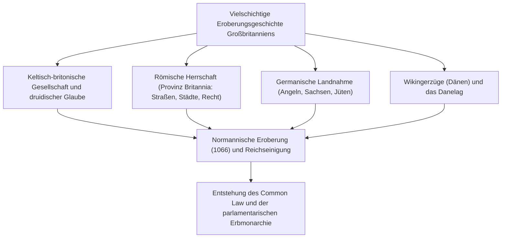
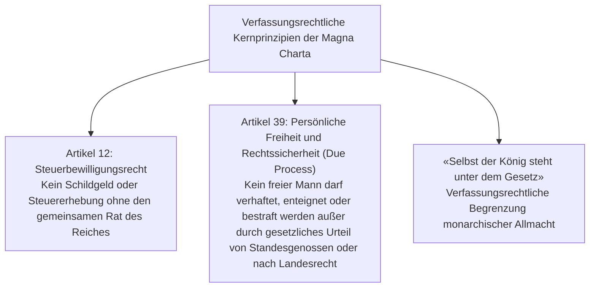
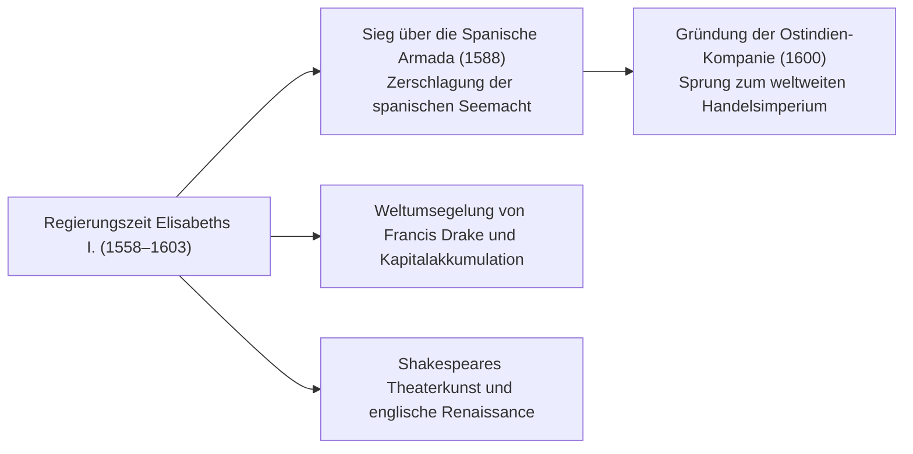
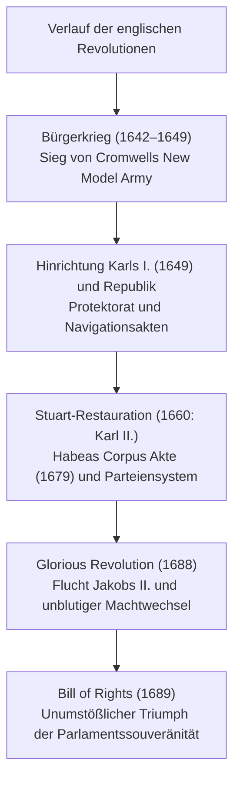
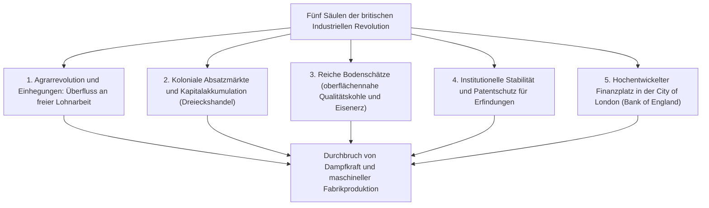
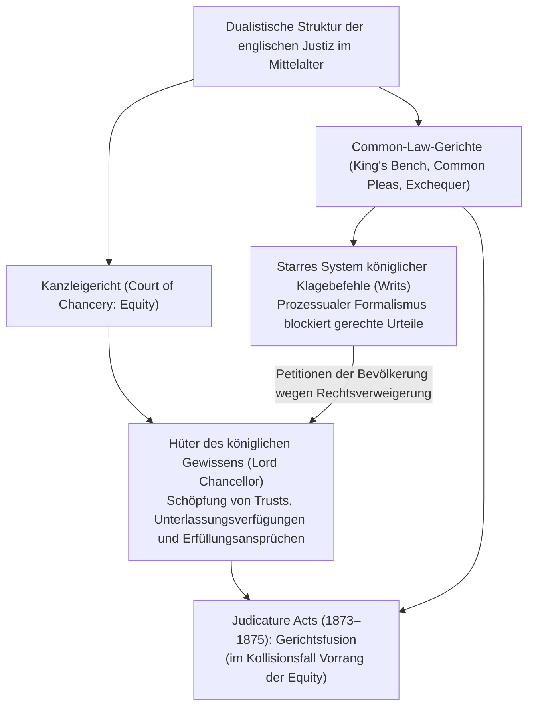
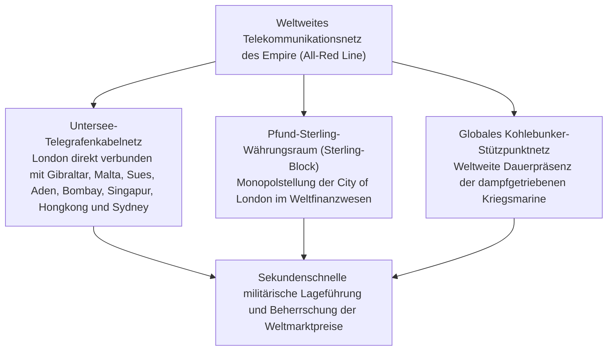
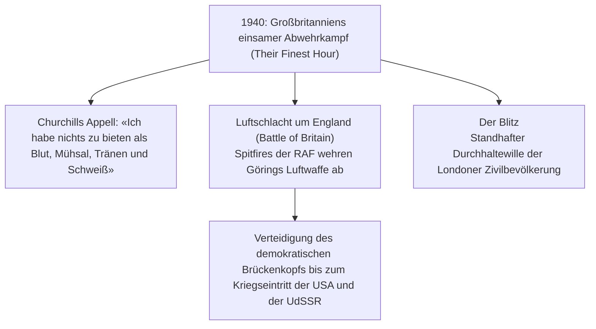
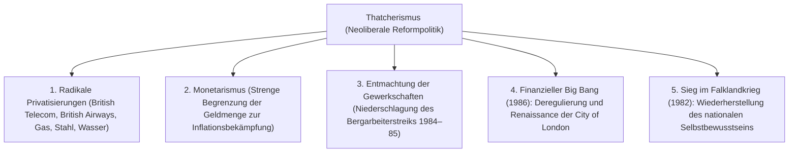

## 1. Einleitung: Inselgeopolitik und der Geist der britischen Rechtsordnung

### 1.1 Keltische Megalithkultur und die römische Provinz Britannia

In den nordwestlichen Gewässern des europäischen Kontinents gelegen, erlebte die Insel Großbritannien seit prähistorischen Zeiten aufeinanderfolgende Wellen von Völkerwanderungen und Eroberungen. Das im 3. Jahrtausend v. Chr. auf der Ebene von Salisbury errichtete Megalithmonument **Stonehenge** zeugt eindrucksvoll von den hochentwickelten astronomischen Kenntnissen und der religiösen Hingabe der schriftlosen Urbevölkerung.

Im 1. Jahrtausend v. Chr. besiedelten keltische Stämme der Eisenzeit (die Britonen) die Insel, betrieben ertragreichen Ackerbau und pflegten unter Führung der druidischen Priesterkaste naturreligiöse Rituale. Nach zwei Erkundungszügen unter Gaius Julius Caesar in den Jahren 55 und 54 v. Chr. befahl Kaiser Claudius im Jahr 43 n. Chr. eine groß angelegte Invasion, durch die der südliche Teil der Insel als kaiserliche Provinz **Britannia** in das Römische Reich eingegliedert wurde.

Die römische Herrschaft währte fast vier Jahrhunderte. Planstädte wie **Londinium** (die Keimzelle des modernen London) entstanden, und ein dichtes Netz gepflasterter Römerstraßen (wie die Watling Street) durchzog die Insel. Rom brachte Bergbautechniken, öffentliche Bäder, die lateinische Sprache und das Christentum. Um die Überfälle der piktischen Stämme Kaledoniens (Schottland) im Norden abzuwehren, ließ Kaiser Hadrian den berühmten **Hadrianswall (Hadrian's Wall)** errichten, der als nördlichste Grenzbefestigung des Imperiums bis heute überdauert hat. Als Rom 410 n. Chr. von den Westgoten bedroht wurde, ordnete Kaiser Honorius den vollständigen Abzug aller Legionen an – die Insel versank erneut in den Wirren eines dunklen Zeitalters.

---

### 1.2 Angelsächsische Landnahme, die Heptarchie und das Wunder Alfreds des Großen

Nach dem Abzug der Römer setzten Mitte des 5. Jahrhunderts drei germanische Völkerschaften – Angeln, Sachsen und Jüten – über die Nordsee über und drangen unaufhaltsam vor. Die einheimischen keltischen Britonen wurden sukzessive in die westlichen Rückzugsgebiete Wales und Cornwall sowie in die nördlichen schottischen Highlands abgedrängt (aus den Überlieferungen dieses heldenhaften keltischen Widerstands erwuchs später der Mythos um König Artus).

Die Eroberer gründeten zahlreiche Kleinreiche, aus denen sich schließlich die sogenannte **Heptarchie (Sieben Reiche)** herausbildete: Northumbria, Mercia, East Anglia, Essex, Sussex, Wessex und Kent. Ende des 6. Jahrhunderts leitete der von Papst Gregor I. entsandte Augustinus (der erste Erzbischof von Canterbury) die rasche Christianisierung Englands ein.

Gegen Ende des 8. Jahrhunderts fielen skandinavische Wikinger (die Dänen) über die Küsten her. Sie brandschatzten Klöster und brachten die gesamte Osthälfte Englands unter ihre Kontrolle. In dieser existenziellen Bedrohung trat aus dem verbliebenen südwestlichen Königreich Wessex **Alfred der Große (Alfred the Great, Regierungszeit 871–899)** hervor:
- In der **Schlacht von Edington (878)** schlug er das dänische Heer entscheidend und teilte England im Vertrag von Wedmore auf, wodurch das unter dänischem Recht stehende «Danelag» festgeschrieben wurde.
- Zur dauerhaften Landesverteidigung schuf er ein landesweites Netz befestigter Garnisonsstädte (**Burghs**) und legte das Fundament für die königliche Flotte.
- Er kodifizierte das Recht, förderte die Bildung durch Übersetzung lateinischer Schriften ins Altenglische und veranlasste die Abfassung der *Angelsächsischen Chronik*.
- Als einziger englischer Herrscher, der den Beinamen «der Große» erhielt, schuf Alfred das Fundament für das geeinte Königreich: **«Engla-lond» (Land der Angeln = England)**.

---

## 2. Die Normannische Eroberung (1066) und die Rechtslehre der Magna Charta

### 2.1 Das Schicksalsjahr 1066: Die Schlacht von Hastings und die normannische Dynastie

Im Jahr 1066 löste der kinderlose Tod König Edwards des Bekenners eine Nachfolgekrise aus. Während der Witenagemot (Rat der Weisen) Harold Godwinson als Harold II. einsetzte, erhob Herzog Wilhelm der Normandie auf der anderen Seite des Ärmelkanals Anspruch auf den Thron und rüstete eine Invasionsflotte aus.

Am 14. Oktober 1066 entbrannte die historische **Schlacht von Hastings**.
Die dichte angelsächsische Schildmauer hielt den Sturmangriffen der normannischen Panzerreiter und Bogenschützen stundenlang stand. Erst als Harold II. in der Abenddämmerung durch einen Pfeilschuss ins Auge fiel, brach die angelsächsische Front zusammen. Wilhelm wurde am ersten Weihnachtstag 1066 in der Westminster Abbey zum König von England gekrönt (Wilhelm der Eroberer).

Diese **Normannische Eroberung (Norman Conquest)** markiert die tiefgreifendste Zäsur der britischen Geschichte:
1. **Geopolitische Neuausrichtung**: England löste sich endgültig aus dem skandinavisch-nordischen Einflussbereich und wurde fest in das kontinental-feudale System Frankreichs und Westeuropas integriert.
2. **Kulturelle und sprachliche Doppelstruktur**: Die herrschende Elite sprach Anglo-Normannisch (Altfranzösisch), während die unterjochte Landbevölkerung das germanische Altenglisch beibehielt. Durch deren allmähliche Verschmelzung entstand das an Vokabular außerordentlich reiche moderne Englisch.
3. **Das Domesday Book (1086)**: Wilhelm I. ordnete eine lückenlose Erfassung aller Ländereien, Wälder, Viehbestände, Mühlen und Einwohner an. Dieses monumentale Grundbuch des «Jüngsten Gerichts» schuf eine zentralisierte feudale Verwaltung, die an Präzision auf dem europäischen Kontinent ihresgleichen suchte.

---

### 2.2 Die Justizreformen Heinrichs II. und die Geburt des Common Law

Mitte des 12. Jahrhunderts begründete Heinrich von Anjou als **Heinrich II. (r. 1154–1189)** das Haus Plantagenet. Als Beherrscher des Angevinischen Reiches, das von Schottland bis zu den Pyrenäen reichte, revolutionierte er die englische Rechtsordnung.

Um die zersplitterten gutsherrlichen Gerichte und regionalen Gewohnheitsrechte abzulösen, institutionalisierte Heinrich II. das System landesweit reisender königlicher Berufsrichter (**Assize Courts**):
- Die königlichen Richter prüften, vereinheitlichten und bündelten bewährte lokale Bräuche zu einem im gesamten Königreich einheitlich geltenden Recht: dem **Common Law (Gemeines Recht)**.
- Er schuf das Fundament des modernen **Geschworenensystems (Jury System)**, bei dem unbescholtene Bürger vor Ort unter Eid den Sachverhalt ermittelten.
- Statt auf starren Gesetzeskodizes ruht das Rechtssystem seither auf der richterlichen Fortbildung durch verbindliche Präzedenzfälle (**Stare Decisis**).

---

### 2.3 Die Magna Charta (1215): Die Geburtsstunde der Rechtsstaatlichkeit

Heinrichs jüngster Sohn, der berüchtigte König **Johann Ohneland (r. 1199–1216)**, verlor den Großteil der französischen Besitzungen an König Philipp II. August von Frankreich und wurde von Papst Innozenz III. mit dem Kirchenbann belegt. Um seine ruinösen Feldzüge zu finanzieren, presste Johann seine Untertanen mit willkürlichen Abgaben aus. Die empörten Barone griffen zu den Waffen und besetzten London.

Am 15. Juni 1215 zwangen die aufständischen Barone König Johann auf der Wiese von Runnymede bei Windsor, sein Siegel unter eine Urkunde zu setzen: die **Magna Charta (Der Große Freibrief)**.

Die historische Dimension der Magna Charta reicht weit über ihren Ursprung als mittelalterlicher Adelsfriedensvertrag hinaus. Sie statuierte das universelle Prinzip der **Rechtsstaatlichkeit (Rule of Law)**: *Selbst die höchste Staatsgewalt darf das Recht nicht willkürlich beugen, sondern unterliegt ihm*. Insbesondere Artikel 39 legte das Fundament für das rechtsstaatliche Verfahrensrecht (**Due Process of Law**), das die Revolutionen des 17. Jahrhunderts und die Verfassung der Vereinigten Staaten maßgeblich prägte.

1295 berief Eduard I. das **Musterparlament (Model Parliament)** ein, dem neben Adeligen und Prälaten auch jeweils zwei gewählte Ritter pro Grafschaft und zwei Bürger pro Stadt angehörten – die dauerhafte zweigliedrige Schablone des britischen Parlaments: House of Lords und House of Commons.

---

## 3. Hundertjähriger Krieg, Rosenkriege und Tudor-Absolutismus

### 3.1 Der Hundertjährige Krieg (1337–1453), der Schwarze Tod und der Niedergang der Leibeigenschaft

Der Streit um die französische Thronfolge und die Vorherrschaft im flämischen Tuchhandel entfesselte den 116 Jahre währenden **Hundertjährigen Krieg** zwischen England und Frankreich.
- Englische Heere unter Eduard III., dem Schwarzen Prinzen und Heinrich V. setzten die gefürchteten walisischen **Langbogenschützen (Longbow)** ein. Bei Crécy (1346) und Azincourt (1415) vernichteten sie die französische Ritterkavallerie und besiegelten das Ende des feudalen Rittertums.
- Durch das Auftreten Jeanne d’Arcs wendete sich das Kriegsglück zugunsten Frankreichs. 1453 verlor England mit Ausnahme von Calais alle kontinentalen Besitzungen. Aus Frankreich vertrieben, begannen die Adligen, sich nicht mehr als französische Herren, sondern als Engländer zu verstehen, wodurch ein nationales Bewusstsein entstand.

Gleichzeitig wütete 1348 der **Schwarze Tod (die Pest)** auf der Insel und raffte ein Drittel bis die Hälfte der Bevölkerung hinweg:
- Der akute Mangel an Arbeitskräften steigerte den Marktwert und die Verhandlungsmacht der überlebenden Landarbeiter schlagartig.
- Als die Grundherren versuchten, Löhne gesetzlich zu deckeln, entlud sich 1381 der große **Bauernaufstand unter Wat Tyler**. Unter der Parole *«Als Adam pflügte und Eva spann, wo war denn da der Edelmann?»* brach die Leibeigenschaft in England Jahrhunderte früher zusammen als auf dem Kontinent.

---

### 3.2 Die Rosenkriege und der Beginn der Tudor-Dynastie

Nach der Niederlage in Frankreich versank England in einem dreißigjährigen Adelskrieg um die Krone: den **Rosenkriegen (1455–1485)** zwischen dem Haus Lancaster (rote Rose) und dem Haus York (weiße Rose).
Gegenseitige Gemetzel und Hinrichtungen rotteten die alte Feudalaristokratie fast vollständig aus und brachen die Macht der Barone endgültig.

1485 besiegte Henry Tudor in der Schlacht von Bosworth Field König Richard III. von York und begründete als Heinrich VII. die **Tudor-Dynastie**. Mit dem Sondergericht der Sternkammer (*Court of Star Chamber*) bändigte er renitente Adlige und übertrug den Landedelleuten (*Gentry*) als Friedensrichtern (*Justices of the Peace*) die lokale Verwaltung – der Grundstein des modernen Verwaltungsstaates.

---

### 3.3 Die Reformation Heinrichs VIII. und das Elisabethanische Zeitalter

Die Epoche der Tudors wurde geprägt durch den religiösen Bruch unter **Heinrich VIII. (r. 1509–1547)**.
Weil Papst Clemens VII. die Scheidung von Katharina von Aragon verweigerte, um die Heirat mit Anne Boleyn zu ermöglichen, sagte sich Heinrich VIII. von Rom los:
- **Suprematsakte (1534)**: Erklärte den König zum weltlichen und geistlichen Oberhaupt der Kirche von England (*Church of England* / Anglikanische Kirche).
- Er säkularisierte und konfiszierte alle Klöster und veräußerte die ausgedehnten Kirchengüter an die Gentry und bürgerliche Schichten. Hierdurch entstand eine kaufmännisch denkende Eigentümerschicht, deren materielles Interesse fest an die Beibehaltung der Reformation gekoppelt war.

Nach der grausamen katholischen Gegenreaktion unter Maria I. («Bloody Mary») bestieg Heinrichs Tochter **Elisabeth I. (r. 1558–1603)** den Thron. Durch die Uniformitätsakte fand sie den Mittelweg (*Via Media*), der katholische Liturgieelemente mit protestantischer Theologie verband.

1588 entsandte Philipp II. von Spanien die «Unbesiegbare Armada» gegen das protestantische England. Taktische Brandereinsätze unter Vizeadmiral Sir Francis Drake und schwere Atlantikstürme führten zur Vernichtung der spanischen Flotte. 1600 privilegierte die Königin die **Britische Ostindien-Kompanie**. Während Shakespeares Dramen das Globe Theatre füllten, stieg England zur weltumspannenden Seemacht auf.

---

## 3.6 «Schafe fressen Menschen»: Einhegungen und das Armengesetz

Die Tudor-Wirtschaft des 16. Jahrhunderts wurde durch die **erste Welle der Einhegungsbewegung (*Enclosures*)** erschüttert, angefacht durch die enorme Nachfrage der europäischen Tuchindustrie nach englischer Wolle.

### ① Die Anklage des Thomas Morus in *Utopia* (1516)
Großgrundbesitzer trieben die Pächter gewaltsam von den Gemeindeländereien (*Commons*) und offenen Feldern, um die Flächen mit Hecken einzufrieden und in hochrentable Schafweiden umzuwandeln.
Der Humanist und spätere Lordkanzler Thomas Morus geißelte diese Frühform der ursprünglichen Akkumulation in seinem Meisterwerk *Utopia*:

> **«Eure Schafe, die sonst so sanftmütig und bescheiden waren, sind nun, so sagt man, so gefräßig und wild geworden, dass sie sogar die Menschen auffressen und Äcker, Häuser und Städte verwüsten und entvölkern.»**

Die vertriebenen Bauern strömten als landlose Bettler in die Städte wie London, wo Tausende aufgrund der drakonischen Landstreichereigesetze am Galgen endeten.

### ② Der historische Meilenstein des Armengesetzes von 1601
Um die verheerende Verelendung und soziale Unruhen einzudämmen, erließ das Parlament 1601 das wegweisende **Elisabethanische Armengesetz (*Poor Law of 1601*)**:
- Organisation und Finanzierung auf Gemeindeebene (*Parish*) über eine obligatorische Grundsteuer (**Poor Rate**).
- Einteilung der Bedürftigen in drei Kategorien:
  1. **Arbeitsfähige Arme**: Verpflichtung zur Zwangsarbeit in Arbeitshäusern (*Workhouses*).
  2. **Arbeitsunfähige Arme** (Waisen, Alte, Kranke, Invalide): Unterbringung in Armenhäusern oder Heimfürsorge.
  3. **Müßiggänger und Landstreicher**: Züchtigung und Zwangserziehung in Besserungshäusern.
- Indem die Armenfürsorge von freiwilliger kirchlicher Barmherzigkeit in eine gesetzliche Pflicht des Staates überführt wurde, entstand das weltweit erste staatliche Fürsorgesystem – die Urform des späteren Wohlfahrtsstaates.

---

## 4. Die Englischen Revolutionen und die Entstehung der konstitutionellen Monarchie

### 4.1 Der Absolutismus der Stuarts und die Puritanische Revolution (1642–1649)

Nach dem kinderlosen Tod Elisabeths I. erbte König Jakob VI. von Schottland als **Jakob I.** den englischen Thron und begründete die Dynastie der Stuarts.

Jakob I. und sein Sohn **Karl I.** vertraten nach kontinentalem Vorbild die Lehre vom **Gottesgnadentum der Könige**, regierten am Parlament vorbei, erhoben eigenmächtige Abgaben (*Ship Money*) und verfolgten die Puritaner. Der herausragende Jurist Sir Edward Coke hielt dem Herrscher entgegen: «Der König steht unter Gott und dem Gesetz.» 1628 erzwang das Parlament die **Petition of Right**, die willkürliche Verhaftungen und unbewilligte Steuern verbot.

Nach elfjähriger Alleinherrschaft ohne Parlament (*Eleven Years' Tyranny*) musste Karl I. die Abgeordneten einberufen, um Kriegsgelder gegen die Schotten zu bewilligen. Der Streit eskalierte zum Bürgerkrieg zwischen königlichen «Kavalieren» und parlamentarischen «Rundköpfen» (**Englischer Bürgerkrieg / Puritanische Revolution**).

Unter Oliver Cromwell überrannte die eiserne, disziplinierte **New Model Army** die königlichen Truppen. Am 30. Januar 1649 fällte ein Sondergerichtshof das Urteil: **Karl I. wurde als «Tyrann, Verräter, Mörder und öffentlicher Feind» vor dem Banqueting House in London öffentlich enthauptet** – ein Ereignis, das die Höfe Europas erschütterte.

Die Monarchie wurde abgeschafft und das Commonwealth gegründet. Doch Cromwells anschließendes diktatorisches Protektorat erbitterte die Bevölkerung. Nach seinem Tod rief das Parlament 1660 **Karl II.** zurück (Restauration).

---

### 4.2 Die Glorious Revolution (1688) und die «Bill of Rights»

Als Karls Nachfolger, der bekennende Katholik **Jakob II.**, erneut die Rekatholisierung und den Absolutismus anstrebte, verbündeten sich die beiden parlamentarischen Lager – die königstreuen **Tories** und die bürgerlich-parlamentarischen **Whigs**.

1688 luden führende Politiker Jakobs protestantische Tochter Maria und deren Gemahl, den niederländischen Statthalter **Wilhelm von Oranien (Wilhelm III.)**, zur Invasion ein. Verlassen von Heer und Adel floh Jakob II. kampflos nach Frankreich. Dieser unblutige Umsturz ging als **Glorious Revolution (Ruhmreiche Revolution)** in die Weltgeschichte ein.

1689 leisteten die neuen Herrscher ihren Eid auf die vom Parlament verfasste **Bill of Rights**:
- Das Verbot, Gesetze ohne Zustimmung des Parlaments außer Kraft zu setzen oder Steuern zu erheben.
- Die unbeschränkte Redefreiheit bei parlamentarischen Debatten.
- Das Verbot eines stehenden Heeres in Friedenszeiten ohne parlamentarische Billigung.
- Das Gebot regelmäßiger Parlamentswahlen.

Damit siegte das Prinzip der **konstitutionellen Monarchie** und der **Parlamentssouveränität**: *«Der König herrscht, aber er regiert nicht»*.

1707 vereinigte der *Act of Union* unter Königin Anne England und Schottland zum **Königreich Großbritannien**. Als 1714 Georg I. aus dem Hause Hannover den Thron bestieg (der kein Englisch sprach), übernahm Robert Walpole als faktisch erster Premierminister die Amtsgeschäfte und formte das **Kabinettsystem (*Cabinet System*)**, die Wiege der modernen parlamentarischen Demokratie.

---

## 5. Die Industrielle Revolution und das Zeitalter der «Pax Britannica»

### 5.1 Die Werkbank der Welt: Die Triebfedern der Ersten Industriellen Revolution

Warum nahm die weltgeschichtliche Industrielle Revolution ihren Anfang im Großbritannien des 18. Jahrhunderts? Dies lag am Zusammentreffen von fünf entscheidenden Standortvorteilen:

- **Pionierleistungen im Textilsektor**: John Kays Schnellschütze, James Hargreaves’ Spinning Jenny, Richard Arkwrights Waterframe, Samuel Cromptons Spinning Mule und Edmund Cartwrights mechanischer Webstuhl.
- **Dampfzeitalter**: James Watts Weiterentwicklung der Dampfmaschine mit separatem Kondensator (1769). Die Fabriken zogen von den Flussläufen in die urbanen Ballungszentren der Kohlebecken (Manchester, Birmingham).
- **Verkehrsrevolution**: George Stephensons Dampflokomotive *The Rocket* (1829). Die Eröffnung der Eisenbahnlinie Liverpool–Manchester leitete den Bau eines dichten Schienennetzes ein, das die Frachtkosten drastisch senkte.

1851 öffnete im Londoner Hyde Park die erste Weltausstellung im spektakulären Glaspalast des **Crystal Palace**. Sechs Millionen Besucher bestaunten die unangefochtene Stellung Großbritanniens als **«Werkbank der Welt» (Workshop of the World)**.

---

### 5.2 Die weltweite Expansion des Britischen Weltreichs

Im Viktorianischen Zeitalter (1837–1901) erlebte die Welt unter dem Schutz der Royal Navy und des Freihandels eine globale Hegemonie: die **Pax Britannica (Der britische Frieden)**.

Das Weltreich, in dem «die Sonne niemals unterging», umfasste ein Viertel der weltweiten Landmasse und beherrschte ein Viertel der Menschheit.

| Region | Wichtigste Kolonien und Gebiete | Herrschaftsform und historische Wegmarken |
| :--- | :--- | :--- |
| **Südasien** | **Indien («Das Kronjuwel»)** | Herrschaft der Ostindien-Kompanie seit Plassey (1757). Nach der Niederschlagung des Sepoy-Aufstandes 1857 direkte Übernahme durch die britische Krone (*British Raj*). 1877 Proklamation Victorias zur Kaiserin von Indien. |
| **Ostasien** | **China (Qing-Dynastie) & Hongkong** | Opiumschmuggel führte zum Ersten Opiumkrieg (1840). Vertrag von Nanking (1842): Abtretung Hongkongs und Erzwingung ungleicher Verträge mit Vertragshäfen. |
| **Afrika** | **Von Ägypten bis Südafrika** | Erwerb der Sueskanal-Aktien durch Disraeli (1875). Cecil Rhodes’ Nord-Süd-Plan «Vom Kap nach Kairo» (3C-Politik: Cairo, Calcutta, Cape Town). Burenkriege. |
| **Dominions** | **Kanada, Australien, Neuseeland** | Weiße Siedlungskolonien erhielten frühzeitig innere Selbstverwaltung und bildeten den Nukleus des modernen Commonwealth of Nations. |

Auf der innenpolitischen Bühne prägte das Duell zwischen dem konservativen Benjamin Disraeli (sozialer Konservatismus und imperiale Expansion) und dem liberalen William Gladstone (Freihandel, fiskalische Disziplin und irische Selbstverwaltung) das parlamentarische Leben. Durch die Wahlrechtsreformen von 1832, 1867 und 1884 erstritt die Arbeiterschaft schrittweise das Wahlrecht.

---

## 2.4 Die Dualität des englischen Rechts: Common Law, Equity und das Formularsystem

Im fundamentalen Unterschied zu kontinentaleuropäischen Zivilrechtsordnungen speist sich das englische Recht aus dem Wechselspiel zweier Rechtstraditionen: **Common Law** und **Equity (Billigkeit)**.

### ① Der starre Formalismus des Klagebefehlsystems (*System of Writs*)
Um im 12. und 13. Jahrhundert vor den königlichen Gerichten zu klagen, musste der Kläger bei der königlichen Kanzlei (*Chancery*) eine exakt passende Klageurkunde (*Writ*) erwerben.
Aus Furcht vor Machtzuwachs der Krone untersagten die Barone in den Bestimmungen von Oxford 1258 die Schöpfung neuer Writ-Formeln. Das Common Law erstarrte: Jedes neue Delikt oder Vertragsbruchmuster, das nicht haargenau in eine bestehende Vorlage passte, wurde ohne rechtliches Gehör abgewiesen.

### ② Das Kanzleigericht und die Entstehung des *Trust*
Kläger, die am Formalismus des Common Law scheiterten, wandten sich mit Bittschriften direkt an den Monarchen. Dieser delegierte die Fälle an den **Lordkanzler (Lord Chancellor)**, den obersten Kleriker und «Hüter des königlichen Gewissens».
- Der Lordkanzler fällte seine Urteile unbürokratisch nach natürlicher Gerechtigkeit und Gewissen – hieraus erwuchs die **Equity**.
- Während das Common Law rückwirkend nur Geldersatz zusprechen konnte, schuf die Equity zukunftsgerichtete Rechtsmittel: die Verpflichtung zur tatsächlichen Vertragserfüllung (*Specific Performance*) und vorbeugende Unterlassungsklagen (*Injunctions*).
- Zogen Ritter auf Kreuzzüge, übertrugen sie ihre Güter Treuhändern zur Fürsorge für die Familie: Hieraus erwuchs das Rechtsinstitut des **Trust (Treuhand)**, das formalrechtliches Eigentum und tatsächlichen Nutzgenuss voneinander trennt – eine Meisterleistung der Rechtsgeschichte.

---

## 3.4 Eroberung der keltischen Peripherie: Die Leiden Schottlands und Irlands

Englands imperiale Ausdehnung war auch eine Geschichte gewaltsamer Unterwerfung seiner keltischen Nachbarländer.

### ① Die schottischen Unabhängigkeitskriege: Wallace und Bruce
Ende des 13. Jahrhunderts fiel König Eduard I. («Hammer of the Scots») in Schottland ein und raubte den heiligen Krönungsstein, den «Stein von Scone», nach London.
- 1297: William Wallace (Vorbild für den Film *Braveheart*) führte die Erhebung des schottischen Landvolks an und zerschlug die englischen Panzerreiter bei Stirling Bridge.
- 1314: Robert the Bruce vernichtete in der **Schlacht von Bannockburn** ein zahlenmäßig weit überlegenes englisches Heer mit Schiltron-Lanzenformationen und erzwang im Vertrag von Edinburgh-Northampton 1328 die schottische Souveränität.

### ② Cromwells Eroberung Irlands und die Große Hungersnot
Das Schicksal Irlands verlief ungleich verheerender:
- 1649: Nach seinem Sieg im Bürgerkrieg überrollte Oliver Cromwell Irland. Blutbäder in Drogheda und Wexford folgten flächendeckende Enteignungen katholischer Iren zugunsten protestantischer Siedler (Ulster-Plantation). Die Iren wurden zu rechtlosen Pächtern im eigenen Land.
- **Die Große Hungersnot (1845–1852)**: Die Kartoffelfäule zerstörte die Existenzgrundlage der irischen Bauern.
  - Verstrickt in die Dogmen des *Laissez-faire*, sah die britische Regierung tatenlos zu, wie tonnenweise Getreide aus Irland nach England exportiert wurde, während die Bevölkerung verhungerte.
  - Über eine Million Menschen starben an Hunger und Seuchen; mehr als eine Million floh auf elenden «Sargschiffen» nach Nordamerika (der Ursprung der großen irisch-amerikanischen Diaspora). Irlands Bevölkerung halbierte sich, was tiefe historische Ressentiments hinterließ.

---

## 5.5 Geopolitische Infrastruktur und Informationsherrschaft: Unterseekabel und «The Great Game»

Die globale Macht der Pax Britannica beruhte nicht nur auf Kanonenbooten, sondern maßgeblich auf der **ersten globalen Telekommunikations- und Nachrichteninfrastruktur der Geschichte**.

- **Die All-Red Line**: Großbritannien besaß das Monopol auf Guttapercha-Isoliermaterial und verlegte ein weltumspannendes Kabelnetz, das alle britischen Gebiete (auf Landkarten traditionell rot markiert) miteinander verband. Da die Kabel ausschließlich auf britischem Boden endeten, waren die Nachrichten krisensicher vor feindlichem Zugriff geschützt.
- **The Great Game**: Das verdeckte Ringen zwischen dem Russischen Zarenreich und Britisch-Indien um die Vorherrschaft in Zentralasien (Afghanistan, Persien, Tibet) während des 19. und frühen 20. Jahrhunderts (berühmt durch Rudyard Kiplings Roman *Kim*) bildete das Fundament der modernen Geopolitik (Halford Mackinders Heartland-Theorie).

---

## 6. Die beiden Weltkriege und die Dämmerung des Weltreichs

### 6.1 Der Erste Weltkrieg und die Erschöpfung der Finanzen

Angesichts der rasanten Flottenrüstung des Deutschen Kaiserreichs gab Großbritannien Anfang des 20. Jahrhunderts seine Politik der «Glanzvollen Isolation» (*Splendid Isolation*) auf und schloss die Triple Entente (Allianz mit Japan 1902, Entente Cordiale mit Frankreich 1904, Ausgleich mit Russland 1907).

Im August 1914 brach der Erste Weltkrieg aus:
- An der Westfront (Schlachten an der Somme und bei Passchendaele) verblutete im Trommelfeuer, Giftgas und Maschinengewehrhagel eine ganze Generation («die verlorene Generation»).
- Trotz der Seeblockade und der Skagerrakschlacht wandelte sich Großbritannien durch die horrenden Rüstungskosten von der weltweit größten Gläubigernation zu einem hochverschuldeten Schuldner der USA.

In den 1920er Jahren löste die Labour Party die Liberalen ab; Ramsay MacDonald bildete die erste Labour-Regierung. 1928 wurde das volle gleiche Wahlrecht für Frauen und Männer ab 21 Jahren verwirklicht. Nach dem Osteraufstand 1916 und dem Unabhängigkeitskrieg entstand 1922 der Irische Freistaat (nur sechs Grafschaften Nordirlands verblieben im Vereinigten Königreich).

---

### 6.2 Der Zweite Weltkrieg und Churchills einsamer Widerstand

Als in den 1930er Jahren das NS-Regime aufrüstete, scheiterte Premierminister Neville Chamberlains **Beschwichtigungspolitik (Appeasement Policy)**, gipfelnd im Münchner Abkommen von 1938.

Im September 1939 löste Hitlers Überfall auf Polen den Zweiten Weltkrieg aus. Im Mai 1940, als Frankreich zusammenbrach und Westeuropa unter die Herrschaft der Wehrmacht fiel, wurde **Winston Churchill** Premierminister.

Churchills Radioansprachen entfachten einen unbeugsamen Abwehrwillen. Mithilfe des Radarwarnsystems schlugen die jungen Piloten der Royal Air Force (RAF) den deutschen Luftangriff zurück (*«Nie zuvor im Felde menschlicher Konflikte verdankten so viele so wenigen so viel»*). Trotz der Siege von El Alamein (1942) und der Landung in der Normandie (1944) ging Großbritannien physisch gezeichnet und finanziell bankrott aus dem Krieg hervor.

---

### 6.3 «Von der Wiege bis zur Bahre» und die Entkolonialisierung

Bei den Unterhauswahlen im Sommer 1945 wurde Churchills Konservative Partei abgewählt; Clement Attlees Labour Party erzielte einen Erdrutschsieg. Die Menschen verlangten soziale Sicherheit statt imperialer Größe:
- **Aufbau des Wohlfahrtsstaates**: Nach den Leitlinien des Beveridge-Reports entstand eine lückenlose soziale Absicherung **«von der Wiege bis zur Bahre» (From the cradle to the grave)**. 1948 wurde der **National Health Service (NHS)** ins Leben gerufen, der allen Bürgern kostenlose medizinische Versorgung garantierte. Schlüsselindustrien wie Kohlebergbau, Eisenbahn, Strom und Stahl wurden verstaatlicht.
- **Zerfall des Kolonialreiches**:
  - 1947: Nach Gandhis gewaltloser Kampagne erlangten Indien und Pakistan ihre Unabhängigkeit.
  - **Die Sueskrise (1956)**: Als Ägyptens Präsident Nasser den Sueskanal verstaatlichte, griffen Großbritannien und Frankreich militärisch ein, mussten sich jedoch dem ultimativen Druck und den Finanzsanktionen der USA und der UdSSR beugen. Die Demütigung zeigte schonungslos, dass Großbritannien keine Weltmacht ersten Ranges mehr war.

---

## 7. Vom Thatcherismus über den «Dritten Weg» bis zum Brexit

### 7.1 Die «Englische Krankheit» und die Thatcher-Revolution

In den 1970er Jahren führten ausufernde Staatsausgaben, streikmächtige Gewerkschaften und unrentable Staatskonzerne zur Stagflation – der sprichwörtlichen **«Englischen Krankheit» (British Disease)**. Den Tiefpunkt markierte der **«Winter of Discontent» (1978–1979)**, als Müllabfuhr, Transportwesen und Krankenhäuser durch Dauerstreiks lahmgelegt wurden.

Aus diesem Stillstand heraus zog im Mai 1979 mit **Margaret Thatcher («die Eiserne Lady»)** die erste Premierministerin in die 10 Downing Street ein.

Thatchers Schocktherapie forderte hohe soziale Opfer in den Industriegebieten des Nordens, belebte jedoch die wirtschaftliche Dynamik und festigte Londons Rolle als Weltfinanzplatz neben New York.

---

### 7.2 Tony Blair und der «Dritte Weg»

1997 führte Tony Blair «New Labour» nach 18 Jahren Opposition zu einem fulminanten Wahlsieg. Mit dem **«Dritten Weg» (The Third Way)** verband er die Marktwirtschaft mit gezielten öffentlichen Investitionen in Bildung und das Gesundheitssystem (NHS):
- Föderale Dezentralisierung (*Devolution*) durch Gründung der Regionalparlamente in Schottland und Wales.
- Das historische **Karfreitagsabkommen (1998)** beendete den dreißigjährigen blutigen Nordirlandkonflikt (*The Troubles*).
- Die bedingungslose Beteiligung am Irakkrieg 2003 an der Seite George W. Bushs fügte Blairs Ansehen jedoch irreversiblen Schaden zu.

---

### 7.3 Das Beben des Brexit und das Großbritannien des 21. Jahrhunderts

Seit dem EWG-Beitritt 1973 wahrte Großbritannien stets Distanz zur supranationalen Brüsseler Integration (Verzicht auf den Euro und das Schengener Abkommen).

In den 2010er Jahren schlug die Skepsis gegenüber der Zuwanderung und der Souveränitätsübertragung in die Parole **«Take Back Control»** um. Beim Referendum am 23. Juni 2016 siegte das Austrittslager überraschend mit **$51,9\,\%$ der Stimmen (Brexit)**.

Am 31. Januar 2020 schied das Vereinigte Königreich offiziell aus der Europäischen Union aus.
Mit Lieferkettenengpässen, Fachkräftemangel, Streitigkeiten um das Nordirland-Protokoll und erneuten schottischen Unabhängigkeitsbestrebungen ringt das Land seither um seine neue geopolitische Rolle.

---

## 5.6 Soziale Kämpfe: Vom Luddismus zum Chartismus

Im Schatten des industriellen Reichtums stürzten Handwerker und Tagelöhner durch die Maschinisierung in Not und Arbeitslosigkeit.

### ① Die Bewegung der Ludditen (1811–1816)
Tuchmacher in Nordengland schlossen sich unter dem fiktiven Anführer «General Ned Ludd» zusammen und zerstörten nachts mit Vorschlaghämmern die mechanischen Webstühle. Die Regierung setzte Truppen ein und bedrohte Maschinenstürmer im *Frame Breaking Act* von 1812 mit der Todesstrafe.

### ② Die Chartistenbewegung (1838–1848)
Weil die Parlamentsreform von 1832 nur dem wohlhabenden Bürgertum das Stimmrecht zusprach, entstand mit der Chartistenbewegung die erste organisierte Arbeiterbewegung der Geschichte.
Die **Volkscharta (*People's Charter*)** erhob **sechs Kernforderungen**:

1. **Allgemeines Männerwahlrecht** (Abschaffung des Zensuswahlrechts)
2. **Geheime Stimmabgabe** (Schutz vor Erpressung durch Arbeitgeber)
3. **Abschaffung von Eigentumsnachweisen für Abgeordnete**
4. **Diäten für Parlamentarier** (damit auch Unbemittelte kandidieren können)
5. **Gleich große Wahlbezirke** (proportionale Vertretung)
6. **Jährliche Parlamentswahlen** (zur Verhinderung von Korruption)

Obwohl das Parlament die millionenfach unterzeichneten Petitionen dreimal ablehnte, wurden fünf der sechs Forderungen bis zum Beginn des 20. Jahrhunderts Gesetz und zum Fundament der britischen Demokratie.

---

## 7.5 Modernisierung der Krone: Vom Haus Windsor zu Elisabeth II.

Das Fortbestehen der britischen Monarchie beruht auf ihrer pragmatischen Wandlungsfähigkeit im 20. Jahrhundert.

### ① Namenswechsel zum Haus Windsor (1917)
Mitten im Ersten Weltkrieg legte König Georg V. den deutschen Dynastienamen «Sachsen-Coburg und Gotha» ab und nahm den Namen **Haus Windsor** an. Als Cousin von Kaiser Wilhelm II. stellte der Monarch die nationale Bindung an sein Volk über seine Abstammung.

### ② Die Abdankungskrise von 1936
Der Wunsch Eduards VIII., die geschiedene Amerikanerin Wallis Simpson zu heiraten, stieß auf den geschlossenen Widerstand der Regierung Baldwin und der Staatskirche. Der König dankte nach 325 Tagen ab und überließ den Thron seinem jüngeren Bruder Georg VI. (bekannt aus *The King's Speech*). Die Krise bekräftigte, dass sich die Krone dem Rat des gewählten Kabinetts fügen muss.

### ③ Das 70-jährige Jubiläum Elisabeths II. (1952–2022)
1952 im Alter von 25 Jahren gekrönt, regierte Elisabeth II. sieben Jahrzehnte lang bis zu ihrem Tod 2022 im Alter von 96 Jahren (Platin-Jubiläum).
Inmitten von Entkolonialisierung, Kaltem Krieg, Strukturwandel und familiären Wirren verkörperte sie Pflichterfüllung und strikte politische Neutralität als einigendes Symbol des Königreichs.

---

## 8. Fazit: Gewachsene Tradition und die Klugheit evolutionärer Reformen

Das größte Wunder der britischen Geschichte liegt darin, dass **Großbritannien ohne eine einzige kodifizierte Verfassungsurkunde eine der beständigsten rechtsstaatlichen Demokratien der Weltgeschichte bewahrt hat**.

Statt das Vorhandene in blutigen Revolutionen niederzureißen und Republiken auf dem Reißbrett zu entwerfen, schöpften die Briten ihre Legitimität stets aus gewachsenen Bräuchen, Richterrecht und historischen Dokumenten (Magna Charta, Bill of Rights) und modernisierten diese in **schrittweisen Reformen (*Incremental Reform*)**.

Das Freiheitsstreben, das einst beim adligen Widerstand gegen die Krone begann:
- Wurde von Common-Law-Richtern zu alltäglichen Bürgerrechten geformt,
- Von Parlamentariern zur obersten Staatsgewalt erhoben,
- Von den Arbeitern der Industriellen Revolution zum allgemeinen Wahlrecht ausgeweitet,
- Und durch den Wohlfahrtsstaat zum Schutznetz für die Schwächsten vollendet.

Auch wenn sich das einstige Weltreich in einen Inselstaat zwischen Europa und dem Atlantik zurückverwandelt hat: Die Errungenschaften Großbritanniens – **Rechtsstaatlichkeit, parlamentarische Regierungsweise und die Freiheit des Individuums** – bleiben ein unvergänglicher Leuchtturm für die freie Welt.
