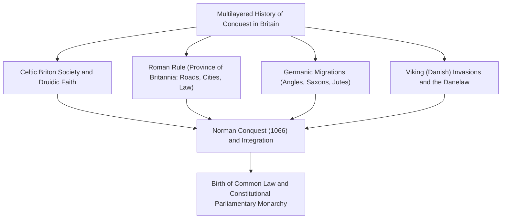
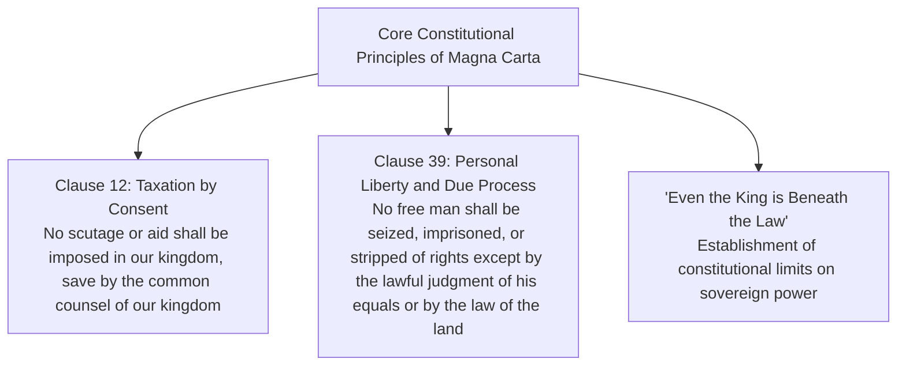
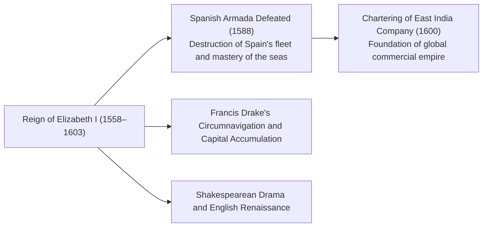
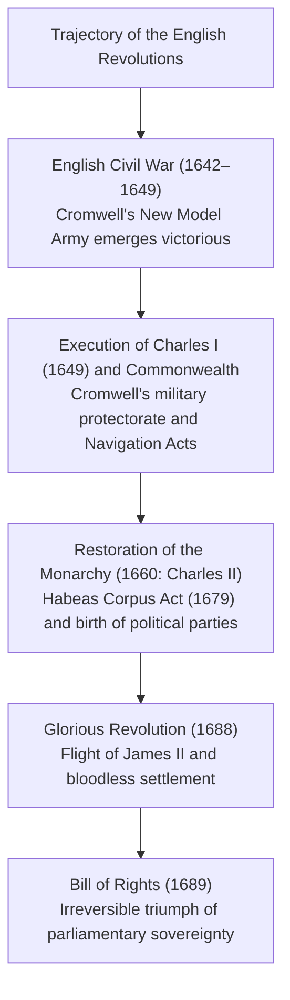
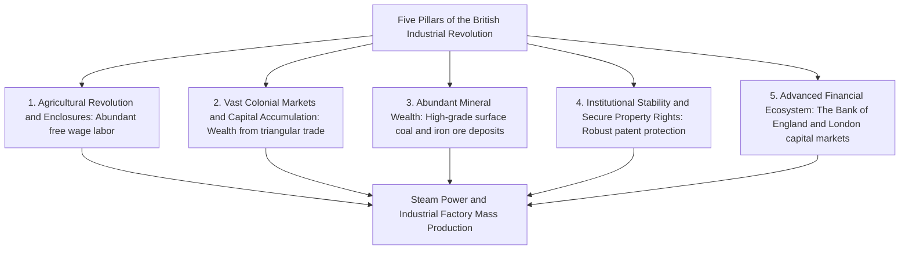
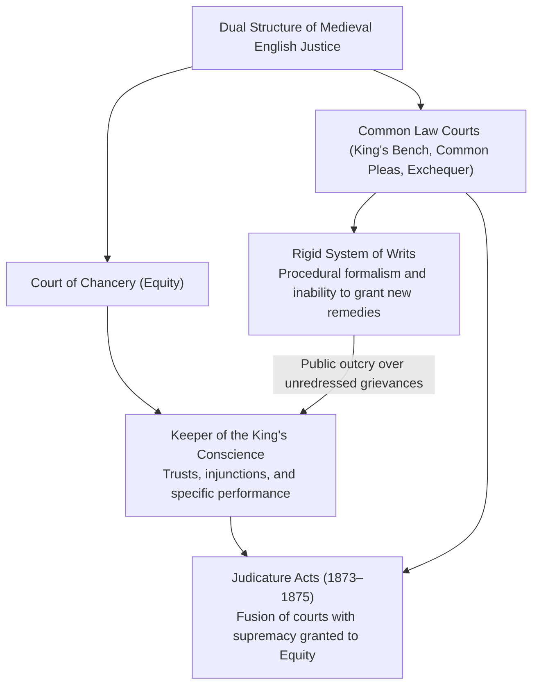
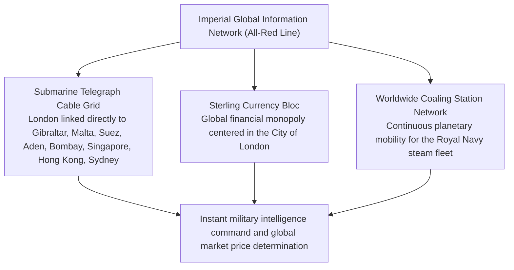
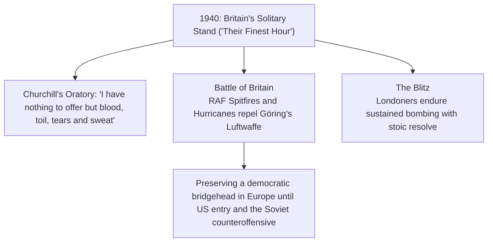
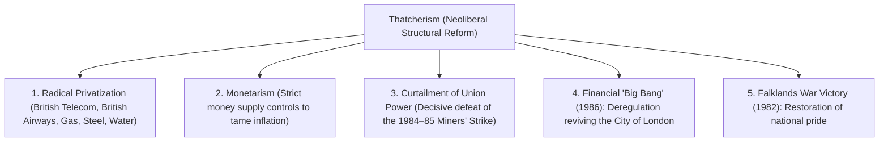

## 1. Introduction: Island Geopolitics and the Spirit of Legal Order

### 1.1 Celtic Megalithic Civilization and the Roman Province of Britannia

Floating in the northwestern seas off continental Europe, the island of Great Britain has witnessed repeated waves of migration and conquest since prehistoric times. Erected on Salisbury Plain during the 3rd millennium BCE, the megalithic monument of **Stonehenge** stands as a testament to the advanced astronomical knowledge and profound religious devotion of pre-literate indigenous peoples.

During the first millennium BCE, Celtic-speaking tribes (the Britons) brought ironworking civilization to the island, establishing fertile agriculture and practicing nature worship guided by the Druid priesthood. Following two reconnaissance expeditions led by Gaius Julius Caesar in 55 and 54 BCE, Emperor Claudius launched a full-scale invasion in 43 CE. The southern half of Great Britain was subsequently incorporated into the Roman Empire as the imperial province of **Britannia**.

Roman rule spanned nearly four centuries. Planned urban centers—most notably **Londinium**, the precursor to modern London—were established, and a robust network of paved Roman roads (such as Watling Street) traversed the island. The Romans introduced mining techniques, public bathhouses, the Latin language, and Christianity. To repel incursions from the Pictish tribes of Caledonia (Scotland) to the north, Emperor Hadrian ordered the construction of **Hadrian's Wall**, a stone fortification stretching across northern England that still stands today as a formidable monument to the empire's northern frontier. In 410 CE, facing the Visigothic sack of Rome, Emperor Honorius ordered the withdrawal of all imperial legions from Britannia, thrusting the island back into a turbulent "Dark Age."

---

### 1.2 The Anglo-Saxon Invasions, the Heptarchy, and the Miracle of Alfred the Great

Following the departure of the Roman legions, three Germanic tribes—the Angles, Saxons, and Jutes—embarked on a massive migration across the North Sea in the mid-5th century. The indigenous Celtic Britons were gradually driven westward into Wales and Cornwall, and northward into the mountainous terrain of Scotland. (This heroic Celtic resistance later evolved into one of the crown jewels of medieval chivalric literature: the legend of King Arthur.)

The Germanic invaders established small kingdoms throughout the conquered territory, eventually settling into an era of competing realms known as the **"Heptarchy" (Seven Kingdoms)**: Northumbria, Mercia, East Anglia, Essex, Sussex, Wessex, and Kent. At the end of the 6th century, Saint Augustine, dispatched by Pope Gregory I as the first Archbishop of Canterbury, initiated the rapid Christianization of England.

Toward the end of the 8th century, Scandinavian Viking raiders (the Danes) descended upon the British coast. Sacking monasteries and overrunning the eastern half of England, the Danes appeared unstoppable. Amid this existential crisis, King **Alfred the Great (r. 871–899)** of Wessex emerged as the sole defender of Anglo-Saxon England:
- At the **Battle of Edington (878)**, Alfred decisively routed the Danish army and subsequently concluded the Treaty of Wedmore, dividing England into two spheres (designating the eastern half as the "Danelaw").
- To safeguard his realm against future raids, he established a nationwide network of fortified towns known as **burghs** and laid the foundations of the English royal navy.
- He codified laws, commissioned the compilation of the *Anglo-Saxon Chronicle*, and fostered education by translating classical Latin works into Old English for clergy and freemen alike.
- As the only monarch in English history officially granted the epithet "the Great," Alfred's reign saw the birth of the unifying national concept of **"Engla-lond" (the land of the Angles = England)**.

---

## 2. The Norman Conquest (1066) and the Jurisprudence of Magna Carta

### 2.1 The Fateful Year 1066: The Battle of Hastings and the Norman Dynasty

In 1066, the death of King Edward the Confessor plunged England into a succession crisis. Harold Godwinson was chosen as King Harold II by the Witenagemot (council of elders), but across the English Channel, William, Duke of Normandy, asserted his own legitimate claim to the throne and assembled an invasion fleet.

On October 14, 1066, the armies clashed at the **Battle of Hastings**.
The formidable Anglo-Saxon "shield wall" resisted wave after wave of Norman cavalry and archers throughout the day. By dusk, Harold II fell mortally wounded after being struck in the eye by an arrow. The Anglo-Saxon ranks collapsed, and William was crowned King William I ("William the Conqueror") at Westminster Abbey on Christmas Day 1066.

The **Norman Conquest** marks the most critical watershed in British history:
1. **Geopolitical Reorientation**: England’s diplomatic and commercial axis, previously anchored in Scandinavia and the Norse world, was fundamentally redirected toward continental Europe and Latin Christendom.
2. **Linguistic and Cultural Dualism**: The ruling class (nobles, the royal court, and the judiciary) spoke Anglo-Norman French, while the subjugated commoners spoke Germanic Old English. Over several centuries, these two tongues merged, giving birth to Middle and Modern English—a language of extraordinary lexical wealth.
3. **The Domesday Book (1086)**: William I ordered a comprehensive land survey across the kingdom, recording estates, forests, livestock, watermills, and the exact population of tenants and freemen. This extraordinary administrative feat ("The Book of the Day of Judgment") established a degree of centralized feudal governance far more potent and structured than anything seen on the European continent.

---

### 2.2 Judicial Reforms of Henry II and the Birth of Common Law

In the mid-12th century, Henry of Anjou ascended the throne as **Henry II (r. 1154–1189)**, founding the Plantagenet dynasty. Governing an expansive realm known as the Angevin Empire—which spanned from Scotland to the Pyrenees—this visionary sovereign revolutionized the English legal system.

To overcome the chaotic, fragmented system of local manorial courts and customary laws, Henry II institutionalized the system of **Assize Courts (itinerant royal judges)** traveling circuits across the country:
- Royal judges evaluated, standardized, and integrated local customs and judicial precedents into a unified legal system applicable across the entire realm: the **Common Law**.
- He established the foundational machinery of the **Jury System**, relying on the sworn testimony of impartial, reputable local freemen to determine facts in dispute.
- Rather than relying solely on enacted civil codes drafted by a monarch or legislature, the English legal tradition became rooted in judge-made precedent—the doctrine of **Stare Decisis**—which became a cornerstone of Anglo-American jurisprudence.

---

### 2.3 Magna Carta (1215): The Genesis of the Rule of Law

Henry II's youngest son, the infamous King **John "Lackland" (r. 1199–1216)**, suffered disastrous military defeats against King Philip II of France, forfeiting nearly all Angevin continental holdings, and was excommunicated following a bitter conflict with Pope Innocent III. Desperate to finance his military campaigns, John levied extortionate feudal dues (scutage) and ruled through tyrannical extortion. Driven to the brink, the English barons took up arms and occupied London.

On June 15, 1215, at the meadow of Runnymede near Windsor, the rebellious barons forced King John to set his Great Seal to a charter of liberties: **Magna Carta (The Great Charter)**.

Magna Carta's historical significance transcends its original function as a medieval baronial peace treaty. It established the universal doctrine of the **Rule of Law**: *that sovereign authority is not absolute, and that even the monarch is subject to and bounded by the law*. In particular, Clause 39, the foundation of **"Due Process of Law,"** served as the ideological bedrock for the 17th-century English revolutions and directly inspired the Bill of Rights of the United States Constitution.

In 1295, King Edward I summoned the **Model Parliament**, which included not only nobles and high-ranking prelates but also two elected knights from each shire and two burgesses from each borough. This assembly established the permanent bicameral template of the British Parliament: the House of Lords and the House of Commons.

---

## 3. The Hundred Years' War, the Wars of the Roses, and Tudor Absolutism

### 3.1 The Hundred Years' War (1337–1453), the Black Death, and the Decline of Serfdom

Contestation over the French royal succession and economic control over the Flemish cloth trade triggered the intermittent **Hundred Years' War** between England and France, lasting 116 years.
- English armies led by Edward III, the Black Prince, and Henry V deployed the lethal Welsh **longbow** to devastating effect. At battles such as Crécy (1346) and Agincourt (1415), English archers decimated the heavy aristocratic cavalry of France, signaling the tactical demise of medieval feudal chivalry.
- The dramatic appearance of Joan of Arc turned the tide in France's favor. By 1453, England had lost all continental territories except Calais. Forcibly expelled from the continent, the English aristocracy ceased to regard themselves as "French lords," cultivating instead a distinct English national identity.

During this conflict, in 1348, the **Black Death (Bubonic Plague)** struck Great Britain, wiping out between one-third and one-half of the population:
- The catastrophic labor shortage dramatically elevated the bargaining power and wages of surviving serfs and agricultural laborers.
- When the landlord class attempted to enforce wage ceilings and reinstate feudal labor services, the **Peasants' Revolt of 1381** (led by Wat Tyler and John Ball) exploded across southeast England. Under the egalitarian slogan *"When Adam delved and Eve span, who was then the gentleman?"*, feudal serfdom in England disintegrated centuries earlier than in continental Europe.

---

### 3.2 The Wars of the Roses and the Dawn of the Tudor Dynasty

Following defeat in the Hundred Years' War, England descended into thirty years of factional, aristocratic civil strife known as the **Wars of the Roses (1455–1485)**, fought between the House of Lancaster (red rose) and the House of York (white rose).
Decades of reciprocal slaughter and executions decimated the old feudal nobility, leaving the feudal magnate class broken and politically exhausted.

In 1485, at the Battle of Bosworth Field, Henry Tudor defeated and slew King Richard III of York. Crowned as **Henry VII**, he established the **Tudor dynasty**. To keep surviving magnates in check, Henry VII empowered the **Court of Star Chamber** and appointed the local landed gentry as unpaid Justices of the Peace (JPs), laying the bedrock of modern centralized administrative monarchy.

---

### 3.3 Henry VIII's Reformation and the Elizabethan Golden Age

The character of Tudor England was forged by the religious reformation of **Henry VIII (r. 1509–1547)**.
When Pope Clement VII refused to annul Henry's marriage to Catherine of Aragon—preventing him from wedding Anne Boleyn—Henry severed England’s ties with the Roman Catholic Church:
- **1534 Act of Supremacy**: Henry proclaimed the English monarch to be the supreme head of the Church of England (Anglican Church) on earth.
- He dissolved all monasteries, seizing and selling their vast monastic estates to the gentry and commercial elites. This fiscal revolution created an entrenched, affluent landholding class whose economic prosperity was tied to the permanence of the royal break with Rome.

Following the brief, bloody Catholic reaction under Mary I ("Bloody Mary"), Henry's daughter **Elizabeth I (r. 1558–1603)** ascended the throne. Through the **Act of Uniformity (1559)**, Elizabeth established the Anglican religious settlement via the *Via Media* (Middle Way)—maintaining traditional liturgical hierarchy while embracing moderate Protestant theology.

In 1588, King Philip II of Spain launched the "Invincible Armada" to crush Protestant England. Through the fire-ship tactics of Sir Francis Drake and severe Atlantic storms, the Armada was destroyed. In 1600, Elizabeth granted a royal charter to the **East India Company**, initiating British commercial expansion into South and East Asia. As William Shakespeare’s plays enthralled crowds at the Globe Theatre, England emerged as an energetic maritime power.

---

## 3.6 "Sheep Eat Men": Enclosures and the Social History of the Elizabethan Poor Law

The 16th-century Tudor economy was convulsed by the **First Enclosure Movement**, driven by soaring European demand for English wool.

### ① Thomas More's Indictment in *Utopia* (1516)
Great landowners and noblemen systematically evicted tenant farmers from common lands and open fields, enclosing communal pastures with hedges to graze lucrative sheep herds.
In his masterpiece *Utopia*, humanist and Lord Chancellor Thomas More penned a scathing condemnation of this violent process of primitive capital accumulation:

> **"Your sheep, that were wont to be so meek and tame, and so small eaters, now, as I hear say, be become so great devourers and so wild, that they eat up, and swallow down, the very men themselves. They consume, destroy, and devour whole fields, houses, and cities."**

Dispossessed peasant families flooded into growing towns like London as "vagabonds" and vagrants, where thousands were hanged under brutal vagrancy statutes.

### ② The Landmark Elizabethan Poor Law (1601)
To curb growing destitution and rural unrest, Parliament enacted the **Poor Law of 1601**:
- Administered and funded at the parish level through a mandatory local property tax (the **Poor Rate**).
- Categorized the impoverished into three distinct groups:
  1. The **"Able-bodied poor"**: compelled to work in houses of industry/workhouses.
  2. The **"Impotent poor"** (orphans, the elderly, sick, and disabled): provided with outdoor relief or almshouses.
  3. The **"Vagrant and idle"**: subjected to correctional confinement and punishment.
- By shifting poor relief from voluntary Christian charity to a statutory legal obligation of the state, this legislation established the world's first systemic public assistance framework—the distant ancestor of the 20th-century British welfare state.

---

## 4. The British Revolutions and the Birth of Constitutional Monarchy

### 4.1 Stuart Absolutism and the English Civil War (1642–1649)

When Elizabeth I died unmarried and childless, King James VI of Scotland was invited to assume the English crown as **James I**, inaugurating the Stuart dynasty.

Both James I and his son **Charles I** championed the continental doctrine of the **Divine Right of Kings**, governing arbitrarily, collecting non-parliamentary levies (such as Ship Money), and persecuting Puritans. Jurist Sir Edward Coke countered that *"the King himself ought not to be under any man, but under God and the Law."* In 1628, Parliament drafted the **Petition of Right**, prohibiting non-parliamentary taxation and arbitrary imprisonment.

After ruling without Parliament for eleven years ("Personal Rule" or "Eleven Years' Tyranny"), Charles I was forced to recall it to fund the Bishops' Wars in Scotland. Tensions boiled over, culminating in the **English Civil War (Puritan Revolution)** between Royalist Cavaliers and Parliamentary Roundheads.

Under Oliver Cromwell's leadership, the fervent, disciplined **New Model Army** crushed Royalist forces. On January 30, 1649, King Charles I was tried before a High Court of Justice as a *"tyrant, traitor, murderer, and public enemy"* and publicly beheaded before the Banqueting House in Whitehall—an unprecedented act that stunned Europe.

The monarchy and House of Lords were abolished, establishing the Commonwealth of England. However, Cromwell’s subsequent military dictatorship as Lord Protector alienated the nation through austere Puritan prohibitions. Following his death, Parliament restored the monarchy in 1660 under **Charles II** (the Stuart Restoration).

---

### 4.2 The Glorious Revolution (1688) and the Bill of Rights

When Charles II's brother, the open Catholic **James II**, took the throne and attempted to impose Catholic dominance while suspending parliamentary legislation, the two emergent political factions—the **Tories** (defenders of royal prerogative) and the **Whigs** (champions of parliamentary supremacy)—joined forces.

In 1688, parliamentary leaders invited James II’s Protestant daughter, Mary, and her Dutch husband, **William of Orange (Stadtholder William III)**, to invade England. William landed with an army, and James II fled to France without offering battle. This bloodless transition is celebrated as the **Glorious Revolution**.

In 1689, William III and Mary II formally accepted the Declaration of Right, enacted into statute as the **Bill of Rights (1689)**:
- Monarchs may not suspend laws or execute statutes without parliamentary consent.
- Levying taxes without parliamentary approval is declared illegal.
- Freedom of speech and debates in Parliament cannot be impeached or questioned in any court.
- Maintaining a standing army in peacetime without parliamentary consent is prohibited.
- Regular parliaments must be held.

This constitutional settlement established modern **Constitutional Monarchy** and the bedrock principle of **Parliamentary Sovereignty**: *"The monarch reigns, but does not rule."*

In 1707, under Queen Anne, the **Act of Union** unified England and Scotland into the single **Kingdom of Great Britain**. In 1714, the Hanoverian dynasty commenced with George I (who spoke little English), paving the way for Sir Robert Walpole to become Britain's first de facto Prime Minister, institutionalizing the **Cabinet System** of government responsible to Parliament.

---

## 5. The Industrial Revolution and Pax Britannica

### 5.1 Becoming the "Workshop of the World": Mechanics of the First Industrial Revolution

Why did the world’s first Industrial Revolution erupt in 18th-century Britain? The answer lies in a convergence of five unique historical advantages:

- **Cotton Textile Innovations**: John Kay's Flying Shuttle, James Hargreaves' Spinning Jenny, Richard Arkwright's Water Frame, Samuel Crompton's Spinning Mule, and Edmund Cartwright's Power Loom.
- **Power Revolution**: James Watt's perfection of the separate-condenser steam engine (1769). Industrial manufacturing shifted from riverside mills to massive urban factories situated atop coalfields (Manchester, Birmingham).
- **Transport Revolution**: George Stephenson's steam locomotive (*The Rocket*, 1829). Following the Liverpool and Manchester Railway's opening, rail networks crisscrossed Britain, drastically lowering freight and transit costs.

In 1851, the Great Exhibition opened in London’s Hyde Park inside the majestic iron-and-glass **Crystal Palace**. Visited by over six million people from around the globe, it cemented Britain's status as the uncontested **"Workshop of the World."**

---

### 5.2 The Imperial Expansion of the British Empire

During the Victorian era (1837–1901), shielded by the supreme naval dominion of the Royal Navy and sustained by free-trade commerce, Britain presided over an era of global hegemony: **Pax Britannica (The British Peace)**.

The "empire on which the sun never set" encompassed one-quarter of the world's landmass and governed one-quarter of humanity.

| Region | Colony / Territory | Nature of Rule and Historic Milestones |
| :--- | :--- | :--- |
| **South Asia** | **India ("The Jewel in the Crown")** | Governed by the East India Company since the Battle of Plassey (1757). Following the Indian Rebellion of 1857 (Sepoy Mutiny), the company was dissolved and direct Crown rule (*The British Raj*) established. In 1877, Queen Victoria was proclaimed Empress of India. |
| **East Asia** | **China (Qing Dynasty) & Hong Kong** | British illicit opium smuggling culminated in the First Opium War (1840). The Treaty of Nanking (1842) ceded Hong Kong and opened Treaty Ports under extraterritorial jurisdiction. |
| **Africa** | **From Egypt to South Africa** | Acquisition of Suez Canal shares by Disraeli (1875). Cecil Rhodes' "Cape to Cairo" transcontinental railway scheme (3C policy: Cairo, Calcutta, Cape Town). The Anglo-Boer Wars. |
| **Dominions** | **Canada, Australia, New Zealand** | White settler colonies received responsible self-government early on, serving as the evolutionary foundation of the modern Commonwealth of Nations. |

Domestically, British politics flourished under the rivalry between Conservative Prime Minister Benjamin Disraeli (Tory social reform and imperial prestige) and Liberal leader William Gladstone (fiscal rectitude, free trade, and Irish Home Rule). Successive Reform Acts (1832, 1867, and 1884) progressively enfranchised the working class, setting Britain on an orderly path toward universal suffrage.

---

## 2.4 The Dual System of Common Law and Equity, and the Doctrine of Writs

Unlike continental Roman-derived civil law systems, English jurisprudence is uniquely characterized by the parallel coexistence of **Common Law** and **Equity**.

### ① Formalism and the System of Writs
To launch a lawsuit in the royal Common Law courts between the 12th and 13th centuries, a plaintiff had to purchase a specific royal **Writ** from the Chancery corresponding to the exact cause of action.
Fearing the expansion of royal jurisdiction, baronial opposition secured the Provisions of Oxford in 1258, which forbade the Chancellor from issuing new forms of writs without the King's Council's approval. Common Law courts calcified into rigid procedural formalism, refusing remedies if a claim failed to fit existing writ templates.

### ② The Court of Chancery and the Invention of the "Trust"
Aggrieved subjects denied justice under Common Law formalism submitted petitions directly to the Crown. The King referred these matters to the **Lord Chancellor**, the senior cleric and "Keeper of the King's Conscience."
- The Chancellor adjudicated cases without procedural technicalities, guided by natural justice, fairness, and conscience: this evolved into the body of law known as **Equity**.
- Whereas Common Law could only award retrospective financial damages, Equity introduced forward-looking remedies: **Specific Performance** (ordering parties to execute contract terms) and **Injunctions** (prohibiting unlawful conduct).
- Equity devised the concept of the **Trust** (originating from knights departing for the Crusades entrusting land titles to custodians for the benefit of their families), distinguishing legal title from beneficial ownership—one of the most brilliant innovations in world legal history.

---

## 3.4 Subjugation of the Celtic Fringe: The Agonies of Scotland and Ireland

English expansionism was equally a history of ruthless military subjugation and colonial imposition upon neighboring Celtic nations.

### ① The Scottish Wars of Independence: Wallace and Bruce
In the late 13th century, King Edward I, known as the "Hammer of the Scots," intervened in a Scottish succession crisis to conquer the northern realm, looting the sacred coronation stone, the "Stone of Scone," to London.
- In 1297, William Wallace led a popular insurrection, routing English heavy cavalry at the Battle of Stirling Bridge.
- In 1314, King Robert the Bruce annihilated a vastly superior English army at the **Battle of Bannockburn**, securing Scottish sovereignty, later recognized in the 1328 Treaty of Edinburgh–Northampton.

### ② Cromwell's Conquest of Ireland and the Great Famine
The fate of Ireland was profoundly more catastrophic:
- In 1649, following the Civil War, Oliver Cromwell launched a brutal military conquest of Ireland. Infamous massacres at Drogheda and Wexford were followed by the wholesale confiscation of Catholic lands, which were redistributed to Protestant Anglo-Scottish settlers (the Plantation of Ulster). Native Irish Catholics were reduced to impoverished tenant farmers.
- **The Great Famine (1845–1852)**: When potato blight devastated Ireland's staple crop, the British government, dogmatically committed to laissez-faire economic orthodoxy, permitted the continued export of Irish grain and cattle to England while the rural populace starved.
  - Over one million Irish died of starvation and disease, and more than one million emigrated aboard perilous "coffin ships" to North America (founding the vast Irish-American diaspora). Ireland's population dropped by nearly half, cementing an indelible legacy of nationalist bitterness against British rule.

---

## 5.5 Geopolitical Infrastructure and Information Hegemony: Undersea Cables and the Great Game

Victorian global hegemony relied on far more than naval gunboats; it was underpinned by the world's **first planetary telecommunication and intelligence infrastructure**.

- **The All-Red Line**: Dominating gutta-percha insulation technology, Britain laid an uninterrupted undersea telegraph cable grid connecting all British possessions (traditionally shaded red on world maps). Because cables landed almost exclusively on British-controlled soil, wartime communications were virtually immune to foreign interception or severance.
- **The Great Game**: Across the 19th and early 20th centuries, the British Empire and the Russian Empire engaged in an intense shadow war for dominance over Central Asia (Afghanistan, Persia, and Tibet). This contest, immortalized in Rudyard Kipling's *Kim*, gave birth to classical modern geopolitics, including Halford Mackinder's Heartland Theory.

---

## 6. The Two World Wars and the Twilight of Empire

### 6.1 World War I and Imperial Exhaustion

Facing the rapid industrialization and high-seas naval expansion of Imperial Germany in the early 20th century, Britain abandoned its policy of "Splendid Isolation," concluding the Anglo-Japanese Alliance (1902), the Entente Cordiale with France (1904), and the Anglo-Russian Convention (1907) to forge the Triple Entente.

In August 1914, World War I erupted:
- Along the Western Front in northern France (the Somme, Passchendaele), an entire generation of young men was sacrificed in the face of machine guns, artillery barrages, and poison gas.
- Although the Royal Navy's blockade and the Battle of Jutland contained the German fleet, astronomical wartime expenditures forced Britain to liquidate foreign assets, transforming the country from the world's preeminent creditor nation into a debtor nation dependent on the United States.

In the 1920s, the Labour Party supplanted the Liberals as the primary opposition, forming the first Labour government under Ramsay MacDonald. The Representation of the People Act of 1928 achieved universal adult suffrage for men and women on equal terms at age 21. Meanwhile, the 1916 Easter Rising and the subsequent Anglo-Irish War led to the creation of the independent Irish Free State in 1922, with only the six northern counties of Ulster remaining in the UK.

---

### 6.2 World War II and Churchill's Solitary Resistance

During the 1930s, as Nazi Germany rearmed amid the Great Depression, Prime Minister Neville Chamberlain pursued a policy of **Appeasement**, epitomized by the 1938 Munich Agreement.

In September 1939, Hitler's invasion of Poland triggered World War II. In May 1940, as France collapsed under Nazi Blitzkrieg and Western Europe fell, **Winston Churchill** became Prime Minister.

Churchill’s defiant radio broadcasts rallied the nation's resolve. Utilizing early-warning radar networks, young Royal Air Force pilots turned back the German air offensive (*"Never in the field of human conflict was so much owed by so many to so few"*). While allied victory was achieved alongside the US and the USSR following victories at El Alamein (1942) and Normandy (1944), Britain emerged physically battered and financially insolvent.

---

### 6.3 "From the Cradle to the Grave" and Decolonization

In the July 1945 general election, the British electorate voted out Churchill's Conservatives in a landslide victory for Clement Attlee’s Labour Party. The nation demanded sweeping social reconstruction over imperial glory:
- **Construction of the Welfare State**: Implementing the wartime Beveridge Report, Labour established comprehensive social security **"from the cradle to the grave."** In 1948, the **National Health Service (NHS)** was founded, providing healthcare free at the point of delivery to all citizens, while coal, railways, electricity, and steel were nationalized.
- **Imperial Dissolution (Decolonization)**:
  - In 1947, following Mahatma Gandhi's nonviolent resistance, India and Pakistan achieved independence.
  - The **1956 Suez Crisis**: When Egyptian President Gamal Abdel Nasser nationalized the Suez Canal, Britain and France launched a joint military intervention with Israel. Crushing diplomatic and financial pressure from the United States and the United Nations forced an ignominious withdrawal, brutally exposing Britain's demotion from imperial superpower to secondary power.

---

## 7. From Thatcherism to the "Third Way" and Brexit

### 7.1 The "British Disease" and the Thatcher Revolution

By the 1970s, expansive welfare spending, uncompetitive nationalized industries, and frequent trade union strikes plunged Britain into stagflation—a malaise christened the **"British Disease."** The crisis peaked during the catastrophic **"Winter of Discontent" (1978–1979)**, when widespread public-sector strikes paralyzed sanitation, transport, and hospitals.

In May 1979, **Margaret Thatcher ("The Iron Lady")** swept into 10 Downing Street as Britain's first female Prime Minister.

Thatcher's economic shock therapy incurred steep human costs: industrial devastation across northern England, sharp spikes in unemployment, and widening social inequality. Nonetheless, deregulation revitalized macroeconomic growth and restored London as a premier global financial capital.

---

### 7.2 Tony Blair and the "Third Way"

In 1997, Tony Blair led "New Labour" to a landslide victory after eighteen years in opposition. He articulated the **"Third Way"**, reconciling Thatcherite free-market dynamism with progressive social investments in education and the NHS:
- Enacted devolution, creating the Scottish Parliament and National Assembly for Wales.
- Brokered the historic **Good Friday Agreement (1998)**, bringing an end to the three decades of sectarian violence in Northern Ireland known as "The Troubles."
- Blair’s controversial decision to commit British forces to the 2003 US-led invasion of Iraq severely undermined his moral credibility and political legacy.

---

### 7.3 The Earthquake of Brexit and 21st-Century Britain

Since entering the European Communities (EC) in 1973, Britain maintained a skeptical posture toward continental federalism, opting out of both the Euro and the Schengen border-free zone.

Mounting friction over European migration, regulatory burdens, and sovereignty culminated in the slogan **"Take Back Control."** On June 23, 2016, a national referendum resulted in a shock victory for the Leave campaign ($51.9\%$ to $48.1\%$).

On January 31, 2020, the United Kingdom formally left the European Union.
Post-Brexit Britain faces formidable challenges: supply chain friction, skilled labor shortages, disputes surrounding the Northern Ireland Protocol, and renewed calls for Scottish independence, all while charting a new global role outside the European single market.

---

## 5.6 Labor Turmoil: From the Luddites to Chartism

Behind the wealth of the Industrial Revolution lay acute human suffering, as mechanization destroyed traditional livelihoods.

### ① The Luddite Movement (1811–1816)
Textile artisans in northern England formed clandestine bands under the mythical figure "General Ned Ludd." Moving under cover of night, they smashed mechanical shearing frames and power looms that threatened their craft. The government responded with brutal force, deploying troops and passing the Frame Breaking Act of 1812, making machine-breaking a capital offense.

### ② The Chartist Movement (1838–1848)
When the Great Reform Act of 1832 enfranchised only middle-class property owners, working-class activists launched the first mass working-class democratic movement in world history.
Drafted by William Lovett and fellow reformers, the **People's Charter** outlined **Six Core Demands**:

1. **Universal Male Suffrage** (abolishing property qualifications)
2. **The Secret Ballot** (protecting voters from landlord and employer intimidation)
3. **Abolition of Property Qualifications for MPs** (enabling working men to serve)
4. **Salaries for Members of Parliament** (allowing non-wealthy individuals to hold office)
5. **Equal Electoral Districts** (securing proportional representation)
6. **Annual Parliaments** (preventing corruption and ensuring accountability)

Although Parliament rejected Chartist petitions containing millions of signatures three times, five of the six demands (excluding annual parliaments) were enacted into law between the late 19th and early 20th centuries, establishing the bedrock of modern British democracy.

---

## 7.5 Modernizing the Crown: From the House of Windsor to Queen Elizabeth II

The British monarchy’s enduring popularity stems from its pragmatic adaptability throughout the 20th century.

### ① The Rebranding to the House of Windsor (1917)
During World War I, amidst intense anti-German public sentiment, King George V renounced his family’s historic German dynasty name, the House of Saxe-Coburg and Gotha. He adopted the quintessential English name **House of Windsor**, after Windsor Castle, prioritizing national solidarity over familial lineage.

### ② The 1936 Abdication Crisis
King Edward VIII’s desire to marry Wallis Simpson, a twice-divorced American, met intractable opposition from Prime Minister Stanley Baldwin and the Anglican Church. Edward chose to abdicate after just 325 days, ceding the throne to his stammering younger brother, George VI (immortalized in *The King's Speech*). The crisis reaffirmed the constitutional boundary that the monarch must abide by the counsel of the elected Cabinet.

### ③ Queen Elizabeth II's Platinum Reign (1952–2022)
Ascending the throne at age 25 in 1952, Queen Elizabeth II reigned for seventy years until her death in 2022 at age 96.
Through post-war decolonization, Cold War tensions, industrial decline, and intense scrutiny of royal family affairs, she maintained stoic political impartiality and dedication to public service, serving as an indispensable symbol of unity for the United Kingdom.

---

## 8. Conclusion: The Wisdom of Enduring Tradition and Incremental Reform

The central marvel of British history is that **without a single written codified constitution, the nation has nurtured and preserved one of the world's most stable, durable frameworks of the Rule of Law and Parliamentary Democracy**.

Rather than demolishing past structures in revolutionary upheavals to build republics anew from abstract blueprints, the British constitutional model has sought legitimacy in accumulated custom, judicial precedents, and historic charters (Magna Carta, the Petition of Right, the Bill of Rights), adapting them gradually through **incremental reform**.

The quest for liberty that began with medieval barons curbing the tyranny of the Crown:
- Was forged into ordinary individual civil rights by Common Law judges,
- Elevated to sovereign authority by parliamentarians,
- Extended to universal voting rights by industrial working-class movements,
- And fulfilled through the post-war welfare state protecting society's most vulnerable.

Though transformed from a planetary empire into an island nation navigating the waters between Europe and the Atlantic, the principles Britain bequeathed to human civilization—**the Rule of Law, Parliamentary Governance, and Individual Liberty**—remain an enduring beacon across the free world.
