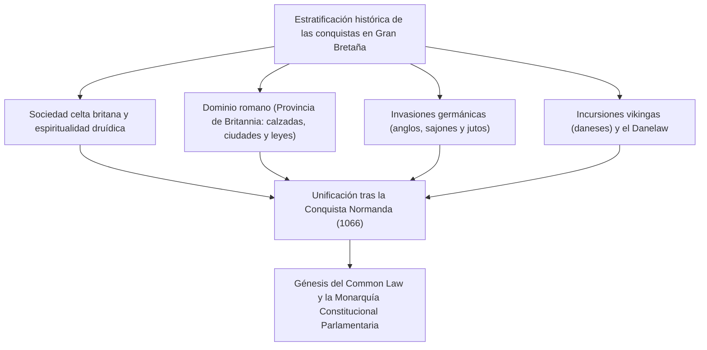
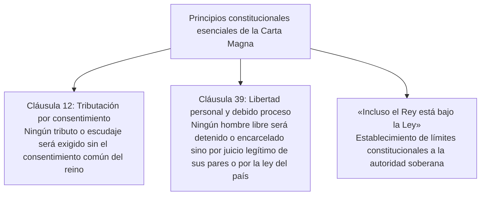
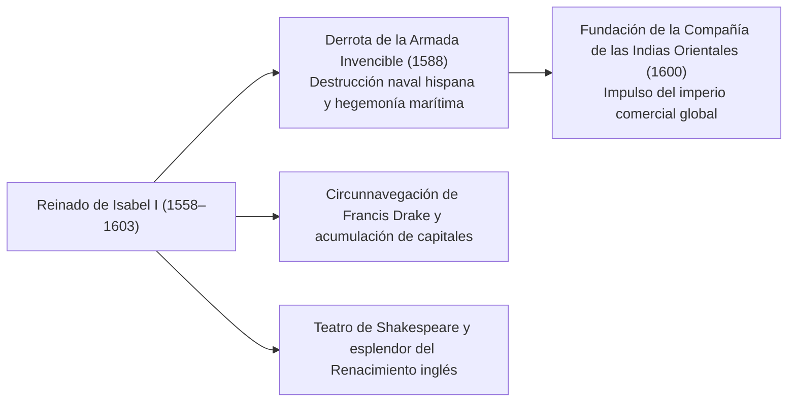
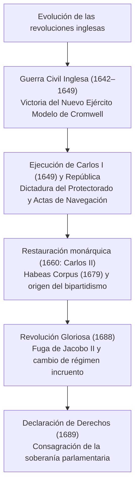
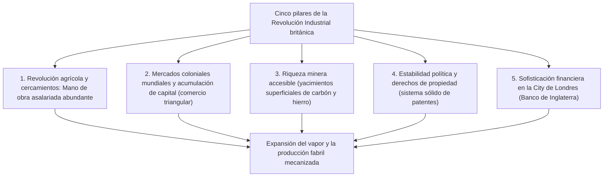
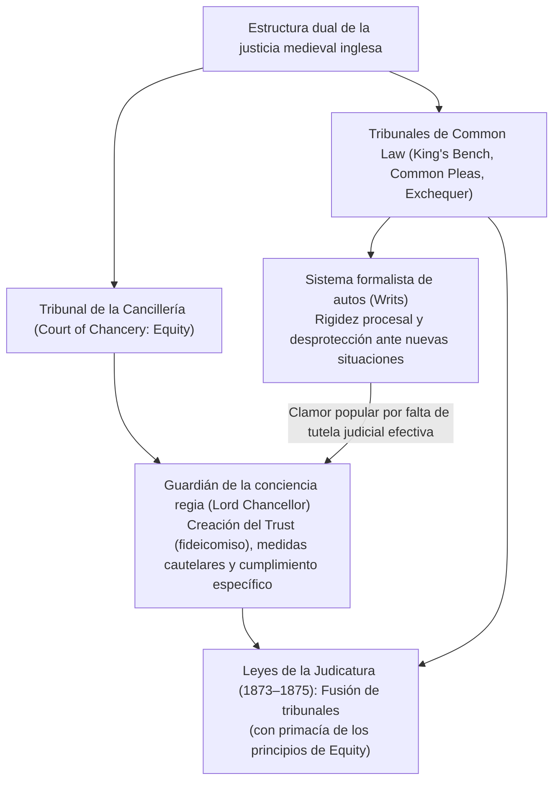
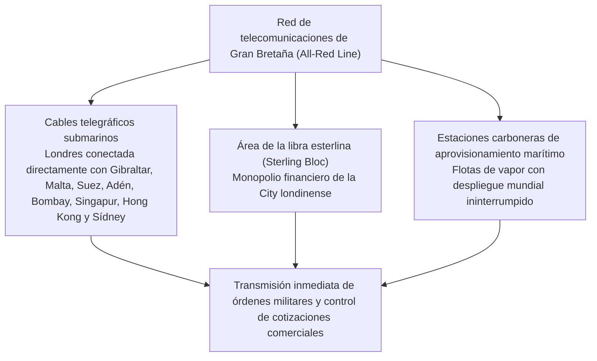
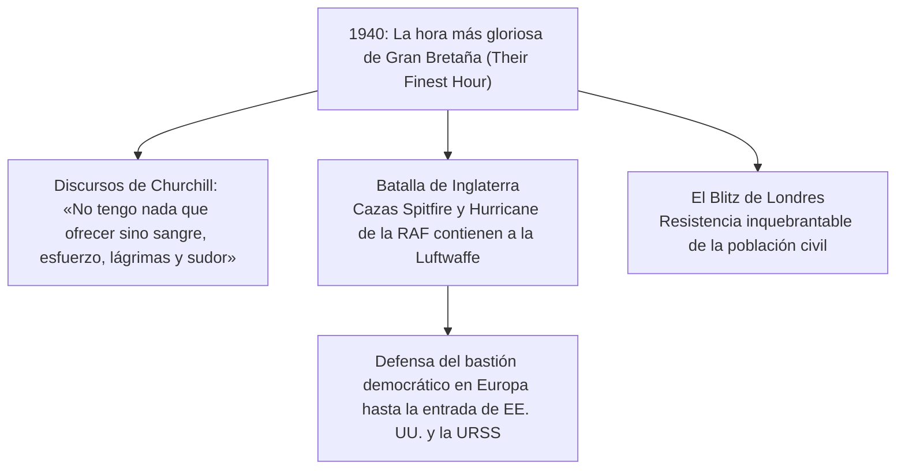
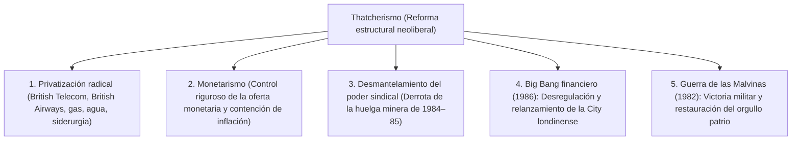

## 1. Introducción: Geopolítica insular y el espíritu del orden jurídico británico

### 1.1 Civilización megalítica celta y la provincia romana de Britannia

Situada en los mares noroccidentales de la Europa continental, la isla de Gran Bretaña ha experimentado desde tiempos prehistóricos sucesivas oleadas de migraciones y conquistas. Erigido en la llanura de Salisbury durante el tercer milenio a. C., el monumento megalítico de **Stonehenge** constituye un testimonio elocuente del avanzado conocimiento astronómico y la devoción religiosa de sus antiguos pobladores ágrafos.

Durante el primer milenio a. C., tribus celtas portadoras de la metalurgia del hierro (los britanos) se asentaron en la isla, estableciendo una próspera economía agrícola y practicando rituales de adoración a la naturaleza guiados por la casta sacerdotal de los druidas. Tras dos expediciones de reconocimiento comandadas por Cayo Julio César en los años 55 y 54 a. C., el emperador Claudio ordenó una invasión a gran escala en el año 43 d. C., integrando la mitad meridional de Gran Bretaña como la provincia romana de **Britannia**.

La dominación romana se prolongó durante casi cuatro siglos. Se fundaron ciudades planificadas, entre ellas **Londinium** (origen de la moderna Londres), y una densa red de calzadas romanas pavimentadas (como Watling Street) cruzó la isla. Con Roma llegaron la explotación minera, las termas públicas, el latín y el cristianismo. Para frenar las incursiones de las tribus pictas de Caledonia (Escocia), el emperador Adriano ordenó la edificación del imponente **Muro de Adriano (Hadrian's Wall)**, bastión septentrional del imperio que todavía asombra en nuestros días. En el año 410 d. C., ante el inminente saqueo de Roma por los visigodos, el emperador Honorio ordenó la retirada total de las legiones imperiales, arrojando a la isla a un turbulento período de oscurantismo y fragmentación.

---

### 1.2 Invasiones anglosajonas, la Heptarquía y el milagro de Alfredo el Grande

Tras la partida de las legiones romanas, tres tribus de origen germánico procedentes de allende el mar del Norte —los anglos, los sajones y los jutos— iniciaron una intensa invasión hacia mediados del siglo V. Los pueblos celtas autóctonos fueron empujados gradualmente hacia las regiones occidentales de Gales y Cornualles, y hacia las tierras altas de Escocia en el norte (la resistencia de estos guerreros celtas daría pie a la inmortal leyenda caballeresca del Rey Arturo).

Los invasores establecieron múltiples dominios en los territorios conquistados, consolidando con el tiempo la llamada **«Heptarquía» (los Siete Reinos)**: Northumbria, Mercia, Anglia Oriental, Essex, Sussex, Wessex y Kent. A finales del siglo VI, la misión evangélica enviada por el papa Gregorio I y encabezada por Agustín (primer arzobispo de Canterbury) aceleró la cristianización de Inglaterra.

Hacia finales del siglo VIII, los incursores escandinavos (los vikingos o daneses) asolaron las costas británicas. Saqueando monasterios y haciéndose con el control de la mitad oriental de Inglaterra, los daneses parecían imparables. En este momento crítico, surgió del reino sudoccidental de Wessex la figura providencial de **Alfredo el Grande (Alfred the Great, r. 871–899)**:
- Derrotó decisivamente a los daneses en la **Batalla de Edington (878)** y pactó el Tratado de Wedmore, dividiendo el territorio inglés y reconociendo el «Danelaw» bajo control danés.
- Construyó una red de plazas fortificadas por todo el reino (**burghs**) e impulsó las primeras bases de una marina de guerra regular.
- Promulgó un código legal unificado y fomentó la instrucción pública traduciendo textos clásicos latinos al inglés antiguo para el clero y el pueblo, además de ordenar la redacción de la *Crónica Anglosajona*.
- Como único monarca en la historia inglesa honrado oficialmente con el apelativo de «el Grande», Alfredo forjó el embrión de un Estado nacional unificado: **«Engla-lond» (Tierra de los Anglos, Inglaterra)**.

---

## 2. La Conquista Normanda (1066) y la doctrina jurídica de la Carta Magna

### 2.1 El fatídico año 1066: La batalla de Hastings y la dinastía normanda

En 1066, la muerte sin descendencia del rey Eduardo el Confesor desató una crisis sucesoria. Haroldo Godwinson fue coronado como Haroldo II por el Witenagemot (consejo de sabios), pero al otro lado del canal de la Mancha, Guillermo, duque de Normandía, reclamó el trono legítimo y preparó una poderosa armada de invasión.

El 14 de octubre de 1066 tuvo lugar la crucial **Batalla de Hastings**.
La infantería sajona, parapetada tras un férreo «muro de escudos», resistió las arremetidas de la caballería pesada y los arqueros normandos. Al anochecer, Haroldo II murió tras recibir un flechazo en el ojo; las filas anglosajonas se desmoronaron y Guillermo fue coronado rey de Inglaterra en la abadía de Westminster el día de Navidad de 1066.

Esta **Conquista Normanda (Norman Conquest)** representa el hito más decisivo en la historia británica:
1. **Giro geopolítico radical**: La órbita exterior inglesa abandonó definitivamente el espacio escandinavo y se insertó de lleno en la esfera continental, feudal y latina de Francia y Europa occidental.
2. **Dualismo lingüístico y cultural**: La élite gobernante (nobleza, corte y tribunales) adoptó el anglo-normando (francés medieval), mientras que el pueblo llano conservó el inglés antiguo de raíz germánica. A lo largo de los siglos, ambas lenguas se fusionaron dando origen al inglés moderno, dotado de una extraordinaria riqueza léxica.
3. **El Libro de Domesday (Domesday Book, 1086)**: Guillermo I ordenó un minucioso censo fiscal y territorial en todo su reino, registrando tierras de cultivo, bosques, molinos, cabezas de ganado y la población sierva y libre. Este magno catastro feudal dotó a Inglaterra de una administración centralizada sin parangón en la Europa de su época.

---

### 2.2 Reformas judiciales de Enrique II y el nacimiento del Common Law

A mediados del siglo XII, Enrique de Anjou inauguró la dinastía Plantagenet como **Enrique II (r. 1154–1189)**. Gobernante del vasto Imperio Angevino —que se extendía desde Escocia hasta los Pirineos—, transformó por completo las estructuras jurídicas inglesas.

Con el fin de superar el caos de los tribunales señoriales locales y la disparidad de las costumbres consuetudinarias, Enrique II regularizó el envío de jueces reales itinerantes a través de los **Tribunales de Circuito (Assize Courts)**:
- Los jueces de la Corona recopilaron, armonizaron y unificaron las costumbres locales más equitativas en un corpus legal común para todo el reino: el **Common Law (Derecho Común)**.
- Institucionalizó el **sistema de jurado (Jury System)**, convocando a ciudadanos respetables de la localidad bajo juramento para el esclarecimiento fáctico de los litigios.
- Frente a los códigos abstractos promulgados por legisladores, se consolidó el principio judicial del precedente vinculante (**Stare Decisis**), cimiento del sistema legal anglosajón.

---

### 2.3 La Carta Magna (1215): El nacimiento del Estado de derecho

El hijo menor de Enrique II, el célebre rey **Juan «sin Tierra» (r. 1199–1216)**, perdió la gran mayoría de las posesiones angevinas en Francia frente a Felipe II Augusto y fue excomulgado por el papa Inocencio III. Para financiar sus ruinosas campañas bélicas, impuso gravámenes abusivos (escudajes) y gobernó mediante la extorsión. Agotada su paciencia, los barones feudales se alzaron en armas y tomaron Londres.

El 15 de junio de 1215, en el prado de Runnymede, junto a Windsor, los nobles forzaron al rey Juan a estampar el sello real en un histórico pergamino: la **Carta Magna**.

La trascendencia histórica de la Carta Magna superó ampliamente su contexto original como pacto de prerrogativas estamentales medievales, al proclamar el principio universal del **imperio de la ley (Rule of Law)**: *la máxima autoridad de la Corona no es absoluta y está supeditada al cumplimiento de la ley*. En particular, la cláusula 39 inspiró la doctrina del «debido proceso legal», piedra angular de las revoluciones inglesas del siglo XVII y de la Constitución de los Estados Unidos.

En 1295, Eduardo I convocó el **Parlamento Modelo (Model Parliament)**, al que concurrieron nobles, prelados, dos caballeros por cada condado y dos burgueses por cada ciudad, fijando la estructura bicameral clásica del Parlamento británico: la Cámara de los Lores y la Cámara de los Comunes.

---

## 3. Guerra de los Cien Años, Guerra de las Dos Rosas y absolutismo Tudor

### 3.1 La Guerra de los Cien Años (1337–1453), la Peste Negra y el fin de la servidumbre

Las disputas dinásticas por la corona de Francia y el control del comercio lanero de Flandes desencadenaron la prolongada **Guerra de los Cien Años** entre Inglaterra y Francia (1337–1453).
- Monarcas y caudillos ingleses como Eduardo III, el Príncipe Negro y Enrique V emplearon letales contingentes de **arqueros con arco largo (Longbow)** de origen galés. En Crécy (1346) y Azincourt (1415), estos arqueros destrozaron a la caballería pesada francesa, sentenciando el declive de la caballería feudal.
- El liderazgo patriótico de Juana de Arco revirtió la contienda en favor de Francia; para 1453, Inglaterra había perdido todas sus plazas continentales salvo Calais. Expulsados de Europa, los nobles ingleses dejaron de considerarse señores francófonos y consolidaron su identidad nacional inglesa.

En ese mismo período (1348), la pandemia de **Peste Negra** azotó la isla, aniquilando entre un tercio y la mitad de la población:
- La drástica escasez de mano de obra fortaleció la posición negociadora y los salarios de los campesinos supervivientes.
- La tentativa de los terratenientes de congelar los jornales forzó la gran **Rebelión Campesina de 1381** (liderada por Wat Tyler y John Ball). Bajo la consigna igualitaria *«Cuando Adán araba y Eva hilaba, ¿quién era entonces el caballero?»*, la servidumbre feudal inglesa se extinguió siglos antes que en el continente europeo.

---

### 3.2 La Guerra de las Dos Rosas y el advenimiento de los Tudor

Tras la derrota en Francia, Inglaterra se sumió en un sangriento conflicto dinástico de tres décadas: la **Guerra de las Dos Rosas (1455–1485)** entre la Casa de Lancaster (rosa roja) y la Casa de York (rosa blanca).
Las continuas batallas y purgas exterminaron a gran parte de la alta nobleza feudal, allanando el camino para el fortalecimiento de la monarquía centralizada.

En 1485, en la batalla de Bosworth, Enrique Tudor dio muerte a Ricardo III de York y ascendió al trono como Enrique VII, fundando la **dinastía Tudor**. Sometió a los nobles díscolos mediante el tribunal de la Cámara Estrellada (Court of Star Chamber) e instituyó a los hacendados rurales (*gentry*) como jueces de paz (Justices of the Peace), cimentando el aparato burocrático del Estado moderno.

---

### 3.3 La Reforma de Enrique VIII y la Era Dorada de Isabel I

La fisonomía de la Inglaterra moderna quedó sellada por la Reforma anglicana de **Enrique VIII (r. 1509–1547)**.
Ante la negativa del papa Clemente VII a anular su matrimonio con Catalina de Aragón para desposar a Ana Bolena, Enrique rompió con Roma:
- **Acta de Supremacía (1534)**: Proclamó al monarca inglés como cabeza suprema en la tierra de la Iglesia de Inglaterra (Iglesia Anglicana).
- Disolvió los monasterios católicos y expropió sus inmensos dominios, vendiéndolos a precios ventajosos a la *gentry* y a las élites urbanas. Nació así una poderosa clase terrateniente vinculada económicamente a la defensa del nuevo orden religioso.

Tras el paréntesis reaccionario de María I («Bloody Mary»), ascendió al trono **Isabel I (r. 1558–1603)**. Mediante el Acta de Uniformidad, articuló la vía media (*Via Media*), combinando liturgia de raíz católica y doctrina teológica protestante.

En 1588, Felipe II de España envió la «Armada Invencible» para invadir Inglaterra. Las tácticas con brulotes de sir Francis Drake y los temporales atlánticos diezmaron la flota española. En 1600 se fundó la **Compañía Británica de las Indias Orientales**, iniciando la expansión colonial mercantil en Asia. Al tiempo que el teatro de William Shakespeare deslumbraba en The Globe, Inglaterra se erigía en potencia marítima de primer orden.

---

## 3.6 «Las ovejas devoran a los hombres»: Cercamientos y la Ley de Pobres isabelina

La sociedad inglesa del siglo XVI se vio profundamente alterada por el **primer movimiento de cercamientos (*enclosures*)**, impulsado por la voraz demanda europea de lana.

### ① La denuncia de Tomás Moro en *Utopía* (1516)
Los grandes terratenientes expulsaron a los campesinos de las tierras comunales y campos abiertos, cercando parcelas con setos para pastos ovinos más lucrativos.
El humanista y lord canciller Tomás Moro denunció este cruel proceso de acumulación originaria en *Utopía*:

> **«Vuestras ovejas, que tan mansas eran y que solían alimentarse con tan poco, dicen que ahora han empezado a ser tan devoradoras y fieras que se comen a los propios hombres, asolando y despoblando campos, granjas y villas enteras.»**

Expulsados del campo, los campesinos desposeídos se convirtieron en vagabundos en ciudades como Londres, siendo muchos ahorcados bajo las brutales leyes de vagancia de la época.

### ② Hito de la Ley de Pobres de Isabel I (1601)
Para aplacar el malestar social y la miseria generalizada, el Parlamento aprobó en 1601 la **Ley de Pobres (*Poor Law of 1601*)**:
- Gestión y financiación a nivel de parroquia mediante una tasa impositiva local obligatoria (*Poor Rate*).
- Clasificación de los menesterosos en tres categorías:
  1. **Pobres capacitados**: forzados a trabajar en casas de trabajo (*workhouses*).
  2. **Pobres incapacitados** (huérfanos, ancianos, lisiados y enfermos): atendidos en asilos o mediante socorro domiciliario.
  3. **Vagabundos ociosos**: recluidos y castigados en casas de corrección.
- Al transformar la beneficencia voluntaria cristiana en una responsabilidad jurídica y pública del Estado, esta ley sentó las bases del primer sistema de asistencia social del mundo, precursor del moderno Estado de bienestar.

---

## 4. Las Revoluciones Inglesas y la Monarquía Constitucional

### 4.1 El absolutismo Estuardo y la Revolución Puritana (1642–1649)

A la muerte sin descendencia de Isabel I, el rey Jacobo VI de Escocia asumió la corona inglesa como **Jacobo I**, entronizando a la dinastía Estuardo.

Tanto Jacobo I como su sucesor **Carlos I** profesaron la doctrina continental del **derecho divino de los reyes**, gobernando al margen del Parlamento, decretando impuestos forzosos (como el *Ship Money*) y persiguiendo a los puritanos. El eminente jurista sir Edward Coke proclamó que «el Rey está bajo Dios y la Ley». En 1628, el Parlamento elevó la **Petición de Derechos (Petition of Right)**, vetando las detenciones arbitrarias y la exacción de tributos sin aval parlamentario.

Tras once años de tiranía absolutista sin Parlamento (*Personal Rule*), Carlos I tuvo que convocarlo para sufragar la guerra contra los escoceses. Las fricciones desembocaron en la **Guerra Civil Inglesa (Revolución Puritana)** entre realistas (*Cavaliers*) y parlamentarios (*Roundheads*).

Bajo el mando de Oliver Cromwell, el disciplinado **Nuevo Ejército Modelo (New Model Army)** aplastó a las tropas realistas. El 30 de enero de 1649, **Carlos I fue juzgado como «tirano, traidor, asesino y enemigo público» y decapitado públicamente**, conmocionando a las monarquías europeas.

Se proclamó la Mancomunidad de Inglaterra (República), pero el posterior régimen militar autoritario de Cromwell como Lord Protector generó un hondo rechazo popular. Tras su muerte, en 1660 el Parlamento restauró la monarquía en la persona de **Carlos II**.

---

### 4.2 La Revolución Gloriosa (1688) y el Bill of Rights

Cuando Jacobo II, abiertamente católico, intentó restaurar el absolutismo y suspender leyes parlamentarias, las dos facciones políticas dominantes —los **tories** (partidarios de la prerrogativa regia) y los **whigs** (defensores de la primacía del Parlamento)— forjaron una alianza.

En 1688, los líderes parlamentarios invitaron a la hija protestante de Jacobo II, María, y a su esposo holandés, el estatúder **Guillermo de Orange (Guillermo III)**, a desembarcar con tropas en Inglaterra. Desamparado, Jacobo II huyó a Francia sin presentar combate. Esta transición incruenta se conoce como la **Revolución Gloriosa (Glorious Revolution)**.

En 1689, Guillermo y María juraron la **Declaración de Derechos (Bill of Rights)**:
- Ilegalidad de suspender leyes o recaudar impuestos sin consentimiento parlamentario.
- Garantía irrestricta de la libertad de expresión dentro del Parlamento.
- Prohibición de mantener ejércitos regulares en tiempos de paz sin autorización del Parlamento.
- Obligatoriedad de convocar Parlamentos con frecuencia.

Se consumó así el principio de la **monarquía constitucional** y la **soberanía parlamentaria**: *«El rey reina, pero no gobierna»*.

En 1707, bajo la reina Ana, se promulgó el Acta de Unión, fusionando Inglaterra y Escocia en el **Reino de Gran Bretaña**. En 1714, con la coronación de Jorge I de Hannover (que no dominaba el inglés), sir Robert Walpole asumió la jefatura del gobierno, instituyendo el **gabinete responsable (Cabinet System)** y perfilando la democracia parlamentaria contemporánea.

---

## 5. La Revolución Industrial y la «Pax Britannica»

### 5.1 El taller del mundo: Dinámica de la Primera Revolución Industrial

¿Por qué surgió en Gran Bretaña la primera Revolución Industrial a finales del siglo XVIII? La respuesta radica en la concurrencia de cinco factores exclusivos:

- **Innovaciones en la industria algodonera**: La lanzadera volante de Kay, la hiladora Jenny de Hargreaves, el bastidor hidráulico de Arkwright, la mula de hilar de Crompton y el telar mecánico de Cartwright.
- **La máquina de vapor**: Perfeccionada por James Watt en 1769 con condensador separado, permitió trasladar los centros de producción fabril de las riberas fluviales a las cuencas carboníferas (Mánchester, Birmingham).
- **Revolución del transporte**: La locomotora de vapor *The Rocket* de George Stephenson (1829) y la línea Liverpool-Mánchester abrieron paso a una tupida red ferroviaria que redujo drásticamente los costes de flete.

En 1851 se inauguró en Hyde Park la Gran Exposición Universal en el vanguardista **Palacio de Cristal (Crystal Palace)**. Más de seis millones de visitantes presenciaron la consagración de Gran Bretaña como el indiscutible **«taller del mundo» (Workshop of the World)**.

---

### 5.2 El apogeo imperial de la era victoriana

Durante el reinado de Victoria (1837–1901), amparada por la hegemonía indiscutida de la Marina Real (*Royal Navy*) y el libre comercio internacional, Gran Bretaña lideró la era conocida como la **Pax Britannica**.

El Imperio británico, sobre el cual «nunca se ponía el sol», abarcaba una cuarta parte de la superficie terrestre y gobernaba sobre una cuarta parte de la humanidad.

| Región | Principales territorios y colonias | Naturaleza del dominio e hitos históricos |
| :--- | :--- | :--- |
| **Sur de Asia** | **India («La joya de la corona»)** | Dominio ejercido inicialmente por la Compañía de las Indias Orientales desde Plassey (1757). Sofocado el motín de los cipayos en 1857, la Corona asumió el gobierno directo (*Raj británico*). En 1877, Victoria fue proclamada emperatriz de la India. |
| **Asia Oriental** | **China (dinastía Qing) y Hong Kong** | El contrabando de opio desencadenó la Primera Guerra del Opio (1840). El Tratado de Nankín (1842) cedió Hong Kong e impuso el régimen de tratados desiguales y puertos francos. |
| **África** | **De Egipto a Sudáfrica** | Adquisición de acciones del canal de Suez por Disraeli (1875). Proyecto «del Cabo a El Cairo» promovido por Cecil Rhodes (política de las tres C: Cairo, Calcuta, Ciudad del Cabo). Guerras de los bóeres. |
| **Dominios** | **Canadá, Australia, Nueva Zelanda** | Colonias de poblamiento blanco a las que se concedió un gobierno representativo autónomo de forma temprana, constituyendo la base de la futura Mancomunidad de Naciones (*Commonwealth*). |

En política interior, brilló la alternancia entre el conservador Benjamin Disraeli (imperialismo y reformas sociales) y el liberal William Gladstone (austeridad presupuestaria, libre comercio y autogobierno irlandés). Las sucesivas reformas electorales de 1832, 1867 y 1884 extendieron el sufragio a las clases trabajadoras, democratizando paulatinamente las instituciones británicas.

---

## 2.4 La dualidad jurídica: Common Law, Equity y el sistema de autos judiciales (*writs*)

A diferencia del derecho continental romanista, el sistema jurídico británico destaca por la interacción y coexistencia entre el **Common Law** y la **Equity (Equidad)**.

### ① La rigidez del sistema de autos (*System of Writs*)
Entre los siglos XII y XIII, para entablar un litigio ante los tribunales reales de Common Law era imperativo adquirir en la Cancillería real un auto regio (*writ*) ajustado exactamente a la causa petendi.
Ante el temor de la nobleza al crecimiento del poder regio, las Provisiones de Oxford de 1258 prohibieron crear nuevos tipos de autos sin autorización del Consejo del Reino. Como consecuencia, el Common Law cayó en un severo formalismo procesal, denegando justicia a cualquier demanda que no encajara rígidamente en los formularios preestablecidos.

### ② El Tribunal de la Cancillería y el nacimiento del *Trust*
Los ciudadanos desamparados por el formalismo del Common Law recurrieron al rey mediante súplicas (*petitions*). El monarca delegó estas causas en el **Lord Canciller (Lord Chancellor)**, prelado de mayor rango y custodio de la «conciencia del rey».
- El canciller fallaba con arreglo a la equidad natural y la recta conciencia, sin trabas procesales formales, dando origen a la **Equity**.
- Mientras que el Common Law solo concedía indemnizaciones pecuniarias retrospectivas, la Equity introdujo remedios procesales preventivos: la ejecución forzosa del contrato (*Specific Performance*) y los mandamientos prohibitivos cautelares (*Injunctions*).
- Del hábito de los caballeros cruzados que cedían formalmente la administración de sus feudos a confidentes para proteger a sus familias surgió la figura del **Trust (fideicomiso)**, que separa la titularidad formal de la titularidad beneficiaria, una de las mayores innovaciones del derecho universal.

---

## 3.4 Sometimiento de la periferia celta: La tragedia de Escocia e Irlanda

La expansión inglesa conllevó asimismo una prolongada historia de ofensivas bélicas y sometimiento colonial hacia sus vecinos celtas.

### ① Las Guerras de Independencia de Escocia: Wallace y Bruce
A finales del siglo XIII, Eduardo I de Inglaterra («el martillo de los escoceses») intervino militarmente en Escocia y despojó a la nación de la sagrada «Piedra de Scone» (piedra del destino de las coronaciones).
- 1297: William Wallace encabezó la insurrección popular derrotando a la caballería inglesa en la batalla del puente de Stirling.
- 1314: Robert the Bruce aplastó al ejército invasor inglés en la **Batalla de Bannockburn** mediante formaciones compactas de piqueros (*schiltrons*), forzando el reconocimiento de la independencia escocesa en el Tratado de Edimburgo-Northampton (1328).

### ② La conquista de Cromwell y la Gran Hambruna irlandesa
Mucho más desgarrador fue el destino de Irlanda:
- 1649: Tras vencer en la Guerra Civil, Oliver Cromwell invadió Irlanda a sangre y fuego. Las masacres de Drogheda y Wexford fueron seguidas por la confiscación sistemática de las tierras fértiles a los terratenientes católicos para entregarlas a colonos protestantes ingleses y escoceses (Colonización del Úlster). Los irlandeses quedaron reducidos a siervos aparceros en su propio suelo.
- **La Gran Hambruna (1845–1852)**: Una plaga de tizón tardío arruinó las cosechas de patata, alimento primordial de la isla.
  - El gobierno británico, ceñido dogmáticamente a la ortodoxia del *laissez-faire*, mantuvo la exportación obligatoria de grano irlandés a Inglaterra mientras la población perecía de hambre.
  - Alrededor de un millón de personas murieron de inanición y enfermedades, y más de un millón huyeron en deplorables «barcos ataúd» hacia Estados Unidos (origen de la vasta diáspora irlandesa). La población de Irlanda cayó casi a la mitad, forjando un resentimiento imborrable hacia el dominio británico.

---

## 5.5 Infraestructura geopolítica y hegemonía informativa: El telégrafo y el «Gran Juego»

El poderío victoriano dependió tanto de sus acorazados de guerra como del tendido pionero de la **primera red global de telecomunicaciones e inteligencia del planeta**.

- **La red All-Red Line**: Monopolizando la gutapercha como aislante para cables submarinos, Gran Bretaña tendió una red que conectaba todas sus colonias (tradicionalmente coloreadas de rojo en la cartografía británica). Al no tocar suelo soberano extranjero, sus comunicaciones de guerra estaban resguardadas de sabotajes e interceptaciones.
- **El Gran Juego (The Great Game)**: Disputa clandestina de espionaje e influencia librada durante el siglo XIX y principios del XX entre el Imperio británico y el Imperio ruso por el control estratégico de Asia Central (Afganistán, Persia y el Tíbet), fuente inspiradora de obras maestras como *Kim* de Kipling y cuna de la geopolítica moderna.

---

## 6. Las dos Guerras Mundiales y el ocaso del Imperio

### 6.1 La Primera Guerra Mundial y el desgaste imperial

A comienzos del siglo XX, alarmada por la acelerada industrialización y la carrera naval armamentística del Imperio alemán, Gran Bretaña abandonó su tradición de «Espléndido Aislamiento» y firmó la alianza anglo-japonesa (1902), la Entente Cordiale con Francia (1904) y el acuerdo anglo-ruso (1907), componiendo la Triple Entente.

En agosto de 1914 estalló la Primera Guerra Mundial:
- En las trincheras del frente occidental (Somme, Passchendaele), bajo el fuego de ametralladoras, artillería pesada y gases venenosos, fue aniquilada toda una generación de jóvenes («la generación perdida»).
- Pese al bloqueo naval de la Marina Real y la batalla de Jutlandia, el ingente coste financiero transformó a Gran Bretaña de principal potencia acreedora del orbe en nación deudora supeditada a Estados Unidos.

En la década de 1920, el Partido Laborista desplazó a los liberales y formó gobierno con Ramsay MacDonald. En 1928 se reconoció el sufragio universal en plena igualdad a hombres y mujeres desde los 21 años. Mientras tanto, tras el Levantamiento de Pascua de 1916 y la Guerra Anglo-Irlandesa, nació en 1922 el Estado Libre Irlandés, reteniendo Gran Bretaña únicamente seis condados de Irlanda del Norte.

---

### 6.2 La Segunda Guerra Mundial y la solitaria resistencia de Churchill

Durante los años treinta, frente al rearme del Tercer Reich en pleno clima de Gran Depresión, el primer ministro Neville Chamberlain recurrió a la **política de apaciguamiento (Appeasement Policy)**, cuyo exponente fue el Pacto de Múnich (1938), resultando en un rotundo fracaso.

En septiembre de 1939, la invasión alemana de Polonia desató la Segunda Guerra Mundial. En mayo de 1940, con Francia derrotada en pocas semanas y Europa occidental bajo la bota nazi, **Winston Churchill** asumió el liderazgo del gobierno.

La elocuencia radiofónica de Churchill galvanizó la voluntad popular. Respaldados por la incipiente red de radares, los pilotos de la Real Fuerza Aérea (RAF) neutralizaron la ofensiva de Göring (*«Nunca en el campo del conflicto humano tantos debieron tanto a tan pocos»*). La intervención estadounidense y la victoria en El Alamein (1942) condujeron a la derrota nazi, pero Gran Bretaña terminó la contienda asolada y en la bancarrota material.

---

### 6.3 «De la cuna a la tumba» y la descolonización

En las elecciones generales de julio de 1945, el Partido Conservador de Churchill sufrió una contundente derrota ante el Partido Laborista de Clement Attlee. Los ciudadanos antepusieron la seguridad social y el bienestar a la gloria imperial:
- **Construcción del Estado de bienestar**: Inspirado en el Informe Beveridge de 1942, se articuló una cobertura integral de seguridad social **«de la cuna a la tumba»**. En 1948 nació el **Servicio Nacional de Salud (NHS)**, garantizando atención médica universal y gratuita, al tiempo que se nacionalizaron sectores clave como el carbón, los ferrocarriles, la electricidad y el acero.
- **Desmantelamiento imperial (descolonización)**:
  - 1947: Culminada la resistencia pacífica de Gandhi, se produjo la partición e independencia de India y Pakistán.
  - **Crisis de Suez (1956)**: Ante la nacionalización del canal decretada por el líder egipcio Gamal Abdel Nasser, Londres y París intervinieron militarmente de común acuerdo con Israel, pero tuvieron que retirarse precipitadamente ante la rotunda condena y asfixia financiera ejercida por Estados Unidos y la URSS. El desenlace expuso con crudeza que Gran Bretaña había dejado de ser una superpotencia mundial.

---

## 7. Del thatcherismo a la «Tercera Vía» y el Brexit

### 7.1 El marasmo del «mal británico» y la revolución de Margaret Thatcher

Hacia los años setenta, el creciente gasto social, el desmedido poder de huelga sindical y la baja productividad de las empresas públicas sumieron al país en una aguda estanflación, bautizada como el **«mal británico» (British Disease)**. La crisis tocó fondo durante el **«Invierno del Descontento» (1978–1979)**, cuando paros generales de basureros, sepultureros y sanitarios paralizaron las urbes.

En mayo de 1979, **Margaret Thatcher («la Dama de Hierro»)** asumió el poder como la primera mujer en ejercer el cargo de primer ministro.

La severa terapia de choque de Thatcher tuvo hondos costes sociales: decadencia manufacturera en el norte, fuerte desempleo y ensanchamiento de la desigualdad. Con todo, revitalizó el dinamismo económico británico y reposicionó a Londres como capital financiera mundial a la par de Nueva York.

---

### 7.2 Tony Blair y la «Tercera Vía»

En 1997, Tony Blair devolvió el poder a los laboristas (*New Labour*) tras dieciocho años de oposición. Defendió la **«Tercera Vía» (The Third Way)**, aceptando los postulados de la economía de mercado thatcheriana combinados con una decidida inversión pública en educación y sanidad (NHS):
- Traspaso de competencias (*devolution*) mediante la creación de los parlamentos de Escocia y Gales.
- Firma del histórico **Acuerdo de Viernes Santo (1998)**, que puso término a tres sangrientas décadas de conflicto sectario en Irlanda del Norte (*The Troubles*).
- No obstante, la participación británica en la invasión de Irak en 2003, subordinada a la política de George W. Bush, dañó de forma irremediable la credibilidad de Blair.

---

### 7.3 El seísmo del Brexit y la Gran Bretaña del siglo XXI

Desde su adhesión en 1973 a las Comunidades Europeas (CE), Gran Bretaña mantuvo recelos frente a la integración federal comunitaria, rechazando ingresar tanto en el euro como en el espacio Schengen.

En la década de 2010, el malestar por la libre circulación de mano de obra y la pérdida de competencias soberanas catalizó la consigna **«Take Back Control» (Recuperar el control)**. El 23 de junio de 2016, en un referéndum nacional convocado por David Cameron, la opción de salir de la Unión Europea triunfó contra todo pronóstico con el **$51,9\,\%$ de los votos (Brexit)**.

El 31 de enero de 2020, el Reino Unido abandonó formalmente la Unión Europea.
El país lidia hoy con barreras comerciales, carencia de mano de obra, presiones inflacionarias y tensiones en torno al Protocolo sobre Irlanda del Norte y las aspiraciones secesionistas escocesas, en un esfuerzo continuo por definir su encaje internacional.

---

## 5.6 Convulsiones laborales: Del ludismo al cartismo

A la par de la prosperidad industrial, masas de artesanos y obreros se vieron arrojadas al desempleo y a la pobreza extrema por la mecanización.

### ① El movimiento ludista (1811–1816)
Tejedores del norte de Inglaterra se asociaron clandestinamente invocando a la figura legendaria del «General Ned Ludd». Al amparo de la noche, destruyeron con mazos los telares mecánicos de vapor que liquidaban sus medios de subsistencia. El gobierno movilizó al ejército e introdujo la pena capital contra la rotura de maquinaria mediante la *Frame Breaking Act* de 1812.

### ② El movimiento cartista (1838–1848)
Indignados al comprobar que la Ley de Reforma de 1832 concedía el derecho de voto a la burguesía adinerada excluyendo al proletariado, los trabajadores promovieron el primer movimiento político obrero de masas a escala mundial.
William Lovett y otros redactaron la célebre **Carta del Pueblo (*People's Charter*)**, que formulaba **seis reivindicaciones históricas**:

1. **Sufragio universal masculino** (abolición del censo de propiedad)
2. **Voto secreto por papeleta** (protección frente a presiones de patronos y terratenientes)
3. **Supresión del requisito de patrimonio para los diputados** (acceso de trabajadores al Parlamento)
4. **Retribución económica para los parlamentarios** (para que personas humildes pudieran legislar)
5. **Distritos electorales de igual población** (representación proporcional equitativa)
6. **Elecciones parlamentarias anuales** (prevención de corruptelas y control popular efectivo)

Aunque la Cámara de los Comunes desestimó en tres ocasiones peticiones avaladas por millones de firmas, cinco de las seis peticiones (salvo las elecciones anuales) fueron incorporadas a la legislación entre finales del siglo XIX y principios del XX, constituyendo los pilares de la democracia británica.

---

## 7.5 Modernización de la Corona: De la Casa de Windsor al siglo de Isabel II

El prestigio y la vigencia institucional de la monarquía británica en la era moderna responden a su notable pragmatismo y capacidad de adaptación a lo largo del siglo XX.

### ① Adopción del nombre «Casa de Windsor» (1917)
En plena Primera Guerra Mundial, con un fuerte clima germanófobo, el rey Jorge V renunció al título dinástico germánico familiar de Sajonia-Coburgo y Gotha y adoptó el genuinamente inglés apellido **Windsor**, en homenaje al histórico castillo real. Primo hermano del káiser Guillermo II, el soberano prefirió priorizar el sentimiento nacional de sus súbditos por encima de los lazos de parentesco.

### ② La crisis de abdicación de Eduardo VIII (1936)
El propósito de Eduardo VIII de contraer matrimonio con la estadounidense Wallis Simpson, divorciada en dos ocasiones, colisionó frontalmente con el gobierno de Stanley Baldwin y los dogmas de la Iglesia Anglicana. El monarca abdicó tras solo 325 días de reinado, cediendo la corona a su hermano menor Jorge VI (protagonista de *El discurso del rey*). El episodio refrendó que la Corona debe acatar siempre los dictados del gabinete ministerial electo.

### ③ El reinado récord de Isabel II (1952–2022)
Coronada a los 25 años en 1952, Isabel II ejerció la jefatura del Estado durante setenta años ininterrumpidos hasta su deceso en 2022 a los 96 años (Jubileo de Platino).
Navegando entre la descolonización imperial, la Guerra Fría, la desindustrialización y las tormentas mediáticas de la familia real, preservó con firmeza la neutralidad partidista y una irreprochable vocación de servicio, erigiéndose en el símbolo integrador indispensable de la sociedad británica.

---

## 8. Conclusión: Tradición ininterrumpida y sabiduría de la reforma gradual

La singularidad capital de la historia de Gran Bretaña radica en que, **sin contar con una constitución escrita codificada, ha erigido y preservado una de las democracias parlamentarias y uno de los regímenes de Estado de derecho más sólidos y estables del mundo**.

En vez de recurrir a la ruptura revolucionaria destructora para construir repúblicas abstractas desde cero al estilo francés, los británicos han buscado invariablemente sus certezas institucionales en la costumbre inmemorial, el precedente judicial y sus cartas solemnes (la Carta Magna o la Declaración de Derechos), adaptándolas paso a paso mediante **reformas pragmáticas y graduales (*Incremental Reform*)**.

El periplo de libertades iniciado con los barones medievales para poner coto al absolutismo:
- Fue moldeado en derechos cívicos concretos por los magistrados del Common Law,
- Convertido en soberanía suprema por los tribunos del Parlamento,
- Extendido al sufragio universal de todos los adultos por las luchas obreras de la Revolución Industrial,
- Y amparado en el siglo XX por una red pública de protección social para los más desfavorecidos.

Transformada de hegemonía imperial en nación insular que navega entre Europa y el Atlántico, los ideales que Gran Bretaña legó a la humanidad —**el imperio de la ley, el gobierno parlamentario y la primacía de la libertad individual**— continúan siendo un faro perenne para las sociedades abiertas y democráticas de todo el planeta.
