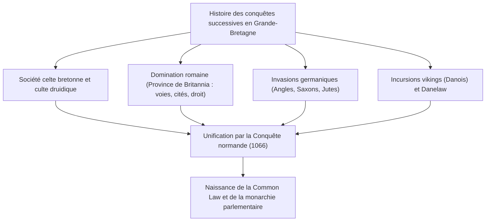
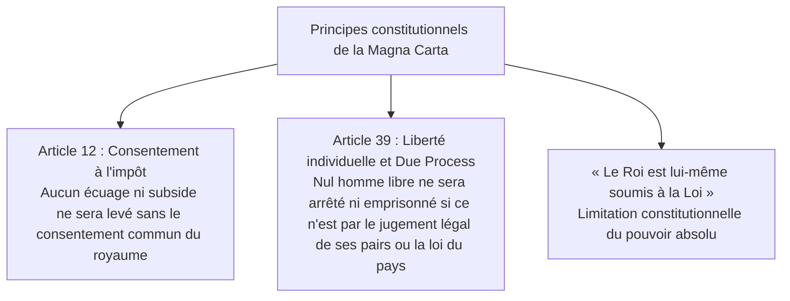
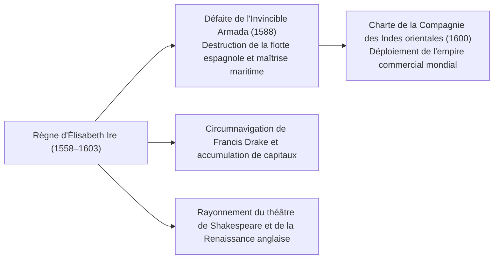
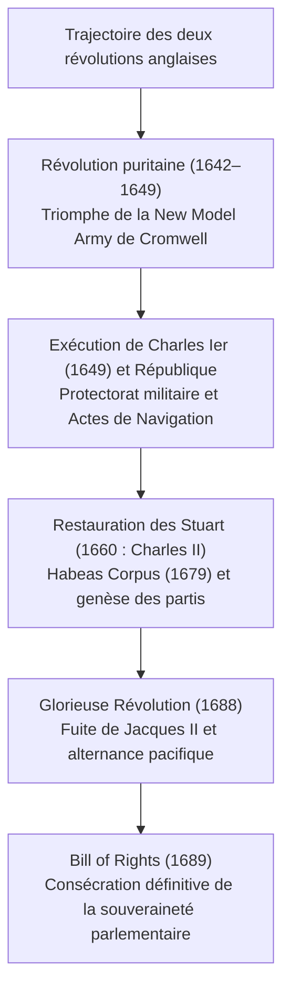
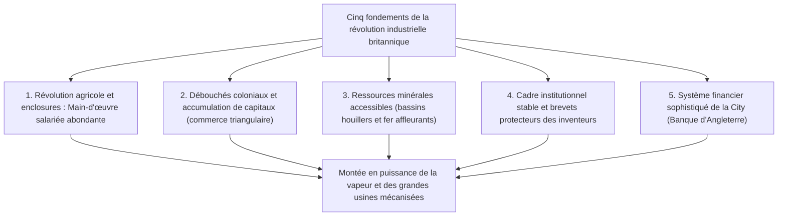
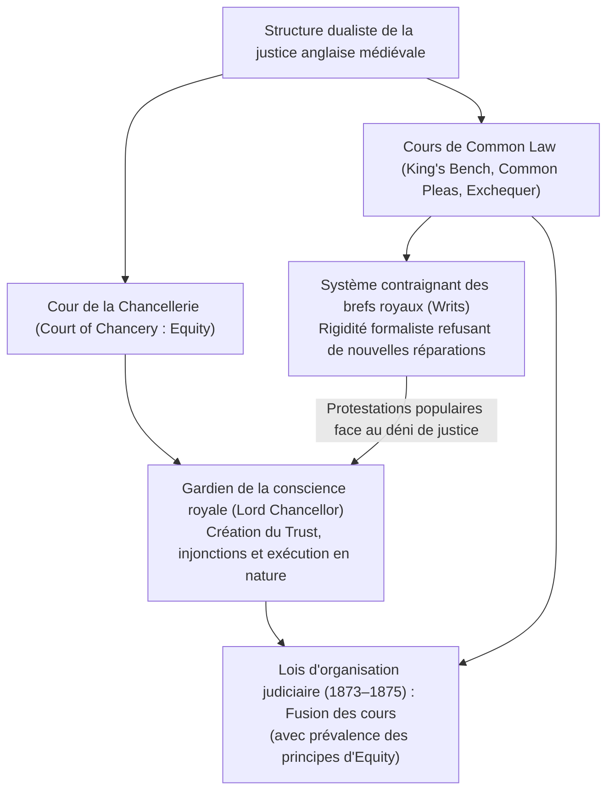
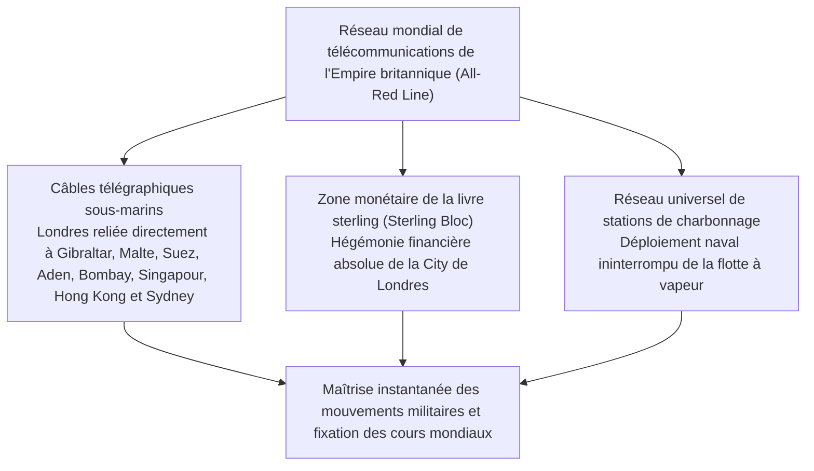
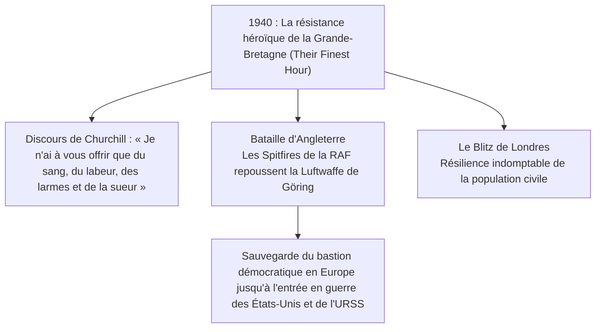
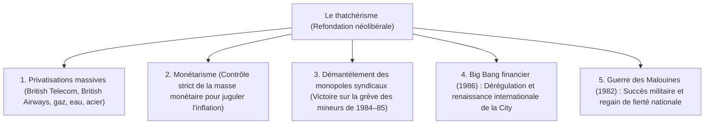

## 1. Introduction : Géopolitique insulaire et esprit de l'ordre juridique britannique

### 1.1 Civilisation mégalithique celtique et province romaine de Britannia

Isolée dans les mers du nord-ouest de l'Europe continentale, l'île de Grande-Bretagne a été le théâtre, dès les temps préhistoriques, de vagues successives de migrations et de conquêtes. Édifié sur la plaine de Salisbury au cours du troisième millénaire avant notre ère, le monument mégalithique de **Stonehenge** témoigne du haut degré de connaissances astronomiques et de la ferveur religieuse des peuples autochtones pré-alphabètes.

Au premier millénaire avant notre ère, des tribus celtiques maîtrisant la métallurgie du fer (les Bretons insulaires) s'établirent sur l'île, développant une riche civilisation agraire sous la conduite spirituelle des druides. Après deux expéditions de reconnaissance menées par Jules César en 55 et 54 avant J.-C., l'empereur Claude lança en 43 après J.-C. une invasion d'envergure, transformant la moitié sud de l'île en province de l'Empire romain : **Britannia**.

L'administration romaine perdura près de quatre siècles. Des cités planifiées virent le jour, à commencer par **Londinium**, berceau de l'actuelle Londres, reliées par un vaste réseau de voies romaines dallées (telle la Watling Street). Rome introduisit les techniques minières, les thermes publics, la langue latine et le christianisme. Pour contenir les assauts des tribus pictes de Calédonie (Écosse), l'empereur Hadrien fit ériger le célèbre **Mur d'Hadrien (Hadrian's Wall)**, frontière septentrionale fortifiée de l'Empire dont les vestiges impressionnent encore aujourd'hui. En 410, menacé par le sac de Rome par les Wisigoths, l'empereur Honorius ordonna le retrait de toutes les légions romaines de Britannia, abandonnant l'île aux tumultes des siècles obscurs.

---

### 1.2 Invasions anglo-saxonnes, l'Heptarchie et le sursaut d'Alfred le Grand

Le départ des cohortes romaines laissa le champ libre à trois peuples germaniques venus d'outre-mer du Nord au milieu du Ve siècle : les Angles, les Saxons et les Jutes. Les populations celtes autochtones furent peu à peu refoulées vers l'ouest (pays de Galles, Cornouailles) et vers les hautes terres d'Écosse au nord (la mémoire de cette résistance héroïque donna naissance à la geste chevaleresque du roi Arthur).

Les conquérants fondèrent une mosaïque de principautés qui finit par s'ordonner autour de **l'Heptarchie (les Sept Royaumes)** : Northumbrie, Mercie, Est-Anglie, Essex, Sussex, Wessex et Kent. À la fin du VIe siècle, le pape Grégoire Ier envoya une mission apostolique menée par saint Augustin (premier archevêque de Cantorbéry), amorçant la conversion chrétienne de l'Angleterre.

À la fin du VIIIe siècle, les assauts des pillards vikings scandinaves (les Danois) s'abattirent sur les côtes insulaires. Pillant les monastères et s'emparant de la moitié orientale de l'Angleterre, leur avancée paraissait irrésistible. Face au péril, le roi du Wessex, **Alfred le Grand (Alfred the Great, r. 871–899)**, s'érigea en rempart :
- Lors de la **bataille d'Edington (878)**, il écrasa l'armée danoise et conclut le traité de Wedmore, partageant l'Angleterre et concédant le « Danelaw » aux Danois.
- Il quadrilla le territoire d'un réseau de forteresses urbaines (**burghs**) et jeta les fondations d'une flotte maritime permanente.
- Il unifia le droit par un corpus législatif, encouragea l'instruction en faisant traduire des chefs-d'œuvre latins en vieil anglais pour le clergé et les laïcs, et ordonna la rédaction de la *Chronique anglo-saxonne*.
- Seul souverain anglais gratifié du titre de « Grand », Alfred fit naître le concept d'une patrie unie : **« Engla-lond » (le pays des Angles, l'Angleterre)**.

---

## 2. La Conquête normande (1066) et la doctrine de la Magna Carta

### 2.1 L'année fatidique 1066 : La bataille d'Hastings et la dynastie normande

En 1066, la mort sans héritier d'Édouard le Confesseur plongea le royaume dans une crise de succession. Tandis que le Witenagemot portait Harold Godwinson sur le trône sous le nom d'Harold II, de l'autre côté de la Manche, Guillaume, duc de Normandie, fit valoir ses droits légitimes et mobilisa une flotte d'invasion.

Le 14 octobre 1066 se déroula la mythique **bataille d'Hastings**.
La redoutable formation en « mur de boucliers » des fantassins anglo-saxons résista des heures durant aux charges de la cavalerie lourde et aux volées de flèches normandes. À la tombée de la nuit, Harold II fut frappé à mort d'une flèche dans l'œil ; les rangs saxons cédèrent et Guillaume fut couronné roi d'Angleterre en l'abbaye de Westminster le jour de Noël 1066 sous le nom de Guillaume Ier le Conquérant.

Cette **Conquête normande (Norman Conquest)** constitue la césure majeure de l'histoire britannique :
1. **Mutation géopolitique** : Le centre de gravité diplomatique anglais, jusque-là tourné vers la Scandinavie, s'arrima définitivement au monde féodal et latin de la France et de l'Europe continentale.
2. **Dualisme linguistique et sociologique** : L'élite dominante (barons, cour, cours de justice) adopta l'anglo-normand (ancien français), tandis que le peuple asservi conservait le vieil anglais germanique. Au fil des siècles, la fusion de ces deux idiomes donna naissance à l'anglais moderne, doté d'une extraordinaire profusion lexicale.
3. **Le Livre du Jugement Dernier (Domesday Book, 1086)** : Guillaume fit exécuter un cadastre universel d'une rigueur absolue, recensant les terres arables, bois, moulins, têtes de bétail et l'ensemble de la population serve et libre. Cette performance administrative dota l'Angleterre d'une structure féodale centralisée sans équivalent sur le continent.

---

### 2.2 Les réformes judiciaires d'Henri II et la naissance de la Common Law

Au milieu du XIIe siècle, Henri d'Anjou accéda au trône, inaugurant la lignée des Plantagenêts sous le nom d'**Henri II (r. 1154–1189)**. Maître de l'immense « Empire angevin » s'étendant de l'Écosse aux Pyrénées, ce souverain réorganisa de fond en comble la justice anglaise.

Afin de surpasser les cours seigneuriales arbitraires et l'éparpillement des coutumes régionales, Henri II instaura le système des **tribunaux itinérants (Assize Courts)** :
- Les juges royaux sillonnèrent les comtés, confrontant et harmonisant les meilleures coutumes judiciaires pour créer un corps de droit unifié applicable à l'ensemble du royaume : la **Common Law (Droit commun)**.
- Il développa l'institution moderne du **jury**, s'appuyant sur le serment de citoyens impartiaux pour établir la vérité matérielle des faits litigieux.
- Contrairement aux régimes de droit écrit codifié d'inspiration romaine, le droit anglais s'ancra dans la jurisprudence cumulative et le principe du précédent obligatoire (**Stare Decisis**).

---

### 2.3 La Magna Carta (1215) : L'avènement de l'État de droit

Le plus jeune fils d'Henri II, le roi **Jean sans Terre (r. 1199–1216)**, dilapida ses domaines continentaux au profit du roi de France Philippe Auguste et s'attira l'excommunication du pape Innocent III. Pour renflouer son trésor, il pressurisa les barons d'impôts arbitraires (l'écuage) et gouverna dans l'arbitraire le plus complet. Exaspérés, les seigneurs féodaux s'emparèrent de Londres les armes à la main.

Le 15 juin 1215, dans la prairie de Runnymede près de Windsor, les barons contraignirent le monarque à apposer son grand sceau sur la **Magna Carta (Grande Charte)**.

L'apport historique de la Magna Carta dépasse le cadre féodal de défense des immunités nobiliaires : elle consacra le principe fondamental de **l'État de droit (Rule of Law)**, affirmant que *même l'autorité suprême de la Couronne ne saurait s'élever au-dessus de la légalité*. L'article 39 devint le terreau du concept anglo-américain de **« Due Process of Law »** (garanties d'une procédure régulière), source majeure des révolutions anglaises et de la Constitution des États-Unis.

En 1295, Édouard Ier réunit le **Parlement modèle (Model Parliament)**, adjoignant aux seigneurs et prélats deux chevaliers par comté et deux bourgeois par ville, esquissant ainsi la structure bicamérale définitive du Parlement britannique : la Chambre des Lords et la Chambre des Communes.

---

## 3. Guerre de Cent Ans, Guerre des Deux-Roses et absolutisme des Tudor

### 3.1 La Guerre de Cent Ans (1337–1453), la Peste Noire et le déclin du servage

Les prétentions à la couronne de France et le contrôle du négoce des draps de Flandre provoquèrent la **Guerre de Cent Ans**, qui opposa la France et l'Angleterre durant 116 années d'hostilités intermittentes.
- Les armées d'Édouard III, du Prince Noir et d'Henri V déployèrent avec maestria les contingents d'archers munis du redoutable **grand arc gallois (Longbow)**. À Crécy (1346) et à Azincourt (1415), les flèches anglaises décimèrent la chevalerie lourde française, sonnant le glas de la tactique militaire médiévale.
- L'épopée de Jeanne d'Arc permit à la France de refouler les envahisseurs ; en 1453, l'Angleterre avait perdu toutes ses possessions continentales à l'exception de Calais. Rejetée hors du continent, l'aristocratie anglaise renonça à sa culture française pour forger un véritable patriotisme insulaire.

Pendant cette période, en 1348, l'épidémie de **Peste Noire** balaya le pays, exterminant entre un tiers et la moitié de la population :
- La raréfaction brutale de la main-d'œuvre conféra aux paysans et journaliers survivants un pouvoir de négociation inédit.
- Face aux tentatives de la noblesse de plafonner les salaires, la grande **Révolte des paysans de 1381** (conduite par Wat Tyler et le prêtre John Ball) éclata sous le mot d'ordre égalitaire : *« Quand Adam bêchait et qu'Ève filait, qui était alors gentilhomme ? »*. Le servage anglais disparut ainsi des siècles avant celui du continent.

---

### 3.2 La Guerre des Deux-Roses et l'avènement des Tudor

Le contrecoup de la défaite en France plongea l'Angleterre dans une terrible guerre civile pour le trône : la **Guerre des Deux-Roses (1455–1485)**, opposant la Maison de Lancastre (rose rouge) à celle d'York (rose blanche).
Trente ans d'hécatombes et d'exécutions sommaires décimèrent la haute noblesse féodale, brisant l'échiquier des grands barons rivaux.

En 1485, sur le champ de bataille de Bosworth, Henri Tudor renversa Richard III d'York et fut couronné sous le nom d'Henri VII, instaurant la **dynastie des Tudor**. Il brisa les féodalités récalcitrantes grâce à la cour d'exception de la Chambre étoilée (*Court of Star Chamber*) et confia l'administration locale aux gentilshommes terriens (*gentry*) en qualité de juges de paix (*Justices of the Peace*), bâtissant les piliers de l'État moderne.

---

### 3.3 La Réforme d'Henri VIII et le siècle d'or d'Élisabeth Ire

Le cours de l'histoire anglaise fut bouleversé par la rupture religieuse opérée par **Henri VIII (r. 1509–1547)**.
Le pape Clément VII ayant refusé d'annuler son mariage avec Catherine d'Aragon afin qu'il pût épouser Anne Boleyn, Henri VIII rompit unilatéralement avec Rome :
- **Acte de Suprématie (1534)** : Déclara le roi souverain et chef suprême sur terre de l'Église d'Angleterre (*Church of England* / Église anglicane).
- Il confisqua et démantela tous les monastères catholiques, revendant leurs immenses domaines fonciers à la *gentry* et aux marchands des cités. Cette redistribution massive créa une nouvelle classe d'hommes de loi et de propriétaires terriens indéfectiblement attachée au maintien de la rupture avec Rome.

Après la violente parenthèse catholique sous Marie Ire (« Bloody Mary »), la fille d'Henri VIII, **Élisabeth Ire (r. 1558–1603)**, prit les rênes du pouvoir. Par l'Acte d'Uniformité, elle concrétisa la « voie moyenne » (*Via Media*), associant liturgie traditionnelle et théologie réformée.

En 1588, Philippe II d'Espagne dépêcha l'« Invincible Armada » pour conquérir l'Angleterre protestante. Harcelée par les brûlots de Francis Drake et dispersée par les tempêtes, l'armada fut détruite. En 1600, la reine octroya sa charte royale à la **Compagnie des Indes orientales**, inaugurant la pénétration commerciale en Asie. Tandis que les tragédies de William Shakespeare triomphaient au Globe de Londres, l'Angleterre s'affirmait comme grande puissance navale.

---

## 3.6 « Les moutons dévorent les hommes » : Les enclosures et la loi sur les pauvres

L'économie du XVIe siècle sous les Tudor fut bouleversée par le premier grand mouvement des **enclosures**, provoqué par la demande insatiable de laine anglaise sur les marchés européens.

### ① La diatribe de Thomas More dans *Utopie* (1516)
Les grands seigneurs expulsèrent manu militari les tenanciers des communaux et des champs ouverts pour les ceindre de haies et les vouer à l'élevage lucratif du mouton.
Le chancelier et humaniste Thomas More fustigea avec éclat cette dépossession violente dans son ouvrage séminal *Utopie* :

> **« Vos moutons, d'ordinaire si doux, si sobres, se sont mis à être si voraces, si féroces, qu'ils dévorent les hommes eux-mêmes, désolent et dépeuplent les champs, les maisons et les villages. »**

Dépourvus de terres, des milliers de paysans déracinés affluèrent vers Londres comme vagabonds, finissant pendus en masse sous l'effet d'une législation répressive impitoyable.

### ② La portée historique de la loi sur les pauvres d'Élisabeth (1601)
Pour enrayer la paupérisation et les risques de jacquerie, le Parlement promulgua en 1601 la célèbre **loi sur les pauvres (*Poor Law of 1601*)** :
- Perception obligatoire d'une taxe paroissiale sur les propriétés foncières (*Poor Rate*).
- Répartition des nécessiteux en trois catégories précises :
  1. **Les pauvres valides** : soumis au travail forcé en ateliers (*workhouses*).
  2. **Les pauvres impotents** (orphelins, vieillards, malades, infirmes) : pris en charge dans des asiles ou par secours à domicile.
  3. **Les vagabonds oisifs** : enfermés et punis en maisons de redressement.
- En transformant la charité chrétienne informelle en obligation légale et publique de l'État, ce texte instaura le premier réseau d'aide sociale au monde, lointain ancêtre du futur État-providence britannique.

---

## 4. Les Révolutions britanniques et la monarchie constitutionnelle

### 4.1 L'absolutisme des Stuart et la Révolution puritaine (1642–1649)

À la disparition d'Élisabeth Ire sans héritier direct, le roi Jacques VI d'Écosse monta sur le trône sous le nom de **Jacques Ier**, inaugurant l'ère des Stuart.

Jacques Ier puis son fils **Charles Ier** prétendirent gouverner au nom du **droit divin des rois**, levant sans autorisation parlementaire des taxes illégales (le *Ship Money*) et persécutant les puritains. Le grand juriste Edward Coke répliqua sans ciller que « le Roi n'est soumis à aucun homme, mais à Dieu et à la Loi ». En 1628, le Parlement imposa la **Pétition des droits (*Petition of Right*)**, proscrivant les emprisonnements arbitraires et réaffirmant le consentement fiscal des députés.

Après avoir régné onze ans en autocrate sans convoquer les chambres (*Eleven Years' Tyranny*), Charles Ier dut rappeler le Parlement pour financer sa guerre contre l'Écosse révoltée. L'affrontement dégénéra en guerre civile ouverte entre « Cavaliers » (royalistes) et « Têtes rondes » (parlementaires) : la **Révolution puritaine**.

Menée par Oliver Cromwell, l'armée puritaine parlementaire (la *New Model Army*) tailla en pièces les troupes royales. Le 30 janvier 1649, un tribunal exceptionnel jugea **Charles Ier coupable de « tyrannie, trahison, meurtre et ennemi de la nation » et le fit exécuter par décapitation publique** devant la Maison des banquets de Whitehall, provoquant une onde de choc à travers l'Europe.

La république du Commonwealth fut proclamée, mais le régime autoritaire et rigoriste du Lord Protecteur Cromwell suscita l'hostilité de la population. À sa mort, le Parlement rappela sur le trône en 1660 le prince héritier **Charles II** : ce fut la Restauration des Stuart.

---

### 4.2 La Glorieuse Révolution (1688) et le Bill of Rights

Sous le règne de Charles II puis de son frère ouvertement catholique **Jacques II**, les velléités absolutistes et papistes ressurgirent. Les deux forces du Parlement — les **Tories** (fidèles au trône) et les **Whigs** (défenseurs des prérogatives parlementaires) — s'unirent pour fomenter une révolution de palais.

En 1688, les chefs parlementaires invitèrent la fille aînée protestante de Jacques II, Marie, et son époux le stathouder des Pays-Bas, **Guillaume d'Orange (Guillaume III)**, à débarquer avec une armée. Isolé et trahi de toutes parts, Jacques II s'enfuit en France sans livrer bataille. Ce transfert pacifique du pouvoir est resté célèbre sous le nom de **Glorieuse Révolution (Glorious Revolution)**.

En 1689, les souverains acceptèrent la Déclaration des droits, promulguée sous le nom de **Bill of Rights (Déclaration des droits)** :
- Interdiction au souverain de suspendre des lois ou de lever des impôts sans l'aval du Parlement.
- Totale liberté de parole et d'immunité des débats au sein des chambres.
- Proscription d'une armée permanente en temps de paix sans le consentement parlementaire.
- Obligation de réunir régulièrement le Parlement.

Ainsi triomphèrent la **monarchie constitutionnelle** et le dogme de la **souveraineté parlementaire** : *« Le roi règne, mais ne gouverne pas »*.

En 1707, sous la reine Anne, l'Acte d'Union unit formellement l'Angleterre et l'Écosse sous la bannière du **Royaume de Grande-Bretagne**. En 1714, la couronne échut à George Ier de la Maison de Hanovre (qui ignorait l'anglais) ; Robert Walpole devint le premier chef effectif du gouvernement, façonnant le **régime parlementaire avec responsabilité ministérielle (*Cabinet System*)**, armature de la démocratie représentative moderne.

---

## 5. La Révolution industrielle et la « Pax Britannica »

### 5.1 Devenir l'« Atelier du monde » : Les ressorts de la Première Révolution industrielle

Pourquoi la Grande-Bretagne a-t-elle été le berceau exclusif de la première révolution industrielle à la fin du XVIIIe siècle ? La réponse tient à la convergence de cinq facteurs structurels majeurs :

- **Révolution textile du coton** : Navette volante de John Kay, Spinning Jenny de Hargreaves, Water Frame d'Arkwright, Mule-jenny de Crompton et métier à tisser mécanique de Cartwright.
- **Révolution motrice de la vapeur** : Perfectionnement de la machine à vapeur à condenseur séparé par James Watt (1769). Les usines délaissèrent les cours d'eau pour se concentrer au cœur des bassins miniers (Manchester, Birmingham).
- **Révolution des transports** : Locomotive à vapeur *The Rocket* de George Stephenson (1829). L'inauguration de la ligne Liverpool-Manchester ouvrit la voie à un maillage ferroviaire intégral réduisant les coûts de transport à une échelle inconnue jusqu'alors.

En 1851, la première Exposition universelle ouvrit ses portes à Hyde Park sous les verrières féeriques du **Crystal Palace**. Six millions de curieux du monde entier vinrent y célébrer la Grande-Bretagne, consacrée incontestable **« Atelier du monde » (Workshop of the World)**.

---

### 5.2 L'apogée de l'Empire britannique

Sous le règne de la reine Victoria (1837–1901), sous l'égide de la toute-puissance navale de la Royal Navy et de la liberté des échanges, le monde connut l'hégémonie de la **Pax Britannica**.

L'Empire britannique, sur lequel « le soleil ne se couchait jamais », s'étendait sur un quart des terres émergées et régentait le quart de la population mondiale.

| Territoire | Principales possessions | Modalités de domination et faits saillants |
| :--- | :--- | :--- |
| **Asie du Sud** | **L'Inde (« Le joyau de la couronne »)** | Administrée d'abord par la Compagnie des Indes orientales après Plassey (1757). Après la révolte des Cipayes (1857), dissolution de la compagnie et administration directe par la Couronne (*Raj britannique*). En 1877, Victoria fut proclamée impératrice des Indes. |
| **Asie orientale** | **Chine (dynastie Qing) et Hong Kong** | Le trafic d'opium déclencha la première guerre de l'Opium (1840). Par le traité de Nankin (1842), cession de Hong Kong et ouverture forcée des ports francs sous statut d'extraterritorialité. |
| **Afrique** | **De l'Égypte à l'Afrique du Sud** | Rachat des actions du canal de Suez par Disraeli (1875). Politique de l'axe transafricain « Du Cap au Caire » préconisée par Cecil Rhodes (axe des 3C : Le Caire, Calcutta, Le Cap). Guerres des Boers. |
| **Dominions** | **Canada, Australie, Nouvelle-Zélande** | Colonies de peuplement blanc bénéficiant très tôt d'une large autonomie politique interne, matrices du futur Commonwealth. |

Sur le plan intérieur, la scène politique fut dominée par le duel d'anthologie entre le conservateur Benjamin Disraeli (impérialisme et réformes sociales) et le libéral William Gladstone (discipline budgétaire, libre-échange et autonomie de l'Irlande). Les trois réformes électorales de 1832, 1867 et 1884 élargirent progressivement le droit de vote aux ouvriers, achevant la transition démocratique sans heurts majeurs.

---

## 2.4 Le dualisme de la justice anglaise : Common Law, Equity et la procédure des *Writs*

À la différence des systèmes juridiques romanistes codifiés, le droit anglais repose sur l'interaction dialectique entre la **Common Law** et l'**Equity (Équité)**.

### ① L'ossification du système des brefs royaux (*System of Writs*)
Aux XIIe et XIIIe siècles, pour porter une affaire devant les juges de la Common Law, tout requérant devait acquérir auprès de la chancellerie royale un bref (*writ*) formalisé correspondant trait pour trait à son cas d'espèce.
Craignant l'empiétement du roi, les barons imposèrent les Provisions d'Oxford en 1258, interdisant la création de nouveaux types de brefs sans l'accord du Conseil royal. La Common Law s'enferma dans un formalisme outrancier : toute plainte relative à une infraction contractuelle ou délictuelle ne correspondant pas aux formulaires préétablis était purement et simplement rejetée.

### ② La Cour de la Chancellerie et l'invention du *Trust*
Privés de recours, les justiciables s'en remirent directement au roi par des requêtes en grâce. Le souverain confia l'instruction de ces requêtes au **Lord Chancelier (Lord Chancellor)**, prélat le plus éminent de l'État et « gardien de la conscience royale ».
- Le chancelier jugeait sans se soucier du formalisme de la Common Law, guidé par l'équité naturelle et la conscience morale : ce fut la naissance de l'**Equity**.
- Alors que la Common Law ne pouvait condamner qu'à des dommages-intérêts financiers a posteriori, l'Equity instaura des sanctions novatrices : l'exécution forcée en nature des engagements (*Specific Performance*) et les ordonnances d'interdiction préventives (*Injunctions*).
- À l'époque des croisades, les chevaliers qui confiaient la gestion de leurs terres à des proches pour protéger leur descendance donnèrent naissance au **Trust (fiducie)**, qui distingue la propriété juridique formelle de la jouissance des fruits réels, l'une des contributions majeures du droit anglais à la civilisation juridique.

---

## 3.4 Soumission de la périphérie celte : Le martyre de l'Écosse et de l'Irlande

La montée en puissance de l'Angleterre fut inséparable de la conquête martiale et de la vassalisation des nations celtiques riveraines.

### ① Les Guerres d'indépendance de l'Écosse : Wallace et Bruce
À la fin du XIIIe siècle, le roi Édouard Ier, surnommé le « Marteau des Écossais », envahit l'Écosse en profitant d'une crise dynastique et emporta à Londres la sacrée « Pierre de Scone » sur laquelle étaient sacrés les rois d'Écosse.
- 1297 : William Wallace (héros popularisé par *Braveheart*) prit la tête du soulèvement et défit la chevalerie anglaise lors de la bataille du pont de Stirling.
- 1314 : Robert the Bruce (Robert Ier d'Écosse) tailla en pièces les troupes anglaises à la célèbre **bataille de Bannockburn** grâce aux rangs serrés de ses piquiers (*schiltrons*), forçant Londres à reconnaître la pleine souveraineté de l'Écosse par le traité d'Édimbourg-Northampton en 1328.

### ② La conquête de Cromwell et la Grande Famine d'Irlande
L'Irlande connut une destinée infiniment plus sombre :
- 1649 : Vainqueur de la guerre civile, Oliver Cromwell débarqua en Irlande à la tête d'une armée impitoyable. Les massacres de Drogheda et de Wexford furent suivis de l'expropriation massive des terres des catholiques au profit de colons protestants anglais et écossais (la « Plantation de l'Ulster »). Les Irlandais autochtones furent réduits à la condition de métayers misérables sur leur propre sol.
- **La Grande Famine (1845–1852)** : Le mildiou anéantit la culture de la pomme de terre, nourriture exclusive des paysans irlandais.
  - Le gouvernement britannique, prisonnier de l'orthodoxie dogmatique du *laissez-faire*, refusa d'interrompre l'exportation continue de céréales irlandaises vers l'Angleterre pendant que la population agonisait.
  - Plus d'un million d'Irlandais périrent de faim et d'épidémies, et plus d'un million s'exilèrent à bord de misérables « cercueils flottants » vers l'Amérique (origine de la communauté irlando-américaine dont est issu le clan Kennedy). La population irlandaise chuta de moitié, enracinant une animosité tenace contre la Couronne britannique.

---

## 5.5 Infrastructures géopolitiques et suprématie de l'information : Les câbles sous-marins et le « Grand Jeu »

La Pax Britannica reposait sur la force des canonnières de la Royal Navy, mais tout autant sur **le premier réseau planétaire de télécommunications et de renseignement au monde**.

- **Le réseau All-Red Line** : Détentrice du monopole de l'isolation des câbles sous-marins par la gutta-percha, la Grande-Bretagne déploya un réseau télégraphique circumterrestre interconnectant tous ses territoires (colorés en rouge sur les mappemondes de l'Empire). Comme les stations d'atterrissement étaient situées en terre britannique, les transmissions de crise étaient invulnérables aux écoutes ou aux sabotages étrangers.
- **Le Grand Jeu (The Great Game)** : Rivalité d'espionnage et de stratégie d'influence opposant tout au long du XIXe siècle l'Empire tsariste et le Raj britannique pour le contrôle des marches d'Asie centrale (Afghanistan, Perse, Tibet), immortalisée par Rudyard Kipling dans son roman *Kim* et matrice de la pensée géopolitique moderne.

---

## 6. Les deux Guerres mondiales et le crépuscule de l'Empire

### 6.1 La Première Guerre mondiale et l'épuisement financier

Au tournant du XXe siècle, confrontée au réarmement accéléré et à l'ambition maritime de l'Allemagne wilhelmienne, la Grande-Bretagne mit fin à son « splendide isolement » (*Splendid Isolation*) en concluant l'alliance anglo-japonaise (1902), l'Entente cordiale avec la France (1904) et la convention anglo-russe (1907), scellant la Triple-Entente.

En août 1914 éclata la Grande Guerre :
- Dans la boue des tranchées du front de l'Ouest (batailles de la Somme, de Passchendaele), fauchée par les mitrailleuses, les gaz asphyxiants et les obus, toute une génération d'élite fut anéantie (« la génération perdue »).
- Malgré le blocus naval et la confrontation du Jutland qui contint la flotte allemande, l'effort de guerre transforma la Grande-Bretagne : de première puissance créditrice de la planète, elle devint débitrice dépendante des États-Unis.

Dans l'entre-deux-guerres, le Parti travailliste supplanta les libéraux et Ramsay MacDonald forma le premier cabinet travailliste. En 1928, le suffrage universel fut accordé à tous les hommes et femmes dès l'âge de 21 ans. Pendant ce temps, après l'Insurrection de Pâques 1916 et la guerre d'indépendance irlandaise, l'État libre d'Irlande vit le jour en 1922, seuls six comtés du nord restant rattachés à la Couronne.

---

### 6.2 La Seconde Guerre mondiale et la résistance solitaire de Churchill

Dans les années 1930, face à la montée du nazisme dans le sillage de la Grande Dépression, le Premier ministre Neville Chamberlain mena une politique de conciliation (**Appeasement Policy**), matérialisée par les accords de Munich (1938), qui se solda par un échec cuisant.

En septembre 1939, l'invasion de la Pologne déclencha le conflit mondial. En mai 1940, alors que la France s'effondrait sous la Blitzkrieg et que l'Europe occidentale passait sous la botte hitlérienne, **Winston Churchill** prit la direction du gouvernement.

Les allocutions radiophoniques de Churchill insufflèrent un courage indomptable à la nation. Guidés par les radars, les jeunes aviateurs de la Royal Air Force mirent en déroute les vagues de bombardiers allemands (*« Jamais dans l'histoire des guerres humaines tant d'hommes n'ont dû autant à si peu d'entre eux »*). Après les victoires d'El-Alamein (1942) et de Normandie (1944), la coalition alliée l'emporta, mais la Grande-Bretagne sortit du conflit exsangue et financièrement ruinée.

---

### 6.3 « Du berceau à la tombe » et la décolonisation

Aux élections générales de l'été 1945, le Parti conservateur du héros de guerre Churchill fut sévèrement battu par le Parti travailliste de Clement Attlee. Le peuple aspirait non plus aux fastes impériaux, mais à la sécurité matérielle et sociale :
- **L'édification de l'État-providence** : Sur la base du rapport Beveridge, un filet de protection sociale universelle fut déployé **« du berceau à la tombe »**. En 1948 fut instauré le **National Health Service (NHS)**, garantissant la gratuité intégrale des soins médicaux pour chaque citoyen, tandis que les mines, les chemins de fer, l'électricité et la sidérurgie étaient nationalisés.
- **La dislocation de l'Empire** :
  - 1947 : Sous l'impulsion de la désobéissance civile pacifique de Gandhi, partition et indépendance de l'Inde et du Pakistan.
  - **La crise de Suez (1956)** : À la suite de la nationalisation du canal décrétée par Nasser, les forces franco-britanniques menèrent une expédition militaire conjointe avec Israël, mais durent battre piteusement en retraite sous la pression conjuguée et les sanctions financières de Washington et de Moscou. L'événement révéla au grand jour la fin de la Grande-Bretagne comme superpuissance impériale.

---

## 7. Du thatchérisme à la « Troisième Voie » et au Brexit

### 7.1 L'enlisement du « mal britannique » et la révolution de Margaret Thatcher

Au cours des années 1970, l'alourdissement des charges sociales, l'omnipotence des syndicats et les dysfonctionnements des entreprises publiques plongèrent le pays dans une stagflation chronique, baptisée le **« mal britannique » (British Disease)**. Le marasme culmina lors de l'**« Hiver du mécontentement » (1978–1979)**, marqué par la paralysie des services de ramassage des ordures, des transports et des hôpitaux par des grèves dures.

C'est dans ce climat de déréliction que parvint au pouvoir en 1979 la première femme chef de gouvernement du pays : **Margaret Thatcher (« la Dame de fer »)**.

Les réformes de choc menées par Thatcher eurent un coût social dramatique : désertification manufacturière du nord, envolée du chômage et creusement des inégalités. Néanmoins, elles restaurèrent l'attractivité de l'économie britannique et replacèrent Londres au sommet de la finance mondiale, aux côtés de New York.

---

### 7.2 Tony Blair et la « Troisième Voie »

En 1997, après dix-huit ans dans l'opposition, le Parti travailliste renouvelé (*New Labour*) de Tony Blair remporta une victoire écrasante. Blair théorisa la **« Troisième Voie » (The Third Way)**, articulant l'économie de marché d'héritage thatchérien avec un vigoureux réinvestissement public dans l'éducation et la santé (NHS) :
- Dévolution des pouvoirs politiques (*devolution*) par la création des parlements régionaux en Écosse et au pays de Galles.
- Signature de l'historique **Accord du Vendredi saint (1998)**, mettant un terme à trois décennies de violences confessionnelles sanglantes en Irlande du Nord (*The Troubles*).
- Toutefois, l'alignement inconditionnel de Blair sur l'intervention américaine en Irak en 2003 entacha de façon indélébile son autorité morale.

---

### 7.3 Le séisme du Brexit et la Grande-Bretagne contemporaine

Depuis son adhésion à la Communauté européenne en 1973, la Grande-Bretagne a perpétuellement entretenu une méfiance viscérale envers le fédéralisme supranational de Bruxelles (refus d'intégrer l'euro et l'espace Schengen).

Dans les années 2010, les inquiétudes suscitées par l'immigration européenne et le sentiment d'abandon de souveraineté cristallisaient le mot d'ordre **« Take Back Control » (Reprenons le contrôle)**. Le 23 juin 2016, lors du référendum initié par David Cameron, le camp du départ créa la surprise générale en l'emportant avec **$51,9\,\%$ des suffrages (Brexit)**.

Le 31 janvier 2020, le Royaume-Uni quittait définitivement l'Union européenne.
Affrontant des frictions commerciales, des pénuries de bras, des pressions inflationnistes, les velléités indépendantistes récurrentes en Écosse et la complexité du protocole nord-irlandais, la Grande-Bretagne du XXIe siècle cherche sa voie sur l'échiquier mondial.

---

## 5.6 Soubresauts du monde ouvrier : Du luddisme au chartisme

Parallèlement aux fastes de la révolution industrielle, des cohortes d'artisans et d'ouvriers furent précipitées dans la misère par la mécanisation.

### ① Le mouvement luddite (1811–1816)
Les tisserands du nord de l'Angleterre, regroupés au sein de confréries clandestines se réclamant de la figure mythique du « Général Ned Ludd », menèrent des raids nocturnes pour briser à coups de masse les métiers à tisser mécaniques. Les autorités mobilisèrent la troupe et votèrent la loi de 1812 punissant de mort le bris de machine (*Frame Breaking Act*).

### ② Le chartisme (1838–1848)
Constatant que la réforme électorale de 1832 réservait le droit de vote à la seule bourgeoisie tout en excluant le prolétariat, les milieux populaires lancèrent la première grande campagne politique de masse ouvrière de l'histoire.
Rédigée par William Lovett, la **Charte du peuple (*People's Charter*)** proclamait **six revendications cardinales** :

1. **Le suffrage universel masculin** (abrogation de tout cens électoral)
2. **Le vote à bulletin secret** (pour éviter les pressions des patrons et propriétaires)
3. **La suppression de l'éligibilité censitaire pour les députés** (permettant l'élection de travailleurs)
4. **L'indemnité parlementaire** (permettant à des personnes dénuées de fortune de siéger)
5. **L'égalité des circonscriptions électorales** (représentation proportionnelle équitable)
6. **Le renouvellement annuel de la Chambre des communes** (pour prévenir la corruption)

Bien que la Chambre ait repoussé avec dédain à trois reprises ces pétitions fortes de millions de paraphes, cinq de ces revendications (à l'exception des élections annuelles) furent adoptées au tournant du XXe siècle, forgeant l'assise de la démocratie britannique contemporaine.

---

## 7.5 Modernisation de la Couronne : De l'avènement des Windsor au règne d'Élisabeth II

L'attachement indéfectible du peuple britannique envers sa monarchie trouve son explication dans le pragmatisme et l'intelligence adaptative dont la Couronne a fait preuve tout au long du XXe siècle.

### ① Le changement de nom pour la « Maison de Windsor » (1917)
En pleine Première Guerre mondiale, face à l'exacerbation du sentiment antigermanique, le roi George V renonça solennellement à son patronyme dynastique d'origine allemande (Saxe-Cobourg-Gotha) pour adopter le nom très britannique de **Maison de Windsor**, inspiré du château royal. Cousin germain de l'empereur Guillaume II, le souverain choisit de s'identifier corps et âme à sa nation.

### ② La crise de l'abdication d'Édouard VIII (1936)
Le désir d'Édouard VIII d'épouser l'Américaine deux fois divorcée Wallis Simpson se heurta au veto formel du cabinet de Stanley Baldwin et de l'Église d'Angleterre. Le souverain abdiqua après seulement 325 jours de règne, transmettant la couronne à son frère cadet bègue, George VI (immortalisé dans *Le Discours d'un roi*). Cette crise consacra la subordination absolue de la Couronne aux avis du gouvernement démocratiquement élu.

### ③ Les 70 ans de règne d'Élisabeth II (1952–2022)
Couronnée à 25 ans en 1952, Élisabeth II régna pendant sept décennies jusqu'à sa mort en 2022 à l'âge de 96 ans (Jubilé de platine).
Traversant les tourmentes de la décolonisation, la guerre froide, la désindustrialisation et les déboires privés de sa parentèle, elle incarna sans faillir l'abnégation et la stricte neutralité constitutionnelle, demeurant le ciment symbolique indispensable d'un royaume composite.

---

## 8. Conclusion : Continuité des traditions et sagesse des réformes progressives

Le trait d'exception de l'histoire britannique réside dans cette réalité singulière : **dépourvue de toute constitution formelle écrite, la Grande-Bretagne a su forger et pérenniser l'une des démocraties parlementaires et l'un des régimes d'État de droit les plus stables et les plus robustes de l'histoire universelle**.

Plutôt que de faire table rase du passé par des convulsions sanglantes pour rebâtir une république à partir de théories abstraites, les Britanniques ont invariablement puisé leurs légitimités dans la coutume immémoriale, les précédents judiciaires et les chartes solennelles (Magna Carta, Bill of Rights), les adaptant pas à pas par voie de **réformes progressives (*Incremental Reform*)**.

Cette quête inlassable des libertés, née de l'opposition féodale à l'arbitraire royal :
- Fut transformée en garanties judiciaires quotidiennes par les magistrats de la Common Law,
- Élevée au rang de souveraineté politique par les parlementaires révoltés,
- Démocratisée par les sacrifices de la classe ouvrière de la révolution industrielle,
- Et parachevée par la sécurité sociale solidaire de l'après-guerre.

Désormais revenue de ses ambitions d'empire universel pour naviguer entre Europe et grand large atlantique, la Grande-Bretagne a légué au monde trois principes cardinaux — **l'État de droit, le gouvernement représentatif et la liberté individuelle** —, qui demeurent un repère indépassable pour les nations libres.
