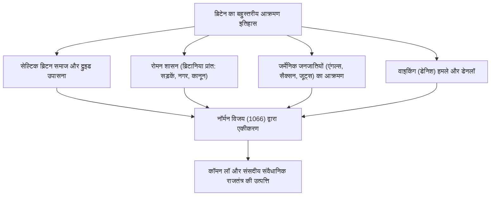
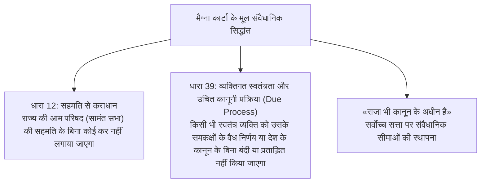
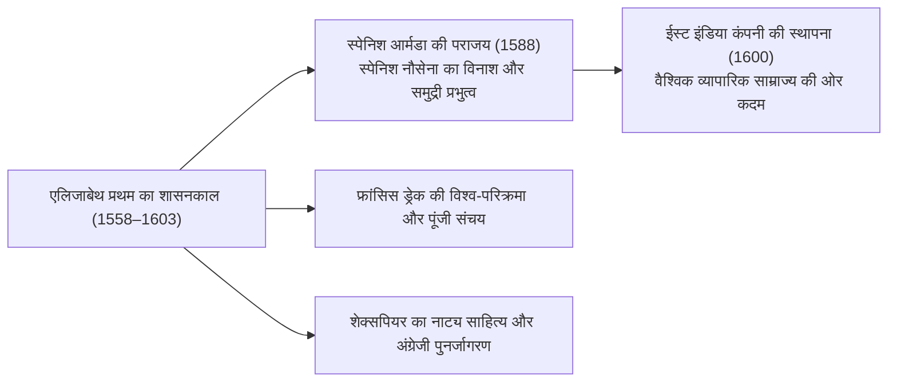
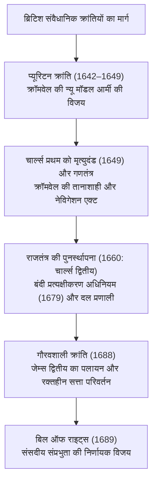
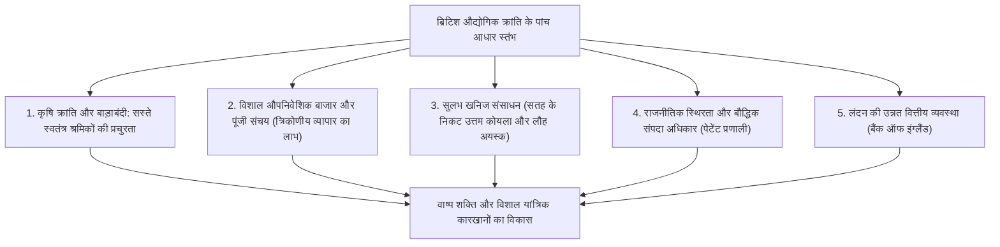
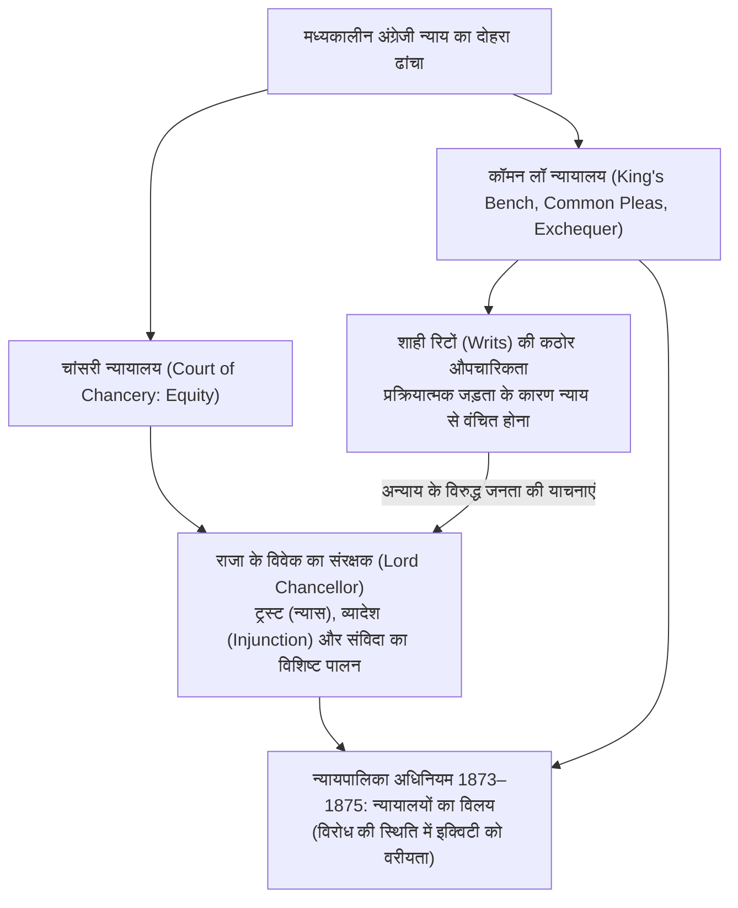
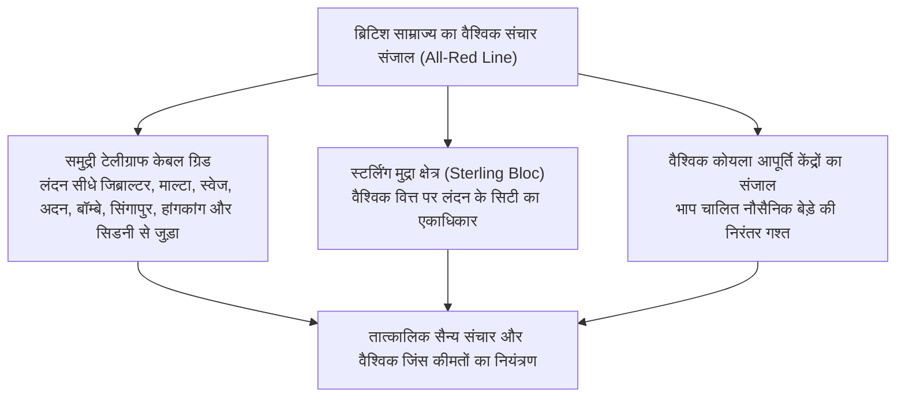
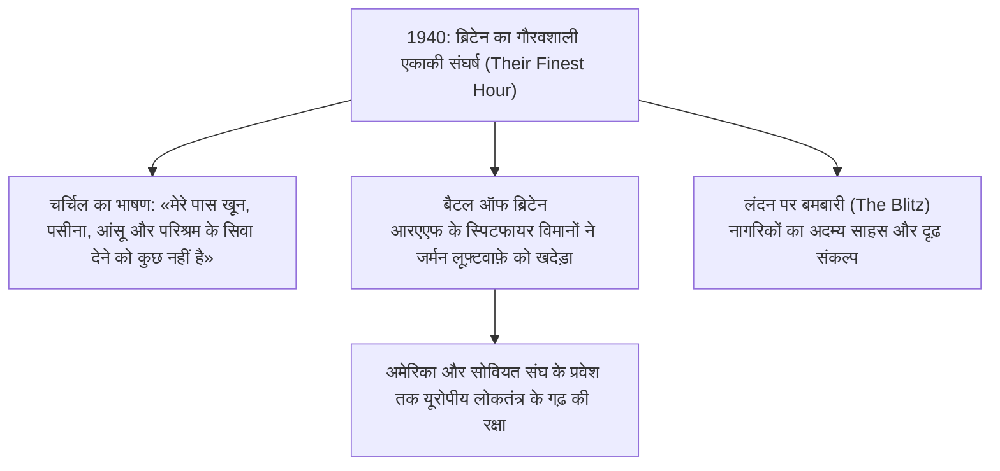
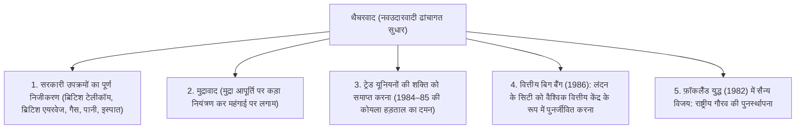
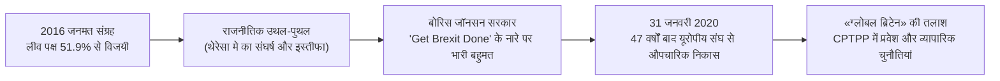

## 1. प्रस्तावना: द्वीप की भू-राजनीति और ब्रिटिश विधि-व्यवस्था की चेतना

### 1.1 सेल्टिक महापाषाण सभ्यता और रोमन प्रांत ब्रिटानिया

यूरोपीय महाद्वीप के उत्तर-पश्चिमी सागर में स्थित ग्रेट ब्रिटेन द्वीप ने प्रागैतिहासिक काल से ही महाद्वीप से आने वाली प्रवासन और आक्रमणों की अनगिनत लहरों को देखा है। ईसा पूर्व तीसरी सहस्राब्दी में सैलिसबरी के मैदान पर निर्मित महापाषाण स्मारक **स्टोनहेंज (Stonehenge)**, लिपि-विहीन आदिम निवासियों के उन्नत खगोलीय ज्ञान और गहन धार्मिक आस्था का एक विस्मयकारी प्रतीक है।

ईसा पूर्व पहली सहस्राब्दी में, लौह युग की सभ्यता से संपन्न सेल्टिक जनजातियों (ब्रिटन्स) ने इस द्वीप पर बसकर समृद्ध कृषि का विकास किया और द्रुइड (Druid) पुरोहितों के मार्गदर्शन में प्रकृति पूजा की रीतियां संपन्न कीं। 55 और 54 ईसा पूर्व में जूलियस सीज़र के दो अभियानों के पश्चात, 43 ईस्वी में रोमन सम्राट क्लॉडियस ने एक विशाल सेना भेजकर आक्रमण किया, जिसके परिणामस्वरूप ब्रिटेन का दक्षिणी भाग रोमन साम्राज्य का प्रांत **ब्रिटानिया (Britannia)** बन गया।

रोमन शासन लगभग चार शताब्दियों तक चला। आधुनिक लंदन के पूर्ववर्ती सुनियोजित नगर **लॉन्डिनियम (Londinium)** की स्थापना हुई, और पक्की सड़कों (जैसे वाटलिंग स्ट्रीट) का जाल पूरे द्वीप में बिछ गया। रोमनों ने खनन तकनीक, सार्वजनिक स्नानागार, लैटिन भाषा और ईसाई धर्म का प्रसार किया। उत्तर से कैलेडोनिया (स्कॉटलैंड) की पिक्ट जनजातियों के आक्रमणों को रोकने के लिए सम्राट हैड्रियन ने सुदृढ़ **हैड्रियन की दीवार (Hadrian's Wall)** का निर्माण कराया, जो साम्राज्य की उत्तरी सीमा के रूप में आज भी गर्व से खड़ी है। 410 ईस्वी में विसिगोथों द्वारा रोम की घेराबंदी के संकट के कारण सम्राट होनोरियस ने सभी रोमन सेनाओं को वापस बुला लिया, जिससे यह द्वीप पुनः अंधकार युग के संकट में डूब गया।

---

### 1.2 एंग्लो-सैक्सन आक्रमण, सात राज्य (हेप्टार्की) और अल्फ्रेड द ग्रेट का चमत्कार

रोमन सेनाओं के प्रस्थान के बाद, 5वीं शताब्दी के मध्य में उत्तरी सागर पार कर तीन जर्मेनिक जनजातियों — एंगल्स, सैक्सन और जूट्स — ने भीषण आक्रमण शुरू किया। मूल निवासी सेल्टिक ब्रिटन्स को पश्चिम में वेल्स और कॉर्नवाल तथा उत्तर में स्कॉटलैंड के पहाड़ी क्षेत्रों की ओर खदेड़ दिया गया (सेल्टिक वीरों के इस साहसी प्रतिरोध की गाथाएं आगे चलकर 'किंग आर्थर की किंवदंतियों' के रूप में अमर हुईं)।

आक्रमणकारियों ने विभिन्न क्षेत्रों में छोटे-छोटे राज्य स्थापित किए, जो अंततः **«हेप्टार्की» (सात राज्य)** के रूप में संगठित हुए: नॉर्थम्ब्रिया, मर्सिया, ईस्ट एंग्लिया, एसेक्स, ससेक्स, वेसेक्स और केंट। 6वीं शताब्दी के अंत में पोप ग्रेगरी प्रथम द्वारा भेजे गए पादरी ऑगस्टीन (कैंटरबरी के प्रथम आर्कबिशप) के नेतृत्व में इंग्लैंड का तेजी से ईसाईकरण हुआ।

8वीं शताब्दी के अंत में, स्कैंडिनेविया से वाइकिंग आक्रमणकारियों (डेनिश) ने हमला बोला। मठों को लूटते हुए और पूर्वी इंग्लैंड पर अधिकार करते हुए डेनिश सेनाएं अजेय प्रतीत हो रही थीं। इस भीषण संकट के बीच, दक्षिण-पश्चिमी वेसेक्स राज्य के शासक **अल्फ्रेड द ग्रेट (Alfred the Great, शासनकाल 871–899)** ने ऐतिहासिक संघर्ष का नेतृत्व किया:
- **एडिंगटन के युद्ध (878)** में डेनिश सेना को परास्त कर वेडमोर की संधि की, जिसने इंग्लैंड को विभाजित कर डेनिश नियंत्रण वाला क्षेत्र 'डेनलॉ' (Danelaw) निर्धारित किया।
- राज्य की सुरक्षा के लिए उन्होंने किलेबंद नगरों (**बर्घ / Burghs**) का नेटवर्क तैयार किया और शाही नौसेना की नींव रखी।
- कानूनों का संकलन किया, जनसाधारण और पादरियों के लिए लैटिन ग्रंथों का पुरानी अंग्रेजी में अनुवाद कराया तथा *एंग्लो-सैक्सन क्रॉनिकल* का संकलन प्रारंभ करवाया।
- ब्रिटिश इतिहास में 'द ग्रेट' (महान) की उपाधि पाने वाले एकमात्र सम्राट अल्फ्रेड के शासन में एक एकीकृत राष्ट्र की परिकल्पना **«एंग्ला-लैंड» (एंगल्स की भूमि = इंग्लैंड)** का उदय हुआ।

---

## 2. नॉर्मन विजय (1066) और मैग्ना कार्टा का संवैधानिक सिद्धांत

### 2.1 भाग्यशाली वर्ष 1066: हेस्टिंग्स का युद्ध और नॉर्मन राजवंश

1066 में एडवर्ड द कन्फ़ेसर की निःसंतान मृत्यु से सिंहासन का संकट उत्पन्न हो गया। वितेनागेमॉट (विद्वत सभा) द्वारा हेरोल्ड गॉडविंसन को हेरोल्ड द्वितीय के रूप में राजा चुने जाने के विरोध में, इंग्लिश चैनल के पार नॉर्मंडी के ड्यूक विलियम ने वैध उत्तराधिकार का दावा करते हुए एक विशाल नौसैनिक बेड़ा तैयार किया।

14 अक्टूबर 1066 को ऐतिहासिक **हेस्टिंग्स का युद्ध (Battle of Hastings)** लड़ा गया।
एंग्लो-सैक्सन पैदल सेना की ढालों की मजबूत दीवार ने नॉर्मन घुड़सवारों और धनुर्धरों के हमलों को घंटों रोके रखा। शाम ढलते-ढलते हेरोल्ड द्वितीय की आंख में तीर लगने से उनकी मृत्यु हो गई; सैक्सन सेना बिखर गई और क्रिसमस के दिन 1066 को विलियम प्रथम (विलियम द कॉन्करर) ने वेस्टमिंस्टर एब्बे में इंग्लैंड के राजा के रूप में ताज पहना।

यह **नॉर्मन विजय (Norman Conquest)** ब्रिटिश इतिहास का सबसे महत्वपूर्ण मोड़ साबित हुई:
1. **भू-राजनीतिक परिवर्तन**: इंग्लैंड का झुकाव स्कैंडिनेवियाई दुनिया से हटकर सीधे फ्रांस और पश्चिमी यूरोप की सामंती, लैटिन संस्कृति से जुड़ गया।
2. **भाषाई और सामाजिक द्वैध**: शासक अभिजात्य वर्ग ने एंग्लो-नॉर्मन (पुरानी फ्रांसीसी) को अपनाया, जबकि जनसाधारण पुरानी अंग्रेजी बोलते रहे। सदियों के मेलजोल से आधुनिक अंग्रेजी का प्रादुर्भाव हुआ, जिसमें शब्दों का अपार भंडार समाहित हुआ।
3. **डोम्सडे बुक (Domesday Book, 1086)**: विलियम प्रथम ने पूरे राज्य की कृषि भूमि, वनों, पशुधन, पवनचक्कियों और समस्त जनसंख्या का विस्तृत सर्वेक्षण कराया। इस 'प्रलय दिवस की पुस्तक' ने एक अत्यंत सुदृढ़ और केंद्रीकृत सामंती शासन तंत्र स्थापित किया, जिसका यूरोप में कोई सानी नहीं था।

---

### 2.2 हेनरी द्वितीय के न्यायिक सुधार और कॉमन लॉ (सामान्य कानून) का जन्म

12वीं शताब्दी के मध्य में हेनरी ऑफ अंजू ने प्लांटेगेनेट वंश के प्रथम सम्राट **हेनरी द्वितीय (शासन 1154–1189)** के रूप में पदभार संभाला। स्कॉटलैंड से लेकर पाइरेनीज तक फैले विशाल अंजवीन साम्राज्य के इस दूरदर्शी शासक ने अंग्रेजी न्याय प्रणाली में क्रांतिकारी बदलाव किए।

स्थानीय सामंती न्यायालयों की मनमानी और बिखरी हुई प्रथाओं को समाप्त करने के लिए हेनरी द्वितीय ने शाही न्यायाधीशों के भ्रमणशील न्यायालयों (**Assize Courts**) की प्रणाली स्थापित की:
- शाही न्यायाधीशों ने स्थानीय प्रथाओं और निर्णयों का परीक्षण व समन्वय कर पूरे राज्य के लिए एक समान कानून प्रणाली बनाई, जिसे **कॉमन लॉ (Common Law)** कहा गया।
- उन्होंने **जूरी प्रणाली (Jury System)** की आधुनिक नींव रखी, जिसके तहत स्थानीय निष्पक्ष नागरिकों की शपथपूर्वक गवाही से विवादित तथ्यों की पुष्टि की जाने लगी।
- संहिताबद्ध लिखित कानूनों के बजाय पूर्ववर्ती न्यायिक निर्णयों के संचय से कानून विकसित होने का सिद्धांत (**Stare Decisis**) स्थापित हुआ, जो आंग्ल-अमेरिकी कानून की आधारशिला बना।

---

### 2.3 मैग्ना कार्टा (1215): विधि के शासन (Rule of Law) की उत्पत्ति

हेनरी द्वितीय के कनिष्ठ पुत्र, कुख्यात राजा **जॉन «लैकलैंड» (शासन 1199–1216)** ने फ्रांस के राजा फिलिप द्वितीय से युद्ध हारकर अपनी लगभग सभी महाद्वीपीय रियासतें खो दीं और पोप इनोसेंट तृतीय से विवाद के चलते बहिष्कृत कर दिए गए। युद्ध खर्च जुटाने के लिए जॉन ने करों का भारी बोझ लादा और निरंकुश अत्याचार किए। कुपित होकर सामंतों (बैरनों) ने हथियार उठा लिए और लंदन पर अधिकार कर लिया।

15 जून 1215 को विंडसर के समीप रनीमीड के मैदान में विद्रोही सामंतों ने राजा जॉन को एक ऐतिहासिक अधिकार-पत्र पर शाही मुहर लगाने के लिए विवश किया: यही **मैग्ना कार्टा (Magna Carta: महान अधिकार-पत्र)** था।

मैग्ना कार्टा का महत्व सामंती विशेषाधिकारों की रक्षा तक सीमित नहीं रहा; इसने **«विधि का शासन» (Rule of Law)** का सार्वभौमिक सिद्धांत प्रतिपादित किया: *सर्वोच्च शक्ति संपन्न राजा भी मनमाना आचरण नहीं कर सकता और वह कानून के अधीन है*। विशेष रूप से धारा 39 **«उचित कानूनी प्रक्रिया» (Due Process of Law)** का मूल स्रोत बनी, जिसने 17वीं सदी की अंग्रेजी क्रांतियों और अमेरिकी संविधान के बिल ऑफ राइट्स को प्रेरित किया।

1295 में राजा एडवर्ड प्रथम ने **मॉडल पार्लियामेंट (Model Parliament)** का आयोजन किया, जिसमें उच्च पादरियों और सामंतों के अलावा प्रत्येक काउंटी से दो शूरवीरों और शहरों से दो नागरिकों को आमंत्रित किया गया। इसने ब्रिटिश संसद की द्विसदनीय व्यवस्था (हाउस ऑफ लॉर्ड्स और हाउस ऑफ कॉमन्स) का प्रारूप तय किया।

---

## 3. सौ वर्षीय युद्ध, वार्स ऑफ द रोज़ेज़ और ट्यूडर निरंकुशता

### 3.1 सौ वर्षीय युद्ध (1337–1453), ब्लैक डेथ और दासता का अंत

फ्रांसीसी राजसिंहासन के दावे और फ्लैंडर्स के ऊन व्यापार पर आधिपत्य को लेकर इंग्लैंड और फ्रांस के बीच 116 वर्षों तक **सौ वर्षीय युद्ध** चला।
- एडवर्ड तृतीय, ब्लैक प्रिंस और हेनरी पंचम के नेतृत्व में अंग्रेजी सेनाओं ने वेल्श **लॉन्गबो (दीर्घ धनुष)** का घातक उपयोग किया। क्रेसी (1346) और एगिनकोर्ट (1415) की लड़ाइयों में अंग्रेजी धनुर्धरों ने फ्रांसीसी भारी घुड़सवारों का संहार कर मध्यकालीन सामंती युद्धनीति का अंत कर दिया।
- जोन ऑफ आर्क के नेतृत्व ने युद्ध का पासा फ्रांस के पक्ष में पलट दिया; 1453 तक कैले को छोड़कर इंग्लैंड की सभी फ्रांसीसी रियासतें छिन गईं। पराजय के बाद अंग्रेजी कुलीनों ने अपनी फ्रांसीसी पहचान त्यागकर एक सुदृढ़ राष्ट्रीय अंग्रेजी अस्मिता को अपनाया।

इसी दौर में, 1348 में **ब्लैक डेथ (प्लेग महामारी)** ने पूरे देश को अपनी चपेट में ले लिया, जिससे एक-तिहाई से आधी आबादी समाप्त हो गई:
- श्रमिकों की भारी कमी के कारण जीवित बचे कृषकों और मजदूरों की मोलभाव करने की क्षमता और मजदूरी में अभूतपूर्व वृद्धि हुई।
- सामंतों द्वारा मजदूरी को जबरन सीमित करने के प्रयासों के विरुद्ध 1381 में **वॉट टायलर का किसान विद्रोह** भड़क उठा। *«जब आदम हल चलाते थे और हव्वा चरखा कातती थीं, तब कौन कुलीन था?»* के समानतावादी नारे के साथ इंग्लैंड की सामंती दासता महाद्वीपीय यूरोप से सदियों पूर्व समाप्त हो गई।

---

### 3.2 वार्स ऑफ द रोज़ेज़ और ट्यूडर वंश का प्रारंभ

फ्रांस में पराजय के बाद इंग्लैंड में सिंहासन के लिए गृहयुद्ध छिड़ गया: हाउस ऑफ लैंकेस्टर (लाल गुलाब) और हाउस ऑफ यॉर्क (सफेद गुलाब) के बीच तीस वर्षों तक **वार्स ऑफ द रोज़ेज़ (1455–1485)** लड़ा गया।
लगातार आपसी रक्तपात और फांसियों ने पुराने सामंती कुलीन वर्ग को लगभग नष्ट कर दिया, जिससे सामंती ताकतों की शक्ति क्षीण हो गई।

1485 में बॉसवर्थ के युद्ध में यॉर्क के राजा रिचर्ड तृतीय को मारकर हेनरी ट्यूडर ने हेनरी सप्तम के रूप में गद्दी संभाली और **ट्यूडर राजवंश** की नींव रखी। विद्रोही कुलीनों को नियंत्रित करने के लिए उन्होंने 'कोर्ट ऑफ स्टार चैंबर' की स्थापना की और स्थानीय जमींदारों (*ज एंट्री*) को शांति का न्यायाधीश (*Justices of the Peace*) नियुक्त कर एक आधुनिक केंद्रीकृत नौकरशाही की नींव डाली।

---

### 3.3 हेनरी अष्टम का धर्मसुधार और एलिजाबेथ प्रथम का स्वर्णिम युग

ट्यूडर युग की दिशा को **हेनरी अष्टम (शासन 1509–1547)** के धर्मसुधार आंदोलन ने सदा के लिए बदल दिया।
पोप क्लेमेंट सप्तम द्वारा कैथरीन ऑफ एरागॉन से विवाह विच्छेद कर ऐन बोलिन से विवाह की अनुमति न देने पर हेनरी ने रोम के कैथोलिक चर्च से संबंध तोड़ लिए:
- **1534 का एक्ट ऑफ सुप्रीमेसी**: राजा को पृथ्वी पर चर्च ऑफ इंग्लैंड (एंग्लिकन चर्च) का एकमात्र सर्वोच्च प्रमुख घोषित किया गया।
- सभी कैथोलिक मठों को बंद कर उनकी संपत्तियों को जब्त किया गया और उन विशाल जमीनों को जेंट्री और नगर के धनी व्यापारियों को बेच दिया गया। इससे राजतंत्र के प्रति निष्ठावान एक नया संपत्तिशाली वर्ग तैयार हुआ।

मैरी प्रथम ('ब्लडी मैरी') द्वारा किए गए रक्तपात के बाद हेनरी की पुत्री **एलिजाबेथ प्रथम (शासन 1558–1603)** ने गद्दी संभाली। उन्होंने 'एक्ट ऑफ यूनिफॉर्मिटी' के जरिए मध्यम मार्ग (*Via Media*) अपनाया, जिसमें कैथोलिक पारंपरिक अनुष्ठानों को प्रोटेस्टेंट धर्मशास्त्र के साथ संतुलित किया गया।

1588 में स्पेन के राजा फिलिप द्वितीय द्वारा भेजे गए 'अजेय नौसैनिक बेड़े' (स्पैनिश आर्मडा) को सर फ्रांसिस ड्रेक की रणनीति और तूफानों ने तहस-नहस कर दिया। 1600 में महारानी ने **ब्रिटिश ईस्ट इंडिया कंपनी** को शाही चार्टर प्रदान किया, जिससे एशिया में व्यापारिक विस्तार शुरू हुआ। विलियम शेक्सपियर के नाटकों ने ग्लोब थिएटर में धूम मचाई और इंग्लैंड एक प्रमुख समुद्री शक्ति बनकर उभरा।

---

## 3.6 «भेड़ें इंसानों को खा रही हैं»: बाड़ाबंदी और एलिजाबेथ का निर्धन कानून

16वीं शताब्दी की ट्यूडर अर्थव्यवस्था को यूरोपीय ऊन की भारी मांग के कारण हुए **प्रथम बाड़ाबंदी आंदोलन (*Enclosure Movement*)** ने हिलाकर रख दिया।

### ① थॉमस मोर की *यूटोपिया* (1516) में निंदा
बड़े भूस्वामियों ने किसानों को साझा और खुली जमीनों से बलपूर्वक बेदखल कर दिया और उन पर बाड़ लगाकर अधिक लाभदायक भेड़ों के चरागाहों में बदल दिया।
मानवतावादी विद्वान और लॉर्ड चांसलर थॉमस मोर ने पूंजी के इस प्रारंभिक संचय की कटु आलोचना की:

> **«आपकी भेड़ें, जो कभी इतनी विनम्र और कम खाने वाली थीं, अब इतनी लालची और हिंसक हो गई हैं कि वे मनुष्यों को ही निगल रही हैं और खेतों, मकानों तथा पूरे नगरों को उजाड़ रही हैं।»**

भूमिहीन किसान बेसहारा होकर लंदन जैसे शहरों में भटकने लगे और उनमें से कई को तत्कालीन कठोर कानूनों के तहत फांसी दे दी गई।

### ② 1601 के एलिजाबेथ निर्धन कानून का ऐतिहासिक महत्व
व्यापक निर्धनता और अशांति को रोकने के लिए संसद ने 1601 में ऐतिहासिक **निर्धन कानून (*Poor Law of 1601*)** पारित किया:
- पल्ली (Parish) के स्तर पर अनिवार्य संपत्ति कर (**Poor Rate**) एकत्र करना।
- निर्धनों को तीन श्रेणियों में विभाजित किया गया:
  1. **सक्षम निर्धन**: कार्यगृहों (*workhouses*) में अनिवार्य श्रम।
  2. **अक्षम निर्धन** (अनाथ, वृद्ध, रोगी और दिव्यांग): आश्रय गृहों में सहायता।
  3. **आलसी व आवारा**: सुधार गृहों में कठोर दंड।
- निर्धनों की सहायता को स्वैच्छिक ईसाई दान से बदलकर राज्य का विधिक दायित्व बनाकर इस कानून ने विश्व की प्रथम सार्वजनिक सामाजिक सुरक्षा प्रणाली का निर्माण किया।

---

## 4. ब्रिटिश क्रांतियां और संवैधानिक राजतंत्र का जन्म

### 4.1 स्टुअर्ट निरंकुशता और प्यूरिटन क्रांति (1642–1649)

एलिजाबेथ प्रथम के निःसंतान निधन के बाद स्कॉटलैंड के राजा जेम्स षष्ठम इंग्लैंड के राजा **जेम्स प्रथम** बने, जिससे स्टुअर्ट वंश का आरंभ हुआ।

जेम्स प्रथम और उनके पुत्र **चार्ल्स प्रथम** ने **राजाओं के दैवीय अधिकार** का दावा किया, संसद को दरकिनार कर मनमाने कर (जैसे शिप मनी) लगाए और प्यूरिटनों का दमन किया। न्यायविद सर एडवर्ड कोक ने कहा: «राजा किसी मनुष्य के नहीं, बल्कि ईश्वर और कानून के अधीन है।» 1628 में संसद ने **पिटीशन ऑफ राइट (Petition of Right)** पारित कर बिना संसदीय स्वीकृति के कर और गैर-कानूनी गिरफ्तारी पर रोक लगाई।

ग्यारह वर्षों के तानाशाही शासन (*Eleven Years' Tyranny*) के बाद चार्ल्स प्रथम को स्कॉटलैंड युद्ध के लिए धन जुटाने हेतु संसद बुलानी पड़ी। मतभेद गृहयुद्ध में बदल गए: राजशाही समर्थक (*Cavaliers*) और संसद समर्थक (*Roundheads*) आपस में भिड़ गए (**प्यूरिटन क्रांति / गृहयुद्ध**)।

ओलिवर क्रॉमवेल के नेतृत्व में अनुशासित **न्यू मॉडल आर्मी** ने शाही सेना को हरा दिया। 30 जनवरी 1649 को **राजा चार्ल्स प्रथम पर 'अत्याचारी, देशद्रोही, हत्यारा और राज्य का शत्रु' होने का मुकदमा चलाकर सार्वजनिक रूप से सिर कलम कर दिया गया**, जिसने पूरे यूरोप को स्तब्ध कर दिया।

राजतंत्र समाप्त कर कॉमनवेल्थ (गणतंत्र) की घोषणा हुई, लेकिन लॉर्ड प्रोटेक्टर क्रॉमवेल के कठोर धार्मिक-सैन्य शासन से जनता असंतुष्ट हो गई। उनकी मृत्यु के बाद 1660 में संसद ने **चार्ल्स द्वितीय** को आमंत्रित कर राजतंत्र की पुनर्स्थापना की।

---

### 4.2 गौरवशाली क्रांति (1688) और बिल ऑफ राइट्स

जब चार्ल्स द्वितीय के बाद कैथोलिक **जेम्स द्वितीय** ने पुनः निरंकुशता और कैथोलिक धर्म थोपने का प्रयास किया, तो संसद के दो प्रमुख धड़े — **टोरी** (राजशाही समर्थक) और **व्हिग** (संसद समर्थक) — एकजुट हो गए।

1688 में उन्होंने जेम्स द्वितीय की प्रोटेस्टेंट पुत्री मैरी और उनके डच पति **विलियम ऑफ ऑरेंज (विलियम तृतीय)** को सेना सहित आमंत्रित किया। असहाय होकर जेम्स द्वितीय बिना लड़े फ्रांस भाग गया। बिना रक्त बहाए हुए इस परिवर्तन को **गौरवशाली क्रांति (Glorious Revolution)** कहा जाता है।

1689 में नए शासकों ने संसद द्वारा प्रस्तुत **बिल ऑफ राइट्स (Bill of Rights)** को स्वीकृति दी:
- संसद की अनुमति के बिना कानून को निलंबित करना या कर लगाना अवैध।
- संसद के भीतर वाद-विवाद और भाषण की पूर्ण स्वतंत्रता।
- शांति काल में संसद की अनुमति के बिना सेना रखना प्रतिबंधित।
- संसद के नियमित सत्र आयोजित करना अनिवार्य।

इसने **संवैधानिक राजतंत्र** और **संसदीय संप्रभुता (Parliamentary Sovereignty)** को स्थापित किया: *«राजा शासन करता है, पर राज नहीं करता»*।

1707 में महारानी ऐन के समय एक्ट ऑफ यूनियन पारित हुआ, जिससे इंग्लैंड और स्कॉटलैंड मिलकर **ग्रेट ब्रिटेन का राज्य** बने। 1714 में हनोवर वंश के जॉर्ज प्रथम (जो अंग्रेजी नहीं जानते थे) के समय रॉबर्ट वालपोल प्रथम वास्तविक प्रधानमंत्री बने, जिन्होंने संसद के प्रति उत्तरदायी **मंत्रिमंडल प्रणाली (*Cabinet System*)** की नींव रखी।

---

## 5. औद्योगिक क्रांति और «पैक्स ब्रिटानिका» का युग

### 5.1 विश्व की कार्यशाला: प्रथम औद्योगिक क्रांति की गतिशीलता

18वीं सदी के उत्तरार्ध में मानव इतिहास की प्रथम औद्योगिक क्रांति ब्रिटेन में ही क्यों हुई? इसके पीछे पांच विशिष्ट ऐतिहासिक कारण थे:

- **सूती वस्त्र उद्योग में नवाचार**: जॉन केय का फ्लाइंग शटल, हरग्रीव्स की स्पिनिंग जेनी, आर्कराइट का वाटर फ्रेम, क्रॉम्पटन का म्यूल और कार्टराइट का पावर लूम।
- **वाष्प शक्ति की क्रांति**: जेम्स वाट द्वारा 1769 में पृथक कंडेनसर वाले भाप के इंजन का आविष्कार। कारखाने नदियों के किनारे से कोयला क्षेत्रों (मैनचेस्टर, बर्मिंघम) में स्थानांतरित हुए।
- **परिवहन क्रांति**: जॉर्ज स्टीफेंसन का भाप लोकोमोटिव *द रॉकेट* (1829)। लिवरपूल-मैनचेस्टर रेलवे के बाद फैले रेल संजाल ने माल ढुलाई की लागत अत्यधिक घटा दी।

1851 में लंदन के हाइड पार्क में विशाल कांच और लोहे के **क्रिस्टल पैलेस (Crystal Palace)** में प्रथम विश्व प्रदर्शनी आयोजित हुई, जहां विश्व भर के 60 लाख लोगों ने ब्रिटेन को **«विश्व की कार्यशाला» (Workshop of the World)** के रूप में स्वीकार किया।

---

### 5.2 ब्रिटिश साम्राज्य का वैश्विक विस्तार

विक्टोरियाई युग (1837–1901) में रॉयल नेवी के प्रभुत्व और मुक्त व्यापार के सहारे ब्रिटेन ने विश्वव्यापी वर्चस्व स्थापित किया, जिसे **पैक्स ब्रिटानिका (Pax Britannica)** कहा गया।

साम्राज्य, जिस पर «सूर्य कभी अस्त नहीं होता था», पृथ्वी के एक-चौथाई भूभाग और एक-चौथाई मानव आबादी पर फैला हुआ था।

| क्षेत्र | प्रमुख उपनिवेश और क्षेत्र | शासन का स्वरूप और प्रमुख घटनाएं |
| :--- | :--- | :--- |
| **दक्षिण एशिया** | **भारत («ताज का नगीना»)** | प्लासी के युद्ध (1757) के बाद ईस्ट इंडिया कंपनी का नियंत्रण। 1857 के प्रथम स्वतंत्रता संग्राम (सिपाही विद्रोह) के बाद कंपनी भंग, सीधा ब्रिटिश क्राउन का शासन (*ब्रिटिश राज*)। 1877 में महारानी विक्टोरिया भारत की सम्राज्ञी बनीं। |
| **पूर्वी एशिया** | **चीन (चिंग वंश) और हांगकांग** | अफीम तस्करी के कारण प्रथम अफीम युद्ध (1840)। नानकिंग की संधि (1842) से हांगकांग का अधिग्रहण और असमान संधियों द्वारा व्यापारिक बंदरगाह खुलवाए गए। |
| **अफ्रीका** | **मिस्र से दक्षिण अफ्रीका तक** | डिजराएली द्वारा स्वेज नहर के शेयरों की खरीद (1875)। सेसिल रोड्स की 'केप से काहिरा' तक 3C नीति (काहिरा, कलकत्ता, केपटाउन)। बोअर युद्ध। |
| **डोमिनियन** | **कनाडा, ऑस्ट्रेलिया, न्यूजीलैंड** | श्वेत बस्तियों को शीघ्र ही आंतरिक स्वशासन दिया गया, जो आधुनिक राष्ट्रमंडल (Commonwealth) का आधार बना। |

घरेलू राजनीति में कंजर्वेटिव नेता बेंजामिन डिजराएली (साम्राज्यवादी नीति और सामाजिक सुधार) और लिबरल नेता विलियम ग्लैडस्टोन (वित्तीय संयम, मुक्त व्यापार और आयरिश होम रूल) के बीच लोकतांत्रिक प्रतिद्वंद्विता रही। 1832, 1867 और 1884 के सुधार अधिनियमों द्वारा मताधिकार का क्रमिक विस्तार हुआ।

---

## 2.4 न्याय का दोहरा तंत्र: कॉमन लॉ, इक्विटी (न्याय-साम्य) और रिट प्रणाली

महाद्वीपीय रोमन कानून की तुलना में ब्रिटिश कानून की सबसे बड़ी विशेषता **कॉमन लॉ (Common Law)** और **इक्विटी (Equity)** का सह-अस्तित्व और विकास है।

### ① रिट प्रणाली (*System of Writs*) की औपचारिकता
12वीं और 13वीं शताब्दी में कॉमन लॉ कोर्ट में मुकदमा दायर करने के लिए वादी को शाही चांसरी से अपनी शिकायत के अनुरूप विशिष्ट 'शाही रिट' खरीदनी पड़ती थी।
किंतु 1258 के ऑक्सफोर्ड प्रावधानों ने नई रिट जारी करने पर रोक लगा दी। कॉमन लॉ अत्यंत औपचारिक और जड़ हो गया: यदि कोई नया विवाद मौजूदा रिट प्रारूप में फिट नहीं बैठता था, तो अदालतें कोई न्याय नहीं देती थीं।

### ② चांसरी कोर्ट और «ट्रस्ट» (Trust) का आविष्कार
कॉमन लॉ से वंचित नागरिकों ने न्याय के अंतिम स्रोत राजा से गुहार लगाई। राजा ने इन याचिकाओं को अपने प्रमुख मंत्री और 'राजा के विवेक के संरक्षक' **लॉर्ड चांसलर (Lord Chancellor)** को सौंप दिया।
- चांसलर ने प्रक्रियात्मक बाधाओं से मुक्त होकर प्राकृतिक न्याय और विवेक (*conscience*) के आधार पर निर्णय दिए, जिससे **इक्विटी (Equity)** का जन्म हुआ।
- जहां कॉमन लॉ केवल हर्जाना दिला सकता था, वहीं इक्विटी ने अनुबंध का विशिष्ट पालन (*Specific Performance*) और निषेधाज्ञा (*Injunction*) जैसे उपचार दिए।
- धर्मयुद्धों में जाने वाले शूरवीरों द्वारा अपने परिवारों के लिए मित्रों को जमीन सौंपने की प्रथा से **ट्रस्ट (Trust: विधिक स्वामित्व और वास्तविक लाभ का पृथक्करण)** का जन्म हुआ, जो विश्व विधि शास्त्र का एक महान आविष्कार है।

---

## 3.4 सेल्टिक सीमाओं की पराधीनता: स्कॉटलैंड और आयरलैंड की व्यथा

इंग्लैंड का विस्तार पड़ोसी सेल्टिक राज्यों पर सैन्य आक्रमण और औपनिवेशिक दमन का भी इतिहास रहा है।

### ① स्कॉटलैंड का स्वतंत्रता संग्राम: वालेस और ब्रूस
13वीं सदी के अंत में एडवर्ड प्रथम ने स्कॉटलैंड पर आक्रमण कर वहां के पवित्र राज्याभिषेक पत्थर 'स्टोन ऑफ डेस्टिनी' (स्टोन ऑफ स्कून) को लूटकर लंदन पहुंचा दिया।
- 1297: विलियम वालेस (फिल्म *ब्रेवहार्ट* के नायक) ने विद्रोह कर स्टर्लिंग ब्रिज के युद्ध में अंग्रेजी सेना को पराजित किया।
- 1314: रॉबर्ट द ब्रूस ने **बैनॉकबर्न के युद्ध** में अंग्रेजी सेना को भयंकर शिकस्त दी और 1328 की संधि द्वारा स्कॉटलैंड की पूर्ण स्वतंत्रता सुनिश्चित की।

### ② क्रॉमवेल का आयरलैंड अभियान और महा-अकाल
आयरलैंड की नियति अत्यंत दुखद रही:
- 1649: गृहयुद्ध के बाद ओलिवर क्रॉमवेल ने आयरलैंड पर आक्रमण कर ड्रोगेडा और वेक्सफोर्ड में भयानक नरसंहार किया। कैथोलिक आयरिश भूमि जब्त कर प्रोटेस्टेंटों को बांट दी गई (अल्स्टर प्लांटेशन)। आयरिश अपनी ही भूमि पर बेबस मजदूर बन गए।
- **आयरिश महा-अकाल (1845–1852)**: आलू की फसल में फफूंद रोग लगने से अकाल पड़ा।
  - अहस्तक्षेप (*laissez-faire*) की नीति पर अड़ी ब्रिटिश सरकार ने भूख से मरते आयरलैंड से अनाज का इंग्लैंड निर्यात जारी रखा।
  - लगभग 10 लाख लोग भुखमरी और बीमारी से मारे गए और 10 लाख से अधिक लोग 'ताबूत जहाजों' में बैठकर अमेरिका पलायन कर गए (जिससे अमेरिका में विशाल आयरिश समुदाय बना)। आयरलैंड की आबादी आधी रह गई, जिसने ब्रिटेन के प्रति गहरी कड़वाहट छोड़ी।

---

## 5.5 भू-राजनीतिक अवसंरचना और सूचना आधिपत्य: अंडरसी केबल और «द ग्रेट गेम»

पैक्स ब्रिटानिका का आधार केवल युद्धपोत नहीं थे, बल्कि यह **विश्व का प्रथम वैश्विक दूरसंचार नेटवर्क** भी था।

- **ऑल-रेड लाइन (All-Red Line)**: गुट्टा-परचा इंसुलेशन तकनीक पर एकाधिकार के सहारे ब्रिटेन ने अपने सभी उपनिवेशों (जो मानचित्र पर लाल रंग में दर्शाए जाते थे) को जोड़ने वाला समुद्री केबल नेटवर्क बिछाया। क्योंकि केबल केवल ब्रिटिश भूमि पर ही उतरते थे, वे शत्रुओं द्वारा काटे जाने या जासूसी से पूर्णतः सुरक्षित थे।
- **द ग्रेट गेम (The Great Game)**: 19वीं और 20वीं सदी के प्रारंभ में मध्य एशिया (अफगानिस्तान, फारस, तिब्बत) पर प्रभुत्व के लिए रूसी साम्राज्य और ब्रिटिश भारत के बीच गुप्त जासूसी संघर्ष चला (जो रुडयार्ड किपलिंग के उपन्यास *किम* में वर्णित है), जिसने आधुनिक भू-राजनीति को जन्म दिया।

---

## 6. दो विश्व युद्ध और साम्राज्य का सूर्यास्त

### 6.1 प्रथम विश्व युद्ध और संसाधनों की समाप्ति

20वीं सदी की शुरुआत में कैसर जर्मनी की नौसैनिक प्रतिस्पर्धा के कारण ब्रिटेन ने 'शानदार अलगाव' (*Splendid Isolation*) की नीति त्याग दी और एंग्लो-जापानी गठबंधन (1902), फ्रांस के साथ एंटेंट कॉर्डियल (1904) और रूस के साथ समझौता (1907) कर ट्रिपल एंटेंट बनाया।

अगस्त 1914 में प्रथम विश्व युद्ध छिड़ा:
- पश्चिमी मोर्चे (सोम और पाशेनडेल के युद्ध) की खाइयों में मशीनगनों, जहरीली गैस और तोपों की मार से युवाओं की एक पूरी पीढ़ी नष्ट हो गई («खोई हुई पीढ़ी»)।
- हालांकि नौसैनिक नाकेबंदी से जर्मन बेड़े को रोक दिया गया, पर युद्ध के भारी खर्च ने ब्रिटेन को सबसे बड़े ऋणदाता देश से अमेरिका का ऋणी बना दिया।

1920 के दशक में लेबर पार्टी ने लिबरलों का स्थान लिया; रैमसे मैकडोनाल्ड ने प्रथम लेबर सरकार बनाई। 1928 में 21 वर्ष से ऊपर के सभी पुरुषों और महिलाओं को समान मताधिकार मिला। इसी बीच, 1916 के ईस्टर विद्रोह और स्वतंत्रता संग्राम के बाद 1922 में आयरिश फ्री स्टेट की स्थापना हुई (उत्तरी आयरलैंड के छह काउंटी यूके में बने रहे)।

---

### 6.2 द्वितीय विश्व युद्ध और चर्चिल का एकाकी संघर्ष

1930 के दशक में महामंदी के बीच नाजी जर्मनी के उभार पर प्रधानमंत्री नेविल चेम्बरलेन की **तुष्टीकरण नीति (Appeasement Policy)** 1938 के म्यूनिख समझौते के साथ पूरी तरह विफल रही।

सितंबर 1939 में पोलैंड पर हिटलर के हमले से द्वितीय विश्व युद्ध छिड़ा। मई 1940 में, जब फ्रांस ढह गया और पश्चिमी यूरोप पर नाजियों का कब्जा हो गया, तब **विंस्टन चर्चिल (Winston Churchill)** प्रधानमंत्री बने।

चर्चिल के रेडियो संबोधनों ने राष्ट्र में अदम्य साहस फूंका। रडार तंत्र के बल पर रॉयल एयर फोर्स (RAF) के युवा पायलटों ने जर्मन बमवर्षकों को पीछे धकेल दिया (*«मानव संघर्ष के इतिहास में कभी इतने सारे लोगों ने इतने कम लोगों का इतना बड़ा कर्ज नहीं चुकाया था»*)। मित्र राष्ट्रों के साथ मिलकर अल-अलामीन (1942) और नॉर्मंडी (1944) की विजय के बाद युद्ध तो जीता गया, परंतु ब्रिटेन भौतिक रूप से जर्जर और आर्थिक रूप से दिवालिया हो चुका था।

---

### 6.3 «पालने से कब्र तक» और वि-औपनिवेशीकरण

जुलाई 1945 के आम चुनावों में चर्चिल की कंजर्वेटिव पार्टी क्लेमेंट एटली की लेबर पार्टी से बुरी तरह हार गई। जनता साम्राज्य की महिमा के बजाय सामाजिक सुरक्षा चाहती थी:
- **कल्याणकारी राज्य का निर्माण**: बेवरिज रिपोर्ट के आधार पर **«पालने से कब्र तक» (From the cradle to the grave)** सामाजिक सुरक्षा लागू की गई। 1948 में **राष्ट्रीय स्वास्थ्य सेवा (NHS)** की स्थापना हुई, जिसने सभी को निःशुल्क चिकित्सा प्रदान की; कोयला, रेल, बिजली और इस्पात का राष्ट्रीयकरण किया गया।
- **साम्राज्य का विघटन**:
  - 1947: महात्मा गांधी के अहिंसक आंदोलन के उपरांत भारत और पाकिस्तान का विभाजन और स्वतंत्रता।
  - **स्वेज संकट (1956)**: मिस्र के राष्ट्रपति नासिर द्वारा स्वेज नहर के राष्ट्रीयकरण पर ब्रिटेन, फ्रांस और इजरायल ने सैन्य हस्तक्षेप किया, किंतु अमेरिका और सोवियत संघ के भारी दबाव व आर्थिक प्रतिबंधों की धमकी के आगे ब्रिटेन को अपमानजनक ढंग से पीछे हटना पड़ा। इसने सिद्ध कर दिया कि ब्रिटेन अब वैश्विक महाशक्ति नहीं रहा।

---

## 7. थैचरवाद से «तीसरे रास्ते» और ब्रेक्सिट तक

### 7.1 «ब्रिटिश रोग» और थैचर की नवउदारवादी क्रांति

1970 के दशक में अनियंत्रित कल्याणकारी खर्चों, आक्रामक श्रमिक संघों और अकुशल सरकारी उपक्रमों ने ब्रिटेन को मुद्रास्फीति और मंदी (**«ब्रिटिश रोग»**) के दलदल में धकेल दिया। 1978–1979 की **«असंतोष की शीत ऋतु» (Winter of Discontent)** में कचरा उठाने वालों और कब्र खोदने वालों की अनिश्चितकालीन हड़तालों ने शहरों को ठप कर दिया।

मई 1979 में ब्रिटेन की प्रथम महिला प्रधानमंत्री के रूप में **मार्गरेट थैचर («लौह महिला»)** सत्ता में आईं।

थैचर की शॉक थेरेपी से उत्तरी औद्योगिक क्षेत्रों में भारी बेरोजगारी और असमानता बढ़ी, किंतु इसने ब्रिटिश अर्थव्यवस्था की प्रतिस्पर्धात्मकता को पुनः जीवित कर लंदन को न्यूयॉर्क के समकक्ष वैश्विक वित्तीय केंद्र बना दिया।

---

### 7.2 टोनी ब्लेयर और «तीसरा रास्ता»

1997 में टोनी ब्लेयर के नेतृत्व में 'न्यू लेबर' ने 18 वर्षों बाद सत्ता में वापसी की। उन्होंने **«तीसरे रास्ते» (The Third Way)** का प्रतिपादन किया, जिसमें मुक्त बाजार की कुशलता के साथ शिक्षा और स्वास्थ्य (NHS) में भारी सार्वजनिक निवेश को जोड़ा गया:
- स्कॉटलैंड और वेल्स में संसदों की स्थापना (अधिकारों का हस्तांतरण / डेवोल्यूशन)।
- 1998 में ऐतिहासिक **गुड फ्राइडे समझौता**, जिसने उत्तरी आयरलैंड के तीस साल के रक्तपात (*The Troubles*) को समाप्त किया।
- हालांकि, 2003 के इराक युद्ध में जॉर्ज डब्ल्यू. बुश का अंधानुकरण करने से ब्लेयर की नैतिक साख को गहरा धक्का लगा।

---

### 7.3 ब्रेक्सिट का महाभूकंप और 21वीं सदी का ब्रिटेन

1973 में यूरोपीय समुदाय में शामिल होने के बाद से ही ब्रिटेन ब्रुसेल्स के नौकरशाही एकीकरण के प्रति आशंकित रहा (यूरो मुद्रा और शेंगेन समझौते से बाहर रहा)।

2010 के दशक में आव्रजन और संप्रभुता के मुद्दों ने **«टेक बैक कंट्रोल» (अपना नियंत्रण वापस लो)** के नारे को जन्म दिया। 23 जून 2016 को डेविड कैमरन द्वारा कराए गए जनमत संग्रह में ब्रिटेन ने अप्रत्याशित रूप से **$51.9\,\%$ मतों से यूरोपीय संघ छोड़ने का फैसला किया (Brexit)**।

31 जनवरी 2020 को यूनाइटेड किंगडम आधिकारिक रूप से यूरोपीय संघ से अलग हो गया।
आज ब्रिटेन आपूर्ति श्रृंखला की बाधाओं, श्रम की कमी, मुद्रास्फीति, उत्तरी आयरलैंड प्रोटोकॉल के विवादों और स्कॉटलैंड की स्वतंत्रता की मांगों के बीच विश्व में अपनी नई भूमिका तलाश रहा है।

---

## 5.6 श्रमिक आंदोलन: लुडाइट से चार्टिज़्म तक

औद्योगिक समृद्धि के पीछे पारंपरिक कारीगर मशीनीकरण के कारण भुखमरी और कंगाली के गर्त में गिर गए।

### ① लुडाइट आंदोलन (1811–1816)
उत्तरी इंग्लैंड के बुनकरों ने काल्पनिक 'जनरल नेड लुड' के नाम पर गुप्त संगठन बनाकर रात के अंधेरे में भाप से चलने वाले करघों को हथौड़ों से तोड़ना शुरू किया। सरकार ने सेना तैनात की और 1812 के कानून द्वारा मशीनों को तोड़ने पर मृत्युदंड का प्रावधान किया।

### ② चार्टिस्ट आंदोलन (1838–1848)
1832 के सुधार कानून ने केवल मध्यम वर्ग को वोट दिया और मजदूरों को छोड़ दिया, जिससे विश्व का प्रथम संगठित श्रमिक आंदोलन जन्मा।
विलियम लोवेट द्वारा तैयार **पीपुल्स चार्टर (*People's Charter*)** में **छह प्रमुख मांगें** रखी गईं:

1. **वयस्क पुरुषों के लिए सार्वभौमिक मताधिकार** (संपत्ति की शर्त समाप्त)
2. **गुप्त मतदान प्रणाली** (मालिकों के दबाव से मुक्ति)
3. **संसद सदस्यों के लिए संपत्ति की अनिवार्यता की समाप्ति**
4. **सांसदों को वेतन** (ताकि निर्धन भी चुनाव लड़ सकें)
5. **समान आकार के निर्वाचन क्षेत्र**
6. **वार्षिक संसदीय चुनाव** (भ्रष्टाचार पर नियंत्रण हेतु)

यद्यपि संसद ने लाखों हस्ताक्षरों वाली इन याचिकाओं को तीन बार ठुकरा दिया, परंतु 19वीं सदी के अंत तक वार्षिक चुनाव को छोड़कर शेष पांचों मांगें कानून बन गईं, जो आधुनिक लोकतंत्र का आधार बनीं।

---

## 7.5 राजतंत्र का आधुनिकीकरण: हाउस ऑफ विंडसर से एलिजाबेथ द्वितीय का युग

ब्रिटिश राजतंत्र की निरंतरता का रहस्य 20वीं सदी में उसके परिस्थितियों के अनुकूल ढलने के विवेक में निहित है।

### ① 'विंडसर राजवंश' नामकरण (1917)
प्रथम विश्व युद्ध के दौरान जर्मन विरोधी जनभावना के चलते राजा जॉर्ज पंचम ने अपने जर्मन वंश नाम 'सैक्स-कोबर्ग-गोथा' को त्यागकर शाही महल के नाम पर पूर्णतः ब्रिटिश नाम **हाउस ऑफ विंडसर** अपनाया। कैसर विल्हेम द्वितीय के ममेरे भाई होने के बावजूद उन्होंने अपनी जनता की भावनाओं को प्राथमिकता दी।

### ② एडवर्ड अष्टम का पदत्याग (1936)
दो बार तलाकशुदा अमेरिकी महिला वालिस सिम्पसन से विवाह की जिद पर अड़े एडवर्ड अष्टम को सरकार और चर्च के कड़े विरोध का सामना करना पड़ा। उन्होंने मात्र 325 दिनों के भीतर राजगद्दी छोड़ दी और उनके हकलाने वाले भाई जॉर्ज षष्ठम राजा बने (जिन पर *द किंग्स स्पीच* फिल्म बनी)। इसने पुनः सिद्ध किया कि ताज को लोकतांत्रिक सरकार की सलाह माननी होगी।

### ③ एलिजाबेथ द्वितीय का 70 वर्षों का शासन (1952–2022)
1952 में 25 वर्ष की आयु में ताज पहनने वाली एलिजाबेथ द्वितीय ने 2022 में 96 वर्ष की आयु में निधन तक रिकॉर्ड 70 वर्षों तक शासन किया (प्लैटिनम जुबली)।
साम्राज्य के पतन, शीत युद्ध, आर्थिक संकटों और पारिवारिक विवादों के बीच भी उन्होंने राजनीतिक तटस्थता और निष्ठा की मिसाल पेश की, जिससे वे राष्ट्र को जोड़े रखने वाली धुरी बनी रहीं।

---

## 8. निष्कर्ष: अटूट परंपरा और क्रमिक सुधारों का विवेक

ब्रिटेन के इतिहास का सबसे बड़ा चमत्कार यह है कि **एक भी संहिताबद्ध लिखित संविधान न होने के बावजूद, इस देश ने विश्व में विधि के शासन और संसदीय लोकतंत्र की सबसे स्थायी और लचीली प्रणाली को जीवित रखा है**।

रक्तपातपूर्ण क्रांतियों द्वारा सब कुछ नष्ट कर नए सिरे से गणतंत्र गढ़ने के बजाय, ब्रिटिश समाज ने सदा अपनी प्राचीन परंपराओं, न्यायिक नज़ीरों और ऐतिहासिक अधिकार-पत्रों (मैग्ना कार्टा, बिल ऑफ राइट्स) में औचित्य ढूंढा और उन्हें **क्रमिक सुधारों (*Incremental Reform*)** द्वारा समय के अनुकूल संवारा।

मध्यकालीन सामंतों द्वारा राजा की निरंकुशता के विरुद्ध शुरू हुआ स्वतंत्रता का यह सफर:
- कॉमन लॉ के न्यायाधीशों द्वारा नागरिक अधिकारों के रूप में तराशा गया,
- संसद के सेनानियों द्वारा सर्वोच्च संप्रभुता के पद पर आसीन किया गया,
- औद्योगिक क्रांति के मजदूरों द्वारा सार्वभौमिक मताधिकार के रूप में विस्तारित हुआ,
- और युद्धोपरांत कल्याणकारी राज्य द्वारा समाज के सबसे कमजोर वर्ग की ढाल बना।

एक समय के वैश्विक साम्राज्य से आज यूरोप और अटलांटिक के बीच स्थित एक द्वीप राष्ट्र के रूप में सिमट जाने के बावजूद, ब्रिटेन द्वारा मानव सभ्यता को दी गई तीन अमूल्य देनें — **विधि का शासन, संसदीय शासन प्रणाली और व्यक्तिगत स्वतंत्रता** — आज भी संपूर्ण स्वतंत्र विश्व का मार्गदर्शन कर रही हैं।
