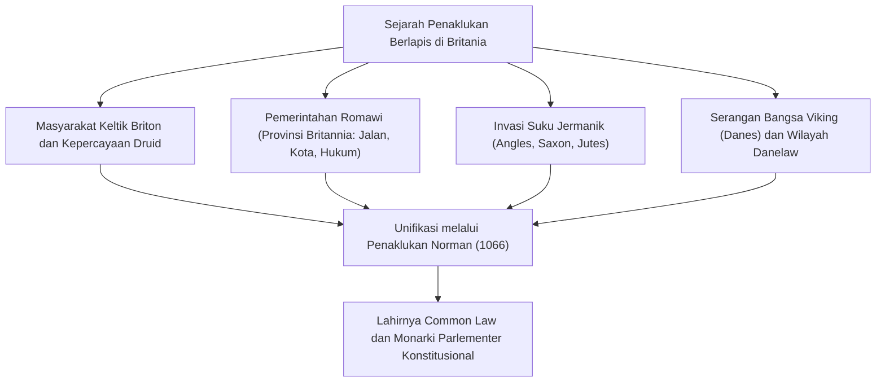
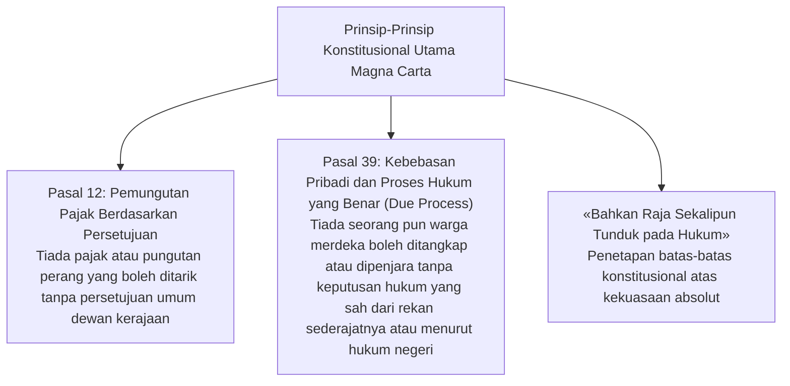
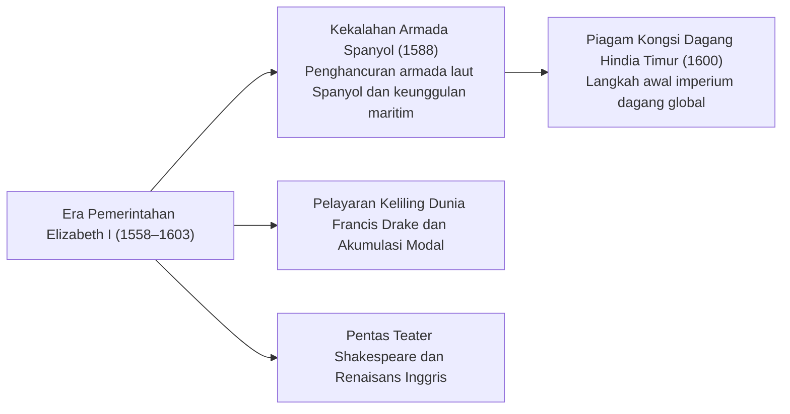
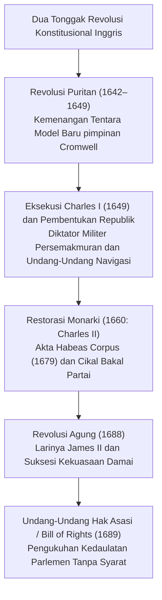
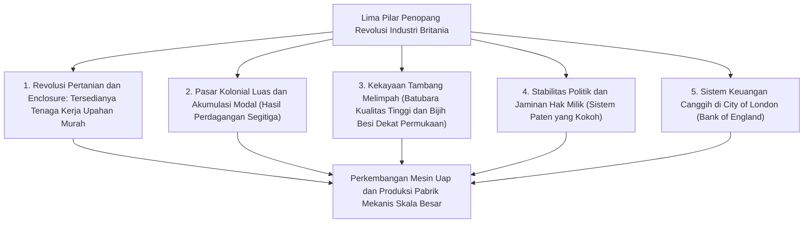
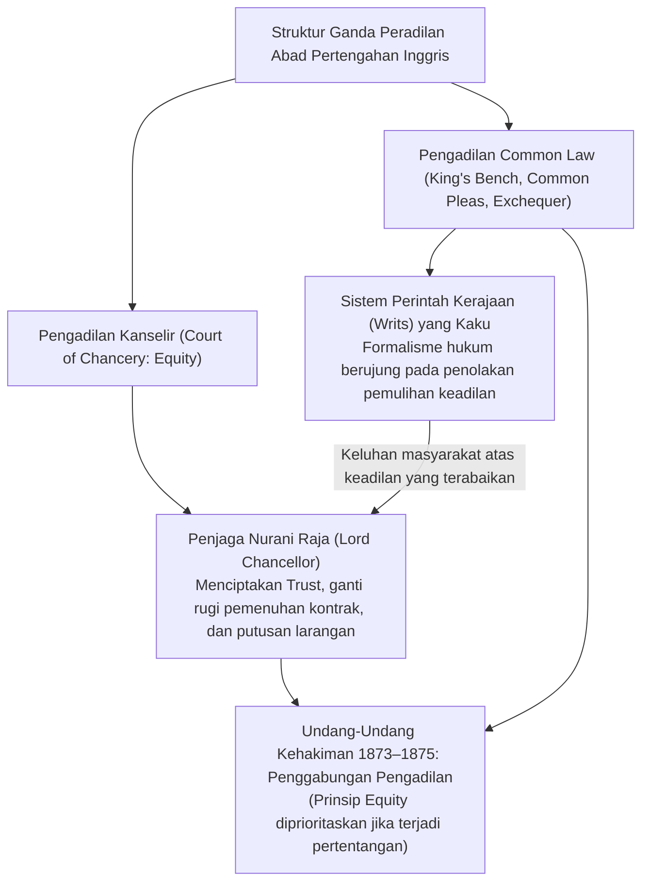
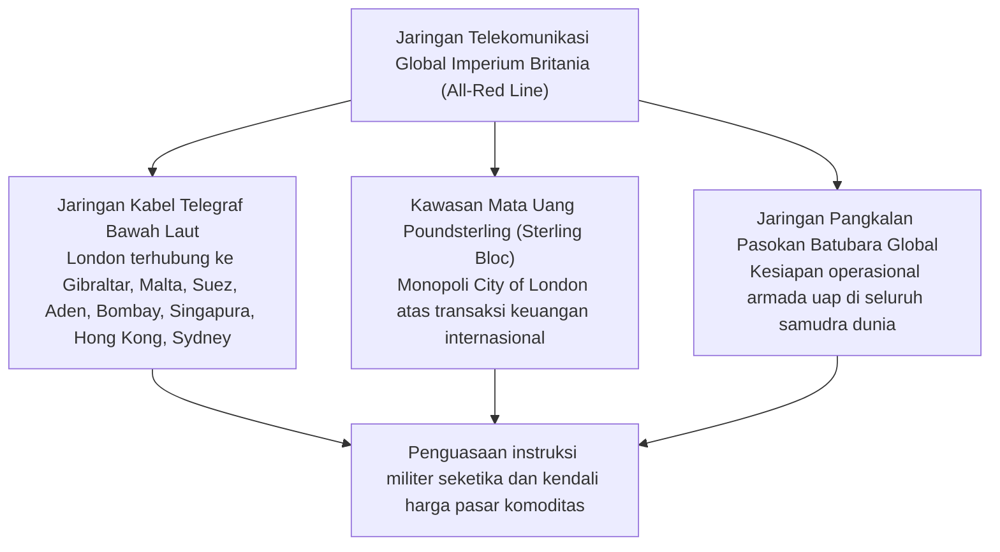
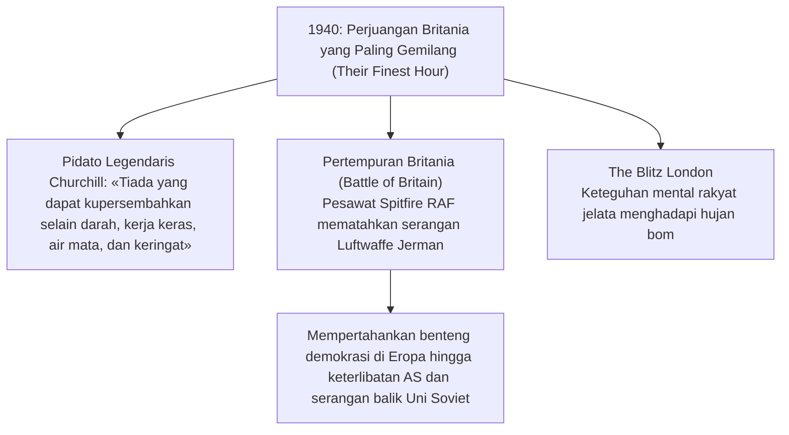
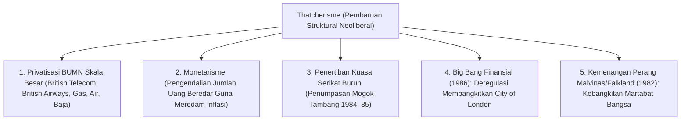
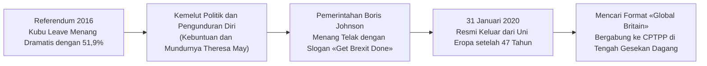

## 1. Pendahuluan: Geopolitik Pulau dan Semangat Tatanan Hukum Britania

### 1.1 Peradaban Megalitikum Keltik dan Provinsi Romawi Britannia

Terletak di perairan barat laut daratan Eropa, pulau Britania Raya telah menyaksikan gelombang migrasi dan penaklukan yang berulang sejak zaman prasejarah. Monumen megalitikum **Stonehenge**, yang didirikan di Dataran Salisbury pada milenium ke-3 SM, menjadi bukti nyata atas tingginya pengetahuan astronomi dan kedalaman devosi spiritual masyarakat adat pra-aksara.

Pada milenium pertama SM, suku-suku Keltik yang menguasai kebudayaan besi (orang Briton) mendiami pulau ini, mengembangkan tradisi pertanian yang subur serta menjalankan upacara penyembahan alam di bawah bimbingan para pendeta Druid. Menyusul dua ekspedisi militer Gaius Julius Caesar pada tahun 55 dan 54 SM, Kaisar Claudius melancarkan invasi besar-besaran pada tahun 43 M, mengintegrasikan bagian selatan Britania ke dalam Imperium Romawi sebagai provinsi **Britannia**.

Pemerintahan Romawi bertahan selama hampir empat abad. Kota-kota terencana dibangun, salah satunya adalah **Londinium** (cikal bakal London modern), yang dihubungkan oleh jaringan jalan raya beraspal batu yang kokoh (seperti Watling Street). Romawi membawa teknologi pertambangan, pemandian umum, bahasa Latin, dan agama Kristen. Demi menahan serbuan suku-suku Pict dari Caledonia (Skotlandia) di utara, Kaisar Hadrian memerintahkan pembangunan **Tembok Hadrian (Hadrian's Wall)**, sebuah benteng perbatasan batu yang masih berdiri megah hingga kini. Pada tahun 410 M, saat Roma terancam oleh penjarahan suku Visigoth, Kaisar Honorius memerintahkan penarikan seluruh legiun dari Britannia, melemparkan pulau ini kembali ke dalam pusaran zaman kegelapan.

---

### 1.2 Invasi Anglo-Saxon, Heptarki, dan Mukjizat Alfred yang Agung

Setelah perginya legiun Romawi, tiga suku bangsa Jermanik dari seberang Laut Utara — suku Angles, Saxon, dan Jutes — melancarkan migrasi dan invasi besar-besaran pada pertengahan abad ke-5. Orang-orang Keltik Briton pribumi perlahan terdesak ke arah barat menuju Wales dan Cornwall, serta ke wilayah pegunungan Skotlandia di utara (memori atas perlawanan heroik kaum Keltik ini kelak diabadikan dalam legenda ksatria Raja Arthur).

Para penakluk mendirikan kerajaan-kerajaan kecil yang akhirnya terkonsolidasi menjadi masa **«Heptarki» (Tujuh Kerajaan)**: Northumbria, Mercia, East Anglia, Essex, Sussex, Wessex, dan Kent. Pada akhir abad ke-6, misi penginjilan yang diutus oleh Paus Gregorius I dan dipimpin oleh Agustinus (Uskup Agung Canterbury pertama) mempercepat proses kristenisasi di Inggris.

Menjelang akhir abad ke-8, para penjarah Viking dari Skandinavia (bangsa Dane) menyerbu pesisir Britania. Mereka merampok biara-biara dan menguasai separuh timur Inggris. Di tengah krisis eksistensial ini, raja dari kerajaan Wessex di barat daya, **Alfred yang Agung (Alfred the Great, bertahta 871–899)**, bangkit memimpin perlawanan:
- Dalam **Pertempuran Edington (878)**, ia berhasil memukul mundur pasukan Denmark dan menyepakati Perjanjian Wedmore, membagi Inggris menjadi dua wilayah dan menetapkan kawasan kekuasaan Denmark sebagai «Danelaw».
- Untuk memperkuat pertahanan nasional, ia membangun jaringan kota benteng pertahanan (**burghs**) serta mendirikan fondasi bagi armada angkatan laut kerajaan.
- Ia mengkodifikasi hukum, memajukan pendidikan dengan menerjemahkan karya-karya klasik Latin ke dalam bahasa Inggris Kuno bagi para klerus dan rakyat biasa, serta memprakarsai penulisan *Anglo-Saxon Chronicle*.
- Sebagai satu-satunya raja dalam sejarah Inggris yang dianugerahi gelar «yang Agung», masa pemerintahan Alfred meletakkan dasar bagi terbentuknya sebuah negara kesatuan: **«Engla-lond» (Negeri Bangsa Angles = England / Inggris)**.

---

## 2. Penaklukan Norman (1066) dan Doktrin Hukum Magna Carta

### 2.1 Tahun Bersejarah 1066: Pertempuran Hastings dan Dinasti Norman

Pada tahun 1066, wafatnya Raja Edward sang Pengaku tanpa meninggalkan keturunan memicu krisis suksesi tahta. Meskipun Witenagemot mengangkat Harold Godwinson sebagai Harold II, di seberang Selat Inggris, William, Adipati Normandia, mengklaim hak sah atas tahta dan mengumpulkan armada penyerbuan.

Pada tanggal 14 Oktober 1066, meletuslah **Pertempuran Hastings**.
Formasi rapat «dinding perisai» pasukan infanteri Anglo-Saxon bertahan selama berjam-jam melawan gempuran kavaleri berat dan barisan pemanah Norman. Menjelang senja, Harold II tewas setelah matanya tertembus anak panah; barisan pertahanan Anglo-Saxon pun runtuh. William kemudian dinobatkan sebagai Raja Inggris di Westminster Abbey pada Hari Natal 1066 dengan gelar William I (William sang Penakluk).

**Penaklukan Norman (Norman Conquest)** merupakan titik balik paling menentukan dalam sejarah Britania:
1. **Pergeseran Geopolitik**: Orientasi diplomatik Inggris yang sebelumnya berkiblat ke dunia Skandinavia beralih sepenuhnya ke dunia feodal, Latin, dan kontinental di Prancis serta Eropa Barat.
2. **Dualisme Bahasa dan Budaya**: Para penguasa dan bangsawan bertutur dalam bahasa Anglo-Norman (bahasa Prancis Kuno), sedangkan rakyat jelata menggunakan bahasa Inggris Kuno yang berakar Jermanik. Perpaduan bertahap kedua bahasa ini selama berabad-abad melahirkan bahasa Inggris modern yang kaya akan kosakata.
3. **Kitab Domesday (Domesday Book, 1086)**: William I memerintahkan sensus komprehensif atas seluruh tanah kepemilikan, lahan pertanian, hutan, kincir air, ternak, hingga cacah jiwa budak dan orang merdeka. Sensus kepemilikan feodal ini menciptakan sistem administrasi terpusat yang jauh lebih efektif dibandingkan di daratan Eropa pada masa itu.

---

### 2.2 Reformasi Peradilan Henry II dan Lahirnya Common Law

Pada pertengahan abad ke-12, Henry dari Anjou mendirikan dinasti Plantagenet sebagai **Henry II (bertahta 1154–1189)**. Menguasai wilayah kekuasaan luas yang dikenal sebagai Kekaisaran Angevin — membentang dari Skotlandia hingga Pegunungan Pyrenees —, raja visioner ini merombak total sistem peradilan Inggris.

Untuk meniadakan kesewenang-wenangan pengadilan feodal setempat dan menyatukan hukum adat yang terpecah-pecah, Henry II melembagakan sistem hakim keliling kerajaan (**Assize Courts**):
- Para hakim kerajaan mengkaji, menyelaraskan, dan memadukan adat istiadat lokal terbaik menjadi satu kesatuan hukum yang berlaku seragam di seluruh negeri: **Common Law (Hukum Umum)**.
- Ia meletakkan dasar bagi **sistem juri modern (Jury System)**, yang memanfaatkan kesaksian warga setempat yang jujur di bawah sumpah untuk membuktikan kebenaran fakta suatu sengketa.
- Alih-alih bertumpu pada kitab undang-undang tertulis ciptaan penguasa, tradisi hukum Inggris berakar kokoh pada doktrin preseden yudisial yang mengikat (**Stare Decisis**).

---

### 2.3 Magna Carta (1215): Lahirnya Prinsip Negara Hukum

Putra bungsu Henry II, Raja **John «Lackland» (bertahta 1199–1216)**, menelan kekalahan telak dari Raja Philip II Augustus dari Prancis, kehilangan sebagian besar tanah di Eropa daratan, serta dijatuhi hukuman ekskomunikasi oleh Paus Inosensius III. Guna mendanai peperangannya, John memungut pajak feodal (scutage) yang luar biasa mencekik dan memerintah secara lalim. Dipicu oleh kemarahan mendalam, para baron feodal memberontak dan menduduki London.

Pada 15 Juni 1215, di padang rumput Runnymede dekat Windsor, para baron memaksa Raja John membubuhkan stempel kerajaan pada piagam bersejarah: **Magna Carta (Piagam Besar)**.

Arti penting Magna Carta jauh melampaui dokumen perdamaian feodal abad pertengahan, karena piagam ini menetapkan prinsip universal **Negara Hukum (Rule of Law)**: *bahkan kekuasaan tertinggi seorang raja tidaklah mutlak dan harus tunduk pada hukum yang berlaku*. Secara khusus, Pasal 39 menjadi fondasi bagi doktrin **«Proses Hukum yang Benar» (Due Process of Law)** yang mengilhami revolusi-revolusi abad ke-17 di Inggris serta Deklarasi Hak-Hak Konstitusi Amerika Serikat.

Pada tahun 1295, Raja Edward I menyelenggarakan **Parlemen Model (Model Parliament)**, yang mengikutsertakan bangsawan, klerus, serta perwakilan dua kesatria dari setiap county dan dua warga dari setiap kota, memantapkan struktur dua kamar Parlemen Britania: Dewan Bangsawan (House of Lords) dan Dewan Rakyat (House of Commons).

---

## 3. Perang Seratus Tahun, Perang Mawar, dan Absolutisme Tudor

### 3.1 Perang Seratus Tahun (1337–1453), Maut Hitam, dan Runtuhnya Perbudakan

Perselisihan atas klaim tahta Prancis dan kendali atas perdagangan wol Flanders menyulut **Perang Seratus Tahun** antara Inggris dan Prancis, yang berlangsung selama 116 tahun.
- Pasukan Inggris di bawah pimpinan Edward III, Pangeran Hitam, dan Henry V mengandalkan korps **pemanah busur panjang (Longbow)** asal Wales. Dalam Pertempuran Crécy (1346) dan Agincourt (1415), hujan anak panah mereka menghancurkan kavaleri ksatria berbaju zirah Prancis, menandai berakhirnya dominasi ksatria feodal.
- Munculnya Joan of Arc membalikkan keadaan untuk keunggulan Prancis; pada tahun 1453, Inggris kehilangan seluruh wilayahnya di daratan Eropa kecuali Calais. Terusir dari benua, para bangsawan Inggris menanggalkan identitas kebangsawanan Prancis dan mulai memupuk kesadaran kebangsaan Inggris yang sejati.

Pada kurun waktu yang sama, tahun 1348, wabah pes **Maut Hitam (Black Death)** menerpa seantero negeri, memusnahkan sepertiga hingga setengah dari total populasi:
- Kelangkaan tenaga kerja drastis melipatgandakan nilai tawar dan upah para petani yang selamat.
- Tindakan para tuan tanah yang berusaha menekan upah secara paksa menyulut **Pemberontakan Petani 1381** (dipimpin Wat Tyler dan John Ball). Dengan pekikan kesetaraan *«Ketika Adam mencangkul dan Hawa memintal, siapakah yang menjadi bangsawan?»*, sistem perhambaan feodal di Inggris runtuh berabad-abad lebih awal dibandingkan di daratan Eropa.

---

### 3.2 Perang Mawar dan Fajar Dinasti Tudor

Menyusul kekalahan di Prancis, Inggris terjerumus dalam perang saudara berdarah memperebutkan tahta kerajaan selama tiga dekade: **Perang Mawar (1455–1485)** antara Wangsa Lancaster (mawar merah) dan Wangsa York (mawar putih).
Pembantaian terus-menerus dan hukuman mati melenyapkan sebagian besar bangsawan feodal lama, melemahkan kekuatan para baron secara signifikan.

Pada tahun 1485, dalam Pertempuran Bosworth, Henry Tudor mengalahkan Richard III dari York dan naik tahta sebagai Henry VII, mengawali **Dinasti Tudor**. Ia menundukkan kaum bangsawan yang memberontak melalui pengadilan darurat Kamar Bintang (*Court of Star Chamber*) dan mengangkat para tuan tanah pedesaan (*gentry*) sebagai hakim perdamaian (*Justices of the Peace*), membangun fondasi birokrasi negara modern yang terpusat.

---

### 3.3 Reformasi Agama Henry VIII dan Zaman Keemasan Elizabeth I

Karakter Inggris modern dibentuk oleh Reformasi Agama yang diprakarsai oleh **Henry VIII (bertahta 1509–1547)**.
Menghadapi penolakan Paus Klemens VII untuk membatalkan pernikahannya dengan Catherine dari Aragon demi menikahi Anne Boleyn, Henry memutuskan hubungan dengan Gereja Katolik Roma:
- **Akta Supremasi (1534)**: Menetapkan raja Inggris sebagai kepala tertinggi di bumi bagi Gereja Inggris (*Church of England* / Gereja Anglikan).
- Membubarkan seluruh biara Katolik dan menyita kekayaannya, lalu menjual tanah-tanah biara tersebut kepada kaum *gentry* dan saudagar perkotaan. Kebijakan ini melahirkan kelas pemilik modal baru yang kepentingannya terikat erat pada keberlangsungan perpisahan dengan Roma.

Setelah periode represi berdarah terhadap kaum Protestan di bawah Mary I («Bloody Mary»), putri Henry VIII, **Elizabeth I (bertahta 1558–1603)**, naik tahta. Melalui Akta Keseragaman, ia menetapkan «Jalan Tengah» (*Via Media*), memadukan liturgi bergaya tradisional dengan teologi Protestan.

Pada tahun 1588, Raja Philip II dari Spanyol mengirimkan «Armada Spanyol» untuk menginvasi Inggris. Taktik kapal api yang dilancarkan Sir Francis Drake serta amukan badai Atlantik menghancurkan armada Spanyol. Pada tahun 1600, ratu menerbitkan piagam pendirian **Kongsi Dagang Hindia Timur Britania (EIC)**, membuka era ekspansi dagang ke Asia. Sementara karya-karya William Shakespeare memukau penonton di Globe Theatre, Inggris menjelma menjadi kekuatan maritim dunia.

---

## 3.6 «Domba Memakan Manusia»: Enclosure dan Undang-Undang Kemiskinan Elizabeth

Struktur sosial dan ekonomi Inggris abad ke-16 diguncang oleh gerakan pemagaran tanah pertama (**Enclosure Movement**), yang didorong oleh tingginya permintaan wol Inggris di pasar Eropa.

### ① Kecaman Thomas More dalam *Utopia* (1516)
Para tuan tanah kaya mengusir petani penggarap dari tanah komunal dan ladang terbuka, memagarinya dengan semak berduri untuk dijadikan padang rumput domba yang menghasilkan keuntungan berlipat.
Cendekiawan humanis dan mantan Lord Chancellor, Thomas More, mengecam proses akumulasi primitif ini dalam karyanya, *Utopia*:

> **«Domba-domba kalian, yang biasanya begitu jinak dan hanya makan sedikit, konon kini menjadi begitu rakus dan buas hingga melahap manusia itu sendiri, merusak dan menelantarkan ladang, rumah, dan kota-kota.»**

Para petani yang kehilangan tanah mengalir ke kota-kota besar seperti London sebagai pengembara miskin, dan ribuan di antaranya digantung atas dasar undang-undang anti-gelandangan yang kejam.

### ② Tonggak Sejarah Undang-Undang Kemiskinan Elizabeth (1601)
Untuk meredam gejolak sosial dan kemiskinan yang meluas, Parlemen mengesahkan **Undang-Undang Kemiskinan 1601 (*Poor Law of 1601*)**:
- Pengelolaan dan pendanaan diatur di tingkat paroki melalui pemungutan pajak properti wajib (**Poor Rate**).
- Mengklasifikasikan kaum miskin ke dalam tiga kelompok:
  1. **Orang miskin yang mampu bekerja**: diwajibkan bekerja di rumah kerja (*workhouses*).
  2. **Orang miskin yang tidak berdaya** (anak yatim, lansia, orang sakit, difabel): dirawat di panti sosial atau diberi bantuan di rumah.
  3. **Penganggur pemalas dan gelandangan**: dikurung dan dihukum di rumah pembinaan.
- Dengan mentransformasikan santunan kemiskinan dari sekadar amal keagamaan sukarela menjadi kewajiban hukum negara, undang-undang ini meletakkan sistem jaminan sosial publik pertama di dunia.

---

## 4. Revolusi Britania dan Lahirnya Monarki Konstitusional

### 4.1 Absolutisme Stuart dan Revolusi Puritan (1642–1649)

Setelah Elizabeth I wafat tanpa meninggalkan keturunan, Raja James VI dari Skotlandia diangkat menjadi Raja Inggris dengan nama **James I**, mengawali Dinasti Stuart.

James I dan putranya, **Charles I**, menganut doktrin **Hak Ilahi Raja-Raja**, memerintah tanpa mengindahkan Parlemen, memungut pajak sepihak (seperti *Ship Money*), dan menindas kaum Puritan. Ahli hukum Sir Edward Coke menegaskan bahwa «Raja tunduk di bawah Tuhan dan Hukum». Pada tahun 1628, Parlemen mengajukan **Petisi Hak (Petition of Right)** yang melarang penahanan sewenang-wenang dan pemungutan pajak tanpa izin Parlemen.

Setelah memerintah selama sebelas tahun tanpa parlemen (*Eleven Years' Tyranny*), Charles I terpaksa memanggil kembali Parlemen untuk membiayai perang melawan Skotlandia. Ketegangan memuncak menjadi perang saudara antara pendukung setia raja (*Cavaliers*) dan pendukung Parlemen (*Roundheads*) — peristiwa yang dikenal sebagai **Revolusi Puritan**.

Di bawah komando Oliver Cromwell, **Tentara Model Baru (New Model Army)** yang berdisiplin baja memukul hancur pasukan raja. Pada 30 Januari 1649, pengadilan darurat memutuskan **Raja Charles I bersalah atas tuduhan «tiran, pengkhianat, pembunuh, dan musuh negara» serta dieksekusi pancung di depan umum**, sebuah peristiwa yang mengguncang seluruh monarki di Eropa.

Monarki dihapuskan dan sistem republik (Persemakmuran) didirikan, namun kediktatoran militer Cromwell sebagai Lord Protector memicu keresahan publik. Setelah wafatnya Cromwell, Parlemen memulihkan monarki pada tahun 1660 di bawah **Charles II** (Restorasi Stuart).

---

### 4.2 Revolusi Agung (1688) dan Undang-Undang Hak Asasi (Bill of Rights)

Ketika Charles II digantikan oleh adiknya yang beragama Katolik, **James II**, sang raja kembali berusaha memulihkan absolutisme dan dominasi Katolik. Menghadapi ancaman ini, dua faksi utama Parlemen — kaum **Tory** (pendukung hak raja) dan kaum **Whig** (pendukung kedaulatan parlemen) — bersatu padu.

Pada tahun 1688, para pemimpin parlemen secara rahasia mengundang putri James II yang beragama Protestan, Mary, bersama suaminya, penguasa Belanda **William dari Orange (William III)**, untuk mendarat dengan membawa pasukan. Merasa terkepung, James II melarikan diri ke Prancis tanpa perlawanan. Peralihan kekuasaan tanpa tumpah darah ini dikenang sebagai **Revolusi Agung (Glorious Revolution)**.

Pada tahun 1689, William dan Mary mengesahkan deklarasi hak-hak parlemen menjadi undang-undang: **Bill of Rights (Undang-Undang Hak Asasi 1689)**:
- Raja dilarang menangguhkan undang-undang atau memungut pajak tanpa persetujuan Parlemen.
- Kebebasan berbicara dan berdebat di dalam Parlemen dijamin penuh.
- Pembentukan tentara tetap pada masa damai tanpa persetujuan Parlemen dilarang keras.
- Parlemen harus bersidang secara teratur.

Peristiwa ini menandai tegaknya sistem **monarki konstitusional** dan asas **kedaulatan parlemen (Parliamentary Sovereignty)**: *«Raja bertahta, tetapi tidak memerintah»*.

Pada tahun 1707, di bawah Ratu Anne, Akta Persatuan menyatukan Inggris dan Skotlandia menjadi **Kerajaan Britania Raya (Kingdom of Great Britain)**. Pada tahun 1714, George I dari Wangsa Hanover naik tahta (yang tidak dapat berbahasa Inggris); Robert Walpole muncul sebagai perdana menteri pertama *de facto*, memformalisasikan **sistem kabinet yang bertanggung jawab kepada parlemen (*Cabinet System*)**, pilar utama demokrasi perwakilan modern.

---

## 5. Revolusi Industri dan Abad «Pax Britannica»

### 5.1 Menjadi «Bengkel Dunia»: Dinamika Revolusi Industri Pertama

Mengapa Revolusi Industri pertama dalam peradaban manusia terjadi di Britania pada akhir abad ke-18? Keberhasilan ini didorong oleh pertemuan lima faktor keunggulan:

- **Inovasi Tekstil Katun**: Kumparan terbang John Kay, mesin pintal Jenny ciptaan Hargreaves, mesin pintal bertenaga air Arkwright, mesin pintal Mule Crompton, dan alat tenun mekanis Cartwright.
- **Tenaga Penggerak Uap**: Penyempurnaan mesin uap dengan kondensor terpisah oleh James Watt (1769). Lokasi pabrik berpindah dari tepi sungai ke pusat-pusat ladang batubara (Manchester, Birmingham).
- **Revolusi Transportasi**: Lokomotif uap *The Rocket* ciptaan George Stephenson (1829). Jalur kereta api Liverpool-Manchester memicu pembangunan jalur rel secara massal, memangkas biaya pengiriman secara dramatis.

Pada tahun 1851, Pameran Akbar Dunia pertama dibuka di Hyde Park London di dalam bangunan kaca megah **Istana Kristal (Crystal Palace)**. Dikunjungi oleh lebih dari enam juta orang dari penjuru bumi, pameran ini mengukuhkan Britania Raya sebagai **«Bengkel Dunia» (Workshop of the World)**.

---

### 5.2 Ekspansi Global Imperium Britania

Pada era Victoria (1837–1901), dilindungi oleh supremasi mutlak armada Angkatan Laut Kerajaan (*Royal Navy*) dan ditopang oleh perdagangan bebas, Britania menikmati era hegemoni global: **Pax Britannica (Perdamaian Britania)**.

Sebagai imperium tempat «matahari tidak pernah tenggelam», wilayah kekuasaannya mencakup seperempat daratan bumi dan memerintah seperempat umat manusia.

| Wilayah | Koloni dan Wilayah Kekuasaan Utama | Ciri Kekuasaan dan Catatan Sejarah |
| :--- | :--- | :--- |
| **Asia Selatan** | **India («Permata di Mahkota Imperium»)** | Diperintah oleh EIC sejak Pertempuran Plassey (1757). Setelah Pemberontakan Sepoy 1857, EIC dibubarkan dan dialihkan ke pemerintahan langsung Mahkota (*British Raj*). Pada tahun 1877, Ratu Victoria dinobatkan sebagai Maharani India. |
| **Asia Timur** | **Tiongkok (Dinasti Qing) & Hong Kong** | Penyelundupan opium memicu Perang Candu Pertama (1840). Melalui Perjanjian Nanking (1842), Hong Kong diserahkan dan pelabuhan dagang dibuka secara paksa dengan hak ekstrateritorial. |
| **Afrika** | **Dari Mesir hingga Afrika Selatan** | Pembelian saham Terusan Suez oleh Disraeli (1875). Rencana jalur kereta api «Dari Kairo ke Cape Town» oleh Cecil Rhodes (kebijakan 3C: Kairo, Kalkuta, Cape Town). Perang Boer. |
| **Dominion** | **Kanada, Australia, Selandia Baru** | Wilayah pemukiman kulit putih yang diberikan hak pemerintahan otonom lebih dini, menjadi cikal bakal Persemakmuran Bangsa-Bangsa (Commonwealth). |

Di panggung politik dalam negeri, berlangsung rivalitas klasik antara tokoh Konservatif Benjamin Disraeli (diplomasi imperialis dan pembaruan sosial) dan tokoh Liberal William Gladstone (disiplin anggaran, perdagangan bebas, dan otonomi Irlandia). Reformasi pemilu tahun 1832, 1867, dan 1884 secara bertahap memperluas hak pilih ke kalangan pekerja, mengantarkan Britania menuju sistem demokrasi murni secara tertib.

---

## 2.4 Dualisme Peradilan: Common Law, Equity, dan Doktrin Surat Perintah (*Writs*)

Perbedaan paling mendasar antara hukum Britania dan sistem hukum kontinental (Eropa daratan) adalah perkembangannya melalui interaksi dua sistem peradilan paralel: **Common Law** dan **Equity (Keadilan/Kelayakan)**.

### ① Kekakuan Formalistik Sistem Surat Perintah (*Writs*)
Pada abad ke-12 dan 13, agar suatu gugatan dapat diperiksa di pengadilan Common Law, penggugat harus membeli surat perintah kerajaan (*Writ*) dari Kanseleri Kerajaan yang cocok persis dengan jenis sengketanya.
Namun, demi mencegah meluasnya wewenang kerajaan, para bangsawan mengesahkan Ketetapan Oxford tahun 1258 yang melarang penerbitan format *writ* baru. Akibatnya, Common Law terperosok ke dalam kekakuan hukum formalistik (*formalism*): setiap sengketa baru yang tidak memiliki format baku langsung ditolak tanpa diadili.

### ② Pengadilan Kanselir dan Terciptanya Lembaga «Trust»
Para pencari keadilan yang dirugikan oleh kekakuan Common Law mengajukan permohonan keadilan langsung kepada raja. Raja melimpahkan permohonan ini kepada **Lord Chancellor**, pejabat keagamaan tertinggi dan «penjaga nurani raja».
- Kanselir mengadili perkara tanpa terikat pada kalimat kaku dalam *writ*, bertumpu pada keadilan alami dan nurani (*conscience*), melahirkan sistem hukum **Equity**.
- Bila Common Law hanya dapat menjatuhkan hukuman ganti rugi materiil secara retrospektif, Equity menciptakan putusan pemenuhan kewajiban kontrak (*Specific Performance*) serta putusan perintah larangan (*Injunction*).
- Kebiasaan para kesatria Perang Salib yang menitipkan tanahnya kepada sahabat tepercaya demi menghidupi keluarganya melahirkan konsep hukum **Trust (Pengelolaan Amanat)**, yang memisahkan kepemilikan formal secara hukum dari hak penikmat manfaat riil — sebuah karya cipta hukum terbesar dalam peradaban dunia.

---

## 3.4 Penaklukan Periferi Keltik: Nestapa Skotlandia dan Irlandia

Kejayaan Inggris dibangun seiring penaklukan militer dan penindasan kolonial terhadap negeri-negeri Keltik di sekitarnya.

### ① Perang Kemerdekaan Skotlandia: Wallace dan Bruce
Pada akhir abad ke-13, Raja Edward I («Palu Orang Skotlandia») menyerbu Skotlandia dengan memanfaatkan krisis tahta, serta menjarah batu penobatan suci Raja Skotlandia, «Batu Takdir» (Batu Scone), ke London.
- 1297: William Wallace (pahlawan film *Braveheart*) memimpin pemberontakan rakyat dan melibas kavaleri berat Inggris di Jembatan Stirling.
- 1314: Robert the Bruce menghancurkan pasukan besar Inggris dalam **Pertempuran Bannockburn** dengan formasi tombak rapat (*schiltrons*), memaksa Inggris mengakui kedaulatan penuh Skotlandia dalam Perjanjian Edinburgh-Northampton tahun 1328.

### ② Penaklukan Berdarah Cromwell dan Bencana Kelaparan Besar Irlandia
Nasib Irlandia jauh lebih menyedihkan:
- 1649: Usai memenangi perang saudara, Oliver Cromwell memimpin invasi brutal ke Irlandia. Pembantaian massal di Drogheda dan Wexford disusul penyitaan tanah milik warga Katolik Irlandia untuk dibagikan kepada pendatang Protestan Inggris dan Skotlandia (Kolonisasi Ulster). Warga pribumi Irlandia terdegradasi menjadi buruh tani miskin di tanah airnya sendiri.
- **Kelaparan Besar Irlandia (1845–1852)**: Serangan jamur merusak panen kentang, makanan pokok rakyat Irlandia.
  - Pemerintah Britania di London, yang terkungkung dogma ekonomi pasar bebas (*laissez-faire*), tetap membiarkan gandum Irlandia diekspor ke Inggris di saat rakyat jelata meregang nyawa.
  - Sekitar satu juta jiwa tewas akibat kelaparan dan wabah penyakit, dan lebih dari satu juta lainnya melarikan diri menaiki «kapal peti mati» ke Amerika Serikat (cikal bakal komunitas keturunan Irlandia yang melahirkan klan Kennedy). Populasi Irlandia anjlok hampir separuhnya, menorehkan trauma sejarah yang mendalam.

---

## 5.5 Infrastruktur Geopolitik dan Dominasi Informasi: Kabel Bawah Laut dan «The Great Game»

Kekuasaan Pax Britannica bertumpu pada kapal-kapal perang Royal Navy, namun juga ditopang oleh **infrastruktur telekomunikasi global pertama di dunia**.

- **Jaringan All-Red Line**: Memegang monopoli teknologi isolasi kabel bawah laut berbahan gutta-percha, Britania membentangkan kabel telegraf yang menghubungkan seluruh koloninya (yang pada peta dunia diwarnai merah). Karena seluruh titik pendaratan kabel berada di tanah kedaulatannya, jalur komunikasi perang aman dari penyadapan atau sabotase negara musuh.
- **The Great Game**: Perebutan pengaruh intelijen dan hegemoni wilayah Asia Tengah (Afganistan, Persia, Tibet) antara Imperium Britania dan Kekaisaran Rusia sepanjang abad ke-19 hingga awal abad ke-20 (diabadikan dalam novel *Kim* karya Rudyard Kipling), melahirkan konsep dasar geopolitik modern (Teori Heartland oleh Halford Mackinder).

---

## 6. Dua Perang Dunia dan Senjakala Imperium

### 6.1 Perang Dunia I dan Terkurasnya Kekuatan Finansial

Pada awal abad ke-20, menghadapi ekspansi industri dan perlombaan armada laut Kekaisaran Jerman, Britania menanggalkan doktrin «Isolasi Gemilang» (*Splendid Isolation*), membentuk Aliansi Anglo-Jepang (1902), Entente Cordiale dengan Prancis (1904), dan konvensi dengan Rusia (1907) untuk membentuk Triple Entente.

Pada bulan Agustus 1914, Perang Dunia I meletus:
- Di parit-parit Front Barat (Pertempuran Somme dan Passchendaele), di bawah hujan peluru senapan mesin, gas beracun, dan artileri, satu generasi pemuda terbaik gugur («generasi yang hilang»).
- Kendati blokade maritim dan Pertempuran Jutland berhasil membendung armada laut Jerman, beban biaya perang yang astronomis mengubah Britania dari negara kreditur terbesar dunia menjadi negara debitur yang berutang besar kepada Amerika Serikat.

Pada dekade 1920-an, Partai Buruh bangkit menggantikan Partai Liberal; Ramsay MacDonald membentuk pemerintahan Buruh pertama. Pada tahun 1928, hak pilih setara bagi pria dan wanita di atas usia 21 tahun diberlakukan. Di saat yang sama, setelah Pemberontakan Paskah 1916 dan Perang Kemerdekaan Irlandia, Negara Bebas Irlandia berdiri pada tahun 1922 (hanya enam county di Irlandia Utara yang tetap bertahan di bawah kedaulatan Britania).

---

### 6.2 Perang Dunia II dan Perjuangan Gigih Churchill

Pada era 1930-an, di tengah kebangkitan Nazi Jerman pasca-Depresi Besar, Perdana Menteri Neville Chamberlain menempuh **Kebijakan Pasifikasi (Appeasement Policy)** lewat Perjanjian Munich 1938 untuk mencegah perang, yang berakhir dengan kegagalan total.

Pada September 1939, invasi Hitler ke Polandia menyulut Perang Dunia II. Pada Mei 1940, saat Prancis takluk oleh taktik Blitzkrieg dan Eropa Barat jatuh ke cengkeraman Nazi, **Winston Churchill** dilantik sebagai perdana menteri.

Pidato-pidato radio Churchill mengobarkan semangat perjuangan seluruh bangsa. Didukung jaringan radar peringatan dini, para penerbang muda Angkatan Udara Kerajaan (RAF) berhasil menggagalkan serangan udara Jerman (*«Belum pernah dalam sejarah pertikaian manusia, begitu banyak orang berhutang budi begitu besar kepada segelintir orang»*). Bersama Sekutu, kemenangan berhasil diraih melalui Pertempuran El Alamein (1942) dan D-Day (1944), namun Britania Raya keluar dari kancah perang dalam keadaan hancur secara fisik dan bangkrut secara finansial.

---

### 6.3 «Dari Buaian Hingga Liang Lahat» dan Dekolonisasi

Dalam pemilu musim panas 1945, Partai Konservatif pimpinan pahlawan perang Churchill kalah telak dari Partai Buruh pimpinan Clement Attlee. Rakyat menuntut jaminan sosial dan ketenteraman hidup nyata ketimbang nostalgia kebesaran imperium:
- **Pembangunan Negara Kesejahteraan**: Berpijak pada Laporan Beveridge, diluncurkan sistem jaminan sosial terpadu **«dari buaian hingga liang lahat» (From the cradle to the grave)**. Pada tahun 1948 dibentuk **Layanan Kesehatan Nasional (NHS)** yang menyediakan layanan medis gratis bagi seluruh warga, serta dilakukan nasionalisasi tambang batubara, kereta api, listrik, dan baja.
- **Runtuhnya Imperium (Dekolonisasi)**:
  - 1947: Dipimpin gerakan perlawanan tanpa kekerasan Mahatma Gandhi, India dan Pakistan merdeka melalui pemisahan wilayah.
  - **Krisis Suez (1956)**: Ketika Presiden Nasser menasionalisasi Terusan Suez, intervensi militer gabungan Inggris, Prancis, dan Israel dipaksa mundur memalukan akibat gertakan dan sanksi ekonomi dari Amerika Serikat dan Uni Soviet. Krisis ini secara telak membuktikan bahwa Britania bukan lagi sebuah negara adidaya dunia.

---

## 7. Dari Thatcherisme Menuju «Jalan Ketiga» dan Era Brexit

### 7.1 Jeratan «Penyakit Inggris» dan Revolusi Thatcher

Pada dekade 1970-an, pembengkakan belanja sosial, aksi mogok kerja serikat buruh yang tak terkendali, dan inefisiensi BUMN menjerumuskan Inggris ke dalam stagflasi berkepanjangan — dikenal sebagai **«Penyakit Inggris» (British Disease)**. Krisis memuncak pada **«Musim Dingin Kekecewaan» (1978–1979)**, saat mogok kerja massal petugas kebersihan hingga penggali kubur melumpuhkan aktivitas kota.

Dari keterpurukan ini, pada Mei 1979, hadirlah wanita pertama yang memimpin pemerintahan Britania: **Margaret Thatcher («Wanita Besi»)**.

Terapi kejut Thatcher membawa dampak sosial yang berat: deindustrialisasi di utara, lonjakan pengangguran, dan melebarnya kesenjangan sosial. Kendati demikian, kebijakan ini berhasil memulihkan daya saing ekonomi Britania dan mengembalikan London sebagai pusat keuangan global yang sejajar dengan New York.

---

### 7.2 Tony Blair dan «Jalan Ketiga»

Pada tahun 1997, Partai Buruh (*New Labour*) di bawah Tony Blair merebut kekuasaan setelah delapan belas tahun menjadi oposisi. Blair mengusung konsep **«Jalan Ketiga» (The Third Way)**, memadukan efisiensi ekonomi pasar bebas warisan Thatcher dengan investasi publik yang masif di bidang pendidikan dan kesehatan (NHS):
- Melaksanakan devolusi kewenangan dengan mendirikan Parlemen Skotlandia dan Majelis Nasional Wales.
- Memprakarsai penandatanganan bersejarah **Perjanjian Jumat Agung (1998)**, menyudahi tiga dekade konflik sektarian berdarah di Irlandia Utara (*The Troubles*).
- Namun demikian, keputusan Blair melibatkan militer Inggris dalam invasi ke Irak tahun 2003 bersama George W. Bush mencoreng reputasi moral kepemimpinannya.

---

### 7.3 Guncangan Hebat Brexit dan Britania Abad ke-21

Sejak bergabung dengan Komunitas Eropa (EC) pada tahun 1973, Britania Raya selalu bersikap skeptis terhadap integrasi supranasional birokrasi Brussels (menolak mata uang Euro dan Perjanjian Schengen).

Pada dekade 2010-an, kekhawatiran atas arus imigrasi dan hilangnya wewenang kedaulatan mengkristal dalam semboyan **«Take Back Control» (Rebut Kembali Kendali)**. Dalam referendum 23 Juni 2016 yang digelar David Cameron, kubu pendukung keluar dari Uni Eropa meraih kemenangan mengejutkan dengan **$51,9\,\%$ suara (Brexit)**.

Pada 31 Januari 2020, Britania Raya resmi mengakhiri keanggotaannya di Uni Eropa.
Kini, negeri ini berhadapan dengan hambatan perdagangan pasca-Brexit, kekurangan tenaga kerja, lonjakan inflasi, sengketa Protokol Irlandia Utara, serta tuntutan kemerdekaan kembali di Skotlandia seraya mencari perannya di panggung dunia.

---

## 5.6 Gelombang Gerakan Buruh: Dari Luddite Menuju Chartisme

Di balik kemilau kekayaan Revolusi Industri, para pengrajin tradisional dan kaum buruh terjerumus dalam pengangguran dan kemiskinan akibat mekanisasi mesin.

### ① Gerakan Luddite (1811–1816)
Para penenun di utara Inggris mendirikan perkumpulan rahasia di bawah sosok mitos «Jenderal Ned Ludd». Di kegelapan malam, mereka menyerbu pabrik dan menghancurkan mesin tenun uap menggunakan martil godam. Pemerintah mengerahkan pasukan tentara dan memberlakukan hukuman mati bagi perusak mesin melalui *Frame Breaking Act* tahun 1812.

### ② Gerakan Chartis (1838–1848)
Kekecewaan atas Undang-Undang Reformasi 1832 yang hanya memberikan hak pilih kepada borjuis kaya dan mengabaikan kaum pekerja memicu gerakan politik buruh massal pertama dalam sejarah.
William Lovett menyusun **Piagam Rakyat (*People's Charter*)** yang mengajukan **enam tuntutan pokok**:

1. **Hak pilih universal bagi seluruh pria dewasa** (penghapusan syarat kekayaan)
2. **Pemungutan suara secara rahasia** (mencegah intimidasi majikan)
3. **Penghapusan kualifikasi harta bagi calon anggota parlemen**
4. **Pemberian gaji bagi anggota parlemen** (agar rakyat miskin dapat mencalonkan diri)
5. **Pembagian daerah pemilihan yang berimbang** (representasi proporsional)
6. **Pemilihan umum parlemen setiap tahun** (mencegah korupsi dan menjaga akuntabilitas)

Kendati Parlemen sempat menolak tiga petisi yang ditandatangani jutaan orang, lima dari enam tuntutan tersebut (kecuali pemilu tahunan) akhirnya disahkan menjadi undang-undang pada akhir abad ke-19 hingga awal abad ke-20, menjadi pilar demokrasi Britania modern.

---

## 7.5 Modernisasi Monarki: Dari Wangsa Windsor ke Abad Elizabeth II

Kelangsungan monarki Britania di era modern didorong oleh kecakapan adaptasi dan kepekaan sosialnya sepanjang abad ke-20.

### ① Perubahan Nama Menjadi «Wangsa Windsor» (1917)
Saat sentimen anti-Jerman membara di tengah kancah Perang Dunia I, Raja George V menanggalkan nama dinasti keluarga asal Jermannya, «Saxe-Coburg-Gotha», dan menggantinya dengan nama bernuansa Inggris tulen: **Wangsa Windsor**, merujuk pada kastil kerajaan. Sebagai sepupu Kaisar Wilhelm II dari Jerman, sang raja lebih mengutamakan persatuan emosional dengan rakyatnya.

### ② Krisis Turun Tahta Edward VIII (1936)
Keinginan Edward VIII menikahi janda asal Amerika Serikat, Wallis Simpson, ditolak mentah-mentah oleh kabinet Stanley Baldwin dan pimpinan Gereja Anglikan. Sang raja memilih melepaskan tahta setelah hanya 325 hari memerintah, menyerahkannya kepada adiknya yang gagap, George VI (diabadikan dalam film *The King's Speech*). Peristiwa ini menegaskan bahwa Mahkota wajib tunduk pada saran kabinet yang dipilih secara demokratis.

### ③ Tujuh Puluh Tahun Pemerintahan Elizabeth II (1952–2022)
Dinobatkan pada usia 25 tahun pada 1952, Ratu Elizabeth II memimpin selama tujuh dekade hingga wafatnya pada tahun 2022 di usia 96 tahun (Yubileum Platina).
Menghadapi masa dekolonisasi, Perang Dingin, kemunduran industri, hingga prahara keluarga kerajaan, ia teguh memegang prinsip pengabdian tanpa pamrih dan netralitas politik, menjadi pilar pemersatu emosional seluruh bangsa.

---

## 8. Kesimpulan: Kontinuitas Tradisi dan Kebijaksanaan Reformasi Bertahap

Keistimewaan terbesar dalam sejarah Britania Raya terletak pada kenyataan bahwa **meskipun tidak memiliki sebuah naskah konstitusi tertulis yang terkodifikasi, bangsa ini berhasil membangun dan memelihara salah satu tatanan negara hukum dan demokrasi parlementer paling stabil dan tangguh di dunia**.

Alih-alih melenyapkan seluruh tatanan lama dalam revolusi berdarah untuk mendirikan republik secara teoretis, bangsa Britania senantiasa mencari pijakan legitimasi dari tradisi leluhur, yurisprudensi pengadilan, dan piagam-piagam agung (seperti Magna Carta dan Bill of Rights), memperbaruinya langkah demi langkah melalui **reformasi bertahap (*Incremental Reform*)**.

Perjuangan kemerdekaan yang dirintis para baron melawan tirani raja:
- Ditempa menjadi perlindungan hak-hak sipil nyata oleh para hakim Common Law,
- Diangkat menjadi kedaulatan tertinggi negara oleh para pejuang parlemen,
- Diperluas menjadi hak pilih universal oleh kaum buruh Revolusi Industri,
- Serta disempurnakan oleh sistem negara kesejahteraan yang melindungi kaum rentan.

Kini, setelah bermetamorfosis dari imperium global menjadi sebuah negara pulau di antara Eropa dan Samudra Atlantik, nilai-nilai yang diwariskan Britania kepada peradaban manusia — **Negara Hukum, Demokrasi Parlementer, dan Kemerdekaan Pribadi** — tetap menjadi mercusuar abadi bagi masyarakat bebas di seluruh dunia.
