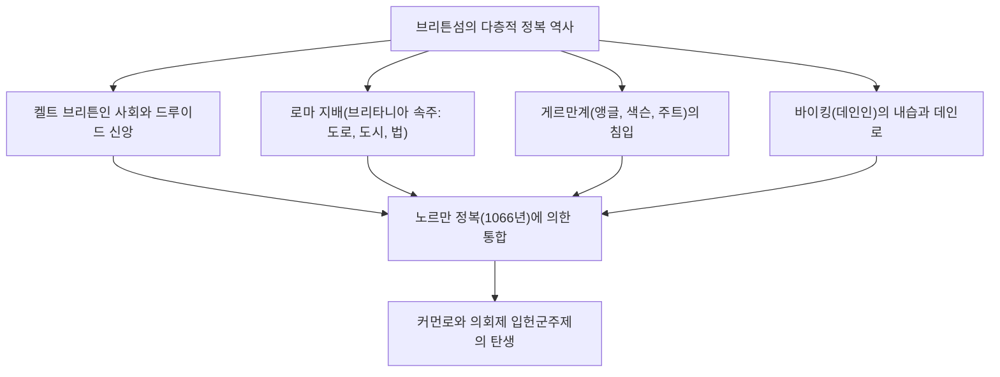
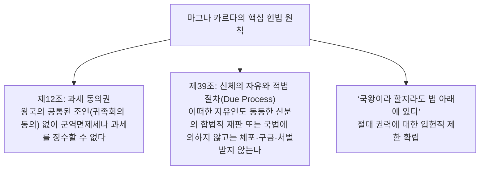
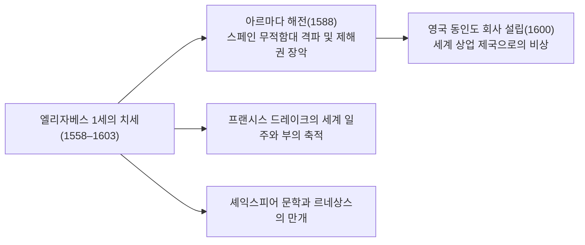
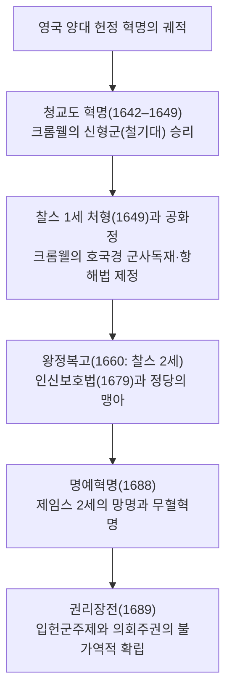
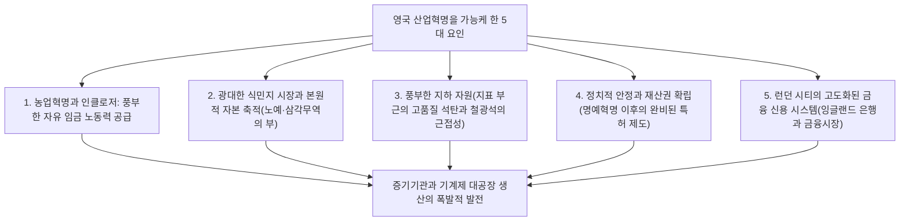
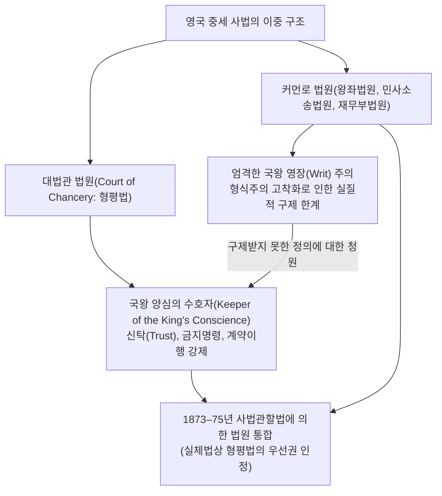
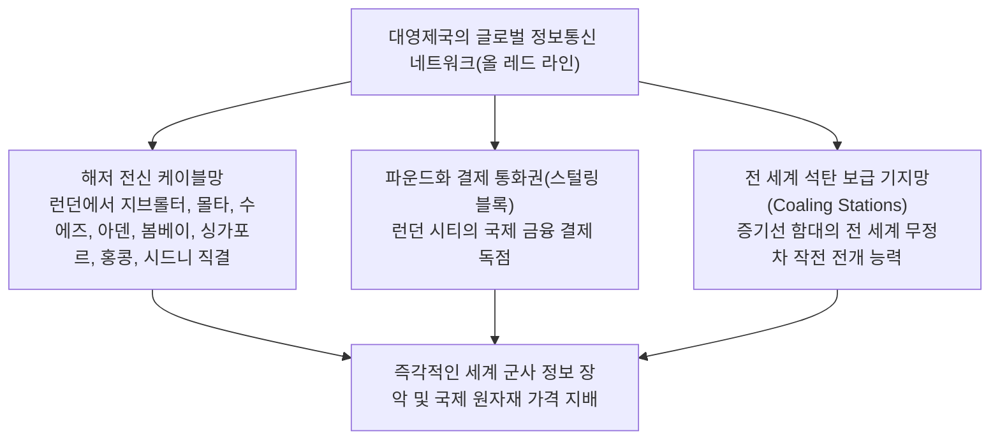
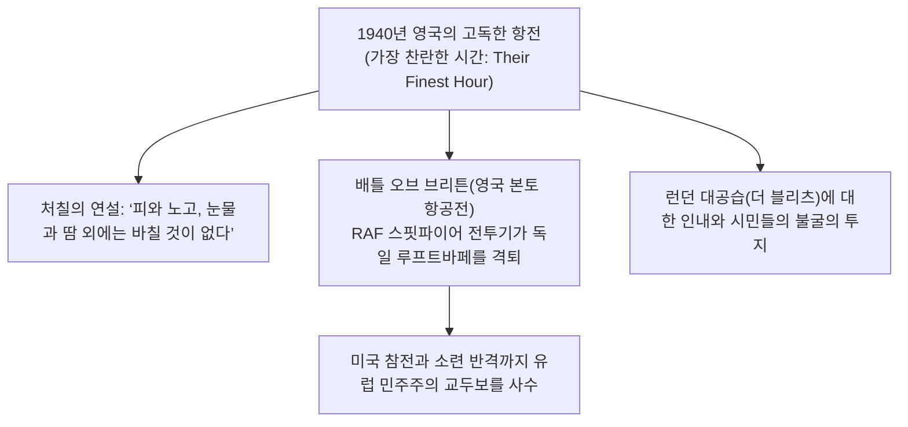
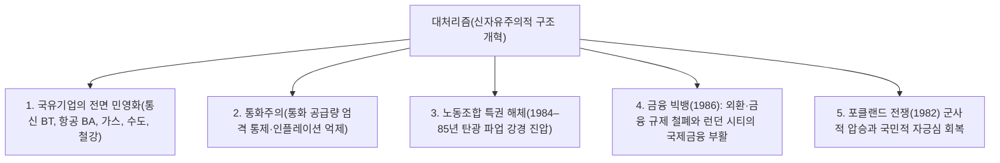

## 1. 서론: 섬나라 브리튼의 지정학과 법질서의 정신

### 1.1 켈트의 거석 문명과 로마 속주 브리타니아

유럽 대륙 북서쪽 바다에 떠 있는 그레이트브리튼섬은 태고 이래 대륙으로부터의 파상적인 민족 이동과 정복의 역사를 반복해 왔다. 기원전 3000년기에 솔즈베리 평원에 축조된 거석 기념물 **스톤헨지(Stonehenge)**는 문자를 갖지 못했던 초기 선주민들의 고도화된 천문학적 지식과 종교적 염원의 결정체다.

기원전 1천년기, 철기 문명을 지닌 켈트계 부족들(브리튼인)이 정착하여 풍요로운 농경과 드루이드 사제에 의한 자연 숭배 의식을 거행했다. 기원전 55년과 54년 가이우스 율리우스 카이사르의 두 차례 원정을 거쳐, 서기 43년 로마 황제 클라우디우스가 대규모 침략군을 파견함으로써 브리튼섬 남부는 로마 제국의 속주 **브리타니아(Britannia)**로 편입되었다.

로마의 지배는 약 4세기 동안 지속되었다. 현대 런던의 전신인 론디니움(Londinium)을 비롯한 계획도시가 건설되었고, 견고한 로마 가도망(왓틀링 스트리트 등)이 섬을 종단했으며, 광산 개발과 공중목욕탕, 라틴어와 기독교가 도입되었다. 북방 픽트인(칼레도니아)의 침략을 저지하기 위해 하드리아누스 황제가 축조한 **하드리아누스의 장벽(Hadrian's Wall)**은 제국 최북단의 방어선으로서 지금도 그 웅장함을 자랑하고 있다. 서기 410년, 서고트족의 로마 약탈에 직면한 호노리우스 황제는 브리타니아 주둔 로마 군단의 전면 철수를 명령했고, 브리튼섬은 다시 격동의 암흑시대로 내던져졌다.

---

### 1.2 앵글로-색슨의 침입과 7왕국, 앨프리드 대왕의 기적

로마 군단이 떠난 브리튼섬에 북해를 건너 게르만계 3부족인 앵글인, 색슨인, 주트인이 파죽지세로 침입하기 시작했다(5세기 중엽). 토착 켈트 브리튼인들은 서쪽의 웨일스, 콘월 및 북쪽의 스코틀랜드 산악 지대로 밀려났다(이 켈트인의 영웅적 저항 전승은 훗날 중세 기사도 문학의 걸작인 ‘아서왕 전설’로 승화되었다).

섬을 장악한 침입자들은 각지에 소왕국들을 난립시켰고, 이윽고 **‘7왕국(헵타키: Heptarchy)’**—노섬브리아, 머시아, 이스트 앵글리아, 에식스, 서식스, 웨식스, 켄트—의 분립 항쟁 시대로 돌입했다. 6세기 말 로마 교황 그레고리오 1세가 파견한 특사 아우구스티누스(초대 캔터베리 대주교)에 의해 잉글랜드의 기독교화가 급속히 진전되었다.

8세기 말, 북유럽 스칸디나비아에서 약탈자 바이킹(데인인)이 내습했다. 수도원들을 불태우고 잉글랜드 동반부를 장악한 데인인에 맞서, 유일하게 살아남은 남서부 웨식스 왕국에서 분연히 일어선 인물이 바로 **앨프리드 대왕(Alfred the Great, 재위 871–899)**이다.
- 에딩턴 전투(878년)에서 데인군을 격파하고 웨드모어 조약을 체결하여 잉글랜드를 양분(데인인의 자치 거주 구역인 ‘데인로’ 설정).
- 통치 방위 체제를 굳건히 하기 위해 전국에 요새화 도시망(버그: Burgh)을 구축하고 왕립 해군의 시초를 창설.
- 법전을 편찬하고 사제뿐 아니라 평민 교육을 위해 라틴어 고전을 고대 영어로 번역하게 했으며, 《앵글로-색슨 연대기》의 편찬을 지시했다.
- 영국 역사상 유일하게 ‘대왕(The Great)’이라는 칭호를 받은 앨프리드의 치세에서 ‘앵글인의 땅=잉글랜드(England)’라는 통일 국가의 맹아가 탄생했다.

---

## 2. 노르만 정복(1066년)과 마그나 카르타의 법리

### 2.1 운명의 1066년: 헤이스팅스 전투와 노르만 왕조의 성립

1066년, 잉글랜드 왕 에드워드 참회왕의 서거로 왕위 계승 위기가 발발했다. 현인회의(위테나게모트)에 의해 추대된 해럴드 2세에 맞서, 도버 해협 건너편 프랑스의 유력 제후인 노르망디 공작 기욤(윌리엄)이 정통 왕위 계승권을 주장하며 침공군을 이끌고 진격해 왔다.

1066년 10월 14일, **헤이스팅스 전투(Battle of Hastings)**.
잉글랜드 보병의 견고한 ‘방패벽(Shield Wall)’ 진형에 맞서 노르만 중장기병과 궁수 부대가 맹공을 퍼부었다. 해질 무렵 해럴드 2세가 눈에 화살을 맞고 전사하자 잉글랜드군은 궤멸되었고, 윌리엄은 웨스트민스터 사원에서 잉글랜드 국왕 윌리엄 1세(정복왕 윌리엄)로 대관식을 올렸다.

이 **‘노르만 정복(Norman Conquest)’**은 영국 역사상 가장 결정적인 분수령이다:
1. **지정학의 격변**: 그동안 스칸디나비아(북유럽 세계)를 향해 있던 잉글랜드의 시선이 일거에 프랑스를 비롯한 서유럽 라틴 대륙 세계로 직결되었다.
2. **언어와 문화의 이중 구조**: 지배 계층(귀족, 왕실, 법정)은 프랑스어(앵글로-노르만어)를 사용하고, 피지배 계층(농민, 서민)은 게르만계 고대 영어를 사용하는 계층적 분화가 발생했다. 수백 년에 걸쳐 이 두 언어가 융합되면서 어휘가 폭발적으로 풍부해진 현대 ‘영어’가 탄생했다.
3. **둠스데이 북(Domesday Book, 1086년)**: 윌리엄 1세는 전국적인 토지 대장 조사를 명령하여 농지, 산림, 가축, 방앗간, 농민의 수에 이르기까지 철저히 망라한 기록부(최후의 심판서)를 작성했다. 이를 통해 유럽 대륙보다 훨씬 강력하고 정밀한 중앙집권적 봉건 통치가 확립되었다.

---

### 2.2 헨리 2세의 사법 개혁과 커먼로(보통법)의 탄생

12세기 중엽, 앙주 백작 앙리가 플랜태저넷 왕조의 시조 **헨리 2세(재위 1154–1189)**로 즉위했다. 프랑스 영토의 절반(앙주 제국)까지 지배했던 이 위대한 군주는 잉글랜드의 법제도에 일대 혁신을 가져왔다.

헨리 2세는 지역마다 제각각이던 영주 재판소와 관습법의 한계를 타파하기 위해 국왕 직속 재판관을 전국에 파견하는 **‘순회재판소(Assize Courts)’** 제도를 확립했다:
- 국왕 재판관들은 각지의 우수한 관습과 판례를 조사·통합하여 **‘온 왕국에 공통으로 적용되는 단일 법체계(Common Law: 보통법/커먼로)’**를 창시했다.
- 사건의 사실 인정에 해당 지역의 양식 있는 주민들의 선서 증언을 활용하는 **‘배심제(Jury System)’**의 근대적 기초를 세웠다.
- 성문법전이 아닌, 법관이 내린 과거 판례의 축적에 의해 법이 발전해 나가는 ‘선례구속의 원칙(Stare Decisis)’이 확고히 뿌리내렸다.

---

### 2.3 마그나 카르타(대헌장, 1215년): ‘법의 지배’의 탄생

헨리 2세의 아들인 악명 높은 ‘실지왕’ 존(John Lackland, 재위 1199–1216)은 프랑스 국왕 필리프 2세와의 전쟁에서 연패하여 대륙 영토 대부분을 상실했고, 교황 인노첸시오 3세와 대립하다 파문당했다. 전비 조달을 위해 귀족들에게 가혹한 군역면제세를 부과하고 폭압적 통치를 자행하던 존 왕에 맞서, 분노한 봉건 귀족(바론)들은 런던을 점령하고 무장 봉기했다.

1215년 6월 15일, 윈저 인근 러니미드 평원에서 귀족들은 존 왕에게 양피지 문서에 옥새를 찍도록 강요했다. 이것이 바로 역사적인 **‘마그나 카르타(Magna Carta: 대헌장)’**이다.

마그나 카르타의 본질은 귀족의 특권 옹호라는 중세 봉건 문서의 테두리를 넘어, **‘최고 권력자인 국왕이라 할지라도 자의적으로 법을 어길 수 없으며, 법에 복종해야 한다’는 ‘법의 지배(Rule of Law)’의 보편적 원리**를 확립한 데 있다. 특히 제39조의 ‘법의 적정 절차(Due Process of Law)’ 조항은 훗날 17세기 영국 혁명과 미국 헌법의 권리장전으로 직결되는 인권 사상의 모태가 되었다.

1295년 에드워드 1세는 귀족과 고위 성직자뿐 아니라 각 주의 기사 대표 2명, 각 도시의 시민 대표 2명을 소집한 **‘모범의회(Model Parliament)’**를 개최하여, 오늘날에 이르는 영국 의회의 양원제(상원과 하원)의 원형을 확립했다.

---

## 3. 백년전쟁·장미전쟁과 튜더 왕조의 절대왕정

### 3.1 백년전쟁(1337–1453)과 흑사병, 농노제의 붕괴

프랑스 왕위 계승권과 플랑드르 모직물 산지의 지배권을 둘러싸고 잉글랜드와 프랑스 사이에 116년에 걸친 간헐적인 ‘백년전쟁’이 발발했다.
- 에드워드 3세, 흑태자 에드워드, 헨리 5세 등 잉글랜드 군대는 웨일스 유래의 **‘장궁병(Longbow)’** 부대를 활용해 크레시 전투(1346년)와 아쟁쿠르 전투(1415년)에서 프랑스의 중장기병 기사단을 궤멸시키며 중세 기사도의 종말을 고했다.
- 잔 다르크의 등장으로 프랑스군이 반격에 나섰고, 1453년 칼레를 제외한 대륙 영토를 모두 상실한 잉글랜드는 섬나라로 철수했다. 이 전쟁을 통해 지배 계층은 스스로를 ‘프랑스 귀족’이 아닌 ‘잉글랜드인’으로 자각하게 되었고, 뚜렷한 국민적 정체성이 형성되었다.

같은 시기인 1348년, 흑사병(페스트) 팬데믹이 전역을 덮쳐 인구의 3분의 1에서 절반이 사망했다:
- 노동력의 급감으로 인해 살아남은 농민들의 사회적 지위와 임금 협상력이 급상승했다.
- 영주 계층이 임금을 강제로 억제하려 하자 1381년 **‘와트 타일러의 난’**이 일어났다. “아담이 밭을 갈고 이브가 길쌈을 할 때 누가 귀족이었는가?”라는 평등주의 구호가 울려 퍼졌고, 잉글랜드의 농노제는 유럽 대륙보다 앞서 빠르게 해체되었다.

---

### 3.2 장미전쟁과 튜더 왕조의 개막

백년전쟁 패배 후, 잉글랜드 내부는 왕위 계승을 둘러싼 피비린내 나는 귀족 내란으로 치달았다. 랭커스터 가문(붉은 장미)과 요크 가문(흰 장미)이 30년간 격돌한 **‘장미전쟁(Wars of the Roses, 1455–1485)’**이다.
이 내전으로 구시대 봉건 대귀족 가문의 대부분이 전사하거나 처형당해 공멸하면서 봉건 세력은 궤멸적 타격을 입었다.

1485년 보즈워스 전투에서 요크 가문의 리처드 3세를 격파한 헨리 튜더가 헨리 7세로 즉위하며 **‘튜더 왕조’**를 개창했다. 그는 대귀족을 억누르기 위해 ‘성실청 재판소(Court of Star Chamber)’를 설치하고, 지방의 유력 젠트리(Gentry)를 치안판사(JP)로 등용함으로써 중앙집권적인 근대 관료 통치의 초석을 다졌다.

---

### 3.3 헨리 8세의 종교개혁과 엘리자베스 1세의 황금시대

튜더 왕조의 성격을 결정지은 것은 **헨리 8세(재위 1509–1547)**의 종교개혁이었다.
왕비 아라곤의 캐서린과의 이혼 및 앤 불린과의 재혼을 교황 클레멘스 7세가 거부하자, 헨리 8세는 로마 가톨릭교회와 단호히 결별했다:
- **1534년 수장령(Act of Supremacy)**: 국왕이 잉글랜드 국교회(성공회)의 지상에서의 유일무이한 최고 수장임을 선언.
- 전국의 가톨릭 수도원을 해산 및 몰수하고, 그 광대한 수도원 토지를 젠트리와 도시 부르주아지에게 매각했다. 이를 통해 왕정을 지지하는 신흥 유산계급이 광범위하게 형성되었다.

메리 1세(피의 메리)의 반동적 신교도 탄압을 거쳐 즉위한 인물이 헨리 8세의 딸 **엘리자베스 1세(재위 1558–1603)**이다. 그녀는 ‘통일령’을 통해 성공회의 교리를 중용(Via Media: 형식은 가톨릭적, 교리는 개신교적) 노선으로 정착시켰다.

1588년, 가톨릭 대국 스페인의 펠리페 2세가 파견한 ‘무적함대(아르마다)’를 드레이크 부사령관 등의 기민한 화선 전술과 악천후를 통해 궤멸시켰다. 1600년에는 ‘영국 동인도 회사’를 설립하여 향신료와 면직물을 찾아 아시아 진출을 본격화했다. 셰익스피어의 희곡이 런던 글로브 극장을 열광시켰고, 잉글랜드는 해양 패권국가를 향한 첫걸음을 내디뎠다.

---

## 3.6 “양이 사람을 잡아먹는다”: 인클로저와 엘리자베스 구빈법의 사회사

16세기 튜더 왕조의 경제사회를 뒤흔든 것은 모직물 공업의 폭발적 수요를 배경으로 한 ‘제1차 인클로저(울타리 치기) 운동’이었다.

### ① 토머스 모어의 《유토피아》(1516년)의 고발
대지주와 귀족들은 농민들이 경작하던 개방 경지와 공유지(커먼)에서 농민들을 강제로 쫓아내고, 생울타리를 둘러쳐 수익성이 높은 양 방목지로 전환했다.
대법관을 지낸 인문주의자 토머스 모어는 명저 《유토피아》에서 이 가혹한 자본의 본원적 축적을 맹렬히 규탄했다:

> **“과거에는 온순하고 얼마 안 되는 먹이로 만족하던 양이, 이제는 너무나 흉포하고 탐욕스러워져서 사람까지 잡아먹고, 전답과 가옥과 도시를 황폐화하고 있다.”**

토지를 빼앗기고 농촌에서 쫓겨난 농민들은 유랑민(배가본드)과 부랑자가 되어 런던 등 도시로 흘러들었고, 절도를 저지르다 교수형에 처해졌다.

### ② 엘리자베스 구빈법(1601년)의 역사적 의의
증대하는 빈곤층과 사회 불안에 대처하기 위해 1601년에 제정된 법령이 바로 **‘엘리자베스 구빈법(Poor Law of 1601)’**이다:
- 교구(Parish)를 단위로 법정 구빈세(Poor Rate)를 강제 징수.
- 빈민을 세 가지 유형으로 엄격히 분류하여 대처:
  1. **‘노동 능력이 있는 빈민’**: 작업장(Workhouse)에서의 강제 노역.
  2. **‘노동 능력이 없는 빈민’**(고아, 노인, 병자, 장애인): 구빈원 수용 또는 거택 구호.
  3. **‘나태한 자 및 부랑자’**: 교정원에 수용하여 처벌.
- 빈민 구제를 단순한 ‘종교적 자선’에서 ‘국가의 법적 책무’로 전환한 이 제도는 인류 최초의 공적 부조 제도였으며, 훗날 20세기 베버리지 보고서로 이어지는 영국 복지국가의 먼 원류가 되었다.

---

## 4. 영국 혁명과 입헌군주제의 탄생

### 4.1 스튜어트 왕조의 전제정치와 청교도 혁명(1642–1649)

엘리자베스 1세가 후사 없이 서거하자, 스코틀랜드 국왕 제임스 6세가 잉글랜드 국왕 제임스 1세로 영입되며 스튜어트 왕조가 시작되었다.

그러나 제임스 1세와 그의 아들 **찰스 1세**는 대륙풍의 **‘왕권신수설’**을 신봉하여 의회를 무시한 채 선박세 등 자의적인 과세를 강행하고 청교도를 탄압했다. 이에 맞서 법학자 에드워드 코크 경은 “국왕이라 할지라도 신과 법 아래에 있다”고 직언했고, 1628년 의회는 **‘권리청원(Petition of Right)’**을 제출하여 부당한 체포 금지와 의회의 과세 동의권을 재확인시켰다.

찰스 1세가 의회를 11년간 해산한 채 독재를 이어가다 전비 조달을 위해 의회를 재소집하자, 국왕파와 의회파의 갈등은 끝내 내전으로 번졌다(**청교도 혁명 / 잉글랜드 내전**).

올리버 크롬웰이 이끄는 엄격한 청교도 독립파의 ‘신형군(New Model Army)’이 국왕군을 격파했다. 1649년 1월 30일, **국왕 찰스 1세를 ‘폭군, 반역자, 살인자이자 국가의 적’으로 법정에 세워 공개 처형(참수)**하는 초유의 사건이 단행되어 유럽 전역을 경악시켰다.

왕정이 폐지되고 영국 역사상 유일한 공화정(커먼웰스)이 성립되었으나, 호국경이 된 크롬웰의 금욕주의적 군사독재는 국민적 반발을 샀다. 그가 사망한 뒤 1660년 의회는 찰스 2세를 맞이하여 ‘왕정복고’를 이루었다.

---

### 4.2 명예혁명(1688년)과 ‘권리장전’

복고된 왕정에서 찰스 2세와 뒤를 이은 제임스 2세가 다시 가톨릭 부활과 전제정치를 획책하자, 의회 내 양대 세력인 국왕 옹호 성향의 **토리당**과 의회 권한을 중시하는 **휘그당**이 손을 잡고 쿠데타를 결의했다.

1688년, 의회는 제임스 2세의 개신교도 딸 메리와 그녀의 남편인 네덜란드 총독 **오라녜공 윌리엄 3세**를 초청했다. 윌리엄이 군대를 이끌고 상륙하자 고립무원이 된 제임스 2세는 프랑스로 망명했다. 한 방울의 피도 흘리지 않고 정권 교체가 달성되었기에 이를 **‘명예혁명(Glorious Revolution)’**이라 부른다.

1689년 윌리엄 3세와 메리 2세는 의회가 제출한 ‘권리선언’을 승인하고 법제화하여 **‘권리장전(Bill of Rights)’**을 제정했다:
- 의회의 동의 없는 법률의 효력 정지 및 과세 절대 금지.
- 의회 내에서의 발언의 자유 완전 보장.
- 평화 시 의회의 승인 없는 상비군 유지 금지.
- 정기적인 의회 소집 의무화.

이로써 인류 역사상 최초로 **‘국왕은 군림하되 통치하지 않는다’는 입헌군주제(Constitutional Monarchy)와 의회주권(Parliamentary Sovereignty)**의 원칙이 완성되었다.

1707년 앤 여왕 치하에서 연합법이 통과되어 잉글랜드와 스코틀랜드가 정식 합방하여 **‘그레이트브리튼 왕국(Kingdom of Great Britain)’**이 탄생했다. 1714년 하노버 왕조의 조지 1세(독일어만 구사함)가 즉위하면서 로버트 월폴 경의 주도하에 내각이 의회에 책임을 지는 **책임내각제(Cabinet System)**가 확립되어 현대 의회민주주의의 기본 틀이 완성되었다.

---

## 5. 산업혁명과 ‘팍스 브리태니카(대영제국)’의 세기

### 5.1 세계의 공장으로의 도약: 제1차 산업혁명의 메커니즘

18세기 후반, 인류 역사상 최초의 ‘산업혁명(Industrial Revolution)’이 왜 영국에서 일어났는가? 당시 영국만이 갖추고 있던 5대 역사적 조건이 존재했기 때문이다:

- **면직물 공업의 기술 혁신**: 존 케이의 ‘날틀’, 하그리브스의 ‘제니 방적기’, 아크라이트의 ‘수력 방적기’, 크럼프턴의 ‘뮬 방적기’, 카트라이트의 ‘역직기’.
- **동력 혁명**: 제임스 와트의 복동식 증기기관 개량(1769년). 생산의 거점은 하천변을 벗어나 석탄 산지에 조성된 거대 공장 도시(맨체스터, 버밍엄)로 집결되었다.
- **교통 혁명**: 조지 스티븐슨의 증기기관차(로켓호, 1829년). 리버풀-맨체스터 철도 개통을 시작으로 전국에 철도망이 구축되어 물류비용이 획기적으로 절감되었다.

1851년, 런던 하이드 파크에서 열린 제1회 세계만국박람회. 철과 유리로 축조된 웅장한 **수정궁(Crystal Palace)**에 전 세계에서 600만 명이 운집했고, 영국은 명실상부한 **‘세계의 공장(Workshop of the World)’**으로서 압도적 공업 생산력을 과시했다.

---

### 5.2 대영제국(British Empire)의 세계적 팽창

19세기(빅토리아 시대: 1837–1901), 영국 해군(로열 네이비)의 절대적인 제해권 보호 아래 전 세계에 자유무역망을 구축한 초강대국의 패권 시대—**‘팍스 브리태니카(Pax Britannica: 영국의 평화)’**가 도래했다.

‘해가 지지 않는 제국’이라 불린 대영제국의 판도는 지구 육지 면적의 4분의 1, 전 인류의 4분의 1을 통치하에 두었다.

| 지역 | 주요 식민지 및 지배 지역 | 지배의 성격과 주요 역사적 사건 |
| :--- | :--- | :--- |
| **남아시아** | **인도(제국의 왕관에 박힌 보석)** | 플라시 전투(1757) 이후 동인도회사가 지배. 1857년 세포이 항쟁(인도 세포이 반란)을 진압한 후 동인도회사를 해체하고 국왕 직할 통치 체제(영국령 인도 제국) 확립. 1877년 빅토리아 여왕이 ‘인도 황제’로 즉위. |
| **동아시아** | **중국(청나라) 및 홍콩** | 아편 밀무역으로 1840년 제1차 아편전쟁 발발. 난징조약(1842)으로 홍콩을 할양받고 주요 항구를 개항시켜 치외법권 등 불평등 조약 체제 구축. |
| **아프리카** | **이집트에서 남아프리카까지** | 디즈레일리 총리의 수에즈 운하 주식 매입(1875). 세실 로즈가 추진한 카이로와 케이프타운을 잇는 ‘종단 정책(3C 정책: 카이로, 캘커타, 케이프타운)’. 보어전쟁 발발. |
| **자치령(도미니언)** | **캐나다, 호주, 뉴질랜드** | 백인 정착지 식민지에 조기에 책임 자치 정부를 허용하여 훗날의 ‘영연방(Commonwealth of Nations)’ 모태 형성. |

국내 정치에서는 보수당의 벤저민 디즈레일리(제국주의 외교와 사회 개량)와 자유당의 윌리엄 글래드스턴(재정 건전화, 자유무역, 아일랜드 자치 문제)에 의한 양당 정치가 무르익었다. 1832년, 1867년, 1884년의 세 차례 선거법 개정을 거치며 노동자 계층으로 참정권이 확대되어 보통선거제로 점진적인 민주화가 진행되었다.

---

## 2.4 커먼로와 형평법(Equity)의 이중 사법 체계 및 영장 법리

영국법이 대륙법(로마법 체계)과 근본적으로 구별되는 최대의 특성은 **‘커먼로(Common Law: 보통법)’**와 **‘형평법(Equity)’**이라는 두 개의 사법 재판 제도가 상호 견제와 융합을 통해 진화해 왔다는 점이다.

### ① 영장 제도(System of Writs)의 형식주의적 경직화
12~13세기 커먼로 형성 초기, 원고가 국왕 재판소에 소송을 제기하기 위해서는 왕실 문서과(Chancery)로부터 사안에 부합하는 정형화된 ‘국왕 영장(Writ)’을 구매해야 했다.
그러나 귀족들이 왕실 사법권의 비대화를 경계하여 1258년 ‘옥스퍼드 조항’을 통해 새로운 양식의 영장 발부를 금지시켰다. 이로 인해 기존의 낡은 영장 양식에 완벽히 들어맞지 않는 새로운 유형의 계약 위반이나 불법 행위에 대해 커먼로 법원은 일체의 구제를 거부하는 ‘법의 경직화(Formalism)’에 빠졌다.

### ② 대법관 법원과 ‘신탁(Trust)’ 제도의 탄생
커먼로의 형식주의 때문에 패소하거나 권리를 구제받지 못한 백성들은 정의와 자비의 최종 원천인 국왕에게 ‘청원서(Petition)’를 올렸다. 국왕은 이 심리를 최고위 성직자이자 ‘국왕 양심의 수호자’인 **대법관(Lord Chancellor)**에게 위임했다.
- 대법관은 엄격한 영장 문구에 구애받지 않고 자연 정의와 양심(Conscience)에 따라 유연하고 공정한 구제를 제공했는데, 이것이 바로 **‘형평법(Equity)’**이다.
- 커먼로가 금전적 손해배상만을 명할 수 있었던 데 반해, 형평법은 ‘계약 내용 그대로의 이행을 강제하는 명령(Specific Performance)’이나 ‘침해 행위의 중지를 명하는 금지명령(Injunction)’을 내릴 수 있었다.
- 십자군 원정에 나서는 기사가 영지의 관리를 지인에게 위탁한 관행에서 비롯된 **‘신탁(Trust: 수탁자에게 형식적 소유권을 이전하고 수익자에게 실질적 이익을 누리게 하는 법리)’**은 형평법이 창안한 세계 법제사상 가장 위대한 지적 발명품이었다.

---

## 3.4 켈트 변방의 정복과 종속: 스코틀랜드와 아일랜드의 수난

잉글랜드의 대외 패권 확장은 주변 켈트계 인접 국가들에 대한 가혹한 군사적 침략과 식민지배의 역사이기도 했다.

### ① 스코틀랜드 독립전쟁: 월리스와 브루스
13세기 말, ‘스코틀랜드의 망치’로 불린 잉글랜드 국왕 에드워드 1세는 스코틀랜드 왕위 계승의 혼란을 틈타 침략하여, 스코틀랜드 국왕 대관식의 성석인 ‘운명의 돌(스쿤의 돌)’을 런던으로 약탈했다.
- 1297년: 윌리엄 월리스(영화 《브레이브하트》의 주인공)가 농민들을 이끌고 봉기하여 스털링 브리지 전투에서 잉글랜드 기병대를 격파.
- 1314년: 로버트 브루스(스코틀랜드 국왕 로버트 1세)가 **배넉번 전투**에서 창병 방진(실트론)을 활용해 수배에 달하는 잉글랜드 대군을 포위 섬멸하고, 1328년 에든버러-노샘프턴 조약을 통해 스코틀랜드의 완전한 독립을 쟁취했다.

### ② 크롬웰의 아일랜드 침략과 감자 대기근
반면 아일랜드의 운명은 훨씬 비극적이었다:
- 1649년: 청교도 혁명 승리 후 올리버 크롬웰은 대군을 이끌고 아일랜드를 침공했다. 드로이다와 웩스퍼드에서 수비대와 성직자, 민간인을 무자비하게 학살했다. 토착 가톨릭계 아일랜드인의 비옥한 농지를 전부 몰수하여 개신교 잉글랜드 및 스코틀랜드 이주민(얼스터 식민화)에게 분배했다. 아일랜드인들은 조국에서 소작농으로 전락했다.
- **아일랜드 대기근(1845–1852년)**: 주식이었던 감자에 곰팡이병(역병)이 만연하여 농작물이 전멸했다.
  - 당시 영국 본국 정부는 자유방임주의(Laissez-faire) 교조에 얽매여, 아일랜드에서 수확된 곡물이 잉글랜드로 계속 수출되는 것을 방치했다.
  - 약 100만 명이 아사하거나 질병으로 사망했고, 100만 명 이상이 기아를 피해 ‘관선(Coffin Ships)’을 타고 미국으로 탈출했다(이것이 훗날 케네디 가문을 비롯한 미국의 방대한 아일랜드계 커뮤니티의 기원이 된다). 아일랜드 인구는 절반 가까이 급감하며 영국에 대한 깊은 역사적 상흔을 남겼다.

---

## 5.5 지정학적 인프라와 정보 패권: 해저 케이블과 그레이트 게임

19세기 대영제국의 패권(팍스 브리태니카)을 지탱한 것은 강력한 해군 군함(포함)뿐만이 아니었다. 그것은 세계 최초로 구축된 **‘인류 최초의 글로벌 정보통신 인프라’**였다.

- **올 레드 라인(All-Red Line)**: 영국은 구타페르카 절연 해저 케이블 기술을 독점하고, 세계 지도상에 전통적으로 붉은색으로 표시되던 전 세계 대영제국 영토만을 자국의 해저 케이블로 연결했다. 타국의 영토를 경유하지 않아 전시에도 적국에 의한 도청이나 케이블 절단 위험이 없었다.
- **그레이트 게임(The Great Game)**: 19세기 중엽부터 20세기 초까지 중앙아시아(아프가니스탄, 페르시아, 티베트)의 패권을 둘러싸고 남하 정책을 펴는 러시아 제국과 영국령 인도 제국이 벌인 거대한 첩보전. 러디어드 키플링의 소설 《킴》의 배경이 된 이 대결은 현대 지정학(하트랜드 이론)의 모태가 되었다.

---

## 6. 두 차례의 세계대전과 제국의 황혼

### 6.1 제1차 세계대전과 국력의 소진

20세기 초, 급속한 공업화와 대양함대 건설을 추진하는 독일 제국과의 갈등으로 영국은 오랜 전통이었던 ‘영예로운 고립(Splendid Isolation)’을 포기하고 영일동맹(1902년), 영불협상(1904년), 영러협상(1907년)을 맺어 삼국협상 체제를 구축했다.

1914년 제1차 세계대전이 발발했다:
- 프랑스 북부의 서부전선(솜 전투, 파스샹달 전투)에서 기관총, 독가스, 참호전의 포화 속에 수십만 명의 영국 청년들(잃어버린 세대)이 전사했다.
- 해상 봉쇄와 유틀란트 해전으로 독일 해군을 묶어두었으나, 막대한 전비 지출로 인해 영국은 세계 최대의 ‘채권국’에서 미국에 대한 거대한 ‘채무국’으로 전락했다.

전후 1920년대에 자유당을 대신하여 ‘노동당’이 부상하며 맥도널드 노동당 내각이 출범했다. 1928년에는 만 21세 이상 남녀 평등 보통선거가 확립되었다. 그러나 아일랜드에서는 1916년 부활절 봉기 이후 영아전쟁이 벌어져, 1922년 ‘아일랜드 자유국’이 독립(북아일랜드 6개 주만 영국령으로 잔류)했다.

---

### 6.2 제2차 세계대전과 처칠의 고독한 저항

1930년대 대공황의 여파 속에 나치 독일이 대두하자 체임벌린 총리는 1938년 뮌헨 협정으로 대표되는 ‘유화정책(Appeasement Policy)’을 펼쳤으나 히틀러의 야망을 막지 못하고 파탄을 맞았다.

1939년 9월 독일의 폴란드 침공으로 제2차 세계대전이 발발했다. 1940년 5월 프랑스가 전격전으로 함락되고 서유럽 전역이 나치의 손에 떨어진 암흑의 순간, 총리에 취임한 인물이 바로 **윈스턴 처칠(Winston Churchill)**이었다.

처칠의 대국민 라디오 연설은 온 국민의 항전 의지를 고취시켰고, 영국 공군(RAF)의 청년 조종사들은 레이더 관제망을 활용해 나치 공군의 폭격을 물리쳤다(*“인류 역사상 이토록 적은 사람들에게 이토록 많은 사람들이 이토록 큰 빚을 진 적은 없었다”*). 미국의 참전과 엘 알라메인 전투(1942년) 승리를 거쳐 연합국은 승리했으나, 대전으로 인한 본토의 공습 피해와 국력의 소진은 치명적이었다.

---

### 6.3 ‘요람에서 무덤까지’와 대영제국의 해체

1945년 여름 총선에서 전쟁 영웅 처칠이 이끌던 보수당은 참패하고 클레멘트 애틀리가 이끄는 노동당이 압승을 거두었다. 국민이 갈망한 것은 제국의 영광이 아니라 전후 복구와 삶의 안정이었다:
- **복지국가의 건설**: 윌리엄 베버리지의 보고서에 기초하여 **‘요람에서 무덤까지(From the cradle to the grave)’**를 기치로 내건 사회보장제도가 확립되었다. 1948년 모든 시민이 무상으로 진료를 받을 수 있는 **국민보건서비스(NHS: National Health Service)**가 창설되었고 탄광, 철도, 전력, 철강 등 기간산업이 국유화되었다.
- **제국의 해체(탈식민지화)**:
  - 1947년: 간디의 비폭력 저항 운동을 거쳐 ‘인도와 파키스탄’이 분리 독립했다.
  - 1956년 **수에즈 위기(제2차 중동전쟁)**: 이집트 나세르 대통령의 수에즈 운하 국유화에 맞서 영국과 프랑스가 군사 개입을 감행했으나, 미소 양대 초강대국의 강력한 반발과 금융 압박에 굴복해 무조건 철수했다. 이 사건은 영국이 더 이상 세계를 호령하는 초강대국이 아니라는 사실을 명백히 드러냈다.

---

## 7. 대처리즘에서 ‘제3의 길’, 그리고 브렉시트

### 7.1 ‘영국병’의 수렁과 대처 혁명

1970년대, 방만한 복지 지출과 강경 노조의 잦은 파업, 국유기업의 비효율성은 고물가와 저성장이 공존하는 스태그플레이션—이른바 **‘영국병(British Disease)’**을 낳았다. 1978~1979년 겨울, 환경미화원과 공무원, 심지어 묘지기까지 무기한 총파업에 돌입하여 도시 기능이 완전히 마비되었다(‘불만의 겨울’).

이 절망의 한가운데서 1979년 영국 역사상 최초의 여성 총리로 등장한 인물이 **마거릿 대처(Margaret Thatcher: 철의 여인)**이다.

대처의 충격 요법은 북부 제조업의 쇠퇴, 실업률 급등, 빈부격차 심화라는 극심한 고통을 수반했으나, 영국 경제의 활력을 되살려 런던을 뉴욕과 어깨를 나란히 하는 세계 최고의 금융 허브로 재도약시켰다.

---

### 7.2 토니 블레어와 ‘제3의 길’

1997년, 18년 만에 정권을 탈환한 노동당의 토니 블레어(Tony Blair) 총리는 낡은 국유화 사회주의 노선을 과감히 버리고 대처의 자유시장경제 효율성을 수용하면서 교육과 의료(NHS)에 대한 공공 투자를 확대하는 **‘제3의 길(The Third Way)’**을 표방했다:
- 스코틀랜드 의회 및 웨일스 의회의 창설(권한 이양: 디볼루션).
- 30여 년에 걸친 북아일랜드 분쟁(유혈 분쟁: The Troubles)을 종식시킨 1998년 역사적인 **‘성금요일 협정(벨파스트 협정)’** 타결.
- 그러나 2003년 이라크 전쟁에서 미국 조지 W. 부시 정권을 맹종하여 참전한 것은 ‘푸들’이라는 조롱을 낳으며 블레어 정권의 도덕적 정당성에 치명타를 입혔다.

---

### 7.3 브렉시트(EU 탈퇴)의 충격과 21세기의 영국

영국은 1973년 유럽공동체(EC)에 가입한 이래 브뤼셀(EU 본부)의 초국가적 관료 통합에 대해 늘 깊은 회의감을 품어왔다(단일통화 유로화 미참여, 솅겐 조약 미참여).

2010년대에 들어 동유럽과 중동으로부터의 대규모 이민 유입에 대한 반발과 “국가의 주권과 국경 통제권을 되찾자(Take Back Control)”는 여론이 비등했다. 2016년 6월 23일 데이비드 캐머런 총리가 실시한 국민투표에서 예상을 뒤엎고 **탈퇴파가 51.9%의 득표율로 승리했다(Brexit: 브렉시트)**.

2020년 1월 31일, 영국은 공식적으로 유럽연합(EU)을 탈퇴했다.
그러나 EU 단일시장 탈퇴에 따른 무역 마찰, 인력난, 인플레이션, 스코틀랜드의 재독립 요구, 북아일랜드 의정서를 둘러싼 갈등 등 현대의 영국은 국가 해체의 위기 속에서 새로운 국제적 위상을 모색하는 격변의 시기를 지나고 있다.

---

## 5.6 노동운동의 격동: 러다이트 운동에서 차티즘까지

산업혁명의 화려한 번영 이면에서 전통 장인들과 노동자들은 기계화로 인한 실직과 극심한 빈곤에 직면했다.

### ① 러다이트 운동(Luddite Movement: 1811–1816)
잉글랜드 북부의 방직 장인들은 전설적인 지도자 ‘네드 러드 장군’의 이름 아래 비밀결사를 결성하고, 자신들의 일자리를 빼앗은 증기 직조기와 방적기를 밤을 틈타 쇠망치로 파괴하는 폭동을 벌였다. 정부는 정규군을 투입해 진압하고 기계 파괴자를 사형에 처하는 가혹한 탄압법을 제정했다.

### ② 차티스트 운동(Chartism: 1838–1848)
1832년 제1차 선거법 개정이 도시 부르주아지에게만 선거권을 부여하고 노동자 계급을 철저히 배제하자, 노동자들은 인류 역사상 최초로 대규모 조직적 정치 청원 운동을 전개했다.
윌리엄 러벳 등이 기초한 **‘인민헌장(People's Charter)’**은 다음과 같은 **6대 요구**를 내걸었다:

1. **성인 남성 보통선거권 확립** (재산 자격 철폐)
2. **무기명 비밀투표 도입** (지주와 고용주의 협박 방지)
3. **하원의원 입후보자의 재산 자격 폐지** (가난한 노동자도 출마 가능)
4. **의원 세비(급여) 지급** (무보수면 유산계급만 의원이 됨)
5. **평등선거구제 실현** (인구 비례 의석 배분)
6. **매년 하원 총선거 실시** (부패 방지와 민의의 즉각 반영)

의회는 수백만 명의 서명이 담긴 청원서를 세 차례에 걸쳐 냉담하게 부결시켰다. 그러나 19세기 후반부터 20세기 초에 걸쳐 ‘매년 총선’을 제외한 5대 요구는 모두 법률로 제정되어 영국 의회민주주의의 확고한 초석이 되었다.

---

## 7.5 군주제의 현대화: 윈저 왕조의 탄생부터 엘리자베스 2세의 세기까지

영국 군주제가 오늘날에도 국민들의 압도적인 존경과 사랑을 받는 배경에는 20세기에 걸친 정교하고 성실한 ‘생존 전략’이 존재했다.

### ① ‘윈저 가문(House of Windsor)’으로의 개칭(1917년)
제1차 세계대전 중 적국 독일에 대한 반감이 치솟자 국왕 조지 5세는 조상 대대로 내려온 독일계 가문명 ‘작센-코부르크-고타’를 버리고 왕실 거처의 성채 이름을 딴 순영국풍의 **‘윈저 가문’**으로 전격 개칭했다. 독일 황제 빌헬름 2세의 사촌이었던 국왕은 혈통보다 국민 감정과의 일체화를 선택한 것이다.

### ② 에드워드 8세의 ‘왕관을 버린 사랑’(1936년)
이혼 경력이 있는 미국인 여성 월리스 심프슨 부인과의 결혼을 원했던 에드워드 8세는 국교회 수장으로서의 교리에 어긋난다는 볼드윈 총리 내각의 강력한 반대에 부딪혔다. 국왕은 즉위 325일 만에 퇴위를 선언하고 말더듬증을 극복한 동생 조지 6세(영화 《킹스 스피치》의 주인공)에게 왕위를 넘겼다. 이 사건을 통해 ‘왕실이라 할지라도 내각의 조언에 복종해야 한다’는 입헌군주제의 원칙이 재확인되었다.

### ③ 엘리자베스 2세의 70년 치세(1952–2022)
1952년 25세의 나이로 즉위한 엘리자베스 2세는 2022년 96세로 서거할 때까지 영국 역사상 최장인 70년간 군림했다(플래티넘 주빌리).
대영제국의 해체와 냉전, 탈산업화의 고통, 그리고 왕실 사생활의 스캔들에 흔들리면서도 평생 ‘사심 없는 헌신’과 ‘정치적 중립’을 지키며 흔들리는 연합왕국을 정신적으로 지탱하는 필수불가결한 상징으로 남았다.

---

## 8. 결론: 면면한 전통과 점진적 개혁의 예지

영국 역사를 관통하는 가장 위대한 기적은 **‘단 하나의 성문 헌법전이 없음에도 불구하고(불문헌법), 세계에서 가장 강인하고 안정적인 법의 지배와 의회민주주의를 발전시켜 왔다’**는 사실에 있다.

프랑스처럼 유혈 혁명을 통해 과거의 유산을 모조리 파괴하고 백지 위에서 새 공화국을 세운 것이 아니라, 영국인들은 언제나 과거의 관습, 판례, 유서 깊은 문서(마그나 카르타와 권리장전) 속에서 정당성을 찾으며 현실의 요구에 맞춰 조금씩 개수해 나가는 **‘점진주의적 개혁(Incremental Reform)’**의 길을 걸어왔다.

중세 국왕의 폭정에 맞선 귀족들의 저항에서 시작된 자유의 여정은,
- 커먼로 법관들에 의해 시민의 일상적 권리로 단련되었고,
- 의회의 투사들에 의해 국가 주권의 최고 자리로 격상되었으며,
- 산업혁명의 노동자들에 의해 전 성인의 보통선거권으로 확대되었고,
- 전후 복지국가에 의해 사회적 약자를 보호하는 안전망으로 결실을 맺었다.

일찍이 세계를 호령하던 대영제국에서 대서양과 유럽 대륙 사이에 흔들리는 섬나라로 그 외양은 바뀌었으나, 영국이 인류 문명사에 아로새긴 **‘법의 지배’, ‘의회제 통치’, ‘개인의 존엄’**의 불꽃은 전 세계 자유 사회를 비추는 영원한 이정표로 남아 있다.
