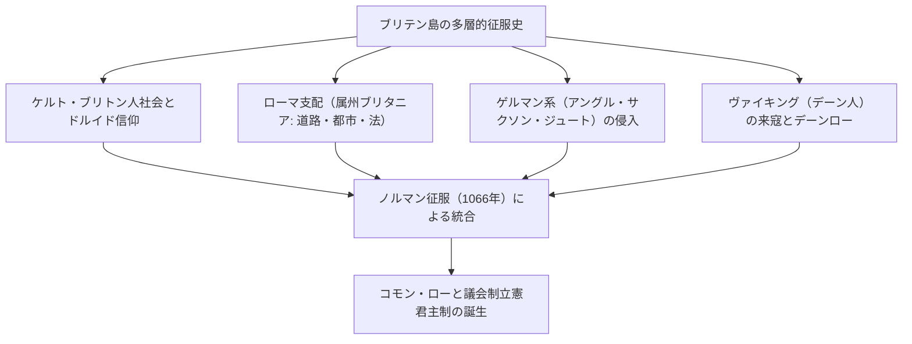
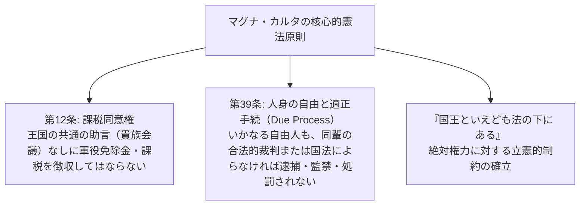
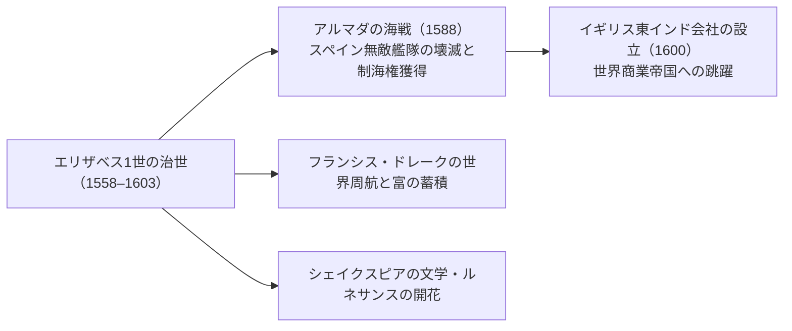
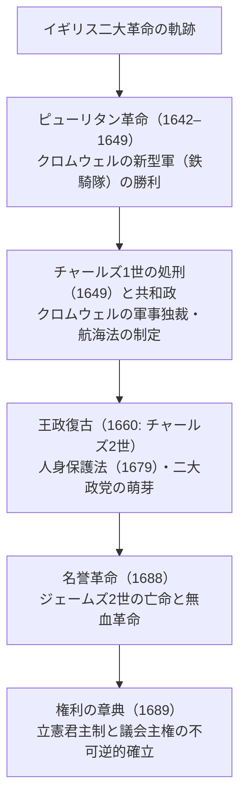
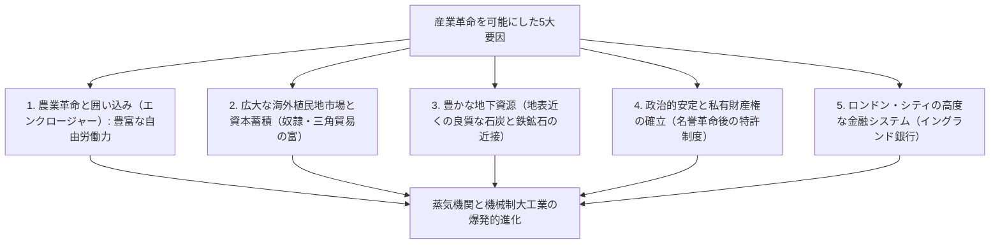
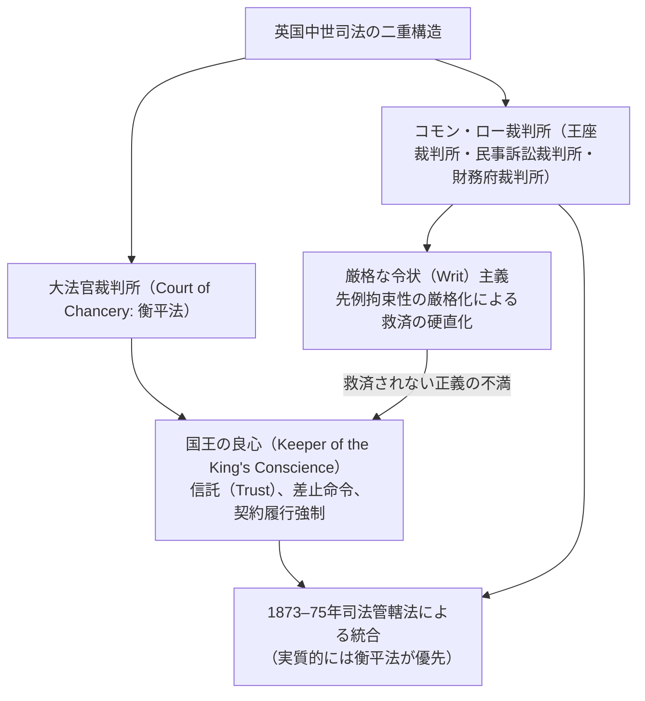
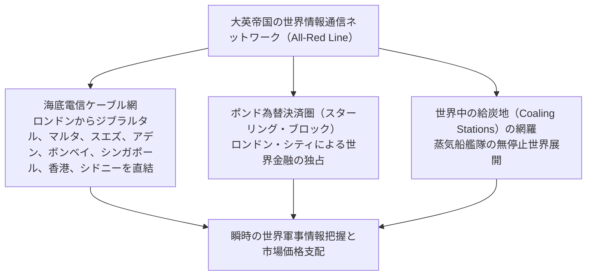
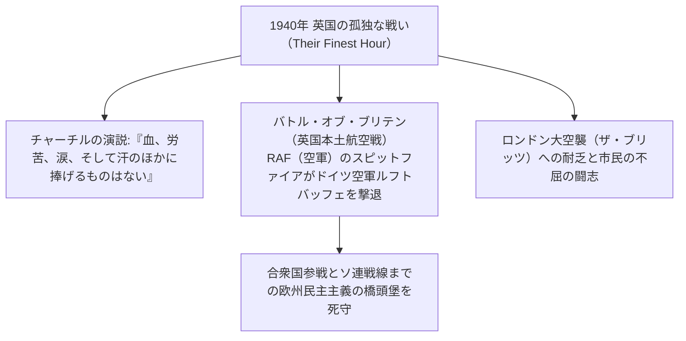
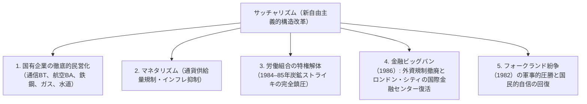

## 1. 序論：島国ブリテンの地政学と法秩序の精神

### 1.1 ケルトの巨石文明とローマ属州ブリタニア

ヨーロッパ大陸の北西海上に浮かぶグレートブリテン島は、太古より大陸からの波状的な民族移動と征服の歴史を繰り返してきた。紀元前3000年紀に建造されたソールズベリー平原の巨石記念物「ストーンヘンジ（Stonehenge）」は、文字を持たぬ先住民族の高度な天文学的知識と宗教的祈りの結晶である。

紀元前1千年紀、鉄器文明を携えたケルト系諸部族（ブリトン人）が定住し、豊かな農耕とドルイド僧による自然崇拝の儀礼を執り行っていた。紀元前55年および54年、ガイウス・ユリウス・カエサルによる二度の遠征を経て、西暦43年にローマ皇帝クラウディウスが本格的な侵略軍を送り込み、ブリテン島南半部はローマ帝国の属州「ブリタニア（Britannia）」となった。

ローマ支配は4世紀に及んだ。ロンドンの前身であるロンディニウム（Londinium）をはじめとする計画都市が建設され、堅固なローマ街道網（ワトリング・ストリート等）が島を縦断し、鉱山開発や公衆浴場、ラテン語とキリスト教がもたらされた。北方ピクト人（カレドニア）の侵入を防ぐためにハドリアヌス皇帝が築かせた「ハドリアヌスの長城（Hadrian's Wall）」は、帝国の最北端の防衛線として今なお威容を誇っている。西暦410年、西ゴート族のローマ略奪に直面したホノリウス皇帝はブリタニアからの全軍撤退を命じ、島は再び激動の暗黒時代へと放り出された。

---

### 1.2 アングロ・サクソンの侵入と七王国、アルフレッド大王の奇跡

ローマ軍の去ったブリテン島に、北海を渡ってゲルマン系の3部族――アングル人、サクソン人、ジュート人――が怒涛の勢いで侵入を開始した（5世紀半ば）。在来のケルト・ブリトン人は西方のウェールズ、コーンウォール、北方のスコットランド山岳地帯へと追いやられた（このケルト人の抵抗伝承が、後に中世騎士道文学の傑作「アーサー王伝説」へと昇華した）。

島を制圧した侵入者たちは、各地に小国家を乱立させ、やがて**「七王国（ヘプターキー: Heptarchy）」**――ノーサンブリア、マーシア、イースト・アングリア、エセックス、サセックス、ウェセックス、ケント――の分立抗争時代へと突入した。6世紀末にはローマ教皇グレゴリウス1世が派遣した使節アウグスティヌス（初代カンタベリー大司教）により、イングランドのキリスト教化が急速に進行した。

8世紀末、北欧からスカンディナヴィアの略奪者「ヴァイキング（デーン人）」が来寇した。修道院を焼き討ちし、イングランドの東半分を制圧したデーン人に対し、唯一生き残った南西部のウェセックス王国から立ち上がったのが**アルフレッド大王（Alfred the Great, 在位871–899）** である。
- エディントンの戦い（878年）でデーン軍を撃破し、ウェドモア条約を結んでイングランドを二分（デーン人の居住区「デーンロー」の設定）。
- 統治体制を固めるため、防衛要塞都市（バーグ: Burgh）を全土に配置し、海軍を創設。
- 法典を編纂し、聖職者だけでなく平民の教育のためにラテン語古典を古英語に翻訳させ、『アングロ・サクソン年代記』の編纂を開始した。
- イギリス史上、唯一「大王（The Great）」の尊称を冠されるアルフレッドの治世において、「アングル人の地＝イングランド（England）」という統一国家の萌芽が誕生したのである。

---

## 2. ノルマン征服（1066年）とマグナ・カルタの法理

### 2.1 運命の1066年：ヘイスティングズの戦いとノルマン朝の成立

1066年、イングランド王エドワード懺悔王の死によって王位継承危機が勃発した。賢人会議（ウィタナゲモート）によって推戴されたハロルド2世に対し、ドーバー海峡の向こう側からフランスの有力諸侯ノルマンディー公ギヨーム（ウィリアム）が「正統な王位継承権」を主張して侵略軍を進発させた。

1066年10月14日、**「ヘイスティングズの戦い（Battle of Hastings）」**。
イングランド歩兵の盾の壁（シールド・ウォール）に対し、ノルマン軍の重装騎兵と弓兵部隊が猛攻を仕掛けた。夕刻、ハロルド2世が眼に矢を受けて戦死するとイングランド軍は潰走し、ウィリアムはウェストミンスター寺院でイングランド国王ウィリアム1世（征服王: William the Conqueror）として戴冠した。

この**「ノルマン征服（Norman Conquest）」** は、イギリス史における最大の分水嶺である。
1. **地政学の激変**: これまでスカンディナヴィア（北欧世界）に向いていたイングランドの視軸が、一挙にフランスをはじめとする西欧ラテン大陸世界へと直結された。
2. **言語と文化の二重構造**: 支配階層（貴族・宮廷・裁判所）はフランス語（アングロ＝ノルマン語）を話し、被支配階層（農民・庶民）は古英語（ゲルマン系）を話すという階層分化が生じた。これが数百年をかけて融合し、語彙が爆発的に豊かになった現代の「英語」が誕生した。
3. **ドゥームズデイ・ブック（Domesday Book, 1086年）**: ウィリアム1世は全土の土地台帳調査を命じ、農地、森林、家畜、水車、農民の数に至るまでを徹底的に網羅した記録簿（最後の審判の書）を作成した。これにより、ヨーロッパ大陸よりも遥かに強力で精密な集権的封建統治が確立された。

---

### 2.2 ヘンリー2世の司法改革とコモン・ロー（普通法）の誕生

12世紀半ば、アンジュー伯アンリがプランタジネット朝の初代ヘンリー2世（在位1154–1189）として即位した。フランスの半分（アンジュー帝国）をも領有したこの偉大な君主は、イングランドの法制度に革命をもたらした。

ヘンリー2世は、地方ごとにバラバラであった領主裁判所や慣習法を打破するため、国王の直属の裁判官を全土に派遣する**「巡回裁判所（Assize Courts）」** を制度化した。
- 国王裁判官たちは、地方の優れた慣習や判例を精査・統合し、**「全王国に共通して適用される唯一の法体系（Common Law: コモン・ロー / 普通法）」** を創り上げた。
- 事件の事実認定に地域の良識ある市民の証言を用いる**「陪審制（Jury System）」** の基礎を確立した。
- 制定法（国会が作った成文法）ではなく、裁判官が下した過去の判例の積み重ねによって法が発展していく「判例法主義（Stare Decisis）」の伝統が、ここに決定的に根づいたのである。

---

### 2.3 マグナ・カルタ（大憲章、1215年）：「法の支配」の誕生

ヘンリー2世の息子、悪名高き「失地王」ジョン（John Lackland, 在位1199–1216）は、フランス王フィリップ2世との戦争に連敗して大陸領土の大半を喪失し、教皇インノケンティウス3世と対立して破門された。軍費調達のために貴族たちに法外な軍役免除金を課し、強権的な略奪的統治を行ったジョンに対し、激怒した領主貴族（バロン）たちはロンドンを占拠して武装蜂起した。

1215年6月15日、ウィンザー近郊のラニーミード草地において、貴族たちはジョン王に羊皮紙の文書への署名（玉璽の捺印）を強制した。これこそが**「マグナ・カルタ（Magna Carta: 大憲章）」** である。

マグナ・カルタの本質は、貴族の特権擁護という中世封建的文書の枠組みを超えて、**「最高権力者である国王であっても、勝手に法を曲げることはできず、法に従わなければならない」という『法の支配（Rule of Law）』の普遍的原理** を打ち立てた点にある。特に第39条の「法の適正な手続（Due Process of Law）」の条文は、後に17世紀のイギリス革命、そしてアメリカ合衆国憲法の権利章典へと直結する人権思想の母胎となった。

1295年、エドワード1世は貴族・高位聖職者だけでなく、各州の騎士代表2名、各都市の市民代表2名を招集した**「模範議会（Model Parliament）」** を開催し、ここに現代に至る英国議会（貴族院と庶民院）の二院制の雛形が確立された。

---

## 3. 百年戦争・バラ戦争とチューダー朝の絶対王政

### 3.1 百年戦争（1337–1453）とペスト、農奴制の崩壊

フランス王位継承権と毛織物産地フランドルの支配権をめぐり、イングランドとフランスの間で116年間に及ぶ断続的な「百年戦争」が勃発した。
- エドワード3世、エドワード黒太子、ヘンリー5世らイングランド軍は、ウェールズ由来の「長弓隊（Longbow）」を駆使し、クレシーの戦い（1346年）やアザンクールの戦い（1415年）でフランスの重装騎士軍を壊滅させ、中世騎士道の終焉を告げた。
- しかしジャンヌ・ダルクの登場によってフランス軍が反撃に転じ、1453年にカレーを除く全大陸領土を喪失してイングランドは島国へと撤退した。この戦争を通じて、支配階層は自らを「フランス貴族」ではなく「イングランド人」と自覚するようになり、国民的アイデンティティが形成された。

同時期の1348年、黒死病（ペスト）のパンデミックが全土を襲い、人口の3分の1から半分が死滅した。
- 労働力人口の激減により、生き残った農民の社会的地位と賃金交渉力が急上昇した。
- 領主層が賃金を強制抑制しようとしたことに対し、1381年に**「ワット・タイラーの乱」** が勃発。「アダムが耕しイブが紡いだとき、誰が領主（貴族）であったか」という平等思想が叫ばれ、イングランドの農奴制（荘園制）はヨーロッパ大陸に先駆けて急速に解体へと向かった。

---

### 3.2 バラ戦争とチューダー朝の幕開け

百年戦争の敗北後、イングランド国内は王位継承をめぐる血塗られた内乱へと突入した。ランカスター家（赤薔薇）とヨーク家（白薔薇）が30年間にわたり激突した**「バラ戦争（Wars of the Roses, 1455–1485）」** である。
この内乱で旧来の大貴族層の大部分が戦死または処刑によって共倒れとなり、封建的勢力は壊滅した。

1485年、ボズワースの戦いでヨーク家のリチャード3世を討ち取ったヘンリー・チューダーが、ヘンリー7世として即位し**「チューダー朝」** を創始した。大貴族を抑え込むため「星室庁裁判所」を設置し、地方の有力郷士層（ジェントリ）を治安判事（JP）として登用することで、中央集権的な近代官僚統治の礎を築いた。

---

### 3.3 ヘンリー8世の宗教改革とエリザベス1世の黄金時代

チューダー朝を決定づけたのが、ヘンリー8世（在位1509–1547）による宗教改革である。
王妃キャサリン・オブ・アラゴンとの離婚とアン・ブーリンとの再婚をローマ教皇クレメンス7世が拒絶したことを機に、ヘンリー8世はローマ・カトリック教会と決別した。
- **1534年：首長令（国王至上法）**: 国王がイングランド国教会（Church of England / アングリカン・チャーチ）の地上における唯一最高の首長であることを宣言。
- 全国のカトリック修道院を解散・没収し、その広大な寺院領地をジェントリや都市ブルジョワジーに売却した。これにより、王政を支持する新興の富裕有産階級が大量に形成された。

メアリー1世（血のメアリー）による反動的プロテスタント虐殺を経て即位したのが、ヘンリー8世の娘**エリザベス1世（在位1558–1603）** である。「礼拝統一法」によって国教会の教義を中庸（Via Media: 形式はカトリック的、教義はプロテスタント的）に定着させた。

1588年、カトリックの大国スペイン国王フェリペ2世が派遣した「無敵艦隊（アルマダ）」を、ドレーク副司令官らの巧みな火船戦術と悪天候によって壊滅させた。1600年には「イギリス東インド会社」を設立し、香辛料と綿織物を求めてアジアへの進出を開始。シェイクスピアの劇詩がロンドンのグローブ座を沸かせ、イングランドは海洋覇権国家への第一歩を踏み出した。

---

---

## 3.6 「羊が人間を食い尽くす」：囲い込みとエリザベス救貧法の社会史

16世紀チューダー朝の経済社会を激変させたのが、毛織物工業の爆発的需要を背景とする「第1次囲い込み（エンクロージャー）」である。

### ① トマス・モア『ユートピア』（1516年）の告発
大地主や貴族たちは、農民が耕作していた開放耕地や共有地（コモン）から農民を暴力的に追い出し、生垣（ヘッジ）で囲い込んで利益率の高い羊の放牧地へと転換した。
大法官を務めた人文主義者トマス・モアは、名著『ユートピア』の中でこの過酷な資本主義の初期蓄積を激しく弾劾した。

> **「かつておとなしく、わずかな餌で満足していた羊が、今や狂暴かつ貪欲になり、人間そのものを食い尽くし、田畑や家屋、都市を荒廃させている。」**

土地を奪われ、農村を追われた農民たちは流浪民（バガボンド）や浮浪者となってロンドンなどの都市へ流入し、盗みを働いて絞首刑に処された。

### ② エリザベス救貧法（1601年）の歴史的画期
増大する困窮者と社会不安に対処するため、1601年に制定されたのが**「エリザベス救貧法（Poor Law of 1601）」**である。
- 教区（パリッシュ）を単位として救貧税（Poor Rate）を徴収。
- 貧民を「有能貧民（就労可能な者：労役場での強制労働）」「無能貧民（孤児、老人、病者、障害者：救貧院での保護給付）」「怠惰者（就労を拒否する者：矯正院への収容処罰）」の3類型に厳格に分類。
- 貧困の救済を「キリスト教的慈善」から「国家の法的責任」へと移行させたこの制度は、世界初の公的扶助制度であり、後の20世紀ベヴァリッジ報告書に至る英国福祉国家の遠い源流となったのである。

## 4. イギリス革命と立憲君主制の誕生

### 4.1 スチュアート朝の専制と清教徒革命（1642–1649）

エリザベス1世が生涯独身（処女女王）を貫いて世を去ると、スコットランド国王ジェームズ6世がイングランド国王ジェームズ1世（スチュアート朝）として迎えられた。

しかし、ジェームズ1世および息子のチャールズ1世は、大陸風の**「王権神授説」** を奉じ、議会を無視した恣意的な課税（船舶税等）やピューリタン（清教徒）への弾圧を強行した。これに対し、法学者エドワード・コーク卿は「国王といえども神と法の下にある（ブラクトンの言葉）」と直言し、1628年に議会は**「権利の請願（Petition of Right）」** を提出して不当逮捕の禁止と議会の課税同意権を再確認させた。

チャールズ1世が議会を11年間にわたって停止した末、戦費調達のために議会を再招集すると、国王派と議会派の対立はついに内戦へと発展した（**ピューリタン革命 / 清教徒革命**）。

オリバー・クロムウェル率いる熱狂的なピューリタン独立派の新型軍（New Model Army）が国王軍を撃破。1649年1月30日、**国王チャールズ1世を「暴君、反逆者、殺人者、公の敵」として法廷で裁き、公開処刑（ギロチン以前の斬首）に処す** という、全ヨーロッパを震撼させる大事件を断行した。

王政は廃止され、英国史上唯一の共和政（コモンウェルス）が成立したが、護国卿となったクロムウェルの厳格な禁欲的軍事独裁政治は国民の反発を招き、彼の死後の1660年、議会はチャールズ2世を迎えて「王政復古」を果たした。

---

### 4.2 名誉革命（1688年）と「権利の章典」

復古した王政において、チャールズ2世と続くジェームズ2世が再びカトリック復活と専制政治を企てると、議会内の二大勢力――国王擁護派の「トーリー党」と議会重視派の「ホイッグ党」――が結束してクーデターを画策した。

1688年、議会はジェームズ2世のプロテスタントの娘メアリーとその夫であるオランダ総督ウィリアム3世（オレンジ公ウィレム）を招聘した。ウィリアムが大軍を率いて上陸すると、孤立無援となったジェームズ2世はフランスへと亡命。一滴の血も流されずに権力移行が達成されたため、これを**「名誉革命（Glorious Revolution）」** と呼ぶ。

1689年、新国王は議会が提出した**「権利の宣言」を承認し、「権利の章典（Bill of Rights）」** として法制化した。
- 議会の同意なき法の停止・課税の絶対禁止。
- 議会内における言論の自由の完全保障。
- 平常時における常備軍維持の禁止。
- 議会の定期的な招集。

ここに、世界で初めて**「国王は君臨すれども統治せず」という立憲君主制（Constitutional Monarchy）と議会主権（Parliamentary Sovereignty）** が完成した。

1707年、アン女王の下で「合同法」が成立し、イングランドとスコットランドが正式に合邦して**「グレートブリテン王国（Kingdom of Great Britain）」** が誕生した。1714年にハノーヴァー朝のジョージ1世（ドイツ語しか話せなかった）が即位すると、ロバート・ウォルポール首相の下で「内閣が議会に対して責任を負う」という**責任内閣制（Cabinet System）** が確立され、現代の議会制民主主義の骨格がすべて出揃ったのである。

---

## 5. 産業革命と「パクス・ブリタニカ（大英帝国）」の世紀

### 5.1 世界の工場への飛躍：第一次産業革命の力学

18世紀後半、なぜイギリスにおいて人類史上最初の「産業革命（Industrial Revolution）」が起きたのか？ そこには、世界で唯一イギリスにのみ揃っていた歴史的諸条件が存在した。

- **綿織物工業の技術革新**: ジョン・ケイの「飛び杼」、ハーグリーヴスの「ジェニー紡績機」、アークライトの「水力紡績機」、クロンプトンの「ミュール紡績機」、カートライトの「力織機」。
- **動力革命**: ジェームズ・ワットによる復動式蒸気機関の改良（1769年）。生産の拠点は河川沿いから、石炭産地に建設された巨大工場都市（マンチェスター、バーミンガム）へと移動した。
- **交通革命**: ジョージ・スティーブンソンの蒸気機関車（ロケット号、1829年）。リバプール・アンド・マンチェスター鉄道の開通を皮切りに、全土に鉄道網が張り巡らされ、物流コストが劇的に低下した。

1851年、ロンドンのハイドパークで開催された世界最初の「ロンドン万国博覧会」。鉄とガラスで作られた巨大な「水晶宮（クリスタル・パレス）」には、世界中から600万人が訪れ、イギリスは名実ともに**「世界の工場（Workshop of the World）」** としての圧倒的工業力を見せつけた。

---

### 5.2 大英帝国（British Empire）の世界的膨張

19世紀（ヴィクトリア朝：1837–1901）、イギリス海軍（ロイヤルネイビー）の圧倒的な制海権に守られ、世界中に自由貿易網を張り巡らせた超覇権の時代――**「パクス・ブリタニカ（Pax Britannica: イギリスの平和）」** が訪れた。

「太陽の沈まぬ帝国」と呼ばれた大英帝国の版図は、地球上の全陸地の4分の1、全人類の4分の1を支配下に収めた。

| 地域 | 植民地・支配地域 | 支配の性格と歴史的出来事 |
| :--- | :--- | :--- |
| **南アジア** | **インド（帝国の冠の宝石）** | 東インド会社のプラッシーの戦い（1757）以来の支配。1857年のセポイの乱（インド大反乱）を鎮圧後、東インド会社を解散してイギリス国王が直接統治。1877年にヴィクトリア女王が「インド皇帝」に即位。 |
| **東アジア** | **中国（清朝）・香港** | アヘン密貿易から1840年アヘン戦争。南京条約（1842）により香港を割譲、上海等を開港させ不平等条約体制を構築。 |
| **アフリカ** | **エジプトから南アフリカ** | ディズレーリ首相によるスエズ運河株買収（1875）。セシル・ローズが推進したカイロからケープタウンを結ぶ「アフリカ縦断政策（3C政策：カイロ、カルカッタ、ケープタウン）」。ボーア戦争（南アフリカ戦争）。 |
| **自治領（ドミニオン）** | **カナダ、オーストラリア、ニュージーランド** | 白人系入植地に対し、早い段階で責任政府（内政自治権）を付与し、後の英連邦（コモンウェルス）の母胎を形成。 |

国内では、保守党のベンジャミン・ディズレーリ（帝国主義外交と社会改良）と、自由党のウィリアム・グラッドストン（財政健全化、自由貿易、アイルランド自治問題）による二大政党政治が成熟した。1832年、1867年、1884年の三度にわたる選挙法改正を経て、労働者階級へと選挙権が順次拡大され、普通選挙制へと漸進的に民主化が進展した。

---

---

## 2.4 コモン・ローと衡平法（エクイティ）の二重体系、令状制度の法理

イギリス法が大陸法（ローマ法体系）と決定的に異なる最大の特徴は、**「コモン・ロー（Common Law: 普通法）」**と**「衡平法（Equity: エクイティ）」**という二重の司法裁判制度の相互作用によって進化してきた点にある。

### ① 令状制度（System of Writs）の硬直化
12世紀から13世紀にかけてコモン・ローが形成された当初、原告が国王裁判所で訴訟を提起するためには、王室文書課（Chancery）から事案に応じた特定の「国王令状（Writ: 権利回復令状、不法行為令状など）」を購入しなければならなかった。
しかし、貴族たちが国王裁判所の権限拡大を警戒したため、1258年の「オックスフォード条項」によって「新しい形式の令状を勝手に作成すること」が禁止された。これにより、既存の令状の類型にぴったり当てはまらない新しい形態の不法行為や契約違反に対して、コモン・ロー裁判所は一切の救済を与えられないという「法の硬直化（Formalism）」に陥った。

### ② 大法官裁判所と「信託（Trust）」の誕生
コモン・ローの形式主義によって敗訴した、あるいは救済を受けられなかった市民たちは、正義と慈悲の最後の源泉である国王に対して「嘆願書（Petition）」を提出した。国王はこの審査を、最高位の聖職者であり「国王の良心の保持者」であった**大法官（Lord Chancellor）**に委ねた。
- 大法官は、厳格な令状の文言にとらわれず、自然正義と良心（Conscience）に基づいて柔軟な救済を与えた。これが**「衡平法（Equity）」**である。
- コモン・ローが損害賠償（金銭補償）しか命じられなかったのに対し、衡平法は「契約通りの履行を強制する命令（Specific Performance）」や「侵害行為の中止を命じる差止命令（Injunction）」を下すことができた。
- 十字軍遠征に向かう騎士が自らの領地の管理を友人に委託したことから生まれた**「信託（Use / Trust: 受託者に形式的権利を移転し、受益者に実質的利益を享受させる法理）」**は、衡平法が生み出した世界法制史上最高の知的発明であった。

---

## 3.4 ケルト辺境の征服と従属：スコットランドとアイルランドの苦難

イングランドの覇権拡大は、周囲のケルト系隣接国家に対する容赦ない軍事的侵略と植民地化の歴史でもあった。

### ① スコットランド独立戦争：ウォレスとブルース
13世紀末、「スコットランドの槌（Hammer of the Scots）」の異名をとったイングランド王エドワード1世は、スコットランド王位継承の混乱に乗じて侵略し、スコットランド王の戴冠式の聖石「運命の石（スクーンの石）」をロンドンへと略奪した。
- 1297年：郷士ウィリアム・ウォレス（映画『ブレイブハート』の英雄）が農民を率いて蜂起し、スターリング・ブリッジの戦いでイングランド重装騎兵を撃破。
- 1314年：ロバート・ブルース（スコットランド王ロバート1世）が**バノックバーンの戦い**において、数倍のイングランド大軍を槍衾（シルトロン方陣）で包囲・撃破し、1328年のエディンバラ＝ノーサンプトン条約によってスコットランドの完全独立を勝ち取った。

### ② クロムウェルのアイルランド侵略とジャガイモ飢饉
一方、アイルランドの運命は遥かに悲劇的であった。
- 1649年：ピューリタン革命の勝利後、オリバー・クロムウェルは大軍を率いてアイルランドへ侵略した。ドロヘダやウェックスフォードにおいて守備隊や聖職者、市民を容赦なく虐殺。先住のカトリック系アイルランド人の肥沃な農地をすべて没収し、プロテスタント系イギリス人（アルスター植民）に分配した。アイルランド人は自らの故郷で小作農へと転落した。
- **1845–1852年：アイルランド大飢饉（Great Famine）**: 主食であったジャガイモに疫病（疫病菌）が蔓延し、農作物が全滅した。
  - 当時、イギリス本国政府は自由放任主義（レッセフェール）の教条に囚われ、アイルランドから穀物がイングランドへ輸出され続けるのを放置した。
  - 約100万人が餓死・病死し、さらに100万人以上が飢餓を逃れてアメリカ合衆国へと移民船（棺桶船）で脱出した（これが後のケネディ家をはじめとする米国の巨大なアイリッシュ・コミュニティの起源となる）。アイルランドの人口は半分近くに激減し、イギリスに対する拭い去れない憎悪の記憶として現在に至っている。

---

## 5.5 地政学的インフラと情報覇権：海底ケーブルとグレート・ゲーム

19世紀の大英帝国の覇権（パクス・ブリタニカ）を支えたのは、海軍の戦艦（ガンボート）だけではなかった。それは、世界に先駆けて張り巡らされた**「世界最初のグローバル情報通信インフラ」**であった。

- **オール・レッド・ライン（All-Red Line）**: イギリスは海底電信ケーブル技術（グッタペルカ樹脂による絶縁被覆）を独占し、世界中の英領植民地（地図上で伝統的に赤色で塗られていた）を自国の海底ケーブルだけで完全に包囲・直結した。他国の領土を経由しないため、戦時においても敵国に通信を傍受・切断されることがなかった。
- **グレート・ゲーム（The Great Game）**: 19世紀中盤から20世紀初頭にかけて、中央アジア（アフガニスタン、ペルシャ、チベット）の支配を巡り、南下政策を採るロシア帝国とイギリス東インド会社・英印帝国が繰り広げた壮大な秘密情報戦。ラドヤード・キップリングの小説『キム』の舞台となったこの闘争は、現代の地政学（ハートランド理論）の母胎となった。

## 6. 二つの世界大戦と帝国の黄昏

### 6.1 第一次世界大戦と国力の疲弊

20世紀初頭、急速に工業化と軍備拡張（大海軍建設）を進めるドイツ帝国との対立から、イギリスは長年の「栄光ある孤立（Splendid Isolation）」を放棄し、日英同盟（1902年）、英仏協商（1904年）、英露協商（1907年）を結んで三国協商体制を築いた。

1914年、第一次世界大戦が勃発。
- フランス北部の西部戦線（ソンムの戦い、パッシェンデールの戦い）において、機関銃と毒ガス、砲撃の嵐の中、何十万もの若者（ジェネレーション・ロスト）が戦死した。
- 海上封鎖とユトランド沖海戦でドイツ海軍を封じ込めたものの、戦費の調達により、イギリスは世界最大の「債権国」からアメリカ合衆国に対する「債務国」へと転落した。

戦後の1920年代、自由党に代わって「労働党」が台頭し、マクドナルド労働党内閣が誕生。1928年には21歳以上の男女平等の普通選挙が達成された。しかし、アイルランドでは1916年のイースター蜂起を経て英愛戦争が勃発し、1922年に「アイルランド自由国」が独立（北アイルランド6州のみ英領に残留）した。

---

### 6.2 第二次世界大戦とチャーチルの孤独な抵抗

1930年代、世界恐慌の余波の中でナチス・ドイツが台頭した際、チェンバレン首相はミュンヘン協定（1938年）に代表される「宥和政策（Appeasement Policy）」を採り、戦争回避を図ったが、ヒトラーの野望を止めることは破綻した。

1939年9月、ドイツのポーランド侵攻により第二次世界大戦が勃発。1940年5月、フランスが電撃戦で降伏し、西欧全土がナチスの手に落ちた暗黒の瞬間、首相に就任したのが**ウィンストン・チャーチル（Winston Churchill）** であった。

チャーチルのラジオ演説は国民の魂を鼓舞し、イギリス空軍（RAF）の若きパイロットたちはレーダー網を駆使してドイツ空軍の爆撃を阻止した（「人類の歴史において、これほど少数の人々に、これほど多数の人々が、これほど大きな恩義を負ったことはない」）。
合衆国の参戦とエル・アラメインの戦い（1942年）の勝利を経て連合国は勝利したが、大戦によるイギリス本土の空爆被害と国力の消耗は壊滅的であった。

---

### 6.3 「ゆりかごから墓場まで」と大英帝国の解体

1945年夏の総選挙において、戦争の英雄チャーチル率いる保守党は惨敗し、クレメント・アトリー率いる労働党が圧勝した。国民が求めたのは、大英帝国の栄光ではなく、戦後の復興と生活の安定であった。

- **福祉国家の建設**: ウィリアム・ベヴァリッジの報告書に基づき、**「ゆりかごから墓場まで（From the cradle to the grave）」** をスローガンとする社会保障制度が確立された。1948年には、すべての市民が無償で医療を受けられる**国民保健サービス（NHS: National Health Service）** が創設され、炭鉱、鉄道、電力、鉄鋼などの基幹産業が国有化された。
- **帝国の解体（脱植民地化）**:
  - 1947年：ガンディーの非暴力不服従運動を経て、「インドとパキスタン」が分離独立。
  - 1956年の**スエズ危機（第二次中東戦争）**: エジプトのナセル大統領によるスエズ運河国有化に対し、イギリスとフランスが軍事介入したが、米ソ両超大国の猛反発を受けて無条件撤退に追い込まれた。この事件は、イギリスがもはや世界を牛耳る「超大国」ではなく、二等国へと転落した冷酷な事実を世界に白日の下に晒した。

---

## 7. サッチャリズムから「第三の道」、そしてブレグジット

### 7.1 「英国病」の泥沼とサッチャー革命

1970年代、手厚い社会保障と強力すぎる労働組合のストライキ、国有企業の非効率性は、慢性的な高インフレと低成長が共存するスタグフレーション――通称**「英国病（British Disease）」** をもたらした。1978年から1979年にかけての冬、公務員やゴミ収集員、墓掘り人に至るまで全国で無期限ストライキが決行され、都市機能が麻痺した（「不満の冬」）。

この絶望の中から、1979年に英国史上初の女性首相として登場したのが**マーガレット・サッチャー（Margaret Thatcher: 鉄の女）** である。

サッチャーの劇薬療法は、北部の製造業や炭鉱の荒廃、失業率の上昇、貧富の格差拡大という激しい痛みを伴ったが、英国経済の競争力を劇的に回復させ、ロンドンをニューヨークと並ぶ世界最強の金融ハブへと再生させた。

---

### 7.2 トニー・ブレアと「第三の道」

1997年、18年ぶりの政権奪還を果たした労働党のトニー・ブレア（Tony Blair）首相は、伝統的な社会主義的国有化政策を放棄し、サッチャーの自由市場経済の活力を肯定しつつ、教育や医療（NHS）への手厚い公共投資を両立させる**「第三の道（The Third Way）」** を提唱した。

- スコットランド議会およびウェールズ議会の創設（権限委譲: デボリューション）。
- 長年続いた北アイルランド紛争（IRA暫定派によるテロ抗争）を終結させた1998年の歴史的**「聖金曜日合意（ベルファスト合意）」**。
- しかし、2003年のイラク戦争においてブッシュ米大統領を盲従して参戦したことは、「プードル」と揶揄され、ブレア政権の道徳的正統性に致命的な打撃を与えた。

---

### 7.3 ブレグジット（EU離脱）の激震と21世紀のイギリス

イギリスは1973年にヨーロッパ共同体（EC）に加盟して以来、常にブリュッセル（EU本部）の超国家的な官僚統合に対して深い懐疑を抱き続けていた（単一通貨ユーロへの不参加、シェンゲン協定への不参加）。

2010年代、中東や東欧からの大量の移民流入に対する反発と、「自国の主権、国境管理、法を取り戻せ（Take Back Control）」という声が高まった。
2016年6月23日、デービッド・キャメロン首相が実施した国民投票において、大方の予想を覆し、**離脱派が $51.9\%$ の得票率で勝利した（Brexit: ブレグジット）**。

2020年1月31日、イギリスは正式にEUを離脱した。
しかし、EUという世界最大の単一市場から離脱したことによる貿易摩擦、人手不足、インフレ、そしてスコットランドの再度の独立運動や北アイルランド議定書をめぐる摩擦など、現代のイギリスは国家の解体リスクと新たな国際的位置づけを模索する苦難の道の中にいる。

---

---

## 5.6 労働運動の激動：ラッダイト運動からチャーティズムへ

産業革命の光の裏で、伝統的な職人や労働者たちは機械化による失業と極限の貧困に直面した。

### ① ラッダイト運動（Luddite Movement: 1811–1816）
イングランド北部の織物職人たちは、伝説的な指導者「ネッド・ラッド将軍」の名の下に秘密結社を結成し、自らの職を奪った蒸気力織機や紡績機械を夜陰に乗じてハンマーで打ち壊す暴動を展開した。政府は軍隊を投入して鎮圧し、機械破壊者を死刑に処す過酷な弾圧法を制定した。

### ② チャーティスト運動（Chartism: 1838–1848）
1832年の第1回選挙法改正が都市の富裕中産階級（ブルジョワジー）にのみ選挙権を与え、労働者階級を完全に置き去りにしたことに対し、労働者たちは人類史上初の大規模な組織的政治運動を展開した。
ウィリアム・ラベットらが起草した**「人民憲章（People's Charter）」**は、以下の**6大要求**を掲げた。

1. **男子普通選挙権の確立**（財産資格の撤廃）
2. **無記名秘密投票の導入**（地主や雇用主からの脅迫防止）
3. **下院議員の財産資格の廃止**（貧しい労働者でも立候補可能に）
4. **議員歳費（給与）の支給**（無給では有産階級しか議員になれない）
5. **平等選挙区制の実現**（人口比例配分）
6. **毎年行われる総選挙**（腐敗防止と民意の即応）

議会は当初、数百万人の署名を集めた請願書を3度にわたって冷笑的に否決した。しかし、19世紀後半から20世紀初頭にかけて、毎年総選挙を除く5つの要求はすべて法律として実現し、イギリス民主主義の不可欠の基礎となったのである。

---

## 7.5 王冠の近代化：ウィンザー朝の誕生からエリザベス2世の世紀へ

イギリス君主制が今日なお国民の圧倒的な敬愛を集める背景には、20世紀における巧妙かつ誠実な「生き残り戦略」が存在した。

### ① ウィンザー家（House of Windsor）への改称（1917年）
第一次世界大戦中、敵国ドイツに対する反感が高まる中、国王ジョージ5世は、先祖伝来のドイツ系家名「サクス＝コバーグ＝ゴータ家」を捨て、王室の居城にちなむ純英国風の**「ウィンザー家」**へと電撃改称した。ドイツ皇帝ヴィルヘルム2世の従兄弟であった国王は、自らの血統よりも国民感情との一体化を選択したのである。

### ② エドワード8世の「王冠を賭けた恋」（1936年）
離婚歴のあるアメリカ人女性ウォリス・シンプソン夫人との結婚を望んだエドワード8世は、国教会の首長として教義に反するというボールドウィン首相ら内閣の強い反対に直面した。国王は即位からわずか325日で退位を選択し、弟のジョージ6世（吃音症を克服し大戦を耐え抜いた映画『英国王のスピーチ』の主人公）へと王位を譲った。この危機を通じて、「王室であっても立憲内閣の助言に従わなければならない」という立憲君主制の限界線が再確認された。

### ③ エリザベス2世の70年の治世（1952–2022）
1952年、25歳で即位したエリザベス2世は、2022年に96歳で崩御するまで、英国史上最長の70年間にわたり君臨した（プラチナ・ジュビリー）。
大英帝国の解体と冷戦、脱工業化の苦悩、そして王室の私生活のスキャンダルに揺れながらも、終生「無私（Selflessness）」と「中立」を貫き、分裂する連合王国を精神的につなぎ止める不可欠の象徴（キーストーン）であり続けた。

## 8. 結論：連綿たる伝統と漸進的改革の叡智

イギリスという国家の歴史を貫く最大の特質は、**「成文憲法を持たない（不文憲法）にもかかわらず、世界で最も強靭で安定した法の支配と議会民主主義を維持し続けてきた」** という歴史の奇跡にある。

フランスのように流血の革命によって過去の制度をすべて破壊し、ゼロから新しい共和国を建設するのではなく、イギリス人は常に過去の慣習、判例、古くからの文書（マグナ・カルタや権利の章典）の中に正当性の根拠を求め、現実の必要に応じて少しずつ手を入れて改修していく**「漸進主義的改革（Incremental Reform）」** の道を歩んできた。

中世の国王の専制に対する貴族たちの抵抗から始まった自由の探求は、
- コモン・ローの裁判官たちによって市民の日常の権利へと鍛え上げられ、
- 議会の闘士たちによって主権の座へと引き上げられ、
- 産業革命の労働者たちによってすべての成人の投票権へと拡大され、
- そして戦後の福祉国家によって社会の最弱者を守るセーフティネットへと結実した。

かつての世界帝国から、大西洋とヨーロッパの狭間に揺れる一島国へとその装いを変えた今なお、イギリスが人類の文明史に刻んだ「法の支配」「議会制統治」「個人の尊厳」の灯火は、世界中の自由な社会を照らし続ける不滅の道標なのである。
