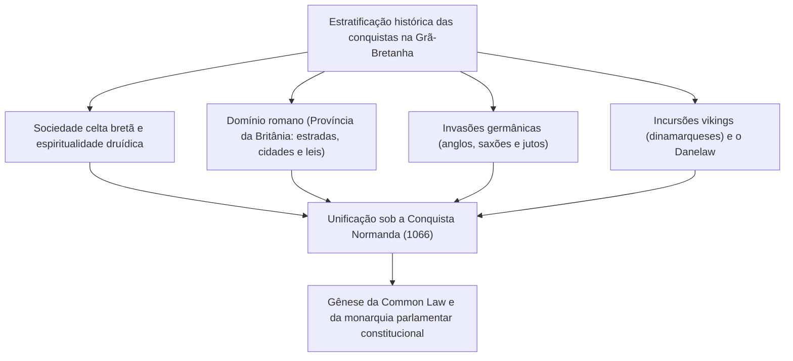
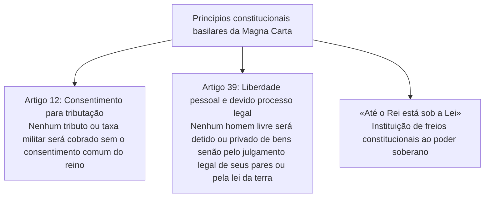
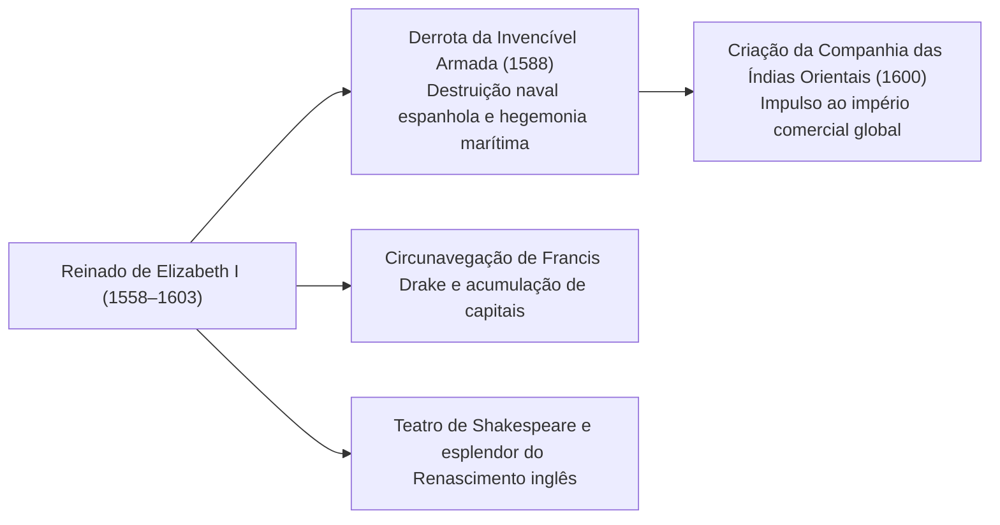
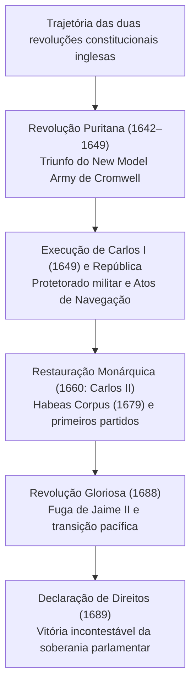
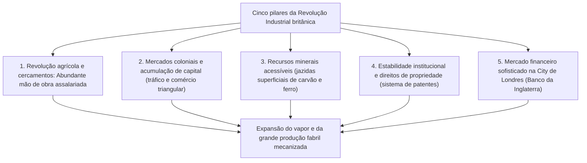
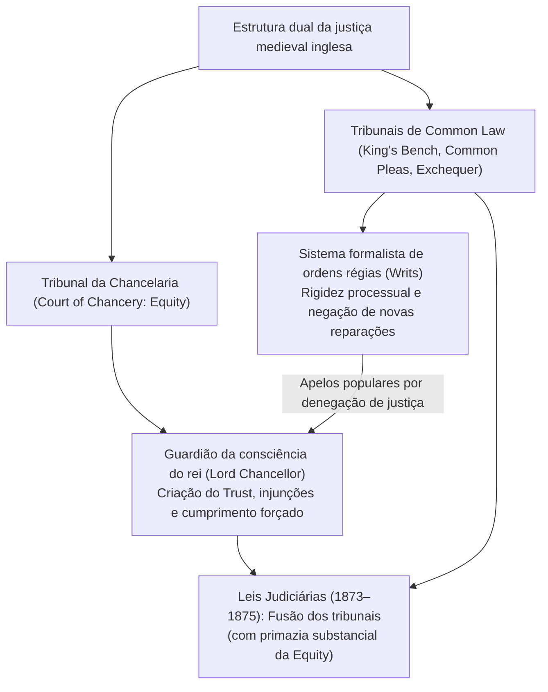
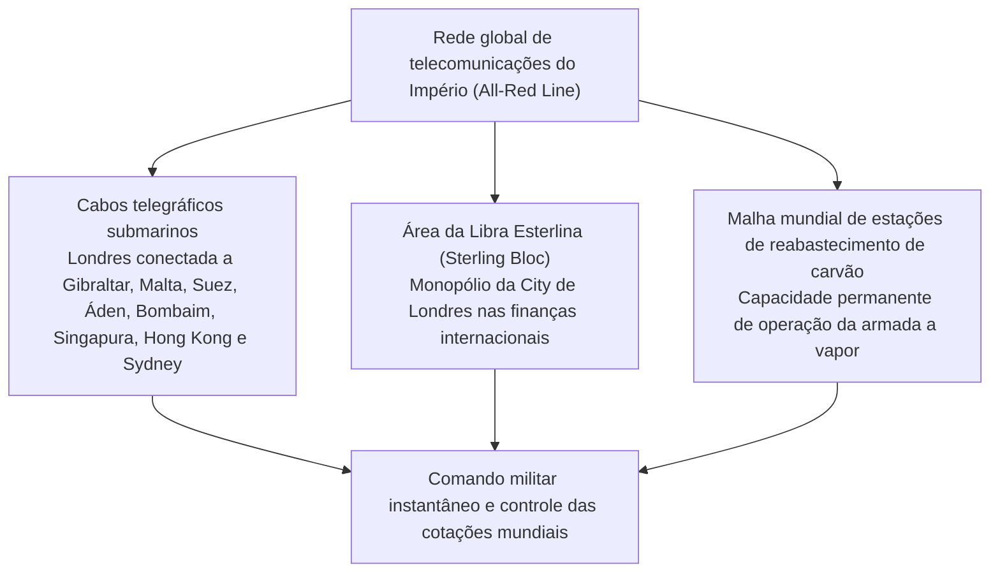
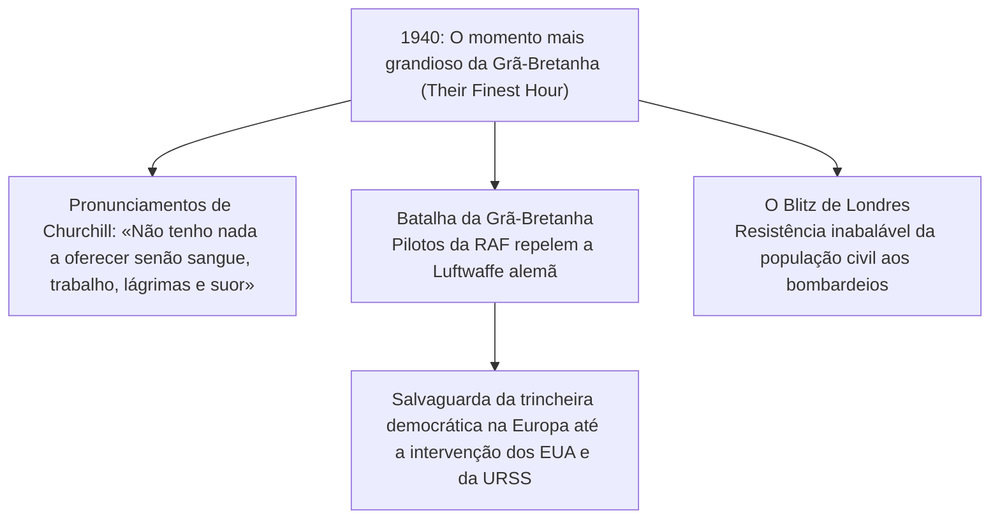
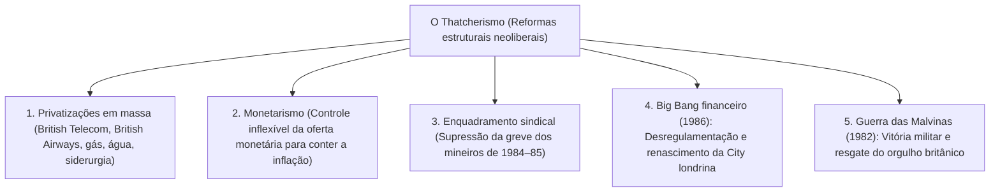

## 1. Introdução: Geopolítica insular e o espírito da ordem jurídica britânica

### 1.1 Civilização megalítica celta e a província romana da Britânia

Situada nas águas do noroeste da Europa continental, a ilha da Grã-Bretanha vivenciou desde tempos pré-históricos sucessivas ondas de migração e conquista. Erguido na planície de Salisbury durante o terceiro milênio a.C., o monumento megalítico de **Stonehenge** constitui um testemunho notável do avançado conhecimento astronômico e da profunda devoção religiosa de povos autóctones sem escrita.

No primeiro milênio a.C., tribos celtas detentoras da metalurgia do ferro (os bretões) fixaram-se na ilha, desenvolvendo uma próspera agricultura e realizando rituais de culto à natureza conduzidos pela classe sacerdotal dos druidas. Após duas expedições de reconhecimento lideradas por Caio Júlio César em 55 e 54 a.C., o imperador Cláudio ordenou uma invasão em larga escala em 43 d.C., transformando a porção meridional da ilha na província imperial romana da **Britânia (Britannia)**.

A dominação romana durou quase quatro séculos. Centros urbanos planejados foram fundados, com destaque para **Londinium** (origem da moderna Londres), interligados por uma densa malha de estradas pavimentadas (como a Watling Street). Os romanos introduziram a exploração mineral, os banhos públicos, a língua latina e o cristianismo. Para conter as incursões das tribos pictas da Caledônia (Escócia) ao norte, o imperador Adriano ordenou a edificação da imponente **Muralha de Adriano (Hadrian's Wall)**, fortificação setentrional do império que ainda hoje impressiona pela grandiosidade. Em 410 d.C., perante o saque iminente de Roma pelos visigodos, o imperador Honório determinou a retirada de todas as legiões romanas, lançando a ilha de volta a um turbulento período de trevas e fragmentação.

---

### 1.2 Invasões anglo-saxônicas, a Heptarquia e o milagre de Alfredo, o Grande

Com a partida das legiões romanas, três tribos germânicas vindas do Mar do Norte — os anglos, os saxões e os jutos — iniciaram uma vigorosa invasão em meados do século V. Os bretões celtas nativos foram gradualmente empurrados para os refúgios a oeste (País de Gales e Cornualha) e para as terras altas da Escócia ao norte (as narrativas dessa heroica resistência celta inspiraram mais tarde a lenda arturiana).

Os invasores estabeleceram múltiplos reinos pelo território, consolidando o período conhecido como a **«Heptarquia» (Sete Reinos)**: Nortúmbria, Mércia, Ânglia Oriental, Essex, Sussex, Wessex e Kent. No final do século VI, o papa Gregório I enviou uma missão liderada por Agostinho (primeiro arcebispo de Cantuária), que acelerou a cristianização da Inglaterra.

No final do século VIII, invasores vikings escandinavos (os dinamarqueses) assolaram o litoral britânico. Saqueando mosteiros e conquistando a metade oriental da Inglaterra, os invasores pareciam imparáveis. Diante dessa ameaça existencial, despontou do reino de Wessex a figura extraordinária de **Alfredo, o Grande (Alfred the Great, r. 871–899)**:
- Na **Batalha de Edington (878)**, derrotou decisivamente o exército dinamarquês e celebrou o Tratado de Wedmore, dividindo o território inglês e delimitando o «Danelaw» sob soberania dinamarquesa.
- Para proteger a nação, ergueu uma malha nacional de fortalezas urbanas defensivas (**burghs**) e estruturou as bases de uma marinha real permanente.
- Codificou leis e impulsionou a educação ao traduzir obras clássicas latinas para o inglês antigo, além de encomendar a compilação da *Crônica Anglo-Saxônica*.
- Único soberano na história inglesa a receber o epíteto oficial de «o Grande», o reinado de Alfredo lançou a semente do Estado nacional unificado: **«Engla-lond» (Terra dos Anglos, a Inglaterra)**.

---

## 2. A Conquista Normanda (1066) e a jurisprudência da Magna Carta

### 2.1 O fatídico ano de 1066: A Batalha de Hastings e a dinastia normanda

Em 1066, a morte sem herdeiros do rei Eduardo, o Confessor, abriu uma severa crise de sucessão. Enquanto o Witenagemot escolhia Haroldo Godwinson como Haroldo II, do outro lado do Canal da Mancha, Guilherme, duque da Normandia, reivindicou seus direitos legítimos ao trono e reuniu uma frota de invasão.

Em 14 de outubro de 1066, travou-se a célebre **Batalha de Hastings**.
A densa «parede de escudos» da infantaria saxônica suportou durante horas as investidas da cavalaria pesada e dos arqueiros normandos. Ao entardecer, Haroldo II foi atingido mortalmente no olho por uma flecha; as fileiras anglo-saxônicas ruíram e Guilherme foi coroado rei da Inglaterra na Abadia de Westminster no dia de Natal de 1066.

A **Conquista Normanda (Norman Conquest)** representa o divisor de águas mais marcante da história britânica:
1. **Transformação geopolítica radical**: A Inglaterra abandonou sua órbita escandinava setentrional e foi plenamente integrada ao universo feudal, latino e continental da França e da Europa ocidental.
2. **Dualismo linguístico e social**: A nobreza dominante e as cortes falavam o anglo-normando (francês antigo), enquanto os camponeses mantinham o inglês antigo germanófono. A fusão desses idiomas ao longo dos séculos originou o inglês moderno, detentor de um vocabulário exuberante.
3. **O Livro do Juízo Final (Domesday Book, 1086)**: Guilherme I determinou um minucioso levantamento de todas as terras, bosques, moinhos, rebanhos e habitantes do reino. Esse censo fiscal proporcionou uma estrutura feudal centralizada sem equivalente na Europa continental.

---

### 2.2 Reformas judiciais de Henrique II e o nascimento da Common Law

Em meados do século XII, Henrique de Anjou fundou a dinastia Plantageneta como **Henrique II (r. 1154–1189)**. Soberano do vasto Império Angevino — que se estendia da Escócia aos Pireneus —, remodelou integralmente as instituições judiciais inglesas.

Para superar a anarquia dos tribunais senhoriais locais e a pluralidade caótica de costumes, Henrique II formalizou o envio de juízes reais itinerantes por meio dos **Tribunais de Circuito (Assize Courts)**:
- Os magistrados régios recolheram e padronizaron os melhores costumes e precedentes locais, gerando um corpo jurídico único válido para todo o reino: a **Common Law (Direito Comum)**.
- Consolidou as bases do moderno **sistema de júri (Jury System)**, convocando cidadãos locais imparciais sob juramento para esclarecer a verdade dos fatos em litígio.
- Diferentemente dos sistemas codificados de tradição romana, firmou-se a doutrina do precedente judicial obrigatório (**Stare Decisis**), viga mestra da tradição anglo-americana.

---

### 2.3 A Magna Carta (1215): A aurora do Estado de Direito

O filho mais jovem de Henrique II, o infame rei **João «Sem-Terra» (r. 1199–1216)**, perdeu a maior parte dos territórios continentais para o rei Filipe Augusto da França e foi excomungado pelo papa Inocêncio III. Para cobrir seus custos militares, impôs extorsões financeiras severas e governou tiranicamente. Indignados, os barões feudais pegaram em armas e ocuparam Londres.

Em 15 de junho de 1215, no prado de Runnymede, perto de Windsor, os barões insurgentes obrigaram o rei João a selar a célebre **Magna Carta (A Grande Carta)**.

O impacto histórico da Magna Carta ultrapassou seu objetivo original de proteger imunidades aristocráticas, pois erigiu o princípio basilar do **Império da Lei (Rule of Law)**: *a autoridade soberana não é arbitrária e está subordinada às leis vigentes*. Em particular, o Artigo 39 consolidou o conceito do **devido processo legal (Due Process of Law)**, inspiração direta para as revoluções do século XVII e para a Declaração de Direitos da Constituição dos Estados Unidos.

Em 1295, Eduardo I convocou o **Parlamento Modelo (Model Parliament)**, que reuniu nobres, prelados, dois cavaleiros por condado e dois burgueses por cidade, delineando a estrutura bicameral do Parlamento britânico: a Câmara dos Lordes e a Câmara dos Comuns.

---

## 3. Guerra dos Cem Anos, Guerra das Duas Rosas e o absolutismo Tudor

### 3.1 A Guerra dos Cem Anos (1337–1453), a Peste Negra e o fim da servidão

Disputas sobre a sucessão do trono francês e o comércio têxtil da Flandres desencadearam a **Guerra dos Cem Anos** entre a Inglaterra e a França, durando 116 anos de hostilidades intermitentes.
- Exércitos comandados por Eduardo III, pelo Príncipe Negro e por Henrique V empregaram batalhões de **arqueiros com o arco longo galês (Longbow)**. Em Crécy (1346) e Azincourt (1415), dizimaram a cavalaria nobre francesa, decretando o fim da supremacia tática dos cavaleiros feudais.
- A heroica liderança de Joana d'Arc virou o rumo da guerra em favor da França; em 1453, os ingleses haviam perdido todas as possessões continentais, com exceção de Calais. Expulsa do continente, a aristocracia inglesa deixou de se considerar senhoria francesa e abraçou a identidade nacional inglesa.

Em 1348, a pandemia de **Peste Negra** varreu a ilha, eliminando entre um terço e metade da população:
- A drástica redução de mão de obra elevou a capacidade de negociação salarial dos camponeses sobreviventes.
- A tentativa dos senhores feudais de congelar remunerações por decreto resultou na célebre **Revolta Camponesa de 1381** (liderada por Wat Tyler e John Ball). Ao som do lema igualitário *«Quando Adão cavava e Eva fiava, quem era então o fidalgo?»*, a servidão feudal inglesa se desfez séculos antes do restante da Europa.

---

### 3.2 A Guerra das Duas Rosas e o advento da dinastia Tudor

Com a derrota no continente, a Inglaterra mergulhou em uma sangrenta guerra civil dinástica: a **Guerra das Duas Rosas (1455–1485)**, opondo a Casa de Lancaster (rosa vermelha) à Casa de York (rosa branca).
O conflito dizimou grande parte da antiga aristocracia feudal, enfraquecendo decisivamente o poder baronial.

Em 1485, na Batalha de Bosworth, Henrique Tudor derrotou Ricardo III de York e assumiu a coroa como Henrique VII, fundando a **dinastia Tudor**. Para conter a nobreza rebelde, fortaleceu o tribunal de exceção da Câmara Estrelada (*Court of Star Chamber*) e nomeou membros da pequena nobreza rural (*gentry*) como juízes de paz (*Justices of the Peace*), lançando as bases do Estado centralizado moderno.

---

### 3.3 A Reforma de Henrique VIII e a Era de Ouro de Elizabeth I

A trajetória da Inglaterra foi transformada pela Reforma Religiosa conduzida por **Henrique VIII (r. 1509–1547)**.
Diante da recusa do papa Clemente VII em anular seu matrimônio com Catarina de Aragão para permitir seu casamento com Ana Bolena, Henrique rompeu com o Vaticano:
- **Ato de Supremacia (1534)**: Proclamou o monarca como o único chefe supremo na Terra da Igreja da Inglaterra (*Church of England* / Igreja Anglicana).
- Promoveu a dissolução dos mosteiros católicos e a expropriação de seus amplos domínios, revendendo-os à *gentry* e a comerciantes urbanos. Isso criou uma nova elite proprietária comprometida com a preservação do rompimento com Roma.

Após a restauração católica e as perseguições sob Maria I («Bloody Mary»), a filha de Henrique, **Elizabeth I (r. 1558–1603)**, ascendeu ao trono. Mediante o Ato de Uniformidade, formalizou a via média (*Via Media*), combinando liturgia de tradição católica e teologia reformada.

Em 1588, Filipe II da Espanha enviou a «Invencível Armada» para invadir a Inglaterra. As manobras de brulotes de Sir Francis Drake e os violentos temporais dispersaram e destruíram a frota inimiga. Em 1600, Elizabeth concedeu a carta régia à **Companhia Britânica das Índias Orientais**, iniciando a expansão comercial na Ásia. Enquanto as peças de William Shakespeare lotavam o Globe Theatre, a Inglaterra emergia como potência naval.

---

## 3.6 «Os carneiros devoram os homens»: Cercamentos e as Leis dos Pobres

A economia do século XVI sob os Tudor foi sacudida pelo primeiro movimento de **cercamento dos campos (*enclosures*)**, estimulado pela crescente demanda de lã pela indústria têxtil europeia.

### ① A denúncia de Thomas More em *Utopia* (1516)
Os grandes proprietários de terras expulsaram os rendeiros das terras comunais e campos abertos, cercando-os com sebes para convertê-los em pastagens de ovelhas.
O chanceler e humanista Thomas More denunciou esse doloroso processo de acumulação primitiva em sua obra-prima *Utopia*:

> **«Os vossos carneiros, habitualmente tão mansos e frugais, tornaram-se agora, segundo dizem, tão ferozes e vorazes que devoram os próprios homens, devastando e despovoando campos, casas e cidades inteiras.»**

Desprovidos de terra, multidões de despossuídos afluíram a cidades como Londres na condição de mendigos errantes, sendo muitos enforcados sob leis draconianas contra a vagabundagem.

### ② O marco histórico da Lei dos Pobres elisabetana (1601)
Para aplacar a miséria generalizada e o risco de desordem social, o Parlamento aprovou em 1601 a célebre **Lei dos Pobres (*Poor Law of 1601*)**:
- Gestão e financiamento em âmbito paroquial através de um tributo predial obrigatório (**Poor Rate**).
- Triagem dos necessitados em três categorias distintas:
  1. **Pobres aptos**: obrigados ao trabalho compulsório em oficinas de trabalho (*workhouses*).
  2. **Pobres incapacitados** (órfãos, idosos, enfermos e deficientes): assistidos em asilos ou por auxílio domiciliar.
  3. **Vadios e ociosos**: detidos e punidos em casas de correção.
- Ao converter o socorro aos desvalidos de caridade religiosa voluntária em obrigação jurídica do Estado, o texto instaurou o primeiro sistema de assistência social do mundo, semente do futuro Estado de bem-estar social britânico.

---

## 4. As Revoluções Inglesas e a Monarquia Constitucional

### 4.1 O absolutismo Stuart e a Revolução Puritana (1642–1649)

Com o falecimento de Elizabeth I sem deixar descendentes diretos, o rei Jaime VI da Escócia assumiu o trono inglês como **Jaime I**, inaugurando a dinastia Stuart.

Tanto Jaime I quanto seu sucessor, **Carlos I**, defenderam o dogma continental do **Direito Divino dos Reis**, governando sem convocar o Parlamento, arrecadando tributos ilegais (*Ship Money*) e perseguindo os puritanos. O jurista Sir Edward Coke advertiu corajosamente: «O rei não está sob homem algum, mas sob Deus e sob a Lei». Em 1628, o Parlamento aprovou a **Petição de Direito (Petition of Right)**, vedando prisões arbitrárias e cobrança de tributos sem autorização legislativa.

Após governar despoticamente durante onze anos sem Parlamento (*Eleven Years' Tyranny*), Carlos I foi obrigado a convocá-lo para financiar a guerra contra os escoceses. As tensões explodiram na **Guerra Civil Inglesa (Revolução Puritana)** entre monarquistas (*Cavaliers*) e forças parlamentares (*Roundheads*).

Comandado por Oliver Cromwell, o disciplinado **Novo Exército Modelo (New Model Army)** aniquilou os contingentes leais ao rei. Em 30 de janeiro de 1649, **Carlos I foi julgado por um tribunal especial como «tirano, traidor, assassino e inimigo público» e decapitado publicamente**, abalando as cortes de toda a Europa.

A monarquia foi extinta e proclamou-se a República (Commonwealth), mas o subsequente governo militar puritano de Cromwell gerou forte descontentamento. Após sua morte, o Parlamento restaurou a monarquia em 1660 sob **Carlos II** (a Restauração Stuart).

---

### 4.2 A Revolução Gloriosa (1688) e o Bill of Rights

Sob Carlos II e seu irmão católico declarado, **Jaime II**, renasceram as tentativas absolutistas. Diante do perigo, as duas forças do Parlamento — os **Tories** (defensores da prerrogativa real) e os **Whigs** (partidários da supremacia parlamentar) — uniram forças.

Em 1688, líderes parlamentares convidaram a filha protestante de Jaime II, Maria, e seu esposo holandês, o estatuder **Guilherme de Orange (Guilherme III)**, a desembarcarem com um exército na Inglaterra. Abandonado por suas tropas, Jaime II fugiu para a França sem lutar. Essa transição pacífica ficou consagrada como a **Revolução Gloriosa (Glorious Revolution)**.

Em 1689, os novos soberanos juraram a **Declaração de Direitos (Bill of Rights)**:
- Proibição de suspender leis ou arrecadar tributos sem anuência do Parlamento.
- Imunidade e liberdade total de palavra nos debates parlamentares.
- Vedação à manutenção de exército permanente em tempos de paz sem aprovação parlamentar.
- Convocação regular e frequente do Parlamento.

Consagrou-se assim o modelo da **monarquia constitucional** e da **soberania parlamentar**: *«O rei reina, mas não governa»*.

Em 1707, sob a rainha Ana, o Ato de União uniu oficialmente a Inglaterra e a Escócia no **Reino da Grã-Bretanha**. Em 1714, com a ascensão de Jorge I da Casa de Hanôver (que não falava inglês), Robert Walpole consolidou-se como o primeiro premiê de fato, instituindo o **sistema de gabinete com responsabilidade política perante o parlamento (*Cabinet System*)**, esteio da democracia representativa contemporânea.

---

## 5. A Revolução Industrial e a «Pax Britannica»

### 5.1 A Oficina do Mundo: Mecanismos da Primeira Revolução Industrial

Por que a Grã-Bretanha foi o berço da primeira Revolução Industrial no século XVIII? A resposta está na confluência de cinco fatores históricos singulares:

- **Avanços na fiação e tecelagem de algodão**: A lançadeira volante de Kay, a fiandeira Jenny de Hargreaves, o tear hidráulico de Arkwright, a fiandeira Mule de Crompton e o tear mecânico de Cartwright.
- **A força motriz do vapor**: Aperfeiçoamento da máquina a vapor com condensador separado por James Watt (1769). As fábricas deixaram os vales fluviais e se fixaram nas bacias carboníferas (Manchester, Birmingham).
- **Revolução dos transportes**: A locomotiva a vapor *The Rocket* de George Stephenson (1829). A linha Liverpool-Manchester deflagrou uma malha ferroviária que barateou sensivelmente os custos logísticos.

Em 1851, inaugurou-se no Hyde Park a Grande Exposição no deslumbrante **Palácio de Cristal (Crystal Palace)**. Visitado por mais de seis milhões de pessoas de todos os cantos da Terra, consolidou a Grã-Bretanha como a incontestável **«Oficina do Mundo» (Workshop of the World)**.

---

### 5.2 A expansão global do Império Britânico

Na era vitoriana (1837–1901), resguardada pela supremacia naval absoluta da Marinha Real (*Royal Navy*) e pelo livre-comércio, a nação desfrutou de uma hegemonia incontestada: a **Pax Britannica**.

No Império Britânico, sobre o qual «o sol nunca se punha», governava-se um quarto das terras emersas e um quarto da população mundial.

| Região | Principais possessões | Características do domínio e marcos históricos |
| :--- | :--- | :--- |
| **Sul da Ásia** | **Índia («A Joia da Coroa»)** | Governada pela Companhia das Índias Orientais desde Plassey (1757). Após a Revolta dos Cipaios (1857), a Coroa assumiu o controle direto (*Raj Britânico*). Em 1877, Victoria foi proclamada Imperatriz da Índia. |
| **Leste Asiático** | **China (dinastia Qing) e Hong Kong** | O contrabando de ópio culminou na Primeira Guerra do Ópio (1840). O Tratado de Nanquim (1842) cedeu Hong Kong e impôs tratados desiguais e portos abertos sob extraterritorialidade. |
| **África** | **Do Egito à África do Sul** | Compra de ações do Canal de Suez por Disraeli (1875). A rota «Do Cabo ao Cairo» promovida por Cecil Rhodes (política dos 3C: Cairo, Calcutá e Cidade do Cabo). Guerras dos Bôeres. |
| **Domínios** | **Canadá, Austrália, Nova Zelândia** | Colônias de povoamento branco que obtiveram governo representativo autônomo precocemente, constituindo o embrião da Commonwealth. |

Na cena parlamentar interna, destacou-se o confronto entre o conservador Benjamin Disraeli (imperialismo e reformas sociais) e o liberal William Gladstone (disciplina orçamentária, livre-comércio e autonomia irlandesa). As sucessivas reformas eleitorais de 1832, 1867 e 1884 concederam o direito de voto às classes trabalhadoras, promovendo uma democratização gradual.

---

## 2.4 A dualidade da justiça britânica: Common Law, Equity e a doutrina dos *Writs*

Ao contrário dos sistemas jurídicos codificados de raiz romana, o direito britânico notabiliza-se pela coexistência dinâmica entre a **Common Law** e a **Equity (Equidade)**.

### ① A esclerose processual do sistema de *Writs*
Nos séculos XII e XIII, para ajuizar uma ação perante a corte régia da Common Law, o autor precisava adquirir na Chancelaria real uma ordem específica (*Writ*) correspondente exatamente à sua causa.
Temendo o crescimento da justiça régia, os barões impuseram os Estatutos de Oxford em 1258, proibindo a expedição de novas fórmulas de mandados. A Common Law engessou-se: qualquer nova situação de violação contratual ou dano civil não contemplada nos moldes prévios ficava inteiramente desamparada.

### ② O Tribunal da Chancelaria e a criação do *Trust*
Cidadãos prejudicados pela rigidez da Common Law recorriam em petição diretamente à pessoa do rei. O monarca repassava essas petições ao **Lord Chanceler (Lord Chancellor)**, o mais alto clérigo do reino e «guardião da consciência real».
- O chanceler julgava sem apego a formalismos, fundamentando-se na equidade natural e na reta consciência, originando a **Equity**.
- Enquanto a Common Law só concedia indenizações monetárias pecuniárias a posteriori, a Equity criou tutelas preventivas e mandamentais: o cumprimento forçado do contrato (*Specific Performance*) e as ordens de abstenção ou embargo (*Injunctions*).
- O hábito dos cavaleiros cruzados de transferir formalmente seus feudos a amigos de confiança para garantir o sustento familiar criou o **Trust (fideicomisso)**, instituto que separa a titularidade formal da posse benfeitora e usufrutuária, marco do direito universal.

---

## 3.4 Submissão da periferia celta: Os tormentos da Escócia e da Irlanda

A ascensão hegemônica da Inglaterra envolveu ofensivas militares severas e opressão colonial contra seus vizinhos de etnia celta.

### ① As Guerras de Independência da Escócia: Wallace e Bruce
No final do século XIII, o rei Eduardo I («o Martelo dos Escoceses») invadiu a Escócia aproveitando-se de uma crise de sucessão e pilhou para Londres a venerada «Pedra do Destino» (Pedra de Scone).
- 1297: William Wallace liderou a revolta camponesa, vencendo a cavalaria inglesa na Batalha da Ponte de Stirling.
- 1314: Robert the Bruce desbaratou as tropas inglesas na **Batalha de Bannockburn** com suas formações de piqueiros (*schiltrons*), assegurando a soberania escocesa reconhecida no Tratado de Edimburgo-Northampton em 1328.

### ② A conquista sangrenta de Cromwell e a Grande Fome irlandesa
A Irlanda teve um destino muito mais trágico:
- 1649: Vitorioso na guerra civil, Oliver Cromwell invadiu a Irlanda com grande ferocidade. Massacres em Drogheda e Wexford foram seguidos pelo confisco sistemático de propriedades católicas, transferidas para colonos protestantes ingleses e escoceses (Colonização do Ulster). Os irlandeses foram rebaixados a meeiros e servos em sua terra natal.
- **A Grande Fome (1845–1852)**: Uma praga fúngica dizimou a colheita de batata, base alimentar do povo irlandês.
  - O governo de Londres, preso à ortodoxia cega do *laissez-faire*, manteve a exportação regular de cereais da Irlanda para a Inglaterra enquanto a população sucumbia.
  - Cerca de um milhão de pessoas morreram de fome e moléstias, e mais de um milhão fugiram a bordo de precários «navios-caixão» para os Estados Unidos (raiz da imensa comunidade irlandesa-americana). A população da Irlanda foi reduzida quase à metade, cravando uma mágoa secular contra a Coroa.

---

## 5.5 Infraestrutura geopolítica e supremacia da informação: Cabos submarinos e o «Grande Jogo»

A liderança imperial britânica assentou-se sobre os canhões de sua frota, mas dependeu tanto ou mais da **primeira infraestrutura global de telecomunicações do planeta**.

- **A rede All-Red Line**: Monopolizando a tecnologia de isolamento com guta-percha, a Grã-Bretanha instalou cabos submarinos unindo todas as suas possessões (tradicionalmente tingidas de vermelho nos mapas britânicos). Como os cabos só tocavam território sob seu domínio, as mensagens estratégicas eram imunes a sabotagens ou interceptações por potências rivais.
- **O Grande Jogo (The Great Game)**: Disputa velada de inteligência e espionagem travada ao longo do século XIX e início do século XX entre o Império Britânico e o Império Russo pelo controle da Ásia Central (Afeganistão, Pérsia e Tibete), retratada no romance *Kim* de Rudyard Kipling e pioneira da reflexão geopolítica moderna.

---

## 6. As duas Guerras Mundiais e o crepúsculo do Império

### 6.1 A Primeira Guerra Mundial e a exaustão financeira

Diante da industrialização acelerada e da expansão naval da Alemanha Imperial no início do século XX, a Grã-Bretanha abandonou o seu histórico «Esplêndido Isolamento» (*Splendid Isolation*), forjando a Tríplice Entente com a Aliança Anglo-Japonesa (1902), a Entente Cordiale com a França (1904) e a Convenção Anglo-Russa (1907).

Em agosto de 1914 irrompeu a Primeira Guerra Mundial:
- Nas trincheiras da Frente Ocidental (Somme e Passchendaele), sob metralhadoras, bombardeios intensos e gás tóxico, uma geração inteira de jovens pereceu («a geração perdida»).
- Apesar da contenção da esquadra germânica pelo bloqueio naval e na Batalha da Jutlândia, o monumental custo do conflito transformou a Grã-Bretanha de principal potência credora mundial em país devedor subordinado financeiramente aos Estados Unidos.

Na década de 1920, o Partido Trabalhista superou os liberais, formando com Ramsay MacDonald o primeiro governo trabalhista. Em 1928, aprovou-se o sufrágio universal irrestrito para homens e mulheres a partir dos 21 anos. Enquanto isso, após o Levante da Páscoa de 1916 e a Guerra Anglo-Irlandesa, nascia em 1922 o Estado Livre Irlandês (restando sob a bandeira britânica apenas seis condados no norte da ilha).

---

### 6.2 A Segunda Guerra Mundial e a heroica resistência de Churchill

Nos anos trinta, diante do rearmamento da Alemanha nazista em plena Grande Depressão, a **política de apaziguamento (Appeasement Policy)** de Neville Chamberlain, simbolizada pelo Pacto de Munique de 1938, fracassou por completo.

Em setembro de 1939, a invasão da Polônia desencadeou a Segunda Guerra Mundial. Em maio de 1940, quando a França caiu sob a Blitzkrieg e a Europa ocidental capitulou perante as forças nazistas, **Winston Churchill** assumiu o cargo de primeiro-ministro.

Os memoráveis discursos de rádio de Churchill fortaleceram a fibra patriótica da nação. Apoiados pela inovadora tecnologia de radares, os jovens aviadores da Força Aérea Real (RAF) frustraram a investida da aviação alemã (*«Nunca no campo dos conflitos humanos tantos deveram tanto a tão poucos»*). Com a entrada dos Estados Unidos e a vitória de El Alamein (1942), os Aliados triunfaram, mas a Grã-Bretanha saiu da guerra arruinada física e financeiramente.

---

### 6.3 «Do berço ao túmulo» e o desmantelamento do Império

Nas eleições gerais do verão de 1945, o Partido Conservador de Churchill foi derrotado de forma acachapante pelo Partido Trabalhista de Clement Attlee. A população ansiava por amparo social e segurança material em vez de fausto colonial:
- **A edificação do Estado de bem-estar social**: Com esteio no Relatório Beveridge, implantou-se uma rede integral de seguridade social **«do berço ao túmulo» (From the cradle to the grave)**. Em 1948 fundou-se o **Serviço Nacional de Saúde (NHS)**, garantindo assistência médica gratuita e universal a toda a população, e estatizaram-se setores estratégicos como minas de carvão, ferrovias, energia e siderurgia.
- **Descolonização e fim do Império**:
  - 1947: Conduzida pela resistência pacifista de Mahatma Gandhi, operou-se a independência com partição de Índia e Paquistão.
  - **A Crise de Suez (1956)**: Quando o líder egípcio Nasser nacionalizou o canal, britânicos e franceses realizaram uma intervenção armada conjunta com Israel, mas foram obrigados a recuar perante a oposição peremptória e ameaças de sanções financeiras de Washington e Moscou. O episódio demonstrou de forma inequívoca que a Grã-Bretanha não era mais uma superpotência global.

---

## 7. Do thatcherismo à «Terceira Via» e ao Brexit

### 7.1 A estagnação do «mal britânico» e a revolução de Margaret Thatcher

Ao longo dos anos 1970, o crescimento descontrolado dos gastos sociais, a combatividade grevista dos sindicatos e o déficit crônico das estatais atolaram o país na estagflação — apelidada internacionalmente de **«mal britânico» (British Disease)**. O ápice da decadência deu-se no dramático **«Inverno do Descontentamento» (1978–1979)**, quando greves de lixeiros, coveiros e funcionários da saúde paralisaram as cidades.

Em maio de 1979, emergiu a primeira mulher a chefiar o governo britânico: **Margaret Thatcher («a Dama de Ferro»)**.

O choque econômico thatcherista cobriu um alto custo social: desindustrialização no norte, elevação do desemprego e ampliação da desigualdade. Nada obstante, reacendeu a produtividade e recolocou Londres no centro da liderança financeira mundial, em pé de igualdade com Nova York.

---

### 7.2 Tony Blair e a «Terceira Via»

Em 1997, o Partido Trabalhista (*New Labour*) encabeçado por Tony Blair regressou ao poder com expressiva votação após dezoito anos na oposição. Blair preconizou a **«Terceira Via» (The Third Way)**, conciliando a eficiência do livre mercado herdada de Thatcher com fortes investimentos públicos em educação e no sistema de saúde (NHS):
- Descentralização regional (*devolution*) com a criação dos parlamentos autônomos da Escócia e do País de Gales.
- Celebração do emblemático **Acordo de Sexta-Feira Santa (1998)**, pacificando três décadas de violentos atritos sectários na Irlanda do Norte (*The Troubles*).
- Contudo, a submissão cega à política de George W. Bush na invasão do Iraque em 2003 desgastou severamente a autoridade moral e política de Blair.

---

### 7.3 O abalo sísmico do Brexit e a Grã-Bretanha no século XXI

Desde a sua entrada na Comunidade Europeia em 1973, a Grã-Bretanha sempre manteve ceticismo quanto à integração federal supranacional promovida por Bruxelas (recusando ingressar no euro e no espaço Schengen).

Na década de 2010, os impactos dos fluxos migratórios e as cobranças por autonomia desembocaram no brado **«Take Back Control» (Retomar o controle)**. Em 23 de junho de 2016, no plebiscito convocado por David Cameron, a saída da União Europeia venceu contra as projeções com **$51,9\,\%$ dos votos (Brexit)**.

Em 31 de janeiro de 2020, o Reino Unido desvinculou-se definitivamente da União Europeia.
Na contemporaneidade, a nação lida com barreiras comerciais alfandegárias, escassez de profissionais especializados, desafios do Protocolo da Irlanda do Norte e novos pleitos autonomistas na Escócia, redefinindo sua estatura internacional.

---

## 5.6 Movimentos operários: Do ludismo ao cartismo

Sob o esplendor do crescimento industrial, artesãos tradicionais e famílias operárias foram atirados ao desemprego e à indigência com a mecanização veloz.

### ① O movimento ludista (1811–1816)
Artesãos têxteis do norte organizaram-se sob o codinome lendário do «General Ned Ludd». Sob a escuridão da noite, invadiam fábricas para destruir a marretadas os teares a vapor mecânicos que arruinavam sua subsistência. O poder público mobilizou guarnições militares e promulgou a *Frame Breaking Act* de 1812, cominando a pena de morte para a quebra de máquinas.

### ② O movimento cartista (1838–1848)
Diante da Lei de Reforma de 1832, que concedeu direito de sufrágio apenas às classes médias ricas e excluiu o proletariado, os trabalhadores organizaram o primeiro movimento político de massas do operariado mundial.
William Lovett e seus companheiros redigiram a **Carta do Povo (*People's Charter*)**, reivindicando **seis pontos capitais**:

1. **Sufrágio universal para todos os homens adultos** (sem exigência de renda)
2. **Voto secreto por cédula** (resguardando o eleitor de represálias patronais)
3. **Fim do censo patrimonial para ser deputado** (permitindo a eleição de operários)
4. **Remuneração para os parlamentares** (permitindo a atuação de pessoas sem posses)
5. **Distritos eleitorais de igual proporção populacional** (representatividade justa)
6. **Eleições anuais para o Parlamento** (prevenindo abusos e garantindo controle popular)

Mesmo tendo a Câmara dos Comuns rejeitado três vezes as petições subscritas por milhões de cidadãos, cinco das seis exigências (com exceção das eleições anuais) tornaram-se lei ao longo das décadas seguintes, formando a base da democracia britânica contemporânea.

---

## 7.5 A modernização da Coroa: Da Casa de Windsor ao século de Elizabeth II

A impressionante continuidade da monarquia britânica em plena era contemporânea radica em sua perspicaz capacidade de adaptação e reinvenção ao longo do século XX.

### ① Adoção da denominação «Casa de Windsor» (1917)
Durante a Primeira Guerra Mundial, inflamado o sentimento popular antialemão, o rei Jorge V baniu o patronímico dinástico ancestral alemão «Saxe-Coburgo-Gota» e escolheu o nome estritamente inglês de **Casa de Windsor**, em menção à fortaleza real. Primo carnal do kaiser Guilherme II, o monarca colocou o sentimento patriótico de seu povo acima da linhagem genealógica.

### ② A crise da abdicação de Eduardo VIII (1936)
A intenção de Eduardo VIII de casar-se com Wallis Simpson, cidadã norte-americana duas vezes divorciada, chocou-se frontalmente contra a moral da Igreja Anglicana e a firme recusa do gabinete de Stanley Baldwin. O rei abdicou com meros 325 dias de coroa, transmitindo o trono ao irmão gago Jorge VI (celebrado no filme *O Discurso do Rei*). A crise demonstrou de maneira categórica que o soberano deve acatar as orientações emanadas do ministério representativo eleito.

### ③ Os setenta anos de reinado de Elizabeth II (1952–2022)
Coroada aos 25 anos em 1952, Elizabeth II governou durante sete décadas até seu falecimento em 2022, aos 96 anos (Jubileu de Platina).
Superando a dissolução imperial, a Guerra Fria, a reconversão econômica e tormentas familiares, manteve-se leal à abnegação cívica e à neutralidade institucional, agindo como a principal âncora de coesão moral do Reino Unido.

---

## 8. Conclusão: Tradição viva e a sabedoria da evolução gradual

A marca singular da história britânica reside na constatação de que, **mesmo sem possuir uma constituição escrita única e codificada, o país construiu e perpetuou uma das democracias parlamentares e dos regimes de primazia da lei mais sólidos e resilientes do planeta**.

Em lugar de destruir o arcabouço social em revoluções sanguinárias para tentar reinventar repúblicas a partir de elucubrações abstratas, os britânicos preferiram apoiar-se no costume ancestral, nos julgados precursores e nos textos fundamentais (a Magna Carta e o Bill of Rights), atualizando suas instituições passo a passo através de **reformas graduais e pragmáticas (*Incremental Reform*)**.

O horizonte de liberdade inaugurado pelos barões contra o mando monárquico arbitrário:
- Foi transformado em garantias cívicas tangíveis pelos magistrados da Common Law,
- Conduzido à autoridade suprema pelos parlamentares,
- Generalizado ao sufrágio de toda a cidadania pelos operários industriais,
- E coroado pelo bem-estar social público que amparou os mais desfavorecidos no pós-guerra.

Embora tenha deixado de ser um império universal para voltar a ser um reino insular posicionado entre a Europa e o Atlântico, o legado que a Grã-Bretanha confiou ao mundo — **o Império da Lei, a soberania do parlamento e a salvaguarda da liberdade do indivíduo** — prossegue como um guia perene para as sociedades livres em todas as latitudes.
