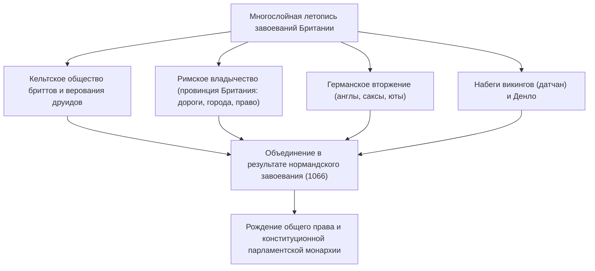
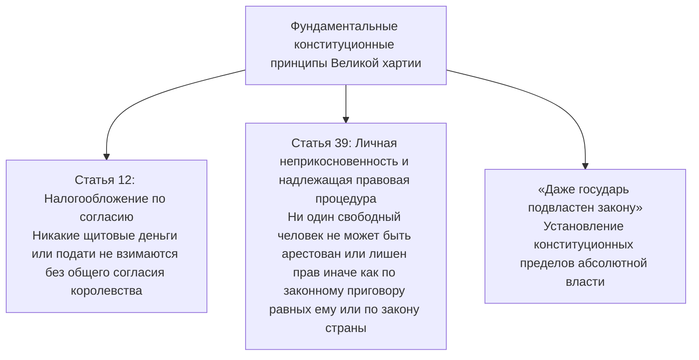
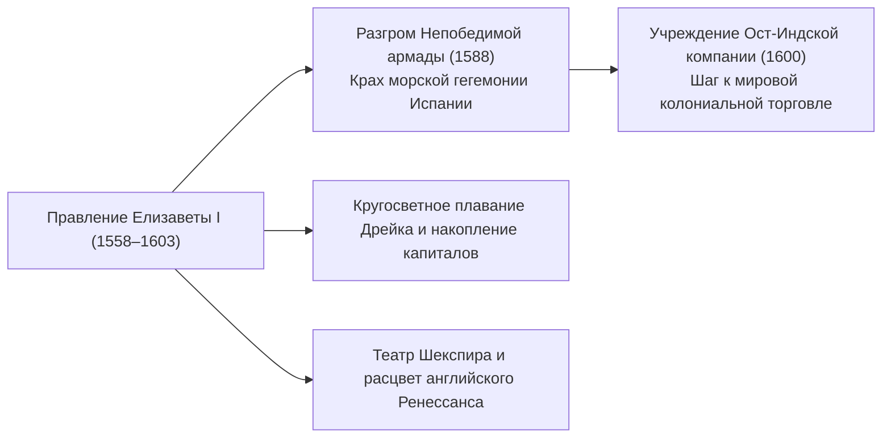
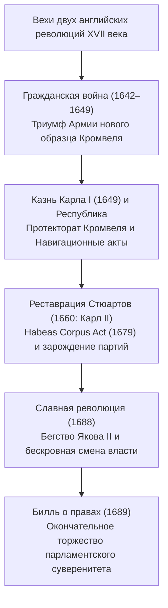
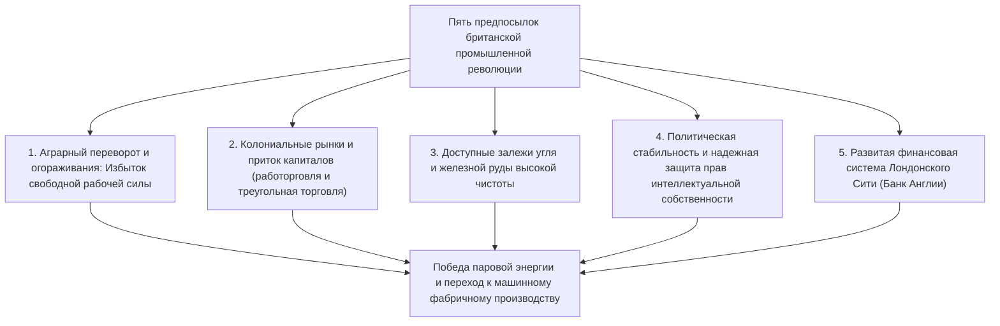
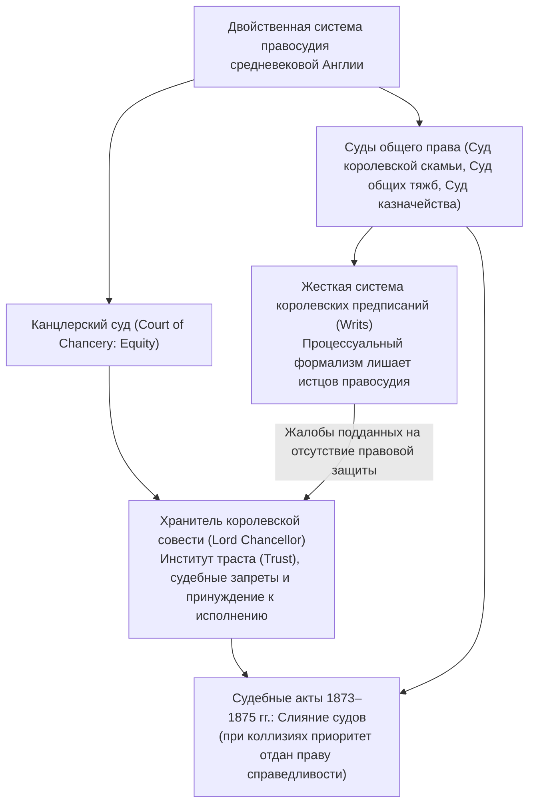
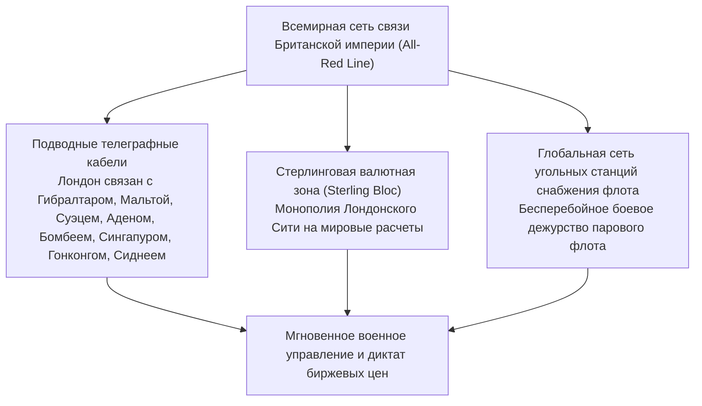
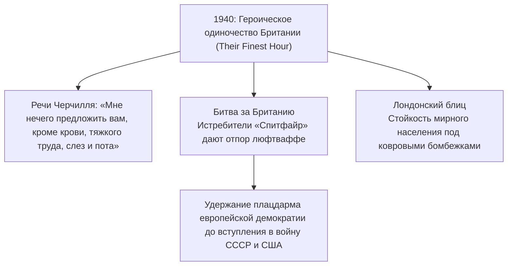
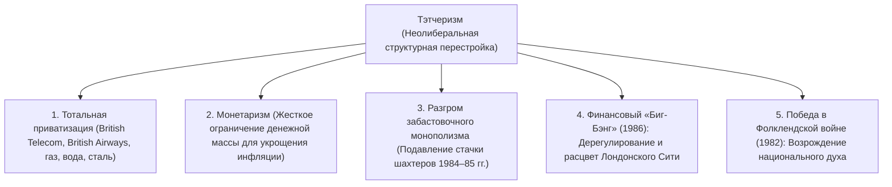
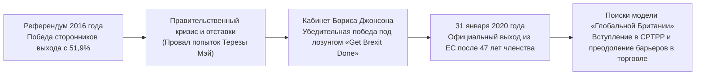

## 1. Введение: геополитика острова и дух британского правопорядка

### 1.1 Кельтская мегалитическая цивилизация и римская провинция Британия

Остров Великобритания, омываемый водами северо-западной Атлантики, с доисторических времен переживал накатывающиеся одна за другой волны миграций и завоеваний. Воздвигнутый на равнине Солсбери в III тысячелетии до н. э. мегалитический комплекс **Стоунхендж (Stonehenge)** служит монументальным свидетельством поразительных астрономических познаний и сакральной религиозности бесписьменных автохтонных племен.

В I тысячелетии до н. э. кельтские племена эпохи железа (бритты) расселились по острову, заложив основы развитого земледелия и отправляя культы поклонения силам природы под руководством касты жрецов-друидов. После разведывательных походов Гая Юлия Цезаря в 55 и 54 годах до н. э., император Клавдий в 43 году н. э. снарядил полномасштабную военную экспедицию, превратив южную часть острова в императорскую провинцию **Британия (Britannia)**.

Римское господство продолжалось почти четыре столетия. Выросли благоустроенные города регулярной планировки, в том числе **Лондиниум (Londinium)** — ядро современного Лондона; остров пересекла разветвленная сеть мощеных римских дорог (таких как Уотлинг-стрит). Рим принес горное дело, общественные термы, латинский язык и христианство. Чтобы сдерживать набеги воинственных пиктов Каледонии (Шотландии), император Адриан повелел возвести неприступный каменный **Вал Адриана (Hadrian's Wall)**, остающийся величественным памятником северного рубежа империи. В 410 году н. э., перед лицом разорения Рима вестготами, император Гонорий отозвал легионы из Британии, повергнув остров в хаос Темных веков.

---

### 1.2 Англосаксонское вторжение, эпоха гептархии и подвиг Альфреда Великого

Вслед за уходом римских легионов в середине V века через Северное море хлынули три германских племени — англы, саксы и юты. Коренное кельтское население бриттов было оттеснено на запад в горы Уэльса и Корнуолла, а также на север в Шотландию (память об этом упорном кельтском сопротивлении легла в основу рыцарских легенд о короле Артуре).

Завоеватели образовали множество независимых владений, со временем сложившихся в так называемую **«Гептархию» (Семицарствие)**: Нортумбрию, Мерсию, Восточную Англию, Эссекс, Сассекс, Уэссекс и Кент. В конце VI века посольство, направленное папой Григорием I во главе с Августином (первым архиепископом Кентерберийским), положило начало стремительной христианизации Англии.

На исходе VIII века на побережье обрушились скандинавские викинги (датчане). Разоряя обители и подчинив восточные земли, они угрожали полным уничтожением англосаксонской государственности. В этот критический момент знамя борьбы поднял правитель уцелевшего юго-западного королевства Уэссекс — **Альфред Великий (Alfred the Great, годы правления 871–899)**:
- В **битве при Эдингтоне (878)** он наголову разбил датчан и заключил Уэдморский мир, разделив страну и признав за захватчиками особую область «Денло» (область датского права).
- Для защиты рубежей создал систему укрепленных городов-крепостей (**бургов**) и заложил основы регулярного военного флота.
- Кодифицировал правовые нормы, организовал перевод латинских классических текстов на древнеанглийский язык для просвещения клириков и мирян и положил начало составлению *Англосаксонской хроники*.
- Будучи единственным монархом в английской истории, удостоенным титула «Великий», Альфред заложил фундамент единого государства: **«Engla-lond» (Земля англов — Англия)**.

---

## 2. Нормандское завоевание (1066) и правовая доктрина Великой хартии вольностей

### 2.1 Судьбоносный 1066 год: битва при Гастингсе и Нормандская династия

В 1066 году кончина бездетного короля Эдуарда Исповедника спровоцировала династический кризис. Совет знати (витенагемот) избрал королем Гарольда Годвинсона (Гарольда II), однако герцог Нормандии Вильгельм заявил о своих законных правах на корону и собрал мощную армаду вторжения.

14 октября 1066 года разыгралась эпохальная **битва при Гастингсе**.
Англосаксонская пехота, выстроившаяся монолитной «стеной щитов», долгие часы сдерживала натиск тяжелой нормандской конницы и лучников. На исходе дня Гарольд II погиб от стрелы, поразившей его в глаз; ряды англосаксов дрогнули, и на Рождество 1066 года Вильгельм короновался в Вестминстерском аббатстве как Вильгельм I (Вильгельм Завоеватель).

**Нормандское завоевание (Norman Conquest)** стало глубочайшим поворотным пунктом английской истории:
1. **Геополитический разворот**: Англия окончательно оторвалась от скандинавского мира и прочно интегрировалась в феодальную, латинскую культуру континентальной Европы.
2. **Языковой и сословный дуализм**: Правящая верхушка (бароны, королевский двор, судьи) изъяснялась на англо-нормандском диалекте старофранцузского, а простолюдины говорили на германском древнеанглийском языке. За столетия этот симбиоз породил современный английский язык, отличающийся колоссальным лексическим богатством.
3. **Книга страшного суда (Domesday Book, 1086)**: Вильгельм I провел тотальную кадастровую перепись всех земельных угодий, пашен, лесов, мельниц, поголовья скота и сословий населения. Этот сводный учет обеспечил создание централизованной феодальной системы, не имевшей аналогов по эффективности на континенте.

---

### 2.2 Судебные реформы Генриха II и становление общего права (Common Law)

В середине XII века Генрих Анжуйский основал династию Плантагенетов под именем **Генриха II (годы правления 1154–1189)**. Властитель Анжуйской державы, простиравшейся от Шотландии до Пиренеев, он коренным образом преобразил правовую систему королевства.

Дабы преодолеть произвол феодальных сеньориальных курий и разрозненность местных обычаев, Генрих II учредил институт постоянных разъездных королевских судей (**Assize Courts**):
- Судьи короны анализировали, обобщали и унифицировали региональные прецеденты, сформировав единый для всего государства правовой свод: **общее право (Common Law)**.
- Были заложены основы современного **суда присяжных (Jury System)**, где беспристрастные местные жители под присягой устанавливали фактические обстоятельства спора.
- В противоположность континентальному абстрактному праву римского типа, стержнем английского правосудия стал принцип обязательного судебного прецедента (**Stare Decisis**).

---

### 2.3 Великая хартия вольностей (1215): зарождение верховенства права

Младший сын Генриха II, печально известный король **Иоанн Безземельный (годы правления 1199–1216)**, потерпел сокрушительное поражение от французского монарха Филиппа II Августа, утратив почти все родовые владения на континенте, и был отлучен от церкви папой Иннокентием III. Пытаясь покрыть военные издержки, Иоанн обложил подданных непомерными поборами (щитовыми деньгами) и развязал тиранический произвол. Возмущенные бароны восстали и захватили Лондон.

15 июня 1215 года на лугу Раннимед близ Виндзора бароны принудили Иоанна приложить королевскую печать к историческому документу — **Великой хартии вольностей (Magna Carta)**.

Значение Великой хартии вольностей многократно превзошло границы средневекового феодального соглашения. Она утвердила незыблемый принцип **верховенства права (Rule of Law)**: *даже высшая власть монарха ограничена рамками закона и не вправе действовать произвольно*. В частности, статья 39 породила доктрину **«надлежащей правовой процедуры» (Due Process of Law)**, вдохновившую английские революции XVII века и Билль о правах Конституции США.

В 1295 году Эдуард I созвал **Образцовый парламент (Model Parliament)**, пригласив не только лордов и духовенство, но и по два выборных рыцаря от каждого графства и по два горожанина от городов. Так сформировалась двухпалатная структура парламента: Палата лордов и Палата общин.

---

## 3. Столетняя война, Война Роз и абсолютизм Тюдоров

### 3.1 Столетняя война (1337–1453), Черная смерть и крушение крепостничества

Борьба за французский престол и контроль над торговлей шерстью во Фландрии привела к **Столетней войне** между Англией и Францией, продолжавшейся с перерывами 116 лет.
- Английские полководцы — Эдуард III, Черный Принц и Генрих V — сокрушали неприятеля залпами валлийских **больших луков (Longbow)**. В битвах при Креси (1346) и Азенкуре (1415) лучники истребили цвет французского рыцарства, возвестив закат средневековой рыцарской тактики.
- Подвиг Жанны д’Арк переломил ход кампании; к 1453 году Англия потеряла все континентальные владения, кроме порта Кале. Изгнанная с континента английская знать перестала отождествлять себя с французской культурой, что привело к консолидации самобытного английского национального сознания.

В 1348 году на остров обрушилась пандемия бубонной чумы — **Черная смерть**, унесшая от трети до половины населения:
- Острейший дефицит рабочих рук многократно укрепил позиции и ценность уцелевших крестьян и батраков.
- Попытки феодалов законодательно зафиксировать заработную плату привели к грандиозному **восстанию Уота Тайлера 1381 года**. Под эгалитарным лозунгом *«Когда Адам пахал, а Ева пряла, кто дворянином был тогда?»* английское крепостное право рухнуло на столетия раньше, чем в континентальной Европе.

---

### 3.2 Война Роз и утверждение династии Тюдоров

Поражение в Столетней войне погрузило страну в тридцатилетнюю феодальную резню за королевскую корону — **Войну Алой и Белой розы (1455–1485)** между домами Ланкастеров и Йорков.
Взаимные истребления и казни практически уничтожили старую родовую аристократию, сломив хребет феодальной раздробленности.

В 1485 году в битве при Босворте Генрих Тюдор сразил Ричарда III и взошел на престол как Генрих VII, положив начало **династии Тюдоров**. Он обуздал своеволие вельмож чрезвычайным трибуналом Звездной палаты (*Court of Star Chamber*) и передал местное управление в руки мелкопоместного дворянства (*джентри*) в качестве мировых судей (*Justices of the Peace*), создав каркас централизованного государства.

---

### 3.3 Реформация Генриха VIII и золотой век Елизаветы I

Облик Англии Нового времени был предопределен церковной реформой **Генриха VIII (годы правления 1509–1547)**.
Отказ папы римского Климента VII аннулировать брак короля с Екатериной Арагонской ради женитьбы на Анне Болейн побудил Генриха порвать с Римом:
- **Акт о супрематии (1534)**: Провозгласил монарха единственным верховным главой Церкви Англии (*Church of England* / Англиканской церкви) на земле.
- Были закрыты и разграблены все католические монастыри, а их колоссальные угодья распроданы джентри и купечеству. Возник многочисленный класс собственников, материально заинтересованный в необратимости Реформации.

После периода католического террора при Марии I («Кровавой Мэри») трон заняла дочь Генриха — **Елизавета I (годы правления 1558–1603)**. Приняв Акт о единообразии, она утвердила «средний путь» (*Via Media*), соединив умеренно протестантское богословие с традиционной внешней обрядностью.

В 1588 году испанский король Филипп II отправил «Непобедимую армаду» для вторжения в протестантскую Англию. Благодаря дерзким атакам брандеров сэра Фрэнсиса Дрейка и свирепым атлантическим штормам испанский флот погиб. В 1600 году королева даровала хартию **Британской Ост-Индской компании**. На фоне триумфа драматургии Уильяма Шекспира в театре «Глобус» Англия заявила о себе как о великой морской державе.

---

## 3.6 «Овцы съели людей»: огораживания и елизаветинские законы о бедных

Экономика XVI века была потрясена первой волной **огораживаний (*enclosures*)**, спровоцированной колоссальным спросом на английскую шерсть на рынках Европы.

### ① Обличение Томаса Мора в «Утопии» (1516)
Земельные магнаты сгоняли крестьян с общинных земель и открытых полей, огораживая участки живыми изгородями под высокодоходные овечьи пастбища.
Лорд-канцлер и гуманист Томас Мор с горечью описал первоначальное накопление капитала:

> **«Ваши овцы, обычно такие кроткие, довольные столь малым, теперь, говорят, стали такими прожорливыми и неукротимыми, что поедают даже людей, разоряют и опустошают поля, дома и города.»**

Обезземеленные земледельцы превращались в бродяг и заполняли города; тысячи из них гибли на виселицах по законам о бродяжничестве.

### ② Закон о бедных 1601 года как исторический рубеж
Дабы предотвратить социальный бунт, парламент принял в 1601 году знаменитый **Закон о бедных (*Poor Law of 1601*)**:
- Финансирование возлагалось на церковные приходы через обязательный налог на имущество (**Poor Rate**).
- Нуждающиеся делились на три разряда:
  1. **Трудоспособные бедняки**: принуждались к труду в работных домах (*workhouses*).
  2. **Нетрудоспособные** (сироты, калеки, престарелые): получали призрение в богадельнях или пособия.
  3. **Праздношатающиеся**: подвергались наказанию и заключению в исправительных домах.
- Превратив помощь неимущим из частной христианской милостыни в публично-правовую обязанность государства, этот акт заложил прообраз института социальной защиты.

---

## 4. Английские революции и рождение конституционной монархии

### 4.1 Абсолютизм Стюартов и Пуританская революция (1642–1649)

После смерти бездетной Елизаветы I корону унаследовал король Шотландии Яков VI, ставший королем Англии **Яковом I**, основателем династии Стюартов.

Яков I и его преемник **Карл I** отстаивали теорию **божественного права королей**, взимали незаконные сборы (корабельные деньги) и жестоко преследовали пуритан. Юрист сэр Эдвард Кок возражал: «Государь подчинен Богу и закону». В 1628 году парламент подал **Петицию о праве (Petition of Right)**, запрещавшую произвольные аресты и налоги без одобрения палаты.

После одиннадцати лет деспотического единоличного правления (*Eleven Years' Tyranny*) Карл I был вынужден вновь собрать парламент из-за войны с Шотландией. Конфликт перерос в вооруженную гражданскую войну между роялистами («кавалерами») и сторонниками парламента («круглоголовыми») — **Пуританскую революцию**.

Организованная Оливером Кромвелем дисциплинированная **Армия нового образца (New Model Army)** разбила королевские войска. 30 января 1649 года чрезвычайный суд признал **Карла I «тираном, предателем, убийцей и врагом государства» и приговорил к публичному отсечению головы** перед банкетным залом Уайтхолла.

Была провозглашена республика (Содружество), однако суровый режим военной диктатуры лорда-протектора вызвал всеобщее отторжение. После смерти Кромвеля парламент в 1660 году восстановил монархию, призвав сына казненного короля — **Карла II** (Реставрация).

---

### 4.2 Славная революция (1688) и Билль о правах

Когда на трон взошел открытый католик **Яков II**, попытавшийся насаждать абсолютизм и католицизм, ведущие группировки парламента — **тори** (монархисты) и **виги** (сторонники парламента) — объединились против тирании.

В 1688 году они обратились с тайным посланием к протестантской дочери короля Марии и ее супругу, нидерландскому штатгальтеру **Вильгельму Оранскому (Вильгельму III)**, призвав их высадиться в Англии с войсками. Покинутый армией Яков II бежал во Францию без боя. Этот бескровный переворот вошел в историю как **Славная революция (Glorious Revolution)**.

В 1689 году монархи утвердили предложенный парламентом фундаментальный закон — **Билль о правах (Bill of Rights)**:
- Запрет монарху отменять законы или взимать налоги без санкции парламента.
- Полная свобода слова и прений в стенах парламента.
- Запрет на содержание регулярной армии в мирное время без согласия парламента.
- Обязательность регулярного созыва парламента.

Так родились **конституционная монархия** и незыблемый догмат **парламентского суверенитета**: *«Король царствует, но не правит»*.

В 1707 году Акт об унии при королеве Анне объединил Англию и Шотландию в единое **Королевство Великобритания**. С воцарением в 1714 году Георга I Ганноверского (не владевшего английским языком) Роберт Уолпол де-факто стал первым премьер-министром, оформив **кабинетную систему правления (*Cabinet System*)**, несущую ответственность перед парламентом.

---

## 5. Промышленная революция и эпоха «Pax Britannica»

### 5.1 Мастерская мира: истоки Первой промышленной революции

Почему первая в истории человечества Промышленная революция произошла именно в Британии в конце XVIII века? Это объясняется уникальным стечением пяти ключевых факторов:

- **Инновации в хлопчатобумажном производстве**: Самолетный челнок Джона Кея, прялка «Дженни» Харгривса, ватермашина Аркрайта, мюль-машина Кромптона и механический ткацкий станок Картрайта.
- **Энергетический переворот**: Усовершенствование парового двигателя Джеймсом Уаттом (1769). Фабрики переместились от берегов рек в центры угольных бассейнов (Манчестер, Бирмингем).
- **Транспортная революция**: Паровоз *The Rocket* Джорджа Стефенсона (1829). Железная дорога Ливерпуль — Манчестер дала старт созданию густой сети путей сообщения, обвалившей себестоимость перевозок.

В 1851 году в лондонском Гайд-парке открылась первая Всемирная выставка в грандиозном **Хрустальном дворце (Crystal Palace)**. Шесть миллионов гостей воочию убедились в триумфе Британии как неоспоримой **«Мастерской мира» (Workshop of the World)**.

---

### 5.2 Мировая экспансия Британской империи

В викторианскую эпоху (1837–1901), охраняемая абсолютным превосходством Королевского флота (*Royal Navy*) и глобальной системой свободной торговли, Британия утвердила планетарную гегемонию — **Pax Britannica (Британский мир)**.

Империя, «над которой никогда не заходило солнце», раскинулась на четверти земной суши и объединяла четверть населения планеты.

| Регион | Главные колонии и территории | Специфика владычества и ключевые вехи |
| :--- | :--- | :--- |
| **Южная Азия** | **Индия («Жемчужина в короне»)** | Под властью Ост-Индской компании со времен битвы при Плесси (1757). После подавления восстания сипаев (1857) компания упразднена, введено прямое коронное правление (*Британский Радж*). В 1877 году Виктория провозглашена императрицей Индии. |
| **Восточная Азия** | **Китай (династия Цин) и Гонконг** | Контрабанда опиума привела к Первой опиумной войне (1840). По Нанкинскому договору (1842) отторгнут Гонконг, навязана система неравноправных договоров и открытых портов. |
| **Африка** | **От Египта до Южной Африки** | Покупка Дизраэли акций Суэцкого канала (1875). Проект Сесила Родса «От Кейптауна до Каира» (политика трех «С»: Cairo, Calcutta, Cape Town). Англо-бурские войны. |
| **Доминионы** | **Канада, Австралия, Новая Зеландия** | Территории переселенческого типа рано обрели ответственное самоуправление, сформировав основу будущего Британского Содружества. |

В парламенте развернулось классическое соперничество консерватора Бенджамина Дизраэли (имперская политика и социальные реформы) и либерала Уильяма Гладстона (бюджетная экономия, фритредерство и ирландский гомруль). Избирательные реформы 1832, 1867 и 1884 годов последовательно открыли доступ к урнам для голосования рабочему классу.

---

## 2.4 Правовой дуализм: общее право, право справедливости (Equity) и система предписаний (*writs*)

Фундаментальное отличие британского права от континентальных систем заключается в параллельном сосуществовании двух ветвей: **общего права (Common Law)** и **права справедливости (Equity)**.

### ① Формализм судебных предписаний (*System of Writs*)
В XII–XIII веках, чтобы подать иск в королевский суд, истец был обязан приобрести в королевской канцелярии (*Chancery*) строго стандартизированный приказ-предписание (*Writ*).
Опасаясь усиления королевской юрисдикции, бароны в Оксфордских провизиях 1258 года запретили создавать новые виды предписаний. Суды общего права впали в процедурный застой: любое нарушение обязательств, не укладывавшееся в готовые формуляры, оставалось без рассмотрения.

### ② Канцлерский суд и изобретение «траста» (*Trust*)
Отвергнутые формализмом граждане обращались с мольбами к королю. Монарх перепоручал разбор жалоб **лорду-канцлеру (Lord Chancellor)** — высшему сановнику и «хранителю королевской совести».
- Канцлер судил по совести и естественной справедливости, не связывая себя процедурами, — так возникло **право справедливости (Equity)**.
- Если общее право взыскивало лишь денежное возмещение ущерба, то Equity ввело исполнение обязательства в натуре (*Specific Performance*) и запретительные предписания (*Injunctions*).
- Отправляясь в крестовые походы, рыцари передавали управление поместьями друзьям в интересах семьи: из этого обычая возник институт **траста (доверительной собственности)**, разделивший титульное и бенефициарное владение — шедевр мировой юридической мысли.

---

## 3.4 Покорение кельтских окраин: трагедия Шотландии и Ирландии

Строительство английской гегемонии сопровождалось колониальным закабалением соседних кельтских народов.

### ① Войны за независимость Шотландии: Уоллес и Брюс
В конце XIII века Эдуард I («Молот шотландцев») вторгся в Шотландию и увез в Лондон священный «Камень судьбы» (Скунский камень).
- 1297: Уильям Уоллес поднял народное восстание и разбил английскую рыцарскую конницу у Стерлингского моста.
- 1314: Роберт Брюс в **битве при Бэннокберне** окружил и разгромил превосходящую армию англичан копейными фалангами (*шильтронами*), добившись признания независимости Шотландии по договору 1328 года.

### ② Кромвелевское завоевание и Великий голод в Ирландии
Судьба Ирландии оказалась неизмеримо трагичнее:
- 1649: После гражданской войны Оливер Кромвель утопил Ирландию в крови. Резня в Дрохеде и Уэксфорде сменилась конфискацией земель у католиков в пользу протестантов (Ольстерская колонизация). Ирландцы превратились в бесправных арендаторов на родной земле.
- **Великий голод (1845–1852)**: Фитофтороз погубил весь урожай картофеля.
  - Скованное догмами *laissez-faire*, правительство в Лондоне не прекращало вывоз ирландского зерна в Англию, пока население вымирало от голода.
  - Погибло свыше 1 миллиона человек, и более 1 миллиона бежали на ветхих «кораблях-гробах» в США (основа мощной ирландской диаспоры, давшей клан Кеннеди). Население острова сократилось вдвое, породив вековечную ненависть к Лондону.

---

## 5.5 Геополитическая инфраструктура и информационное господство: телеграф и «Большая игра»

Мировое лидерство империи держалось не только на броненосцах, но и на **первой в истории глобальной телекоммуникационной инфраструктуре**.

- **Сеть All-Red Line**: Владея патентами на гуттаперчевую изоляцию кабелей, Британия опоясала подводными линиями все свои владения (традиционно окрашивавшиеся на картах красным цветом). Выход кабелей исключительно на британскую территорию защищал переписку от прослушивания и диверсий.
- **Большая игра (The Great Game)**: Тайное соперничество разведок и армий Британской и Российской империй в XIX — начале XX века за контроль над Центральной Азией (Афганистан, Персия, Тибет), воспетое в романе Редьярда Киплинга «Ким» и давшее толчок современной геополитике (теория Хартленда Хэлфорда Маккиндера).

---

## 6. Две мировые войны и сумерки империи

### 6.1 Первая мировая война и истощение ресурсов

В начале XX века в ответ на милитаризацию кайзеровской Германии Британия отказалась от вековой доктрины «Блистательной изоляции» (*Splendid Isolation*), заключив союз с Японией (1902), Антанту с Францией (1904) и соглашение с Россией (1907).

В августе 1914 года разразилась Первая мировая война:
- В окопах Западного фронта (битва на Сомме, Пашендейль) под ураганным огнем пулеметов, артиллерии и хлора погибло целое поколение юношей («потерянное поколение»).
- Несмотря на блокаду Германии и Ютландское сражение, астрономические расходы лишили Британию статуса ведущего кредитора планеты, превратив ее в должника Соединенных Штатов.

В 1920-е годы Лейбористская партия оттеснила либералов, и Рамсей Макдональд сформировал первое лейбористское правительство. В 1928 году было узаконено всеобщее избирательное право для мужчин и женщин с 21 года. В то же время после Пасхального восстания 1916 года и освободительной войны в 1922 году образовалось Ирландское свободное государство (лишь 6 северных графств остались под юрисдикцией Лондона).

---

### 6.2 Вторая мировая война и одиночное противостояние Черчилля

В 1930-е годы попытка премьера Невилла Чемберлена сдержать реваншизм Гитлера через **«политику умиротворения» (Appeasement Policy)** потерпела крах при подписании Мюнхенского сговора 1938 года.

В сентябре 1939 года нападение на Польшу разожгло Вторую мировую войну. В мае 1940 года, когда Франция пала под ударами блицкрига, а Западная Европа оказалась оккупирована нацистами, правительство возглавил **Уинстон Черчилль (Winston Churchill)**.

Радиовыступления Черчилля укрепили стойкость народа. Благодаря сети радаров пилоты Королевских ВВС (RAF) сорвали планы Геринга (*«Никогда еще в истории человеческих конфликтов столь многие не были обязаны столь немногим»*). Ценой колоссальных разрушений метрополии и полного истощения ресурсов победа союзников была завоевана.

---

### 6.3 «От колыбели до могилы» и распад колониальной державы

На парламентских выборах лета 1945 года консерваторы Черчилля потерпели сенсационное поражение от лейбористов Клемента Эттли. Народ предпочел социальные гарантии имперским амбициям:
- **Построение государства всеобщего благосостояния**: На основе доклада Уильяма Бевериджа была выстроена система социальной защиты **«от колыбели до могилы» (From the cradle to the grave)**. В 1948 году учреждена бесплатная **Национальная служба здравоохранения (NHS)**, национализированы угольная, металлургическая отрасли, железные дороги и электроэнергетика.
- **Деколонизация империи**:
  - 1947: После ненасильственной кампании Махатмы Ганди Индия и Пакистан обрели независимость.
  - **Суэцкий кризис (1956)**: Попытка Лондона и Парижа вернуть национализированный Насером Суэцкий канал силой оружия потерпела крах под ультимативным давлением США и СССР. Кризис окончательно зафиксировал низведение Британии до уровня державы второго ранга.

---

## 7. От тэтчеризма к «Третьему пути» и Брекситу

### 7.1 Трясина «британской болезни» и шоковая терапия Тэтчер

К 1970-м годам раздутые социальные обязательства, произвол профсоюзов и убыточность госсектора привели к затяжной стагфляции — **«британской болезни» (British Disease)**. Кульминацией кризиса стала **«Зима несогласия» (1978–1979)**, когда бессрочные забастовки мусорщиков и санитаров парализовали жизнь в городах.

В мае 1979 года страну впервые возглавила женщина — **Маргарет Тэтчер (Margaret Thatcher, «Железная леди»)**.

Шоковая терапия Тэтчер сопровождалась деиндустриализацией Севера, взлетом безработицы и социальным расслоением. Тем не менее она возродила конкурентоспособность экономики и вернула Лондону статус финансовой столицы мира наряду с Нью-Йорком.

---

### 7.2 Тони Блэр и концепция «Третьего пути»

В 1997 году лейбористы во главе с Тони Блэром (*New Labour*) триумфально вернулись к власти после восемнадцати лет в оппозиции. Блэр выдвинул концепцию **«Третьего пути» (The Third Way)**, соединив рынок с государственными инвестициями в школы и здравоохранение (NHS):
- Проведена деволюция полномочий с созданием парламентов Шотландии и Уэльса.
- Подписано историческое **Соглашение Страстной пятницы (1998)**, положившее конец тридцатилетнему террору в Северной Ирландии (*The Troubles*).
- Однако безоговорочная поддержка вторжения США в Ирак в 2003 году непоправимо подорвала политический авторитет Блэра.

---

### 7.3 Землетрясение Брексита и вызовы XXI века

С момента вступления в ЕЭС в 1973 году Великобритания сохраняла скепсис по отношению к брюссельскому наднациональному диктату (отказ от евро и Шенгена).

В 2010-е годы опасения по поводу миграции и утраты суверенитета выкристаллизовались в лозунг **«Take Back Control» (Вернем себе контроль)**. На референдуме 23 июня 2016 года сторонники выхода из ЕС одержали победу, набрав **$51,9\,\%$ голосов (Brexit)**.

31 января 2020 года Великобритания официально покинула Европейский союз.
Сегодня страна сталкивается с торговыми барьерами, дефицитом кадров, инфляцией, спорами вокруг Североирландского протокола и шотландским сепаратизмом, заново определяя свое место в меняющемся миропорядке.

---

## 5.6 Рабочее движение: от луддитов до чартизма

В тени промышленного богатства традиционные ремесленники терпели разорение и нищету из-за вытеснения ручного труда машинами.

### ① Движение луддитов (1811–1816)
Ткачи севера Англии объединялись в тайные общества под знаменем вымышленного «Генерала Неда Лудда» и по ночам крушили кувалдами ненавистные паровые станки. Правительство бросило армейские части на усмирение бунтовщиков и ввело смертную казнь за порчу машин (*Frame Breaking Act* 1812 года).

### ② Чартистское движение (1838–1848)
Когда парламентская реформа 1832 года дала избирательные права буржуазии, обойдя пролетариат, рабочие развернули первую в истории массовую политическую кампанию.
Уильям Ловетт и его соратники опубликовали манифест **«Народная хартия» (*People's Charter*)**, выдвинув **шесть ключевых требований**:

1. **Всеобщее избирательное право для мужчин** (отмена имущественного ценза)
2. **Тайное голосование бюллетенями** (защита от давления хозяев)
3. **Отмена имущественного ценза для депутатов парламента**
4. **Выплата депутатского жалованья** (чтобы неимущие могли заседать в палате)
5. **Равные избирательные округа** (пропорциональное представительство)
6. **Ежегодное переизбрание парламента** (для подотчетности избирателям)

Хотя парламент трижды отверг петиции с миллионами подписей, пять из шести пунктов (за исключением ежегодных выборов) на рубеже XIX–XX веков стали законами, заложив фундамент британской демократии.

---

## 7.5 Модернизация монархии: от Виндзоров до века Елизаветы II

Жизнеспособность британской монархии в демократическую эпоху зиждется на прагматичной способности адаптироваться к вызовам XX века.

### ① Переименование в дом Виндзоров (1917)
В разгар Первой мировой войны на волне антинемецких настроений Георг V публично отрекся от немецкой фамилии Саксен-Кобург-Гота и провозгласил британское имя династии — **Виндзорская династия**. Будучи двоюродным братом кайзера Вильгельма II, монарх предпочел кровным узам преданность национальным чувствам подданных.

### ② Отречение Эдуарда VIII (1936)
Желание короля жениться на дважды разведенной американке Уоллис Симпсон натолкнулось на сопротивление англиканской церкви и кабинета Стэнли Болдуина. Король отрекся от престола всего через 325 дней после коронации в пользу заикающегося брата Георга VI (героя картины «Король говорит!»). Кризис утвердил аксиому: монарх обязан следовать воле демократического правительства.

### ③ 70 лет служения Елизаветы II (1952–2022)
Взойдя на трон в возрасте 25 лет в 1952 году, Елизавета II правила семьдесят лет вплоть до своей кончины в 2022 году в возрасте 96 лет (Платиновый юбилей).
Пройдя сквозь распад империи, холодную войну и семейные неурядицы, королева хранила политический нейтралитет и преданность долгу, оставаясь главным духовным стержнем Соединенного Королевства.

---

## 8. Заключение: непрерывность традиций и мудрость эволюционных реформ

Главный парадокс и чудо истории Великобритании состоят в том, что, **не имея единого писаного конституционного кодекса, страна выстроила и сберегла один из самых несокрушимых и стабильных режимов правового государства и парламентской демократии на планете**.

Вместо того чтобы крушить устои в кровавых революциях и чертить республиканские схемы с чистого листа, британцы неизменно искали опору в древних обычаях, судебных решениях и хартиях вольностей (Великая хартия, Билль о правах), бережно совершенствуя их путем **эволюционных реформ (*Incremental Reform*)**.

Борьба за свободу, начатая средневековыми баронами:
- Была отлита в права человека судьями общего права,
- Возведена на пьедестал верховной власти трибунами парламента,
- Распространена на миллионы тружеников борьбой рабочих за избирательное право,
- И увенчана институтами социальной поддержки для самых уязвимых слоев населения.

И пусть былое имперское могущество сменилось статусом островного государства между Европой и Атлантикой, ценности, подаренные Британией миру — **верховенство права, парламентаризм и суверенитет человеческой личности**, — остаются путеводной звездой для всех свободных обществ Земли.
