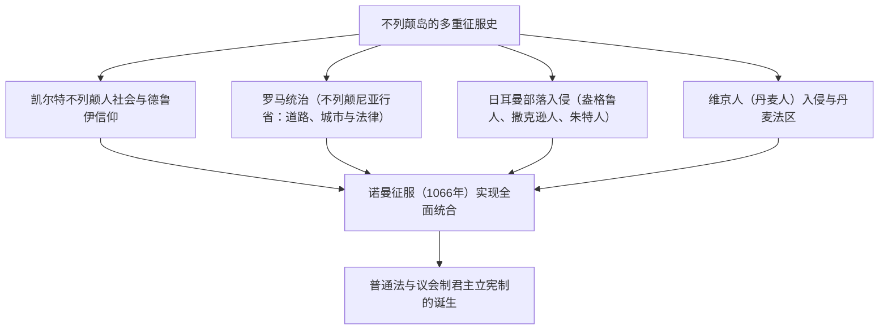
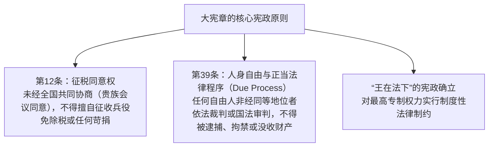
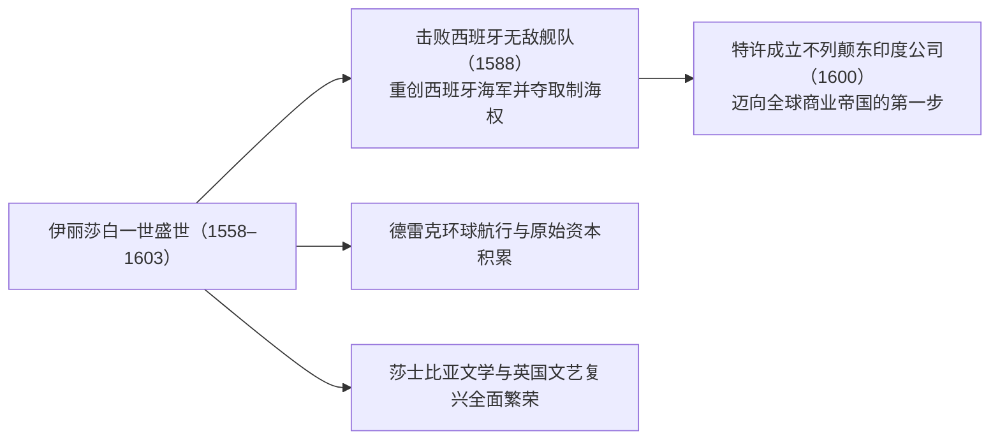
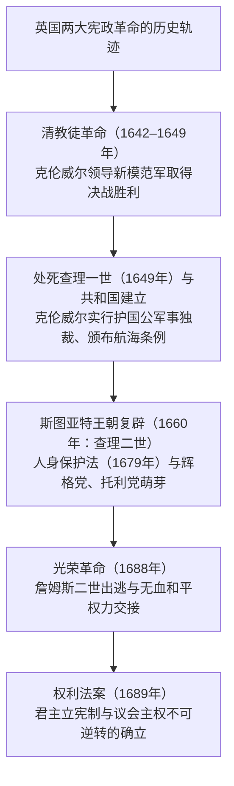
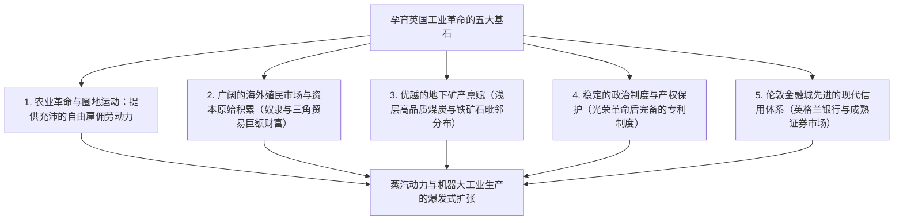
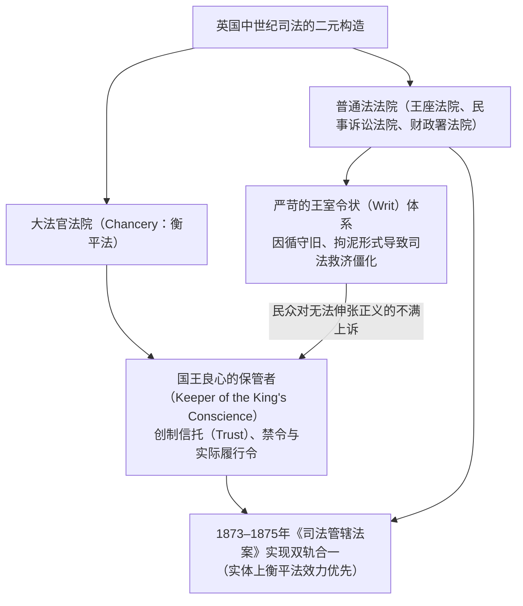
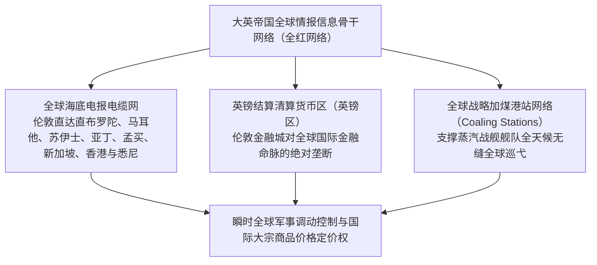
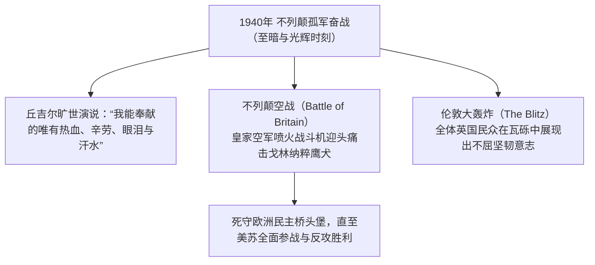
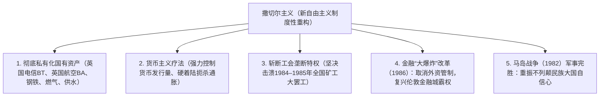
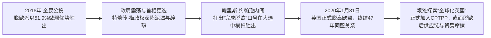

## 1. 引言：不列颠岛国地缘政治与法治秩序的精神

### 1.1 凯尔特巨石文明与罗马属省不列颠尼亚

大不列颠岛孤悬于欧洲大陆西北部的海洋之中，自远古时代起就经历了大陆民族一波又一波的迁徙与征服。公元前3000纪矗立于索尔兹伯里平原上的巨石建筑群——**巨石阵（Stonehenge）**，正是没有文字记载的早期原住民高度发达的天文知识与宗教崇拜精神的结晶。

公元前1千纪，掌握铁器文明的凯尔特各部落（不列颠人）在此定居，发展了繁荣的农耕文明，并由德鲁伊祭司主持自然崇拜仪式。公元前55年及54年，盖乌斯·尤利乌斯·恺撒率军两度远征；公元43年，罗马皇帝克劳狄一世派遣庞大远征军展开全面征服，大不列颠岛南部正式沦为罗马帝国的行省——**不列颠尼亚（Britannia）**。

罗马统治延续了近四个世纪。以现代伦敦的前身伦蒂尼恩（Londinium）为代表的规划城市拔地而起，坚固的罗马大道网（如沃特林大道）贯穿全岛，采矿技术、公共浴场、拉丁语以及基督教随之传入。为抵御北方皮克特人（加里东尼亚）的侵袭，哈德良皇帝下令修筑了著名的**哈德良长城（Hadrian's Wall）**，作为帝国最北端的防线，至今仍巍然屹立。公元410年，面对西哥特人洗劫罗马的危机，霍诺留皇帝下令罗马军团全线撤离不列颠尼亚，这座岛屿再度被抛入动荡的黑暗时代。

---

### 1.2 盎格鲁-撒克逊入侵、七国时代与阿尔弗雷德大帝的奇迹

罗马军团撤离后，来自北海对岸的日耳曼三大部族——盎格鲁人、撒克逊人与朱特人——于5世纪中叶汹涌渡海入侵。本土的凯尔特不列颠人被逐步驱逐至西部的威尔士、康沃尔以及北部的苏格兰山地（凯尔特人不屈抵抗的英勇传说，后来升华为中世纪骑士文学的旷世名作《亚瑟王传奇》）。

征服者们在岛上割据自立，最终形成了七雄并立的**“七国时代（Heptarchy）”**：诺森布里亚、麦西亚、东盎格利亚、埃塞克斯、萨塞克斯、威塞克斯和肯特。6世纪末，教皇格里高利一世派遣特使奥古斯丁（首任坎特伯雷大主教）抵英，迅速推动了英格兰的基督教化。

8世纪末，来自斯堪的纳维亚半岛的维京海盗（丹麦人）蜂拥而至。他们劫掠修道院，占领了英格兰东半部。面对灭顶之灾，西南部的威塞克斯王国挺身而出，其领袖便是英格兰历史上著名的**阿尔弗雷德大帝（Alfred the Great，在位871–899年）**：
- 在**埃丁顿战役（878年）**中击溃丹麦军队，签署《韦德莫尔条约》，将英格兰一分为二（划定丹麦人自治管辖的“丹麦法区”）。
- 为巩固防务，在全境修建要塞城镇网络（Burgh），并着手组建皇家海军雏形。
- 颁布成文法典，设立学校，命人将拉丁文古典著作翻译成古英语供教士与平民研读，并主持编纂了《盎格鲁-撒克逊编年史》。
- 作为英国历史上唯一被冠以“大帝”尊号的君主，阿尔弗雷德的统治奠定了“盎格鲁人之国（England＝英格兰）”统一民族国家的基石。

---

## 2. 诺曼征服（1066年）与大宪章的法理

### 2.1 决定命运的1066年：黑斯廷斯战役与诺曼王朝的建立

1066年，忏悔者爱德华逝世，英格兰爆发王位继承危机。贤人会议（Witenagemot）推举哈罗德二世登基，而英吉利海峡对岸的诺曼底公爵威廉则宣称自己拥有合法的王位继承权，随即集结远征军渡海来犯。

1066年10月14日，**黑斯廷斯战役（Battle of Hastings）**爆发。
面对英格兰步兵紧密的“盾墙”防线，诺曼骑士团与弓弩部队发起轮番猛攻。傍晚时分，哈罗德二世眼部中箭阵亡，英格兰军队全线崩溃。威廉在西敏寺加冕为英格兰国王，史称威廉一世（征服者威廉）。

**诺曼征服（Norman Conquest）**是英国历史发展中最重要的转折点：
1. **地缘战略巨变**：英格兰彻底摆脱了面向斯堪的纳维亚北欧世界的视野，直接融入以法国和拉丁文化为中心的西欧封建大陆体系。
2. **语言文化的二元重构**：统治阶层（贵族、王室法庭）使用盎格鲁-诺曼法语，被统治的平民阶层使用日耳曼语系的古英语。经历数个世纪的深度交融，词汇极大丰富的现代“英语”应运而生。
3. **末日审判书（Domesday Book，1086年）**：威廉一世下令在全国范围内进行彻底的土地与财产清查，精确记录农田、森林、牲畜、水磨坊乃至各类人口。这一集权统治的旷世调查，确立了远比欧洲大陆更为严密、高效的中央封建管治体系。

---

### 2.2 亨利二世的司法改革与普通法（Common Law）的诞生

12世纪中叶，安茹伯爵亨利继承王位，建立金雀花王朝，史称**亨利二世（在位1154–1189年）**。这位统治着横跨英格兰及半个法国的“安茹帝国”的伟大君主，对英国法律体系进行了革命性重构。

为破除地方领主庄园法庭各自为政、习惯法四分五裂的局面，亨利二世确立了国王直属法官巡回审判的**巡回法院制度（Assize Courts）**：
- 国王法官深入各地，遴选、整合各地优秀的习惯法与判例，创立了**“通行于整个王国的统一法律体系（Common Law，即普通法）”**。
- 确立了**陪审团制度（Jury System）**的现代基础，通过传唤当地公正理性的居民宣誓提供证言来查明案件事实。
- 形成了不依赖国家颁布的成文法典、而是依靠法官过往判例不断演进积累的“遵循先例原则（Stare Decisis）”，奠定了英美法系的基石。

---

### 2.3 大宪章（1215年）：“法的统治”之源起

亨利二世幼子、臭名昭著的“失地王”约翰（在位1199–1216年）在与法国国王腓力二世的战争中连遭惨败，丢失了绝大部分欧洲大陆领地，更因与教皇英诺森三世决裂而被逐出教会。为筹措战费，约翰王向贵族强行征收苛捐杂税，实行残酷的专制统治，忍无可忍的封建贵族最终在伦敦发动武装起义。

1215年6月15日，在温莎附近的兰尼米德草地上，起义贵族迫使约翰王在一份羊皮纸文件上加盖国玺，这便是彪炳史册的**《大宪章》（Magna Carta）**。

《大宪章》的伟大历史意义，超越了中世纪封建贵族争取自身特权的原始范畴，从根本上确立了**“即使贵为君主亦必须遵守法律、不可任意胡为”的“法治（Rule of Law）”普遍准则**。尤其是第39条蕴含的“法定正当程序（Due Process of Law）”，成为17世纪英国革命以及美国宪法权利法案的核心思想源泉。

1295年，爱德华一世召开了**模范议会（Model Parliament）**，除贵族与高级教士外，首次吸纳了各郡骑士代表2名及自治市市民代表2名，奠定了日后英国议会上院（贵族院）与下院（平民院）的两院制基本构架。

---

## 3. 百年战争、玫瑰战争与都铎王朝的绝对君主制

### 3.1 百年战争（1337–1453）、黑死病与农奴制的解体

因争夺法国王位继承权及弗兰德毛纺织业控制权，英格兰与法国之间爆发了长达116年断断续续的“英法百年战争”。
- 爱德华三世、黑太子爱德华、亨利五世等统帅凭借威尔士**长弓兵（Longbow）**部队，在克雷西战役（1346年）与阿金库尔战役（1415年）中重创法国重装骑士团，敲响了中世纪封建骑士阶层的丧钟。
- 随后圣女贞德挺身而出扭转战局，至1453年英格兰丧失了除加来以外的所有大陆领地，被迫退守岛国。正是这场惨烈持久的战争，使英格兰贵族彻底摆脱了“法国领主”的心理认同，孕育了统一的英格兰民族认同感。

在此期间的1348年，**黑死病（鼠疫大流行）**席卷不列颠全岛，夺去了三分之一至一半的人口：
- 劳动力的严重匮乏，极大提升了幸存农奴与雇工的社会地位与议价能力。
- 面对领主阶层企图压制工资、强行恢复封建劳役的企图，1381年爆发了震撼全国的**瓦特·泰勒起义**。起义者喊出了*“当亚当耕作、夏娃织布时，谁是贵族？”*的平等呼声，英格兰庄园农奴制由此在欧洲大陆之前率先瓦解。

---

### 3.2 玫瑰战争与都铎王朝的崛起

百年战争战败后，英格兰国内陷入了争夺王位的贵族内战。兰开斯特家族（红玫瑰）与约克家族（白玫瑰）展开了长达30年的血腥厮杀，史称**玫瑰战争（1455–1485年）**。
频繁的自相残杀与政治处决，令英格兰旧有的封建大贵族阶层几近屠戮殆尽，封建割据势力遭受毁灭性打击。

1485年，在博斯沃思战役中斩杀约克家族理查三世的亨利·都铎登基即位，开创**都铎王朝**，史称亨利七世。他设立专制审判机构“星室法庭”以严厉打击豪强贵族，同时大量拔擢地方乡绅（Gentry）担任治安法官（JP），奠定了早期近代中央集权官僚体制的基石。

---

### 3.3 亨利八世的宗教改革与伊丽莎白一世的黄金时代

塑造都铎王朝历史走向的决定性事件，是**亨利八世（在位1509–1547年）**推行的宗教改革。
因教皇克莱孟七世拒绝宣布其与王后阿拉贡的凯瑟琳婚姻无效、阻挠其迎娶安妮·博林，亨利八世毅然决然与罗马教廷决裂：
- **1534年《至尊法案》（Act of Supremacy）**：宣布英格兰国王是英格兰教会（圣公会/安立甘宗）在世间的唯一最高领袖。
- 在全国范围内推行没收与解散修道院运动，将教会占有的浩瀚土地廉价售予新兴乡绅与城市资产阶层。此举培育了一批在经济利益上与都铎王权紧密绑定的新兴有产阶级。

经历玛丽一世（血腥玛丽）残酷迫害新教徒的倒退期后，亨利八世之女**伊丽莎白一世（在位1558–1603年）**即位。通过《礼拜统一法案》，确立了温和折中的“中道（Via Media）”路线——在保留天主教传统礼仪外壳的同时，确立新教神学教义。

1588年，面对西班牙国王腓力二世派遣的“无敌舰队”，德雷克副司令等指挥官利用灵活的火船战术配合英吉利海峡的风暴将其重创。1600年，英国正式特许设立**东印度公司**，开启了在南亚及亚洲的商业殖民扩张。莎士比亚的经典名剧在环球剧场引爆狂欢，英格兰由此踏上了通往世界海洋霸主的大道。

---

## 3.6 “羊吃人”：圈地运动与伊丽莎白济贫法的社会史

16世纪都铎王朝的经济社会巨变，源于欧洲大陆对英格兰毛纺织品的狂热需求所引发的**“第一次圈地运动”**。

### ① 托马斯·莫尔在《乌托邦》（1516年）中的严正控诉
贵族地主与富商为了攫取高额利润，动用暴力手段将世代耕作的农民从公有地与敞田上驱逐出去，用树篱和沟渠圈占土地用于放牧绵羊。
曾任大法官的人文主义先驱托马斯·莫尔在其巨著《乌托邦》中，对资本原始积累的残酷罪行进行了极其深刻的揭露：

> **“你们的羊一向是那么温顺，吃得那么少，据说现在变得非常贪婪、凶猛，甚至开始吃人，把田地、家园和城市统统摧毁吞噬。”**

大批失去土地的农民沦为流民（流浪汉），涌入伦敦等大城市谋求生计，许多人因贫困被迫盗窃而被送上绞刑架。

### ② 伊丽莎白济贫法（1601年）的历史性飞跃
为平息日趋严重的社会贫困与动荡危机，议会于1601年颁布了具有里程碑意义的**《伊丽莎白济贫法》（Poor Law of 1601）**：
- 以教区（Parish）为自治救济单元，开征强制性的法定**济贫税（Poor Rate）**。
- 将贫民科学归为三类实施精准管治：
  1. **“有劳动能力的贫民”**：强制送入习艺所（Workhouse）进行苦力劳动。
  2. **“无劳动能力的贫民”**（孤儿、老弱病残）：由济贫院收容救济或提供院外救济。
  3. **“游手好闲者与流民”**：关押进感化院进行惩戒与改造。
- 该法将贫民救济从单纯的“宗教慈善施舍”提升为“国家的法律责任”，开创了人类历史上最早的公共救助法治体系，成为20世纪贝弗里奇报告与英国现代福利国家的雏形源头。

---

## 4. 英国革命与君主立宪制的诞生

### 4.1 斯图亚特王朝专制与清教徒革命（1642–1649年）

伊丽莎白一世终身未婚离世后，苏格兰国王詹姆斯六世入承大统，成为英格兰国王詹姆斯一世，斯图亚特王朝由此开启。

然而，詹姆斯一世及其继任者**查理一世**深受欧洲大陆**“君权神授说”**影响，蔑视议会传统，绕过议会擅自开征造船税等苛捐杂税，并残酷镇压清教徒。法学家爱德华·科克爵士义正词严地抗辩：“国王虽处于万人之上，却在上帝和法律之下。”1628年，议会向查理一世提交了著名的**《权利请愿书》（Petition of Right）**，重申非经议会同意不得征税，严禁非法逮捕。

查理一世强行解散议会并实行了长达11年的无议会独裁统治。为筹措平定苏格兰起义的军费，查理一世被迫重开议会，王权与议会的尖锐对立最终演变为全面的国内武装内战——**清教徒革命（英国内战）**。

在奥利弗·克伦威尔的铁腕领导下，纪律严明的“新模范军”彻底击溃王军。1649年1月30日，**特别高等法庭以“暴君、叛国贼、杀人犯及国家公敌”的罪名，将查理一世公开斩首处决**，此举令整个欧洲王室为之震恐。

英格兰随即废除君主制建立共和国，但就任“护国公”的克伦威尔实行严厉的清教军事独裁，激起了广泛的民怨。1658年克伦威尔去世后，政局陷入混乱，议会于1660年迎回查理二世，实现了“斯图亚特王朝复辟”。

---

### 4.2 光荣革命（1688年）与《权利法案》

复辟后的查理二世及继位的詹姆斯二世企图故态复萌，重新恢复天主教主导地位并推行君主专制。面对危机，议会内部两大阵营——捍卫王权的**托利党**与主张议会至上的**辉格党**摒弃前嫌，联手策划政变。

1688年，议会各派秘密致信邀请詹姆斯二世信仰新教的女儿玛丽及其丈夫荷兰执政**奥兰治亲王威廉三世**率军登陆英国。在强大的民意支持下，众叛亲离的詹姆斯二世仓皇逃亡法国。这场未流一滴血便实现政权更迭的政变，史称**“光荣革命”（Glorious Revolution）**。

1689年，威廉三世与玛丽二世共同加冕，并正式签署批准了由议会起草的**《权利法案》（Bill of Rights）**：
- 未经议会同意，国王无权废除法律或停止法律的执行。
- 未经议会准许，国王不得征收赋税。
- 议会内享有完全的言论自由，任何法庭不得对其弹劾指控。
- 和平时期未经议会批准，国王不得招募或维持常备军。
- 必须定期召开议会。

这标志着英国在人类历史上首次确立了**“王在议会，统而不治”的君主立宪制（Constitutional Monarchy）与议会主权（Parliamentary Sovereignty）**原则。

1707年，安妮女王在位期间通过《联合法案》，英格兰与苏格兰正式合并为**大不列颠王国（Kingdom of Great Britain）**。1714年汉诺威王朝乔治一世入继大统（由于其不谙英语），罗伯特·沃波尔爵士成为实质上的首任首相，推行内阁对议会负责的**责任内阁制（Cabinet System）**，现代西方议会民主体制自此成熟定型。

---

## 5. 工业革命与“不列颠治世（大英帝国）”的世纪

### 5.1 跃升为“世界工厂”：第一次工业革命的驱动机制

18世纪下半叶，人类历史上划时代的“工业革命（Industrial Revolution）”为何率先发生于英国？其根本原因在于当时唯独英国具备了五大得天独厚的历史要素：

- **棉纺织技术飞跃**：约翰·凯伊的飞梭、哈格里夫斯的珍妮纺纱机、阿克莱特的水力纺纱机、克朗普顿的走锭纺纱机以及卡特赖特的动力织布机相继问世。
- **动力革命**：詹姆斯·瓦特于1769年改良出分离式冷凝器双动式蒸汽机。工厂由此彻底摆脱水力地理限制，向靠近煤炭产地的现代工业城市（曼彻斯特、伯明翰）迅速聚集。
- **交通运输革命**：乔治·斯蒂芬森制造出“火箭号”蒸汽机车（1829年）。利物浦至曼彻斯特铁路的正式通车，拉开了英国密集铁路网建设的狂潮，全社会的客货运输成本呈断崖式下降。

1851年，第一届世界博览会在伦敦海德公园由钢铁与玻璃构建的宏伟**水晶宫（Crystal Palace）**隆重开幕。全球超600万人蜂拥而至，向世界庄严宣告了英国作为不可动摇的**“世界工厂（Workshop of the World）”**的巅峰地位。

---

### 5.2 大英帝国（British Empire）的全球扩张与霸权

在维多利亚时代（1837–1901年），在皇家海军绝对制海权的护航与全球自由贸易网络的支撑下，英国迎来了其全球超强霸权时代——**“不列颠治世（Pax Britannica）”**。

号称“日不落帝国”的大英帝国，统治版图覆盖全球陆地面积的四分之一，管辖人口占全人类总数的四分之一。

| 区域 | 主要殖民地及支配领土 | 统治性质与里程碑事件 |
| :--- | :--- | :--- |
| **南亚** | **印度（帝国皇冠上的明珠）** | 自普拉西战役（1757年）起由东印度公司统治。1857年印度民族大起义被镇压后，撤销东印度公司，实行英王直辖（英属印度帝国）。1877年维多利亚女王加冕为“印度女皇”。 |
| **东亚** | **中国（清朝）与香港** | 鸦片走私引爆1840年第一次鸦片战争。通过《南京条约》（1842年）割占香港岛，强行开辟通商口岸，确立领事裁判权等不平等条约特权体系。 |
| **非洲** | **从埃及延伸至南非** | 1875年迪斯雷利首相主导收购苏伊士运河控股权。塞西尔·罗兹极力推行联通开罗至开普敦的“纵贯非洲政策（3C计划：开罗、加尔各答、开普敦）”。爆发惨烈的英布战争。 |
| **自治领** | **加拿大、澳大利亚、新西兰** | 较早向白人移民定居领地授予责任自治政府特权，奠定了日后“英联邦（Commonwealth of Nations）”的制度母体。 |

国内政治舞台上，保守党领袖本杰明·迪斯雷利（推行帝国主义外交与社会改良）与自由党领袖威廉·格莱斯顿（倡导财政稳健、自由贸易与爱尔兰自治）上演了精彩的轮流执政。经历1832年、1867年及1884年三次具有历史意义的议会选举改革法案，选举权逐步扩大至全体劳工阶层，英国稳健有序地迈向现代普选民主制。

---

## 2.4 普通法与衡平法（Equity）的双轨机制及令状法理

与欧洲大陆法系（罗马法传统）截然不同，英国法律最根本的精髓在于**“普通法（Common Law）”**与**“衡平法（Equity）”**两套平行司法审判机制的互动博弈与演化融合。

### ① 令状制度（System of Writs）的形式主义僵化
在12至13世纪普通法成型之初，原告向国王普通法法院提起诉讼前，必须首先向王室文书署（Chancery）购买针对特定诉讼事由的标准“王室令状（Writ）”。
然而，封建贵族因警惕王室司法权过度膨胀，通过1258年《牛津条例》严禁文书署擅自创设新类型令状。此举直接导致普通法陷入严重的“程序形式主义（Formalism）”：凡无法完全套用现有令状模板的新型违约或侵权案件，普通法法院概不提供司法救济。

### ② 大法官法院与“信托（Trust）”法律制度的创生
在普通法教条形式主义下蒙冤或无法获救的民众，纷纷向具有最终慈悲与正义源泉地位的国王呈递“请愿书（Petition）”。国王将此类申诉移交给位列重臣之首、被誉为“国王良心保管者”的**大法官（Lord Chancellor）**进行裁决。
- 大法官审理案件不受刻板令状程序约束，完全秉承自然正义与“良心（Conscience）”原则，提供更为公平灵活的个案救济，这套规则逐渐演化为**“衡平法（Equity）”**。
- 普通法只能判决金钱损害赔偿，而衡平法独创了**“实际履行令（Specific Performance）”**（责令违约方履行原约）与**“禁制令（Injunction）”**（责令侵权方立即停止不当侵害）。
- 为解决十字军东征骑士委托友人代为保管封地以照顾家小的现实难题，衡平法创设了将“名义普通法所有权”与“实质受益权”截然分开的**“信托（Trust）”**法理，堪称人类法制文明史上最伟大的制度创新之一。

---

## 3.4 征服与羁縻：苏格兰与爱尔兰的悲情抗争

英格兰对外霸权的扩张，首先是一部对周边凯尔特邻近民族实施残酷军事征服与殖民压迫的血泪史。

### ① 苏格兰独立战争：华莱士与布鲁斯
13世纪末，素有“苏格兰之锤”称号的英格兰国王爱德华一世借苏格兰王位继承混乱大举出兵北伐，将象征苏格兰君主加冕的神圣“命运之石（斯昆石）”强行掠夺至伦敦。
- 1297年：乡绅威廉·华莱士（电影《勇敢的心》的原型英雄）领导苏格兰平民暴动，在斯特灵桥战役中重创英格兰重装骑兵。
- 1314年：罗伯特·布鲁斯（苏格兰国王罗伯特一世）在著名的**班诺克本战役**中，运用刺猬状长矛方阵（Schiltron）包围并全歼数倍于己的英格兰主力，迫使英格兰于1328年签署《爱丁堡-北安普敦条约》，承认苏格兰的主权独立。

### ② 克伦威尔残酷征服爱尔兰与爱尔兰大饥荒
相形之下，爱尔兰的遭遇则更为凄惨：
- 1649年：清教徒革命胜利后，奥利弗·克伦威尔率领大军横扫爱尔兰，在德罗赫达与韦克斯福德对守军、天主教神职人员及平民展开残暴屠杀。英国当局强行没收本土爱尔兰天主教徒绝大多数肥沃土地，分封给新教英格兰及苏格兰移民（阿尔斯特种植园）。原住民天主教徒在自己的家园沦为备受剥削的底层佃农。
- **爱尔兰大饥荒（1845–1852年）**：爱尔兰赖以维生的唯一主粮马铃薯遭受真菌枯萎病毁灭性打击。
  - 奉行极端自由放任主义（Laissez-faire）经济教条的英国政府拒绝实施救济，在爱尔兰饥殍遍野之际，仍坐视大量爱尔兰产粮食源源不断运往英格兰本土销售。
  - 造成超100万人活活饿死与病死，逾100万人被迫乘坐极其简陋危险的“棺材船”亡命移民北美（这成为日后包括肯尼迪家族在内的庞大美国爱尔兰裔群体的肇始）。爱尔兰人口腰斩近半，为英爱两国之间留下了至今难以彻底抚平的深刻创痛。

---

## 5.5 地缘信息霸权：海底电缆网与“大博弈”

19世纪大英帝国的“不列颠治世”，不仅依赖坚船利炮的皇家海军，更依托于人类历史上**最早建立的全球综合电信与信息情报基础设施**。

- **全红网络（All-Red Line）**：英国垄断了古塔胶绝缘海底电缆的核心专利与铺设能力，修建了一条跨越各大洋、完全串联所有英属领地（在英国世界地图上传统标为红色）的海底电缆网。由于电缆登陆点全部分布于英国实际控制的领土上，战时绝无被敌国窃听或轻易切断之虞。
- **大博弈（The Great Game）**：19世纪中叶至20世纪初，为争夺中亚战略要冲（阿富汗、波斯、中国西藏），奉行南下扩张政策的沙皇俄国与英属印度帝国展开了长达数十年的秘密情报与代理人战争。这场由吉卜林名著《金姆》所生动描摹的帝国较量，直接催生了现代地缘政治学（如麦金德“心脏地带”学说）。

---

## 6. 两次世界大战与帝国的黄昏

### 6.1 第一次世界大战与国力的严重透支

20世纪初，面对德意志帝国工业实力的狂飙突进与大规模公海舰队建设的挑衅，英国被迫放弃了长期推行的“光荣孤立（Splendid Isolation）”国策，相继缔结英日同盟（1902年）、英法协约（1904年）以及英俄协约（1907年），组成了抗衡同盟国阵营的三国协约。

1914年8月，第一次世界大战全面爆发：
- 在法国北部的西线绞肉机战场上（索姆河战役、帕斯尚尔战役），在重机枪、毒气与持续炮火的肆虐下，英格兰整整一代年轻菁英（“迷惘的一代”）战死沙场。
- 尽管通过海上严密封锁与日德兰海战遏制了德国舰队，但难以估量的军费开支彻底耗尽了英国的财政积累，直接导致英国从世界最大的“债权国”沦落为深陷对美巨额债务的“债务国”。

战后20年代，工党取代自由党成为主导政党，麦克唐纳组建了首届工党内阁。1928年，英国实现了21岁以上男女平等的完全普选权。然而，爱尔兰在1916年复活节起义后爆发英爱战争，最终于1922年正式成立“爱尔兰自由邦”（仅北爱尔兰6郡继续留在联合王国境内）。

---

### 6.2 第二次世界大战与丘吉尔的孤军奋战

20世纪30年代，面对大萧条阴影下纳粹德国的重新武装崛起，张伯伦首相推行以1938年《慕尼黑协定》为代表的“绥靖政策（Appeasement Policy）”试图避战，最终宣告彻底破产。

1939年9月，希特勒闪击波兰，第二次世界大战全面爆发。1940年5月，当法国在纳粹装甲洪流下迅速沦陷、整个西欧大陆尽归敌手、文明面临至暗时刻之际，**温斯顿·丘吉尔（Winston Churchill）**临危受命出任首相。

丘吉尔发表的一系列振聋发聩的广播演说极大激发了全民斗志。年轻的英国皇家空军（RAF）飞行员依托雷达预警网络与喷火战机，在英吉利海峡上空粉碎了纳粹空军夺取制空权的企图（*“在人类战争历史上，从未有如此多的人对如此少的人抱有如此大的感激之情”*）。尽管借助阿拉曼战役的胜利及美苏参战最终赢得了反法西斯战争的胜利，但英国本土遭受严重空袭破坏，经济命脉遭受致命打击。

---

### 6.3 “从摇篮到坟墓”与大英帝国的解体

在1945年夏天的战后大选中，战争英雄丘吉尔领导的保守党意外惨败，克莱门特·艾德礼领导的工党取得压倒性胜利。历经战争创伤的英国人民渴望的不再是昔日帝国的虚妄荣光，而是战后的社会保障与生活稳定：
- **福利国家建设**：以战时出台的《贝弗里奇报告》为兰本，确立了**“从摇篮到坟墓（From the cradle to the grave）”**的全民综合社会保障体系。1948年，向全体公民提供免费医疗服务的**国民保健署（NHS）**正式成立；煤矿、铁路、电力、钢铁等命脉产业全面收归国有。
- **帝国瓦解与去殖民化**：
  - 1947年：经甘地领导的非暴力不合作运动，“印巴分治”，大英帝国失去了其最重要的殖民核心。
  - 1956年**苏伊士运河危机（第二次中东战争）**：面对埃及总统纳赛尔宣布将苏伊士运河收归国有的举措，英法联合以色列发起军事干预，但在美苏两极超强的强硬联合施压与金融制裁下被迫无条件撤军。这一屈辱结局宣告了英国彻底丧失全球超级大国地位，降格为二流地区性国家。

---

## 7. 从撒切尔主义到“第三条道路”与脱欧

### 7.1 “英国病”与撒切尔的铁腕新自由主义改革

步入20世纪70年代，庞大臃肿的福利开支、工会过度的罢工特权以及国有企业的极低效益，将英国拖入了高通胀与经济停滞并存的滞胀深渊，被国际社会讥讽为**“英国病（British Disease）”**。1978至1979年严冬，公务员、环卫工人乃至掘墓人发起席卷全国的大罢工，城市垃圾堆积如山，公共服务全面瘫痪，史称**“不满的冬天”**。

在国家陷入极度绝望之际，1979年，英国迎来了历史上首位女性首相——**玛格丽特·撒切尔（Margaret Thatcher，铁娘子）**。

撒切尔夫人的“休克疗法”付出了极其沉重的社会代价：英格兰北部重工业基地衰落、大批煤矿关闭、失业率陡增、贫富差距急剧拉大。然而，这套改革彻底激活了英国经济的内在竞争力，重新将伦敦塑造为与纽约平起平坐的全球最强金融中枢。

---

### 7.2 托尼·布莱尔与“第三条道路”

1997年，在野18年的工党在托尼·布莱尔（Tony Blair）的带领下强势赢得大选。布莱尔主张抛弃传统僵化的公有化社会主义教条，全盘吸纳撒切尔自由市场经济的效率活力，同时大力追加对公共教育与医疗（NHS）的财政投入，开创了风靡一时的**“第三条道路（The Third Way）”**：
- 推行权力下放（Devolution），恢复设立苏格兰议会及威尔士议会。
- 1998年主导签署了历史性的**《受难日协议》（贝尔法斯特协议）**，终结了北爱尔兰长达三十年之久的流血恐怖宗派冲突。
- 然而，布莱尔在2003年伊拉克战争中亦步亦趋追随美国小布什政府出兵参战，被舆论讥讽为美国的“贵宾犬”，对其政治声誉造成了无法挽回的重创。

---

### 7.3 英国脱欧（Brexit）地震与21世纪的联合王国

自1973年加入欧洲各共同体（EC）以来，英国朝野对布鲁塞尔欧盟官僚机构主导的超国家政治一体化始终保持着高度警惕与疏离感（坚决不加入欧元区与申根协定）。

进入2010年代，伴随来自东欧和中东移民浪潮的冲击以及对主权流失的焦虑，**“夺回控制权（Take Back Control）”**的民意浪潮迅速蔓延。2016年6月23日，戴维·卡梅伦首相主导的全民公投中，脱欧派以 $51.9\%$ 对 $48.1\%$ 的得票率赢得了出人意料的胜利（**Brexit，英国脱欧**）。

2020年1月31日，英国正式退出欧盟。
然而，脱离欧洲统一大市场不可避免地带来了严峻的非关税壁垒、劳动力短缺、输入型通胀，叠加苏格兰再度谋求独立公投以及《北爱尔兰议定书》的棘手拉锯，当今的英国在重新确立全球定位与防止国家分裂的艰难平衡中前行。

---

## 5.6 劳工运动的巨浪：从卢德运动到宪章运动

在工业革命璀璨光环的背面，传统工匠与基层劳工承受着机器替代与极度贫困的无情碾压。

### ① 卢德运动（Luddite Movement：1811–1816年）
英格兰北部的纺织手工业者在传说的“内德·卢德将军”旗号下建立秘密组织，于夜色掩护下用铁锤砸毁剥夺他们生计的蒸汽动力织布机与剪绒机。英国政府出动军队残酷镇压，并于1812年通过《破坏机器法》，将砸毁机器罪名定为死刑。

### ② 宪章运动（Chartism：1838–1848年）
1832年第一次议会改革仅仅将选举权扩充至城市资产阶层，将劳工阶级彻底抛弃，激起了人类历史上首次大规模工人阶级有组织政治请愿运动。
威廉·洛维特等人起草了著名的**《人民宪章》（People's Charter）**，明确提出了震撼时代的**六大诉求**：

1. **废除财产资格限制，实现成年男子普选权**
2. **实行无记名秘密投票**（免受地主雇主威逼利诱）
3. **取消议员候选人的财产资格限制**（贫民亦可参选）
4. **实行国会议员支薪制**（使无产者能专职履职）
5. **设立平等均衡选区**（依人口比例公平划分）
6. **实行国会每年改选一次**（遏制腐败，迅速反映民意）

尽管议会先后三次傲慢否决了汇集数百万人签名的请愿书，但在19世纪末至20世纪初，除“每年改选”之外的其余五项诉求均逐一载入英国法律，构筑了现代英国民主大厦的基石。

---

## 7.5 王室的现代重塑：从温莎王朝的诞生到伊丽莎白二世的世纪

英国王室在现代社会之所以能长盛不衰、赢得跨阶层民众的爱戴，根植于其在20世纪所展现的卓越生存智慧与务实革新。

### ① 闪电更名为“温莎家族”（House of Windsor，1917年）
第一次世界大战期间，面对民众反德情绪的狂潮，乔治五世毅然斩断祖传的德意志萨克森-科堡-哥达血统家族姓氏，以王室历史城堡命名，将其家族更名为纯正英伦风格的**“温莎家族”**。身为德皇威廉二世表兄的英国国王，断然选择国家利益高于家族血缘。

### ② 爱德华八世“不爱江山爱美人”（1936年）
爱德华八世执意迎娶离异美国女子沃利斯·辛普森，与国教会教义及斯坦利·鲍德温内阁爆发激烈冲突。这位新王在位仅325天便毅然宣布逊位退位，由克服严重口吃的胞弟乔治六世（电影《国王的演讲》主角）接替大统。这一重大危机再次以和平方式确立了不可动摇的宪政原则：君主必须服从经民选产生的责任内阁之公意。

### ③ 伊丽莎白二世长达70年的传奇执政（1952–2022年）
1952年，年仅25岁的伊丽莎白二世继承王位，直至2022年以96岁高龄辞世，在位整整70载，创下英国历史上统治时间最长的纪录（白金禧年）。
历经大英帝国的解体、冷战的跌宕、去工业化的阵痛以及王室私生活的种种危机，她终生恪守“无私奉献”与“绝对政治中立”的原则，成为维系风雨飘摇中的联合王国不可或缺的精神压舱石与象征。

---

## 8. 结语：绵延不绝的传统与渐进式改革的智慧

贯穿英国数千年文明史的最独特奇迹在于：**即便从未制定一部白纸黑字的成文宪法，英国却缔造并维系了全人类历史上最稳定、最具韧性的法治社会与议会民主典范**。

不同于法国大革命通过血雨腥风将旧体制彻底砸烂、在废墟上凭空绘制崭新共和国蓝图的激进模式，英国人始终在既有的习惯、先例以及古老的法典（《大宪章》《权利法案》）中寻觅合法性的依托，依循现实演进的迫切需要不断修补更新，坚定地践行着**“渐进主义改良（Incremental Reform）”**的历史道路。

这场从数千年前抗击国王暴政拉开序幕的自由求索：
- 经由普通法法官的判例锻造为公民日常享有的人身权利，
- 经由议会先驱的不屈抗争升华为国家最高主权的圭臬，
- 经由工业革命劳工的浴血呐喊普及为全体成年国民的普选权，
- 最终经由战后福利国家构筑起庇护社会最底层的温情防护网。

即便今日的不列颠已从昔日雄霸全球的日不落帝国，转变为在欧洲大陆与大西洋之间求索前行的一座岛国，但它镌刻在人类现代文明丰碑上的**“法治原则”“代议民主”与“个体自由”**的灯塔，依然恒久照耀着全球所有崇尚自由与正义的现代社会。
