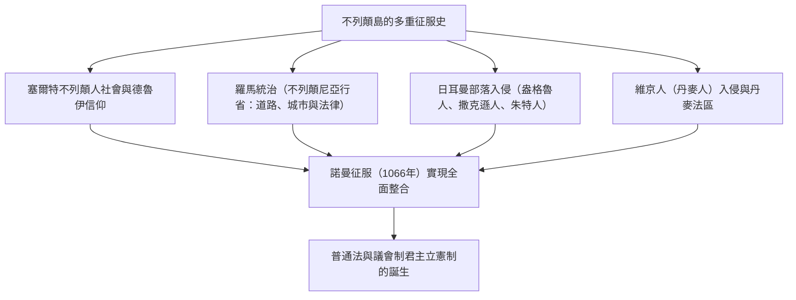
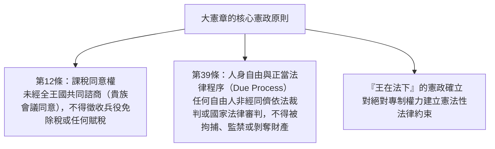
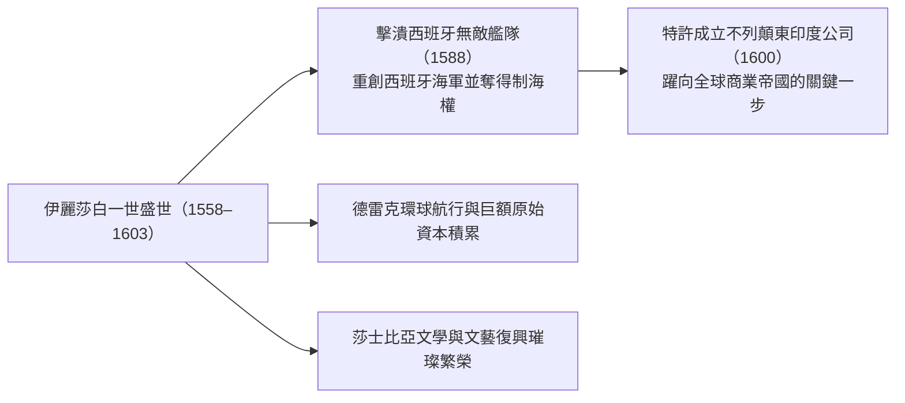
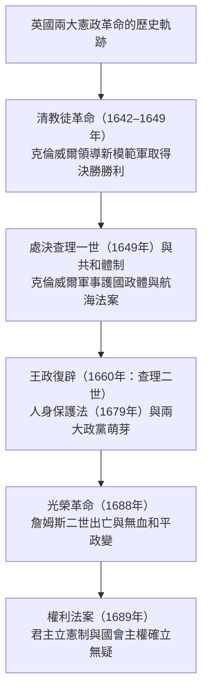
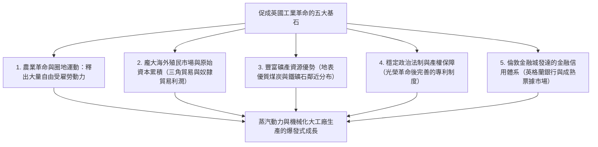
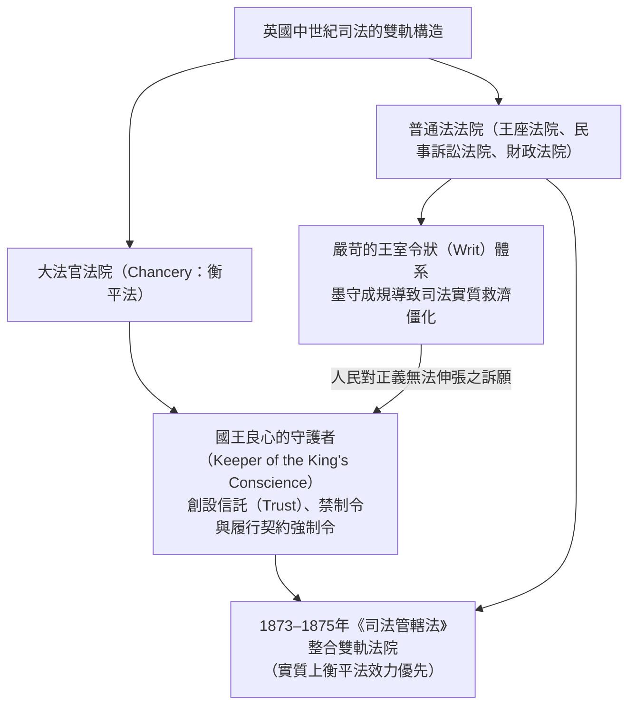
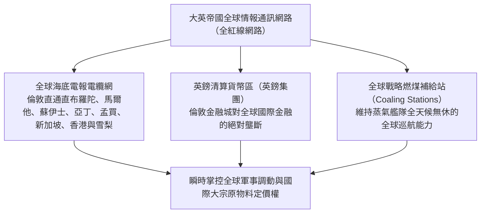
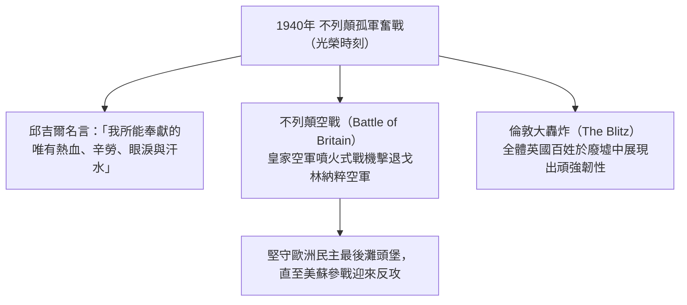
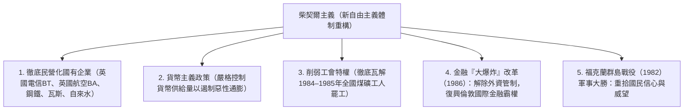
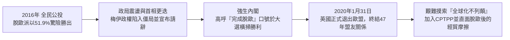

## 1. 引言：不列顛島國地緣政治與法治秩序的精神

### 1.1 塞爾特巨石文明與羅馬屬省不列顛尼亞

大不列顛島孤懸於歐洲大陸西北部的大洋之中，自古以來便歷經了大陸民族一波又一波的遷徙與征服。西元前3000年紀矗立於索爾茲伯里平原上的巨石建築群——**巨石陣（Stonehenge）**，正是沒有文字記載的早期原住民族高度發達之天文學知識與虔敬宗教信仰的結晶。

西元前1千紀，掌握鐵器文明的塞爾特諸部族（不列顛人）在此定居，發展了繁榮的農耕文明，並由德魯伊祭司主持崇敬自然的宗教儀式。西元前55年及54年，尤利烏斯·凱撒率軍兩度發動遠征；西元43年，羅馬皇帝克勞狄一世派遣龐大遠征軍展開全面征服，大不列顛島南部正式淪為羅馬帝國的行省——**不列顛尼亞（Britannia）**。

羅馬統治長達近四個世紀。以現代倫敦前身倫蒂尼恩（Londinium）為代表的規劃城市相繼建立，堅固的羅馬大道網（如沃特林大道）縱貫全島，採礦技術、公共浴場、拉丁語以及基督教相繼傳入。為阻絕北方皮克特人（加里東尼亞）的侵擾，哈德良皇帝下令修築了著名的**哈德良長城（Hadrian's Wall）**，作為帝國最北端的防禦邊界，至今仍矗立如昔。西元410年，面對西哥德人洗劫羅馬的危機，霍諾留皇帝下令羅馬軍團全面撤出不列顛尼亞，這座島嶼再度被拋入動盪不安的黑暗時代。

---

### 1.2 盎格魯-撒克遜入侵、七國時代與阿佛列大帝的奇蹟

羅馬軍團撤離後，來自北海對岸的日耳曼三大部族——盎格魯人、撒克遜人與朱特人——於5世紀中葉以排山倒海之勢渡海入侵。本土的塞爾特不列顛人被逐步驅逐至西部的威爾斯、康瓦爾以及北部的蘇格蘭山區（塞爾特人不屈抵抗的英勇傳說，後來昇華為中世紀騎士文學的傳奇名作《亞瑟王傳奇》）。

征服者們在島上割據建國，最終形成了七雄並立的**「七國時代（Heptarchy）」**：諾森布里亞、麥西亞、東盎格利亞、艾塞克斯、薩塞克斯、威塞克斯和肯特。6世紀末，教宗額我略一世派遣特使奧古斯丁（首任坎特伯里大主教）抵達，迅速推動了英格蘭的基督教化進程。

8世紀末，來自斯堪地那維亞半島的維京海盜（丹麥人）大舉入侵。他們洗劫修道院，席捲了英格蘭東半部。面對滅頂之災，西南部的威塞克斯王國挺身而出，其領袖便是英格蘭歷史上卓越的**阿佛列大帝（Alfred the Great，在位871–899年）**：
- 在**愛丁頓戰役（878年）**中重創丹麥軍隊，簽署《韋德莫爾條約》，將英格蘭一分為二（劃定丹麥人自治管轄的「丹麥法區」）。
- 為鞏固國防體制，在全境修築防禦要塞城鎮網路（Burgh），並著手組建皇家海軍雛形。
- 頒布法典，設立學校，命人將拉丁文古典名著翻譯成古英語供僧侶與平民研習，並主持編纂了《盎格魯-撒克遜編年史》。
- 身為英國歷史上唯一被尊稱為「大帝」的君王，阿佛列的統治奠定了「盎格魯人之國（England＝英格蘭）」統一民族國家的最初雛形。

---

## 2. 諾曼征服（1066年）與大憲章的法理

### 2.1 決定命運的1066年：哈斯丁戰役與諾曼王朝的建立

1066年，懺悔者愛德華逝世，英格蘭爆發王位繼承危機。賢人會議（Witenagemot）推舉哈羅德二世登基，而英吉利海峽對岸的諾曼第公爵威廉則宣稱自己擁有合法的王位繼承權，隨即集結遠征軍渡海來犯。

1066年10月14日，**哈斯丁戰役（Battle of Hastings）**爆發。
面對英格蘭步兵嚴密的「盾牆」陣型，諾曼騎兵團與弓弩部隊發起輪番猛攻。傍晚時分，哈羅德二世眼部中箭陣亡，英格蘭軍隊全線潰散。威廉在西敏寺加冕為英格蘭國王，史稱威廉一世（征服者威廉）。

**諾曼征服（Norman Conquest）**是英國歷史演進中最重大的分水嶺：
1. **地緣戰略巨變**：英格蘭徹底轉變了過往面向斯堪地那維亞北歐世界的視野，直接融入以法國和拉丁文化為核心的西歐封建大陸體系。
2. **語言文化的雙軌重構**：統治階層（貴族、宮廷與法庭）使用盎格魯-諾曼法語，被統治的平民階層使用日耳曼語系的古英語。歷經數個世紀的深度融合，詞彙極其豐富的現代「英語」應運而生。
3. **末日審判書（Domesday Book，1086年）**：威廉一世下令在全國範圍內展開詳盡的土地與財產清查，精確記錄農地、森林、牲畜、水磨坊乃至各階層人口。這項劃時代的調查，確立了遠比歐洲大陸更為嚴密、高效的中央集權封建管治體制。

---

### 2.2 亨利二世的司法改革與普通法（Common Law）的誕生

12世紀中葉，安茹伯爵亨利繼承王位，開創金雀花王朝，史稱**亨利二世（在位1154–1189年）**。這位統治著橫跨英格蘭及半個法國領土之「安茹帝國」的君主，對英國法律制度推行了革命性重構。

為打破各地領主莊園法庭各自為政、習慣法紛歧割裂的局面，亨利二世確立了由國王直屬法官巡迴審理的**巡迴法庭制度（Assize Courts）**：
- 國王法官巡歷各地，遴選並整合各地優良的習慣法與判例，建立了**「通行於全王國的單一法律體系（Common Law，即普通法）」**。
- 確立了**陪審團制度（Jury System）**的現代基礎，透過傳喚當地公正明理的市民宣誓作證來查明爭議事實。
- 奠定了不依賴國家頒布成文法典、而是仰賴法官歷來判例積累發展的「遵循先例原則（Stare Decisis）」，成為英美法系的基石。

---

### 2.3 大憲章（1215年）：「法的統治」之源起

亨利二世幼子、惡名昭彰的「無地王」約翰（在位1199–1216年）在與法國國王腓力二世的戰爭中連遭慘敗，喪失了絕大部分歐陸領地，更因與教宗依諾增爵三世交惡而被開除教籍。為籌措戰費，約翰王向貴族強行課徵高額兵役免除稅，實行殘暴專橫的統治。忍無可忍的封建貴族最終佔領倫敦發動武裝起義。

1215年6月15日，在溫莎附近的蘭尼米德草地上，起義貴族迫使約翰王在一份羊皮紙文件上蓋印簽署，這便是彪炳史冊的**《大憲章》（Magna Carta）**。

《大憲章》的非凡歷史意義，超越了中世紀封建貴族爭取自身特權的原始範疇，從根本上確立了**「即便身為最高權力者的君主亦不可任意妄為，必須服從法律」的『法治（Rule of Law）』普遍準則**。特別是第39條所蘊含的「正當法律程序（Due Process of Law）」，成為17世紀英國革命以及美國憲法權利法案的核心思想搖籃。

1295年，愛德華一世召開了**模範議會（Model Parliament）**，除貴族與高級僧侶外，首度納入了各郡騎士代表2名及自治市市民代表2名，奠定了日後英國國會上議院（貴族院）與下議院（平民院）的兩院制基本格局。

---

## 3. 百年戰爭、玫瑰戰爭與都鐸王朝的絕對君主制

### 3.1 百年戰爭（1337–1453）、黑死病與農奴制的瓦解

因爭奪法國王位繼承權及法蘭德斯毛紡織業的主導權，英格蘭與法國之間爆發了長達116年斷斷續續的「英法百年戰爭」。
- 愛德華三世、黑太子愛德華、亨利五世等英軍將領憑藉源自威爾斯的**長弓隊（Longbow）**，在克雷西戰役（1346年）與阿金庫爾戰役（1415年）中重創法國重裝騎士軍團，敲響了中世紀封建騎士階層的喪鐘。
- 隨後聖女貞德崛起扭轉戰局，至1453年英格蘭喪失了除加萊以外的所有歐陸領地，被迫退守島國。正是這場漫長戰爭，使英格蘭貴族徹底擺脫了「法蘭西領主」的身分認同，孕育了清晰的英格蘭國民意識。

在此期間的1348年，**黑死病（鼠疫大流行）**肆虐不列顛全島，奪去了三分之一至二分之一的人口：
- 勞動力極度匱乏，使得倖存農奴與受雇勞工的社會地位與工資議價能力大幅提升。
- 領主階層企圖以法令壓制薪資、強行恢復封建勞役，引發了1381年震撼全國的**瓦特·泰勒農民起義**。起義者喊出了*「當亞當耕作、夏娃織布時，誰是貴族？」*的平等呼聲，英格蘭莊園農奴制由此在歐洲大陸之前率先走向解體。

---

### 3.2 玫瑰戰爭與都鐸王朝的興起

百年戰爭戰敗後，英格蘭內部旋即陷入爭奪王位的內戰。蘭開斯特家族（紅玫瑰）與約克家族（白玫瑰）展開了長達30年的血腥傾軋，史稱**玫瑰戰爭（1455–1485年）**。
頻繁的自相殘殺與處決，令英格蘭舊有的大貴族階層近乎死傷殆盡，封建割據勢力遭受毀滅性打擊。

1485年，在博斯沃思戰役中擊殺約克家族理查三世的亨利·都鐸登基即位，開創**都鐸王朝**，史稱亨利七世。他設立「星室法院」以嚴厲整肅豪強貴族，同時大量提拔地方鄉紳（Gentry）擔任治安官（JP），奠定了近代中央集權官僚治理體制的基石。

---

### 3.3 亨利八世的宗教改革與伊麗莎白一世的黃金時代

塑造都鐸王朝歷史走向的關鍵轉折，是**亨利八世（在位1509–1547年）**所推動的宗教改革。
因教宗克勉七世拒絕宣布其與王后亞拉岡的凱瑟琳婚姻無效、阻撓其迎娶安妮·博林，亨利八世毅然與羅馬教廷決裂：
- **1534年《至尊法案》（Act of Supremacy）**：宣布英格蘭國王是英格蘭教會（聖公會/安立甘宗）在世俗人間的唯一最高首腦。
- 全面推行修道院解散與財產沒收政策，將龐大的修道院領地折價出售給新興鄉紳與城市資產階層。此舉培育了一大批在經濟利益上與王室深度綁定的新興有產階級。

歷經瑪麗一世（血腥瑪麗）殘酷迫害新教徒的倒退時期後，亨利八世之女**伊麗莎白一世（在位1558–1603年）**登基。透過《禮拜統一法》，確立了不偏不倚的「中庸之道（Via Media）」——在保留天主教傳統儀軌形式的同時，確立新教教義核心。

1588年，面對西班牙國王腓力二世派遣的「無敵艦隊」，德雷克副指揮官等人運用靈活的火船戰術結合英吉利海峽的狂風暴雨將其徹底擊潰。1600年，英國正式特許設立**東印度公司**，開啟了在南亞與亞洲的商業殖民拓殖。莎士比亞的經典劇作在環球劇場風靡倫敦，英格蘭昂首邁向海洋霸權之路。

---

## 3.6 「羊吃人」：圈地運動與伊麗莎白濟貧法的社會史

16世紀都鐸王朝的經濟社會變革，源於歐洲對英格蘭毛紡織品的旺盛需求所帶動的**「第一次圈地運動」**。

### ① 湯瑪斯·摩爾在《烏托邦》（1516年）中的深刻控訴
大地主與貴族為獲取高額利潤，動用暴力將世世代代耕作的佃農從公有地與敞田上驅逐，以樹籬圈占土地改為綿羊牧場。
曾任大法官的人文主義學者湯瑪斯·摩爾在傳世巨著《烏托邦》中，對這段資本原始積累的殘酷行徑進行了沉痛批判：

> **「你們的羊一向是那麼溫馴，吃得那麼少，據說現在變得極其貪婪、兇悍，甚至開始把人吞吃下去，把田地、房舍和城市都摧毀吞噬殆盡。」**

失去土地的流民（浪人）大批湧入倫敦等城市尋求生計，許多人因飢寒交迫行竊而被送上絞架。

### ② 伊麗莎白濟貧法（1601年）的歷史性里程碑
為平息日益嚴重的社會貧窮與動盪危機，國會於1601年頒布了劃時代的**《伊麗莎白濟貧法》（Poor Law of 1601）**：
- 以教區（Parish）為基層行政單元，課徵法定強制的**濟貧稅（Poor Rate）**。
- 將貧民嚴格劃分為三種類別進行針對性處遇：
  1. **「有工作能力的貧民」**：強制送入工作坊（Workhouse）服勞役。
  2. **「無工作能力的貧民」**（孤兒、老弱病殘）：由救濟院收容或給予生活補助。
  3. **「游手好閒者與浪人」**：拘禁於感化院予以管束懲處。
- 該法將社會救濟由單純的「宗教慈善恩惠」轉型為「國家的法律制度責任」，創立了世界最早的公法救助體系，成為20世紀貝弗里奇報告與現代英國福利國家的精神源頭。

---

## 4. 英國革命與君主立憲制的誕生

### 4.1 斯圖亞特王朝專制與清教徒革命（1642–1649年）

伊麗莎白一世終身未嫁辭世後，蘇格蘭國王詹姆斯六世入承英格蘭大統，即詹姆斯一世，斯圖亞特王朝拉開序幕。

然而，詹姆斯一世及其繼承者**查理一世**深受歐陸**「君權神授說」**影響，蔑視國會傳統，繞過國會擅自開徵造船稅等苛捐雜稅，並殘酷迫害清教徒。法學泰斗愛德華·科克爵士秉言直諫：「國王雖居萬人之上，卻在上帝與法律之下。」1628年，國會通過了著名的**《權利請願書》（Petition of Right）**，重申未經國會同意不得徵稅，嚴禁任意非法拘禁。

查理一世憤而解散國會，實施了長達11年的無國會獨裁統治。後因籌措軍費平定蘇格蘭起事，被迫重開國會。王權與國會的激化對立最終爆發為全面的內戰——**清教徒革命（英格蘭內戰）**。

在奧利佛·克倫威爾的堅定統御下，紀律森嚴的「新模範軍」徹底擊潰王軍。1649年1月30日，**特別最高法庭以「暴君、叛國者、殺人犯與國家公敵」之罪名，將查理一世公開斬首處決**，震撼了全歐洲各國君主。

英格蘭隨即廢除君主制建立共和國，但擔任「護國公」的克倫威爾推行清教嚴酷的軍事獨裁，引發社會普遍反感。1658年克倫威爾去世後局勢動盪，國會於1660年迎回查理二世，完成「王政復辟」。

---

### 4.2 光榮革命（1688年）與《權利法案》

復辟後的查理二世及其弟詹姆斯二世企圖恢復天主教統治並重走專制之路。面對危機，國會內部的兩大陣營——捍衛王權特權的**托利黨**與擁護國會權力至上的**輝格黨**屏除歧見，攜手發動政變。

1688年，國會領袖密函邀請詹姆斯二世信仰新教的女兒瑪麗及其夫婿荷蘭執政**奧蘭治親王威廉三世**率軍進駐英國。在壓倒性的民心歸向下，孤立無援的詹姆斯二世倉促流亡法國。這場未傷一人、未流一滴血便完成政權交接的政變，史稱**「光榮革命」（Glorious Revolution）**。

1689年，威廉三世與瑪麗二世共同登基，正式批准實施了由國會起草的**《權利法案》（Bill of Rights）**：
- 未經國會同意，國王不得中止法律或停止法律的執行。
- 未經國會准許，國王不得擅自徵稅。
- 國會內部享有完全的言論自由，任何法庭不得提出審問或彈劾。
- 平常時期未經國會同意，不得招募或維持常備軍。
- 國會必須定期召開。

這象徵著英國在世界上首度建立了**「國王統而不治」的君主立憲制（Constitutional Monarchy）與國會主權（Parliamentary Sovereignty）**原則。

1707年，安妮女王在位時通過《聯合法案》，英格蘭與蘇格蘭正式合併為**大不列顛王國（Kingdom of Great Britain）**。1714年漢諾威王朝喬治一世即位（因其不諳英語），羅伯特·沃波爾爵士成為首任實質首相，推行內閣向國會負責的**責任內閣制（Cabinet System）**，現代代議民主制度至此奠定完備架構。

---

## 5. 工業革命與「不列顛治世（大英帝國）」的世紀

### 5.1 躍居「世界工廠」：第一次工業革命的動力機制

18世紀後半期，人類史上首度「工業革命（Industrial Revolution）」何以在英國率先爆發？其核心在於當時僅有英國完整具備了五大得天獨厚的歷史條件：

- **棉紡織產業技術突破**：約翰·凱伊的飛梭、哈格里夫斯的珍妮紡紗機、阿克萊特的水力紡紗機、克朗普頓的走錠紡紗機以及卡特賴特的動力織布機相繼問世。
- **動力革命**：詹姆斯·瓦特於1769年大幅改良出雙動式蒸汽機。工廠自此擺脫水力地理限制，往煤礦產地周邊的現代工業城市（曼徹斯特、伯明罕）快速集中。
- **運輸革命**：喬治·史蒂芬森研發成功「火箭號」蒸汽火車（1829年）。利物浦至曼徹斯特鐵路全線通車，帶動英國鐵路網全面鋪設，社會客貨物流成本呈斷崖式下跌。

1851年，首屆世界博覽會在倫敦海德公園的宏偉鋼鐵玻璃建築**水晶宮（Crystal Palace）**盛大舉行。吸引全球超過600萬人參觀，向世界宣告了英國作為獨步全球之**「世界工廠（Workshop of the World）」**的巔峰霸權。

---

### 5.2 大英帝國（British Empire）的全球擴張與盛世

維多利亞時代（1837–1901年），在皇家海軍無可匹敵的制海權護航與全球自由貿易架構推動下，英國迎來了雄霸全球的超凡時代——**「不列顛治世（Pax Britannica）」**。

號稱「日不落帝國」的大英帝國，其疆域占據全球陸地面積的四分之一，統轄全球四分之一的人口。

| 地區 | 主要殖民地與支配領地 | 統治特質與重大歷史紀事 |
| :--- | :--- | :--- |
| **南亞** | **印度（帝國皇冠上的寶石）** | 自普拉西戰役（1757年）起由東印度公司管理。1857年印度民族大起義遭平定後，解散東印度公司，由英國君主直接統治（英屬印度帝國）。1877年維多利亞女王加冕為「印度女皇」。 |
| **東亞** | **中國（清朝）與香港** | 鴉片走私貿易引爆1840年鴉片戰爭。藉由《南京條約》（1842年）割占香港島，強迫開放通商口岸，建構領事裁判權等不平等條約體系。 |
| **非洲** | **從埃及縱貫至南非** | 1875年迪斯雷利首相主導收購蘇伊士運河股份。塞西爾·羅茲推行串聯開羅至開普敦的「縱貫非洲政策（3C計畫：開羅、加爾各答、開普敦）」。爆發激烈的波耳戰爭。 |
| **自治領** | **加拿大、澳洲、紐西蘭** | 較早給予白人移民定居地責任自治政府地位，成為日後「大英國協（Commonwealth of Nations）」的體制前身。 |

國內政壇上，保守黨領袖班傑明·迪斯雷利（推行帝國擴張外交與社會改良）與自由黨領袖威廉·格萊斯頓（堅持財政平衡、自由貿易與愛爾蘭自治）展現了成熟的兩黨民主輪替。歷經1832年、1867年與1884年三次重大的國會選制改革，選舉權逐步落實至勞工階層，漸進穩健地實現了現代普選民主。

---

## 2.4 普通法與衡平法（Equity）的雙軌架構及令狀法理

英國法律與歐陸法系（羅馬法傳承）最截然不同的精髓，在於**「普通法（Common Law）」**與**「衡平法（Equity）」**兩套平行司法審判機制的動態抗衡與整合演變。

### ① 令狀體系（System of Writs）的程序僵化
在12至13世紀普通法形成的初期，原告若要向國王普通法法院提請訴訟，必須先向王家文書署（Chancery）購買對應具體事由的官方「國王令狀（Writ）」。
然而，封建貴族擔憂國王司法權過度擴張，藉由1258年《牛津條例》嚴禁文書署自行創設新型令狀。這導致普通法陷入嚴重的「程序形式主義（Formalism）」：凡無法精準套用現成令狀範本的新型契約違約或侵權行為，普通法法院一律不予受理。

### ② 大法官法庭與「信託（Trust）」法制的誕生
在普通法形式主義下敗訴或申訴無門的民眾，紛紛向代表正義與慈悲源頭的國王遞交「請願書（Petition）」。國王將此類案件委由首席重臣、被尊為「國王良心守護者」的**大法官（Lord Chancellor）**專責裁斷。
- 大法官審理案件不拘泥於僵硬的令狀文字，完全依據自然正義與「良心（Conscience）」提供靈活公道的個案救濟，這套法理體系即為**「衡平法（Equity）」**。
- 普通法僅能判定事後的金錢賠償，而衡平法創設了**「實際履行令（Specific Performance）」**（強制違約方履約）與**「禁制令（Injunction）」**（勒令侵害者停止侵害行為）。
- 為因應十字軍遠征騎士託付友人代管領地以照顧眷屬的現實需求，衡平法開創了劃分「名義所有權」與「實質受益權」的**「信託（Trust）」**法理，堪稱人類法律史上最富智慧的制度發明之一。

---

## 3.4 征服與邊陲臣服：蘇格蘭與愛爾蘭的悲愴抗爭

英格蘭的擴張之路，同時也是一部對周邊塞爾特鄰近邦國施以無情軍事侵略與殖民壓迫的歷史。

### ① 蘇格蘭獨立戰爭：華萊士與布魯斯
13世紀末，號稱「蘇格蘭之槌」的英格蘭國王愛德華一世趁蘇格蘭王位紛爭揮師北伐，強行將象徵蘇格蘭君主登基的聖石「命運之石（斯昆石）」掠奪至倫敦。
- 1297年：鄉紳威廉·華萊士（電影《英雄本色》主角原型）率領農民揭竿起義，在史特靈橋之役大破英格蘭重裝騎兵。
- 1314年：羅伯特·布魯斯（蘇格蘭國王羅伯特一世）在著名的**班諾克本戰役**中，以長矛方陣（Schiltron）包圍全殲數倍於己的英格蘭主力部隊，迫使英格蘭於1328年簽訂《愛丁堡-北安普敦條約》，正式承認蘇格蘭獨立主權。

### ② 克倫威爾血腥征服愛爾蘭與馬鈴薯大饑荒
相較之下，愛爾蘭的命運則更加悽慘：
- 1649年：清教徒革命勝利後，奧利佛·克倫威爾親率大軍遠征愛爾蘭，在德羅赫達與韋克斯福德對守軍、天主教神父及百姓展開無情屠殺。當局強行沒收本土愛爾蘭天主教徒的優良農地，轉賜給新教英格蘭及蘇格蘭移民（阿爾斯特拓殖）。本土愛爾蘭人淪為自家故土上的底層佃農。
- **愛爾蘭大饑荒（1845–1852年）**：作為愛爾蘭主糧的馬鈴薯爆發毀滅性真菌枯萎病。
  - 信奉絕對自由放任（Laissez-faire）市場教條的英國政府拒絕積極救濟，坐視大量愛爾蘭產穀物持續外銷至英格蘭本土。
  - 導致超過100萬人活活餓死或病死，逾100萬人被迫搭乘簡陋破敗的「棺材船」逃荒移民北美（奠定了日後包括甘迺迪家族在內龐大的美籍愛爾蘭裔社群）。愛爾蘭人口銳減近半，留下了對英國統治難以磨滅的歷史傷痛。

---

## 5.5 地緣情報霸權：海底電纜網與「大博弈」

19世紀大英帝國的「不列顛治世」，不僅仰賴戰艦砲火，更立基於全球**最早建構之跨洲通信與情報基礎設施**。

- **全紅線網路（All-Red Line）**：英國獨占古塔膠絕緣電纜的核心專利與鋪設工程，鋪設了一張連通所有大英帝國殖民領地（在英國世界地圖上傳統標為紅色）的海底電報網。由於所有電纜登陸站均設於英國實質掌控的國土上，戰時絕無遭敵國監聽或截斷之顧慮。
- **大博弈（The Great Game）**：19世紀中葉至20世紀初，為爭奪中亞樞紐（阿富汗、波斯、中國西藏）的控制權，南下擴張的沙皇俄國與英屬印度帝國展開了長達數十年的秘密情報與勢力角逐。這場在吉卜林小說《金姆》中躍然紙上的爭霸戰，深刻催生了現代地緣政治學（如麥金德「心臟地帶」學說）。

---

## 6. 兩次世界大戰與帝國的黃昏

### 6.1 第一次世界大戰與國力的沉重消耗

20世紀初，面對德意志帝國工業實力的激增與公海艦隊擴張的軍備挑戰，英國被迫揚棄長期奉行的「光榮孤立（Splendid Isolation）」政策，相繼簽署英日同盟（1902年）、英法協約（1904年）以及英俄協約（1907年），構築起抗衡同盟國的三國協約陣營。

1914年8月，第一次世界大戰爆發：
- 在法國北部的西線泥淖中（索姆河戰役、帕斯尚爾戰役），在機關槍、毒氣與密集砲火的洗禮下，英國整整一代優秀青年（「失落的一代」）戰死沙場。
- 儘管透過海上封鎖與日德蘭海戰壓制了德國公海艦隊，但極度龐大的戰費支出耗盡了英國的金融儲備，使英國從世界首要「債權國」淪落為背負對美巨債的「債務國」。

戰後1920年代，工黨崛起取代自由黨成為主要在野力量，麥克唐納組建了首任工黨內閣。1928年，英國正式確立年滿21歲男女平等的完全普選權。然而，愛爾蘭在1916年復活節起義後爆發英愛戰爭，於1922年正式成立「愛爾蘭自由邦」（僅北愛爾蘭6郡仍屬聯合王國管轄）。

---

### 6.2 第二次世界大戰與邱吉爾的孤軍奮戰

1930年代，大蕭條陰影下納粹德國強勢崛起，張伯倫首相推行以1938年《慕尼黑協定》為代表的「綏靖政策（Appeasement Policy）」企圖避戰，終告徹底破滅。

1939年9月，希特勒閃擊波蘭，第二次世界大戰爆發。1940年5月，當法國在納粹裝甲閃擊下迅速潰敗、西歐大陸全面淪陷的至暗關頭，**溫斯頓·邱吉爾（Winston Churchill）**臨危受命出任首相。

邱吉爾振奮人心的廣播演說喚醒了全國軍民的抗戰意志。年輕的英國皇家空軍（RAF）飛行員憑藉雷達預警網絡奮勇禦敵，粉碎了納粹奪取制空權的企圖（*「在人類戰爭史上，從未有如此多的人對如此少的人欠下如此巨大的恩情」*）。儘管經歷阿拉曼戰役與盟軍全面反攻迎來最後勝利，但英國本土遭受嚴重轟炸破壞，國力極度疲憊枯竭。

---

### 6.3 「從搖籃到墳墓」與大英帝國的解體

在1945年夏季的戰後大選中，戰爭英雄邱吉爾率領的保守黨意外吞下慘敗，克萊門特·艾德禮領導的工黨取得壓倒性勝利。歷經戰火摧殘的英國人民渴望的不再是昔日帝國的虛榮，而是戰後的社會安定與民生福利：
- **福利國家體系奠基**：以戰時提出的《貝弗里奇報告》為藍本，確立了**「從搖籃到墳墓（From the cradle to the grave）」**的全方位社會安全保障。1948年，向全體國民提供免費醫療照護的**國民健保署（NHS）**正式創立；煤礦、鐵路、電力、鋼鐵等命脈產業相繼收歸國有。
- **帝國解體與去殖民化浪潮**：
  - 1947年：經甘地領導的非暴力不合作運動，「印巴分治」，大英帝國失去了最重要的殖民核心。
  - 1956年**蘇伊士運河危機（第二次中東戰爭）**：針對埃及總統納瑟宣布將蘇伊士運河收歸國有，英法聯手以色列發動軍事干預，但在美蘇超強兩國的嚴厲施壓與金融圍堵下被迫無條件撤軍。這場挫敗宣告英國徹底喪失全球超級大國地位，降為二流區域性國家。

---

## 7. 從柴契爾主義到「第三條路」與脫歐

### 7.1 「英國病」與柴契爾的鐵腕新自由主義改革

進入1970年代，龐大的福利支出、強勢工會的無休止罷工以及國有企業的低落效能，使英國陷入了高通膨與經濟停滯並存的惡性滯脹——通稱**「英國病（British Disease）」**。1978至1979年的嚴冬，公務員、清潔工乃至公墓工人爆發全境大罷工，垃圾堆滿街頭，公共機能全面癱瘓，史稱**「不滿的冬天」**。

在國家陷入絕望的泥淖之際，1979年，英國迎來了史上首位女性首相——**瑪格麗特·柴契爾（Margaret Thatcher，鐵娘子）**。

柴契爾的改革猛藥帶來了劇烈的社會代價：北部傳統工業區沒落、失業率攀升、貧富差距擴大。然而，這套政策徹底重振了英國經濟的競爭力，並讓倫敦重新躍居為與紐約並駕齊驅的全球頂尖金融樞紐。

---

### 7.2 東尼·布萊爾與「第三條路」

1997年，在野18年的工黨在東尼·布萊爾（Tony Blair）率領下重返執政。布萊爾揚棄了僵化的國有化社會主義理念，融合柴契爾自由市場的活力機制，同時擴大在教育與醫療（NHS）領域的公共投資，提出了風行一時的**「第三條路（The Third Way）」**：
- 推動地方權限下放（Devolution），相繼成立蘇格蘭議會與威爾斯議會。
- 1998年促成了具歷史意義的**《受難日協定》（貝爾法斯特協議）**，結束了北愛爾蘭長達三十年的流血恐怖宗派衝突。
- 然而，布萊爾在2003年伊拉克戰爭中緊跟美國小布希政府派兵參戰，遭譏為美國的「哈巴狗」，為其執政聲譽蒙上了難以抹滅的陰影。

---

### 7.3 脫歐（Brexit）震撼與21世紀的英國

自1973年加入歐洲各共同體（EC）以來，英國對布魯塞爾歐盟體系所推動的超國家政治一體化始終心存芥蒂（堅決不加入歐元區及申根協定）。

2010年代，伴隨來自東歐與中東的大量移民衝擊以及對主權流失的擔憂，**「奪回掌控權（Take Back Control）」**的呼聲日益高漲。2016年6月23日，大衛·卡麥隆首相舉行的全民公投中，脫歐派以 $51.9\%$ 對 $48.1\%$ 的得票率贏得戲劇性勝利（**Brexit，英國脫歐**）。

2020年1月31日，英國正式脫離歐洲聯盟。
然而，脫離歐洲單一市場不可避免地帶來了嚴峻的供應鏈中斷、缺工、通膨壓力，加上蘇格蘭再度浮現的獨立公投聲浪及《北愛爾蘭議定書》的複雜糾葛，當代的英國正於尋求全球新定位與防止國家裂解的艱險道路上前行。

---

## 5.6 勞工運動的浪潮：從盧德運動到憲章運動

在工業革命璀璨繁榮的背面，傳統工匠與底層勞工承受著機械替代與赤貧生活的無情衝擊。

### ① 盧德運動（Luddite Movement：1811–1816年）
英格蘭北部的紡織工匠在傳說中的「內德·盧德將軍」號召下組織秘密會社，於深夜時分用鐵錘搗毀剝奪他們生計的蒸汽織布機與剪絨機。政府動用正規軍強力鎮壓，並於1812年通過《毀壞機器法》，將破壞機器罪名直接處以死刑。

### ② 憲章運動（Chartism：1838–1848年）
1832年第一次選舉改革僅將投票權擴充至城市資產階級，將工人階級完全摒除在外，引發了人類史上初次大規模勞工階級的組織化政治運動。
威廉·洛維特等人起草了著名的**《人民憲章》（People's Charter）**，提出了名垂青史的**六大訴求**：

1. **廢除財產門檻，落實成年男子普選權**
2. **實施無記名秘密投票**（免受地主雇主威脅）
3. **取消國會議員候選人的財產資格限制**（使貧困勞工亦能參選）
4. **實行國會議員支薪制度**（讓無產階級得以專職問政）
5. **劃分平等對稱選區**（依人口比例公平分配席次）
6. **落實國會每年全面改選**（杜絕腐敗並迅速反映民意）

雖然國會先後三次輕蔑地否決了匯集數百萬人連署的請願書，但在19世紀末至20世紀初，除「每年改選」之外的五項訴求全數經由立法化為具體法律，奠定了現代英國民主憲政的不可動搖之基石。

---

## 7.5 王室的現代演進：從溫莎王朝的誕生到伊麗莎白二世的世紀

英國君主制在現代社會之所以能長盛不衰、深受全民愛戴，源於其在20世紀所展現的高超生存智慧與親民適應力。

### ① 閃電更名為「溫莎家族」（House of Windsor，1917年）
第一次世界大戰期間，面對國內強烈的反德浪潮，喬治五世毅然斷絕了源自德國的「薩克森-科堡-哥達」家族名稱，改以歷史悠久的王室居城命名為充滿純粹英倫色彩的**「溫莎家族」**。身為德皇威廉二世表兄的英國國王，堅決選擇與國民情感站在同一陣線。

### ② 愛德華八世「不愛江山愛美人」（1936年）
愛德華八世執意迎娶兩度離異的美國女子辛普森夫人，遭到國教會與鮑德溫首相內閣的強烈反對。新王在即位僅325天後便斷然選擇遜位退位，將王冠交予克服嚴重口吃的胞弟喬治六世（電影《王者之聲》主角）。這場憲政危機再次確立了明確底線：王室成員亦必須遵從民選責任內閣之輔弼諮詢。

### ③ 伊麗莎白二世70年的傳奇在位（1952–2022年）
1952年，年僅25歲的伊麗莎白二世繼位，直至2022年以96歲高齡辭世，歷經整整70載歲月，創下英國歷史上在位最久的紀錄（白金禧年）。
歷經大英帝國的解體、冷戰風雲、去工業化的劇痛以及王室私生活的風波，她終生秉持「無私奉獻」與「政治中立」的崇高準則，成為凝聚動盪中聯合王國人民不可或缺的精神中流砥柱。

---

## 8. 結論：綿延不斷的傳統與漸進式改革的智慧

貫穿英國千年歷史的最獨特奇蹟在於：**即便未曾制定一部成文憲法，英國卻建構並維繫了全人類歷史上最穩定、最具韌性的法治秩序與議會民主典範**。

不同於法國大革命藉由流血革命摧毀舊有體制、在廢墟中重新建構共和國的激進途徑，英國人始終在古老的習慣、法院判例以及歷史憲章（《大憲章》《權利法案》）中尋覓正當性根源，依循現實變革的需要逐步修補改良，堅毅地踏行著**「漸進主義改革（Incremental Reform）」**的道路。

這場由中世紀抵制國王暴政揭開序幕的自由追求：
- 經由普通法法官的判例錘鍊為公民日常行使的權利，
- 經由國會先驅的不屈爭取提升為最高統治主權，
- 經由工業革命勞工的浴血奮戰普及為全體國民的普選權，
- 最終由戰後福利國家發展為庇護社會弱勢的安全保障網絡。

即便今日的不列顛已從往昔雄霸世界的日不落帝國，轉變為在歐洲大陸與大西洋之間尋找新定位的島國，但它銘刻在人類文明史冊上的**「法治原則」「議會治理」與「個人尊嚴」**的燈火，依然是永恆照亮全球自由社會的輝煌燈塔。
