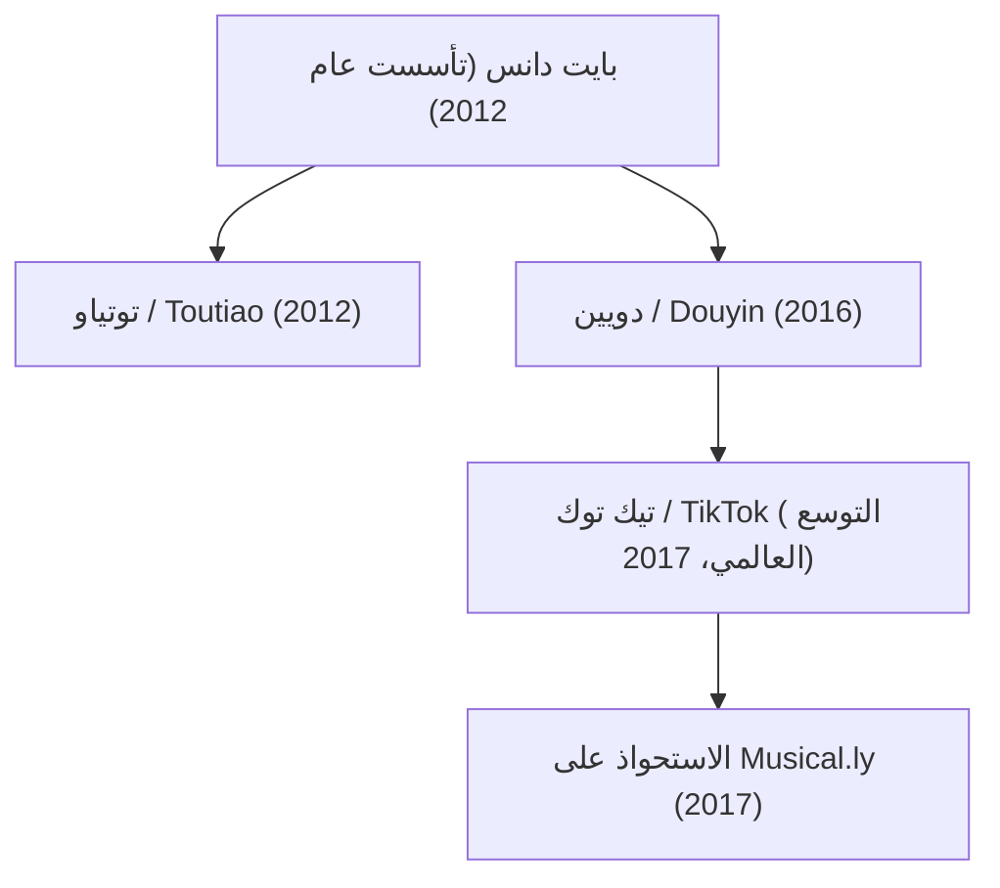

## 1. المقدمة: اليونيكورن الذي أعاد كتابة قواعد التكنولوجيا العالمية

في المشهد التكنولوجي للقرن الحادي والعشرين، لم تشهد الصناعة صعوداً لأي شركة يتميز بنفس السرعة والشراسة التنافسية والأثر الثقافي العالمي مثل شركة بايت دانس (ByteDance - 字节跳动). في أقل من عقد من الزمان، تحولت هذه الشركة الناشئة من شقة سكنية متواضعة مكونة من أربع غرف في بكين إلى أعلى شركة تقنية خاصة قيمةً في العالم. واستطاع منتجها الدولي الرائد، تيك توك (TikTok)، جذب مئات الملايين من المستخدمين من جيل الشباب حول العالم، محطماً الاحتكار التاريخي الذي فرضه عمالقة وادي السيليكون مثل ميتا (فيسبوك وإنستغرام) وألفابت (غوغل ويوتيوب).

يقدم هذا المقال استعراضاً شاملاً وتاريخياً لمسيرة بايت دانس: بدءاً من فلسفتها المبتكرة في التوزيع الخوارزمي، مروراً بهيكلها التنظيمي الفريد وإطلاق دويين (Douyin) وتيك توك، وصولاً إلى صفقة الاستحواذ الذكية على ميوزيكالي (Musical.ly) وصمودها في وجه العواصف الجيوسياسية المعقدة.

## 2. البدايات والتأسيس: رؤية تشانغ يي مينغ والتوزيع القائم على الخوارزميات

بدأت رحلة بايت دانس في أوائل عام 2012 في العاصمة الصينية بكين على يد مهندس البرمجيات الشاب تشانغ يي مينغ (Zhang Yiming)، البالغ من العمر آنذاك 29 عاماً. بعد تخرجه في هندسة البرمجيات من جامعة نانكاي وعمله في منصات إنترنت رائدة مثل محرك بحث السفر Kuxun ومنصة التدوين المصغر المبكرة Fanfou، توصل تشانغ إلى قناعة استشرافية حاسمة: *إن ثورة الهواتف الذكية ستغير كلياً الطريقة التي يكتشف بها البشر المعلومات ويستهلكونها.*

في عام 2012، كان اكتشاف المحتوى الرقمي يعتمد على نموذجين رئيسيين:
1. **نموذج البحث (Pull-based)**: حيث يبحث المستخدم بنفسه عن الكلمات المفتاحية في محركات مثل غوغل أو بايدو.
2. **نموذج العلاقات الاجتماعية (Push-based)**: حيث يتلقى المستخدم المحتوى الذي يشاركه أصدقاؤه أو الحسابات التي يتابعها على شبكات مثل فيسبوك وتويتر وسي بي سي ويبو.

طرح تشانغ يي مينغ نموذجاً ثالثاً ثورياً: **التخصيص الفائق القائم على التعلم الآلي البحت دون الحاجة إلى شبكة علاقات اجتماعية**. ورأى أنه لا ينبغي إجبار المستخدم على البحث أو بناء قائمة متابعة يدوية؛ بل يجب على خوارزميات الذكاء الاصطناعي مراقبة سلوكيات المستخدم الدقيقة والتنبؤ باهتماماته الخفية لتقديم المحتوى الأنسب له بشكل تلقائي وفوري.

### انطلاق منصة توتياو (Jinri Toutiao)

في أغسطس 2012، أطلقت بايت دانس تطبيقها الإخباري الأول "جينري توتياو" (عناوين اليوم). لم يعتمد التطبيق على أي محررين أو صحفيين بشريين؛ بل أدارت الخوارزميات العملية بالكامل. قام المحرك بجمع ملايين المقالات وتصنيفها وتحليل تفاعل المستخدمين معها في الوقت الفعلي: معدل النقر، والوقت المستغرق في القراءة، وسرعة التمرير، والتعليقات، وحتى أوقات الاستخدام خلال اليوم.

خلال أشهر قليلة، تحول توتياو إلى أحد أكثر التطبيقات الإخبارية استخداماً وربحية في الصين، مما وفر تدفقات نقدية ضخمة دعمت توسع بايت دانس اللاحق في مجال الفيديو القصير.

## 3. التحول إلى الفيديو القصير وولادة دويين (2016)

بحلول عام 2015، أدرك تشانغ يي مينغ أن شبكات الاتصال بالإنترنت أصبحت أسرع وأرخص، وأن شاشات وكاميرات الهواتف الذكية تتطور بسرعة، مما يعني تحول اهتمام الجماهير من النصوص والصور الثابتة إلى مقاطع الفيديو العمودية الغامرة.

في سبتمبر 2016، أطلقت الشركة تطبيقاً باسم "A.me"، والذي سرعان ما تم تغيير اسمه إلى **دويين (Douyin - 抖音)**. صُمم التطبيق ليكون منصة لمقاطع الفيديو العمودية مدتها 15 ثانية، مما خفّض حاجز الدخول لإنشاء المحتوى وقدم مكتبة واسعة من الموسيقى المرخصة والمؤثرات المتزامنة مع الإيقاع وتقنيات تثبيت الفيديو الذكية.

حقق دويين نجاحاً باهراً بين الشباب في المدن الصينية. وبدلاً من تصفح صور المعاينة التقليدية، ابتكر دويين **شريط التمرير العمودي اللانهائي (Infinite Vertical Swipe)**. أصبح استهلاك المحتوى تجربة سلسة وتلقائية: بمجرد فتح التطبيق يبدأ تشغيل الفيديو بملء الشاشة مع الصوت، ولا يتطلب الانتقال إلى الفيديو التالي سوى سحبة إصبع واحدة دون أي عناء ذهني.

## 4. استراتيجية العولمة: إطلاق تيك توك وصفقة Musical.ly الكبرى (2017)

على عكس العديد من شركات التقنية الصينية التي كانت تؤجل التوسع الدولي حتى تشبع السوق المحلية، تبنت بايت دانس استراتيجية "عالمية منذ اليوم الأول". في مايو 2017، أطلقت الشركة النسخة الدولية لتطبيق دويين تحت اسم **تيك توك (TikTok)**.

ولكن بناء قاعدة جماهيرية واسعة في الأسواق الغربية من الصفر كان يتطلب وقتاً طويلاً. وفي نوفمبر 2017، اتخذ تشانغ يي مينغ خطوة استراتيجية جريئة، حيث استحوذت بايت دانس على تطبيق **Musical.ly** مقابل نحو مليار دولار—وهو تطبيق فيديو متزامن مع الشفاه يمتلك قاعدة مستخدمين نشطة تتجاوز 60 مليون مراهق في أمريكا الشمالية وأوروبا.

وفي أغسطس 2018، أغلقت بايت دانس تطبيق Musical.ly نهائياً ودمجت جميع حساباته وقواعد بياناته وملايين صناع المحتوى فيه مباشرة داخل تيك توك.

منحت هذه الخطوة تيك توك قاعدة جماهيرية ضخمة وفورية في الأسواق الغربية. وبفضل الحملات التسويقية المكثفة وقوة محرك التوصيات الخوارزمي، أصبح تيك توك التطبيق الأكثر تحميلاً في العالم بحلول عام 2018، وتجاوز حاجز مليار مستخدم نشط شهرياً في عام 2021.

## 5. المحرك الخوارزمي: الحصن التنافسي الحقيقي لبايت دانس

تفوقت بايت دانس على عمالقة وادي السيليكون بفضل اختلاف جوهري في الفلسفة الهندسية لتوزيع المحتوى:

- **الرسم البياني الاجتماعي (Meta, Twitter/X)**: يرتبط توزيع المحتوى بالأشخاص الذين تعرفهم وتتابعهم، مما يقيد وصول المنشورات بشبكة العلاقات.
- **رسم بياني الاهتمامات / المحتوى (TikTok)**: يعتمد التوزيع كلياً على القيمة الذاتية للمحتوى ومدى جاذبيته. تقيم الخوارزمية كل فيديو بمعزل عن عدد متابعي صاحبه، وتعرضه على المستخدمين الذين تتطابق سلوكياتهم مع موضوع الفيديو.

رياضياً، يمكن نمذجة احتمالية تفاعل المستخدم $P(E)$ مع فيديو معين عبر الشبكات العصبية العميقة للتنبؤ بنسبة النقر ومدة المشاهدة:

$$ P(E) = \sigma(W^T X + b) $$

حيث:
- $X$ هو متجه سمات متعدد الأبعاد يدمج بيانات المستخدم (سجل التفاعل، معدل إكمال الفيديوهات المشابهة)، وخصائص الفيديو (الإيقاع الصوتي، علامات الرؤية الحاسوبية، التضمين الدلالي البصري)، والسياق (نوع الجهاز، الموقع، الوقت).
- $W$ هي مصفوفة أوزان النموذج التي يتم تحديثها باستمرار.
- $\sigma$ تمثل دالة التنشيط (مثل السيجمويد) التي تحدد احتمالية التفاعل.

تراقب خوارزمية تيك توك إشارات التفاعل بمقياس الأجزاء من الثانية:
- هل توقف المستخدم قليلاً أثناء التمرير؟
- هل شاهد المقطع كاملاً حتى النهاية (completion rate)؟
- هل أعاد مشاهدة الفيديو مرة أخرى (loop rate)؟
- بعد كم ثانية انتقل إلى الفيديو التالي؟

يتيح هذا النظام لأي صانع محتوى جديد لا يملك أي متابع أن يحقق ملايين المشاهدات بين عشية وضحاها إذا حاز الفيديو على تفاعل إيجابي قوي من الفئات الأولى التي شاهدته.

## 6. الابتكار التنظيمي: نموذج "مصنع التطبيقات"

يقف وراء السرعة الهائلة لبايت دانس هيكل إداري فريد يُعرف باسم **"مصنع التطبيقات" (Middle Platform / 中台)**. فبدلاً من تقسيم الشركة إلى وحدات عمل منعزلة، جمعت بايت دانس مواردها في ثلاث منصات مركزية قوية:
1. **البنية التحتية المشتركة للذكاء الاصطناعي والخوارزميات**
2. **محرك موحد لاكتساب المستخدمين والتسويق الدولي**
3. **أنظمة الإعلانات وتحقيق الدخل المدمجة**

يتيح هذا النموذج للفرق الصغيرة والمستقلة ابتكار واختبار تطبيقات جديدة في غضون أسابيع قليلة. إذا أظهر التطبيق الجديد تفاعلاً خوارزمياً قوياً، توجه المنصة المركزية استثمارات ضخمة لتوسيعه عالمياً. أما إذا تعثر، فيتم إيقافه فوراً دون أن يؤثر ذلك على كفاءة الشركة.

أتاح هذا النموذج لبايت دانس التوسع في عدة قطاعات:
- **برمجيات الأعمال والتعاون (SaaS)**: إطلاق منصة "Lark" (Feishu) الشاملة التي تدمج المراسلة والوثائق التعاونية والاجتماعات الافتراضية.
- **التجارة الإلكترونية الاجتماعية**: إطلاق "TikTok Shop" ومتاجر دويين، مما دمج تجربة التسوق المباشر أثناء مشاهدة مقاطع الفيديو وحقق نجاحاً هائلاً في جنوب شرق آسيا والأسواق الغربية.
- **ألعاب الفيديو**: تأسيس قطاع "Nuverse" لتطوير ونشر الألعاب الإلكترونية.
- **الواقع الافتراضي**: الاستحواذ على شركة "Pico" لتصنيع نظارات الواقع الافتراضي في عام 2021 لتعزيز حضورها في الحوسبة المكانية.

## 7. العواصف الجيوسياسية ومعركة البقاء

وضع النجاح العالمي غير المسبوق لشركة بايت دانس إياها في قلب الحرب التكنولوجية والباردة بين الولايات المتحدة والصين.

في عام 2020، وعقب توترات حدودية، فرضت الحكومة الهندية حظراً مفاجئاً على تطبيق تيك توك وعشرات التطبيقات الصينية الأخرى لدواعٍ أمنية، مما أفقد المنصة أكبر أسواقها الخارجية من حيث عدد المستخدمين (نحو 200 مليون مستخدم) في ليلة واحدة.

وفي الوقت نفسه في الولايات المتحدة، تصاعدت المخاوف المتعلقة بالأمن القومي وخصوصية البيانات:
- هل يمكن للحكومة الصينية المطالبة بالوصول إلى بيانات المستخدمين الأمريكيين؟
- هل يمكن استخدام الخوارزميات للتأثير على الرأي العام الغربي؟

ولمواجهة هذه الشكوك، أطلقت بايت دانس مبادرة بمليارات الدولارات باسم **"Project Texas"**، عقدت بموجبها شراكة مع شركة أوراكل (Oracle) لتخزين جميع بيانات المستخدمين الأمريكيين على خوادم سحابية محلية خاضعة لتدقيق مستقل. كما أطلقت في أوروبا مبادرة مماثلة بعنوان **"Project Clover"**.

ورغم هذه الإجراءات، أقر الكونغرس الأمريكي في أبريل 2024 قانوناً يطالب بايت دانس ببيع عمليات تيك توك في الولايات المتحدة لكيان غير خاضع للصين أو مواجهة الحظر التام في البلاد. ورفعت بايت دانس دعوى قضائية أمام المحاكم الفيدرالية الأمريكية مستندة إلى التعديل الأول للدستور المتعلق بحرية التعبير، لتبدأ معركة قانونية وتاريخية سترسم ملامح مستقبل الإنترنت العالمي.

## 8. الخاتمة: المستقبل الخوارزمي والمجتمع المعاصر

تُعد قصة بايت دانس برهاناً ساطعاً على قدرة الذكاء الاصطناعي المتقدم على تحدي الاحتكارات التكنولوجية الراسخة. وقد أثبتت رؤية تشانغ يي مينغ—بأن الآلات قادرة على ربط البشر بالمحتوى والترفيه بكفاءة تفوق الشبكات الاجتماعية التقليدية—صحتها على أوسع نطاق عالمي.

ومع ذلك، أثار هذا الصعود نقاشات عالمية عميقة حول تأثير الخوارزميات على الصحة النفسية للأجيال الشابة، والاعتماد الرقمي، ومخاطر تفكك الإنترنت المفتوح تحت وطأة الصراعات الجيوسياسية.

ومهما كانت مآلات الصراعات السياسية، فإن بايت دانس قد غيرت بالفعل وبشكل جذري صناعة الإعلام والتواصل الرقمي، تاركةً بصمة راسخة كواحدة من أكثر المحطات جرأة وإثارة للجدل في تاريخ التكنولوجيا الحديثة.
