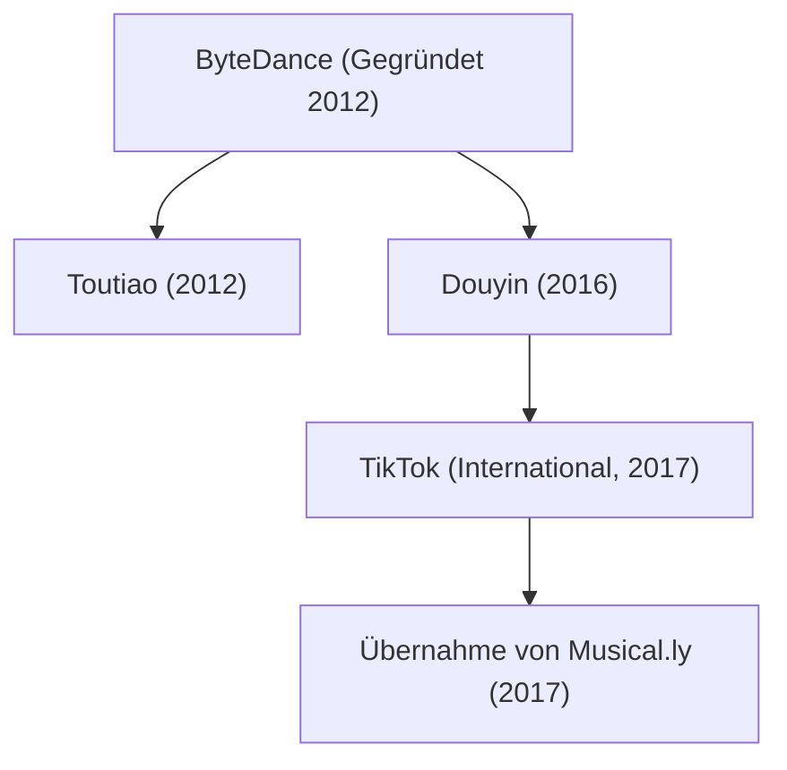

## 1. Einleitung: Das Einhorn, das die weltweite Technologielandschaft umkrempelte

In der Wirtschaftsgeschichte des 21. Jahrhunderts gibt es kaum ein Unternehmen, das mit einer solchen Wucht, Geschwindigkeit und kulturellen Tragweite gewachsen ist wie ByteDance (字节跳动). Binnen weniger Jahre entwickelte sich das Start-up aus einer schlichten Pekinger Vierzimmerwohnung zum wertvollsten privaten Technologiekonzern der Welt. Sein internationales Aushängeschild TikTok begeisterte weltweit Hunderte Millionen junger Menschen und brach das langjährige Monopol der Silicon-Valley-Giganten Meta (Facebook/Instagram) und Alphabet (Google/YouTube).

Dieser Artikel zeichnet die Geschichte von ByteDance detailliert nach: von den algorithmischen Anfängen und der einzigartigen Organisationsstruktur über den kometenhaften Aufstieg von Douyin und TikTok bis hin zur Übernahme von Musical.ly und den geopolitischen Zerreißproben der Gegenwart.

## 2. Die Anfänge: Zhang Yimings Vision der algorithmischen Inhaltsverteilung

Die Erfolgsgeschichte begann Anfang 2012 in Peking mit dem damals 29-jährigen Software-Ingenieur Zhang Yiming. Nach seinem Informatikstudium an der Nankai-Universität und Stationen bei verschiedenen chinesischen Start-ups (darunter dem Reiseportal Kuxun und dem Kurznachrichtendienst Fanfou) gelangte Zhang zu einer bahnbrechenden Erkenntnis: *Der weltweite Siegeszug des Smartphones wird die Art und Weise, wie Menschen Informationen konsumieren, grundlegend verändern.*

Damals dominierte das Internet zweierlei Mechanismen:
1. **Die aktive Suche (Pull-Prinzip)**: Nutzer tippen gezielte Suchbegriffe in Suchmaschinen wie Google oder Baidu ein.
2. **Das soziale Netzwerk (Push-Prinzip)**: Nutzer abonnieren Freunde und Kanäle auf Plattformen wie Facebook, Twitter oder Weibo und lesen deren Beiträge.

Zhang Yiming erkannte ein drittes Paradigma: **reine, maschinell gelernte Personalisierung ohne sozialen Beziehungs-Graphen**. Seiner Ansicht nach sollten Nutzer weder aktiv suchen noch mühsam Freundeslisten pflegen müssen; stattdessen sollte künstliche Intelligenz das Nutzungsverhalten in Echtzeit analysieren und jedem Individuum maßgeschneiderte Inhalte vollautomatisch präsentieren.

### Der Durchbruch mit Toutiao (Schlagzeilen von heute)

Im August 2012 brachte ByteDance sein erstes Leitprodukt heraus: „Jinri Toutiao“ (Schlagzeilen von heute). Toutiao beschäftigte keine traditionelle Redaktion, sondern überließ die Auswahl vollständig selbstlernenden Algorithmen. Das System sammelte und analysierte Texte aus dem gesamten Web und wertete Verweildauer, Klickraten, Scrollgeschwindigkeit und Standortdaten in Millisekunden aus.

Innerhalb kürzester Zeit erreichte Toutiao eine rekordverdächtige Nutzerbindung und wuchs zu einer der rentabelsten Nachrichten-Apps Chinas heran. Die daraus resultierenden Gewinne bildeten das finanzielle Fundament für ByteDances weltweiten Expansionskurs.

## 3. Die strategische Weichenstellung: Kurzvideos und die Geburt von Douyin (2016)

Um 2015 erkannte Zhang Yiming den nächsten gewaltigen Medienumbruch: Durch schnellere 4G-Mobilfunknetze und bessere Smartphone-Kameras verlagerte sich der Medienkonsum rasant von Text und Bild hin zu vertikalen Kurzvideos im Vollbildformat.

Im September 2016 launchte ByteDance die App A.me, die kurz darauf in **Douyin (抖音)** umbenannt wurde. Douyin war als benutzerfreundliche Plattform für 15-sekündige Musikclips konzipiert, die das Erstellen eigener Inhalte radikal vereinfachte: mit lizenzierter Popmusik, temposynchronen Schnittvorlagen und hochentwickelten Filtern.

Der entscheidende Geniestreich war die Abkehr von klassischen Vorschaubildern zugunsten des **endlosen vertikalen Wischens (Infinite Swipe)**. Öffnet man die App, startet das Video sofort im Vollbildmodus und mit Ton; eine einzige Wischbewegung genügt, um das nächste Video zu sehen. Diese reibungslose Benutzerführung sorgte für eine unvergleichliche Dopaminausschüttung.

## 4. Der globale Durchbruch: Der Start von TikTok und der Coup mit Musical.ly (2017)

Im Gegensatz zu vielen asiatischen Tech-Konzernen verfolgte ByteDance von Beginn an eine internationale Ausrichtung („Global from Day One“). Im Mai 2017 startete mit **TikTok** der internationale Zwilling von Douyin.

Um das langwierige organische Wachstum in westlichen Märkten abzukürzen, gelang Zhang Yiming im November 2017 ein meisterhafter Schachzug: Für rund eine Milliarde Dollar kaufte ByteDance die App **Musical.ly**, die damals bereits 60 Millionen begeisterte jugendliche Nutzer in den USA und Europa zählte.

Im August 2018 folgte der entscheidende Schritt: ByteDance stellte Musical.ly ein und migrierte sämtliche Nutzerprofile und Inhalte nahtlos auf TikTok.

Durch diese Zusammenlegung erlangte TikTok schlagartig die kritische Masse in der westlichen Welt. Befeuert von enormen Marketingbudgets und dem überlegenen Empfehlungsalgorithmus wurde TikTok 2018 zur meistgeladenen App der Welt und überschritt 2021 die Marke von einer Milliarde monatlich aktiven Nutzern.

## 5. Das Herzstück: Die Algorithmen-Philosophie von ByteDance

Dass ByteDance etablierte Giganten wie Meta und Google das Fürchten lehrte, beruht auf einem **grundlegenden Paradigmenwechsel im Empfehlungsmodell**:

- **Sozialer Graph (Meta, X)**: Inhalte verbreiten sich entlang persönlicher Bekanntschaften und Abonnements. Die Reichweite bleibt an das bestehende Beziehungsnetzwerk gebunden.
- **Interessen-Graph (TikTok)**: Inhalte verbreiten sich rein nach thematischem Interesse und Attraktivität. Der Algorithmus bewertet jedes Video isoliert und spielt es den Nutzern aus, die am ehesten positiv darauf reagieren.

Mathematisch lässt sich die Wahrscheinlichkeit $P(E)$, dass ein Nutzer mit einem Video interagiert (zu Ende schauen, Liken, Kommentieren, Teilen), über neuronale Netze darstellen:

$$ P(E) = \sigma(W^T X + b) $$

Hierbei ist:
- $X$ ein hochdimensionaler Merkmalsvektor aus Nutzerverhalten, Videoeigenschaften (Musik, Bilderkennungstags) und Kontextdaten (Uhrzeit, Gerät).
- $W$ die kontinuierlich trainierte Gewichtsmatrix des Modells.
- $\sigma$ die Aktivierungsfunktion zur Berechnung der Wahrscheinlichkeit.

TikToks Algorithmus erfasst nicht bloß Klicks, sondern subtile Reaktionen in Millisekunden:
- Zögerte der Nutzer kurz beim Weiterscrollen?
- Wurde das Video vollständig bis zur letzten Sekunde angesehen?
- Wurde es mehrfach als Schleife wiederholt?
- Wie viele Sekunden vergingen vor dem Weiterspringen?

Dieses feinjustierte Feedback ermöglicht es selbst völlig unbekannten Nutzern ohne Follower, mit einem einzigen gelungenen Clip über Nacht zig Millionen Aufrufe zu erzielen – eine echte Demokratisierung von Reichweite.

## 6. Die Organisationsform: Das Modell der „App-Fabrik“

Hinter dem enormen Tempo bei der Produktentwicklung steht ByteDances einzigartige Konzernstruktur: das Modell der **„App-Fabrik“ (Middle Platform / 中台)**. Statt isolierter Unternehmensbereiche bündelt ByteDance seine Kernkompetenzen in einer zentralen Plattform:
1. **Gemeinsame Algorithmen- und KI-Infrastruktur**
2. **Zentrales Nutzerwachstums- und Marketing-Team**
3. **Einheitliche Monetarisierungs- und Werbetechnologie**

Kleine, schlagkräftige Projektteams können dadurch neue Anwendungen binnen weniger Wochen programmieren und am Markt testen. Zeigen die Daten Potenzial, stellt die Zentrale massive Mittel bereit; floppt ein Versuch, wird das Projekt sofort gestoppt.

Dieses Vorgehen ermöglichte eine zügige Diversifizierung:
- **Unternehmenssoftware (SaaS)**: Mit „Lark“ (Feishu) entwickelte ByteDance eine All-in-one-Kollaborationsplattform für Chat, Dokumente und Videokonferenzen.
- **Social Commerce**: „TikTok Shop“ verknüpft Videounterhaltung direkt mit dem Onlinekauf und feiert vor allem in Südostasien sowie den USA große Erfolge.
- **Gaming**: Unter der Marke „Nuverse“ stieg der Konzern in das Mobile-Gaming-Geschäft ein.
- **Hardware und Metaverse**: 2021 übernahm ByteDance den VR-Brillenhersteller Pico, um im Zukunftsmarkt Spatial Computing präsent zu sein.

## 7. Geopolitische Gegenwinde und regulatorische Konflikte

Der globale Erfolg katapultierte ByteDance geradewegs in das Spannungsfeld des technologischen Kräftemessens zwischen den USA und China.

2020 sperrte Indien nach Grenzstreitigkeiten mit China TikTok und Dutzende andere chinesische Apps aus Gründen der nationalen Sicherheit, wodurch das Netzwerk seinen damals größten Einzelmarkt mit 200 Millionen Nutzern verlor.

In den USA wuchsen unterdessen parteiübergreifend Sicherheitsbedenken:
- Befürchtungen, chinesische Sicherheitsbehörden könnten Zugriff auf Nutzerdaten verlangen.
- Sorgen vor einer verdeckten Beeinflussung der öffentlichen Meinung über den Algorithmus.

Um diese Bedenken zu entkräften, investierte ByteDance Milliarden in das **„Project Texas“**: US-Nutzerdaten werden seither auf Servern des US-Konzerns Oracle gespeichert und strengen Prüfungen unterzogen. In Europa entstand ein vergleichbares Konzept namens **„Project Clover“**.

Dennoch verabschiedete der US-Kongress im April 2024 ein Gesetz, das ByteDance verpflichtet, das US-Geschäft von TikTok an ein nicht-chinesisches Unternehmen zu veräußern, andernfalls droht ein landesweites Verbot. ByteDance klagt vor Bundesgerichten unter Berufung auf das verfassungsmäßige Recht auf freie Meinungsäußerung – der Ausgang dieses Verfahrens wird die Zukunft des Internets prägen.

## 8. Fazit: Die algorithmische Zukunft und ihre gesellschaftliche Verantwortung

Die Geschichte von ByteDance beweist eindrucksvoll, wie bahnbrechende KI-Technologie in Verbindung mit exzellentem Produktdesign kulturelle und sprachliche Grenzen im Handumdrehen überwinden kann. Zhang Yimings Vision, Informationen mithilfe intelligenter Algorithmen passgenau zu verteilen, ist weltweite Realität geworden.

Gleichzeitig stellen die schiere Größe der Plattform, Fragen der Datensouveränität sowie die Auswirkungen auf die psychische Gesundheit junger Nutzer das Unternehmen vor nie dagewesene Herausforderungen.

Wie auch immer der geopolitische Streit ausgehen wird: ByteDance hat das Wesen moderner digitaler Medien für immer verändert. Seine Chronik bleibt eines der spannendsten und folgenreichsten Kapitel der jüngeren Wirtschaftsgeschichte.
