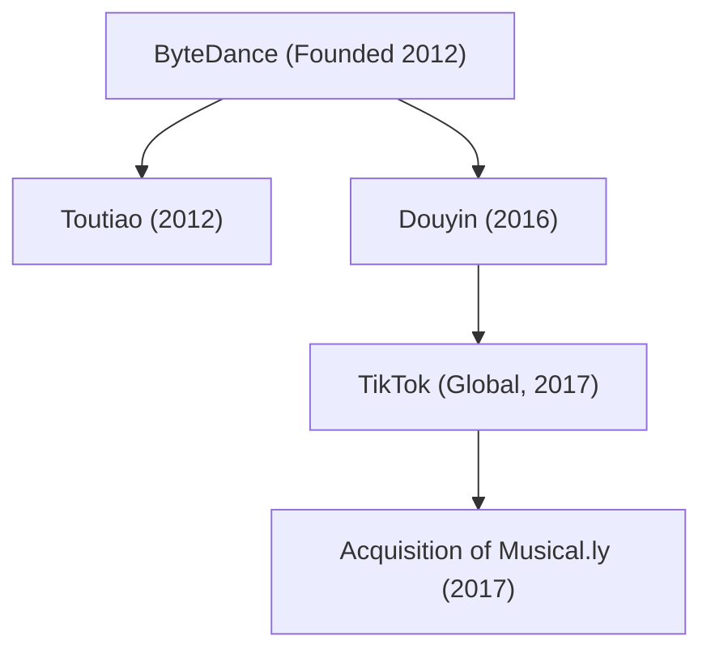

## 1. Introduction: The Unicorn That Rewrote the Global Tech Landscape

In the 21st-century technological landscape, few enterprises have expanded with the speed, disruptive ferocity, and cultural magnitude of ByteDance (字节跳动). In less than a decade, the company evolved from a scrappy, four-bedroom apartment startup in Beijing into the world's most valuable privately held decacorn. Its flagship international creation, TikTok, captured hundreds of millions of Gen Z and millennial users across the globe, dismantling the long-standing duopoly of Silicon Valley titans like Meta (Facebook/Instagram) and Alphabet (Google/YouTube).

This article presents an exhaustive, multi-dimensional retrospective of ByteDance: from its algorithmic inception and unique organizational architecture to the creation of Douyin and TikTok, its landmark acquisition of Musical.ly, and its navigation through high-stakes geopolitical crosswinds.

## 2. Founding Origins: Zhang Yiming's Vision of Algorithmic Distribution

The ByteDance saga began in early 2012 in Beijing, spearheaded by a 29-year-old software engineer named Zhang Yiming. A software engineering graduate from Nankai University, Zhang had cut his teeth at pioneering internet ventures, including the travel search platform Kuxun and the early Chinese microblogging service Fanfou. Through these experiences, Zhang reached a foundational, contrarian realization: *the smartphone revolution was about to obliterate traditional information discovery.*

In 2012, digital content discovery relied overwhelmingly on two paradigms:
1. **Search (Pull-based)**: Users manually formulated queries on search engines like Google or Baidu.
2. **Social (Push-based)**: Users consumed content curated by their friends and followed accounts on social graphs like Facebook, Twitter, and Sina Weibo.

Zhang envisioned a radical third paradigm: **pure, machine-learned personalization without a social graph**. He argued that users should not need to search or manually curate friend lists; instead, sophisticated artificial intelligence algorithms should continuously observe granular behavioral signals to serve hyper-personalized content tailored to each individual's latent interests.

### The Genesis of Toutiao (Today's Headlines)

In August 2012, ByteDance launched its foundational product: "Jinri Toutiao" (Today's Headlines). Devoid of an in-house editorial staff, Toutiao relied entirely on machine learning algorithms. The engine scraped, categorized, and scored content across the web, training its neural networks on real-time micro-signals: click-through rates, reading duration, scroll velocity, comment engagement, and time of day.

Within months, Toutiao demonstrated unprecedented daily engagement metrics, rapidly transforming into one of China's most lucrative mobile news hubs and generating the foundational cash flows that would finance ByteDance's aggressive expansion.

## 3. The Pivot to Short Video and the Emergence of Douyin (2016)

By 2015, Zhang Yiming foresaw the next monumental media shift: mobile data bandwidth was cheapening, smartphone displays and cameras were advancing, and user consumption was migrating from static text and images to immersive vertical video.

In September 2016, ByteDance launched "A.me," rapidly rebranded as **Douyin (抖音)**. Douyin was engineered as an intuitive, 15-second vertical video platform that lowered the barrier to content creation. Crucially, it supplied aspiring creators with an extensive library of licensed pop music tracks, synchronized background filters, and intelligent video stabilization tools.

Douyin exploded across China's urban youth. Unlike legacy video portals where users had to click thumbnails, Douyin pioneered the frictionless **infinite vertical swipe feed**. The application made passive discovery addictive: the moment the app opened, full-screen video with blaring audio played instantly, with zero cognitive friction required to watch the next clip.

## 4. Globalization Strategy: The Launch of TikTok and the Musical.ly Coup (2017)

Unlike many Chinese tech firms that prioritized domestic dominance before contemplating foreign expansion, ByteDance operated with a "Global from Day One" philosophy. In May 2017, ByteDance launched **TikTok**, the international twin of Douyin.

However, organic international user acquisition proved slow against established Western social networks. Zhang Yiming made a daring strategic masterstroke in November 2017: ByteDance acquired **Musical.ly**, a Shanghai- and California-based lip-syncing short-video app with an entrenched, highly active user base of roughly 60 million American and European teenagers, for approximately $1 billion.

In August 2018, ByteDance executed an audacious maneuver: it shut down the standalone Musical.ly application and consolidated all user accounts, video databases, and creator profiles directly into TikTok. 

This overnight migration gave TikTok critical mass in Western markets. Supercharged by ByteDance's relentless digital user acquisition spend and its unmatched recommendation engine, TikTok became the most downloaded app on Earth in 2018 and eclipsed one billion monthly active users by 2021—democratizing viral internet fame across borders, genres, and languages.

## 5. The Algorithmic Engine: ByteDance's True Moat

ByteDance outmaneuvered Silicon Valley titans because its recommendation architecture represents a fundamental philosophical departure from traditional platforms:

- **Social Graph (Meta, Twitter/X)**: Distribution is constrained by who you know and who you follow. Feeds are held hostage by relationship networks.
- **Content Graph / Interest Graph (TikTok)**: Distribution is governed purely by content engagement. The algorithm evaluates every video on its own intrinsic merits, pairing it with users whose behavioral patterns indicate an affinity for that specific subject matter.

Mathematically, the probability $P(E)$ of a user engaging with a specific video can be conceptualized through deep neural click-through and duration prediction models:

$$ P(E) = \sigma(W^T X + b) $$

Where:
- $X$ is a massive, multi-dimensional feature vector encoding user features (interaction history, retention rate by topic), video features (audio rhythm, extracted computer vision tags, visual semantic embeddings), and context (device type, geography, time of day).
- $W$ is the continuously trained matrix of model weights.
- $\sigma$ denotes an activation function (such as a sigmoid or softmax layer) outputting engagement probability.

TikTok's AI does not merely track likes or comments; it measures micro-signals at millisecond resolution:
- Did the user hesitate or pause their scroll?
- Did they watch the clip through to completion (completion rate)?
- Did they watch it loop multiple times?
- How many seconds elapsed before they swiped away?

This hyper-sensitive feedback loop allows a creator with zero followers to publish a video that garners tens of millions of views overnight if its engagement metrics are exceptional—truly democratizing virality.

## 6. Organizational Innovation: The "App Factory" Model

Behind ByteDance's relentless product rollout lies a unique corporate structure known as the **"App Factory" (Middle Platform / 中台)**. Rather than organizing around siloed, self-contained business units, ByteDance centralizes its three core engines:
1. **Shared AI & Algorithm Infrastructure**
2. **Centralized User Growth & Traffic Acquisition Engine**
3. **Unified Monetization & Ad Tech Machinery**

Under this structure, lightweight, autonomous product teams can brainstorm, develop, and test new applications in weeks. If an experiment gains viral algorithmic traction, the central platform funnels immense capital and marketing resources to scale it globally. If it stalls, the project is terminated immediately without dragging down organizational momentum.

This model facilitated aggressive multi-sector diversification:
- **Enterprise Collaboration (SaaS)**: Launched "Lark" (Feishu), an all-in-one productivity suite integrating real-time messaging, collaborative documents, video conferencing, and automated workflows.
- **Social Commerce**: Launched "TikTok Shop" (and Douyin E-commerce), revolutionizing retail by closing the loop between video discovery and direct in-app purchasing. It achieved massive market share in Southeast Asia and expanded rapidly into the US and UK.
- **Gaming & Interactive Media**: Established the "Nuverse" gaming division to produce and publish competitive mid-core and casual titles.
- **Hardware & Metaverse**: Acquired virtual reality pioneer "Pico" in 2021 to anchor its investments in spatial computing and next-generation immersive hardware.

## 7. Geopolitical Crosswinds and the Battle for Survival

ByteDance's unprecedented international breakthrough placed it squarely at the epicenter of the 21st-century technological cold war between the United States and China.

In 2020, following border skirmishes between India and China, the Indian government abruptly banned TikTok alongside hundreds of other Chinese-developed apps on national security grounds, wiping out TikTok's single largest international user base (roughly 200 million users) overnight.

Simultaneously in the United States, bipartisan national security concerns intensified regarding data privacy and algorithmic influence:
- Could the Chinese government demand access to US consumer data under domestic security legislation?
- Could algorithmic recommendation weights be covertly tweaked to shape foreign public discourse or spread propaganda?

To counter these concerns, ByteDance launched **"Project Texas"** in the United States—a multi-billion-dollar initiative partnering with Oracle to store all American user data on domestic cloud servers under strict, audited access protocols. In Europe, a similar framework was deployed under **"Project Clover."**

Despite these initiatives, legislative scrutiny culminated in April 2024 with the passage of the US "Protecting Americans from Foreign Adversary Controlled Applications Act," mandating that ByteDance divest TikTok's US operations to an approved non-adversary entity or face a total national ban. ByteDance immediately mounted a First Amendment constitutional challenge in US federal courts, sparking a historic legal and geopolitical battle over the future of the internet.

## 8. Conclusion: The Algorithmic Future and Modern Society

The story of ByteDance is an awe-inspiring testament to the power of artificial intelligence to dismantle established corporate monopolies. Zhang Yiming's core premise—that algorithms could connect users with information and entertainment far more efficiently than human social networks—has triumphed on an unprecedented global scale.

Yet ByteDance's staggering ascendancy has also brought society face-to-face with the immense complexities of algorithmic dopamine loops, youth mental health, and the fragmentation of the global open internet along geopolitical fault lines.

Whether TikTok continues as the pulsating center of world pop culture or is forced into geographic balkanization, ByteDance has permanently transformed the architecture of global media. Its journey will endure as one of the most consequential, audacious, and debated chapters in modern technological history.
